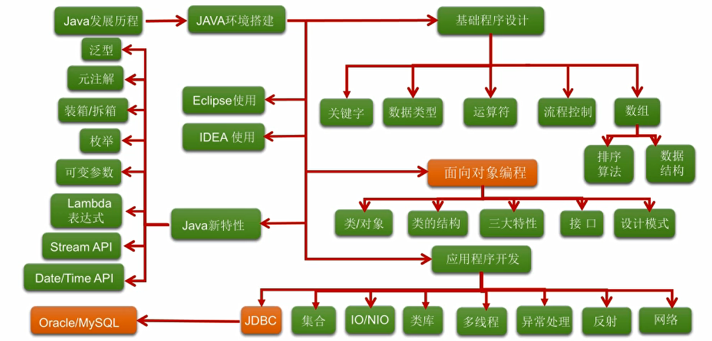

Java历史：（了解）
1、诞生于SUN（Standford University Network）
2、大概于1996年发布正式的第一版
3、Java之父：詹姆斯.高斯林
4、2009年SUN被Oracle（甲骨文）收购
5、目前学习（开发）的版本是Java8
6、最新版本：Java12
7、Java分为三大方向：JavaSE，JavaEE，JavaME
Java9尝试把JavaSE，JavaEE，JavaME合起来。用模块的方式进行区分。

Java语言诞生于SUN（Stanford University Network)公司，最初命名为Oak（橡树）Green Team小组成员James Gosling、Bill Joy、Patrick Naughton、Mike Sheridan，最初的目的：与家电一起使用，1994年，小组意识到 Oak 非常适合于互联网
1995年5月23日发布定名为Java
1996年1月，第一个JDK-JDK1.0正式版本诞生 
1996年4月，10个最主要的操作系统供应商申明将在其产品中嵌入JAVA技术 
1996年9月，约8.3万个网页应用了JAVA技术来制作 
1997年2月18日，JDK1.1发布 
1997年4月2日，JavaOne会议召开，参与者逾一万人，创当时全球同类会议规模之纪录 
1997年9月，JavaDeveloperConnection社区成员超过十万 
1998年2月，JDK1.1被下载超过2,000,000次 
1998年12月8日，JAVA2企业平台J2EE发布 
1999年6月，SUN公司发布Java的三个版本：标准版、企业版和微型版（J2SE、J2EE、J2ME） 
2000年5月8日，JDK1.3发布 
2000年5月29日，JDK1.4发布 
2001年6月5日，NOKIA宣布，到2003年将出售1亿部支持Java的手机 
2001年9月24日，J2EE1.3发布 
2002年2月26日，J2SE1.4发布，自此Java的计算能力有了大幅提升。 
2004年9月30日18:00PM，J2SE1.5发布，是Java语言的发展史上的又一里程碑事件。为了表示这个版本的重要性，J2SE1.5更名为J2SE5.0 
2005年6月，JavaOne大会召开，SUN公司公开Java SE 6。此时，Java的各种版本已经更名以取消其中的数字“2”：J2EE更名为Java EE, J2SE更名为Java SE，J2ME更名为Java ME。 
2006年11月13日，SUN公司宣布Java全线采纳GNU General Public License Version 2，从而公开了Java的源代码。
2009年4月20日甲骨文以现金收购Sun微系统公司，交易价格达74亿美元。
从2006年12月份Sun发布Java 6后，经过五年多的不懈努力在2011年7月底发布了Java 7正式版！这也是Sun被Oracle收购以来发行的第一个版本。而在三年后的今天，被冠名为“跳票王”的Oracle终于发布了Java 8的正式版，但对于很多开发者来说却比Java 7来的更漫长一些。主要原因还是因为Oracle原本计划在2013年发布正式版Java 8，却因受困于安全性的问题经过了两次跳票，经历9个里程碑版本。当然，我们更不愿意看到Oracle因如期发布而牺牲质量，把原先没有解决的一些缺陷的安全问题带到Java 8当中去。同时也很可能将放弃掉Lambda而导致广泛应用的可能性更小。不管怎么样，Java 8如今来了，全新“革命”而不再是“进化”的功能将会让无数开发者动容。
2014年3月18日Java8.0发布，这是继Java5.0以来变化最大的版本。一共有10大新特性。最主要的是Lambda表达式和强大的StreamAPI和新版的日期时间API，函数式接口和接口的默认方法和静态方法等。
2017年9月21日Java9的发布。Java 9的最主要目标是最大限度实现模块化以帮助人们实现积木式的应用编写。目的是帮助人们从JAR的束缚中解脱出来。该特性将贯穿整个Java库，并以单依赖图的方式重新整理依赖。Java 9会把所有三个Java开发平台统一起来，模块化特性会使得Java ME的可复用性得到增强，这将是反击Android和iOS的有力武器。
版本号 	名称 	中文名 	发布日期
JDK 1.1.4 	Sparkler 	宝石 	1997-09-12
JDK 1.1.5 	Pumpkin 	南瓜 	1997-12-13
JDK 1.1.6 	Abigail 	阿比盖尔--女子名 	1998-04-24
JDK 1.1.7 	Brutus 	布鲁图--古罗马政治家和将军 	1998-09-28
JDK 1.1.8 	Chelsea 	切尔西--城市名 	1999-04-08
J2SE 1.2 	Playground 	运动场 	1998-12-04
J2SE 1.2.1 	none 	无 	1999-03-30
J2SE 1.2.2 	Cricket 	蟋蟀 	1999-07-08
J2SE 1.3 	Kestrel 	美洲红隼 	2000-05-08
J2SE 1.3.1 	Ladybird 	瓢虫 	2001-05-17
J2SE 1.4.0 	Merlin 	灰背隼 	2002-02-13
J2SE 1.4.1 	grasshopper 	蚱蜢 	2002-09-16
J2SE 1.4.2 	Mantis 	螳螂 	2003-06-26
JavaSE 5.0 	Tiger 	老虎 	2004-09-30
JavaSE 6.0	Mustang 	野马	2006-04
JavaSE 7.0	Dolphin 	海豚	2011-07-28
Java SE 8.0	Spider	蜘蛛	2014-03-18
JavaSE9.0			2017-9-21

JavaSE  

基础程序设计

面向对象编程

应用程序开发

语法特性

企业级应用开发

JavaEE

服务器端  

Java  SE  ME   EE     就EE还能打了

2009年4月20日 Sun被Oracle收购了

2020年3月Java14来了 下半年Java15

JDK8开发

Oracle 听过没？没听过 呵呵   你Java哪里下的

了解新特性

诞生于SUN

James gosling  

Java稳定发展

稍微多  掉diao头发

熬夜多了 

2009年SUN被Oracle甲骨文收购了

目前学习（开发）的版本是Java8  or Java11

Java分为三大方向：JavaSE，JavaEE，JavaME
Java9尝试把JavaSE，JavaEE，JavaME合起来。用模块的方式进行区分。

企业级开发     可复用性 、 可扩展性 