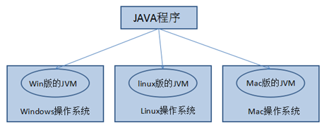
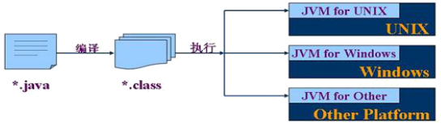
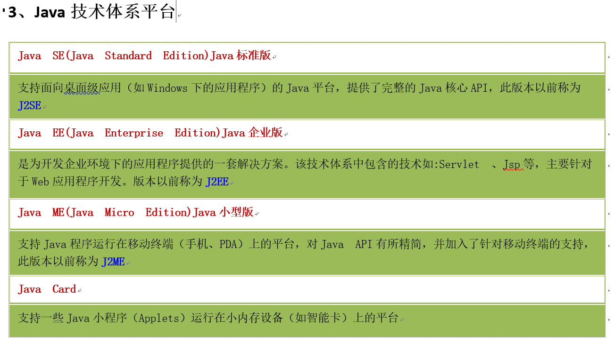

# Java语言运行机制

3、Java语言运行机制：跨平台
跨平台性：通过Java语言编写的应用程序在不同的系统平台上都可以运行。
“Write once , Run Anywhere”一次编写，处处运行。

原理：Java程序不是直接运行在操作系统上，而是运行在JVM（Java Virtual Machine）。
而不同的操作系统平台，可以安装不同的JVM。这个虚拟机只要下载安装就可以了，
程序员不用管，程序员只要关注自己的Java程序就可以。

Java程序开发和运行的步骤：
1、编写Java代码，保存的代码的文件.java
后缀名：.txt,.doc,.jpg，.mp4等
2、编译Java代码为字节码，字节码文件.class
为什么要编译为字节码呢？因为JVM只认识字节码，不认识Java代码
3、运行字节码
把字节码再转成CPU能执行的机器指令。

## （1）Java语言最主要的特点

?	特点一：面向对象
两个基本概念：类、对象
三大特性：封装、继承、多态
?	特点二：健壮性
吸收了C/C++语言的优点，但去掉了其影响程序健壮性的部分（如指针、内存的申请与释放等），提供了一个相对安全的内存管理和访问机制
?	特点三：跨平台性
跨平台性：通过Java语言编写的应用程序在不同的系统平台上都可以运行。“Write once , Run Anywhere”一次编写，处处运行。
原理：只要在需要运行 java 应用程序的操作系统上，先安装一个Java虚拟机 (JVM Java Virtual Machine) 即可。由JVM来负责Java程序在该系统中的运行。

因为有了JVM，同一个Java 程序在三个不同的操作系统中都可以执行。这样就实现了Java 程序的跨平台性。

## （2）Java两种核心机制

?	Java虚拟机（Java Virtal Machine）
JVM是一个虚拟的计算机，具有指令集并使用不同的存储区域。负责执行指令，管理数据、内存、寄存器。
对于不同的平台，有不同的虚拟机。
Java虚拟机机制屏蔽了底层运行平台的差别，实现了“一次编译，到处运行”。

?	垃圾收集机制（Garbage Collection）
1)	不再使用的内存空间应回收―― 垃圾回收。 
在C/C++等语言中，由程序员负责回收无用内存。
Java 语言消除了程序员回收无用内存空间的责任：它提供一种系统级线程跟踪存储空间的分配情况，并在JVM空闲时，检查并释放那些可被释放的存储空间。
2)	垃圾回收在Java程序运行过程中自动进行，程序员无法精确控制和干预。

## (3)我的

Java SE(Java Standard Edition)Java标准版
支持面向桌面级应用（如Windows下的应用程序）的Java平台，提供了完整的Java核心API，此版本以前称为J2SE
Java EE(Java Enterprise Edition)Java企业版
是为开发企业环境下的应用程序提供的一套解决方案。该技术体系中包含的技术如:Servlet 、Jsp等，主要针对于Web应用程序开发。版本以前称为J2EE
Java ME(Java Micro Edition)Java小型版
支持Java程序运行在移动终端（手机、PDA）上的平台，对Java API有所精简，并加入了针对移动终端的支持，此版本以前称为J2ME
Java Card
支持一些Java小程序（Applets）运行在小内存设备（如智能卡）上的平台

JavaME 

JavaSE

JavaEE

JavaEE是为开发企业环境下的应用程序提供的一套解决方案

Spring全家桶    Spring Spring MVC SpringBoot  SpringCloud SpringData SpringSecurity等等

跨平台

同一段代码

Write Once，Run AnyWhere.

一次编写到处运行的

JVM 只要下载安装就行了

程序员只要关注自己的Java程序就行了

我就想好好搞Java，找份工作，学校的屁事比较多点，

应该去实习积累经验的，做中学，最重要的是能完成任务，解决问题，去实习不要有学习的那种心态，不要钱你去实习？人家老板都不放心。大一暑假投简历实习 大二上逃了点课准备面试做项目实习了，大一、大二一直刷算法题中做项目中。

就应该一直刷算法的，别那里想搞搞这样想搞搞那里做做项目，这里做做项目不应该的呀。

我就是个傻逼，找度娘，谷老师呀Google，StackOverflow栈溢出？搜索问题讨论交流的社区很多很多大佬。

要做项目还不容易，imooc我看到挺多实战项目的，

Github更多的，多好呀。

Star,fork,follow后不知道干什么，下载起来不知道干什么，

一般不就是创建下数据库，执行SQL语句，IDEA导入，Maven自己下载依赖就能跑起来了。写两个就差多了

看的得底层、源码，人家都撸了好几次，我问他，解释非常清楚，为什么，怎么做，怎么用，怎么实现，卧槽都非常熟悉。

环境搭建起来 搭建我们第一个环境 

