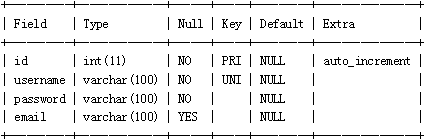
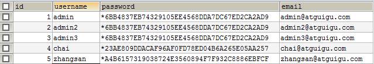

# 尚硅谷_JDBC课后习题自测

## 题目描述：

1、创建数据库test01_bookstore

2、创建如下表格

（1）图书表books


（2）用户表users



（3）订单表orders


（4）订单明细表order_items


3、使用sql语句在命令行或SQLyog中添加一些模拟数据

表books：


表users：


表orders：


表order_items：


4、使用JDBC实现往用户表中添加1个用户，注意密码存储使用mysql的password()函数进行加密




5、使用JDBC实现往图书表中添加1本图书

6、从键盘输入用户名和密码，模拟登录，使用JDBC实现验证用户名和密码是否正确，如果正确，显示登录成功，否则显示用户名或密码错误


7、使用JDBC实现查询所有图书信息

8、使用JDBC实现查询销量最大的图书信息

9、使用JDBC实现修改库存量小于10本的图书的库存量为100

10、从键盘输入用户名，实现查询该用户的订单和订单明细

11、使用JDBC实现删除订单“15275760194821”的相关信息，注意涉及到两张表

## 参考答案：

第1题-第3题的sql

```mysql
#创建数据库
CREATE DATABASE `test01_bookstore` CHARACTER SET utf8;

USE `test01_bookstore`;

#创建表
CREATE TABLE `books` (
  `id` INT(11) PRIMARY KEY NOT NULL AUTO_INCREMENT,
  `title` VARCHAR(100) NOT NULL,
  `author` VARCHAR(100) NOT NULL,
  `price` DOUBLE(11,2) NOT NULL,
  `sales` INT(11) NOT NULL,
  `stock` INT(11) NOT NULL,
  `img_path` VARCHAR(100) NOT NULL
) ENGINE=INNODB AUTO_INCREMENT=31 DEFAULT CHARSET=utf8;

/*Data for the table `books` */
INSERT  INTO `books`(`id`,`title`,`author`,`price`,`sales`,`stock`,`img_path`) VALUES 
(1,'解忧杂货店','东野圭吾',27.20,102,98,'upload/books/解忧杂货店.jpg'),
(2,'边城','沈从文',23.00,102,98,'upload/books/边城.jpg'),
(3,'中国哲学史','冯友兰',44.50,101,99,'upload/books/中国哲学史.jpg'),
(4,'忽然七日',' 劳伦',19.33,101,99,'upload/books/忽然七日.jpg'),
(5,'苏东坡传','林语堂',19.30,100,100,'upload/books/苏东坡传.jpg'),
(6,'百年孤独','马尔克斯',29.50,100,100,'upload/books/百年孤独.jpg'),
(7,'扶桑','严歌苓',19.80,100,100,'upload/books/扶桑.jpg'),
(8,'给孩子的诗','北岛',22.20,100,100,'upload/books/给孩子的诗.jpg'),
(9,'为奴十二年','所罗门',16.50,100,100,'upload/books/为奴十二年.jpg'),
(10,'平凡的世界','路遥',55.00,100,100,'upload/books/平凡的世界.jpg'),
(11,'悟空传','今何在',14.00,100,100,'upload/books/悟空传.jpg'),
(12,'硬派健身','斌卡',31.20,100,100,'upload/books/硬派健身.jpg'),
(13,'从晚清到民国','唐德刚',39.90,100,100,'upload/books/从晚清到民国.jpg'),
(14,'三体','刘慈欣',56.50,100,100,'upload/books/三体.jpg'),
(15,'看见','柴静',19.50,100,100,'upload/books/看见.jpg'),
(16,'活着','余华',11.00,100,100,'upload/books/活着.jpg'),
(17,'小王子','安托万',19.20,100,100,'upload/books/小王子.jpg'),
(18,'我们仨','杨绛',11.30,100,100,'upload/books/我们仨.jpg'),
(19,'生命不息,折腾不止','罗永浩',25.20,100,100,'upload/books/生命不息.jpg'),
(20,'皮囊','蔡崇达',23.90,100,100,'upload/books/皮囊.jpg'),
(21,'恰到好处的幸福','毕淑敏',16.40,100,100,'upload/books/恰到好处的幸福.jpg'),
(22,'大数据预测','埃里克',37.20,100,100,'upload/books/大数据预测.jpg'),
(23,'人月神话','布鲁克斯',55.90,100,100,'upload/books/人月神话.jpg'),
(24,'C语言入门经典','霍尔顿',45.00,100,100,'upload/books/C语言入门经典.jpg'),
(25,'数学之美','吴军',29.90,100,100,'upload/books/数学之美.jpg'),
(26,'Java编程思想','埃史尔',70.50,100,100,'upload/books/Java编程思想.jpg'),
(27,'设计模式之禅','秦小波',20.20,100,100,'upload/books/设计模式之禅.jpg'),
(28,'图解机器学习','杉山将',33.80,100,100,'upload/books/图解机器学习.jpg'),
(29,'艾伦图灵传','安德鲁',47.20,100,100,'upload/books/艾伦图灵传.jpg'),
(30,'教父','马里奥普佐',29.00,100,100,'upload/books/教父.jpg');

CREATE TABLE `users` (
  `id` INT(11) PRIMARY KEY NOT NULL AUTO_INCREMENT,
  `username` VARCHAR(100) UNIQUE KEY NOT NULL,
  `password` VARCHAR(100) NOT NULL,
  `email` VARCHAR(100) DEFAULT NULL
) ENGINE=INNODB AUTO_INCREMENT=5 DEFAULT CHARSET=utf8;

/*Data for the table `users` */
INSERT  INTO `users`(`id`,`username`,`password`,`email`) VALUES
 (1,'admin',PASSWORD('123456'),'admin@atguigu.com'),
 (2,'admin2',PASSWORD('123456'),'admin2@atguigu.com'),
 (3,'admin3',PASSWORD('123456'),'admin3@atguigu.com'),
 (4,'chai',PASSWORD('123'),'chai@atguigu.com');

CREATE TABLE `orders` (
  `id` VARCHAR(100) PRIMARY KEY NOT NULL,
  `order_time` DATETIME NOT NULL,
  `total_count` INT(11) NOT NULL,
  `total_amount` DOUBLE(11,2) NOT NULL,
  `state` INT(11) NOT NULL,
  `user_id` INT(11) NOT NULL,
  CONSTRAINT `orders_users_id_fk` FOREIGN KEY (`user_id`) REFERENCES `users` (`id`)
) ENGINE=INNODB DEFAULT CHARSET=utf8;

/*Data for the table `orders` */
INSERT  INTO `orders`(`id`,`order_time`,`total_count`,`total_amount`,`state`,`user_id`) VALUES 
('15275760194821','2018-05-29 14:40:19',4,114.03,2,1),
('15294258455691','2018-06-20 00:30:45',2,50.20,0,1);


CREATE TABLE `order_items` (
  `id` INT(11) PRIMARY KEY NOT NULL AUTO_INCREMENT,
  `count` INT(11) NOT NULL,
  `amount` DOUBLE(11,2) NOT NULL,
  `title` VARCHAR(100) NOT NULL,
  `author` VARCHAR(100) NOT NULL,
  `price` DOUBLE(11,2) NOT NULL,
  `img_path` VARCHAR(100) NOT NULL,
  `order_id` VARCHAR(100) NOT NULL,
  CONSTRAINT `order_items_orders_id_fk` FOREIGN KEY (`order_id`) REFERENCES `orders` (`id`) ON DELETE CASCADE
) ENGINE=INNODB AUTO_INCREMENT=7 DEFAULT CHARSET=utf8;

/*Data for the table `order_items` */
INSERT  INTO `order_items`
(`id`,`count`,`amount`,`title`,`author`,`price`,`img_path`,`order_id`) VALUES 
(1,1,27.20,'解忧杂货店','东野圭吾',27.20,'static/img/default.jpg','15275760194821'),
(2,1,23.00,'边城','沈从文',23.00,'static/img/default.jpg','15275760194821'),
(3,1,44.50,'中国哲学史','冯友兰',44.50,'static/img/default.jpg','15275760194821'),
(4,1,19.33,'忽然七日',' 劳伦',19.33,'static/img/default.jpg','15275760194821'),
(5,1,27.20,'解忧杂货店','东野圭吾',27.20,'static/img/default.jpg','15294258455691'),
(6,1,23.00,'边城','沈从文',23.00,'static/img/default.jpg','15294258455691');
```

第4题

```java
package com.atguigu.jdbc;

import java.sql.Connection;
import java.sql.DriverManager;
import java.sql.PreparedStatement;
import java.util.Scanner;

import org.junit.Test;

public class Test04 {
	@Test
	public void test()throws Exception{
		//从键盘输入用户信息，添加到day04_test01_bookstore库的users表中
		Scanner input = new Scanner(System.in);
		
		System.out.print("请输入用户名：");
		String username = input.next();
		
		System.out.print("请输入密码：");
		String password = input.next();
		
		System.out.print("请输入邮箱：");
		String email = input.next();
		
		//1、注册驱动
		Class.forName("com.mysql.jdbc.Driver");
		
		//2、获取连接
		Connection conn = DriverManager.getConnection("jdbc:mysql://localhost:3306/day04_test01_bookstore", "root", "1234");
		
		//3、编写sql
		String sql = "insert into users values(null,?,password(?),?)";
		
		//4、创建PreparedStatement
		PreparedStatement pst = conn.prepareStatement(sql);//此时的sql带?的
		
		//加入一步，设置?的值
		pst.setString(1, username);//1表示第1个?
		pst.setString(2, password);//2表示第2个?
		pst.setString(3, email);//3表示第3个?
		
		//5、执行sql
		int len = pst.executeUpdate();
		System.out.println(len>0?"添加成功":"添加失败");
		
		//6、关闭
		pst.close();
		conn.close();
		input.close();
	}
}
```

第5题

```java
package com.atguigu.jdbc;

import java.sql.Connection;
import java.sql.DriverManager;
import java.sql.PreparedStatement;

import org.junit.Test;

public class Test05 {
	@Test
	public void test()throws Exception{
		//1、注册驱动
		Class.forName("com.mysql.jdbc.Driver");
		
		//2、获取连接
		Connection conn = DriverManager.getConnection("jdbc:mysql://localhost:3306/day04_test01_bookstore", "root", "1234");
		
		//3、编写sql
		String sql = "insert into books(`id`,`title`,`author`,`price`,`sales`,`stock`,`img_path`) values(null,?,?,?,?,?,?)";
		
		//4、创建PreparedStatement
		PreparedStatement pst = conn.prepareStatement(sql);//此时的sql带?的
		
		//加入一步，设置?的值
		pst.setString(1, "《从入门到放弃》");//1表示第1个?
		pst.setString(2, "柴林燕");//2表示第2个?
		pst.setDouble(3, 88.8);//3表示第3个?
		pst.setInt(4, 0);
		pst.setInt(5, 100);
		pst.setString(6, "upload/books/从入门到放弃.jpg");
		
		//5、执行sql
		int len = pst.executeUpdate();
		System.out.println(len>0?"添加成功":"添加失败");
		
		//6、关闭
		pst.close();
		conn.close();
	}
}
```

第6题

```java
package com.atguigu.jdbc;

import java.sql.Connection;
import java.sql.DriverManager;
import java.sql.PreparedStatement;
import java.sql.ResultSet;
import java.util.Scanner;

public class Test06 {
	public static void main(String[] args)throws Exception {
		//从键盘输入用户名和密码，模拟登录
		Scanner input = new Scanner(System.in);
		
		System.out.println("请登录");
		System.out.print("请输入用户名：");
		String username = input.next();
		
		System.out.print("请输入密码：");
		String password = input.next();
		
		//1、注册驱动
		Class.forName("com.mysql.jdbc.Driver");
		
		//2、获取连接
		Connection conn = DriverManager.getConnection("jdbc:mysql://localhost:3306/day04_test01_bookstore", "root", "1234");
		
		//3、编写sql
		String sql = "select * from users where username = ? and password = password(?)";
		
		//4、创建PreparedStatement
		PreparedStatement pst = conn.prepareStatement(sql);//此时的sql带?的
		
		//加入一步，设置?的值
		pst.setString(1, username);//1表示第1个?
		pst.setString(2, password);//2表示第2个?
		
		//5、执行sql
		ResultSet rs = pst.executeQuery();
		if(rs.next()){
			System.out.println("登录成功");
		}else{
			System.out.println("登录失败，用户名或密码错误");
		}
		
		//6、关闭
		rs.close();
		pst.close();
		conn.close();
		input.close();		
	}
}

```

第7题

```java
package com.atguigu.jdbc;

import java.sql.Connection;
import java.sql.DriverManager;
import java.sql.PreparedStatement;
import java.sql.ResultSet;

public class Test07 {
	public static void main(String[] args)throws Exception {
		//1、注册驱动
		Class.forName("com.mysql.jdbc.Driver");
		
		//2、获取连接
		Connection conn = DriverManager.getConnection("jdbc:mysql://localhost:3306/day04_test01_bookstore", "root", "1234");
		
		//3、编写sql
		String sql = "select `id`,`title`,`author`,`price`,`sales`,`stock`,`img_path` from books";
		
		//4、创建PreparedStatement
		PreparedStatement pst = conn.prepareStatement(sql);//此时的sql带?的
		
		//5、执行sql
		ResultSet rs = pst.executeQuery();
		while(rs.next()){
			for (int i = 1; i <= 7; i++) {
				System.out.print(rs.getObject(i)+"\t");
			}
			System.out.println();
		}
		
		//6、关闭
		rs.close();
		pst.close();
		conn.close();
	}
}

```

第8题

```java
package com.atguigu.jdbc;

import java.sql.Connection;
import java.sql.DriverManager;
import java.sql.PreparedStatement;
import java.sql.ResultSet;

public class Test08 {
	public static void main(String[] args)throws Exception {
		//1、注册驱动
		Class.forName("com.mysql.jdbc.Driver");
		
		//2、获取连接
		Connection conn = DriverManager.getConnection("jdbc:mysql://localhost:3306/day04_test01_bookstore", "root", "1234");
		
		//3、编写sql
		String sql = "select `id`,`title`,`author`,`price`,`sales`,`stock`,`img_path` from books where sales = (select max(sales) from books)";
		
		//4、创建PreparedStatement
		PreparedStatement pst = conn.prepareStatement(sql);//此时的sql带?的
		
		//5、执行sql
		ResultSet rs = pst.executeQuery();
		while(rs.next()){
			for (int i = 1; i <= 7; i++) {
				System.out.print(rs.getObject(i)+"\t");
			}
			System.out.println();
		}
		
		//6、关闭
		rs.close();
		pst.close();
		conn.close();
	}
}

```

第9题

```java
package com.atguigu.jdbc;

import java.sql.Connection;
import java.sql.DriverManager;
import java.sql.PreparedStatement;

public class Test09 {
	public static void main(String[] args)throws Exception {
		//1、注册驱动
		Class.forName("com.mysql.jdbc.Driver");
		
		//2、获取连接
		Connection conn = DriverManager.getConnection("jdbc:mysql://localhost:3306/day04_test01_bookstore", "root", "1234");
		
		//3、编写sql
		String sql = "update books set `stock` = 100 where stock < 10";
		
		//4、创建PreparedStatement
		PreparedStatement pst = conn.prepareStatement(sql);//此时的sql带?的
		
		//5、执行sql
		int len = pst.executeUpdate();
		System.out.println(len>=0 ? "修改成功" : "修改失败");
		//6、关闭
		pst.close();
		conn.close();
	}
}

```

第10题

```java
package com.atguigu.jdbc;

import java.sql.Connection;
import java.sql.DriverManager;
import java.sql.PreparedStatement;
import java.sql.ResultSet;
import java.util.Scanner;

public class Test10 {
	public static void main(String[] args)throws Exception {
		Scanner input = new Scanner(System.in);
		
		System.out.print("请输入用户名：");
		String username = input.next();
		
		//1、注册驱动
		Class.forName("com.mysql.jdbc.Driver");
		
		//2、获取连接
		Connection conn = DriverManager.getConnection("jdbc:mysql://localhost:3306/day04_test01_bookstore", "root", "1234");
		
		//3、编写sql
		String sql = "SELECT * FROM order_items INNER JOIN orders ON order_items.order_id = orders.id WHERE user_id = (SELECT id FROM users WHERE username = ?)";
		
		//4、创建PreparedStatement
		PreparedStatement pst = conn.prepareStatement(sql);//此时的sql带?的
		
		pst.setString(1, username);
		
		//5、执行sql
		ResultSet rs = pst.executeQuery();
		while(rs.next()){
			for (int i = 1; i <= 14; i++) {
				System.out.print(rs.getObject(i)+"\t");
			}
			System.out.println();
		}
		
		//6、关闭
		rs.close();
		pst.close();
		conn.close();		
		input.close();
	}
}

```

第11题

```mysql
因为定义表结构时，设置了级联删除，因此删除主表，从表对应记录会自动删除
```

```java
package com.atguigu.jdbc;

import java.sql.Connection;
import java.sql.DriverManager;
import java.sql.PreparedStatement;

public class Test11 {
	public static void main(String[] args)throws Exception {
		//1、注册驱动
		Class.forName("com.mysql.jdbc.Driver");
		
		//2、获取连接
		Connection conn = DriverManager.getConnection("jdbc:mysql://localhost:3306/day04_test01_bookstore", "root", "1234");
		
		//3、编写sql
		String sql = "DELETE FROM orders WHERE id = '15275760194821'";
		
		//4、创建PreparedStatement
		PreparedStatement pst = conn.prepareStatement(sql);//此时的sql带?的
		
		//5、执行sql
		int len = pst.executeUpdate();
		System.out.println(len>=0 ? "删除成功" : "删除失败");
		//6、关闭
		pst.close();
		conn.close();
	}
}

```

