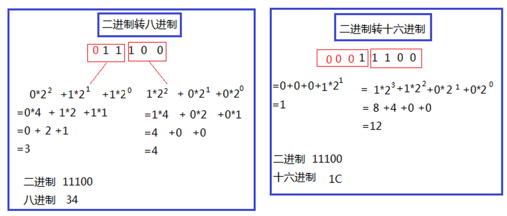
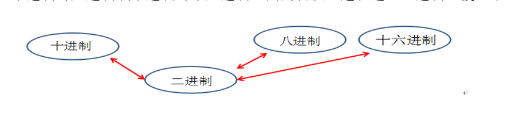

# 基础语法

主要介绍标识符、变量、数据类型、运算符。

# 一、标识符

Java 对各种变量、方法和类等要素命名时使用的字符序列称为标识符。简单的说，凡是程序员自己命名的部分都可以称为标识符。即给类、变量、方法、包等命名的字符序列，称为==标识符==。

## 1、标识符的命名规则

定义合法标识符规则

（Java语言规范是描述Java语言的官方文档。可以从网站http://docs.oracle.com/javase/specs上阅读或下载）

（1）Java的标识符只能使用26个英文字母大小写，0-9的数字，下划线_，美元符号$

（2）不能使用Java的关键字（包含保留字）和特殊值

（3）数字不能开头      error: 8hello错误的

（4）标识符不能包含空格

（5）Java钟严格区分大小写，大小写敏感

2、标识符的命名规范

标识符的命名**规范**            （起名不规范，两行泪，会被打的）。

在起名字时，为了提高阅读性，要尽量有意义，“**见名知意**”。

（1）见名知意

（2）类名、接口名等：每个单词的首字母都大写，形式：XxxYyyZzz，

例如：HelloWorld，String，System等

（3）变量、方法名等：从第二个单词开始首字母大写，其余字母小写，形式：xxxYyyZzz。

例如：age,name,bookName,main

（4）包名等：每一个单词都小写，单词之间使用点.分割，形式：xxx.yyy.zzz，

例如：java.lang

（5）常量名等：每一个单词都大写，单词之间使用下划线_分割，形式：XXX_YYY_ZZZ，

例如：MAX_VALUE,PI

## 2、关键字、保留字、特殊值

 Java关键字、含义 [https://blog.csdn.net/qq_41569732/article/details/103209422](https://blog.csdn.net/qq_41569732/article/details/103209422)

关键字、保留字和特殊值：全部小写（50+3）
（1）关键字：在Java中被赋予的特定含义的单词。
基本数据类型相关（8个）：byte、short、int、long、float、double、char、boolean 

 8位整数类型（一个字节）、16位整数类型、32位整数类型、64位长整数类型、单精度浮点数类型 四字节、双精度浮点数类型八个字节、 布尔类型

流程控制语句相关（10个）：if、else、switch、case、default、break、for、while、do、continue

判断某个对象是否是某种类型的实例对象运算符：instanceof
定义类：class
创建类的对象：new
包相关：package、import
权限修饰符：public、protected、（缺省）、private
继承类：extends
定义接口：interface
实现接口：implements
当前对象：this
父类引用：super
表示无返回值：void
结束方法：return
定义枚举：enum
其他修饰符：abstract、static、final、native
异常处理：try、catch、finally、throws、throw
多线程同步和安全：synchronized、volatile
和IO序列化相关：transient
和单元测试相关：assert
其他：strictfp（strictfp 关键字可应用于类、接口或方法。如果你想让你的浮点运算更加精确，严格遵守FP-strict的限制,符合IEEE-754规范，而且不会因为不同的硬件平台所执行的结果不一致的话，可以用关键字strictfp.
）
（2）保留字：在Java中注册但还未使用
goto、const
（3）特殊值：true、false、null

Java 核心技术系列）书名原文： Core Java Volume I—F undamental s (Tenth Edition)

附录A Java关键字

按字母顺序排列

关键字	含义
abstract	抽象类或方法
assert	用来查找内部程序错误
boolean	布尔类型
break	跳出一个switch或循环
byte	8位整数类型（一个字节）
case	switch的一个分支
catch	捕获异常的try块子句
char	Unicode字符类型 （两个字节）
class	定义一个类类型
const	未使用 (保留关键字，没有具体含义)
continue	在循环末尾继续
default	switch 的缺省子句
do	do/while 循环最前面的语句
double	双精度浮点数类型
else	if语句的else子句
enum	枚举类型
extends	定义一个类的父类
final	一个常量，或不能覆盖的一个类或方法
finally	try块中总会执行的部分
float	单精度浮点数类型 四字节
for	一种循环类型
goto	未使用
if	一个条件语句
implements	定义一个类实现的接口
import	导入一个包
instanceof	测试一个对象是否为一个类的实例
int	32位整数类型
interface	一种抽象类型，其中包含可以由类实现的方法
long	64位长整数类型
native	由宿主系统实现的一个方法
new	分配一个新对象或数组
null	一个空引用（需要说明， null从技术上讲是一个直接量， 而不是关键字）
package	包含类 的一个包
private	这个特性只能由该类的方法访问
protected	这个特性只能由该类、其子类以及用一个包中的其他类的方法访问
public	这个特性可以由所有类的方法访问
return	从一个方法返回
short	16位整数类型
static	这个特性是这个类特有的，而属于这个类的对象
strictfp	对浮点数计算使用严格的规则
switch	一个选择语句
super	超类对象或构造函数
synchronized	对线程而言是原子的方法或代码块
this	当前类的一个方法或构造函数的隐含参数
throw	抛出一个异常
throws	一个方法可能抛出的异常
transient	标志非永久的数据
try	捕获异常的代码块
void	指示一个方法不返回如何值
volatile	确保一个字段可以由多个线程访问
while	一种循环

## 3、code

概念

```java
/*
标识符：在Java中对类名、变量名、方法名等这些要素进行命名的字符序列称为标识符。
通俗的理解：凡是程序员自己命名的地方都叫做标识符。
见名知意   单词量
1、标识符的命名规则（必须遵守，否则编译或运行错误）
（1）Java的标识符必须用26个英文字母的大小写、数字0-9，美元符号$，下划线_
（2）Java的标识符不能使用关键字（包含保留字）和特殊值
例如：class,public,static,void等
一共不能用的有50个关键字+3个特殊值
（3）不能使用空格
（4）数字不能开头
（5）Java的标识符严格区分大小写

2、标识符的命名规范（建议遵守，不遵守会被鄙视）
不遵守杀了你 傻逼玩意 谁他妈命名的
（1）见名知意
让别人一看就知道这个类、变量、方法的意义在哪里。

（2）类名、接口名等，要求每一个单词的首字母大写，形式：XxxYyyZzz
例如：HelloWorld，BiaoShiFu
标识符    类名、接口名 要求每一个单词的首字母大小 AaaBbbCcc
（3）变量名、方法名等：要求从第二个单词开始，首字母大写，其余字母小写，
形式：xxxYyyZzz
例如：main()方法，println()方法，print()方法，nextInt()方法
变量名 方法名    驼峰
（4）包名等：要求所有单词都小写，每个单词之间使用.分割
形式：xxx.yyy.zzz
例如：java.lang,java.util,java.io,java.text,java.time等
包名  所有单词小写 . 分割
（5）常量名：要求所有单词都大写，每个单词之间使用_分割
形式：XXX_YYY_ZZZ
例如：PI（圆周率），MAX_VALUE（最大值）

*/
//class Biao Shi Fu{}//错误的，因为包含空格
//class 2Test{}//错误的，数字不能开头
class BiaoShiFu{
}
```


# 二、变量

## 1、变量的概念

变量的作用：变量用来存储数据。

变量的本质：代表内存的一块存储区域，内存的一块存储区域。

变量的值：变量中的值是可以改变的。


声明变量：数据类型 变量名;  `String name;`

变量赋值：变量名 = 变量值;`name = "菜鸡文"`

声明变量和变量的赋值可以同时进行，也可以分开进行。但是在变量被访问之前，必须有值。

例如：数据类型 变量名 = 变量初始值;`String name="菜鸡文"`

## 2、变量的三要素

1、数据类型

2、变量名

3、值

数据类型：决定内存大小，可以存什么值
变量名：如何访问这块存储区域
变量值：里面存储的数据

## 3、变量的使用应该注意什么？

要求：

* 变量必须先声明后使用
* 变量再使用之前必须有初始值
* 变量有作用域

* 在同一个作用域中不能重名


1、先声明后使用

> 如果没有声明，会报“找不到符号”错误

2、在使用之前必须初始化

> 如果没有初始化，会报“未初始化”错误

3、变量有作用域

> 如果超过作用域，也会报“找不到符号”错误

4、在同一个作用域中不能重名


## 4、变量的声明和赋值、使用的语法格式？

1、变量的声明的语法格式：

```java
数据类型  变量名;
例如：
int age;
String name;
double weight;
char gender;
boolean isMarry;
```

2、变量的赋值的语法格式：

```java
变量名 = 值;
例如：
String name = "菜鸡文";//字符串的常量必须用""（双引号）
char gender = '女';//单字符的常量，必须用''（单引号）
double weight = 50.5;//小数类型
boolean marry = true;//布尔类型    真的，假的，成立，不成立
```

3、变量的使用的语法格式：

```java
通过变量名直接引用

例如：
(1)输出变量的值
System.out.print(name);
System.out.print("姓名：" + name);//""中的内容会原样显示
System.out.print("name = " + name);
(2)计算
age = age + 1;
```

## 5、code

变量

```java
/*
环境变量：path
环境变量是给操作系统找xx命令的路径。
path  value

变量：
1、作用：用来存储值（数据）
在Java中，变量本质上，就是代表一块内存区域。
变量中的数据是存储在JVM内存中。
内存区域 什么的内存呢  OS内存  JVM占OS内存一部分的  小块
2、变量有三个要素：
数据类型 变量名  值  String name = "菜鸡文";
（1）数据类型
是用来存储：字符串、小数、整数、单个字符、布尔值、对象....
String  double float byte short int long char boolean
（2）变量名
在程序中，通过变量名来进行访问这块内存及其里面的数据
变量名   访问  内存里面的数据
（3）值
变量中存的具体的值
变量中的值是可以变的
你的值放到你那里  但可以被覆盖了  重新指向什么 还是删除了再指向  垃圾回收 重新指向了
*/
class TestVariable{
    public static void main(String[] args){
        //想要用一个变量，来存储年龄
        //int就是数据类型
        //age就是变量名
        //18就是变量的值
        int age = 18;
        System.out.println(age);

        age = age + 1;

        System.out.println(age);
    }
}
```


变量定义使用

```java
/*
Define：定义，声明
Use：使用
Variable：变量

变量使用的原则：
（1）先声明后使用
包括后面用到的类、方法等，都是遵循先声明后使用
你要声明再使用
声明个女朋友   new一个
光使用不声明？？？。。。
（2）变量必须先初始化（第一次赋值）再访问它的值（打印、计算、比较操作）
必须先初始化
（3）变量的声明，在同一个作用域中，只能声明一次，但是赋值可以很多次
作用域：从变量声明处开始，到它所属的{}结束
我一直给你 一直给你 之前的都没了的
1、如何声明一个变量？
格式：
	数据类型 变量名;

2、如何给变量赋值？
格式：
	变量名 = 变量值;

int double char boolean String
常用的变量的数据类型（刚开始）：
int（整数）
double（小数）
char（单个字符）
String（字符串）
*/
class DefineAndUseVariable{
    public static void main(String[] args){
        //int age;//声明
        //age = 18;//赋值

        //也可以把声明和第一次赋值合并成一句
        int age = 18;
        //	int age = 19;//错误的，第二次赋值不用再加数据类型
        age = 19;//第二次赋值
        System.out.println(age);

        if(true){
            int num = 0;
        }
        //System.out.println(num);//错误的，出了num的作用域

        String name = "菜鸡文";//字符串的常量必须用""（双引号）
        char gender = '女';//单字符的常量，必须用''（单引号）
        double weight = 50.5;//小数类型
        boolean marry = true;//布尔类型    真的，假的，成立，不成立

    }

    public static void test(){
        //System.out.println(age);//错误的，出了age的作用域
    }
}
```


练习 

打印个人信息 

```java
/*
练习1：打印个人信息

（1）数据类型
"xxx" -->字符串
10-->整数，整型
'x'-->字符，单个字符
true-->布尔值，逻辑值，它只有两种情况，true和false
70.5-->小数类型
（2）常量
字符串的常量必须用""（双引号）
单字符的常量，必须用''（单引号）
其他整数、小数、布尔等不需要加符号。

System.out.println(xx);  输出xx之后换行，ln==line
System.out.print(xx);输出xx之后不换行，下面的输出内容就会接着输出
*/
class TestExer1{
    public static void main(String[] args){
        System.out.println("菜鸡文");
        System.out.println(18);
        System.out.println('拿');
        System.out.println(false);
        System.out.println(70);
        System.out.println("--------------------------------");

        System.out.print("姓名：");
        System.out.print("菜鸡文");
        //菜鸡文
        //18
        //拿
        //false
        //70
        //--------------------------------
        //姓名：菜鸡文
        //Process finished with exit code 0
    }
}

```

打印个人信息
个人信息使用变量保存

```java
/*
练习2：打印个人信息
个人信息使用变量保存
*/
class TestExer2{
    public static void main(String[] args){
        String name = "菜鸡文";
        String password = String.valueOf(123456);
        int age = 18;
        char gender = '男';
        double height = 178.0;
        double weight = 70.5;
        boolean marry = false;

        System.out.println(name);
        System.out.println(password);
        System.out.println(age);
        System.out.println(gender);
        System.out.println(height);
        System.out.println(weight);
        System.out.println(marry);
        System.out.println("---------------------");

		/*
		""中的内容，原因显示
		name是变量，在显示的时候，不是显示name单词，而是把name变量中存的值取出来显示，所以这里name不加""
		"姓名：" + name：把姓名:和name变量中的值拼接起来一起显示
		*/
        System.out.println("姓名：" + name);
        System.out.println("年龄：" + age);
        System.out.println("性别：" + gender);
        System.out.println("身高：" + height);
        System.out.println("体重：" + weight);
        System.out.println("是否已婚：" + marry);
    }
}
```

声明一些变量，来保存，一份图书信息：

```java
/*
练习3：
声明一些变量，来保存，一份图书信息：
书名：
作者：
价格：
销量：
库存量：
是否是促销产品：

*/
class TestExer3{
    public static void main(String[] args){
		/*
		String的S是大写的
		*/
        String bookName = "《Java从入门到放弃》";
        String author = "菜鸡文";
        double price = 100.0;
        int sale = 0;
        int amount = 100;
        boolean cu = true;

        System.out.println("书名：" + bookName);
        System.out.println("作者：" + author);
        System.out.println("价格：" + price);
        System.out.println("销量：" + sale);
        System.out.println("库存量：" + amount);
        System.out.println("是否促销：" + cu);
        //书名：《Java从入门到放弃》
        //作者：菜鸡文
        //价格：100.0
        //销量：0
        //库存量：100
        //是否促销：true
    }
}
```


# 三、 数据类型


Java是一种强类型语言。这就意味着必须为每一个变量声明一种类型。在Java中，一共有8种（primitive type）基本类型，其中有4种整型（byte、short、int、long）、2种浮点类型（float、double）、1种用于表示Unicode编码的字符单元的字符类型char和1种用于表示真值的boolean类型。

基本数据类型相关（8个）：byte、short、int、long、float、double、char、boolean 。

 8位整数类型、16位整数类型、32位整数类型、64位长整数类型、32位单精度浮点数类型、64位双精度浮点数类型、 布尔类型。

### 1 、Java数据类型的分类

1、基本数据类型

​	8种：整型系列（byte,short,int,long）、浮点型(float,double)、单字符型（char）、布尔型（boolean）。

byte（1个字节）short（2个字节）int（4个字节，整数的默认类型）long（8个字节）
字节byte：1个字节，-128~127
短整型short：2个字节，-32768~32767。

浮点型：float（4个字节）double（8个字节，小数的默认类型）。

字符型：char（2个字节）。

布尔型：boolean（只有两个值true和false）。

2、引用数据类型

​	类、接口、数组、枚举.....

类（class）/接口（interface）eg:String字符串，数组（[]）。泛型（<>）。


基本数据类型：整型、浮点型、字符型、布尔型

引用数据类型： 类、接口、数组、枚举


### 2、 Java的基本数据类型

1、整型系列

（1）byte：字节类型

占内存：1个字节

存储范围：-128~127

（2）short：短整型类型

占内存：2个字节

存储范围：-32768~32767

（3）int：整型

占内存：4个字节

存储范围：-2的31次方 ~ 2的31次方-1

（4）long：整型

占内存：8个字节

存储范围：-2的63次方 ~ 2的63次方-1

> 注意：如果要表示某个常量数字它是long类型，那么需要在数字后面加L


2、浮点型系列（小数）

（1）float：单精度浮点型

占内存：4个字节

精度：科学记数法的小数点后6~7位

> 注意：如果要表示某个常量数字是float类型，那么需要在数字后面加F或f

（2）double：双精度浮点型

占内存：8个字节

精度：科学记数法的小数点后15~16位


3、单字符类型

char：字符类型

占内存：2个字节

Java中使用的字符集：Unicode编码集

字符的三种表示方式：

（1）'一个字符'

例如：'A'，'0'，'尚'

（2）转义字符

```
\n：换行
\r：回车
\t：Tab键
\\：\
\"：”
\'：
\b：删除键Backspace
```

（3）\u字符的Unicode编码值的十六进制型

例如：\u5c1a代表'尚'


4、布尔类型

boolean：只能存储true或false


5、注意

1. Java的整型常量默认为 int 型，如果想要表示某个整数值是long型时，需要在值后面加L或l ,1与l分不清，一般是使用L来表示的 eg: `long a = 1L;`。java程序中变量常声明为int型，除非不足以表示大数，才使用long。经常使用int呀 整型数据。
2. Java 的浮点型常量默认为double型，声明float型常量，须后加‘f’或‘F’ eg:`float f=3.14F;`。float可以保证十进制科学计数法小数点后6位有效精度和第7位的部分精度。double可以保证十进制科学计数法小数点后15位有效精度和第16位的部分精度。
3. 字符型的值必须使用单引号，只能而且必须存储单个字符，不能是空单引号。例如：’a’、’\n’、'\u5c1a’。字符型使用Unicode编码（ASCII，特殊字符，中文、日文、韩文......）
4. String是引用数据类型，String的常量值必须使用双引号。单独的双引号也是一个字符串值。eg:`String name="小蚂蚁";`

### 3、了解 进制

计算机中任何的计算和存储都是以二进制方式实现的 0、1

位（bit） — 是计算机中最小的存储单位

字节（byte） — 计算机中基本的存储单元 

1byte = 8bits、1KB = 1024Byte、1MB = 1024KB、1GB = 1024MB、1T = 1024GB


1、进制的分类：

（1）十进制

​	数字组成：0-9

​	进位规则：逢十进一

（2）二进制

​	数字组成：0-1

​	进位规则：逢二进一

（3）八进制

​	数字组成：0-7

​	进位规则：逢八进一

（4）十六进制

​	数字组成：0-9，a~f（或A~F）

​	进位规则：逢十六进一

对于整数，有四种表示方式：

* 二进制：0,1 ，满2进1.以0b或0B开头（字母B大小写均可）。
* 十进制：0-9 ，满10进1.
* 八进制：0-7 ，满8进1.八进制数被冠以0来表示。
* 十六进制：0-9及A-F，满16进1，十六进制数被冠以0X来表示（字母X大小写均可）
  如： 0x3f20（十六进制）   0732 （八进制）

2、请分别用四种类型的进制来表示10，并输出它的结果：（了解）

（1）十进制：正常表示

System.out.println(10);

（2）二进制：0b或0B开头

System.out.println(0B10);

（3）八进制：0开头

System.out.println(010);

（4）十六进制：0x或0X开头

System.out.println(0X10);

```java
class Test01_JinZhi{
    public static void main(String[] args){
        System.out.println(10);//十进制，正常写
        System.out.println(0B10);//二进制，在数字前面加0B或0b
        System.out.println(0b10);//二进制，在数字前面加0B或0b
        System.out.println(010);//八进制，在数字前面加0
        System.out.println(0X10);//十六进制，在数字前面加0X或0x
        System.out.println(0x0f);//15
    }
}
```


3、为什么byte是-128~127？（理解）

1个字节：8位

0000 0001  ~  0111 111 ==> 1~127

1000 0001 ~ 1111 1111 ==> -127 ~ -1

0000 0000 ==>0

1000 0000 ==> -128（特殊规定）

> *解释：*计算机数据的存储（了解）
>
> *计算机数据的存储使用二进制补码形式存储，并且最高位是符号位，1是负数，0是正数。*
>
> *规定：正数的补码与反码、原码一样，称为三码合一；*
>
> ​	    *负数的补码与反码、原码不一样：*
>
> ​	   *负数的原码：把十进制转为二进制，然后最高位设置为1*
>
> ​	   *负数的反码：在原码的基础上，最高位不变，其余位取反（0变1,1变0）*
>
> ​	   *负数的补码：反码+1*
>
> *例如：byte类型（1个字节，8位）*
>
> *25 ==> 原码  0001 1001 ==> 反码  0001 1001 -->补码  0001 1001*
>
> *-25 ==>原码  1001 1001 ==> 反码1110 0110 ==>补码 1110 0111*
>
> 底层是用加法代替减法：-128==》-127-1==》-127+(-1)
>
> ​				       -127- -1 ==> -127 + 1

4、二进制与十进制之间的转换

二进制转成十进制 乘以2的幂数

十进制转成二进制 除以2取余数


5、二进制 八进制  十六进制互转

二进制转八进制：三位一组，算出这三位对应的十进制值，然后挨个连接上即可

二进制转十六进制：四位一组，算出这四位对应的十进制值，然后挨个连接上即可




八进制转二进制：把每个位置上的数字当做10进制的数，转成三位的二进制，然后挨个拼接上

十六进制转二进制：把每个位置上的数字当做10进制的数，转成四位的二进制，然后挨个拼接上


6、十进制与八进制或十进制与十六进制之间的转换，建议通过二进制过渡一下



7、原码、反码、补码

所有数字在计算机底层都以二进制形式存在。一个数在计算机中的二进制表示形式,  叫做这个数的机器数。机器数是带符号的，在计算机用一个数的最高位存放符号, 正数为0, 负数为1。
Java整数常量默认是int类型，当用二进制定义整数时，其第32位是符号位；当是long类型时，二进制默认占64位，第64位是符号位。

因为机器数是带符号的，因此机器数与一个数的“二进制值”还是有区别的。
计算机以补码的形式保存所有的整数。
正数的原码、反码、补码都相同
负数的补码是其反码加1。
	1.原码
原码即用第一位表示符号, 其余位表示值. 比如如果是8位二进制:

+1 原码0000 0001

-1 原码1000 0001

​	2.反码

正数的反码是其本身

负数的反码是在其原码的基础上, 符号位不变，其余各个位取反.

+1 原码 0000 0001  反码 0000 0001

-1 原码 1000 0001  反码 1111 1110

​	3.补码

正数的补码就是其本身

负数的补码是在其原码的基础上, 符号位不变, 其余各位取反, 最后+1. (即在反码的基础上+1)

+1 原码 0000 0001  反码 0000 0001 补码 0000 0001

-1 原码 1000 0001  反码 1111 1110 补码 1111 1111

为什么要使用原码、反码、补码表示形式呢？
计算机辨别"符号位"显然会让计算机的基础电路设计变得十分复杂! 于是人们想出了将符号位也参与运算的方法. 我们知道, 根据运算法则减去一个正数等于加上一个负数, 即: 1-1 = 1 + (-1) = 0 , 所以机器可以只有加法而没有减法, 这样计算机运算的设计就更简单了.

> 0000 0000：0
>
> 0000 0001 ~ 0111 1111 ： 1~ 127
>
> 1000 0001 ~ 1111 1111 ： -127 ~ -1
>
> 1000 0000：-128
>
>   （-127） - （1） = -128
>
>   （1000 0001 - （0000 0001）= （1000 0000）


**特殊值：** -1-127的结果应该是-128, 在用补码运算的结果中, **[1000 0000]补 就应该是-128**. 

  但是此时-128，如果用补码到反码，再到原码去计算是不对的，所以**-128是个特殊值，记住它**

8、疑惑解答？

（1）为什么float（4个字节）比long（8个字节）的存储范围大？

（2）为什么double（8个字节）比float（4个字节）精度范围大？

因为float、double底层也是二进制，先把小数转为二进制，然后把二进制表示为科学记数法，然后只保存：

（1）符号位（2）指数位（3）尾数位 网上搜索float型和double型数据的存储方式吧


### 4、 基本数据类型的转换

1、自动类型转换（自动升级）：小容量转为大容量（系统自动完成）

* byte，short，char三者之间不进行运算，若运算都将自动升级为int再做运算

* boolean不与其他任意数据类型转换

* 任何数据类型与String之间使用“+”运算符都将自动“连接”成String类型

  拼接

（1）当把存储范围小的值（常量值、变量的值、表达式计算的结果值）赋值给了存储范围大的变量时，

byte->short->int->long->float->double

​            char->

```java
int i = 'A';//char自动升级为int
double d = 10;//int自动升级为double
```


（2）当存储范围小的数据类型与存储范围大的数据类型一起混合运算时，会按照其中最大的类型运算

```java
int i = 1;
byte b = 1;
double d = 1.0;

double sum = i + b + d;//混合运算，升级为double
```

（3）当byte,short,char数据类型进行算术运算时，按照int类型处理

```java
byte b1 = 1;
byte b2 = 2;
byte b3 = (byte)(b1 + b2);//b1 + b2自动升级为int

char c1 = '0';
char c2 = 'A';
System.out.println(c1 + c2);//113 48
```

（4）boolean类型不参与


2、强制类型转换

大容量转小容量，需要使用强制符()，结果可能损失精度或溢出

（1）当把存储范围大的值（常量值、变量的值、表达式计算的结果值）赋值给了存储范围小的变量时，需要强制类型转换

double->float->long->int->short->byte

​					   ->char

提示：有风险，可能会损失精度或溢出

```java
double d = 1.2;
int num = (int)d;//损失精度

int i = 200;
byte b = (byte)i;//溢出
```

（2）boolean类型不参与

（3）当某个值想要提升数据类型时，也可以使用强制类型转换

```java
int i = 1;
int j = 2;
double shang = (double)i/j;
```

提示：这个情况的强制类型转换是没有风险的。

byte,short,char之间是互不转换的，包括byte+byte等运算也会变成int

boolean和谁都不转

String类型的数据与任意类型的数据“+”拼接后结果都是String字符串

### 5、 特殊的数据类型转换

1、任意数据类型的数据与String类型进行“+”运算时，结果一定是String类型

```java
System.out.println("" + 1 + 2);//12
```


2、但是String类型不能通过强制类型()转换，转为其他的类型

```java
String str = "123";
int num = (int)str;//错误的
```

### 6、code

基本数据类型

```java
/*
Java强类型  非常非常重要
Java中的数据类型：
（1）基本数据类型（8种）
（2）引用数据类型
String是引用数据类型

一、基本数据类型
1、整型系列
byte: 字节类型 范围：-128~127
	1个字节  8个位
short:短整型
	2个字节  范围：-32768~32767
int:整型
	4个字节  范围：....
long:长整型
	8个字节
	说明：对于long类型的常量，需要加大写L（建议用大写）或小写l

2、小数类型，浮点型系列
float:
	单精度浮点型，4个字节，
	大概的精度范围是，把小数用科学记数法表示后，小数点后6~7位
	说明：float类型的常量，需要在数字后面加F或f
double：双精度浮点型，8个字节
	大概的精度范围是，把小数用科学记数法表示后，小数点后15~16位

L , F ,

3、字符类型
char：单字符类型，2个字节，可以表示汉字
	在Java中是使用Unicode编码表表示。（兼容ASCII码）
	每一个字符都有一个唯一的Unicode编码值。
	例如：
		数字0，Unicode编码值是48
		数字1，Unicode编码值是49
		...
		字母A，Unicode编码值是65
		字母B，Unicode编码值是66
		...
		字母a，Unicode编码值是97
		字母b，Unicode编码值是98
		...
如何表示char类型的字符常量呢？
（1）'一个字符'，例如：'女','A'
（2）'转义字符'，例如：'\n'（换行）,'\t'（制表位Tab键）,
					'\\'（斜杠）,'\"'（双引号）,'\''（单引号）,
					'\b'（删除键Backspace）,'\r'（回车键）
（3）'斜杠u字符的Unicode编码值的十六进制形式'

4、布尔类型
boolean：只能存两个值之一：true,false
一般boolean的值用于条件判断


计算机表示数据用二进制表示，即0和1
那么一位0或1，我们用bit（位），最小单位
计算机中最基本的单位用的byte字节，
1字节 = 8位
1KB = 1024B
1MB = 1024KB
1GB = 1024MB
1TB = 1024GB
...

扩展：
	硬件厂商存储单位用1000进位，不是1024.
	带宽  100Mb,b = bit
    100M  12.5MB/s Mb/s  ？？？
*/
class TestType{
    public static void main(String[] args){
        boolean marry = false;
        if(marry){//marry中的值为true，就表示条件成立
            System.out.println("已婚");
        }else{
            System.out.println("未婚");
        }
        System.out.println("--------------------------");

        byte b = 127;
//        byte b = 129; //不兼容的类型 从int转换到byte可能会有损sun失
        long tel = 18201583096L;

        float f = 1.2F;

        char shuang = '"';//这样可以，表示单个字符
        System.out.println(shuang);
        System.out.println("渐若窥宏大说:\"今天天气真好\"");//这里要输出双引号，需要转义

        char shang = '\u5c1a';
        System.out.println(shang);
    }
}

```

进制

```java
/*
进制：（了解）
Java
十六进制 0x0f 0X0f  表示十进制15
八进制 017  15
二进制 0b1111 0B1111
1、进制的分类
十进制：
	数字范围：0-9
	进位规则：逢十进一
二进制：
	数字范围：0-1
	进位规则：逢二进一
八进制：
	数字范围：0-7
	进位规则：逢八进一
十六进制：
	数字范围：0-9、A-F（或者a-f）
	进位规则：逢十六进一
8对7说我溢出了 16对15我要进位了 2对1说嗯嗯
2 8 16 10

		十进制	二进制	八进制	十六进制
0		0		0		0		0
1		1		1		1		1
2		2		10		2		2
3		3		11		3		3
4		4		100		4		4
5		5		101		5		5
6		6		110		6		6
7		7		111		7		7
8		8		1000	10		8
9		9		1001	11		9
10		10		1010	12		A
11		11		1011	13		B
12		12		1100	14		C
13		13		1101	15		D
14		14		1110	16		E
15		15		1111	17		F
16		16		10000	20		10
。。。。

25		25		11001

本质上，就是生活中的十进制，和计算机世界中的二进制
因为在计算机中二进制数字太长了，在代码中去表示二进制很繁琐，
那么引入了八进制和十六进制，为了快速和简短的表示二进制
为了快速和简短的表示二进制
（1）十进制-->二进制
（2）二进制-->八进制
把二进制从最右边开始，三位一组
（3）二进制-->十六进制
把二进制从最右边开始，四位一组

2、在程序中如何表示某个数字是十进制、二进制、八进制、十六进制
十进制，正常写
二进制，在数字前面加0B或0b
八进制，在数字前面加0
十六进制，在数字前面加0X或0x

3、为什么byte类型的范围是-128~127？
byte是1个字节，1个字节是8位
计算机中是使用“补码”的形式来存储数据的，为了理解/换算“补码”，我们在引入“原码、反码”。
规定：正数的原码、反码、补码三码合一；
	  负数的原码、反码、补码是不同的。
	  因为计算机中把最高位（最左边的二进制位）定为符号位，0表示正数，1表示负数。
正数的原码、反码、补码三码合一
负数的原码、反码、补码是不同的

25：
	原码：0001 1001
	反码：0001 1001
	补码：0001 1001
-25：
	原码：1001 1001
	反码：1110 0110   符号位不变，其余位取反（0变1,1变0）
	补码：1110 0111   在反码上加1
符号位 0 正数  1 负数
负数  反码   补码 - 1


正0: 0000 0000

正数：
	0000 0001   : 1
		|
	0111 1111	: 127
	2^7-1 = 127
负数：补码
	1000 0001	：  补码（1000 0001）-》反码（1000 0000）--》原码（1111 1111） -127
		|
	1111 1111	：	补码（1111 1111）-》反码（1111 1110）--》原码（1000 0001）-1

负0：1000 0000	如果用它表示负0，就浪费了，所以用它来表示其他的数
	-127的二进制的补码：1000 0001
	1的二进制的补码：0000 0001
    1000 0000  -128
    计算机中用符号位来表示正、负
	-127 - 1 = （补码：1000 0001）-（补码：0000 0001） = 补码（1000 0000） = -128
	计算机中用符号位来表示正、负，就是为了底层设计的简化，让符号位也参与计算。

*/
class Test01_JinZhi{
    public static void main(String[] args){
        System.out.println(10);//十进制，正常写
        System.out.println(0B10);//二进制，在数字前面加0B或0b
        System.out.println(0b10);//二进制，在数字前面加0B或0b
        System.out.println(010);//八进制，在数字前面加0
        System.out.println(0X10);//十六进制，在数字前面加0X或0x
        System.out.println(0x0f);//15
    }
}
```

float和double在底层如何存储？

```java
/*
了解：浮点型的float和double在底层如何存储？
计算机中只有二进制？
那么如果存储3.14？
小数涉及：（1）整数部分（2）小数部分（3）这个.（4）正负号
如何底层存储呢

计算机中只有二进制？
那么如何存储3.14呢？

化繁为简：
1、小数-->二进制：
（1）整数部分：除2倒取余
（2）小数部分：乘2取整数部分
小数 二进制
整数部分 除2倒取余
3.14==》11.00100...
截取
2、把这个二进制用科学记数法表示
	1.1 00100.... * n的1次方
用科学计数法表示后，对于二进制的科学计数法，整数部分永远是1，那这样的话，
整数部分就不用存了，小数点也不存了
移动  移位   整数部分永远是1 小数点也不需要存储了

只要存三个内容：（1）正负号（2）挪完后的几次方，指数（3）二进制的小数部分（称为尾数）
float：4个字节，就被分为三个部分，最高位还是符号位，
接下来的8位用来存指数部分，然后剩下的存尾数，额如果存不下的尾数，就舍去了
1 8 23
double：8个字节，就被分为三个部分，最高位还是符号位，
接下来的11位用来存指数部分，然后剩下的存尾数，额如果存不下的尾数，就舍去了
1 11 52
了解：
（1）浮点类型不精确，因为十进制的小数部分转二进制会需要舍去
（2）float类型的4个字节能表示的数字范围比long类型的8个字节还要大
因为浮点型底层存的是指数

*/
public class Test02_FloatDoubleSave{
}
```

基本类型转换

```java
/*
基本数据类型之间的转换：
（1）自动类型转换
①把存储范围小的类型的值赋值给存储范围大的类型的变量，自动可以完成升级
byte->short->int->long->float->double
		char->
②boolean不参与
③byte,short,char如果进行算术运算都会自动升级为int


（2）强制类型转换
①把存储范围大的类型的值，赋值给存储范围小的类型变量时，需要强制类型转换
double->float->long->int->short->byte
						->char
大的给小的   溢出 sun损失精度
强制类型转换是有风险的：可能会溢出或损失精度
②boolean不参与
③当需要把某个存储范围小的变量强制提升为存储范围大的类型时，也可以使用强制类型转换
*/
class Test03_TypeChange{
    public static void main(String[] args){
		/*
		从左边看d1是double类型
		从右边看10是int类型
		int类型的值，赋值给了double类型的变量，那么它会自动升级为double
		*/
        double d1 = 10;
        System.out.println("d1 = " + d1);//d1 = 10.0


		/*
		从左边看i1是int类型
		从右边看10.0是double类型
		double类型的值，赋值给int类型的变量，如果直接赋值会报错：错误: 不兼容的类型: 从double转换到int可能会有损失
		*/
        //int i1 = 10.3;
        int i1 = (int)10.3;
        System.out.println("i1 = " + i1);//i1 = 10

        byte b1 = 127;
        byte b2 = 2;
        //byte b3 = b1 + b2;//报错：不兼容的类型: 从int转换到byte可能会有损失，因为byte+byte就自动升级为int
        byte b3 = (byte)(b1 + b2);
        // 0111 1111  0000 0010    1
        // 1000 0001
        // 反码 1000 0000  原码 1111 1111  -127
        System.out.println("b3 = " + b3);//b3 = -127

        short s1 = 1;
        short s2 = 2;
        //short s3 = s1 + s2;//short+short会自动升级为int
        short s3 = (short)(s1 + s2);
        System.out.println("s3 = " + s3);//s3 = 3

        char c1 = '0';//'0'的编码值是48
        char c2 = '1';//'1'的编码值是49
        //char c3 = c1 + c2;//char+char会自动升级为int
        char c3 = (char)(c1 + c2);
        System.out.println("c3 = " + c3);//'a' 97
        //c3 = a

        boolean flag = true;
        //int num = (int)flag;//不兼容的类型: boolean无法转换为int

        int x = 1;
        int y = 2;
        System.out.println("x / y = " + x/y);//整数/整数，结果还是整数，只保留整数部分
        System.out.println("x / y = " + (double)x/y);//把x的int类型先强制升级为double类型

    }
}
```


```java
/*
数据类型转换的特例：字符串类型
	所有类型与字符串“+”拼接，结果都是字符串
*/
class Test04_TypeChange{
    public static void main(String[] args){
        char c1 = '0';
        char c2 = '1';

		/*
		c1 + c2，按照求和运算，char + char结果是int
		""代表空字符串，
		当int的97与""进行 “+”拼接，结果还是97的字符串
		*/
        System.out.println(c1 + c2 + "");//97
        // '0' + '1' int + ""  48 + 49  97

		/*
		"" + c1，按照“拼接”运算，字符串 + char，结果是字符串，结果是"0"
		"0" + c2，按照“拼接”运算，字符串 + char，结果是字符串，结果是"01"
		*/
        System.out.println("" + c1 + c2 );//01

		/*
		c1 + ""，按照“拼接”运算，char + 字符串 ，结果是字符串，结果是"0"
		"0" + c2，按照“拼接”运算，字符串 + char，结果是字符串，结果是"01"
		*/
        System.out.println(c1 + "" + c2 );//01
    }
}

```


# 四、 运算符

运算符：
1、算术运算符
2、赋值运算符
3、比较运算符（关系运算符）
4、逻辑运算符
5、条件运算符
6、位运算符
表达式：操作数+运算符


1、按照操作数个数的分类：

（1）一元运算符：操作数只有一个

例如：正号（+），负号（-），自增（++），自减（--），逻辑非（！），按位取反（~）

（2）二元运算符：操作数有两个

例如：加（+），减（-），乘（*），除（/），模（%）

​          大于（>），小于（<），大于等于（>=），小于等于（<=），等于（==），不等于（!=）

​	赋值（=，+=，-=，*=，/=，%=，>>=，<<=。。。）

​	 逻辑与（&），逻辑或（|），逻辑异或（^），短路与（&&），短路或（||）

​	左移（<<），右移（>>），无符号右移（>>>），按位与（&），按位或（|），按位异或（^）

（3）三元运算符：操作数三个

例如： ？ ：


2、Java基本数据类型的运算符：

（1）算术运算符

（2）赋值运算符

（3）比较运算符

（4）逻辑运算符

（5）条件运算符

（6）位运算符（难）

### 1、 算术运算符

加法：+

减法：-

乘法：*

除法：/

> *注意：整数与整数相除，只保留整数部分*

取模：%   取余               被模数%模数

> 注意：取模结果的正负号只看被模数
>
> 特殊：模数的负号被忽略

正号：+

+：作为单目运算时表示正数  正号：+
		与其他基本数据类型计算时当做加法用   a + b
	

在JAVA中：+ 还表示拼接
只要+两边有一个是字符串，那么就是拼接，结果仍然是字符串
a + "+"：a变量的值 拼接上 “+”符号 ,当与字符串String类型进行运算时表示连接，计算结果是字符串String类型 "菜"+“牛”       “菜牛”

负号：-

`-`作为单目运算符时表示负数   -5
        与其他基本数据类型计算时当做减法用   a-b

自增：++

自减：--

> **原则：自增与自减**
>
> **++/--在前的，就先自增/自减，后取值**
>
> **++/--在后的，就先取值，后自增/自减**
>
> 整个表达式的扫描，是从左往右扫描，如果后面的先计算的，那么前面的就暂时先放到“操作数栈”中
>
> 
>
> 对于自增变量本身来说，++在前或在后都一样，自增变量都要加1
> 	i++或++i，i就是自增变量
> 	
>
> 对于表达式来说，i++和++i不一样的，++在前，先自增，再进行其他运算，++在后，先进行其他运算，然后再自增

代码示例：

```java
int i = 1;
i++;//i=2

int j = 1;
++j;//j=2

int a = 1;
int b = a++;//(1)先取a的值“1”放操作数栈(2)a再自增,a=2(3)再把操作数栈中的"1"赋值给b,b=1

int m = 1;
int n = ++m;//(1)m先自增,m=2(2)再取m的值“2”放操作数栈(3)再把操作数栈中的"2"赋值给n,n=1

int i = 1;
int j = i++ + ++i * i++;
/*
从左往右加载
(1)先算i++
①取i的值“1”放操作数栈
②i再自增 i=2
（2）再算++i
①i先自增 i=3
②再取i的值“3”放操作数栈
（3）再算i++
①取i的值“3”放操作数栈
②i再自增 i=4
（4）先算乘法
用操作数栈中3 * 3 = 9，并把9压会操作数栈
（5）再算求和
用操作数栈中的 1 + 9 = 10
（6）最后算赋值
j = 10
*/
```


### 2、 赋值运算符

基本赋值运算符：=

扩展赋值运算符：+=，-=，*=，/=，%=...

赋值：assign
最基本的赋值运算符：=

Java中赋值，永远是把等号=右边的赋值给左边的变量。
右边如果是常量值，那么就把常量的值直接赋值给左边的变量；
右边如果是变量，那么就把变量的值直接赋值给左边的变量；
右边如果是表达式，那么就把表达式的运算结果直接赋值给左边的变量；

扩展的赋值运算符：
+=，-=，*=，/=，%= 
注意：
（1）+=等，中间是不能有空格的，即不能写成 + =
（2）如果结果的类型与左边的变量不在一样时，隐含了强制类型转换

> 注意：所有的赋值运算符的=左边一定是一个变量
>
> 扩展赋值运算符=右边的计算结果的类型如果比左边的大的话会强制类型转换，所以结果可能有风险。
>
> 扩展赋值运算符的计算：（1）赋值最后算（2）加载数据的顺序是把左边的变量的值先加载，再去与右边的表达式进行计算

```java
int i = 1;
int j = 5;
j *= i++ + j++;//j = j *(i++ + j++);
/*
(1)先加载j的值“5”
(2)在计算i++
①先加载i的值“1”
②再i自增，i=2
(3)再计算j++
①先加载j的值"5"
②再j自增，j=6
(4)算  加法
i + 5 = 6
(5)算乘法
5 * 6 = 30
(6)赋值
j = 30
*/
```


### 3、 比较运算符

关系运算符，比较运算符：运算的结果只有true或false的布尔值
（1）> <    >=  <=  !=
（2）==  判断是否相等，一定要与=赋值运算符区分开
（3）instanceof，引用数据类型的关系运算符.

大于：>

小于：<

大于等于：>=

小于等于：<=

等于：==		注意区分赋值运算符的=

不等于：!=

> 注意：比较表达式的运算结果一定只有true/false
>
> 比较表达式可以作为
>
> （1）条件
>
> （2）逻辑运算符的操作数


### 4、 逻辑运算符

> 逻辑运算符的操作数必须是布尔值，结果也是布尔值

逻辑与：&
	运算规则：只有左右两边都为true，结果才为true。
	例如：true & true 结果为true
		   false & true 结果为false
		    true & false 结果为false
		    false & false 结果为false
逻辑或：|
	运算规则：只要左右两边有一个为true，结果就为true。

​	求的就是个性，不同，两个操作数不同时，结果为真，如果相同就为假

​	例如：true | true 结果为true
​		   false | true 结果为true
​		   true | false 结果为true
​		    false | false 结果为false	
逻辑异或：^
​	运算规则：只有左右两边不同，结果才为true。
​	例如：true ^ true 结果为false
​		    false ^ true 结果为true
​		    true ^ false 结果为true
​		    false ^ false 结果为false			

逻辑非：!
	运算规则：布尔值取反
	例如：!true 为false
		    !false 为true

短路与：&&
	运算规则：只有左右两边都为true，结果才为true。
	例如：true & true 结果为true
		    true & false 结果为false
		    false & ?  结果就为false
	它和逻辑与不同的是当&&左边为false时，右边就不看了。
	
短路或：||	
	运算规则：只要左右两边有一个为true，结果就为true。
	例如：true | ? 结果为treu
		   false | true 结果为true
		    false | false 结果为false	
	它和逻辑或不同的是当||左边为true时，右边就不看了。

> 开发中一般用短路与和短路或比较多

面试题：&& 和 &的区别？

> &&当左边为false，右边不计算
>
> &不管左边是true还是false，右边都要计算

### 5、 条件运算符

 ? : 

语法格式：

```java
条件表达式 ? 结果表达式1 : 结果表达式2
```

> 注意条件表达式结果必须是布尔类型

运算规则：

整个表达式的结果：当条件表达式为true时，就取结果表达式1的值，否则就取结果表达式2的值

代码示例：

```java
（1）boolean类型
boolean marry = true;
System.out.println(marry? "已婚" : "未婚");

（2）求最值
int i = 3;
int j = 5;
int max = i>=j ? i : j;
//当i>=j时，max就赋值为i的值，否则就赋值为j的值


(3)求三个数的最大值
//找出三个整数中的最大值
int x = 3;
int y = 2;
int z = 5;
	
int max = x>=y ? x : y;
//运行到这里，max中存的是x,y中较大者
		
max = max >= z ? max : z;
		
System.out.println("max = " + max);

```


### 6、 位运算符

位运算符
效率很高，但是可读性不好
因为它是基于二进制补码直接运算的。
数轴来移动 比较好点来理解  不要这样理解右移除以2的几次方左移乘以2的几次方
用得好很高的效率 但可能很多程序员理解不好的

位运算符：操作数是整数
左移  << ：右边补0
右移  >> ：左边补0或1，原数最高位是1，就补1，原数最高位是0，就补0
无符号右移  >>>：左边补0


二进制位  变化  移动

```java
/**
 * 位运算符 - 移位
 * 1、>> 向右移位，使用方法为 x >> n 表示 x 向右移动 n 位
 *      对于正数来说，向右移位时，高位补0，低位被挤掉
 *      对于负数来说，向右移位时，高位补1，低位被挤掉
 * 
 * 2、<< 向左移位，使用方法为 x << n 表示 x 向左移动 n 位
 *      不论是正数还是负数，向左移位时，都是挤掉高位，低位补0
 * 
 * 3、>>> 无符号右移
 *      不论是正数还是负数，向右移位时，高位一律补0，低位被挤掉
 * 
 * 4、Java 中没有 <<< 运算符 【划重点】  有<<就行了
 */
```

eg:

```java
public class BitOperator1 {

    public static void main(String[] args) {
        
        // 被 final 修饰的变量被称作【最终变量】，它是最终的、不可更改的变量 【不要当做"常量"对待】
        final int x = 5 ; // 0b00000000_00000000_00000000_00000101
        System.out.println( x );
        // 尝试再次为 final 修饰的变量赋值
        // x = 6 ; // 错误: 无法为最终变量x分配值

        // 将 最终变量 x 中存储的数值向右移动1位后赋值给 y 变量
        int y = x >> 1 ; // 0b0_00000000_00000000_00000000_0000010
        System.out.println( y );

        int z = x << 1 ; // 0b0000000_00000000_00000000_00000101_0
        System.out.println( z );

        System.out.println( "~ ~ ~ ~ ~ ~ ~ ~ ~ ~ ~ ~ ~ ~ ~ ~ ~ ~" );

        // -5【原码】: 1000_0000_0000_0000_0000_0000_0000_0101
        // -5【反码】: 1111_1111_1111_1111_1111_1111_1111_1010
        // -5【补码】: 1111_1111_1111_1111_1111_1111_1111_1011
        final int m = -5 ; // 0b1111_1111_1111_1111_1111_1111_1111_1011
        System.out.println( m );

        int n = m >> 1 ; // // 0b1_1111_1111_1111_1111_1111_1111_1111_101
        //【补码】1_1111_1111_1111_1111_1111_1111_1111_101
        //【反码】1_1111_1111_1111_1111_1111_1111_1111_100
        //【原码】1_0000_0000_0000_0000_0000_0000_0000_011
        System.out.println( n );

        System.out.println( "~ ~ ~ ~ ~ ~ ~ ~ ~ ~ ~ ~ ~ ~ ~ ~ ~ ~" );

        int p = m << 1 ; //  0b111_1111_1111_1111_1111_1111_1111_1011_0
        //【补码】111_1111_1111_1111_1111_1111_1111_1011_0
        //【反码】111_1111_1111_1111_1111_1111_1111_1010_1
        //【原码】100_0000_0000_0000_0000_0000_0000_0101_0
        System.out.println( p );

        System.out.println( "~ ~ ~ ~ ~ ~ ~ ~ ~ ~ ~ ~ ~ ~ ~ ~ ~ ~" );

        int r = 0x7FFFFFFF ;
        System.out.println( r );
        int s = r << 1 ;
        System.out.println( s );

    }

}
```


```java
public class BitOperator2 {

    public static void main(String[] args) {
        
        final int x = 5 ; // 0b00000000_00000000_00000000_00000101
        final int y = -5 ; // 0b1111_1111_1111_1111_1111_1111_1111_1011

        System.out.println( x >> 1 ); // 0b0_00000000_00000000_00000000_0000010
        System.out.println( y >> 1 ); // 0b1_1111_1111_1111_1111_1111_1111_1111_101

        System.out.println( "~ ~ ~ ~ ~ ~ ~ ~ ~ ~ ~ ~ ~ ~ ~ ~ ~ ~" );

        System.out.println( x >>> 1 ); // 0b0_00000000_00000000_00000000_0000010
        System.out.println( y >>> 1 ); // 0b0_1111_1111_1111_1111_1111_1111_1111_101

    }

}

```


<<

​	运算规则：左移几位感觉就相当于乘以2的几次方

​	二进制补码左移n位，右边补0

右移：>>

​	运算规则：右移几位感觉就相当于除以2的几次方

无符号右移：>>>

​	运算规则：往右移动后，左边空出来的位直接补0，不看符号位


```java
/**
 * 位运算符 
 * 1、|  按位或 ( 逐位或 )
 * 2、&  按位与 ( 逐位与 )
 * 3、^ 按位异或 (逐位异或 )
 * 4、~ 按位取反 (逐位取反) 【注意连符号位也一起取反】
 */
```

eg:

```java
public class BitOperator4 {

    public static void main(String[] args) {
        
        final int x = 5 ; // 0b00000000_00000000_00000000_00000101
        final int y = 7 ; // 0b00000000_00000000_00000000_00000111

        //【 5 】0b00000000_00000000_00000000_00000101
        //【 7 】0b00000000_00000000_00000000_00000111
        int a = x | y ; // 按位或: 0b00000000_00000000_00000000_00000111
        System.out.println( a );

        //【 5 】0b00000000_00000000_00000000_00000101
        //【 7 】0b00000000_00000000_00000000_00000111
        int b = x & y ; // 按位与: 0b00000000_00000000_00000000_00000101
        System.out.println( b );

        //【 5 】0b00000000_00000000_00000000_00000101
        //【 7 】0b00000000_00000000_00000000_00000111
        int c = x ^ y ; // 按位异或: 0b00000000_00000000_00000000_00000010
        System.out.println( c );

        System.out.println( "~ ~ ~ ~ ~ ~ ~ ~ ~ ~ ~ ~ ~ ~ ~ ~ ~ ~" );

        int r = 5 ; // 0b00000000_00000000_00000000_00000101
        int s = 7 ; // 0b00000000_00000000_00000000_00000111
        System.out.println( "r = " + r + " , s = " + s );

        // int temp = s ; s = r ; r = temp ;
        r = r ^ s ; // 0b00000000_00000000_00000000_00000010
        s = r ^ s ; // 0b00000000_00000000_00000000_00000101
        r = r ^ s ; // 0b00000000_00000000_00000000_00000111

        System.out.println( "r = " + r + " , s = " + s );

        System.out.println( "~ ~ ~ ~ ~ ~ ~ ~ ~ ~ ~ ~ ~ ~ ~ ~ ~ ~" );

        int j = 5 ; // 0b00000000_00000000_00000000_00000101
        // 注意使用 ~ 按位取反时，会对整数的符号位也取反
        int k = ~j ; //0b11111111_11111111_11111111_11111010
        //【补码】 11111111_11111111_11111111_11111010
        //【反码】 11111111_11111111_11111111_11111001
        //【原码】 10000000_00000000_00000000_00000110
        System.out.println( "j = " + j + " , k = " + k );

    }

}

```


按位与：&

​	运算规则：

​		1 & 1 结果为1

​		1 & 0 结果为0

​		0 & 1 结果为0

​		0 & 0 结果为0

按位或：|

​	运算规则：

​		1 | 1 结果为1

​		1 | 0 结果为1

​		0 | 1 结果为1

​		0 & 0 结果为0

按位异或：^

​	运算规则：

​		1 ^ 1 结果为0

​		1 ^ 0 结果为1

​		0 ^ 1 结果为1

​		0 ^ 0 结果为0

按位取反：~

​	 运算规则：~0就是1  

​			   ~1就是0

> 如何区分&,|,^是逻辑运算符还是位运算符？
>
> 如果操作数是boolean类型，就是逻辑运算符，如果操作数是整数，那么就位运算符。

总结


位运算符：操作数是整数

左移 << ：右边补0

右移 >> ：左边补0或1，原数最高位是1，就补1，原数最高位是0，就补0

无符号右移 >>>：左边补0

按位与 & ：二进制对应位置取与 ，同时为1才为1，否则为0

按位或 | ：二进制对应位置取或 ，有一个为1就为1

按位异或运算 ^ ：二进制对应位置取异或 ，两者不同才为1

按位取反 ~ ：二进制对应位置取反 ，原来是1，变为0，原来是0变为1

说明：位运算符都是机器数直接运算的


### 7、 运算符优先级


算符优先级：
（1）赋值类运算符是最低的，即赋值最后算
（2）条件运算符
（3）||-> &&-> |-> ^-> &  短路 逻辑
（4）比较运算符
（5）左移右移的位运算符  <<   >>   >>> 无符号右移：>>>
（6）算术运算符
	乘、除、模高于加和减
（7）自增，自减，以及按位取反，非   !  ~
（8）.（面向对象用）和()

我们如果要准确的记忆每一种运算符的优先级是困难的。
我们遵循一个原则：
（1）表达式不要写太复杂，可以分为多行
（2）如果非要混合运算，那么先算的用()括起来

关于&,|,^，看左右两边的操作数是boolean值，还是整数，来决定是逻辑运算符还是位运算符。
整数是位运算符  ^ 异或 运算符

提示说明：

（1）表达式不要太复杂

（2）先算的使用()


### 8、 运算符操作数类型说明

1、算术运算符

数字和单个字符可以使用算术运算符。

其中+，当用于字符串时，表示拼接。


2、赋值运算符

右边的常量值、表达式的值、变量的值的类型必须与左边的变量一致或兼容（可以实现自动类型转换）或使用强制类型转换可以成功。


3、比较运算符

其他的比较运算符都是只能用于8种基本数据类型。

其中的==和!=可以用于引用数据类型的比较，用于比较对象的地址。（后面讲）

```java
int i = 10;
int j = 10;
System.out.println(i==j);//true

char c1 = '帅';
char c2 = '帅';
System.out.println(c1 == c2);//true
```


4、逻辑运算符

逻辑运算符的操作数必须是boolean值


5、条件运算符

?前面必须是条件，必须是boolean值

结果表达式1和结果表达式2要保持类型一致或兼容


6、位运算符

一般用于整数系列


> 以上运算符都是针对基本数据类型设计的。
>
> 能够用于引用数据类型只有基本的赋值运算符=，和比较运算符中的==和!=。其他运算符都不能用于引用数据类型。
>
> 其中字符串类型还有一个+，表示拼接。


### 9、code

#### 算术运算符

```java
/*
运算符：
1、算术运算符
加：+
减：-
乘：*
除：/
	特殊：整数/整数，结果只保留整数部分
取模（取余）：%
	特殊：只看被模数的正负号
	被模数%模数
什么是取模呢  取余呢
2%3=2
正号：+
负号：-
自增 自己加自己不是的  是自己增加1
自增：++
	对于自增变量本身来说，都会+1.
	但是++在前还是在后，对于整个表达式的计算来说是不一样的。
	++在前，先自增，然后取自增后变量的值，
	++在后，先取变量的值，然后变量自增。
	但是不管怎么样，自增变量的取值与自增操作一前一后一定是一起完成的。
自减：--
	类同自增

*/
class Test05_Arithmetic{
    public static void main(String[] args){
        int x = 10;
        int y = 3;

        //System.out.println("x + y = " + x + y);//变为拼接
        System.out.println("x + y = " + (x + y));
        System.out.println("x - y = " + (x - y));
        System.out.println("x * y = " + (x * y));
        System.out.println("x / y = " + (x / y));
        System.out.println("x % y = " + (x % y));

        System.out.println("----------------------------------");
        //特殊：只看被模数的正负号
        System.out.println("5%2 = " + 5%2);//1
        System.out.println("-5%2 = " + -5%2);//-1
        System.out.println("5%-2 = " + 5%-2);//1
        System.out.println("-5%-2 = " + -5%-2);//-1

        System.out.println("----------------------------------");
        int a = -3;
        System.out.println(-a);//3

        System.out.println("----------------------------------");
        int i = 2;
        i++;
        System.out.println("i = " + i);//3

        int j = 2;
        ++j;
        System.out.println("j = " + j);//3

        System.out.println("----------------------------------");
        int m = 1;
        int n = ++m;//m先自增，然后把m的值取出来赋值给n
        System.out.println("m = " + m);//2
        System.out.println("n = " + n);//2

        System.out.println("----------------------------------");
        int p = 1;
        int q = p++;//（1）先取出p的值"1"，先放到一个“操作数栈”，（2）然后p变量完成自增（3）把刚才放在“操作数栈”中的值赋值给q
        System.out.println("p = " + p);//2
        System.out.println("q = " + q);//1
        System.out.println("q = " + (q = q++));//1
        System.out.println("q = " + q);//1
        System.out.println("----------------------------------");
        int z = 1;
        z = z++;//(1)先取出z的值"1"，先放到一个“操作数栈”，（2）然后z自增，变为2（3）把刚才放在“操作数栈”中的值赋值给z
        System.out.println("z = " + z);//1
        System.out.println("z = " + z++);//1
        System.out.println("z = " + z);//2
        System.out.println("z = " + ++z);//3

        System.out.println("----------------------------------");
        int b = 1;
        int c = 2;
		/*
		第一个：b++
		（1）先取b的值“1”，先放到一个“操作数栈”，
		（2）紧接着b就自增了，b=2
		操作数栈
		第二步：++b
		（1）先b自增，b=3
		（2）紧接着再取b的值“3”，先放到一个“操作数栈”，
		第三步：++b
		（1）先b自增，b=4
		（2）紧接着再取b的值“4”，先放到一个“操作数栈”，
		第四步：c++
		（1）先取c的值“2”，先放到一个“操作数栈”，
		（2）紧接着c自增，c=3
		第五步：算乘 ++b和c++的乘法部分
		4*2 = 8 然后在压回“操作数栈”，
		第六步：再算 b++ + ++b + 乘的结果
			1 + 3 + 8 = 12
		*/
        int d = b++ + ++b + ++b * c++;
        System.out.println("b = " + b);//4
        System.out.println("c = " + c);//3
        System.out.println("d = " + d);//12
    }
}
```

#### 练习

```java
class Test06_Exer3{
    public static void main(String[] args){
        int i = 1;
        int j = 2;
		/*
		第一步：++i
		(1)先自增,i=2
		(2)在取i的值“2”，放起来
		第二步：j
		(1)取j的值“2”，放起来
		第三步：++i
		(1)先自增，i=3
		(2)在取i的值"3"，放起来
		第四步：求乘积
		2 * 3 = 6，结果放起来
		第五步：求和
		2 + 6 = 8
		*/
        System.out.println(++i + j * ++i);
    }
}
```


```java
/*
已知一个三位数，例如：483，如何用代码求出它的百位、十位、个位数
*/
class Test07_Exer4{
    public static void main(String[] args){
        int num = 483;

        int bai = num / 100;// 483/100 4
        //int shi = num/10%10;// 483/10 48  48%10 8
        int shi = num%100/10;// 483%100 83 83/10 8
        int ge = num % 10;// 483%10 3

        System.out.println(num + "的百位：" + bai + "，十位：" + shi +"，个位：" + ge);
        //483的百位：4，十位：8，个位：3
    }
}
```


```java
//字符串拼接
class Test08_Exer6{
    public static void main(String[] args){
        int no = 10;
        String str = "abcdef";
        String str1 = str + "xyz" + no;//abcdefxyz10

        str1 = str1 + "123";//abcdefxyz10123
        char c = '国';

        double pi = 3.1416;
        str1 = str1 + pi;//abcdefxyz101233.1416

        boolean b = false;
        boolean t = true;
        System.out.println("" + b + t);//falsetrue
        System.out.println(b + "" + t);//falsetrue
        /*
         System.out.println(b + t + "");
         Error:(22, 30) java: 二元运算符 '+' 的操作数类型错误
            第一个类型:  boolean
            第二个类型: boolean
        * */
        str1 = str1 + b;//abcdefxyz101233.1416false
        str1 = str1 + c;//abcdefxyz101233.1416false国
        String f = "false";
        System.out.println(b + f);//falsefalse
        System.out.println(f + b);//falsefalse

        System.out.println("str1 = " + str1);
    }
}
```


```java
//什么是求和  什么是拼接
class Test08_Exer7{
    public static void main(String[] args){
		/*
		String str1 = 4;
		左边是String字符串类型，右边是4int类型，它们之间无法自动类型转换
		*/
        //String str1 = 4;
        String str2 = 3.5f + "";
        System.out.println(str2);   //3.5
        System.out .println(3+4+"Hello!");  //7Hello!
        System.out.println("Hello!"+3+4); // Hello!34
        System.out.println('a'+1+"Hello!");   // 98Hello!
        System.out.println("Hello"+'a'+1);  //Helloa1
    }
}
```


```java
class Test08_Exer8{
    public static void main(String[] args){
        short s = 5;
//        s = s-2;   //short - int，结果是int
        // int赋值给short Error:(8, 14) java: 不兼容的类型: 从int转换到short可能会有损失

        byte b = 3;
//          b = b + 4;    //byte + int，结果是int
        //Error:(12, 17) java: 不兼容的类型: 从int转换到byte可能会有损失
        b = (byte)(b+4);   //可以
        System.out.println(b);// 3+4 7
        char c = 'a';
        int  i = 5;
        float d = .314F;//非标准写法，如果整数部分是0，可以省略0，但不能省略小数点
        double result = c+i+d;   //char + int + float，结果是float，然后自动升级为double


        byte byte1 = 5;
        short short1 = 3;
//        short t = short1 + byte1;  //short + byte，结果是int
        //Error:(24, 26) java: 不兼容的类型: 从int转换到short可能会有损失
        int t = short1 + byte1;  //short + byte，结果是int
        System.out.println(t);//8
    }
}
```

#### 赋值运算符

```java
/*
运算符：
2、赋值运算符
（1）基本的赋值运算符：=

赋值操作：永远是把=右边的常量值、变量中值、表达式计算的值赋值给=左边的变量，
即=左边只能是一个变量。

运算的顺序：把右边的整个表达式先算完，才会做最后的赋值操作。

（2）扩展的赋值运算符
例如：
+=
-=
*=
/=
%=
...


*/
class Test09_Assign{
    public static void main(String[] args){
        int x = 1;
        int y = 2 ;
        int z = 3;
//        x + y = z;//=左边只能是一个变量
        //Error:(31, 11) java: 意外的类型
        //  需要: 变量
        //  找到:    值

        byte b1 = 1;
        byte b2 = 2;
        //b2 = b1 + b2;//右边byte + byte结果是int
        b2 += b1;//等价于  b2 = (byte)(b2 + b1);
        System.out.println("b1 = " + b1);//1
        System.out.println("b2 = " + b2);//3

        System.out.println("---------------------------");
        //运算的顺序：把右边的整个表达式先算完，才会做最后的赋值操作。
        int i = 1;
        int j = 5;
        /*
        第一步 i++
        (1)先取i的值 放起来
        (2)i自增，i=2
        第二步 求和
        1 + 5  = 6
        第三步 乘
        j * (和) = 5 * 6 = 30
        第四步 赋值 把乘积赋值给j
         */
        j *= i++ + j;
        System.out.println("i = " +  i);//2
        System.out.println("j = " +  j);//30
    }
}
```

#### 比较运算符

```java
*
运算符：
3、比较运算符
大于：>
小于：<
大于等于：>=
小于等于：<=
等于：==
	注意，谨防与赋值的=混淆
不等于：!=

比较运算符，计算完后的结果只有两个：true,false
说明比较运算符的表达式，可以作为（1）判断的条件（2）逻辑运算符的操作数

比较运算符能够用于基本数据类型，不能用于引用数据类型。
除了==和!=，关于引用数据类型时它俩的意义后面再讲。
操作数几元
一元运算符：操作数只有一个
	例如：a++  其中a就是操作数
		-a   其中a就是操作
二元运算符：需要两个操作数
	例如：求和   a+b  其中a和b就是操作
		  比较大小  age>=18  其中的age和18都是操作数
三元运算符：需要三个操作数
	...
*/
class Test10_Compare{
    public static void main(String[] args){
		/*
		有一个变量age,表示年龄，判断是否成年（满足18岁）

		*/
        int age = 26;

        System.out.println("是否成年：" + (age>=18));//是否成年：true
//        System.out.println("是否成年：" + age>=18);//这是先字符串拼接的

		/*
		比较运算符作为条件
		*/
        if(age >= 18){
            System.out.println("祝你玩得愉快！");
        }else{
            System.out.println("未成年不得进入！");
        }

		/*
		有一个变量，存储的是boolean类型的值
		*/
        boolean flag = false;
        if(flag == true){//不会修改flag里面的值
            System.out.println("条件成立1");
        }
        //与上面的语句是等价的
        if(flag){
            System.out.println("条件成立2");
        }

        if(flag = true){//不是比较，而是赋值，结果仍然是布尔值，只要是布尔值就可以作为条件
            System.out.println("条件成立3");
        }
        System.out.println("flag = " + flag);

		/*
		有一个变量，存储的是其他类型的值
		*/
        int num = 1;
        if(num == 1){
            System.out.println("num=1");
        }
        //true false  才是  最终的情况
        //if(num = 1){//错误的，因为num=1是赋值表达式，结果还是int，int值是不能作为条件的
        //	System.out.println("num=1");
        //}
    }
}
```

#### 逻辑运算符

```java
/*
运算符：
4、逻辑运算符
逻辑与：&
	类似于：且
	true & true 结果为true
	true & false 结果为false
	false & true 结果为false
	false & false 结果为false

多个条件是否两个都成立 两个都满足的
逻辑或：|
	类似于：或
	true | true 结果为true
	true | false 结果为true
	false | true 结果为true
	false | false 结果为false
	满足一个  为true
逻辑非：!
	类似于：取反
	!true 结果为false
	!false 结果为true
逻辑异或：^
	类似于：求不同
	true ^ true 结果为false
	true ^ false 结果为true
	false ^ true 结果为true
	false ^ false 结果为false
	求不同  不同的为true   一样的为false
短路与：&&
	结果：和&是一样的
	运算规则：如果&&的左边已经是false，右边就不看了
	true & true 结果为true
	true & false 结果为false
	false & ? 结果为false
	false & ? 结果为false
	段路运算
短路或：||
	结果：和|是一样的
	运算规则：如果||左边已经是true，右边就不看了
	true | ？ 结果为true
	true | ？ 结果为true
	false | true 结果为true
	false | false 结果为false
*/
class Test11_Logic{
    public static void main(String[] args){
		/*
		判断成绩是否在70和80之间
		数学：70<=score<=80
		Java中：
		*/
        int score = -78;

		/*
		Test11_Logic.java:14: 错误: 二元运算符 '<=' 的操作数类型错误
                if( 70<=score<=80){
                             ^
		  第一个类型:  boolean   70<=score的运算结果是true或false
		  第二个类型: int
		1 个错误
		false<=80 int
		*/
        //if( 70<=score<=80){
        //	System.out.println("良好");
        //}

        if(70<=score & score<=80){
            System.out.println("良好");
        }

		/*
		假设成绩合理范围[0,100]
		判断成绩是否小于0 或 大于100，输出成绩有误
		*/
        if(score<0 | score>100){
            System.out.println("成绩有误");
        }

		/*
		假设成绩合理范围[0,100]
		判断成绩是否在合理范围内
		*/
        if(score>=0 & score<=100){

        }
        //或下面这么写
        if(!(score<0 | score>100)){

        }

        System.out.println(true ^ true);
        System.out.println(true ^ false);
        System.out.println(false ^ true);
        System.out.println(false ^ false);

		/*
		短路与：&&
		短路或：||
		*/
        int i = 1;
        int j;
		/*
		第一步：i++
		(1)先取i的值“1”，放起来
		(2)在i自增,i=2
		第二步：算比较
		放起来的“1” == 1比较，成立
		&&左边是true，不会短路
		第三步：++i
		(1)先自增i=3
		(2)再取i的值“3”，放起来
		第四步：比较
		放起来的“3” == 2比较，结果是false，不成立
		第五步：
		左边的true && 右边的false运算，结果为false，总的if不成立，走else
		*/
        //if(i++ == 1 && ++i == 2){
        //	j = 1;
        //}else{
        //	j = 2;
        //}

		/*
		第一步：i++
		(1)先取i的值“1”，放起来
		(2)在i自增,i=2
		第二步：算比较
		放起来的“1” == 1比较，成立
		||左边是true，会发生短路，右边不看了（++i == 2）没运算

		第三步：
		true || ?，结果为true,总的if成立
		*/
        if(i++ == 1 || ++i == 2){
            j = 1;
        }else{
            j = 2;
        }
        System.out.println("i = " + i);
        System.out.println("j = " + j);
    }
}

```

#### 练习

```java
class Test12_Exer1{
    public static void main(String[] args){
        int x = 1;
        int y = 1;
		/*
		第一步：x++
		(1)先取x的值“1”
		(2)再x自增x = 2
		第二步：比较
		用“1”与2比较， 1==2，不成立，false

		因为&不是短路与，不管左边是怎么样，右边继续

		第三步：++y
		(1)自增 y = 2
		(2)取y的值“2”
		第四步：比较
		用“2”与2比较  2 == 2,成立，true

		第五步：逻辑
		false & true，结果为false，总的if不成立
		*/
        if(x++ == 2 & ++y==2){
            x = 7;
        }
        //&  两个都要处理的
        System.out.println("x = " + x + ",y = " + y);//x = 2,y = 2
    }
}
```


```java
class Test12_Exer2{
    public static void main(String[] args){
        int x = 1;
        int y = 1;
		/*
		第一步：x++
		(1)先取x的值“1”
		(2)再x自增x = 2
		第二步：比较
		用“1”与2比较， 1==2，不成立，false

		因为&&是短路与，左边为false，右边就不看了


		第三步：逻辑
		false & ？，结果为false，总的if不成立
		*/
		//x=1 y=1
        if(x++ == 2 && ++y==2){
            x = 7;
        }
        System.out.println("x = " + x + ",y = " + y);//x = 2,y = 1
    }
}
```


```java
class Test12_Exer3{
    public static void main(String[] args){
        int x = 1;
        int y = 1;
		/*
		第一步：x++
		(1)先取x的值“1”
		(2)再x自增x = 2
		第二步：比较
		用“1”与1比较， 1==1，成立，true

		中间是|，不是短路或，右边要继续
		第三步：++y
		(1)y先自增，y=2
		(2)再去y的值“2”
		第四步：比较
		用“2”与1比较  2==1，不成立，结果为false


		第五步：逻辑
		true & false，结果为true，总的if成立，要执行x = 7
		*/
		//
        if(x++ == 1 | ++y==1){
            x = 7;
        }
        System.out.println("x = " + x + ",y = " + y);//x = 7,y = 2
    }
}
```


```java
class Test12_Exer4{
    public static void main(String[] args){
        int x = 1;
        int y = 1;
		/*
		第一步：x++
		(1)先取x的值“1”
		(2)再x自增x = 2
		第二步：比较
		用“1”与1比较， 1==1，成立，true

		中间是||，是短路或，左边已经为true,会发生短路现象，右边不看了


		第五步：逻辑
		true & ？，结果为true，总的if成立，要执行x = 7
		*/
		// x = 1  ; y =1
        if(x++ == 1 || ++y==1){
            x = 7;
        }
        System.out.println("x = " + x + ",y = " + y);//x = 7,y = 1
    }

```


```java
class Test13_Exer{
    public static void main(String[] args){
        boolean x = true;
        boolean y = false;
        short z = 42;
		/*
		第一步：z++
		(1)先取z的值“42”
		(2)z自增 z=43
		第二步：比较
		用“42”与42比较，条件成立，true

		中间是&&，短路与，但是没有满足短路现象。右边继续
		第三步：
		取y的值false
		第四步：
		比较，用"false"与true比较，条件不成立，false
		第五步：
		true && false，结果为false，if条件不成立，z++不执行
		*/
        if((z++==42) && (y==true))
            z++;

		/*
		||左边：x=false，这是赋值运算，结果仍然是false
		中间||，是短路或，但是没有满足短路现象，右边继续
		右边：
		++z：先自增z=44，然后取z的值“44”，然后与45进行比较，结果为false
		左边的false || 右边的false，结果还是false，if不成立，z++不执行
		*/
        if((x=false) || (++z==45))
            z++;
        System.out.println("z = " + z);//44
    }
}
```


```java
class Test13_Exer2{
    public static void main(String[] args){
        boolean x = true;
        boolean y = false;
        short z = 42;


		/*
		这里y=true是赋值，结果还是true,表示条件成立，并且y的值已经变为true
		*/
        if(y=true)
		/*
		第一步：z++
		(1)先取z的值“42”
		(2)z自增 z=43
		第二步：比较
		用“42”与42比较，条件成立，true

		中间是&&，短路与，但是没有满足短路现象。右边继续
		第三步：
		取y的值true
		第四步：
		比较，用"true"与true比较，条件成立，true
		第五步：
		true && true，结果为true，if条件成立，z++执行
		z = 44
		*/
            if((z++==42) && (y==true))
                z++;

		/*
		||左边：x=false，这是赋值运算，结果仍然是false
		中间||，是短路或，但是没有满足短路现象，右边继续
		右边：
		++z：先自增z=45，然后取z的值“45”，然后与45进行比较，结果为true
		左边的false || 右边的true，结果还是true，if成立，z++执行，z=46
		*/
        if((x=false) || (++z==45))
            z++;
        System.out.println("z = " + z);//46
    }
}
```

#### 条件运算符

```java
/*
运算符：
5、条件运算符，
因为它是唯一的三元运算符，所以也称为三元运算符

条件表达式 ？ 结果表达式1 ： 结果表达式2

整个表达式包含三个部分。
运算规则：如果条件表达式成立，就取结果表达式1的值，否则就取结果表达式2的值

*/
class Test14_Condition{
    public static void main(String[] args){
        boolean marry = false;
        System.out.println(marry ? "已婚" : "未婚");

        //找出x和y中的最大值
        int x = 4;
        int y = 4;
        int max = x>=y ? x : y;
		/*
		等价于
		if(x>=y){
			max = x;
		}else{
			max = y;
		}
		*/
        System.out.println(x + "，" + y + "中的最大值是：" + max);
        int a = 4;
        int b = 5;
        int m;
        if (a >= b){
            m = a;
        }else{
            m = b;
        }
        System.out.println(a + ","+  + b + ","+"m:" + m);
        int temp = a;
        a = b;
        b = temp;
        m = a>=b ? a : b;
        System.out.println();
        System.out.println(a + ","+  + b + ","+"m:" + m);


    }
}
```

#### 位运算符

```java
/*
运算符：（了解）
6、位运算符
效率很高，但是可读性不好
因为它是基于二进制补码直接运算的。
数轴来移动 比较好点来理解  不要这样理解右移除以2的几次方
用得好很高的效率 但可能很多程序员理解不好的

左移：<<
	运算规则：<<几位，就乘以2的几次方
			二进制补码左移n位，右边补0
右移：>>
	运算规则：>>几位，就除以2的几次方
			二进制补码右移n位，左边补0还是1，看最高位
无符号右移：>>>
	运算规则：二进制补码右移n位，左边补0，对于负数来说，移完后，变为正数
没有 <<<    因为就是<<  嗯嗯
按位与：&
	1 & 1 结果1
	1 & 0 结果0
	0 & 1 结果0
	0 & 0 结果0
按位或：|
	1 | 1 结果1
	1 | 0 结果1
	0 | 1 结果1
	0 | 0 结果0
按位异或：^
	1 ^ 1 结果0
	1 ^ 0 结果1
	0 ^ 1 结果1
	0 ^ 0 结果0
按位取反：~（一元运算符）
	~1为0
	~0为1

*/
class Test15_Bit{
    public static void main(String[] args){
		/*
		4的二进制：0000 0100
		4<<3：0 0100000
		*/
        System.out.println(4 << -3);//-2147483648 ？？？
        System.out.println(4 << -32);//4
        System.out.println(4 << 32);//4
        System.out.println(4 << 35);//32
        System.out.println(4 << 3);//等价于4乘以2的3次方，4*8=32

		/*
		32的二进制：0010 0000
		32>>4：0000 0010
		*/
        System.out.println(32 >>4);//等价于32除以2的4次方，32/16 =2

		/*
		-32的二进制：
			原码：1010 0000
			反码：1101 1111
			补码：1110 0000
		-32>>4：1111 1110
			补码：1111 1110
			反码：1111 1101
			原码：1000 0010
			负的  右移 补1 少多少补多少
		*/
        System.out.println(-32 >>4);// -2

        System.out.println(32 >>> 4);//和>>一样，左边补0   2
		/*
		-32的二进制：
			原码：1000 0000 0000 0000 0000 0000 0010 0000
			反码：1111 1111 1111 1111 1111 1111 1101 1111
			补码：1111 1111 1111 1111 1111 1111 1110 0000
		-32>>>4：0000 1111 1111 1111 1111 1111 1111 1110
			最高位是0，是正数
		*/
        System.out.println(-32 >>> 4);//268435454

		/*
		32：0000 0000 0000 0000 0000 0000 0010 0000
		25：0000 0000 0000 0000 0000 0000 0001 1001
		32 & 25：0000 0000 0000 0000 0000 0000 0000 0000
		*/
        System.out.println(32 & 25);//0

		/*
		32：0000 0000 0000 0000 0000 0000 0010 0000
		25：0000 0000 0000 0000 0000 0000 0001 1001
		32 | 25：0000 0000 0000 0000 0000 0000 0011 1001
		*/
        System.out.println(32 | 25);//57

		/*
		32：0000 0000 0000 0000 0000 0000 0010 0000
		25：0000 0000 0000 0000 0000 0000 0001 1001
		32 | 25：0000 0000 0000 0000 0000 0000 0011 1001
		*/
        System.out.println(32 ^ 25);//57

		/*
		3：0000 0000 0000 0000 0000 0000 0000 0011
		~3:1111 1111 1111 1111 1111 1111 1111 1100
		补码：1111 1111 1111 1111 1111 1111 1111 1100
		反码：1111 1111 1111 1111 1111 1111 1111 1011
		原码：1000 0000 0000 0000 0000 0000 0000 0100 -4
		*/
        System.out.println(~3);//-4
    }
}

```

#### 运算符优先级

```java
/*
运算符优先级：
（1）赋值类运算符是最低的，即赋值最后算
（2）条件运算符
（3）||-> &&-> |-> ^-> &  短路 逻辑
（4）比较运算符
（5）左移右移的位运算符  <<   >>   >>> 无符号右移：>>>
（6）算术运算符
	乘、除、模高于加和减
（7）自增，自减，以及按位取反，非   !  ~
（8）.（面向对象用）和()

我们如果要准确的记忆每一种运算符的优先级是困难的。
我们遵循一个原则：
（1）表达式不要写太复杂，可以分为多行
（2）如果非要混合运算，那么先算的用()括起来


关于&,|,^，看左右两边的操作数是boolean值，还是整数，来决定是逻辑运算符还是位运算符。
整数是位运算符  ^ 异或 运算符
*/
class Test16_Priority{
}
```

#### 练习交换两个变量的值、判断是否闰年、求最大值

交换两个变量的值

```java
/*
交换两个变量的值
借助于第三个同样类型的变量
a b c
c = a;
a = b;
b = a;
*/
class Test17_Swap{
    public static void main(String[] args){
        int x = 1;
        int y = 2;

		/*
		通用的方案：适用于任意的数据类型
				借助于第三个通样类型的临时变量
		*/
        int temp = x;//x变量中值就赋值给了temp  temp = 1
        x = y;//再把y中的值放到x中，x = 2
        y = temp;//再把temp中的值赋值给y  y=1
        System.out.println("x = " + x);
        System.out.println("y = " + y);
        temp = x;
        x = y;
        y = temp;
//        x = 1;
//        y = 2;

		/*
		方案二：只适用于int等整数类型  byte short int long
		*/
        x = x ^ y;
        y = x ^ y;//(新的x) ^ 原来的y = (原来的x ^ 原来的y) ^ 原来的y = 原来的x  （求不同）
        x = x ^ y;//(新的x) ^ 新的y = (原来的x ^ 原来的y) ^ 原来的x = 原来的y
        System.out.println("x = " + x);
        System.out.println("y = " + y);
        // y = x ^ y ^ y; y = x; x = x ^ y ^ x;
        x = 1;
        y = 2;
		/*
		方案三：只适用于int等整数类型
			有风险，可能会溢出
		*/
        x = x + y;//有风险，可能会溢出  大了 超了
        y = x - y;//(新的x) - 原来的y = (原来的x + 原来的y)- 原来的y  = 原来的x
        x = x - y;//(新的x) - 新的y = (原来的x + 原来的y) - 原来的x = 原来的y
        System.out.println("x = " + x);
        System.out.println("y = " + y);

		/*
		以下不推荐
		*/
        x = 1;
        y = 2;
        x = x * y;//风险更大
        y = x / y;
        x = x / y;
    }
}
```

判断是否闰年

```java
/*
1、定义一个int类型变量，保存年份，判断这个年份是否是闰年
注：判断一年是否是闰年的标准：
       1）可以被4整除，但不可被100整除
       2）可以被400整除
	   */
class Test18_Exer{
    public static void main(String[] args){
        int year = 2000;

        boolean result = year%4==0 && year%100!=0 || year%400==0;
        System.out.println(year + (result?"是闰年":"不是闰年"));

        if ( year%4==0 && year%100!=0 || year%400==0){
            System.out.println(year + "是闰年");
        }
    }
}

```

求最大值

```java
//2、定义三个int类型的变量，x,y,z，随意赋值整数值，求最大值
class Test19_Exer{
    public static void main(String[] args){
        int x = 23;
        int y = 34;
        int z = 49;

        //int max = x>=y ? x : y;//运行完这句max中存的是x与y中的最大值
        //max = max >=z ? max : z;//用新的max与z比较

        int max = (x>=y ? x : y) >= z ? (x>=y ? x : y) : z;
        System.out.println("max = " + max);

        //还不如两行的
//        int min = (x<=y ? x:y) <= z ? (x<=y ? x:y) : z;
//        System.out.println("min:" + min);
        int min = x<=y ? x:y;//行完这句min中存的是x与y中的最小值
        min = min<=z ? min :z;////用新的min与z比较
        System.out.println("min:" + min);
    }
}

```

