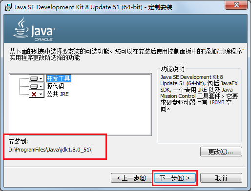

# 第一章 Java概述

## 1.1 Java历史

Java诞生于SUN（Stanford University Network），09年SUN被Oracle（甲骨文）收购。

Java之父是詹姆斯.高斯林(James Gosling)。

1996年发布JDK1.0版。

目前最新的版本是Java12。我们学习的Java8。


## 1.2 Java语言最主要的特点

* 特点一：面向对象

两个基本概念：类、对象

三大特性：封装、继承、多态

* 特点二：健壮性

吸收了C/C++语言的优点，但去掉了其影响程序健壮性的部分（如指针、内存的申请与释放等），提供了一个相对安全的内存管理和访问机制

* 特点三：跨平台性

跨平台性：通过Java语言编写的应用程序在不同的系统平台上都可以运行。“Write once , Run Anywhere”一次编写，处处运行。

原理：只要在需要运行 java 应用程序的操作系统上，先安装一个Java虚拟机 (JVM Java Virtual Machine) 即可。由JVM来负责Java程序在该系统中的运行。因为有了JVM，同一个Java 程序在三个不同的操作系统中都可以执行。这样就实现了Java 程序的跨平台性。


## 1.3 Java环境搭建

### 1.3.1 JDK、JRE、JVM

Java开发人员需要安装JDK。如果仅仅是运行Java程序，那么只需要按照JRE。

JDK（Java Development kits）：Java开发工具包。

JRE（Java Runtime Environment）：Java运行环境。

JVM（Java Virtual Machine）：Java虚拟机。

JDK = JRE + 开发工具（javac.exe,java.exe,javadoc.exe等）

JRE = JVM + 核心类库（常用类：String、日期时间、数学、集合、IO、网络、多线程等）


### 1.3.2  Java环境搭建

1、安装JDK



2、配置JDK的开发工具目录到path环境变量中

​	例如：D:\ProgramFiles\Java\jdk1.8.0_51\bin;

​	注意：这个安装目录以你自己的安装目录为准


（1）为什么配置path？

​	希望在命令行使用javac.exe等工具时，任意目录下都可以找到这个工具所在的目录。

（2）如何配置环境变量？

​	【计算机】右键【属性】，选择【高级系统设置】，选择【高级】，选择【环境变量】，选择【系统环境变量】，编辑path，在【**path原有值**】的前面加入D:\ProgramFiles\Java\jdk1.8.0_51\bin;

## 1.4 第一个Java应用程序

```java
class HelloWorld{
    public static void main(String[] args){
        System.out.print("Hello Java!");
    }
}
```

### 1.4.1 Java程序的开发步骤

三步：

1、编辑/编写源代码

要求：源文件必须是.java文件

2、编译

目的：把源文件编译为.class字节码文件（因为JVM只认识字节码）

工具：javac.exe

格式：

```cmd
javac 源文件名.java
```


3、运行

工具：java.exe

格式：

```cmd
java 类名
java 字节码文件名
```

要求：可以被运行的类，必须包含main方法


### 1.4.2 Java程序的结构与格式

结构：

```java
类{
    方法{
        语句;
    }
}
```

格式：

（1）每一级缩进一个Tab键

（2）{}的左半部分在行尾，右半部分单独一行，与和它成对的"{"的行首对齐


### 1.4.3 Java程序的入口

Java程序的入口是main方法

```java
public static void main(String[] args){
    
}
```


### 1.4.4 Java注释

1、单行注释

```java
//注释内容
```

2、多行注释

```java
/*
注释内容
*/
```

3、文档注释

```java
/**
文档注释（后面注解部分讲解）
*/
```


## 1.5 编写Java程序时应该注意的问题

1、字符编码问题

当cmd命令行窗口的字符编码与.java源文件的字符编码不一致，如何解决？


解决方案一：

​	在Notepad++等编辑器中，修改源文件的字符编码


解决方案二：

​	在使用javac命令式，可以指定源文件的字符编码

```cmd
javac -encoding utf-8 Review01.java
```


2、大小写问题

（1）源文件名：

​	不区分大小写，我们建议大家还是区分

（2）字节码文件名与类名

​	区分大小写

（3）代码中

​	区分大小写


3、源文件名与类名一致问题？

（1）源文件名是否必须与类名一致？public呢？

如果这个类不是public，那么源文件名可以和类名不一致。

如果这个类是public，那么要求源文件名必须与类名一致。

我们建议大家，不管是否是public，都与源文件名保持一致，而且一个源文件尽量只写一个类，目的是为了好维护。


（2）一个源文件中是否可以有多个类？public呢？

一个源文件中可以有多个类，编译后会生成多个.class字节码文件。

但是一个源文件只能有一个public的类。


（3）main必须在public的类中吗？

不是。

但是后面写代码时，基本上main习惯上都在public类中。


# 第二章 Java的基础语法

## 2.1 标识符

简单的说，凡是程序员自己命名的部分都可以称为标识符。

即给类、变量、方法、包等命名的字符序列，称为标识符。


1、标识符的命名规则

（1）Java的标识符只能使用26个英文字母大小写，0-9的数字，下划线_，美元符号$

（2）不能使用Java的关键字（包含保留字）和特殊值

（3）数字不能开头

（4）不能包含空格

（5）严格区分大小写


2、标识符的命名规范

（1）见名知意

（2）类名、接口名等：每个单词的首字母都大写，形式：XxxYyyZzz，

例如：HelloWorld，String，System等

（3）变量、方法名等：从第二个单词开始首字母大写，其余字母小写，形式：xxxYyyZzz，

例如：age,name,bookName,main

（4）包名等：每一个单词都小写，单词之间使用点.分割，形式：xxx.yyy.zzz，

例如：java.lang

（5）常量名等：每一个单词都大写，单词之间使用下划线_分割，形式：XXX_YYY_ZZZ，

例如：MAX_VALUE,PI


## 2.2 变量

### 2.2.1 变量的概念

变量的作用：用来存储数据，代表内存的一块存储区域，变量中的值是可以改变的。

### 2.2.2 变量的三要素

1、数据类型

2、变量名

3、值

### 2.2.3 变量的使用应该注意什么？

1、先声明后使用

> 如果没有声明，会报“找不到符号”错误

2、在使用之前必须初始化

> 如果没有初始化，会报“未初始化”错误

3、变量有作用域

> 如果超过作用域，也会报“找不到符号”错误

4、在同一个作用域中不能重名


### 2.2.4 变量的声明和赋值、使用的语法格式？

1、变量的声明的语法格式：

```java
数据类型  变量名;
例如：
int age;
String name;
double weight;
char gender;
boolean isMarry;
```

2、变量的赋值的语法格式：

```java
变量名 = 值;
例如：
age = 18;
name = "柴林燕"; //字符串的值必须用""
weight = 44.4;
gender = '女';//单字符的值必须使用''
isMarry = true;
```

3、变量的使用的语法格式：

```java
通过变量名直接引用

例如：
(1)输出变量的值
System.out.print(name);
System.out.print("姓名：" + name);//""中的内容会原样显示
System.out.print("name = " + name);
(2)计算
age = age + 1;
```

# 2.3 数据类型

### 2.3.1 Java数据类型的分类

1、基本数据类型

​	8种：整型系列（byte,short,int,long）、浮点型(float,double)、单字符型（char）、布尔型（boolean）

2、引用数据类型

​	类、接口、数组、枚举.....

### 2.3.2 Java的基本数据类型

1、整型系列

（1）byte：字节类型

占内存：1个字节

存储范围：-128~127

（2）short：短整型类型

占内存：2个字节

存储范围：-32768~32767

（3）int：整型

占内存：4个字节

存储范围：-2的31次方 ~ 2的31次方-1

（4）long：整型

占内存：8个字节

存储范围：-2的63次方 ~ 2的63次方-1

> 注意：如果要表示某个常量数字它是long类型，那么需要在数字后面加L


2、浮点型系列（小数）

（1）float：单精度浮点型

占内存：4个字节

精度：科学记数法的小数点后6~7位

> 注意：如果要表示某个常量数字是float类型，那么需要在数字后面加F或f

（2）double：双精度浮点型

占内存：8个字节

精度：科学记数法的小数点后15~16位


3、单字符类型

char：字符类型

占内存：2个字节

Java中使用的字符集：Unicode编码集

字符的三种表示方式：

（1）'一个字符'

例如：'A'，'0'，'尚'

（2）转义字符

```
\n：换行
\r：回车
\t：Tab键
\\：\
\"：”
\'：
\b：删除键Backspace
```

（3）\u字符的Unicode编码值的十六进制型

例如：\u5c1a代表'尚'


4、布尔类型

boolean：只能存储true或false

### 2.3.3 进制（了解，可以暂时忽略）

1、进制的分类：

（1）十进制

​	数字组成：0-9

​	进位规则：逢十进一

（2）二进制

​	数字组成：0-1

​	进位规则：逢二进一

（3）八进制

​	数字组成：0-7

​	进位规则：逢八进一

（4）十六进制

​	数字组成：0-9，a~f（或A~F）

​	进位规则：逢十六进一


2、请分别用四种类型的进制来表示10，并输出它的结果：（了解）

（1）十进制：正常表示

System.out.println(10);

（2）二进制：0b或0B开头

System.out.println(0B10);

（3）八进制：0开头

System.out.println(010);

（4）十六进制：0x或0X开头

System.out.println(0X10);


3、为什么byte是-128~127？（理解）

1个字节：8位

0000 0001  ~  0111 111 ==> 1~127

1000 0001 ~ 1111 1111 ==> -127 ~ -1

0000 0000 ==>0

1000 0000 ==> -128（特殊规定）

> *解释：*计算机数据的存储（了解）
>
> *计算机数据的存储使用二进制补码形式存储，并且最高位是符号位，1是负数，0是正数。*
>
> *规定：正数的补码与反码、原码一样，称为三码合一；*
>
> ​	    *负数的补码与反码、原码不一样：*
>
> ​	   *负数的原码：把十进制转为二进制，然后最高位设置为1*
>
> ​	   *负数的反码：在原码的基础上，最高位不变，其余位取反（0变1,1变0）*
>
> ​	   *负数的补码：反码+1*
>
> *例如：byte类型（1个字节，8位）*
>
> *25 ==> 原码  0001 1001 ==> 反码  0001 1001 -->补码  0001 1001*
>
> *-25 ==>原码  1001 1001 ==> 反码1110 0110 ==>补码 1110 0111*
>
> 底层是用加法代替减法：-128==》-127-1==》-127+(-1)
>
> ​				       -127- -1 ==> -127 + 1


4、学生疑惑解答？

（1）为什么float（4个字节）比long（8个字节）的存储范围大？

（2）为什么double（8个字节）比float（4个字节）精度范围大？

因为float、double底层也是二进制，先把小数转为二进制，然后把二进制表示为科学记数法，然后只保存：

（1）符号位（2）指数位（3）尾数位

> *详见《float型和double型数据的存储方式.docx》*

### 2.3.4 基本数据类型的转换

1、自动类型转换

（1）当把存储范围小的值（常量值、变量的值、表达式计算的结果值）赋值给了存储范围大的变量时，

byte->short->int->long->float->double

​            char->

```java
int i = 'A';//char自动升级为int
double d = 10;//int自动升级为double
```


（2）当存储范围小的数据类型与存储范围大的数据类型一起混合运算时，会按照其中最大的类型运算

```java
int i = 1;
byte b = 1;
double d = 1.0;

double sum = i + b + d;//混合运算，升级为double
```

（3）当byte,short,char数据类型进行算术运算时，按照int类型处理

```java
byte b1 = 1;
byte b2 = 2;
byte b3 = (byte)(b1 + b2);//b1 + b2自动升级为int

char c1 = '0';
char c2 = 'A';
System.out.println(c1 + c2);//113 
```

（4）boolean类型不参与


2、强制类型转换

（1）当把存储范围大的值（常量值、变量的值、表达式计算的结果值）赋值给了存储范围小的变量时，需要强制类型转换

double->float->long->int->short->byte

​					   ->char

提示：有风险，可能会损失精度或溢出

```java
double d = 1.2;
int num = (int)d;//损失精度

int i = 200;
byte b = (byte)i;//溢出
```

（2）boolean类型不参与

（3）当某个值想要提升数据类型时，也可以使用强制类型转换

```java
int i = 1;
int j = 2;
double shang = (double)i/j;
```

提示：这个情况的强制类型转换是没有风险的。


### 2.3.5 特殊的数据类型转换

1、任意数据类型的数据与String类型进行“+”运算时，结果一定是String类型

```java
System.out.println("" + 1 + 2);//12
```


2、但是String类型不能通过强制类型()转换，转为其他的类型

```java
String str = "123";
int num = (int)str;//错误的
```


## 2.4 运算符

1、按照操作数个数的分类：

（1）一元运算符：操作数只有一个

例如：正号（+），负号（-），自增（++），自减（--），逻辑非（！），按位取反（~）

（2）二元运算符：操作数有两个

例如：加（+），减（-），乘（*），除（/），模（%）

​          大于（>），小于（<），大于等于（>=），小于等于（<=），等于（==），不等于（!=）

​	赋值（=，+=，-=，*=，/=，%=，>>=，<<=。。。）

​	 逻辑与（&），逻辑或（|），逻辑异或（^），短路与（&&），短路或（||）

​	左移（<<），右移（>>），无符号右移（>>>），按位与（&），按位或（|），按位异或（^）

（3）三元运算符：操作数三个

例如： ？ ：


2、Java基本数据类型的运算符：

（1）算术运算符

（2）赋值运算符

（3）比较运算符

（4）逻辑运算符

（5）条件运算符

（6）位运算符（难）

### 2.4.1 算术运算符

加法：+

减法：-

乘法：*

除法：/

> *注意：整数与整数相除，只保留整数部分*

取模：%   取余

> 注意：取模结果的正负号只看被模数

正号：+

负号：-

自增：++

自减：--

> **原则：自增与自减**
>
> **++/--在前的，就先自增/自减，后取值**
>
> **++/--在后的，就先取值，后自增/自减**
>
> 整个表达式的扫描，是从左往右扫描，如果后面的先计算的，那么前面的就暂时先放到“操作数栈”中

代码示例：

```java
int i = 1;
i++;//i=2

int j = 1;
++j;//j=2

int a = 1;
int b = a++;//(1)先取a的值“1”放操作数栈(2)a再自增,a=2(3)再把操作数栈中的"1"赋值给b,b=1

int m = 1;
int n = ++m;//(1)m先自增,m=2(2)再取m的值“2”放操作数栈(3)再把操作数栈中的"2"赋值给n,n=1

int i = 1;
int j = i++ + ++i * i++;
/*
从左往右加载
(1)先算i++
①取i的值“1”放操作数栈
②i再自增 i=2
（2）再算++i
①i先自增 i=3
②再取i的值“3”放操作数栈
（3）再算i++
①取i的值“3”放操作数栈
②i再自增 i=4
（4）先算乘法
用操作数栈中3 * 3 = 9，并把9压会操作数栈
（5）再算求和
用操作数栈中的 1 + 9 = 10
（6）最后算赋值
j = 10
*/
```


### 2.4.2 赋值运算符

基本赋值运算符：=

扩展赋值运算符：+=，-=，*=，/=，%=...

> 注意：所有的赋值运算符的=左边一定是一个变量
>
> 扩展赋值运算符=右边的计算结果的类型如果比左边的大的话会强制类型转换，所以结果可能有风险。
>
> 扩展赋值运算符的计算：（1）赋值最后算（2）加载数据的顺序是把左边的变量的值先加载，再去与右边的表达式进行计算

```java
int i = 1;
int j = 5;
j *= i++ + j++;//j = j *(i++ + j++);
/*
(1)先加载j的值“5”
(2)在计算i++
①先加载i的值“1”
②再i自增，i=2
(3)再计算j++
①先加载j的值"5"
②再j自增，j=6
(4)算  加法
i + 5 = 6
(5)算乘法
5 * 6 = 30
(6)赋值
j = 30
*/
```


### 2.4.3 比较运算符

大于：>

小于：<

大于等于：>=

小于等于：<=

等于：==		注意区分赋值运算符的=

不等于：!=

> 注意：比较表达式的运算结果一定只有true/false
>
> 比较表达式可以作为（1）条件（2）逻辑运算符的操作数


### 2.4.4 逻辑运算符

> 逻辑运算符的操作数必须是布尔值，结果也是布尔值

逻辑与：&
	运算规则：只有左右两边都为true，结果才为true。
	例如：true & true 结果为true
		   false & true 结果为false
		    true & false 结果为false
		    false & false 结果为false
逻辑或：|
	运算规则：只要左右两边有一个为true，结果就为true。
	例如：true | true 结果为true
		   false | true 结果为true
		   true | false 结果为true
		    false | false 结果为false	
逻辑异或：^
	运算规则：只有左右两边不同，结果才为true。
	例如：true ^ true 结果为false
		    false ^ true 结果为true
		    true ^ false 结果为true
		    false ^ false 结果为false			

逻辑非：!
	运算规则：布尔值取反
	例如：!true 为false
		    !false 为true

短路与：&&
	运算规则：只有左右两边都为true，结果才为true。
	例如：true & true 结果为true
		    true & false 结果为false
		    false & ?  结果就为false
	它和逻辑与不同的是当&&左边为false时，右边就不看了。
	
短路或：||	
	运算规则：只要左右两边有一个为true，结果就为true。
	例如：true | ? 结果为treu
		   false | true 结果为true
		    false | false 结果为false	
	它和逻辑或不同的是当||左边为true时，右边就不看了。

> 开发中一般用短路与和短路或比较多

面试题：&& 和 &的区别？

> &&当左边为false，右边不计算
>
> &不管左边是true还是false，右边都要计算

### 2.4.5 条件运算符

 ? : 

语法格式：

```java
条件表达式 ? 结果表达式1 : 结果表达式2
```

运算规则：

整个表达式的结果：当条件表达式为true时，就取结果表达式1的值，否则就取结果表达式2的值

代码示例：

```java
（1）boolean类型
boolean marry = true;
System.out.println(marry? "已婚" : "未婚");

（2）求最值
int i = 3;
int j = 5;
int max = i>=j ? i : j;
//当i>=j时，max就赋值为i的值，否则就赋值为j的值
```


### 2.4.6 位运算符

左移：<<

​	运算规则：左移几位就相当于乘以2的几次方

右移：>>

​	运算规则：右移几位就相当于除以2的几次方

无符号右移：>>>

​	运算规则：往右移动后，左边空出来的位直接补0，不看符号位

按位与：&

​	运算规则：

​		1 & 1 结果为1

​		1 & 0 结果为0

​		0 & 1 结果为0

​		0 & 0 结果为0

按位或：|

​	运算规则：

​		1 | 1 结果为1

​		1 | 0 结果为1

​		0 | 1 结果为1

​		0 & 0 结果为0

按位异或：^

​	运算规则：

​		1 ^ 1 结果为0

​		1 ^ 0 结果为1

​		0 ^ 1 结果为1

​		0 ^ 0 结果为0

按位取反：~

​	 运算规则：~0就是1  

​			   ~1就是0

> 如何区分&,|,^是逻辑运算符还是位运算符？
>
> 如果操作数是boolean类型，就是逻辑运算符，如果操作数是整数，那么就位运算符。


### 2.4.7 运算符优先级


提示说明：

（1）表达式不要太复杂

（2）先算的使用()


### 2.4.8 运算符操作数类型说明

1、算术运算符

数字和单个字符可以使用算术运算符。

其中+，当用于字符串时，表示拼接。


2、赋值运算符

右边的常量值、表达式的值、变量的值的类型必须与左边的变量一致或兼容（可以实现自动类型转换）或使用强制类型转换可以成功。


3、比较运算符

其他的比较运算符都是只能用于8种基本数据类型。

其中的==和!=可以用于引用数据类型的比较，用于比较对象的地址。（后面讲）

```java
int i = 10;
int j = 10;
System.out.println(i==j);//true

char c1 = '帅';
char c2 = '帅';
System.out.println(c1 == c2);//true
```


4、逻辑运算符

逻辑运算符的操作数必须是boolean值


5、条件运算符

?前面必须是条件，必须是boolean值

结果表达式1和结果表达式2要保持类型一致或兼容


6、位运算符

一般用于整数系列


> 以上运算符都是针对基本数据类型设计的。
>
> 能够用于引用数据类型只有基本的赋值运算符=，和比较运算符中的==和!=。其他运算符都不能用于引用数据类型。
>
> 其中字符串类型还有一个+，表示拼接。

# 第三章 流程控制语句结构

流程控制语句结构分为：

1、顺序结构：从上到下依次执行

2、分支结构：多个分支选择其中一个分支执行

3、循环结构：重复执行某些代码

## 3.1 顺序结构

执行过程：从上到下顺序执行

### 3.1.1 输出语句

1、System.out.print(输出内容); #输出内容后不换行

2、System.out.println(输出内容);  #输出内容后换行

```java
#输出常量
System.out.print(1);
System.out.print('尚');
System.out.print(44.4);
System.out.print(true);
System.out.print("尚硅谷");

#输出变量
int a = 1;
char c = '尚';
double d = 44.4;
boolean b = true;
String school = "尚硅谷";
System.out.print(a);
System.out.print(c);
System.out.print(d);
System.out.print(b);
System.out.print(school);

#输出拼接结果
System.out.print("a = " + a);
System.out.print("c = " + c);
System.out.print("d = " + d);
System.out.print("b = " + b);
System.out.print("school = " + school);
```

### 3.1.2 输入语句

键盘输入代码的三个步骤：

1、准备Scanner类型的变量

2、提示输入xx

3、接收输入内容

示例代码：

```java
//1、准备Scanner类型的变量
java.util.Scanner input = new java.util.Scanner(System.in);//System.in默认代表键盘输入

//2、提示输入xx
System.out.print("请输入一个整数：");

//3、接收输入内容
int num = input.nextInt();

//列出各种数据类型的输入
int num = input.nextInt();
long bigNum = input.nextLong();
double d = input.nextDouble();
boolean b = input.nextBoolean();
String s = input.next();
char c = input.next().charAt(0);//先按照字符串接收，然后再取字符串的第一个字符（下标为0）

```

## 3.2 分支结构

分支结构：根据条件选择性的执行某些代码

分为：

1、条件判断：if...else系列

2、选择结构：switch...case系列

### 3.2.1 条件判断

#### 1、单分支结构

语法格式：

```java
if(条件表达式){
    当条件表达式成立(true)时需要执行的语句块;
}
```

执行过程：

​	条件成立，就执行{}其中的语句块，不成立就不执行。

> 注意：
>
> （1）if(条件表达式)中的条件表达式的结果必须是boolean类型
>
> （2）当{}中的语句只有一个语句（简单的语句，也可以是一个复合语句）时，可以省略{}，但是我们不建议省略

```java
		//省略{}的情况
		if(score<0 || score>100)
			System.out.println("输入有误！");//简单的语句
		else
			//复合语句
			if(score==100){
				System.out.println("满分");
			}else if(score>=80){
				System.out.println("优秀");
			}else if(score>=60){
				System.out.println("及格");
			}else{
				System.out.println("不及格");
			}
```


示例代码：

```java
int year = 2019;
int days = 28;
if(year%4==0 && year%100!=0 || year%400==0){
    days= 29;
}
```


#### 2、双分支结构

语法格式：

```java
if(条件表达式){
    当条件表达式成立(true)时需要执行的语句块1;
}else{
    当条件表达式不成立(false)时需要执行的语句块2;
}
```

执行过程：

​	当条件表达式成立(true)时执行语句块1，否则执行语句块2

> 注意：
>
> （1）if(条件表达式)中的条件表达式的结果必须是boolean类型
>
> （2）当{}中的语句只有一个语句（简单的语句，也可以是一个复合语句）时，可以省略{}，但是我们不建议


示例代码：

```java
int num = 10;
if(num%2==0){
    System.out.println(num + "是偶数")；
}else{
     System.out.println(num + "是奇数")；
}
```


#### 3、多分支结构

语法格式：

```java
if(条件表达式1){
    当条件表达式1成立的时候，执行的语句块1；
}else if(条件表达式2){
    当条件表达式1不成立，
      条件表达式2成立的时候，执行的语句块2；
}else if(条件表达式3){
    当条件表达式1不成立，
       条件表达式2也不成立，
      条件表达式3成立的时候，执行的语句块3；
}
。。。
【else{
	当以上所有的条件表达式都不成立，需要执行的语句块n+1;
}】
```

执行过程：

（1）多个条件顺序往下判断，如果上面有一个条件成立了，下面的条件就不看了

（2）多个分支也只会执行其中的一个

> 注意：
>
> （1）每一个条件表达式都必须是boolean值
>
> （2）当{}中只有一个语句时，也可以省略{}，但不建议省略
>
> （3）当多个条件是“互斥”关系（没有重叠部分），顺序可以随意；
>
> ​          当多个条件是“包含”关系（有重叠部分），顺序不能随意，小的在上，大的在下面


示例代码：

```java
			int score = 78;
			if(score==100){
				System.out.println("满分");
			}else if(score>=80){
				System.out.println("优秀");
			}else if(score>=60){
				System.out.println("及格");
			}else{
				System.out.println("不及格");
			}
```


#### 4、嵌套

执行过程：

​	当嵌套在if中，就是当外面的if成立时，才会看里面的条件判断；

​	当嵌套在else中，就当外面的else满足时，才会看里面的条件判断；


### 3.2.2 选择结构

语法格式：

```java
switch(表达式){
    case 常量值1:
        语句块1;
        【break;】
    case 常量值2:
        语句块2;
        【break;】   
    。。。
   【default:
        语句块n+1;
        【break;】
     】
}
```

执行过程：

（1）入口

①当switch(表达式)的值与case后面的某个常量值匹配，就从这个case进入；

②当switch(表达式)的值与case后面的所有常量值都不匹配，寻找default分支进入;

（2）一旦从“入口”进入switch，就会顺序往下执行，直到遇到“出口”

（3）出口

①自然出口：遇到了switch的结束}

②中断出口：遇到了break等


> 注意：
>
> （1）switch(表达式)的值的类型，只能是：4种基本数据类型（byte,short,int,char），两种引用数据类型（枚举、String）
>
> （2）case后面必须是常量值，而且不能重复


示例代码：

```java
int month = 4;
switch(month){
    case 3:
    case 4:
    case 5:
        System.out.println("春季");
        break;
    case 6:
    case 7:
    case 8:
        System.out.println("夏季");
        break;
    case 9:
    case 10:
    case 11:
        System.out.println("秋季");
        break;
    case 12:
    case 1:
    case 2:
        System.out.println("冬季");
        break;
    default:
        System.out.println("输入有误！");
}
```

## 3.3 循环结构

循环结构：

​	“重复”执行某些代码

循环结构的分类：

1、for循环

2、while循环

3、do...while循环

### 3.3.1 for循环

语法格式：

```java
for(;;){
    循环体语句块；
    if(条件表达式){
    	break;
    }
}
for(初始化表达式; 循环条件; 迭代表达式){
    循环体语句块；（需要重复执行的代码）
}
```

执行过程：

（1）初始化表达式;

（2）判断循环条件;

（3）如果循环条件成立，先执行循环体语句块；然后执行迭代表达式，再回到（2）...

（4）如果循环条件不成立，会结束for；

​         或者在当前循环中遇到break语句，也会结束当前for循环;

> 注意：
>
> （1）for(;;)中的两个；是不能多也不能少
>
> （2）循环条件必须是boolean类型


示例代码：

```java
//遍历1-100之间的偶数
for(int i=1; i<=100; i++){//每次循环的步幅是1
    if(i%2==0){
        System.out.println(i);
    }
}

//遍历1-100之间的偶数
for(int i=2; i<=100; i+=2){//每次循环的步幅是2
    System.out.println(i);
}
```


### 3.3.2 while循环

语法格式：

```java
while(循环条件){
    循环体语句块;
}

经典的形式：
while(true){
	循环体语句块;
    if(条件表达式){
    	break;
    }
}
```

执行过程：

（1）先判断循环条件

（2）如果循环条件成立，就执行循环体语句块；然后回到（1）

（3）如果循环条件不成立，就结束while循环；

​	 如果在循环体语句块中，遇到break，也会结束while循环；

> 注意：
>
> （1）while(循环条件)中循环条件必须是boolean类型


示例代码：

```java
//遍历1-100之间的偶数
int num = 2;
while(num<=100){
    System.out.println(num);
    num+=2;
}
```


### 3.3.3 do...while循环

语法格式：

```java
do{
    循环体语句块;
}while(循环条件);
```

执行过程：

（1）先执行一次循环体语句块；

（2）判断循环条件

（3）如果循环条件成立，再次执行循环体语句块；然后回到（2）...

（4）如果循环条件不成立，就结束do...while循环；

​         如果在循环体语句块中，遇到break，也会结束do...while循环；

> 注意：
>
> （1）while(循环条件)中循环条件必须是boolean类型
>
> （2）do{}while();最后有一个分号
>
> （3）do...while结构的循环体语句是至少会执行一次，这个和for和while是不一样的


示例代码：

```java
//从键盘输入整数，统计正数、负数的个数，输入0结束
java.util.Scanner input = new java.util.Scanner(System.in);

int num;
int positive = 0;
int negative = 0;
do{
    System.out.print("请输入整数（0结束）：");
    num = input.nextInt();
    
    if(num > 0){
        positive++;
    }else if(num < 0){
        negatvie++;
    }
}while(num!=0);

System.out.println("正数的个数：" + positive);
System.out.println("负数的个数：" + negatvie);
```

### 3.3.4 三种循环的选择

原则：三种循环之间是可以互相转换的，都能实现循环的功能

建议（习惯上）：当我们次数比较明显的时候，或者说从几循环到几的时候，一般先考虑for；

​				当循环体语句块至少要执行一次的时候，一般先考虑do...while；

​			        当循环条件比较明显，但是次数不明显，循环体语句块也不是至少执行一次，那么可以考虑while结构；


三种循环结构都具有四要素：

（1）循环变量的初始化表达式

（2）循环条件

（3）循环变量的修改的迭代表达式

（4）循环体语句块


### 3.3.5 跳转语句

1、break

用于：

（1）switch结构

作用：结束switch结构

（2）循环结构

作用：结束**当前**循环

2、continue 

用于：

只能用于循环结构

作用：提前结束本次循环，继续下一次循环

3、return（后面讲）

