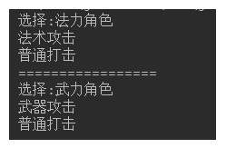
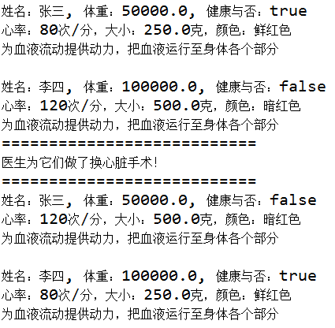

# day13_课后练习

# 接口编程代码题

## 第1题

* 语法点：接口
* 按步骤编写代码，效果如图所示：

* 编写步骤：

1. 定义接口A，普通类B实现接口A
2. A接口中，定义抽象方法showA。 
3. A接口中，定义默认方法showB。
4. B类中，重写showA方法
5. 测试类中，创建B类对象，调用showA方法，showB方法。

## 第2题

* 语法点：接口，多态
* 按步骤编写代码，效果如图所示：

* 编写步骤

1. 定义接口Universe，提供抽象方法doAnything。

2. 定义普通类Star，提供成员发光shine方法，打印“star:星星一闪一闪亮晶晶"

3. 定义普通类Sun，

   继承Star类，重写shine方法，打印"sun:光照八分钟，到达地球"

   实现Universe接口，实现doAnything，打印"sun:太阳吸引着9大行星旋转"

4. 测试类中，创建Star对象，调用shine方法

5. 测试类中，多态的方式创建Sun对象，调用doAnything方法，向下转型，调用shine方法。

## 第3题

* 模拟玩家选择角色。
* 定义接口FightAble：
  * 抽象方法：specialFight。
  * 默认方法：commonFight,方法中打印"普通打击"。
* 定义战士类：
  * 实现FightAble接口,重写方法中打印"武器攻击"。
* 定义法师类Mage：
  * 实现FightAble接口,重写方法中打印"法术攻击"。
* 定义玩家类Player：
  * 静态方法：FightAble select(String str)，根据指令选择角色。
    * 法力角色，选择法师。
    * 武力角色，选择战士。
* 代码实现，效果如图所示：

## 第4题

* 模拟工人挑苹果。
* 定义苹果类：
  * 属性：大小，颜色。
  * 提供基本的构造方法和get方法，set方法
* 定义接口CompareAble：
  * 定义默认方法compare，挑选较大苹果。
* 定义接口实现类CompareBig。
* 定义接口实现类CompareColor。挑选红色苹果。
* 定义工人类：
  * 成员方法：挑选苹果public void pickApple(CompareAble c,Apple a1,Apple a2)。
* 测试类：
  * 创建Worker对象。
  * 创建两个Apple对象，一个Apple（5，"青色"）,一个Apple（3，"红色"）
* 代码实现，效果如图所示：

## 第5题

* 模拟接待员接待用户，根据用户id，给用户分组。

* 定义用户类：
  * 属性：用户类型，用户id
  * 提供基本的构造方法和get方法，set方法
* 定义接口Filter：
  * 提供抽象方法filterUser（User u）
* 定义实现类V1Filter，实现抽象方法，将用户设置为v1
* 定义实现类V2Filter，实现抽象方法，将用户设置为v2
* 定义实现类AFilter，实现抽象方法，将用户设置为A
* 定义接待员类Receptionist：
  * 属性：接口Filter
  * 提供基本的构造方法和get方法，set方法
  * 成员方法：接待用户方法，设置用户类型。
* 测试类：
  * 初始化15个User对象，id为1-15。
  * 创建三个接待员对象。
    * 第一个接待员，设置接待规则，将1-5号用户类型设置为v1。
    * 第二个接待员，设置接待规则，将6-10号用户类型设置为v2。
    * 第三个接待员，设置接待规则，将11-15号用户类型设置为A。
  * 遍历数组，给用户分区。

* 代码实现，效果如图所示：

# 内部类编程代码题

## 第6题

* 案例：

​	1、声明一个抽象类器官Organ，包含抽象方法：public abstract void doWork();

​	2、声明一个身体Body类型

​	（1）包含属性：所有者owner(String)，体重weight(double)（单位：克）,健康状态health(boolean)，心脏heart (Organ类型)

​	（2）声明有参构造，get/set，toString()

​	其中heart属性在有参构造中根据身体状况创建心脏对象

​	（3）声明一个私有的内部类Heart，继承Organ类，内部类包含属性：心率，颜色，大小（单位：克），重写doWork()方法：打印“为血液流动提供动力，把血液运行至xx的身体各个部分”。

​	①其中xx是Body的owner所有者。

​	②其中心脏大小等于体重的0.5％

​	③其中心脏颜色，如果人健康，心脏为鲜红色，人不健康，心脏为暗红色

​	④其中心脏心率，如果人健康，心率为：60~100次/分，如果在此范围之外，则人不健康

​	⑤重写doWork()方法：

​		打印“心率：xx次/分，大小：xx克，颜色：xx”

​		打印“为血液流动提供动力，把血液运行至身体各个部分”

​	3、声明一个医生Doctor类型，声明一个swapHeart(Body b1, Body b2)方法，为两个人换心脏，并交换健康状况

​	4、在测试类中，创建两个人，并显示信息，并调用心脏的doWork方法，然后创建一个医生对象，调用swapHeart后，再显示两个人的信息，并调用心脏的doWork方法

* 运行效果如下：

## 第7题

案例：将第4题，改用匿名内部类实现实现接口，来代替CompareBig和CompareColor

## 第8题

案例：将第5题，改用匿名内部类实现接口，来代替V1Filter、V2Filter、AFilter

