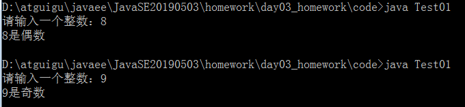
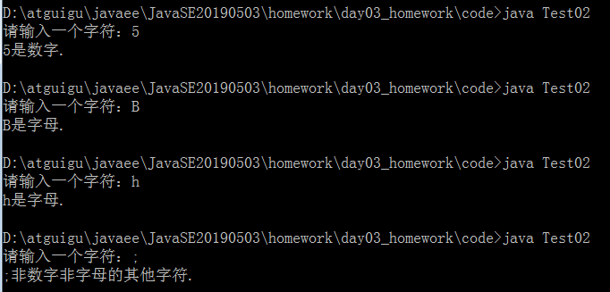
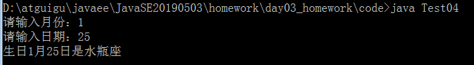
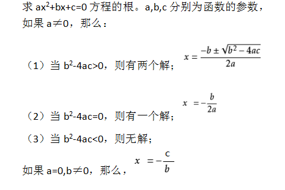
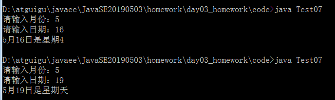

# day03_课后练习

# 编程题

## 第一题

语法点：变量，运算符，if...else

案例：从键盘输入一个整数，判断它是奇数还是偶数（这里把0归为偶数）



开发提示：

​	键盘输入需要用到Scanner类。

```java
java.util.Scanner input = new java.util.Scanner(System.in);//准备从键盘输入的扫描仪
int num = input.nextInt();//输入整数
```

​	能够被2整除的是偶数，不能被2整除的是奇数

## 第二题

语法点：变量，运算符，if...else

案例：从键盘输入一个字符，判断它是字母还是数字，还是其他字符



开发提示：

​	键盘输入需要用到Scanner类。

```java
java.util.Scanner input = new java.util.Scanner(System.in);//准备接收从键盘输入的扫描仪
char c = input.next().charAt(0);//输入单个字符
```

​	数字范围：'0'-'9'

​	字母范围：'A'-'Z'，'a'-'z'


## 第三题

* 语法点：变量，运算符，if...else

* 按步骤编写代码，效果如图所示：

  

* 编写步骤：

  1. 定义类 Test2
  2. 定义 main方法
  3. 定义变量折扣 discount，初始化为1, 总价totalPrice的值从键盘输入
  4. 判断当`totalPrice >=500` ,discount赋值为0.5
  5. 判断当`totalPrice >=400` 且`<500`时,discount赋值为0.6
  6. 判断当`totalPrice >=300` 且`<400`时,discount赋值为0.7
  7. 判断当`totalPrice >=200` 且`<300`时,discount赋值为0.8
  8. 判断当`totalPrice >=0` 且`<200`时,discount赋值为1
  9. 判断当`totalPrice<0`时，显示输入有误
  10. 输出结果

* 开发提示：

  键盘输入需要用到Scanner类。

  ```java
  java.util.Scanner input = new java.util.Scanner(System.in);//准备接收从键盘输入的扫描仪
  double totalPrice = input.nextDouble();//输入double值
  ```

  ​	

## 第四题

语法点：变量，运算符，if...else

案例：从键盘输入生日，判断星座



* 开发提示：
  1. 各个星座的日期范围如下：


## 第五题

语法点：变量，运算符，switch...case

案例需求：编写一个程序，为一个给定的年份找出其对应的中国生肖。中国的生肖基于12年一个周期，每年用一个动物代表：rat（鼠）、ox（牛）、tiger（虎）、rabbit（兔）、dragon（龙）、snake（蛇）、

​      horse（马）、sheep（羊）、monkey（候）、rooster（鸡）、dog（狗）、pig（猪）。

提示：2017年：鸡   2017 % 12 == 1


switch(year%12){

case 1:鸡break;

case 2:狗break;

....

}

## 第六题

语法点：变量，运算符，if..else

案例：



* 开发提示：

1. Math.sqrt(num)：求num的平方根

2. 定义double类型变量a,b,c，并从键盘输入它们的值

   键盘输入需要用到Scanner类。

```java
java.util.Scanner input = new java.util.Scanner(System.in);//准备接收从键盘输入的扫描仪
double totalPrice = input.nextDouble();//输入double值
```

## 第七题

语法点：变量，运算符，if和switch...case

案例：已知2019年1月1日是星期二，从键盘输入2019年的任意一天，请判断它是星期几



* 开发提示：

1. 先统计这一天是这一年的第几天days
2. 然后声明一个变量week，初始化为2
3. 然后week加上days-1
4. 然后求week与7的模数
5. 然后输出结果，考虑星期天的特殊判断


# 简答题

1、switch是否能作用在byte上，是否能作用在long上，是否能作用在String上？

