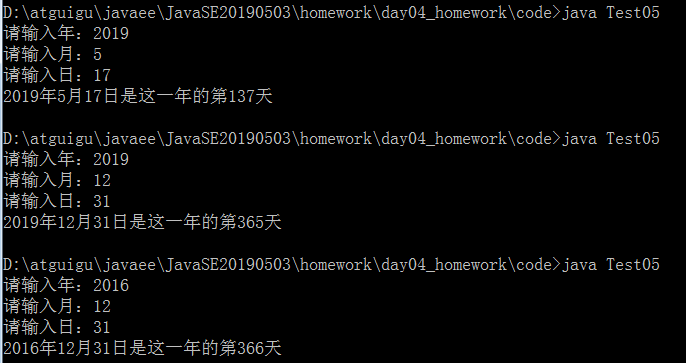

# day04_课后练习

## 第一题

* 语法点：运算符，while，if

* 按步骤编写代码，效果如图所示：

  

  

* 编写步骤：

  1. 定义类 Test1
  2. 定义 main方法
  3. 定义变量i为0,i2为10
  4. 使用第一个while循环,当条件为`i小于5` 时,则进入循环
  5. 循环内,i自增,i2自增
  6. 循环内,使用if判断,当`i大于等于 2 ` 并且` i2小于15` 时,同时输出i和i2的值
  7. 使用第二个while循环,当条件为`i2小于20` 时,则进入循环
  8. 循环内,i自增,i2自增
  9. 循环内,使用if判断,当`i大于8 ` 或者`i2小于等于18` 时,同时输出i和i2的值

## 第二题

* 语法点：方法，运算符，for，while 

* 按步骤编写代码，效果如图所示：

  

* 编写步骤

1. 定义类 Test2，定义 main方法

2. main方法中,定义int类型变量 a为1

3. 使用while循环,判断a<=5,进入循环.

4. while循环内部,使用for循环,初始化int类型变量b为1,当b<=5时进入循环, 步进表达式b++

5. for循环内,不换行输出i并拼接" "

6. for循环外,输出换行.

7. for循环外,a自增.

## 第三题

* 语法点：运算符，for，if

* 按步骤编写代码，效果如图所示：

  

* 编写步骤

  1. 定义类 Test5
  2. 定义 main方法
  3. 定义变量jj为20,a为0,b为0
  4. 使用for循环,初始化值ii为0,当`ii<jj` 时进入循环,步进表达式为ii+=2,jj自减
  5. 循环内,使用if判断ii被3整除,ii赋值给a,并输出ii拼接"Hello"
  6. 不被3整除,ii赋值给b,并输出ii拼接"World"
  7. 循环外,按照格式,打印a与b的乘积

## 第四题

* 语法点：运算符，for，switch
* 打印星座信息，效果如图所示：

开发提示：

* 1-12的规律数字，可以使用for循环处理
* 根据不同的数字，匹配显示不同的文字，可以使用switch匹配

## 第五题

语法点：运算符，for，if

案例需求：从键盘分别输入年、月、日，使用循环for+if实现，判断这一天是当年的第几天 

   注：判断一年是否是闰年的标准：

​       1）可以被4整除，但不可被100整除

​       2）可以被400整除

* 开发提示：
  1. 循环1-month月
  2. 在循环中判断该月是31天、30天、28/29天，分别累加

## 第六题

案例需求：假设从2000年1月1日开始三天打鱼，两天晒网，从键盘输入今天的日期年、月、日，显示今天是打鱼还是晒网？

## 第七题

* 打印倒三角形，效果如图所示：

  

* 开发提示：

  * 平面图形涉及到有行有列，考虑到嵌套for循环
  * 一个外循环控制行，两个内循环控制输出内容
  * 一个内循环负责输出空格，另一个内循环输出"*"

## 第八题

* 打印『X』对称图形，效果如图所示：

  

* 开发提示：

  * 平面图形涉及到有行有列，考虑到嵌套for循环
  * 一个外循环控制行，一个内循环控制输出内容
  * 在内循环中，根据变量的变化规律，判断输出"O"还是"*"

## 第九题

* 打印菱形

  

  或

  

* 开发提示：

  * 平面图形涉及到有行有列，考虑到嵌套for循环
  * 一个外循环控制行，两个内循环控制输出内容
  * 一个内循环负责输出空格，另一个内循环输出"*"