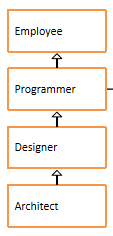

# day10_课后练习

# 代码阅读题

## 第1题

知识点：实例初始化

案例：判断运行结果

```java
package com.atguigu.test01;

class HelloA{
	public HelloA(){
		System.out.println("HelloA");
	}
	{
		System.out.println("I'm A Class");
	}
}

class HelloB extends HelloA{
	public HelloB(){
		System.out.println("HelloB");
	}
	{
		System.out.println("I'm B Class");
	}
}
public class Test01{
	public static void main(String[] args) {
		new HelloB();
	}
}

```

## 第2题

知识点：实例初始化

案例：判断运行结果

```java
package com.atguigu.test02;

public class Test02 {
	public static void main(String[] args) {
		new Child("mike");
	}
}

class People {
	private String name;

	public People() {
		System.out.print("1");
	}

	public People(String name) {
		System.out.print("2");
		this.name = name;
	}
}

class Child extends People {
	People father;

	public Child(String name) {
		System.out.print("3");
		father = new People(name + " F");
	}

	public Child() {
		System.out.print("4");
	}
}

```

## 第3题

知识点：实例初始化

案例：分析运行结果

```java
package com.atguigu.test03;

public class Test03 {
	public static void main(String[] args) {
		Father f = new Father();
		Child c = new Child();
	}
}
class Father {
	public Father(){
		System.out.println("father create");
	}
}
class Child extends Father{
	public Child(){
		System.out.println("child create");
	}
}
```

## 第4题

知识点：继承、属性同名问题

```java
package com.atguigu.test04;

public class Test04 extends Father{
	private String name = "test";
	
	public static void main(String[] args) {
		Test04 test = new Test04();
		System.out.println(test.getName());
	}
}
class Father {
	private String name = "father";

	public String getName() {
		return name;
	}
}
```

## 第5题

知识点：方法的参数传递

案例：分析运行结果

```java
package com.atguigu.test05;

public class Test05 {
	public static void main(String[] args) {
		Other o = new Other();
		new Test05().addOne(o);
		System.out.println(o.i);
	}
	
	public void addOne(Other o){
		o.i++;
	}
}
class Other{
	public int i;
}
```

## 第6题

知识点：方法的参数传递

案例：分析运行结果

```java
package com.atguigu.test06;

public class Test06 {
	public static void main(String[] args) {
		int i = 0;
		change(i);
		i = i++;
		System.out.println("i = " + i);
	}
	public static void change(int i){
		i++;
	}
}

```

## 第7题

知识点：实例初始化、构造器

案例：分析运行结果

```java
package com.atguigu.test07;

public class Test07 {

	public static void main(String[] args) {
		new A(new B());
	}
}

class A {
	public A() {
		System.out.println("A");
	}

	public A(B b) {
		this();
		System.out.println("AB");
	}
}

class B {
	public B() {
		System.out.println("B");
	}
}

```

## 第8题

知识点：实例初始化

案例：分析运行结果

```java
package com.atguigu.test08;

public class Test08 {
	public static void main(String[] args) {
		Sub s = new Sub();
	}
}
class Base{
	Base(){
		method(100);
	}
	{
		System.out.println("base");
	}
	public void method(int i){
		System.out.println("base : " + i);
	}
}
class Sub extends Base{
	Sub(){
		super.method(70);
	}
	{
		System.out.println("sub");
	}
	public void method(int j){
		System.out.println("sub : " + j);
	}
}
```

# 代码编程题

## 第9题

案例：

​	1、在com.atguigu.test09.bean包中声明员工类、程序员类、设计师类、架构师类，



* 员工类属性：编号、姓名、年龄、薪资

* 程序员类属性：编程语言，默认都是"java"

* 设计师类属性：奖金

* 架构师类属性：持有股票数量

  要求：属性私有化，无参有参构造，get/set，getInfo方法（考虑重写）

  

  2、在com.atguigu.test10.bean包中声明Test09测试类

  （1）在main中有一些变量和一个二维数组

  ```
  int EMPLOYEE = 10;//表示普通员工
  int PROGRAMMER = 11;//表示程序员
  int DESIGNER = 12;//表示设计师
  int ARCHITECT = 13;//表示架构师
      
  String[][] EMPLOYEES = {
          {"10", "1", "段誉", "22", "3000"},
          {"13", "2", "令狐冲", "32", "18000", "15000", "2000"},
          {"11", "3", "任我行", "23", "7000"},
          {"11", "4", "张三丰", "24", "7300"},
          {"12", "5", "周芷若", "28", "10000", "5000"},
          {"11", "6", "赵敏", "22", "6800"},
          {"12", "7", "张无忌", "29", "10800","5200"},
          {"13", "8", "韦小宝", "30", "19800", "15000", "2500"},
          {"12", "9", "杨过", "26", "9800", "5500"},
          {"11", "10", "小龙女", "21", "6600"},
          {"11", "11", "郭靖", "25", "7100"},
          {"12", "12", "黄蓉", "27", "9600", "4800"}
      };
  ```

  （2）创建一个员工数组

  （3）根据以上数据，初始化员工数组

  提示：把字符串转为int和double类型的值，可以使用如下方式：

  ```java
  String idStr = "1";
  int id = Integer.parseInt(idStr);
  
  String salaryStr = "7300";
  double salary = Double.parseDouble(salaryStr);
  ```

  （4）遍历数组，使用如下格式

  ```
  编号	姓名	年龄	薪资	语言	奖金	股票
  .....
  ```

  

## 第10题

案例：

​	1、在com.atguigu.test10.bean包中声明图形Graphic、圆Circle、矩形Rectangle类、三角形Triangle类

​	2、图形Graphic类中有：

​		①public double getArea()方法：返回面积

​		②public double getPerimeter()方法：返回周长

​		③public String getInfo()方法：返回图形信息

​	3、圆类和矩形类重写这两个方法

​	4、在com.atguigu.test10.test包中声明测试类Test10_1

​	(1)请设计一个方法，可以用于比较两个图形的面积是否相等

​	(2)请设计一个方法，可以用于找出两个图形中面积大的那个

​	(3)public static void main(String[] args){}

​	在主方法中，创建1个圆、1个矩形、1个三角形对象，并分别调用(1)、(2)方法进行测试。

​	5、在com.atguigu.test10.test包中测试类Test10_2

​	(1)请设计一个方法，可以用于遍历一个图形数组

​	(2)请设计一个方法，可以用于给一个图形数组进行按照面积从小到大排序

​	(3)public static void main(String[] args){}

​	在主方法中，创建1个圆、1个矩形、1个三角形对象，放到数组中，遍历显示，然后排序后再遍历显示。


## 第11题

案例：

​	1、在com.atguigu.test11.bean包中声明人Person、男人Man、女人Woman类

​	（1）在Person类中，包含

​		①public void eat()：打印吃饭

​		②public void toilet()：打印上洗手间

​	（2）在Man类中，包含

​		①重写上面的方法

​		②增加  public void smoke()：打印抽烟

​	（3）在Woman类中，包含

​		①重写上面的方法

​		②增加 public void makeup()：打印化妆

​	2、在com.atguigu.test11.test包中声明测试类Test11

​	（1）public static void meeting(Person...  ps)

​		在该方法中，每一个人先吃饭，然后上洗手间，然后如果是男人，随后抽根烟，如果是女人，随后化个妆

​	（2）public static void main(String[] args)

​		在主方法中，创建多个男人和女人对象，并调用meeting()方法进行测试