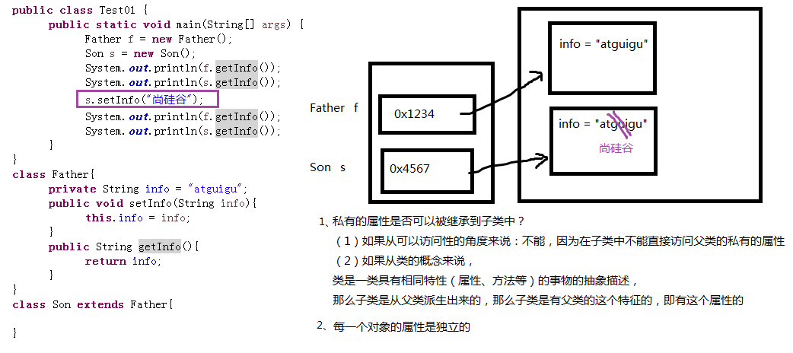
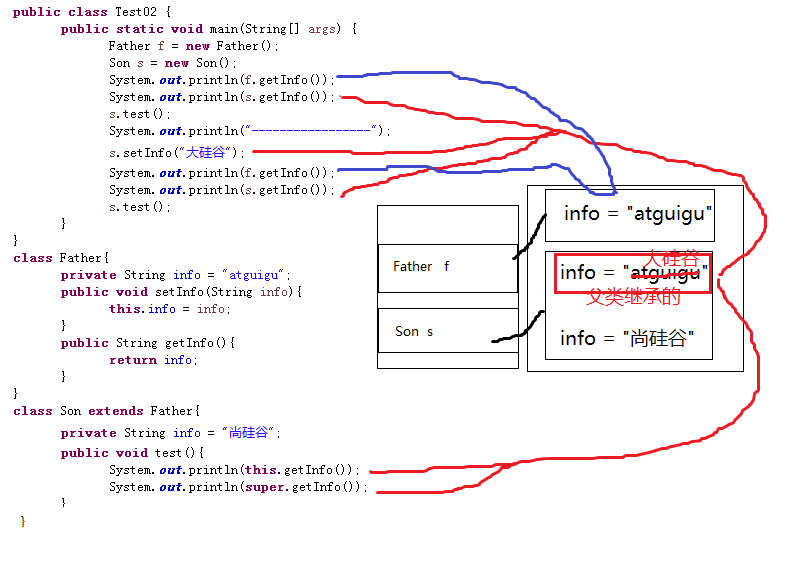
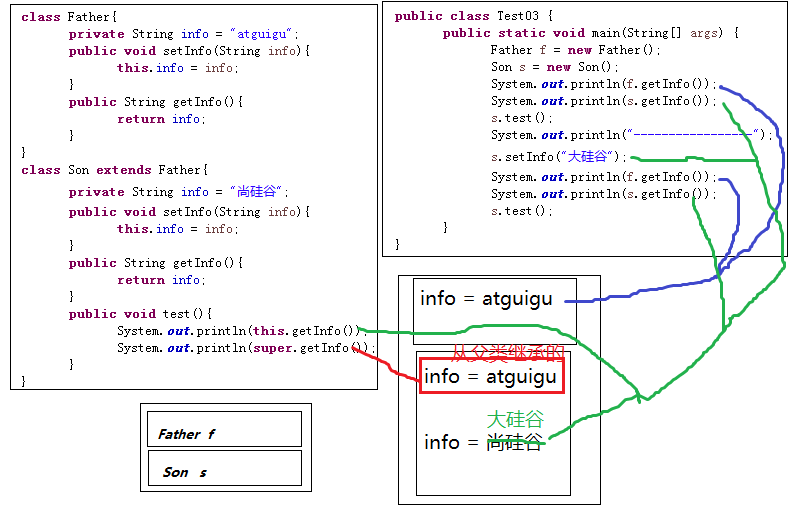

# day11_课后练习

# 代码阅读题

## 第1题

考核知识点：继承、this

```java
package com.atguigu.test01;

public class Test01 {
	public static void main(String[] args) {
		Father f = new Father();
		Son s = new Son();
		System.out.println(f.getInfo());
		System.out.println(s.getInfo());
		s.setInfo("尚硅谷");
		System.out.println(f.getInfo());
		System.out.println(s.getInfo());
	}
}
class Father{
	private String info = "atguigu";
	public void setInfo(String info){
		this.info = info;
	}
	public String getInfo(){
		return info;
	}
}
class Son extends Father{
	
}
```

```java
/*
1、私有的属性是否可以被继承到子类中？
（1）如果从可以访问性的角度来说：不能，因为在子类中不能直接访问父类的私有的属性，但是可以通过get/set操作
（2）如果从类的概念来说，
类是一类具有相同特性（属性、方法等）的事物的抽象描述，
那么子类是从父类派生出来的，那么子类是有父类的这个特征的，即有这个属性的

2、每一个对象的非静态属性是独立的，其中一个对象修改和另一个对象是无关的
 */
```



## 第2题

考核知识点：继承、this、super

```java
package com.atguigu.test02;

public class Test02 {
	public static void main(String[] args) {
		Father f = new Father();
		Son s = new Son();
		System.out.println(f.getInfo());
		System.out.println(s.getInfo());
		s.test();
		System.out.println("-----------------");
		s.setInfo("大硅谷");
		System.out.println(f.getInfo());
		System.out.println(s.getInfo());
		s.test();
	}
}
class Father{
	private String info = "atguigu";
	public void setInfo(String info){
		this.info = info;
	}
	public String getInfo(){
		return info;
	}
}
class Son extends Father{
	private String info = "尚硅谷";
	public void test(){
		System.out.println(this.getInfo());
		System.out.println(super.getInfo());
	}
}
```

```java
/*
1、私有的属性是否可以被继承到子类中？
（1）如果从可以访问性的角度来说：不能，因为在子类中不能直接访问父类的私有的属性，但是可以通过get/set操作
（2）如果从类的概念来说，
类是一类具有相同特性（属性、方法等）的事物的抽象描述，
那么子类是从父类派生出来的，那么子类是有父类的这个特征的，即有这个属性的

2、每一个对象的非静态属性是独立的，其中一个对象修改和另一个对象是无关的

3、当子类有与父类的属性同名时，那么通过子类对象调用get/set方法操作的是父类继承还是子类自己的属性呢？
要看子类是否重写：
如果没有重写，操作的都是父类的，不管是直接getInfo()还是this.getInfo()，还是super.getInfo()
如果重写了，如果通过子类对象调用，操作的是子类的，例如：getInfo()还是this.getInfo()，
		如果通过super.调用的，操作的是父类的。
 */
```



## 第3题

考核知识点：继承、this、super、重写

```java
package com.atguigu.test03;

public class Test03 {
	public static void main(String[] args) {
		Father f = new Father();
		Son s = new Son();
		System.out.println(f.getInfo());
		System.out.println(s.getInfo());
		s.test();
		System.out.println("-----------------");
		s.setInfo("大硅谷");
		System.out.println(f.getInfo());
		System.out.println(s.getInfo());
		s.test();
	}
}
class Father{
	private String info = "atguigu";
	public void setInfo(String info){
		this.info = info;
	}
	public String getInfo(){
		return info;
	}
}
class Son extends Father{
	private String info = "尚硅谷";
	public void setInfo(String info){
		this.info = info;
	}
	public String getInfo(){
		return info;
	}
	public void test(){
		System.out.println(this.getInfo());
		System.out.println(super.getInfo());
	}
}
```

```java
/*
1、私有的属性是否可以被继承到子类中？
（1）如果从可以访问性的角度来说：不能，因为在子类中不能直接访问父类的私有的属性，但是可以通过get/set操作
（2）如果从类的概念来说，
类是一类具有相同特性（属性、方法等）的事物的抽象描述，
那么子类是从父类派生出来的，那么子类是有父类的这个特征的，即有这个属性的

2、每一个对象的非静态属性是独立的，其中一个对象修改和另一个对象是无关的

3、当子类有与父类的属性同名时，那么通过子类对象调用get/set方法操作的是父类继承还是子类自己的属性呢？
要看子类是否重写：
如果没有重写，操作的都是父类的，不管是直接getInfo()还是this.getInfo()，还是super.getInfo()
如果重写了，如果通过子类对象调用，操作的是子类的，例如：getInfo()还是this.getInfo()，
		如果通过super.调用的，操作的是父类的。
 */
```




## 第4题

考核知识点：属性与多态无关

```java
package com.atguigu.test04;

public class Test04 {
	public static void main(String[] args) {
		A a = new B();
		System.out.println(a.num);
		System.out.println(((B)a).num);
		System.out.println(((A)((B)a)).num);
		System.out.println("-------------------");
		B b = new B();
		System.out.println(b.num);
		System.out.println(((A)b).num);
		System.out.println(((B)((A)b)).num);
	}
}
class A{
	int num = 1;
}
class B extends A{
	int num = 2;
}
```

```java
/*
 * 多态性现象：编译时类型与运行时类型不一致
 * 但是多态性是针对方法来说，方法有动态绑定一说。
 * 属性没有多态性。属性都是按照编译时类型处理的。
 */
public class Test04 {
	public static void main(String[] args) {
		A a = new B();
		System.out.println(a.num);//a编译时类型就是A  1
		System.out.println(((B)a).num);//编译后，因为a被强制成B类，是B类型  2
		System.out.println(((A)((B)a)).num);//编译后，a转成B又转成A，是A类型   1
		System.out.println("-------------------");
		B b = new B();
		System.out.println(b.num);//b编译时类型就是B   2
		System.out.println(((A)b).num);//b被强制升级为A类型，按A类型处理， 1
		System.out.println(((B)((A)b)).num);//b先转A又转B，最终是B类型  2
	}
}
class A{
	int num = 1;
}
class B extends A{
	int num = 2;
}
```


## 第5题

考核知识点：类初始化与实例初始化

```java
package com.atguigu.test05;

class HelloA{
	public HelloA(){
		System.out.println("HelloA");
	}
	{
		System.out.println("I'm A Class");
	}
	static{
		System.out.println("static A");
	}
}

public class HelloB extends HelloA{
	public HelloB(){
		System.out.println("HelloB");
	}
	{
		System.out.println("I'm B Class");
	}
	static{
		System.out.println("static B");
	}

	public static void main(String[] args) {
		new HelloB();
	}

}

```

```java
/*
 * 1、main是Java程序的入口，那么main所在的类需要先完成类初始化，才能执行main方法。
 * 即先完成HelloB的类初始化，才能执行main中的new Hello()
 * 2、但是在类初始化时，如果发现父类还没有初始化，会先初始化父类，即先完成HelloA的类初始化
 * 3、类初始化方法由：
 * （1）静态变量的显式赋值代码
 * （2）静态代码块代码
 * 4、 创建对象是通过执行实例初始化方法来完成的。
 * 如果new后面跟无参构造，就说明调用无参的实例初始化方法<init>()，
 * 如果new后面跟有参构造，就说明调用有参的实例初始化方法<init>(形参列表)。
 * 编译器编译后类中没有构造器，而是编译为一个个的实例初始化方法。
 * 实例初始化由：
 * （1）非静态成员变量的显式赋值代码
 * （2）非静态代码块代码
 * （3）构造器代码
 * 其中（1）（2）按编写顺序，（3）在最后
 * 在子类实例初始化首行会有super()或super(实参列表)表示调用父类的实例初始化方法，
 * 如果没写super()或super(实参列表)，那么默认就是super()，因此：
 * 
 * 因此：
 * 1、先执行HelloA的类初始化
 * <clinit>(){
 * 		System.out.println("static A");
 * }
 * 2、在完成Hello的类初始化
 * <clinit>(){
 * 		System.out.println("static B");
 * }
 * 3、再执行父类HelloA的实例初始化方法
 * <init>(){
 * 		System.out.println("I'm A Class");
 * 		System.out.println("HelloA");
 * }
 * 4、最后执行子类HelloB的是实例初始化方法
 * <init>(){
 * 		System.out.println("I'm B Class");
 * 		System.out.println("HelloB");
 * }
 */
```


## 第6题

考核知识点：实例初始化方法，属性与多态无关

```java
package com.atguigu.test06;

public class Test06 {
	public static void main(String[] args) {
		Father f = new Son();
		System.out.println(f.x);
	}
}
class Father{
	int x = 10;
	public Father(){
		this.print();
		x = 20;
	}
	public void print(){
		System.out.println("Father.x = " + x);
	}
}
class Son extends Father{
	int x = 30;
	public Son(){
		this.print();
		x = 40;
	}
	public void print(){
		System.out.println("Son.x = " + x);
	}
}
```

```java
/*
 * 1、Father f = new Son();
 * 实例初始化的过程：
 * （1）父类的实例初始化
 * <init>(){
 * 		x = 10;//父类的x
 * 		this.print();//子类的print，因为this代表的是正在创建的子类对象，而子类重写了print，所以是子类的print'
 * 				System.out.println("Son.x = " + x);//子类的x，此时还没有赋值，那么是默认值x=0
		x = 20;//父类的x
 * }
 * （2）子类的实例初始化
 * <init>(){
 * 		x = 30;//子类的x
 * 		this.print();//子类的print
 * 			System.out.println("Son.x = " + x);//子类的x，此时已经赋值x=30
		x = 40;//子类的x
 * }
 * 
 * 2、执行System.out.println(f.x);
 * 属性没有多态性，只看编译时类型，那么此时f.x表示父类的x
 */
```


## 第7题

考核知识点：类初始化，局部变量与类变量，自增自减

```java
package com.atguigu.test07;

public class Test07 {
	static int x, y, z;

	static {
		int x = 5;
		x--;
	}

	static {
		x--;
	}

	public static void main(String[] args) {
		System.out.println("x=" + x);
		z--;
		method();
		System.out.println("result:" + (z + y + ++z));
	}

	public static void method() {
		y = z++ + ++z;
	}
}
```

```java
/*
 * （1）类的初始化
 * <clinit>(){
 * 		int x = 5;//局部变量
		x--;//局部变量		x=4
 * 		Test07.x--;//静态变量      x = -1
 * }
 * （2）执行main方法
 * System.out.println("x=" + x);//静态变量   -1
 * z--;//静态变量   z=-1
 * method();
 * 		y = z++ + ++z;//静态变量   
 * 			①先加载z的值“-1”②z自增，z=0③z自增 z =1④加载z的值“1” ⑤求和  “-1” + “1” = 0⑥把0赋值给y   y=0
 * System.out.println("result:" + (z + y + ++z));
 * 			①加载z的值“1”  ②加载y的值"0" ③z自增  z=2 ④加载z的值“2”  ⑤求和  “1” + “0” + “2”
 * 
 */
public class Test07 {
	static int x, y, z;//类变量，静态变量，成员变量   默认值0

	static {
		int x = 5;//局部变量
		x--;//局部变量
	}

	static {
		x--;//静态变量
	}

	public static void main(String[] args) {
		System.out.println("x=" + x);//静态变量
		z--;//静态变量
		method();
		System.out.println("result:" + (z + y + ++z));//静态变量
	}

	public static void method() {
		y = z++ + ++z;//静态变量
	}
}
```


## 第8题

考核知识点：多态，重写，实例初始化过程

```java
package com.atguigu.test08;

public class Test08 {
	public static void main(String[] args) {
		Base b1 = new Base();
		Base b2 = new Sub();
	}
}

class Base {
	Base() {
		method(100);
	}

	public void method(int i) {
		System.out.println("base : " + i);
	}
}

class Sub extends Base {
	Sub() {
		super.method(70);
	}

	public void method(int j) {
		System.out.println("sub : " + j);
	}
}
```

```java
/*
 * 1、Base b1 = new Base();
 * 父类的实例初始化，和子类无关
 * 
 * <init>(){
 * 		method(100);
 * 			System.out.println("base : " + i);  base:100
 * }
 * 
 * 2、Base b2 = new Sub();
 * （1） 父类的实例初始化
 * 
 * <init>(){
 * 		method(100);//执行了子类重写的method()
 * 			System.out.println("sub : " + j);  sub:100
 * }
 * 
 * （2）子类的实例初始化
 * <init>(){
 * 		super.method(70);
 * 			System.out.println("base : " + i);	base:70
 * }
 */
```


## 第9题

考核知识点：方法的参数传递、final关键字

```java
package com.atguigu.test09;

public class Test09 {
	public static void main(String[] args) {
		Other o = new Other();
		new Test09().addOne(o);
		System.out.println(o.i);
	}
	
	public void addOne(final Other o){
		o.i++;
	}
}
class Other{
	public int i;
}
```

```java
/*
 * 1、final
 * final修饰的是o，不是i，因此o变量的值不能修改，不是说i变量的值不能修改
 * 2、方法的参数传递机制：
 * 形参是基本数据类型，那么实参给形参的是数据值的副本，形参的修改不影响实参；
 * 形参是引用数据类型，那么实参给形参的是地址值的副本，形参对象修改属性相当于实参对象修改属性
 */
```


# 任务

请大家整理目前学过的所有关键字的相关语法

byte,short,int,long,float,double,char,boolean

if,else,switch,case,default,break,for,while,do,continue

void,return

public,protected,private

static,final,native

instanceof

class,new


# 简答题

1、static方法可以方法非static变量和方法吗？不能

2、是否可以继承String类？不能

