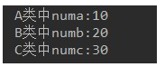

# day12_课后练习

# 阅读代码题

## 第1题

考核知识点：多态、重载、重写

```java
public class Test01 {
	public static void main(String[] args) {
		A a1 = new A();
		A a2 = new B();
		B b = new B();
		C c = new C();
		D d = new D();
		System.out.println("(1)" + a1.show(b));
		System.out.println("(2)" + a2.show(d));
		System.out.println("(3)" + b.show(c));
		System.out.println("(4)" + b.show(d));
	}
}
class A{
	public String show(D obj){
		return ("A and D");
	}
	public String show(A obj){
		return "A and A";
	}
}
class B extends A{
	public String show(B obj){
		return "B and B";
	}
	public String show(A obj){
		return "B and A";
	}
}
class C extends B{
	
}
class D extends B{
	
}
```

## 第2题

考核知识点：多态、重载、重写

```java
public class Test02 {
	public static void main(String[] args) {
		A a1 = new A();
		A a2 = new B();
		B b = new B();
		C c = new C();
		D d = new D();
		System.out.println("(1)" + a1.show(b));
		System.out.println("(2)" + a2.show(d));
		System.out.println("(3)" + b.show(c));
		System.out.println("(4)" + b.show(d));
	}
}

class A {
	public String show(C obj) {
		return ("A and C");
	}

	public String show(A obj) {
		return "A and A";
	}
}

class B extends A {
	public String show(B obj) {
		return "B and B";
	}

	public String show(A obj) {
		return "B and A";
	}
}

class C extends B {

}

class D extends B {

}
```

## 第3题

考核知识点：属性与多态无关

```java
public class Test03 {
	public static void main(String[] args) {
		Base b = new Sub();
		System.out.println(b.x);
	}
}
class Base{
	int x = 1;
}
class Sub extends Base{
	int x = 2;
}
```

## 第4题

考核知识点：权限修饰符

如下代码是否可以编译通过，如果能，结果是什么，如果不能，为什么？

```java
public class Father{
	private String name = "atguigu";
	int age = 0;
}
public class Child extends Father{
	public String grade;
	
	public static void main(String[] args){
		Father f = new Child();
		System.out.println(f.name);
	}
}
```

## 第5题

考核知识点：继承，super，static

如下代码是否可以编译通过，如果能，结果是什么，如果不能，为什么？

```java
public class Person{
	public Person(){
		System.out.println("this is a Person.");
	}
}
public class Teacher extends Person{
	private String name = "tom";
	public Teacher(){
		System.out.println("this is a teacher.");
		super();
	}
	public static void main(String[] args){
		Teacher tea = new Teacher();
		System.out.println(this.name);
	}
}
```


# 代码编程题

## 第6题

* 知识点：抽象类

* 语法点：继承，抽象类
* 按步骤编写代码，效果如图所示：



编写步骤：

1. 定义抽象类A，抽象类B继承A，普通类C继承B
2. A类中，定义成员变量numa，赋值为10，抽象showA方法。
3. B类中，定义成员变量numb，赋值为20，抽象showB方法。
4. C类中，定义成员变量numc，赋值为30，重写showA方法，打印numa，重写showB方法，打印numb，定义showC方法，打印numc。
5. 测试类Test06中，创建C对象，调用showA方法，showB方法，showC方法。

## 第7题

知识点：抽象类

案例：

​	1、声明抽象父类Person，包含抽象方法public abstract void pee();

​	2、声明子类Woman，重写抽象方法，打印坐着尿

​	3、声明子类Man，重写抽象方法，打印站着上尿

​	4、声明测试类Test07，创建Person数组，存放Woman和Man对象，并遍历数组，调用pee()方法

## 第8题

知识点：抽象类

案例：

​	1、声明抽象父类Person，包含抽象方法public abstract void eat();

​	2、声明子类中国人Chinese，重写抽象方法，打印用筷子吃饭

​	3、声明子类美国人American，重写抽象方法，打印用刀叉吃饭

​	4、声明子类印度人Indian，重写抽象方法，打印用手抓饭

​	5、声明测试类Test08，创建Person数组，存储各国人对象，并遍历数组，调用eat()方法

## 第9题

知识点：Object类的方法

案例：

​	1、声明三角形类，包含a,b,c三边

​	（1）属性私有化，提供无参，有参构造，提供get/set

​	（2）重写：toString()

​	（3）重写：hashCode和equals方法

​	（4）编写  public double getArea()：求面积方法

​	（5）编写 public double getPiremeter()：求周长方法

​	2、声明测试类Test09，在测试类中创建两个三角形对象，调用以上方法进行测试