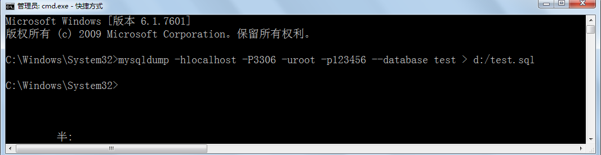

# 第一章 数据库概述

## 1.1 数据库概述

DBMS：数据库管理系统（Database Management System）是一种操纵和管理数据库的大型软件，例如建立、使用和维护数据库。

DB：数据库（Database）

SQL：结构化查询语言，（Structure Query Language），专门用来操作/访问数据库的通用语言。

MySQL：其中的一款关系型数据库管理系统

以下是2019年**DB-Engines Ranking** 对各数据库受欢迎程度进行调查后的统计结果：（查看数据库最新排名:https://db-engines.com/en/ranking）


关系型数据库，采用关系模型来组织数据，简单来说，**关系模型指的就是二维表格模型**。类似于Excel工作表。**非关系型数据库**，可看成传统关系型数据库的功能阉割版本，基于键值对存储数据，通过减少很少用的功能，来提高性能。

### 关系型数据库设计规则

* **遵循ER模型和三范式**

  * E    entity   代表实体的意思      对应到数据库当中的一张表          
  * R    relationship 代表关系的意思  

* **三范式：1、列不能拆分     2、唯一标识    3、关系引用主键**

* **具体体现**

  * 将数据放到表中，表再放到库中。
  * 一个数据库中可以有多个表，每个表都有一个名字，用来标识自己。表名具有唯一性。
  * 表具有一些特性，这些特性定义了数据在表中如何存储，类似java和python中 “类”的设计。
  * 表由列组成，我们也称为**字段**。每个字段描述了它所含有的数据的意义，**数据表的设计实际上就是对字段的设计**。创建数据表时，为每个字段分配一个数据类型，定义它们的数据长度和字段名。每个字段类似java 或者python中的“实例属性”。
  * 表中的数据是按行存储的，一行即为一条记录。每一行类似于java或python中的“对象”。

  

## 1.2  MySQL概述

MySQL**是一种开放源代码的关系型数据库管理系统，开发者为瑞典MySQL AB公司。在2008年1月16号被Sun公司收购。而2009年,SUN又被Oracle收购。目前 MySQL被广泛地应用在Internet上的中小型网站中。由于其**体积小、速度快、总体拥有成本低，尤其是开放源码这一特点，使得很多互联网公司选择了MySQL作为网站数据库（Facebook, Twitter, YouTube，阿里的蚂蚁金服，去哪儿，魅族，百度外卖，腾讯）。


## 1.3 MySQL的使用

### 1.3.1 MySQL服务的启动

“我的电脑/计算机”-->右键-->“管理”-->“服务”-->启动和关闭MySQL服务

或者

命令行

```cmd
net  start  MySQL服务名
net  stop  MySQL服务名
```

### 1.3.2 连接MySQL

命令行：

```cmd
mysql -h 主机IP地址 -P 端口号	-u 用户名	-p回车
Enter Password:密码
```

> 如果访问本机，-h localhost可以省略
>
> 如果端口号没有修改，-P 3306可以省略
>
> 除了-p与密码之间不要空格外，其他的-h,-P,-u与后面的参数值之间可以有空格
>
> 想要连接成功，必须保证服务开启的


# 第二章 导入和导出数据

## 2.1 单个数据库备份

```sql
C:\Windows\System32> mysqldump -h主机地址 -P端口号 -u用户名 -p密码 --database 数据名 > 文件路径/文件名.sql
```

例如：

```sql
C:\Windows\System32>mysqldump -hlocalhost -P3306 -uroot -p123456 --database test > d:/test.sql
```



## 2.2 导入执行备份的sql脚本

先登录mysql，然后执行如下命令：

```sql
mysql> source  sql脚本路径名.sql
```

例如：

```sql
mysql>source d:/test.sql;
```


# 第三章  MySQL数据类型和运算符

## 3.1 MySQL数据类型

整型系列：xxxInt

> int(M)，必须和unsigned zerofill一起使用才有意义


浮点型系列：float,double

> double(M,D)：表示最长为M位，其中小数点后D位
>
> 例如：double(5,2)表示的数据范围[-999.99,999.99]，如果超过这个范围会报错。

定点型系列：decimal

> decimal(M,D)：表示最长为M位，其中小数点后D位

字符串类型：char,varchar(M),text

> char如果没有指定宽度，默认为1个字符
>
> varchar(M)，必须指定宽度

日期时间类型：year, date, datetime, timestamp

> 注意一下每一种日期时间的表示范围


其他类型：bit, xxBlob, 枚举，集合等


## 3.2 MySQL运算符

1、算术运算符

```
加：+
减：-
乘：*
除：/   div（只保留整数部分）
模：%   mod
```

2、比较运算符

```
大于：>
小于：<
大于等于：>=
小于等于：>=
等于：=   不能用于null判断
不等于：!=  或 <>
安全等于：<=>  可以用于null值判断
```

3、逻辑运算符（建议用单词，可读性来说）

```
逻辑与：&& 或 and
逻辑或：|| 或 or
逻辑非：! 或 not
逻辑异或：^ 或 xor
```

4、范围

```
区间范围：between x  and  y
	    not between x  and  y
集合范围：in (xxx)
	    not  in(xxx)
```

5、模糊查询（只针对字符串类型，日期类型）

```
like 'xxx'
如果想要表示0~n个字符，用%
如果想要表示确定的1个字符，用_
```

6、位运算符（很少使用）

```
左移：<<
右移：>>
按位与：&
按位或：|
按位异或：^
```

7、特殊的null值处理

```
#（1）判断时
xx is null
xx is not null
xx <=> null

#(2)计算时
ifnull(xx,代替值)  当xx是null时，用代替值计算
```

```sql
/*一、运算符
1、算术运算符
+：加
-：减
*：乘
/：除   可以保留小数部分
div：除  如果整数与整数相除只保留整数部分
%：求余数
mod：求余数
*/
select 1/2; #0.5
select 1 div 2; #0

/*
2、比较运算符
>：大于
<：小于
=：等于  注意区别，Java中是==,mysql中是=
>=：大于等于
<=：小于等于
!=：不等于
<>：不等于
<=>：安全等于  用于判断null值的比较运算符
		null值的判断，习惯上我们用is null 和is not null
*/
#查询薪资大于20000元的员工
select * from t_employee where salary > 20000;

#查询所有男员工
select * from t_employee where gender = '男';
select * from t_employee where gender != '女';
select * from t_employee where gender <> '女';

#查询奖金比例commision_pct是null的员工
select  * from t_employee where commission_pct <=> null;
select  * from t_employee where commission_pct is null;

/*
3、逻辑运算符
&&和and：逻辑与
	两个条件同时满足
||和or：逻辑或
	两个条件满足任意一个
^和xor：逻辑异或
	两个条件只能满足其中一个
!和not：
	不满足xx条件
	*/
#查询薪资大于20000元的女员工	
select * from t_employee where salary > 20000 && gender = '女';
select * from t_employee where salary > 20000 and gender = '女';

#查询男员工
select * from t_employee where not gender = '女';
select * from t_employee where !(gender = '女');

#查询薪资大于10000  异或 性别是男的，即它俩只能满足一个
#即查询薪资大于10000的女的或薪资低于10000的男的
select * from t_employee where salary>10000 ^ gender ='男';
select * from t_employee where salary>10000 xor gender ='男';
/*
4、范围
（1）区间范围：
	在[a,b]之间，between a and b
	不在[a,b]之间，not between a and b
（2）集合范围
	in(...)
	not in(...)
*/
#查询薪资在[15000,20000]之间的员工
select * from t_employee where salary between 15000 and 20000;
select * from t_employee where salary >= 15000 and salary <=20000;

#查询薪资在9000,10000,12000
select * from t_employee where salary in(9000,10000,12000);
select * from t_employee where salary =9000 || salary =10000 || salary =12000;
 /*
5、模糊查询
like '%x%' x代表确定的字符 %表示不确定的0~n个字符
     '_x%'  x代表确定的字符 _表示确定的1个字符
*/
#查询，名字ename中包含“冰”这个字的员工
select * from t_employee where ename like '%冰%';

#查询，名字ename是张xx，三个字
select * from t_employee where ename like '张__';

#查询，名字ename是第二个字是'冰'
select * from t_employee where ename like '_冰%';

```


# 第四章 SQL

## 4.1 MySQL的语法规范和要求

（1）mysql的sql语法不区分大小写

> MySQL的关键字和函数名等不区分大小写，但是对于数据值是否区分大小写，和字符集与校对规则有关。

ci（大小写不敏感），cs（大小写敏感），_bin（二元，即比较是基于字符编码的值而与language无关，区分大小写）

（2）命名时：尽量使用26个英文字母大小写，数字0-9，下划线，不要使用其他符号

（3）建议不要使用mysql的关键字等来作为表名、字段名等，如果不小心使用，请在SQL语句中使用`（飘号）

（4）数据库和表名、字段名等对象名中间不要包含空格

（5）同一个mysql软件中，数据库不能同名，同一个库中，表不能重名，同一个表中，字段不能重名

（6）标点符号：

> 必须成对
>
> 必须英文状态下半角输入方式
>
> 字符串和日期类型可以使用单引号''
>
> 列的别名可以使用双引号""，给表名取别名不要使用双引号
>
> 如果列的别名没有包含空格，可以省略双引号

（7）SQL脚本中如何加注释

> 单行注释：#注释
>
> 单行注释：--空格 注释
>
> 多行注释：/*    */

## 4.2 SQL分类

DDL：数据定义语言，定义库，表结构等，包括create,drop,alter等

DML：数据操作语言，增删改查数据，包括insert,delete,update,select等

DCL：数据控制语言，权限，事务等管理。


## 4.3 DDL

1、查看所有数据库

```mysql
show databases;
```

2、指定使用某个数据库

```mysql
use 数据库名;
```

3、创建数据库

```mysql
create database 数据库名;

create database 数据库名 charset 'utf8'; #在mysql中字符集名称不要使用utf-8

create database 数据库名 charset 'gbk';
```

4、删除数据库

```mysql
drop database 数据库名;
```

5、查看某个库下的所有表格

```mysql
show tables ;  #前提是前面有use 数据库名;的语句
show tables from 数据库名;
```

6、创建表格

```mysql
create table 【数据名.】表名(
	字段名1 数据类型,
	字段名2 数据类型,
	....
);
```

7、删除表格

```mysql
drop table 【数据库名.]表名称;
```

8、查看某个表结构

```mysql
describe 【数据库名.]表名称;
desc 【数据库名.]表名称;
```

9、增加一列

```mysql
alter table 【数据库名.]表名称 add 【column】 字段名 数据类型;
alter table 【数据库名.]表名称 add 【column】 字段名 数据类型 first;
alter table 【数据库名.]表名称 add 【column】 字段名 数据类型 after 另一个字段;
```

10、删除一列

```mysql
alter table 【数据库名.]表名称 drop 【column】 字段名;
```

11、修改列数据类型

```mysql
alter table 【数据库名.]表名称 modify 【column】 字段名 新数据类型;
```

12、修改列名

```mysql
alter table 【数据库名.]表名称 change【column】 旧字段名 新字段名 新数据类型;
```

13、修改列的位置

```mysql
alter table 【数据库名.]表名称 modify 【column】字段名 数据类型 first;
alter table 【数据库名.]表名称 modify 【column】字段名 数据类型 after 另一个字段;
```

14、修改表名称

```mysql
alter table 旧表名 rename 新表名;
rename table 旧表名 to 新表名;
```


## 4.4 DML

1、添加数据

```mysql
insert into 【数据库名.]表名称 values(值列表)； 
#要求值列表的顺序、个数、类型，要与表格中的字段的顺序、个数、类型一一匹配

insert into 【数据库名.]表名称(部分字段列表) values(值列表)；
#要求列表的顺序、个数、类型，要与前面的(部分字段列表)的顺序、个数、类型一一匹配

insert into 【数据库名.]表名称 values(值列表1)，(值列表2)。。。;

insert into 【数据库名.]表名称(部分字段列表) values(值列表1)，(值列表2)。。。;
```


2、修改数据

```mysql
update 【数据库名.]表名称 set 字段名1 = 值1, 字段名2 = 值2 。。。 【where 条件】;
```

> 如果没有加where条件，表示修改所有行，这个字段的值


3、删除数据

```mysql
delete from 【数据库名.]表名称 【where 条件】;
```

> 如果没有where条件，表示删除整张表的数据;


4、简单查询数据

```mysql
select * from 【数据库名.]表名称; #查询整张表的所有数据

select 字段列表  from 【数据库名.]表名称;  #查询部分列表

select * from 【数据库名.]表名称 【where 条件】;

select 字段列表  from 【数据库名.]表名称 【where 条件】;
```


