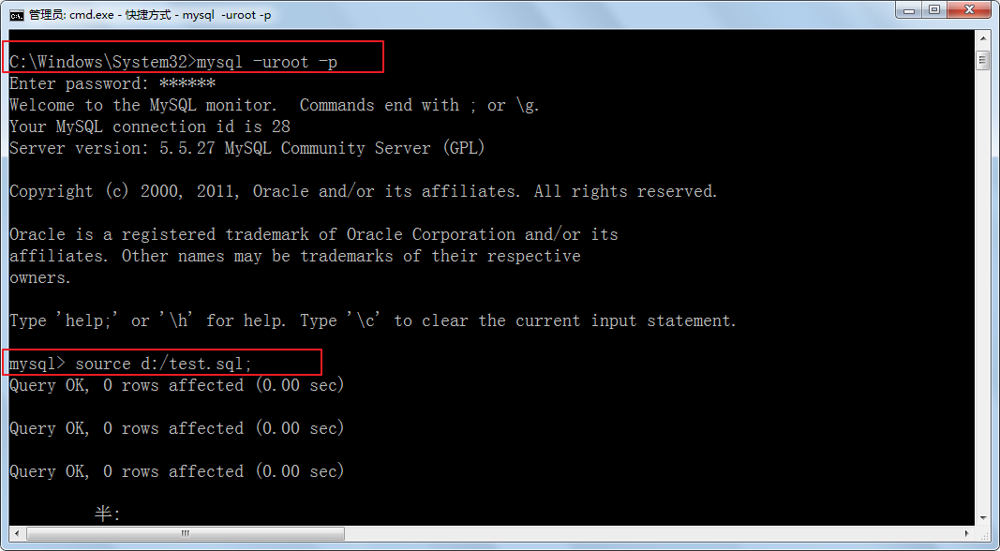

# 第一章 数据库概述


## 1.1 数据库概述

1、为什么要使用数据库？
（1）持久化（永久保存）
（2）方便管理数据

持久化 、永久保存

方便管理数据

**持久化**(persistence)：**把数据保存到可掉电式存储设备中以供之后使用**。持久化的大多数时候是将内存中的数据存储在数据库中，当然也可以存储在磁盘文件、XML数据文件中。

内存中的数据存储在数据库中 当然也可以存储在磁盘文件、XML数据文件中

**方便管理数据（例如：快速的检索等）**

快速的检索


什么是数据库

2、数据库：Database，简称DB
通俗的讲，就是数据 的仓库，专门存储数据的
它保存了一系列有组织的数据的文件系统或数据结构。

数据库  Database

保存数据的仓库  专门存储数据的

保存了一系列有组织的数据文件系统或数据结构


3、数据库管理软件，数据库管理系统，DBMS  Database Management System
mysql,oracle,sql server,db2,redis.....
数据库管理软件：操纵和管理数据库的大型软件

数据库管理软件 数据库管理系统

DBMS  

4、SQL：结构化查询语言  Structured Query Language
专门操作数据库的语言

DBA  SQL  DB、DBMS

沟通的语言 SQL语言是通用的

5、mysql
关系型数据库：二维表
体积小，成本低，速度快，开源等优点

二维表   行 列    

体积小  成本低 速度快  开源等优点  

Key - Value  Redis  

DBMS：数据库管理系统（Database Management System）是一种操纵和管理数据库的大型软件，例如建立、使用和维护数据库。

操纵和管理熟数据库的大型软件  建立、使用和维护数据库 

DBM数据库管理系统是一种操纵和管理数据库的大型软件，例如建立、使用和维护数据库。

DB：数据库（Database）

SQL：结构化查询语言，（Structure Query Language），专门用来操作/访问数据库的通用语言。

MySQL：其中的一款关系型数据库管理系统。

MySQL是一款关系型数据库管理系统

开源、简单点  

MySQL是一种开放源代码的关系型数据库管理系统，开发者为瑞典MySQL AB公司。在2008年1月16号被Sun公司收购。而2009年,SUN又被Oracle收购.目前 MySQL被广泛地应用在Internet上的中小型网站中。由于其体积小、速度快、总体拥有成本低，尤其是开放源码这一特点，使得很多互联网公司选择了MySQL作为网站数据库（Facebook, Twitter, YouTube，阿里的蚂蚁金服，去哪儿，百度，腾讯），求职的目标 嘿嘿。。。

MySQL是一种开发源代码的关系型数据库管理系统  开源的

DB：数据库（Database）即存储数据的“仓库”。它保存了一系列有组织的数据。
DBMS：数据库管理系统（Database Management System）：是一种操纵和管理数据库的大型软件，例如建立、使用和维护数据库。
目前互联网上常见的数据库管理软件有Sybase、DB2、Oracle、MySQL、Access、Visual Foxpro（面向对象型）、MS SQL Server、Informix、PostgreSQL（最符合SQL标准，但是性能差）这几种。以下是2019年DB-Engines Ranking 对各数据库受欢迎程度进行调查后的统计结果：（查看数据库最新排名:https://db-engines.com/en/ranking）

以下是2019年**DB-Engines Ranking** 对各数据库受欢迎程度进行调查后的统计结果：（查看数据库最新排名:https://db-engines.com/en/ranking）


2020-05


Oracle、MySQL、SQL Server  

MongoDB  Redis   Elasticsearch也上了 Search Engine  快速查询

SQLite Android 

数据量特别大 要稳定 要快 

MySQL + ES + Redis

稳定 

**MySQL****是一种开放源代码的关系型数据库管理系统**，开发者为瑞典MySQL AB公司。在2008年1月16号被Sun公司收购。而2009年,SUN又被Oracle收购.目前 MySQL被广泛地应用在Internet上的中小型网站中。由于其体积小、速度快、总体拥有成本低，尤其是开放源码这一特点，使得很多互联网公司选择了MySQL作为网站数据库（Facebook, Twitter, YouTube，阿里的蚂蚁金服，去哪儿，魅族，百度外卖，腾讯）。

阿里巴巴/蚂蚁金服主要使用两种关系数据库：OceanBase和MySQL。数据规模：MySQL单台机器TB级，OceanBase单个集群从几个TB到几百个TB皆有。

Ocean 大量、海洋、广阔

去哪儿：MySQL，Redis，HBase

腾讯社交网络主要使用深度定制MySQL数据库+自研NoSQL，规模万台以上服务器，千万级qps。


百度外卖目前线上主要使用Mysql、redis等数据库。MySQL 数据数百TB级，redis 数据几TB级。

目前魅族OLTP场景主要使用的是MySQL，缓存服务使用的是Redis。数据库实例近1000，数据大小100T+, redis实例1000+。每秒查询率（QPS，Queries-per-second）是对一个特定的查询服务器在规定时间内所处理流量多少的衡量标准。

关系型数据库，采用关系模型来组织数据，简单来说，**关系模型指的就是二维表格模型**。类似于Excel工作表。**非关系型数据库**，可看成传统关系型数据库的功能阉割版本，基于键值对存储数据，通过减少很少用的功能，来提高性能。

关系型数据库 采用关系模型来组织数据，简单来说 关系模型指的就是二维表格模型 类似于Excel工作表 

关系性数据库 太复杂了？为什么通过减少很少用的功能来提高性能呢。

### 关系型数据库设计规则

* **遵循ER模型和三范式**

  * E    entity   代表实体的意思      对应到数据库当中的一张表          
  * R    relationship 代表关系的意思  

  ER模型 entity 实体 对应到数据库当中的一张表  relationship代表关系的意思

* **三范式：1、列不能拆分     2、唯一标识    3、关系引用主键**

  第三范式 关系引用主键 不知道？？？ 关系引用主键是什么意思呢

  

* **具体体现**

  * 将数据放到表中，表再放到库中。
  
  * 一个数据库中可以有多个表，每个表都有一个名字，用来标识自己。表名具有唯一性。
  
  * 表具有一些特性，这些特性定义了数据在表中如何存储，类似java和python中 “类”的设计。

  * 表由列组成，我们也称为**字段**。每个字段描述了它所含有的数据的意义，**数据表的设计实际上就是对字段的设计**。创建数据表时，为每个字段分配一个数据类型，定义它们的数据长度和字段名。每个字段类似java 或者python中的“实例属性”。  
  
    字段的设计  数据类型 定义它们的数据长度和字段名   实例属性
  
  * 表中的数据是按行存储的，一行即为一条记录。每一行类似于java或python中的“对象”。
  
    一个个记录   一个个对象  一个个行  
  
  

## 1.2  MySQL概述

MySQL**是一种开放源代码的关系型数据库管理系统，开发者为瑞典MySQL AB公司。在2008年1月16号被Sun公司收购。而2009年,SUN又被Oracle收购。目前 MySQL被广泛地应用在Internet上的中小型网站中。由于其**体积小、速度快、总体拥有成本低，尤其是开放源码这一特点，使得很多互联网公司选择了MySQL作为网站数据库（Facebook, Twitter, YouTube，阿里的蚂蚁金服，去哪儿，魅族，百度外卖，腾讯）。


## 1.3 Mysql软件的卸载、安装和配置

见《windows版MySQL5的卸载、安装、配置、问题.docx》

# 第二章 MySQL的使用

## 2.1 MySQL服务的启动

“我的电脑/计算机”-->右键-->“管理”-->“服务”-->启动和关闭MySQL服务


“开始菜单”-->“控制面板”-->“管理工具”-->“服务”-->启动和关闭MySQL

“任务管理器”-->“服务”-->启动和关闭MySQL

    

或者

命令行

```cmd
net  start  MySQL服务名
net  stop  MySQL服务名
```

## 2.2 客户端连接MySQL

1、命令行客户端：

```cmd
mysql -h 主机IP地址 -P 端口号	-u 用户名	-p回车
Enter Password:密码
```

> 如果访问本机，-h localhost可以省略
>
> 如果端口号没有修改，-P 3306可以省略
>
> 除了-p与密码之间不要空格外，其他的-h,-P,-u与后面的参数值之间可以有空格
>
> 想要连接成功，必须保证服务开启的
>

2、其他客户端，例如：可视化工具Navicat或SQLyog等


## 2.3 导入和导出数据

### 2.3.1 单个数据库备份

```sql
C:\Windows\System32> mysqldump -h主机地址 -P端口号 -u用户名 -p密码 --database 数据名 > 文件路径/文件名.sql
```

例如：

```sql
C:\Windows\System32>mysqldump -hlocalhost -P3306 -uroot -p123456 --database test > d:/test.sql
```


```sql
mysql> create table stu(id int,name varchar(20));
ERROR 1046 (3D000): No database selected
mysql> show databases;
+--------------------+
| Database           |
+--------------------+
| information_schema |
| blog               |
| community          |
| dianpingdb         |
| eladmin            |
| gloryofkings       |
| gmall              |
| myblog             |
| mysql              |
| performance_schema |
| renren_fast        |
| safety             |
| schooldb           |
| sell               |
| sm                 |
| sys                |
+--------------------+
16 rows in set (0.00 sec)

mysql> use test;
ERROR 1049 (42000): Unknown database 'test'
mysql> create databases test;
ERROR 1064 (42000): You have an error in your SQL syntax; check the manual that corresponds to your MySQL server version for the right syntax to use near 'databases test' at line 1
mysql> create database test;
Query OK, 1 row affected (0.01 sec)

mysql> use test;
Database changed
mysql> create table stu(id int,name varchar(20));
Query OK, 0 rows affected (0.04 sec)

mysql> insert into stu values(1,'张三');
Query OK, 1 row affected (0.01 sec)
```


### 2.3.2 导入执行备份的sql脚本

先登录mysql，然后执行如下命令：

```sql
mysql> source  sql脚本路径名.sql
```

例如：

```sql
mysql>source d:/test.sql;
```




# 第三章  MySQL数据类型和运算符


一、mysql的数据类型
1、整数系列
TINYINT：非常小的整数，类似于Java的byte类型
SMALLINT：小整数，类似于Java的short类型
MEDIUMINT：中整数，Java没有对应
INT、INTEGER：整数，类似于Java的int类型
BIGINT：大整数，类似于Java的long类型

tinyint、smallint、mediumint、int 、integer、bigint

使用int数据类型：
（1）int，等价于int(11)
（2）int(M)：M表示宽度，需要结合另外的两个参数使用
	unsigned：表示无符号，即没有负数 
	zerofill：表示用0填充    zerofill 用0填充 
	例如：int(5)  unsigned zerofill，表示每一个整数有5位数字，如果不足5位的在左边用0凑够5位
	如果只是单独int(5)，那是不会起作用。
无论：int的宽度指定为多少，在内存中都是占4个字节，如果你的数字超过了int(5)也可以存储  ，Java int 展四个字节的。

2、浮点小数
float：4个字节
double：8个字节

使用float和double时：
（1）float或double
（2）float(M,D)，double(M,D)：M表示总位数，D表示精度，即小数点几位
例如：double(5,2)表示的数据范围[-999.99,999.99]，如果超过这个范围会报错。超过了存不了    正负几位 

3、定点小数，类似于Java的BigDecimal，底层使用字符串存储
DECIMAL
DECIMAL(M,D)	

4、日期时间类型
date：只能表示日期
time：表示时间
datetime：表示日期和时间
year：表示年
timestamp：时间戳，表示日期和时间

datetime和timestamp：
（1）timestamp实际存储的毫秒值，显示时，显示根据毫秒值算出来一个本地化的日期时间
    datetime就是存储日期时间
（2）timestamp因为存储的毫秒值，所以在比较和计算时，效率比较高。
（3）datetime和timestamp可以表示的时间范围是不同的

timestamp 实际存储的毫秒值 显示时  显示根据豪秒值算出来一个本地化的日期时间timestamp 

出生日期可以用 date  2028-09-01 

精确秒 datetime timestamp


5、字符串
强调：mysql没有单字符类型，只有字符串类型

char：定长字符串，长度[1,255]
		char，char(1)，长度为1个字符
		char(10),长度为10个字符
varchar：变长字符串
		varchar(M)：必须指定M，这个M的意思是最长不超过M个字符
		例如：varchar(20)，最长不超过20个字符
		
text：长文本
	一般用于存储，文字比较多的，简介等，又不经常检索的信息

char和varchar怎么选择呢

char和varchar
（1）内存占用空间不同
char(M)：M字符就占M个字符的空间
	例如：char(2)  实际存储的是'男'，但是也是占2个字符的位置，那一个空的字符存储的是\u0000  

定长

varchar：实际几个字符 + 1/2个字节的空间
	例如：varchar(20)  实际存储的是'张三',占的2个字符 + 1/2个字节（用来记录实际的字符个数的）

实际占字符 1/2个字节用来记录实际的字符个数的

（2）
varchar节省空间，但是每次存和取，都要数字符个数
char：看起来浪费空间，但是每次存和取，都按照固定的长度去处理的

建议：像身份证号，学号，邮编等定长的字符串使用char，例如：地址等使用变长的
现在mysql的版本对varchar优化的越来越快了，可以使用varchar。
	
6、位类型（了解）
二进制的位类型，BIT(M)类型允许存储M位值。M范围为1~64，默认为1

7、blob系列类型（了解）
BINARY和VARBINARY类型类似于CHAR和VARCHAR类型，但是不同的是，它们存储的不是字符字符串，而是二进制串。所以它们没有字符集。

binary、varbinary  存储的二进制串

8、枚举（ENUM）
	多个中选择一个
9、集合
	多个中可以选择多个
	

## 3.1 MySQL数据类型

整型系列：xxxInt

> int(M)，必须和unsigned zerofill一起使用才有意义


tinyint、smallint、mediumint、int、integer、bigint

浮点型系列：float,double

> double(M,D)：表示最长为M位，其中小数点后D位
>
> 例如：double(5,2)表示的数据范围[-999.99,999.99]，如果超过这个范围会报错。

定点型系列：decimal

> decimal(M,D)：表示最长为M位，其中小数点后D位

字符串类型：char,varchar(M),text

> char如果没有指定宽度，默认为1个字符
>
> varchar(M)，必须指定宽度

日期时间类型：year, date, datetime, timestamp

> 注意一下每一种日期时间的表示范围


其他类型：bit, xxBlob, 枚举，集合等

```mysql
+----------------+--------------+------+-----+---------+----------------+
| Field          | Type         | Null | Key | Default | Extra          |
+----------------+--------------+------+-----+---------+----------------+
| eid            | int(11)      | NO   | PRI | NULL    | auto_increment |
| ename          | varchar(20)  | NO   |     | NULL    |                |
| tel            | char(11)     | NO   |     | NULL    |                |
| gender         | char(1)      | YES  |     | 男        |                |
| salary         | double       | YES  |     | NULL    |                |
| commission_pct | double(3,2)  | YES  |     | NULL    |                |
| birthday       | date         | YES  |     | NULL    |                |
| hiredate       | date         | YES  |     | NULL    |                |
| job_id         | int(11)      | YES  |     | NULL    |                |
| email          | varchar(32)  | YES  |     | NULL    |                |
| mid            | int(11)      | YES  |     | NULL    |                |
| address        | varchar(150) | YES  |     | NULL    |                |
| native_place   | varchar(10)  | YES  |     | NULL    |                |
| did            | int(11)      | YES  |     | NULL    |                |
+----------------+--------------+------+-----+---------+----------------+
```


## 3.2 MySQL运算符

1、算术运算符

```
加：+
减：-
乘：*
除：/   div（只保留整数部分）
模：%   mod
```

2、比较运算符

```
大于：>
小于：<
大于等于：>=
小于等于：>=
等于：=   不能用于null判断
不等于：!=  或 <>
安全等于：<=>  可以用于null值判断
```

3、逻辑运算符（建议用单词，可读性来说）

```
逻辑与：&& 或 and
逻辑或：|| 或 or
逻辑非：! 或 not
逻辑异或：^ 或 xor
```

4、范围

```
区间范围：between x  and  y
	    not between x  and  y
集合范围：in (xxx)
	    not  in(xxx)
```

5、模糊查询（只针对字符串类型，日期类型）

```
like 'xxx'
如果想要表示0~n个字符，用%
如果想要表示确定的1个字符，用_
```

like  '%柳%'

like '菜鸡_'

6、位运算符（很少使用）

```
左移：<<
右移：>>
按位与：&
按位或：|
按位异或：^
```

7、特殊的null值处理

```
#（1）判断时
xx is null
xx is not null
xx <=> null

#(2)计算时
ifnull(xx,代替值)  当xx是null时，用代替值计算
```

```sql
/*一、运算符
1、算术运算符
+：加
-：减
*：乘
/：除   可以保留小数部分
div：除  如果整数与整数相除只保留整数部分
%：求余数
mod：求余数
*/
select 1+1;
select 1/2; #0.5
select 1 div 2; #0

/*
2、比较运算符
>：大于
<：小于
=：等于  注意区别，Java中是==,mysql中是=
>=：大于等于
<=：小于等于
!=：不等于
<>：不等于
<=>：安全等于  用于判断null值的比较运算符
		null值的判断，习惯上我们用is null 和is not null
*/
#查询薪资大于20000元的员工
select * from t_employee where salary > 20000;

#查询所有男员工
select * from t_employee where gender = '男';
select * from t_employee where gender != '女';
select * from t_employee where gender <> '女';

#查询奖金比例commision_pct是null的员工
select  * from t_employee where commission_pct <=> null;
select  * from t_employee where commission_pct is null;

/*
3、逻辑运算符
&&和and：逻辑与
	两个条件同时满足
||和or：逻辑或
	两个条件满足任意一个
^和xor：逻辑异或
	两个条件只能满足其中一个
!和not：
	不满足xx条件
	*/
#查询薪资大于20000元的女员工	
select * from t_employee where salary > 20000 && gender = '女';
select * from t_employee where salary > 20000 and gender = '女';

#查询男员工
select * from t_employee where not gender = '女';
select * from t_employee where !(gender = '女');

#查询薪资大于10000  异或 性别是男的，即它俩只能满足一个
#即查询薪资大于10000的女的或薪资低于10000的男的
select * from t_employee where salary>10000 ^ gender ='男';
select * from t_employee where salary>10000 xor gender ='男';
/*
4、范围
（1）区间范围：
	在[a,b]之间，between a and b
	不在[a,b]之间，not between a and b
（2）集合范围
	in(...)
	not in(...)
*/
#查询薪资在[15000,20000]之间的员工
select * from t_employee where salary between 15000 and 20000;
select * from t_employee where salary >= 15000 and salary <=20000;

#查询薪资在9000,10000,12000
select * from t_employee where salary in(9000,10000,12000);
select * from t_employee where salary =9000 || salary =10000 || salary =12000;
 /*
5、模糊查询
like '%x%' x代表确定的字符 %表示不确定的0~n个字符
     '_x%'  x代表确定的字符 _表示确定的1个字符
*/
#查询，名字ename中包含“冰”这个字的员工
select * from t_employee where ename like '%冰%';

#查询，名字ename是张xx，三个字
select * from t_employee where ename like '张__';

#查询，名字ename是第二个字是'冰'
select * from t_employee where ename like '_冰%';

```


# 第四章 SQL

SQL语句的规范：
1、mysql对于SQL语句不区分大小写，SQL语句关键字尽量大写
show databases;
SHOW DATABASES;
至于表中的数据是否区分大小写，和字符编码，和数据类型，和校对规则有关。
ci：不区分大小写
cs：区分大小写
bin：最严格，区分大小写，以二进制值存储

2、在sql语句中的值，除了数值类型（整数、小数），其他的类型，都使用''引起来。
例如：select * from t_employee where gender ='男';

3、如果在SQL中需要给字段取别名时，可以给别名加""。
如果别名中间没有空格，""可以省略，如果有空格，不能使用""

4、所有标点符号使用英文状态下的半角输入方式

5、必须保证所有(),单引号，双引号是成对结束的

6、可以使用（1）#单行注释 （2）--空格单行注释 （3）/*  多行注释  */

命名规范：
1、必须只能包含 A–Z, a–z, 0–9, _共63个字符
2、不能在对象名的字符间留空格
例如：create database 0513 db; #错误的
3、避免重名
同一个DB数据库中，表不能重名，
同一张表中，字段不能重名
同一个DBMS数据库管理软件中，数据库不能重名
4、命名时不要使用关键字
create database database; #错误的

## 4.1 MySQL的语法规范和要求

（1）mysql的sql语法不区分大小写

> MySQL的关键字和函数名等不区分大小写，但是对于数据值是否区分大小写，和字符集与校对规则有关。

ci（大小写不敏感），cs（大小写敏感），_bin（二元，即比较是基于字符编码的值而与language无关，区分大小写）

（2）命名时：尽量使用26个英文字母大小写，数字0-9，下划线，不要使用其他符号

（3）建议不要使用mysql的关键字等来作为表名、字段名等，如果不小心使用，请在SQL语句中使用`（飘号）引起来

（4）数据库和表名、字段名等对象名中间不要包含空格

（5）同一个mysql软件中，数据库不能同名，同一个库中，表不能重名，同一个表中，字段不能重名

（6）标点符号：

> 必须成对
>
> 必须英文状态下半角输入方式
>
> 字符串和日期类型可以使用单引号''
>
> 列的别名可以使用双引号""，给表名取别名不要使用双引号。取别名时as可以省略
>
> 如果列的别名没有包含空格，可以省略双引号，如果有空格双引号不能省略。

（7）SQL脚本中如何加注释

> 单行注释：#注释内容
>
> 单行注释：--空格注释内容    其中--后面的空格必须有
>
> 多行注释：/* 注释内容 */

```mysql
#以下两句是一样的，不区分大小写
show databases;
SHOW DATABASES;

#创建表格
#create table student info(...); #表名错误，因为表名有空格
create table student_info(...); 

#其中name使用``飘号，因为name和系统关键字或系统函数名等预定义标识符重名了。
CREATE TABLE t_stu(
    id INT,
    `name` VARCHAR(20)
);

select id as "编号", `name` as "姓名" from t_stu; #起别名时，as都可以省略
select id as 编号, `name` as 姓名 from t_stu; #如果字段别名中没有空格，那么可以省略""
select id as 编 号, `name` as 姓 名 from t_stu; #错误，如果字段别名中有空格，那么不能省略""
```

## 4.2 SQL分类

DDL：数据定义语言，定义库，表结构等，包括create,drop,alter等

DML：数据操作语言，增删改查数据，包括insert,delete,update,select等

DCL：数据控制语言，权限，事务等管理。

SQL：
1、DDL：Data Define Language
	数据定义语言，即定义数据的结构。
	例如：create，drop，alter
2、DML：Data Manage Language
	数据管理语言，对数据值的增、删、改、查
	例如：insert，delete，update，select
3、DCL：Data Control Language
	数据控制语言，对权限、事务等的控制
	例如：grant,revoke,commit,rollback等
	

## 4.3 DDL(v1.0)

1、查看所有数据库

```mysql
show databases;
```

2、指定使用某个数据库

```mysql
use 数据库名;
```

3、创建数据库

```mysql
create database 数据库名;

create database 数据库名 charset 'utf8'; #在mysql中字符集名称不要使用utf-8

create database 数据库名 charset 'gbk';
```

4、删除数据库

```mysql
drop database 数据库名;
```

5、查看某个库下的所有表格

```mysql
show tables ;  #前提是前面有use 数据库名;的语句
show tables from 数据库名;
```

6、创建表格

```mysql
create table 【数据名.】表名(
	字段名1 数据类型,
	字段名2 数据类型,
	....
);

```


7、删除表格

```mysql
drop table 【数据库名.]表名称;
```

8、查看某个表结构

```mysql
describe 【数据库名.]表名称;
desc 【数据库名.]表名称;
```

9、增加一列

```mysql
alter table 【数据库名.]表名称 add 【column】 字段名 数据类型;
alter table 【数据库名.]表名称 add 【column】 字段名 数据类型 first;
alter table 【数据库名.]表名称 add 【column】 字段名 数据类型 after 另一个字段;
```

10、删除一列

```mysql
alter table 【数据库名.]表名称 drop 【column】 字段名;
```

11、修改列数据类型

```mysql
alter table 【数据库名.]表名称 modify 【column】 字段名 新数据类型;
```

12、修改列名

```mysql
alter table 【数据库名.]表名称 change【column】 旧字段名 新字段名 新数据类型;
```

13、修改列的位置

```mysql
alter table 【数据库名.]表名称 modify 【column】字段名 数据类型 first;
alter table 【数据库名.]表名称 modify 【column】字段名 数据类型 after 另一个字段;
```

14、修改表名称

```mysql
alter table 旧表名 rename 新表名;
rename table 旧表名 to 新表名;
```


## 4.4 DML(v1.0)

1、添加数据

```mysql
insert into 【数据库名.]表名称 values(值列表)； 
#要求值列表的顺序、个数、类型，要与表格中的字段的顺序、个数、类型一一匹配

insert into 【数据库名.]表名称(部分字段列表) values(值列表)；
#要求列表的顺序、个数、类型，要与前面的(部分字段列表)的顺序、个数、类型一一匹配

insert into 【数据库名.]表名称 values(值列表1)，(值列表2)。。。;

insert into 【数据库名.]表名称(部分字段列表) values(值列表1)，(值列表2)。。。;
```

2、修改数据

```mysql
update 【数据库名.]表名称 set 字段名1 = 值1, 字段名2 = 值2 。。。 【where 条件】;
```

> 如果没有加where条件，表示修改所有行，这个字段的值


3、删除数据

```mysql
delete from 【数据库名.]表名称 【where 条件】;
```

> 如果没有where条件，表示删除整张表的数据;

```mysql
truncate 【数据库名.]表名称;#删除整张表的数据，还可以使用这个语句，效率更高，但是它不能回滚
```

用delete删除整张表和用truncate删除整张表的数据的区别？

（1）truncate速度快

（2）truncate无法回滚

truncate因为底层是把表drop掉，然后新建了一张空表。

delete因为底层是一行一行删数据。


4、简单查询数据

```mysql
select * from 【数据库名.]表名称; #查询整张表的所有数据

select 字段列表  from 【数据库名.]表名称;  #查询部分列表

select * from 【数据库名.]表名称 【where 条件】;

select 字段列表  from 【数据库名.]表名称 【where 条件】;
```

> 使用distinct可以对查询结果进行去重

# 第五章  约束与索引

## 5.1 关系型数据库设计规则

* **遵循ER模型和三范式**

  * E    entity   代表实体的意思      对应到数据库当中的一张表          
  * R    relationship 代表关系的意思  

* **三范式：1、列不能拆分     2、唯一标识    3、关系引用主键**

* **具体体现**

  * 将数据放到表中，表再放到库中。
  * 一个数据库中可以有多个表，每个表都有一个名字，用来标识自己。表名具有唯一性。
  * 表具有一些特性，这些特性定义了数据在表中如何存储，类似java和python中 “类”的设计。
  * 表由列组成，我们也称为**字段**。每个字段描述了它所含有的数据的意义，**数据表的设计实际上就是对字段的设计**。创建数据表时，为每个字段分配一个数据类型，定义它们的数据长度和字段名。每个字段类似java 或者python中的“实例属性”。
  * 表中的数据是按行存储的，一行即为一条记录。每一行类似于java或python中的“对象”。

  

## 5.2  约束与索引的概念

1、数据完整性（Data Integrity）是指数据的精确性（Accuracy）和可靠性（Reliability）。它是应防止数据库中存在不符合语义规定的数据和防止因错误信息的输入输出造成无效操作或错误信息而提出的。

数据的完整性要从以下四个方面考虑：

* 实体完整性（Entity Integrity）：例如，同一个表中，不能存在两条完全相同无法区分的记录
* 域完整性（Domain Integrity）：例如：年龄范围0-120，性别范围“男/女”
* 引用完整性（Referential Integrity）：例如：员工所在部门，在部门表中要能找到这个部门
* 用户自定义完整性（User-defined Integrity）：例如：用户名唯一、密码不能为空等，本部门经理的工资不得高于本部门职工的平均工资的5倍。

2、根据约束的特点，分为几种：

* 键约束：主键约束、外键约束、唯一键约束
* Not NULL约束：非空约束
* Check约束：检查约束
* Default约束：默认值约束
* 自增约束

3、约束（CONSTRAINTS）与索引（INDEX）

约束是用来对数据业务规则和数据完整性进行实施、维护。约束的作用范围仅限在当前数据库，约束可以被当做**数据库对象**来处理，它们具有名称和关联模式。是逻辑约束，不会因为设置约束而额外占用空间。

**索引**是一个单独、物理的存储在数据页上的数据库结构，它是表中**一列或若干列值的集合**和相应的指向表中数据值的物理标识数据页的**逻辑指针清单**（类似于新华字典的目录索引页）。索引的存在会增加数据库的存储空间，也会使插入、修改数据的时间开销变多(因为插入和修改数据时，索引也要随之变动），但是可以大大提高查询速度。因此应该在键列、或其他经常要查询、排序、按范围查找的列上建立索引，而对于在查询中很少使用和参考的列、修改非常频繁的列，值很少的列（例如性别只有男和女）等列上不应该创建索引。

>Mysql会在主键、唯一键、外键列上自动创建索引，其他列需要建立索引的话，需要手动创建。
>
>其中主键删除，对应的索引也会删除
>
>删除唯一键的方式是通过删除对应的索引来实现的
>
>删除外键，外键列上的索引还在，如果需要删除，需要单独删除索引

## 5.3  DDL(v2.0)

### 1、查看某个表的约束

```mysql
SELECT * FROM information_schema.table_constraints WHERE table_name = '表名称';
或
SHOW CREATE TABLE 表名;
```

### 2、查看某个表的索引

```mysql
SHOW INDEX FROM 表名称;
```

### 3、主键约束：primary key

主键分为单列主键和复合主键：


主键的特点：（1）唯一并且非空（2）一个表只能有一个主键约束（3）主键约束名就叫做PRIMARY（4）创建主键会自动创建对应的索引，同样删除主键对应的索引也会删除。

（1）如何在建表时指定主键约束

```mysql
create table 【数据名.】表名(
	字段名1 数据类型  primary key ,
	....
);
或
create table 【数据名.】表名(
	字段名1 数据类型,
	....,
    primary key(字段名1)
);
或
create table 【数据名.】表名(
    字段名1 数据类型,
    字段名2 数据类型,
	....,
    primary key(复合主键字段列表)#如果是复合主键，那么就需要在所有字段列表后面使用这种形式指定，不能在字段后面直接加primary key
);
```

（2）如何在建表后指定主键约束

```mysql
alter table 表名称 add primary key (主键字段列表);
```

（3）如何删除主键约束

```mysql
alter table 表名称 drop primary key;
```

### 4、唯一键约束：unique key

（1）唯一键约束特点

同一个表可以有多个唯一约束。

唯一约束可以是某一个列的值唯一，也可以多个列组合值的唯一。

MySQL会给唯一约束的列上默认创建一个唯一索引。

删除唯一键只能通过删除对应索引的方式删除，删除时需要指定唯一键索引名

（2）如何在建表时指定唯一键约束

```mysql
create table 【数据名.】表名(
	字段名1 数据类型  primary key ,
	字段名2 数据类型 unique key,
	....
);

create table 【数据名.】表名(
    字段名1 数据类型  primary key ,
    字段名2 数据类型,
    字段名3 数据类型,
	....,
    unique key(复合唯一字段列表)#如果是复合唯一键，那么就需要在所有字段列表后面使用这种形式指定，不能在字段后面直接加unique key
);
```

（3）如何在建表后增加唯一键约束

```mysql
alter table 表名称 add 【constraint 约束名】 unique 【key】 (字段名列表);
#如果没有指定约束名，(字段名列表)中只有一个字段的，默认是该字段名，如果是多个字段的默认是字段名列表的第1个字段名。也可以通过show index from 表名;来查看
```

（4）如何删除唯一键约束

```mysql
ALTER TABLE 表名称 DROP INDEX 唯一性约束名;
#注意：如果忘记名称，可以通过“show index from 表名称;”查看
```

### 5、外键约束：foreign key

（1）外键特点

* 外键约束是保证一个或两个表之间的参照完整性,外键是构建于一个表的两个字段或是两个表的两个字段之间的参照关系。
* 在创建外键约束时，如果不给外键约束名称，默认名不是列名，而是自动产生一个外键名（例如 student_ibfk_1;），也可以指定外键约束名。

* 当创建外键约束时，系统默认会在所在的列上建立对应的普通索引。但是索引名是列名，不是外键的约束名。

* 删除外键时，关于外键列上的普通索引需要单独删除。

（2）要求

* 在从表上建立外键，而且主表要先存在。

* 一个表可以建立多个外键约束

* 从表的外键列，在主表中引用的只能是键列（主键，唯一键，外键），推荐引用主表的主键。

* 从表的外键列与主表被参照的列名字可以不相同，但是数据类型必须一样

（3）约束关系：约束是针对双方的

添加了外键约束后，主表的修改和删除受约束

添加了外键约束后，从表的添加和修改受约束

（4）5个约束等级

* Cascade方式：在父表上update/delete记录时，同步update/delete掉子表的匹配记录 

* Set null方式：在父表上update/delete记录时，将子表上匹配记录的列设为null，但是要注意子表的外键列不能为not null  

* No action方式：如果子表中有匹配的记录,则不允许对父表对应候选键进行update/delete操作  

* Restrict方式：同no action, 都是立即检查外键约束

* Set default方式（在可视化工具SQLyog中可能显示空白）：父表有变更时,子表将外键列设置成一个默认的值，但Innodb不能识别

如果没有指定等级，就相当于Restrict方式

（5）如何在建表时指定外键约束

```mysql
create table 【数据名.】从表名(
	字段名1 数据类型  primary key ,
	字段名2 数据类型 【unique key】,
	....,
    【constraint 外键约束名】 foreign key (从表字段) references 主表名(主表字段) 【on update 外键约束等级】【on delete 外键约束等级【
    #外键只能在所有字段列表后面单独指定
    #如果要自己命名外键约束名，建议 主表名_从表名_关联字段名_fk
);

create table 【数据名.】表名(
    字段名1 数据类型,
    字段名2 数据类型,
	....,
    primary key(复合主键字段列表),#如果是复合主键，那么就需要在所有字段列表后面使用这种形式指定，不能在字段后面直接加primary key
    unique key(复合唯一字段列表),#如果是复合唯一键，那么就需要在所有字段列表后面使用这种形式指定，不能在字段后面直接加unique key
    foreign key (从表字段) references 主表名(主表字段) 【on update 外键约束等级】【on delete 外键约束等级【
    #外键只能在所有字段列表后面单独指定
);
```

（6）如何在建表后指定外键约束

```mysql
alter table表名称 add 【constraint 外键约束名】 foreign key (从表字段名) references 主表名(主表被参照字段名) 【on update xx】[on delete xx];
```

（7）如何删除外键约束

```mysql
ALTER TABLE 表名称 DROP FOREIGN KEY 外键约束名;
#查看约束名 SELECT * FROM information_schema.table_constraints WHERE table_name = '表名称';
#删除外键约束不会删除对应的索引，如果需要删除索引，需要用ALTER TABLE 表名称 DROP INDEX 索引名;
#查看索引名 show index from 表名称;
```

### 6、非空约束：not null

NOT NULL 非空约束，规定某个字段不能为空

（1）如何在建表时给某个字段指定非空约束

```mysql
create table 【数据名.】表名(
	字段名1 数据类型  primary key ,
	字段名2 数据类型 【unique key】 【not null】,
	....,
    foreign key (从表字段) references 主表名(主表字段) 【on update 外键约束等级】【on delete 外键约束等级【
    #外键只能在所有字段列表后面单独指定
);

create table 【数据名.】表名(
    字段名1 数据类型 【not null】,
    字段名2 数据类型 【not null】,
	....,
    primary key(复合主键字段列表),#如果是复合主键，那么就需要在所有字段列表后面使用这种形式指定，不能在字段后面直接加primary key
    unique key(复合唯一字段列表),#如果是复合唯一键，那么就需要在所有字段列表后面使用这种形式指定，不能在字段后面直接加unique key
    foreign key (从表字段) references 主表名(主表字段) 【on update 外键约束等级】【on delete 外键约束等级【
    #外键只能在所有字段列表后面单独指定
);
```

（2）如何在建表后指定某个字段非空

```mysql
ALTER TABLE 表名称 MODIFY 字段名 数据类型 NOT NULL 【default 默认值】;
#如果该字段原来设置了默认值约束，要跟着一起再写一遍，否则默认值约束会丢失
```

（3）如何在建表后取消某个字段非空

```mysql
ALTER TABLE 表名称 MODIFY 字段名 数据类型 【default 默认值】;
#如果该字段原来设置了默认值约束，要跟着一起再写一遍，否则默认值约束会丢失
```

### 7、默认值约束：default

（1）如何在建表时给某个字段指定默认约束

```mysql
create table 【数据名.】表名(
	字段名1 数据类型  primary key ,
	字段名2 数据类型 【unique key】 【not null】 【default 默认值】,
	....,
    foreign key (从表字段) references 主表名(主表字段) 【on update 外键约束等级】【on delete 外键约束等级【
    #外键只能在所有字段列表后面单独指定
);

create table 【数据名.】表名(
    字段名1 数据类型 【not null】 【default 默认值】,
    字段名2 数据类型 【not null】 【default 默认值】,
	....,
    primary key(复合主键字段列表),#如果是复合主键，那么就需要在所有字段列表后面使用这种形式指定，不能在字段后面直接加primary key
    unique key(复合唯一字段列表),#如果是复合唯一键，那么就需要在所有字段列表后面使用这种形式指定，不能在字段后面直接加unique key
    foreign key (从表字段) references 主表名(主表字段) 【on update 外键约束等级】【on delete 外键约束等级【
    #外键只能在所有字段列表后面单独指定
);
```

（2）如何在建表后指定某个字段的默认值约束

```mysql
ALTER TABLE 表名称 MODIFY 字段名 数据类型  【default 默认值】 【NOT NULL】;
#如果该字段原来设置了非空约束，要跟着一起再写一遍，否则非空约束会丢失
```

（3）如何在建表后取消某个字段的默认值约束

```mysql
ALTER TABLE 表名称 MODIFY 字段名 数据类型 【NOT NULL】;
#如果该字段原来设置了非空约束，要跟着一起再写一遍，否则非空约束会丢失
```

### 8、检查约束：check 

检查约束，mysql暂不支持

### 9、自增约束：auto_increment

（1）关于自增长auto_increment：

* 一个表最多只能有一个自增长列
* 自增长列必须是键列（主键列，唯一键列，外键列），并且要求非空。
* 自增列必须是整数类型
* InnoDB表的自动增长列可以手动插入，但是插入的值如果是空或者0，则实际插入的将是自动增长后的值。

（2）如何在建表时指定自增长列

```mysql
create table 【数据名.】表名(
	字段名1 数据类型  primary key auto_increment,
	字段名2 数据类型 【unique key】 【not null】 【default 默认值】,
	....
);

或
create table 【数据名.】表名(
	字段名1 数据类型  primary key ,
	字段名2 数据类型 【unique key  not null】 auto_increment,
	....
);
```

（3）如何在建表后指定自增长列

```mysql
alter table 【数据名.】表名 modify 自增字段名 数据类型 auto_increment;
```

（4）如何删除自增约束

```mysql
alter table 【数据名.】表名 modify 自增字段名 数据类型;
```

## 5.4 DML(v2.0)

1、如果某列有自增约束，怎么添加该字段的值

添加数据时，对于自增列

```mysql
insert into 【数据库名.]表名称 values(值列表)；#在值列表中，对应自增列可以赋值为null和0

insert into 【数据库名.]表名称(部分字段列表) values(值列表)；#自增列在(部分字段列表)中不写就可以
```

2、如果某列有默认值约束，怎么添加、修改该字段的值

添加数据时，对于有默认值列

```mysql
insert into 【数据库名.]表名称 values(值列表)；#在值列表中，对应默认值列，如果想用默认值，用default

insert into 【数据库名.]表名称(部分字段列表) values(值列表)；#对应默认值列，如果想用默认值，在(部分字段列表)中不写就可以
```

修改数据

```mysql
update 【数据库名.]表名称 set 字段名1 = 值1, 字段名2 = 值2 。。。 【where 条件】; #对应默认值列，如果想用默认值，写字段名 = default就可以
```

# 第六章 函数

**两种SQL函数**


## **6.1单行函数**

* **只对一行进行变换，每行返回一个结果**
* 可以嵌套
* 参数可以是一字段或一个表达式或一个值

### 6.1.1 字符串函数

| 函数                            | 用法                                                         |
| ------------------------------- | ------------------------------------------------------------ |
| CONCAT(S1,S2,......,Sn)         | 连接S1,S2,......,Sn为一个字符串                              |
| CONCAT_WS(s, S1,S2,......,Sn)   | 同CONCAT(s1,s2,...)函数，但是每个字符串之间要加上s           |
| CHAR_LENGTH(s)                  | 返回字符串s的字符数                                          |
| LENGTH(s)                       | 返回字符串s的字节数，和字符集有关                            |
| INSERT(str, index , len, instr) | 将字符串str从第index位置开始，len个字符长的子串替换为字符串instr |
| UPPER(s) 或 UCASE(s)            | 将字符串s的所有字母转成大写字母                              |
| LOWER(s)  或LCASE(s)            | 将字符串s的所有字母转成小写字母                              |
| LEFT(s,n)                       | 返回字符串s最左边的n个字符                                   |
| RIGHT(s,n)                      | 返回字符串s最右边的n个字符                                   |
| LPAD(str, len, pad)             | 用字符串pad对str最左边进行填充，直到str的长度为len个字符     |
| RPAD(str ,len, pad)             | 用字符串pad对str最右边进行填充，直到str的长度为len个字符     |
| LTRIM(s)                        | 去掉字符串s左侧的空格                                        |
| RTRIM(s)                        | 去掉字符串s右侧的空格                                        |
| TRIM(s)                         | 去掉字符串s开始与结尾的空格                                  |
| TRIM(【BOTH 】s1 FROM s)        | 去掉字符串s开始与结尾的s1                                    |
| TRIM(【LEADING】s1 FROM s)      | 去掉字符串s开始处的s1                                        |
| TRIM(【TRAILING】s1 FROM s)     | 去掉字符串s结尾处的s1                                        |
| REPEAT(str, n)                  | 返回str重复n次的结果                                         |
| REPLACE（str, a, b）            | 用字符串b替换字符串str中所有出现的字符串a                    |
| STRCMP(s1,s2)                   | 比较字符串s1,s2                                              |
| SUBSTRING(s,index,len)          | 返回从字符串s的index位置其len个字符                          |


* **举例1：大小写控制函数**

| 函数                    | 结果           |
| ----------------------- | -------------- |
| **LOWER('SQL Course')** | **sql course** |
| **UPPER('SQL Course')** | **SQL COURSE** |

> 这类函数改变字符的大小写。

* **举例2：字符控制函数**

| 函数                            | 结果                  |
| ------------------------------- | --------------------- |
| **CONCAT('Hello','World')**     | **HelloWorld**        |
| **SUBSTR('HelloWorld',1,5)**    | **Hello**             |
| **LENGTH('HelloWorld')**        | **10**                |
| **INSTR('HelloWorld','W')**     | **6**                 |
| **LPAD(salary,10,'\*')**        | **\*\*\*\*\*24000**   |
| **RPAD(salary,10, '\*')**       | **24000\**\**\*\*\*** |
| **TRIM('H' FROM 'HelloWorld')** | **elloWorld**         |
| **REPLACE('abcd','b','m')**     | **amcd**              |

### 6.1.2 数值函数/数学函数

| 函数          | 用法                                 |
| ------------- | ------------------------------------ |
| ABS(x)        | 返回x的绝对值                        |
| CEIL(x)       | 返回大于x的最小整数值                |
| FLOOR(x)      | 返回小于x的最大整数值                |
| MOD(x,y)      | 返回x/y的模                          |
| RAND()        | 返回0~1的随机值                      |
| ROUND(x,y)    | 返回参数x的四舍五入的有y位的小数的值 |
| TRUNCATE(x,y) | 返回数字x截断为y位小数的结果         |
| SQRT(x)       | 返回x的平方根                        |
| POW(x,y)      | 返回x的y次方                         |

* **举例1：ROUND:四舍五入**

```
ROUND(45.926, 2)     -->  45.93
```

* **举例2：TRUNCATE:截断**

```
TRUNCATE(45.926)      --> 45
```

* **举例3：MOD:求余**

```sql
MOD(1600, 300)	 --> 100
```


### 6.1.3 日期函数

| 函数                                                         | 用法                                                      |
| ------------------------------------------------------------ | --------------------------------------------------------- |
| **CURDATE()** 或 CURRENT_DATE()                              | 返回当前日期                                              |
| **CURTIME()** 或 CURRENT_TIME()                              | 返回当前时间                                              |
| **NOW()** / SYSDATE() / CURRENT_TIMESTAMP() / LOCALTIME() / LOCALTIMESTAMP() | 返回当前系统日期时间                                      |
| **YEAR(date) / MONTH(date) / DAY(date) / HOUR(time) / MINUTE(time) / SECOND(time)** | 返回具体的时间值                                          |
| WEEK(date) / WEEKOFYEAR(date)                                | 返回一年中的第几周                                        |
| DAYOFWEEK()                                                  | 返回周几，注意：周日是1，周一是2，。。。周六是7           |
| WEEKDAY(date)                                                | 返回周几，注意，周1是0，周2是1，。。。周日是6             |
| DAYNAME(date)                                                | 返回星期：MONDAY,TUESDAY.....SUNDAY                       |
| MONTHNAME(date)                                              | 返回月份：January，。。。。。                             |
| DATEDIFF(date1,date2) / TIMEDIFF(time1, time2)               | 返回date1 - date2的日期间隔 / 返回time1 - time2的时间间隔 |
| DATE_ADD(datetime, INTERVAL  expr type)                      | 返回与给定日期时间相差INTERVAL时间段的日期时间            |
| DATE_FORMAT(datetime ,fmt)                                   | 按照字符串fmt格式化日期datetime值                         |
| STR_TO_DATE(str, fmt)                                        | 按照字符串fmt对str进行解析，解析为一个日期                |

其中：

**（1）DATE_ADD(datetime,INTERVAL  expr type)**

表达式类型：

| 参数类型 | 参数类型      |
| -------- | ------------- |
| YEAR     | YEAR_MONTH    |
| MONTH    | DAY_HOUR      |
| DAY      | DAY_MINUTE    |
| HOUR     | DAY_SECOND    |
| MINUTE   | HOUR_MINUTE   |
| SECOND   | HOUR_SECOND   |
|          | MINUTE_SECOND |

举例：

```sql
SELECT DATE_ADD(NOW(), INTERVAL 1 YEAR);
SELECT DATE_ADD(NOW(), INTERVAL -1 YEAR);   #可以是负数
SELECT DATE_ADD(NOW(), INTERVAL '1_1' YEAR_MONTH);   #需要单引号

```


**（2）DATE_FORMAT(datetime,fmt) 和 STR_TO_DATE(str, fmt)**

| 格式符 | 说明                                                        | 格式符 | 说明                                                        |
| ------ | ----------------------------------------------------------- | ------ | ----------------------------------------------------------- |
| %Y     | 4位数字表示年份                                             | %y     | 表示两位数字表示年份                                        |
| %M     | 月名表示月份（January,....）                                | %m     | 两位数字表示月份（01,02,03。。。）                          |
| %b     | 缩写的月名（Jan.，Feb.，....）                              | %c     | 数字表示月份（1,2,3,...）                                   |
| %D     | 英文后缀表示月中的天数（1st,2nd,3rd,...）                   | %d     | 两位数字表示月中的天数(01,02...)                            |
| %e     | 数字形式表示月中的天数（1,2,3,4,5.....）                    |        |                                                             |
| %H     | 两位数字表示小数，24小时制（01,02..）                       | %h和%I | 两位数字表示小时，12小时制（01,02..）                       |
| %k     | 数字形式的小时，24小时制(1,2,3)                             | %l     | 数字形式表示小时，12小时制（1,2,3,4....）                   |
| %i     | 两位数字表示分钟（00,01,02）                                | %S和%s | 两位数字表示秒(00,01,02...)                                 |
| %W     | 一周中的星期名称（Sunday...）                               | %a     | 一周中的星期缩写（Sun.，Mon.,Tues.，..）                    |
| %w     | 以数字表示周中的天数(0=Sunday,1=Monday....)                 |        |                                                             |
| %j     | 以3位数字表示年中的天数(001,002...)                         | %U     | 以数字表示年中的第几周，（1,2,3。。）其中Sunday为周中第一天 |
| %u     | 以数字表示年中的第几周，（1,2,3。。）其中Monday为周中第一天 |        |                                                             |
| %T     | 24小时制                                                    | %r     | 12小时制                                                    |
| %p     | AM或PM                                                      | %%     | 表示%                                                       |


### 6.1.4 流程函数

| 函数                                                         | 用法                                         |
| ------------------------------------------------------------ | -------------------------------------------- |
| IF(value,t ,f)                                               | 如果value是真，返回t，否则返回f              |
| IFNULL(value1, value2)                                       | 如果value1不为空，返回value1，否则返回value2 |
| CASE WHEN 条件1 THEN result1 WHEN 条件2 THEN result2 .... [ELSE resultn] END | 相当于Java的if...else if...else...           |
| CASE  expr WHEN 常量值1 THEN 值1 WHEN 常量值1 THEN 值1 .... [ELSE 值n] END | 相当于Java的switch...case...                 |

* 举例1：

```sql
SELECT employee_id,12 * salary * (1 + IFNULL(commission_pct,0)) as "年薪"
FROM employees;
```

* 举例2：

```sql
SELECT last_name, job_id, salary,
       CASE job_id WHEN 'IT_PROG'  THEN  1.10*salary
                   WHEN 'ST_CLERK' THEN  1.15*salary
                   WHEN 'SA_REP'   THEN  1.20*salary
       ELSE      salary END     "实发工资"
FROM   employees;
```

* 举例3：

```
SELECT employee_id,salary, CASE WHEN salary>=15000 THEN '高薪' 
				  WHEN salary>=10000 THEN '潜力股'  
				  WHEN salary>=8000 THEN '屌丝' 
				  ELSE '草根' END  "描述"
FROM employees; 
```

### 6.1.5 其他函数

| 函数          | 用法                                    |
| ------------- | --------------------------------------- |
| database()    | 返回当前数据库名                        |
| version()     | 返回当前数据库版本                      |
| user()        | 返回当前登录用户名                      |
| password(str) | 返回字符串str的加密版本，41位长的字符串 |
| md5(str)      | 返回字符串str的md5值，也是一种加密方式  |

## 6.2 分组函数

* **什么是分组函数**

分组函数作用于一组数据，并对一组数据返回一个值。


* **组函数类型**
  * **AVG()** 
  * **SUM()**
  * **MAX()** 
  * **MIN()** 
  * **COUNT() **

可以对**数值型数据**使用AVG 和 SUM 函数。

```sql
SELECT AVG(salary), MAX(salary),MIN(salary), SUM(salary)
FROM   employees
WHERE  job_id LIKE '%REP%';

```

可以对**任意数据类型**的数据使用 MIN 和 MAX 函数。

```sql
SELECT MIN(hire_date), MAX(hire_date)
FROM	  employees;
```

COUNT(*)count(1返回表中记录总数,适用于**任意数据类型**。

```sql
SELECT COUNT(*)
FROM	  employees
WHERE  department_id = 50;
```

•COUNT(expr) 返回**expr不为空**的记录总数。

```sql
SELECT COUNT(commission_pct)
FROM   employees
WHERE  department_id = 50;
```

* **问题：用count(*)，count(1)谁好呢?**

  其实，对于myisam引擎的表是没有区别的。这种引擎内部有一计数器在维护着行数。

  Innodb引擎的表用count(*)直接读行数，效率很低，因为innodb真的要去数一遍。


# 第七章 关联查询（联合查询）

七种结果：


（1）A∩B

（2）A

（3）A -  A∩B

（4）B

（5）B - A∩B

（6）A ∪ B

（7）A ∪B- A∩B    或者   (A -  A∩B) ∪ （B - A∩B）


如何实现？

（1）内连接

（2）外连接：左外连接、右外连接、全外连接（mysql使用union代替全外连接）


1、内连接：实现A∩B

```mysql
select 字段列表
from A表 inner join B表
on 关联条件
where 等其他子句;

或

select 字段列表
from A表 , B表
where 关联条件 and 等其他子句;
```

代码示例：

```mysql
#查询员工的姓名和他所在的部门的名称
#员工的姓名在t_employee
#部门的名称在t_department
SELECT ename "员工的姓名",dname "部门名称"
FROM t_employee INNER JOIN t_department
ON t_employee.did = t_department.did

SELECT ename "员工的姓名",dname "部门名称"
FROM t_employee , t_department
WHERE t_employee.did = t_department.did


#查询薪资高于20000的男员工的姓名和他所在的部门的名称
SELECT ename "员工的姓名",dname "部门名称"
FROM t_employee INNER JOIN t_department
ON t_employee.did = t_department.did
WHERE salary>20000 AND gender = '男'
```


2、左外连接

```mysql
#实现查询结果是A
select 字段列表
from A表 left join B表
on 关联条件
where 等其他子句;

#实现A -  A∩B
select 字段列表
from A表 left join B表
on 关联条件
where 从表关联字段 is null and 等其他子句;
```

代码示例：

```mysql
#查询所有员工的姓名和他所在的部门的名称
SELECT ename "员工的姓名",dname "部门名称"
FROM t_employee LEFT JOIN t_department
ON t_employee.did = t_department.did


#查询所有没有部门的员工
SELECT ename "员工的姓名",dname "部门名称"
FROM t_employee LEFT JOIN t_department
ON t_employee.did = t_department.did
WHERE t_employee.did IS NULL
```


3、右外连接

```mysql
#实现查询结果是B
select 字段列表
from A表 right join B表
on 关联条件
where 等其他子句;

#实现B -  A∩B
select 字段列表
from A表 right join B表
on 关联条件
where 从表关联字段 is null and 等其他子句;
```

代码示例：

```mysql
#查询所有部门，以及所有部门下的员工信息
SELECT * 
FROM t_employee RIGHT JOIN t_department
ON t_employee.did = t_department.did

#查询那些没有员工属于它的部门
SELECT * 
FROM t_employee RIGHT JOIN t_department
ON t_employee.did = t_department.did
WHERE t_employee.did IS NULL
```


4、用union代替全外连接

```mysql
#实现查询结果是A∪B
#用左外的A，union 右外的B
select 字段列表
from A表 left join B表
on 关联条件
where 等其他子句

union 

select 字段列表
from A表 right join B表
on 关联条件
where 等其他子句;


#实现A∪B -  A∩B  或   (A -  A∩B) ∪ （B - A∩B）
#使用左外的 (A -  A∩B)  union 右外的（B - A∩B）
select 字段列表
from A表 left join B表
on 关联条件
where 从表关联字段 is null and 等其他子句

union

select 字段列表
from A表 right join B表
on 关联条件
where 从表关联字段 is null and 等其他子句
```

代码示例：

```mysql
#查询所有员工，所有部门，包括没有员工的部门，和没有部门的员工
SELECT *
FROM t_employee LEFT JOIN t_department
ON t_employee.did = t_department.did

UNION

SELECT *
FROM t_employee RIGHT JOIN t_department
ON t_employee.did = t_department.did


#查询那些没有部门的员工和所有没有员工的部门

#没有部门的员工
SELECT *
FROM t_employee LEFT JOIN t_department
ON t_employee.did = t_department.did
WHERE t_employee.did IS NULL

UNION 

#所有没有员工的部门
SELECT *
FROM t_employee RIGHT JOIN t_department
ON t_employee.did = t_department.did
WHERE t_employee.did IS NULL

```


5、自连接

两个关联查询的表是同一张表，通过取别名的方式来虚拟成两张表

```mysql
select 字段列表
from 表名 别名1 inner/left/right join 表名 别名2
on 别名1.关联字段 = 别名2的关联字段
where 其他条件
```

代码示例：

```mysql
#查询员工的编号，姓名，薪资和他领导的编号，姓名，薪资
#这些数据全部在员工表中
#把t_employee表，即当做员工表，又当做领导表
#领导表是虚拟的概念，我们可以通过取别名的方式虚拟
SELECT emp.eid "员工的编号",emp.ename "员工的姓名" ,emp.salary "员工的薪资",
	mgr.eid "领导的编号" ,mgr.ename "领导的姓名",mgr.salary "领导的薪资"
FROM t_employee emp INNER JOIN t_employee mgr
#t_employee emp：如果用emp.，表示的是员工表的
#t_employee mgr：如果用mgr.，表示的是领导表的
ON emp.mid = mgr.eid

#表的别名不要加""，给列取别名，可以用""，列的别名不使用""也可以，但是要避免包含空格等特殊符号。

```


# 第八章 select语句的6大子句

## 8.1 6大子句顺序

（1）from：从哪些表中筛选

（2）where：从表中筛选的条件

（3）group by：分组依据

（4）having：在统计结果中再次筛选

（5）order by：排序

（6）limit：分页

order by：

降序：desc

升序：用么默认，要么加asc


limit：

limit m,n 

m = （第几页 - 1）*每页的数量

n = 每页的数量


代码示例：

```mysql
#查询每个部门的男生的人数，并且显示人数超过5人的，按照人数降序排列，
#每页只能显示10条，我要第2页
SELECT did,COUNT(*) "人数"
FROM t_employee
WHERE gender = '男'
GROUP BY did
HAVING COUNT(*)>5
ORDER BY 人数 DESC
LIMIT 10,10
```

## 8.2 group by与分组函数


**可以使用GROUP BY子句将表中的数据分成若干组**

```sql
SELECT column, group_function(column)
FROM table
[WHERE	condition]
[GROUP BY	group_by_expression];
```

> **明确：WHERE一定放在FROM后面GROUP BY 前面**

**在SELECT列表中所有未包含在分组函数中的列都应该包含在 GROUP BY子句中**

```sql
SELECT   department_id, AVG(salary)
FROM     employees
GROUP BY department_id ;
```

包含在 GROUP BY 子句中的列不必包含在SELECT 列表中

```sql
SELECT   AVG(salary)
FROM     employees
GROUP BY department_id ;
```

**使用多个列分组**


```sql
SELECT   department_id dept_id, job_id, SUM(salary)
FROM     employees
GROUP BY department_id, job_id ;
```

## 8.3 having与分组函数


```mysql
SELECT   department_id, MAX(salary)
FROM     employees
GROUP BY department_id
HAVING   MAX(salary)>8000 ;
```

having与where的区别？

（1）where是从表中筛选的条件，而having是统计结果中再次筛选

（2）where后面不能加“分组/聚合函数”，而having后面可以跟分组函数

```mysql
#统计部门平均工资高于8000的部门和平均工资
SELECT   department_id, AVG(salary)
FROM     employees
WHERE    AVG(salary) > 8000 #错误
GROUP BY department_id;
```


```mysql
#统计部门平均工资高于8000的部门和平均工资
SELECT   department_id, AVG(salary)
FROM     employees
GROUP BY department_id
HAVING   AVG(salary)>8000 ;
```


order by：

降序：desc

升序：用么默认，要么加asc


limit：

limit m,n 

m = （第几页 - 1）*每页的数量

n = 每页的数量


代码示例：

```mysql
#查询每个部门的男生的人数，并且显示人数超过5人的，按照人数降序排列，
#每页只能显示10条，我要第2页
SELECT did,COUNT(*) "人数"
FROM t_employee
WHERE gender = '男'
GROUP BY did
HAVING COUNT(*)>5
ORDER BY 人数 DESC
LIMIT 10,10
```


# 第九章 子查询

嵌套在另一个查询中的查询，根据位置不同，分为：

（1）where型

①子查询是单值结果，那么可以对其使用（=，>等比较运算符）

②子查询是多值结果，那么可对其使用（【not】in(子查询结果)，或 >all(子查询结果)，或>=all(子查询结果)，<all(子查询结果)，<=all（子查询结果)，或 >any(子查询结果)，或>=any(子查询结果)，<any(子查询结果)，<=any（子查询结果)）

（2）from型

必须给子查询取别名

（3）exists型

>注意：不管子查询在哪里，子查询必须使用()括起来


示例代码：

```mysql
查询全公司最高工资的员工信息
select * from 员工表 where 薪资 = (select max(薪资) from 员工表);

select * from 员工表 where 薪资 > all(select salary from 员工表  where 员工姓名 in(...));

查询每个部门的编号，名称，平均工资
select 部门编号, 部门名称， 平均工资
from 部门表 inner join (select 部门编号，avg(薪资) from 员工表  group by 部门编号) temp
on 部门表.部门编号 = temp.部门编号

查询那些有员工的部门
select 部门编号, 部门名称 from 部门表
where exists (select * from 员工表  where 部门表.部门编号 = 员工表.部门编号);
```


# 第十章  事务

**1、事务处理**（事务操作）：**保证所有事务都作为一个工作单元来执行，即使出现了故障，都不能改变这种执行方式。当在一个事务中执行多个操作时，要么所有的事务都被提交(commit)，那么这些修改就永久地保存下来；要么数据库管理系统将放弃所作的所有修改，整个事务回滚(rollback)到最初状态。**

2、事务的ACID属性：

（1）**原子性（Atomicity）**
原子性是指事务是一个不可分割的工作单位，事务中的操作要么都发生，要么都不发生。 

（2）**一致性（Consistency）**
事务必须使数据库从一个一致性状态变换到另外一个一致性状态。

（3）**隔离性（Isolation）**
事务的隔离性是指一个事务的执行不能被其他事务干扰，即一个事务内部的操作及使用的数据对并发的其他事务是隔离的，并发执行的各个事务之间不能互相干扰。

（4）**持久性（Durability）**
持久性是指一个事务一旦被提交，它对数据库中数据的改变就是永久性的，接下来的其他操作和数据库故障不应该对其有任何影响


3、mysql开始事务和结束事务

mysql默认是自动提交，执行一句就提交一句。

我想要手动提交事务：

（1）set autocommit=false; 

接下来所有语句都必须手动提交，否则就不会永久生效

（2）start transaction;

.....

commit; 或 rollback; 或发生异常;


4、数据库的隔离级别

* 对于同时运行的多个事务, 当这些事务访问数据库中相同的数据时, 如果没有采取必要的隔离机制, 就会导致各种并发问题:
  * **脏读**: 对于两个事务 T1, T2, T1 读取了已经被 T2 更新但还**没有被提交**的字段。 之后, 若 T2 回滚, T1读取的内容就是临时且无效的。
  * **不可重复读**: 对于两个事务T1, T2, T1 读取了一个字段, 然后 T2 **更新**了该字段。 之后, T1再次读取同一个字段, 值就不同了。
  * **幻读**: 对于两个事务T1, T2, T1 从一个表中读取了一个字段, 然后 T2 在该表中**插入**了一些新的行。 之后, 如果 T1 再次读取同一个表, 就会多出几行。
* **数据库事务的隔离性**：数据库系统必须具有隔离并发运行各个事务的能力, 使它们不会相互影响, 避免各种并发问题。
* **一个事务与其他事务隔离的程度称为隔离级别。**数据库规定了多种事务隔离级别, 不同隔离级别对应不同的干扰程度, 隔离级别越高, 数据一致性就越好, 但并发性越弱。
* **数据库提供的 4 种事务隔离级别：**


* Oracle 支持的 2 种事务隔离级别：**READ COMMITED**, SERIALIZABLE。 Oracle 默认的事务隔离级别为: READ COMMITED 。
* Mysql 支持 4 种事务隔离级别。 Mysql 默认的事务隔离级别为: **REPEATABLE READ**。在mysql中REPEATABLE READ的隔离级别也可以避免幻读了。


* **在MySql中设置隔离级别**

  * 每启动一个 mysql 程序, 就会获得一个单独的数据库连接。每个数据库连接都有一个全局变量 @@tx_isolation, 表示当前的事务隔离级别. 
  * 查看当前的隔离级别: **SELECT @@tx_isolation;**
  * 查看全局的隔离级别: **SELECT @@global.tx_isolation;**
  * 设置当前 mySQL 连接的隔离级别:  

  ```sql
  set tx_isolation ='repeatable-read';
  ```

  * 设置数据库系统的全局的隔离级别:

  ```sql
  set global tx_isolation ='read-committed';
  ```

  > 注意：这里的隔离级别中间是减号，不是下划线。

# 第十一章  用户与权限

1、身份认证：

（1）IP+用户名作为身份验证

​	例如：root@localhost：只允许在本机使用root用户登录

​		  root@%：运行在任意机器上使用root用户登录

​		root@192.168.11.56：只运行在192.168.11.56主机上使用root用户登录

​		chailinyan@%：运行在任意机器上使用chailinyan用户登录

> 建立用户时，用于身份验证的IP地址，是连接你的服务的客户端的IP地址
>
> 例如：root@192.168.11.56，表示客户端在192.168.11.56的机器上可以访问你的mysql服务
>
> 而这个客户端，要连接你的服务时，-h后面的主机的IP地址是，服务器所在的机器的IP地址。
>
> 例如：mysql服务在192.168.11.11机器上，   客户端在192.168.11.56上，那么客户端可以用root@192.168.11.56或root@%，连接时填写-h192.168.11.11 -u root


（2）密码


2、给每个用户权限，4个权限级别：

（1）全局

（2）数据库

（3）表

（4）字段

依次校验权限，如果前面通过了，后面就不校验了：

全局 > 数据库 > 表 > 字段

> 注意：root@localhost，这个用户始终保留所有的全局权限。


3、查看账户权限：

show grants for user@host;

 

4、SQLyog新建用户


5、设置权限


# 第十二章  经典问题

## 1、命令行操作sql乱码问题

```mysql
mysql> INSERT INTO t_stu VALUES(1,'张三','男');
ERROR 1366 (HY000): Incorrect string value: '\xD5\xC5\xC8\xFD' for column 'sname' at row 1
```

原因：安装数据库时选择utf8，服务器端认为你的客户端的字符集是utf-8，而实际上你的客户端的字符集是GBK。


查看所有字符集：**SHOW VARIABLES LIKE 'character_set_%';**


解决方案，设置当前连接的客户端字符集 **“SET NAMES GBK;”**

set names gbk;是为了告诉服务器,客户端用的GBK编码,防止乱码。


有的时候，这样还不能解决，例如，某些win10操作系统环境下，那么修改命令行的属性-》选项-》勾选使用旧版控制台，然后重启电脑


## 2、忘记root用户密码问题

1:通过任务管理器或者服务管理,关掉mysqld(服务进程)

2:通过命令行+特殊参数开启mysqld

mysqld --skip-grant-tables

3:此时,mysqld服务进程已经打开,并且,不需要权限检查.

4:mysql -uroot  无密码登陆服务器.

5: 修改权限表

 （1） use mysql;

（2） update user set Password = password('123456') where User = 'root';

  （3）flush privileges;

6:通过任务管理器,关掉mysqld服务进程.

7:再次通过服务管理,打mysql服务。

8:即可用修改后的新密码登陆.


## 3、查看字符集和校对规则

关于SQL的关键字和函数名等不区分大小写，但是对于数据值是否区分大小写，和字符集与校对规则有关。

_ci（大小写不敏感），_cs（大小写敏感），_bin（二元，即比较是基于字符编码的值而与language无关）

（1）查看所有字符集和校对规则

 

（2）查看GBK和UTF-8字符集的校对规则

show collation like 'gbk%';

 

show collation like 'utf8%';

 

utf8_unicode_ci和utf8_general_ci对中、英文来说没有实质的差别。
utf8_general_ci 校对速度快，但准确度稍差。
utf8_unicode_ci 准确度高，但校对速度稍慢。

如果你的应用有德语、法语或者俄语，请一定使用utf8_unicode_ci。一般用utf8_general_ci就够了。

（3）查看服务器的字符集和校对规则

 

（4）查看和修改某个数据库的字符集和校对规则

 

或

 

修改数据库的字符集和校对规则：

ALTER DATABASE 数据库名称 DEFAULT CHARACTER SET 字符集名称 【COLLATE 校对规则名称】;

例如：

ALTER DATABASE ceshi_db DEFAULT CHARACTER SET utf8 collate utf8_general_ci;

 

注意：修改了数据库的默认字符集和校对规则后，原来已经创建的表格的字符集和校对规则并不会改变，如果需要，那么需要单独修改。

（5）查看某个表格的字符集和校对规则

查看字符集：show create table users;

 

如果要查看校对规则：show table status from bookstore like '%users%' ;

 

修改某个表格的字符集和校对规则：

修改表的默认字符集：

ALTER TABLE 表名称 DEFAULT CHARACTER SET 字符集名称 【COLLATE 校对规则名称】;

把表默认的字符集和所有字符列（CHAR,VARCHAR,TEXT）改为新的字符集：

ALTER TABLE 表名称 CONVERT TO CHARACTER SET 字符集名称 【COLLATE 校对规则名称】;

 

例如：ALTER TABLE ceshi_table DEFAULT CHARACTER SET gbk collate gbk_chinese_ci;

