作者：Java3y
链接：https://www.zhihu.com/question/29005375/answer/667616386
来源：知乎
著作权归作者所有。商业转载请联系作者获得授权，非商业转载请注明出处。


## 一、NIO的概述

JDK 1.4中的`java.nio.*包`中引入新的Java I/O库，其目的是**提高速度**。实际上，“旧”的I/O包已经使用NIO**重新实现过，即使我们不显式的使用NIO编程，也能从中受益**。

- nio翻译成 no-blocking io 或者 new io 都无所谓啦，都说得通~

在《Java编程思想》读到**“即使我们不显式的使用NIO编程，也能从中受益”**的时候，我是挺在意的，所以：我们**测试**一下使用NIO复制文件和传统IO复制文件的性能：

```java
import java.io.*;
import java.nio.ByteBuffer;
import java.nio.channels.FileChannel;

public class SimpleFileTransferTest {

    private long transferFile(File source, File des) throws IOException {
        long startTime = System.currentTimeMillis();

        if (!des.exists())
            des.createNewFile();

        BufferedInputStream bis = new BufferedInputStream(new FileInputStream(source));
        BufferedOutputStream bos = new BufferedOutputStream(new FileOutputStream(des));

        //将数据源读到的内容写入目的地--使用数组
        byte[] bytes = new byte[1024 * 1024];
        int len;
        while ((len = bis.read(bytes)) != -1) {
            bos.write(bytes, 0, len);
        }

        long endTime = System.currentTimeMillis();
        return endTime - startTime;
    }

    private long transferFileWithNIO(File source, File des) throws IOException {
        long startTime = System.currentTimeMillis();

        if (!des.exists())
            des.createNewFile();

        RandomAccessFile read = new RandomAccessFile(source, "rw");
        RandomAccessFile write = new RandomAccessFile(des, "rw");

        FileChannel readChannel = read.getChannel();
        FileChannel writeChannel = write.getChannel();


        ByteBuffer byteBuffer = ByteBuffer.allocate(1024 * 1024);//1M缓冲区

        while (readChannel.read(byteBuffer) > 0) {
            byteBuffer.flip();
            writeChannel.write(byteBuffer);
            byteBuffer.clear();
        }

        writeChannel.close();
        readChannel.close();
        long endTime = System.currentTimeMillis();
        return endTime - startTime;
    }

    public static void main(String[] args) throws IOException {
        SimpleFileTransferTest simpleFileTransferTest = new SimpleFileTransferTest();
        File sourse = new File("F:\\电影\\[电影天堂www.dygod.cn]猜火车-cd1.rmvb");
        File des = new File("X:\\Users\\ozc\\Desktop\\io.avi");
        File nio = new File("X:\\Users\\ozc\\Desktop\\nio.avi");

        long time = simpleFileTransferTest.transferFile(sourse, des);
        System.out.println(time + "：普通字节流时间");

        long timeNio = simpleFileTransferTest.transferFileWithNIO(sourse, nio);
        System.out.println(timeNio + "：NIO时间");


    }

}
```

我分别测试了文件大小为13M，40M，200M的：


## 1.1为什么要使用NIO

可以看到使用过NIO重新实现过的**传统IO根本不虚**，在大文件下效果还比NIO要好(当然了，个人几次的测试，或许不是很准)

- 而NIO要有一定的学习成本，也没有传统IO那么好理解。

那这意味着我们**可以不使用/学习NIO了吗**？

答案是**否定**的，IO操作往往在**两个场景**下会用到：

- 文件IO
- 网络IO

NIO的**魅力：在网络中使用IO就可以体现出来了**！

- 后面会说到网络中使用NIO，不急哈~

## 二、NIO快速入门

首先我们来看看**IO和NIO的区别**：


- 可简单认为：**IO是面向流的处理，NIO是面向块(缓冲区)的处理**

- - 面向流的I/O 系统**一次一个字节地处理数据**。
  - 一个面向块(缓冲区)的I/O系统**以块的形式处理数据**。


NIO主要有**三个核心部分组成**：

- **buffer缓冲区**
- **Channel管道**
- **Selector选择器**

## 2.1buffer缓冲区和Channel管道

在NIO中并不是以流的方式来处理数据的，而是以buffer缓冲区和Channel管道**配合使用**来处理数据。

简单理解一下：

- Channel管道比作成铁路，buffer缓冲区比作成火车(运载着货物)

而我们的NIO就是**通过Channel管道运输着存储数据的Buffer缓冲区的来实现数据的处理**！

- 要时刻记住：Channel不与数据打交道，它只负责运输数据。与数据打交道的是Buffer缓冲区

- - **Channel-->运输**
  - **Buffer-->数据**


相对于传统IO而言，**流是单向的**。对于NIO而言，有了Channel管道这个概念，我们的**读写都是双向**的(铁路上的火车能从广州去北京、自然就能从北京返还到广州)！

### 2.1.1buffer缓冲区核心要点

我们来看看Buffer缓冲区有什么值得我们注意的地方。

Buffer是缓冲区的抽象类：


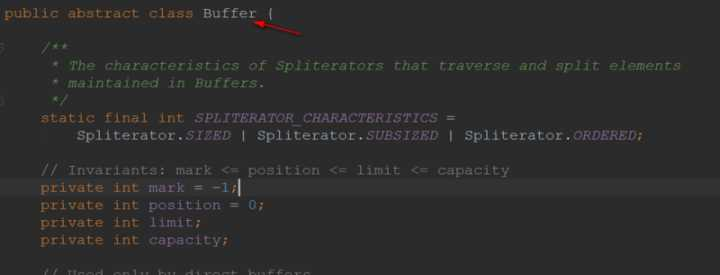


其中ByteBuffer是**用得最多的实现类**(在管道中读写字节数据)。


拿到一个缓冲区我们往往会做什么？很简单，就是**读取缓冲区的数据/写数据到缓冲区中**。所以，缓冲区的核心方法就是:

- `put()`
- `get()`


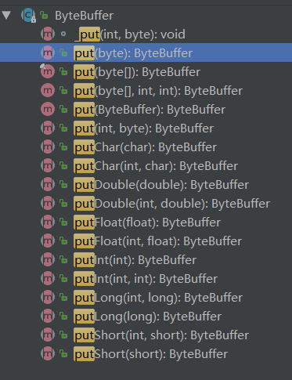


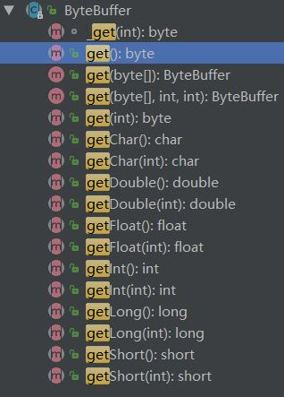


Buffer类维护了4个核心变量属性来提供**关于其所包含的数组的信息**。它们是：

- 容量Capacity

- - **缓冲区能够容纳的数据元素的最大数量**。容量在缓冲区创建时被设定，并且永远不能被改变。(不能被改变的原因也很简单，底层是数组嘛)

- 上界Limit

- - **缓冲区里的数据的总数**，代表了当前缓冲区中一共有多少数据。

- 位置Position

- - **下一个要被读或写的元素的位置**。Position会自动由相应的 `get( )`和 `put( )`函数更新。

- 标记Mark

- - 一个备忘位置。**用于记录上一次读写的位置**。

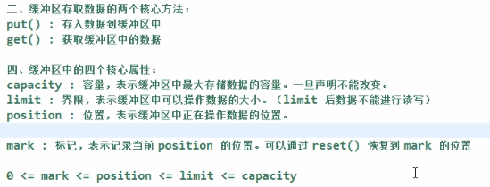


### 2.1.2buffer代码演示

首先展示一下**是如何创建缓冲区的，核心变量的值是怎么变化的**。

```java
public static void main(String[] args) {

        // 创建一个缓冲区
        ByteBuffer byteBuffer = ByteBuffer.allocate(1024);

        // 看一下初始时4个核心变量的值
        System.out.println("初始时-->limit--->"+byteBuffer.limit());
        System.out.println("初始时-->position--->"+byteBuffer.position());
        System.out.println("初始时-->capacity--->"+byteBuffer.capacity());
        System.out.println("初始时-->mark--->" + byteBuffer.mark());

        System.out.println("--------------------------------------");

        // 添加一些数据到缓冲区中
        String s = "Java3y";
        byteBuffer.put(s.getBytes());

        // 看一下初始时4个核心变量的值
        System.out.println("put完之后-->limit--->"+byteBuffer.limit());
        System.out.println("put完之后-->position--->"+byteBuffer.position());
        System.out.println("put完之后-->capacity--->"+byteBuffer.capacity());
        System.out.println("put完之后-->mark--->" + byteBuffer.mark());
    }
```

运行结果：


现在**我想要从缓存区拿数据**，怎么拿呀？？NIO给了我们一个`flip()`方法。这个方法可以**改动position和limit的位置**！

还是上面的代码，我们`flip()`一下后，再看看4个核心属性的值会发生什么变化：


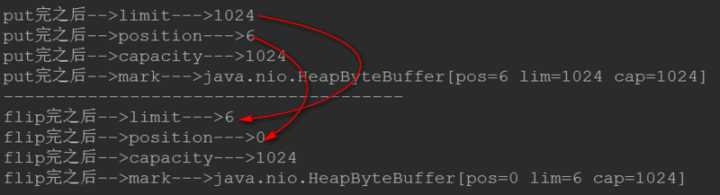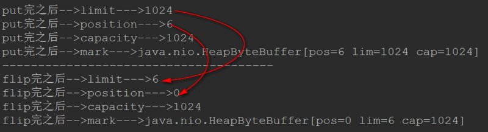


很明显的是：

- **limit变成了position的位置了**
- **而position变成了0**

看到这里的同学可能就会想到了：当调用完`filp()`时：**limit是限制读到哪里，而position是从哪里读**

一般我们称`filp()`为**“切换成读模式”**

- 每当要从缓存区的时候读取数据时，就调用`filp()`**“切换成读模式”**。


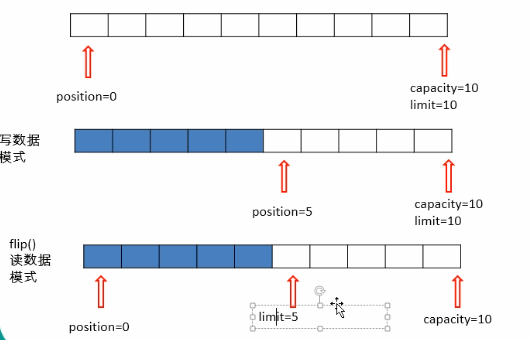


切换成读模式之后，我们就可以读取缓冲区的数据了：

```java
// 创建一个limit()大小的字节数组(因为就只有limit这么多个数据可读)
        byte[] bytes = new byte[byteBuffer.limit()];

        // 将读取的数据装进我们的字节数组中
        byteBuffer.get(bytes);

        // 输出数据
        System.out.println(new String(bytes, 0, bytes.length));
```


随后输出一下核心变量的值看看：


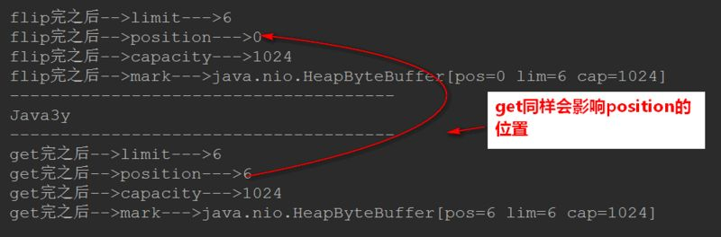


**读完我们还想写数据到缓冲区**，那就使用`clear()`函数，这个函数会“清空”缓冲区：

- 数据没有真正被清空，只是被**遗忘**掉了


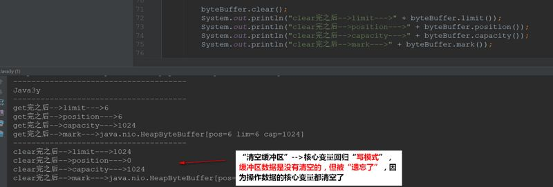


### 2.1.3FileChannel通道核心要点


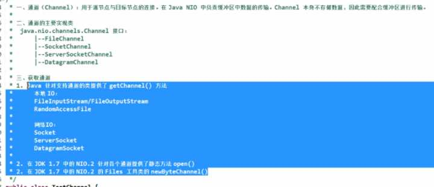


Channel通道**只负责传输数据、不直接操作数据的**。操作数据都是通过Buffer缓冲区来进行操作！

```java
// 1. 通过本地IO的方式来获取通道
        FileInputStream fileInputStream = new FileInputStream("F:\\3yBlog\\JavaEE常用框架\\Elasticsearch就是这么简单.md");

        // 得到文件的输入通道
        FileChannel inchannel = fileInputStream.getChannel();

        // 2. jdk1.7后通过静态方法.open()获取通道
        FileChannel.open(Paths.get("F:\\3yBlog\\JavaEE常用框架\\Elasticsearch就是这么简单2.md"), StandardOpenOption.WRITE);
```

使用**FileChannel配合缓冲区**实现文件复制的功能：


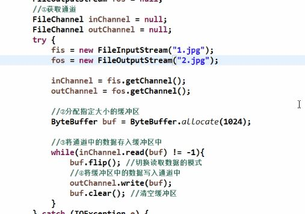


使用**内存映射文件**的方式实现**文件复制**的功能(直接操作缓冲区)：


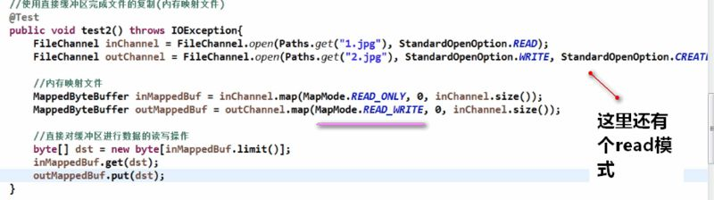


通道之间通过`transfer()`实现数据的传输(直接操作缓冲区)：


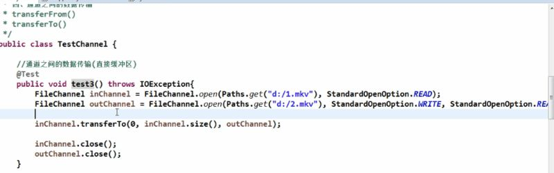


### 2.1.4直接与非直接缓冲区

- 非直接缓冲区是**需要**经过一个：copy的阶段的(从内核空间copy到用户空间)
- 直接缓冲区**不需要**经过copy阶段，也可以理解成--->**内存映射文件**，(上面的图片也有过例子)。


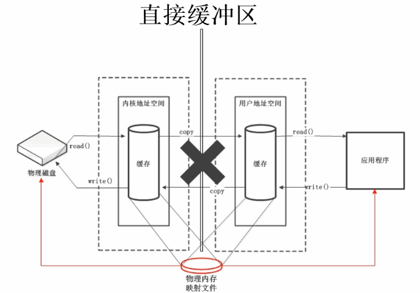


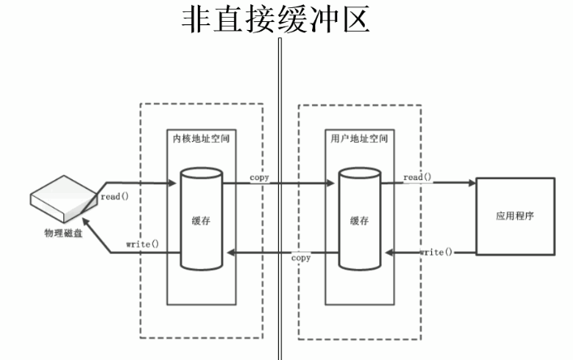


使用直接缓冲区有两种方式：

- 缓冲区创建的时候分配的是直接缓冲区
- 在FileChannel上调用`map()`方法，将文件直接映射到内存中创建


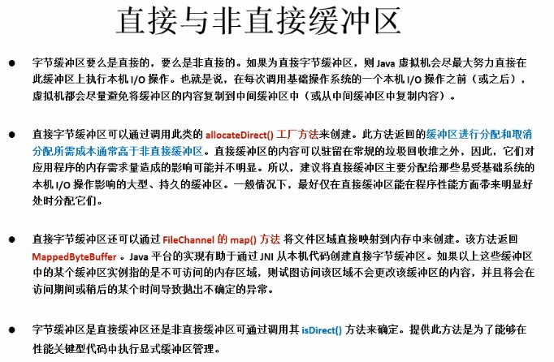


### 2.1.5scatter和gather、字符集

这个知识点我感觉用得挺少的，不过很多教程都有说这个知识点，我也拿过来说说吧：

- 分散读取(scatter)：将一个通道中的数据分散读取到多个缓冲区中
- 聚集写入(gather)：将多个缓冲区中的数据集中写入到一个通道中


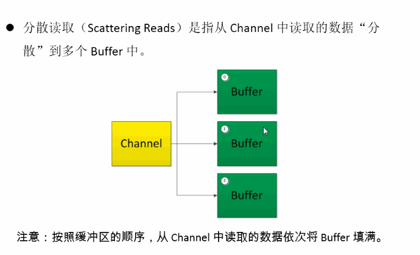


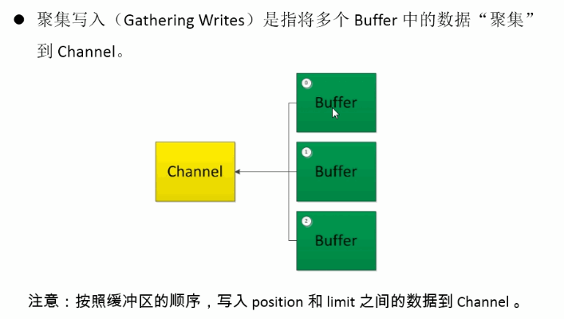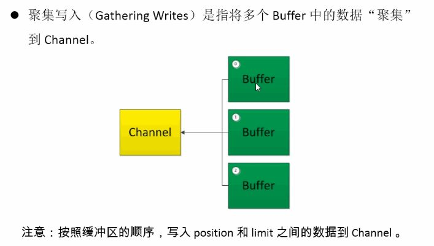


分散读取


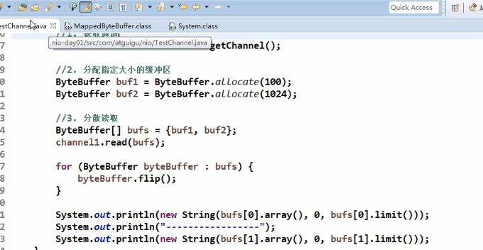


聚集写入


字符集(只要编码格式和解码格式一致，就没问题了)


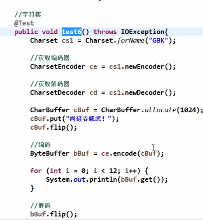


## 三、IO模型理解

**文件的IO就告一段落了**，我们来学习网络中的IO~~~为了更好地理解NIO，**我们先来学习一下IO的模型**~

根据UNIX网络编程对I/O模型的分类，**在UNIX可以归纳成5种I/O模型**：

- **阻塞I/O**
- **非阻塞I/O**
- **I/O多路复用**
- 信号驱动I/O
- 异步I/O

## 3.0学习I/O模型需要的基础

### 3.0.1文件描述符

Linux 的内核将所有外部设备**都看做一个文件来操作**，对一个文件的读写操作会**调用内核提供的系统命令(api)**，返回一个`file descriptor`（fd，文件描述符）。而对一个socket的读写也会有响应的描述符，称为`socket fd`（socket文件描述符），描述符就是一个数字，**指向内核中的一个结构体**（文件路径，数据区等一些属性）。

- 所以说：在Linux下对文件的操作是**利用文件描述符(file descriptor)来实现的**。

### 3.0.2用户空间和内核空间

为了保证用户进程不能直接操作内核（kernel），**保证内核的安全**，操心系统将虚拟空间划分为两部分

- **一部分为内核空间**。
- **一部分为用户空间**。

### 3.0.3I/O运行过程

我们来看看IO在系统中的运行是怎么样的(我们**以read为例**)


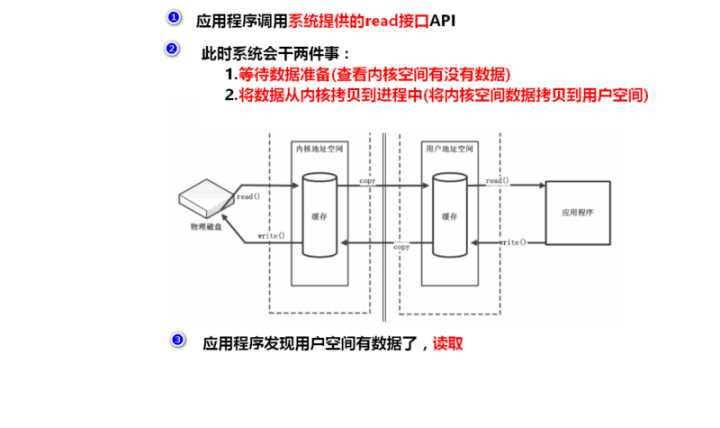


可以发现的是：当应用程序调用read方法时，是需要**等待**的--->从内核空间中找数据，再将内核空间的数据拷贝到用户空间的。

- **这个等待是必要的过程**！

下面只讲解用得最多的3个I/0模型：

- **阻塞I/O**
- **非阻塞I/O**
- **I/O多路复用**

## 3.1阻塞I/O模型

在进程(用户)空间中调用`recvfrom`，其系统调用直到数据包到达且**被复制到应用进程的缓冲区中或者发生错误时才返回**，在此期间**一直等待**。


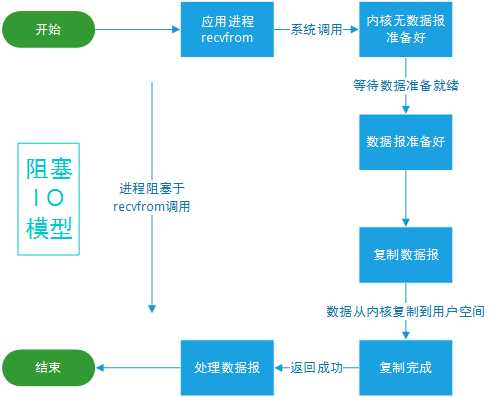


## 3.2非阻塞I/O模型

`recvfrom`从应用层到内核的时候，如果没有数据就**直接返回**一个EWOULDBLOCK错误，一般都对非阻塞I/O模型**进行轮询检查这个状态**，看内核是不是有数据到来。


## 3.3I/O复用模型

前面也已经说了：在Linux下对文件的操作是**利用文件描述符(file descriptor)来实现的**。

在Linux下它是这样子实现I/O复用模型的：

- 调用`select/poll/epoll/pselect`其中一个函数，**传入多个文件描述符**，如果有一个文件描述符**就绪，则返回**，否则阻塞直到超时。

比如`poll()`函数是这样子的：`int poll(struct pollfd *fds,nfds_t nfds, int timeout);`

其中 `pollfd` 结构定义如下：

```c
struct pollfd {
    int fd;         /* 文件描述符 */
    short events;         /* 等待的事件 */
    short revents;       /* 实际发生了的事件 */
};
```


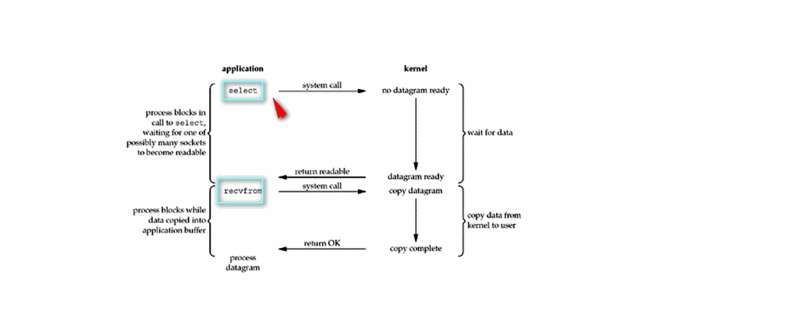


- （1）当用户进程调用了select，那么整个进程会被block；
- （2）而同时，kernel会“监视”所有select负责的socket；
- （3）当任何一个socket中的数据准备好了，select就会返回；
- （4）这个时候用户进程再调用read操作，将数据从kernel拷贝到用户进程(空间)。
- 所以，I/O 多路复用的特点是**通过一种机制一个进程能同时等待多个文件描述符**，而这些文件描述符**其中的任意一个进入读就绪状态**，select()函数**就可以返回**。

select/epoll的优势并不是对于单个连接能处理得更快，而是**在于能处理更多的连接**。

## 3.4I/O模型总结

正经的描述都在上面给出了，不知道大家理解了没有。下面我举几个例子总结一下这三种模型：

**阻塞I/O：**

- Java3y跟女朋友去买喜茶，排了很久的队终于可以点饮料了。我要绿研，谢谢。可是喜茶不是点了单就能立即拿，于是我**在喜茶门口等了一小时才拿到**绿研。

- - 在门口干等一小时


**非阻塞I/O：**

- Java3y跟女朋友去买一点点，排了很久的队终于可以点饮料了。我要波霸奶茶，谢谢。可是一点点不是点了单就能立即拿，**同时**服务员告诉我：你大概要等半小时哦。你们先去逛逛吧~于是Java3y跟女朋友去玩了几把斗地主，感觉时间差不多了。于是**又去一点点问**：请问到我了吗？我的单号是xxx。服务员告诉Java3y：还没到呢，现在的单号是XXX，你还要等一会，可以去附近耍耍。问了好几次后，终于拿到我的波霸奶茶了。

- - 去逛了下街、斗了下地主，时不时问问到我了没有


**I/O复用模型：**

- Java3y跟女朋友去麦当劳吃汉堡包，现在就厉害了可以使用微信小程序点餐了。于是跟女朋友找了个地方坐下就用小程序点餐了。点餐了之后玩玩斗地主、聊聊天什么的。**时不时听到广播在复述XXX请取餐**，反正我的单号还没到，就继续玩呗。~~**等听到广播的时候再取餐就是了**。时间过得挺快的，此时传来：Java3y请过来取餐。于是我就能拿到我的麦辣鸡翅汉堡了。

- - 听广播取餐，**广播不是为我一个人服务**。广播喊到我了，我过去取就Ok了。


## 四、使用NIO完成网络通信

## 4.1NIO基础继续讲解

回到我们最开始的图：


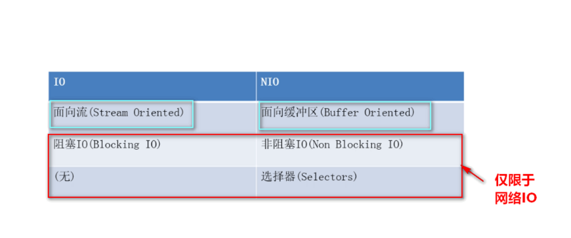


NIO被叫为 `no-blocking io`，其实是在**网络这个层次中理解的**，对于**FileChannel来说一样是阻塞**。

我们前面也仅仅讲解了FileChannel，对于我们网络通信是还有几个Channel的~


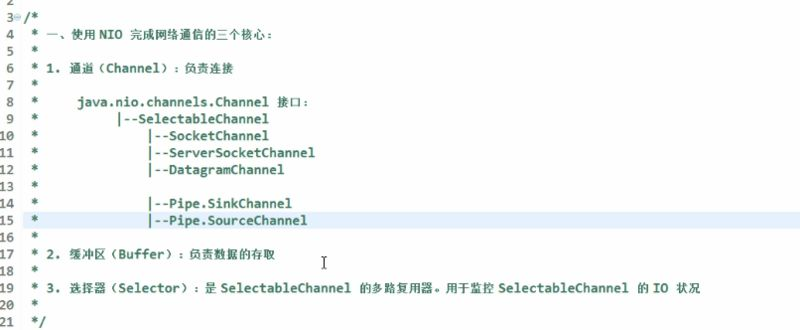


所以说：我们**通常**使用NIO是在网络中使用的，网上大部分讨论NIO都是在**网络通信的基础之上**的！说NIO是非阻塞的NIO也是**网络中体现**的！

从上面的图我们可以发现还有一个`Selector`选择器这么一个东东。从一开始我们就说过了，nio的**核心要素**有：

- Buffer缓冲区
- Channel通道
- Selector选择器

我们在网络中使用NIO往往是I/O模型的**多路复用模型**！

- Selector选择器就可以比喻成麦当劳的**广播**。
- **一个线程能够管理多个Channel的状态**


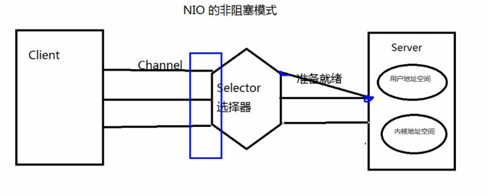


## 4.2NIO阻塞形态

为了更好地理解，我们先来写一下NIO**在网络中是阻塞的状态代码**，随后看看非阻塞是怎么写的就更容易理解了。

- **是阻塞的就没有Selector选择器了**，就直接使用Channel和Buffer就完事了。

客户端：

```java
public class BlockClient {

    public static void main(String[] args) throws IOException {

        // 1. 获取通道
        SocketChannel socketChannel = SocketChannel.open(new InetSocketAddress("127.0.0.1", 6666));

        // 2. 发送一张图片给服务端吧
        FileChannel fileChannel = FileChannel.open(Paths.get("X:\\Users\\ozc\\Desktop\\新建文件夹\\1.png"), StandardOpenOption.READ);

        // 3.要使用NIO，有了Channel，就必然要有Buffer，Buffer是与数据打交道的呢
        ByteBuffer buffer = ByteBuffer.allocate(1024);

        // 4.读取本地文件(图片)，发送到服务器
        while (fileChannel.read(buffer) != -1) {

            // 在读之前都要切换成读模式
            buffer.flip();

            socketChannel.write(buffer);

            // 读完切换成写模式，能让管道继续读取文件的数据
            buffer.clear();
        }

        // 5. 关闭流
        fileChannel.close();
        socketChannel.close();
    }
}
```

服务端：

```java
public class BlockServer {

    public static void main(String[] args) throws IOException {

        // 1.获取通道
        ServerSocketChannel server = ServerSocketChannel.open();

        // 2.得到文件通道，将客户端传递过来的图片写到本地项目下(写模式、没有则创建)
        FileChannel outChannel = FileChannel.open(Paths.get("2.png"), StandardOpenOption.WRITE, StandardOpenOption.CREATE);

        // 3. 绑定链接
        server.bind(new InetSocketAddress(6666));

        // 4. 获取客户端的连接(阻塞的)
        SocketChannel client = server.accept();

        // 5. 要使用NIO，有了Channel，就必然要有Buffer，Buffer是与数据打交道的呢
        ByteBuffer buffer = ByteBuffer.allocate(1024);

        // 6.将客户端传递过来的图片保存在本地中
        while (client.read(buffer) != -1) {

            // 在读之前都要切换成读模式
            buffer.flip();

            outChannel.write(buffer);

            // 读完切换成写模式，能让管道继续读取文件的数据
            buffer.clear();

        }

        // 7.关闭通道
        outChannel.close();
        client.close();
        server.close();
    }
}
```

结果就可以将客户端传递过来的图片保存在本地了：


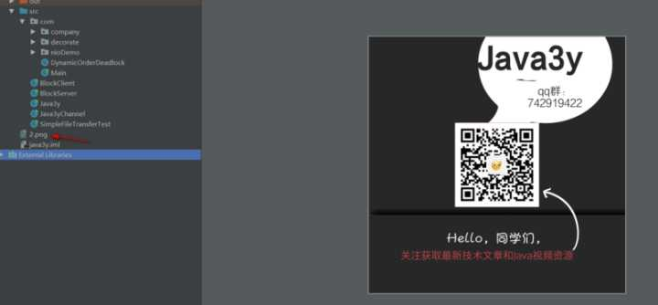


此时服务端保存完图片想要告诉客户端已经收到图片啦：


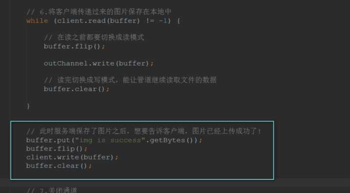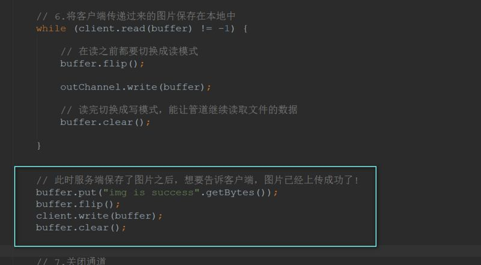


客户端接收服务端带过来的数据：


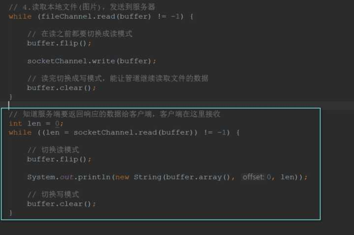


如果仅仅是上面的代码**是不行**的！这个程序会**阻塞**起来！

- 因为服务端**不知道客户端还有没有数据要发过来**(与刚开始不一样，客户端发完数据就将流关闭了，服务端可以知道客户端没数据发过来了)，导致服务端一直在读取客户端发过来的数据。
- 进而导致了阻塞！

于是客户端在写完数据给服务端时，**显式告诉服务端已经发完数据**了！


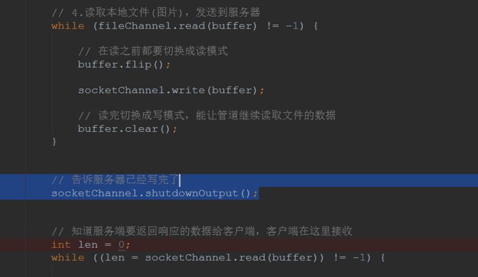


## 4.3NIO非阻塞形态

如果使用非阻塞模式的话，那么我们就可以不显式告诉服务器已经发完数据了。我们下面来看看怎么写：

**客户端**：

```java
public class NoBlockClient {

    public static void main(String[] args) throws IOException {

        // 1. 获取通道
        SocketChannel socketChannel = SocketChannel.open(new InetSocketAddress("127.0.0.1", 6666));

        // 1.1切换成非阻塞模式
        socketChannel.configureBlocking(false);

        // 2. 发送一张图片给服务端吧
        FileChannel fileChannel = FileChannel.open(Paths.get("X:\\Users\\ozc\\Desktop\\新建文件夹\\1.png"), StandardOpenOption.READ);

        // 3.要使用NIO，有了Channel，就必然要有Buffer，Buffer是与数据打交道的呢
        ByteBuffer buffer = ByteBuffer.allocate(1024);

        // 4.读取本地文件(图片)，发送到服务器
        while (fileChannel.read(buffer) != -1) {

            // 在读之前都要切换成读模式
            buffer.flip();

            socketChannel.write(buffer);

            // 读完切换成写模式，能让管道继续读取文件的数据
            buffer.clear();
        }

        // 5. 关闭流
        fileChannel.close();
        socketChannel.close();
    }
}
```

**服务端**：

```java
public class NoBlockServer {

    public static void main(String[] args) throws IOException {

        // 1.获取通道
        ServerSocketChannel server = ServerSocketChannel.open();

        // 2.切换成非阻塞模式
        server.configureBlocking(false);

        // 3. 绑定连接
        server.bind(new InetSocketAddress(6666));

        // 4. 获取选择器
        Selector selector = Selector.open();

        // 4.1将通道注册到选择器上，指定接收“监听通道”事件
        server.register(selector, SelectionKey.OP_ACCEPT);

        // 5. 轮训地获取选择器上已“就绪”的事件--->只要select()>0，说明已就绪
        while (selector.select() > 0) {
            // 6. 获取当前选择器所有注册的“选择键”(已就绪的监听事件)
            Iterator<SelectionKey> iterator = selector.selectedKeys().iterator();

            // 7. 获取已“就绪”的事件，(不同的事件做不同的事)
            while (iterator.hasNext()) {

                SelectionKey selectionKey = iterator.next();

                // 接收事件就绪
                if (selectionKey.isAcceptable()) {

                    // 8. 获取客户端的链接
                    SocketChannel client = server.accept();

                    // 8.1 切换成非阻塞状态
                    client.configureBlocking(false);

                    // 8.2 注册到选择器上-->拿到客户端的连接为了读取通道的数据(监听读就绪事件)
                    client.register(selector, SelectionKey.OP_READ);

                } else if (selectionKey.isReadable()) { // 读事件就绪

                    // 9. 获取当前选择器读就绪状态的通道
                    SocketChannel client = (SocketChannel) selectionKey.channel();

                    // 9.1读取数据
                    ByteBuffer buffer = ByteBuffer.allocate(1024);

                    // 9.2得到文件通道，将客户端传递过来的图片写到本地项目下(写模式、没有则创建)
                    FileChannel outChannel = FileChannel.open(Paths.get("2.png"), StandardOpenOption.WRITE, StandardOpenOption.CREATE);

                    while (client.read(buffer) > 0) {
                        // 在读之前都要切换成读模式
                        buffer.flip();

                        outChannel.write(buffer);

                        // 读完切换成写模式，能让管道继续读取文件的数据
                        buffer.clear();
                    }
                }
                // 10. 取消选择键(已经处理过的事件，就应该取消掉了)
                iterator.remove();
            }
        }

    }
}
```

还是刚才的需求：**服务端保存了图片以后，告诉客户端已经收到图片了**。

在服务端上只要在后面写些数据给客户端就好了：


在客户端上要想获取得到服务端的数据，也需要注册在register上(监听读事件)！

```java
public class NoBlockClient2 {

    public static void main(String[] args) throws IOException {

        // 1. 获取通道
        SocketChannel socketChannel = SocketChannel.open(new InetSocketAddress("127.0.0.1", 6666));

        // 1.1切换成非阻塞模式
        socketChannel.configureBlocking(false);

        // 1.2获取选择器
        Selector selector = Selector.open();

        // 1.3将通道注册到选择器中，获取服务端返回的数据
        socketChannel.register(selector, SelectionKey.OP_READ);

        // 2. 发送一张图片给服务端吧
        FileChannel fileChannel = FileChannel.open(Paths.get("X:\\Users\\ozc\\Desktop\\新建文件夹\\1.png"), StandardOpenOption.READ);

        // 3.要使用NIO，有了Channel，就必然要有Buffer，Buffer是与数据打交道的呢
        ByteBuffer buffer = ByteBuffer.allocate(1024);

        // 4.读取本地文件(图片)，发送到服务器
        while (fileChannel.read(buffer) != -1) {

            // 在读之前都要切换成读模式
            buffer.flip();

            socketChannel.write(buffer);

            // 读完切换成写模式，能让管道继续读取文件的数据
            buffer.clear();
        }


        // 5. 轮训地获取选择器上已“就绪”的事件--->只要select()>0，说明已就绪
        while (selector.select() > 0) {
            // 6. 获取当前选择器所有注册的“选择键”(已就绪的监听事件)
            Iterator<SelectionKey> iterator = selector.selectedKeys().iterator();

            // 7. 获取已“就绪”的事件，(不同的事件做不同的事)
            while (iterator.hasNext()) {

                SelectionKey selectionKey = iterator.next();

                // 8. 读事件就绪
                if (selectionKey.isReadable()) {

                    // 8.1得到对应的通道
                    SocketChannel channel = (SocketChannel) selectionKey.channel();

                    ByteBuffer responseBuffer = ByteBuffer.allocate(1024);

                    // 9. 知道服务端要返回响应的数据给客户端，客户端在这里接收
                    int readBytes = channel.read(responseBuffer);

                    if (readBytes > 0) {
                        // 切换读模式
                        responseBuffer.flip();
                        System.out.println(new String(responseBuffer.array(), 0, readBytes));
                    }
                }

                // 10. 取消选择键(已经处理过的事件，就应该取消掉了)
                iterator.remove();
            }
        }
    }


}
```

测试结果：


下面就**简单总结一下**使用NIO时的要点：

- 将Socket通道注册到Selector中，监听感兴趣的事件
- 当感兴趣的时间就绪时，则会进去我们处理的方法进行处理
- 每处理完一次就绪事件，删除该选择键(因为我们已经处理完了)

## 4.4管道和DataGramChannel

这里我就不再讲述了，最难的TCP都讲了，UDP就很简单了。

UDP:


管道：


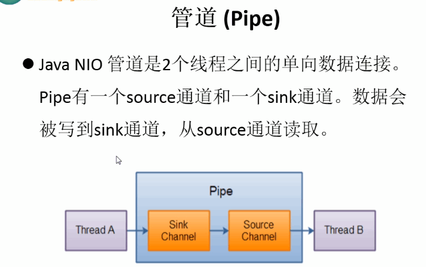


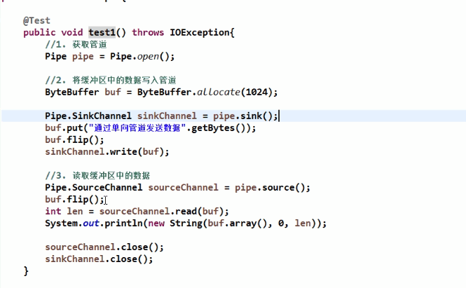


## 五、总结

总的来说NIO也是一个比较重要的知识点，因为它是学习netty的基础~

想以一篇来完全讲解NIO显然是不可能的啦，想要更加深入了解NIO可以往下面的链接继续学习~

参考资料：

- https://www.zhihu.com/question/29005375---如何学习Java的NIO？
- [http://ifeve.com/java-nio-all/](https://link.zhihu.com/?target=http%3A//ifeve.com/java-nio-all/)---Java NIO 系列教程
- [https://www.ibm.com/developerworks/cn/education/java/j-nio/j-nio.html](https://link.zhihu.com/?target=https%3A//www.ibm.com/developerworks/cn/education/java/j-nio/j-nio.html)-----NIO 入门
- [https://blog.csdn.net/anxpp/article/details/51503329](https://link.zhihu.com/?target=https%3A//blog.csdn.net/anxpp/article/details/51503329)-----Linux 网络 I/O 模型简介（图文）
- [https://wangjingxin.top/2016/10/21/decoration/](https://link.zhihu.com/?target=https%3A//wangjingxin.top/2016/10/21/decoration/)-----谈谈java的NIO和AIO
- [https://www.yiibai.com/java_nio/](https://link.zhihu.com/?target=https%3A//www.yiibai.com/java_nio/)-----Java NIO教程
- [https://blog.csdn.net/cowthan/article/details/53563206](https://link.zhihu.com/?target=https%3A//blog.csdn.net/cowthan/article/details/53563206)------Java 8：Java 的新IO （nio）
- [https://blog.csdn.net/youyou1543724847/article/details/52748785](https://link.zhihu.com/?target=https%3A//blog.csdn.net/youyou1543724847/article/details/52748785)-------JAVA NIO(1.基本概念，基本类）
- [https://www.cnblogs.com/zingp/p/6863170.html](https://link.zhihu.com/?target=https%3A//www.cnblogs.com/zingp/p/6863170.html)-----IO模式和IO多路复用
- [https://www.cnblogs.com/Evsward/p/nio.html](https://link.zhihu.com/?target=https%3A//www.cnblogs.com/Evsward/p/nio.html)----掌握NIO，程序人生
- [https://blog.csdn.net/anxpp/article/details/51512200](https://link.zhihu.com/?target=https%3A//blog.csdn.net/anxpp/article/details/51512200)----Java 网络IO编程总结（BIO、NIO、AIO均含完整实例代码）
- https://zhuanlan.zhihu.com/p/24393775?refer=hinus---进击的Java新人
- 《Java编程思想》
- 《疯狂Java 讲义》

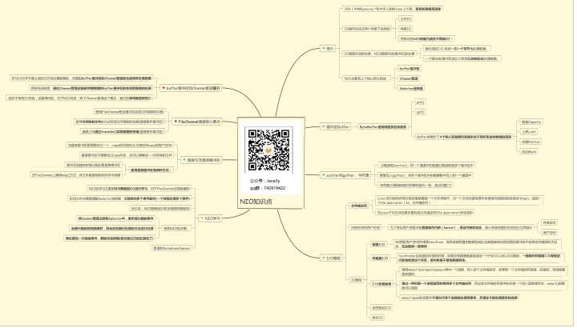


