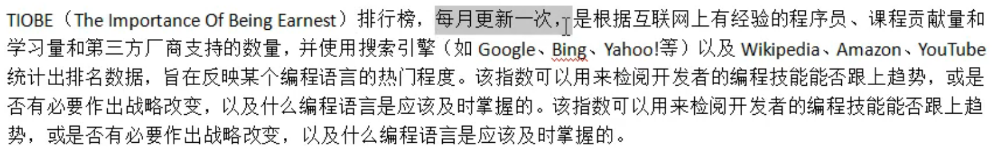

# Java基础

2017-07-21 我的Java之路

2018 Spring

2020-08-08 复习

# JavaSE

Java能做的事情  

JavaEE  大数据、Android开发  没了



有经验的程序员  课程贡献量  Java的资料是很多的很多的

第三方厂商支持的


Javascript

应用软件   

系统软件 嵌入式系统

AI

SQL 

名词

关键字 


面向过程

面向对象

 

# 第一章 Java概述

## 1.1 Java历史

Java诞生于SUN（Stanford University Network），09年SUN被Oracle（甲骨文）收购。

Java之父是詹姆斯.高斯林(James Gosling)。

1996年发布JDK1.0版。

目前最新的版本是Java12。我们学习的Java8。

2020年-3月

JDK14来了

三月已过，九月还远吗？

2020年-9月

JDK15来了 

比较有有代表性的几个版本：JDK1.2（引入了集合框架等）、JDK1.4（引入了NIO）、JDK1.5（枚举、泛型、可变参数、foreach循环、自动装箱拆箱。。。）、JDK1.7（switch对字符串的支持，try...with...resource）、JDK1.8（接口、日期时间API、Optional类、Lambda表达式和StreamAPI）

JDK1.2 集合框架  

JDK1.4 NIO 

JDK1.5 枚举 泛型 可变参数 foreach循环  自动装箱 拆箱 

JDk1.7 switch 对字符串的支持

JDK1.8 接口 日期时间API Optional adj. 可选择的，随意的 解决空指针异常 Lambda表达式 StreamAPI 

NIO 

*java* non-blocking


## 1.2 Java语言最主要的特点

* 特点一：面向对象

两个基本概念：类、对象

三大特性：封装、继承、多态

抽象  

类  对象  封装 继承 多态 

高级特性

相关的关键字 

* 特点二：健壮性

吸收了C/C++语言的优点，但去掉了其影响程序健壮性的部分（如指针、内存的申请与释放等），提供了一个相对安全的内存管理和访问机制

内存自动分配，有垃圾回收机制自动进行回收

健壮性

有垃圾回收机制自动进行回收

有垃圾回收机制自动进行回收 

* 特点三：跨平台性

跨平台性：通过Java语言编写的应用程序在不同的系统平台上都可以运行。“Write once , Run Anywhere”一次编写，处处运行。

是一次编写 到处运行哦


原理：只要在需要运行 java 应用程序的操作系统上，先安装一个Java虚拟机 (JVM Java Virtual Machine) 即可。由JVM来负责Java程序在该系统中的运行。因为有了JVM，同一个Java 程序在三个不同的操作系统中都可以执行。这样就实现了Java 程序的跨平台性。


对应的JVM  Java虚拟机


系统中的运行  

同一个Java程序  可以在不同的操作系统中都可以执行

实现了Java程序的跨平台 


Write Once ,Run Anywhere.

原理：使用JVM，不同的操作系统使用不同的JVM，而Java程序编译成字节码，运行JVM上


Java程序编译成字节码 运行JVM上 

## 1.3 Java环境搭建

### 1.3.1 JDK、JRE、JVM

JDK：Java Development Kit，Java的开发工具集，包含JRE + 开发工具（javac.exe，java.exe，javadoc.exe，jar.exe）

JRE：Java Runtime Enviroment，Java运行环境，包括JVM + 核心类库

JVM：Java Virtual Machine，Java的虚拟机


Java开发人员需要安装JDK。如果仅仅是运行Java程序，那么只需要按照JRE。

JDK（Java Development kits）：Java开发工具包。

JRE（Java Runtime Environment）：Java运行环境。

JVM（Java Virtual Machine）：Java虚拟机。

JDK = JRE + 开发工具（javac.exe,java.exe,javadoc.exe等）

JRE = JVM + 核心类库（常用类：String、日期时间、数学、集合、IO、网络、多线程等）

JRE JVM 核心类库  String 日期时间 数学 集合  IO　网络　多线程


### 1.3.2  Java环境搭建

1、安装JDK


2、配置JDK的开发工具目录到path环境变量中

path：windows操作系统寻找命令工具的路径，在path中进行登记

JAVA_HOME + path JAVA_HOME  D:\ProgramFiles\Java\jdk1.8.0_141

path %JAVA_HOME%\bin;

我觉得我以后的程序可以安装到ProgramFiles 文件里 

这两个变量要么同时在用户级环境变量，要么都在系统级环境变量


​	例如：D:\ProgramFiles\Java\jdk1.8.0_51\bin;

​	注意：这个安装目录以你自己的安装目录为准


（1）为什么配置path？

​	希望在命令行使用javac.exe等工具时，任意目录下都可以找到这个工具所在的目录。

（2）如何配置环境变量？

​	【计算机】右键【属性】，选择【高级系统设置】，选择【高级】，选择【环境变量】，选择【系统环境变量】，编辑path，在【**path原有值**】的前面加入D:\ProgramFiles\Java\jdk1.8.0_51\bin;

## 1.4 第一个Java应用程序

```java
class HelloWorld{
    public static void main(String[] args){
        System.out.print("Hello Java!");
    }
}
```


Hello Java 


### 1.4.1 Java程序的开发步骤

撸码

Java

编译 javac xxx.java

运行 java  xxx

三步：

1、编辑/编写源代码

要求：源文件必须是.java文件

2、编译

目的：把源文件编译为.class字节码文件（因为JVM只认识字节码）

工具：javac.exe

格式：

```cmd
javac 源文件名.java
```


3、运行

工具：java.exe

格式：

```cmd
java 类名
java 字节码文件名
```

要求：可以被运行的类，必须包含main方法


### 1.4.2 Java程序的结构与格式

结构：

```java
类{
    方法{
        语句;
    }
}
```

格式：

（1）每一级缩进一个Tab键

（2）{}的左半部分在行尾，右半部分单独一行，与和它成对的"{"的行首对齐

​	{

}

### 1.4.3 Java程序的入口

Java程序的入口是main方法

```java
public static void main(String[] args){
    
}
```


### 1.4.4 Java注释

1、单行注释

```java
//注释内容
```

2、多行注释

```java
/*
注释内容
*/
```

3、文档注释

```java
/**
文档注释（后面注解部分讲解）
*/
```


```
/**
*/
//
/* */
```


## 1.5 编写Java程序时应该注意的问题

1、字符编码问题

当cmd命令行窗口的字符编码与.java源文件的字符编码不一致，如何解决？


解决方案一：

​	在Notepad++等编辑器中，修改源文件的字符编码


解决方案二：

​	在使用javac命令式，可以指定源文件的字符编码

```cmd
javac -encoding utf-8 Review01.java
```

javac -encoding utf-8 xxx.java

2、大小写问题

（1）源文件名：

​	不区分大小写，我们建议大家还是区分

（2）字节码文件名与类名

​	区分大小写

（3）代码中

​	区分大小写

区分大小写

3、源文件名与类名一致问题？

（1）源文件名是否必须与类名一致？public呢？

如果这个类不是public，那么源文件名可以和类名不一致。

如果这个类是public，那么要求源文件名必须与类名一致。

我们建议大家，不管是否是public，都与源文件名保持一致，而且一个源文件尽量只写一个类，目的是为了好维护。

这个类是public 要求源文件名必须与类名一致

我们建议大家，不管是否是public，都与源文件名保持一致，而且一个源文件尽量只写一个类，目的是为了好维护。

（2）一个源文件中是否可以有多个类？public呢？

一个源文件中可以有多个类，编译后会生成多个.class字节码文件。

但是一个源文件只能有一个public的类。


（3）main必须在public的类中吗？

不是。

但是后面写代码时，基本上main习惯上都在public类中。


一个源文件只能有一个public修饰的类