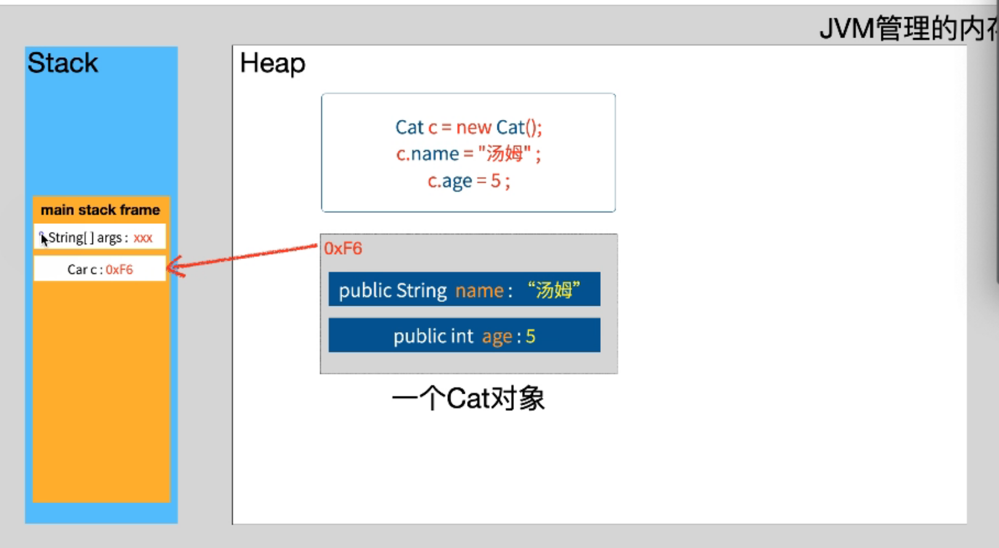

# 第五章 面向对象基础

# 第五章 面向对象基础


比较吃力的


IO 线程 网络 反射 类加载



static 静态的   静止的

字段是谁的  属于 本质 

【修饰符】 class 类名{
    成员列表：属性、方法、构造器、代码块、内部类

}

类变量  被static修饰的成员变量 比如Static String Home

类方法 


##5.1 类与对象

1、类：一类具有相同特性的事物的抽象描述。

​      对象：类的一个个体，实例，具体的存在。

​	  类是对象的设计模板。

类与对象

类：类是某一种事物的抽象，是一类具有相同特性的事物的抽象描述，是构造对象的模板或蓝图。

对象：对象是某个事物的一个具体的个体。

类是抽象的，对象(实例)是具体的。

2、如何声明类？

```java
【修饰符】 class 类名{
    成员列表：属性、方法、构造器、代码块、内部类
}
```

* 1、使用 class 关键字可以声明一个类 ，比如 public class Person
 * 2、一个类可以表示一类事物，在类中可以定义该类事物或其个体所具有的特征、行为 
 * 3、字段(field) 表示该类事物或其个体特征的变量
 * 4、方法(method) 表示该类事物或其个体可以完成动作、行为
 * 5、构造方法( constructor ) 是类中与类名同名但没有返回类型的方法

```java
public class Person{
    
}
```

Field 字段是我有什么 、Method方法是我能干什么

什么是字段 什么是方法 什么是构造 

3、如何创建对象？

```java
new 类名();  //匿名对象

类名 对象名 = new 类名(); //有名对象
```

匿名对象  有对象名的对象

匿名对象 有对象名的对象

## 5.2 类的成员之一：属性

1、如何声明属性？

```java
【修饰符】 class 类名{
    【修饰符】 数据类型  属性名;    //属性有默认值
    【修饰符】 数据类型  属性名 = 值; //属性有初始值
}
```

> 说明：属性的类型可以是Java的任意类型，包括基本数据类型、引用数据类型（类、接口、数组等）

对象中的数据称为实例域（instance field），操纵数据的过程称为方法（method）。

字段的类型 基础数据类型、引用数据类型（类、接口、数组等）

总结：Java的数据类型

（1）基本数据类型

byte,short,int,long,float,double,char,boolean布尔

byte short int long float double，char,boolean

（2）引用数据类型

①类：

​	例如：String、Student、Circle、System、Scanner、Math...

②接口：interface 

③数组：

​	例如：int[]，String[]，char[]，int\[\]\[\]

```java
int[] arr = new int[5];
这里把int[]看成数组类型，是一种引用数据类型，右边赋值的是一个数组的对象

元素的数据类型：int
数组的数据类型：int[]
```

元素的数据类型  数组的数据类型int[]


2、如何为属性赋值？

（1）在声明属性时显式赋值

```java
【修饰符】 class 类名{
    【修饰符】 数据类型  属性名 = 值; //属性有初始值
}
```

代码示例：

```java
class Student{
    String name;
    char gender = '男';//显式赋值
}

class TestStudent{
    public static void main(String[] args){
        Student s1 = new Student();
        System.out.println("姓名：" + s1.name);//null
        System.out.println("性别：" + s1.gender);//男
        
        s1.name = "小菜";//修改属性的默认值
        s1.gender = '女';//修改属性的初始值
        System.out.println("姓名：" + s1.name);//小菜
        System.out.println("性别：" + s1.gender);//女
        
        Student s2 = new Student();
        System.out.println("姓名：" + s2.name);//null
        System.out.println("性别：" + s2.gender);//男
    }
}
```

（2）创建对象之后赋值

```java
【修饰符】 class 类名{
    【修饰符】 数据类型  属性名; //属性有默认值
}

//创建对象
类名 对象名 = new  类名();

//为对象的属性赋值
对象名.属性名 = 值;
```

3、如何访问属性的值？

（1）在本类的方法中访问

示例代码：

```java
class Circle{
    double radius;
    
    double getArea(){
        return 3.14 * radius * radius;//直接访问
    }
}
```


（2）在其他类的方法中访问

```java
class Circle{
    double radius;
}

class TestCircle{
    public static void main(String[] args){
        Circle c1 = new Circle();
        double area = 3.14 * c1.radius * c1.radius;//对象名.属性名
    }
}
```

在其他类中访问不是本类数据的 

对象名.属性名  

4、属性的特点

（1）属性有默认值

基本数据类型：

​	byte,short,int,long：0

​	float，double：0.0

​	char：\u0000

​	boolean：false

引用数据类型：

​	null

是null呀

（2）每一个对象的属性是独立，互不干扰

每一个对象的属性是独立的，互不干扰的。你是你的

5、对象属性的内存图

```java
class Student{
    String name;
    char gender = '男';//显式赋值
}

class TestStudent{
    public static void main(String[] args){
        Student s1 = new Student();
        System.out.println("姓名：" + s1.name);//null
        System.out.println("性别：" + s1.gender);//男
        
        s1.name = "小菜";
        s1.gender = '女';
        System.out.println("姓名：" + s1.name);//小菜
        System.out.println("性别：" + s1.gender);//女
        
        Student s2 = new Student();
        System.out.println("姓名：" + s2.name);//null
        System.out.println("性别：" + s2.gender);//男
    }
}
```


## 5.4 类的成员之二：方法

类的成员-方法 

方法的概念 

方法的重载Overload

方法的参数传递机制

### 5.4.1 方法的概念

方法（method）：代表一个独立的可复用的功能

目的/好处：

（1）复用

（2）简化代码

方法代表一个独立的可复用的功能

目的/好处：复用、简化代码


### 5.4.2 方法的语法

方法在类中 

1、方法的声明格式：

```java
【修饰符】 class 类名{
    【修饰符】 返回值类型  方法名(【形参列表】){
        方法体：实现功能的代码
    }
}
```

说明：

（1）【修饰符】public、private等

（2）返回值类型：

①void：表示无返回值

②非void：所有的Java数据类型都可以

void 表示无返回值  非void所有的Java数据类型都可以

（3）方法名：能很好的体现方法的功能

方法名 能很好的体现方法的功能

命名的规范：①见名知意②从第二个单词开始首字母大写  aaaBbbCcc

看到名字知道意思 从二个单词开始收字母大写 xxxYyyZzz

（4）【形参列表】：

​	在完成这个方法的功能时，需要一些数据，这些数据要由“调用者”来决定，那我们就可以设计形参。

形参列表 传递一些数据 辅助功能的完成

​	语法格式：

​		()：无参，空参

​		(数据类型  形参名)：一个形参

​		(数据类型1  形参名1,  ......,   数据类型n  形参名n)：n个形参

（5）方法体：实现方法的功能，最好一个方法就完成一个独立的功能。

方法体 实现方法的功能 最好一个方法能完成一个独立的功能。

2、方法的调用格式：

```java
//本类同级别方法调用：直接调用
【变量 = 】 方法名(【实参列表】);
```

```java
//在其他类的方法中调用
【变量 = 】 对象名.方法名(【实参列表】);
```

（1）是否传实参

看被调用的方法是否有形参

（2）是否接收返回值

看被调用的方法是否是void，如果是void，就不需要也不能接收，如果不是void，就可以接收。

接不接受

3、方法的声明与调用的代码示例

（1）无参无返回值方法

```java
//本类
class Circle{
    double radius;
    void printInfo(){
        System.out.println("半径：" + radius);
    }
    
    void test(){
        printInfo();//本类中调用无参无返回值方法
    }
}
```

```java
//其他类
class Circle{
    double radius;
    void printInfo(){
        System.out.println("半径：" + radius);
    }

}
class TestCircle{
    public static void main(String[] args){
        Circle c1 = new Circle();
        c1.printInfo(); //其他类中调用无参无返回值方法
    }
}
```


（2）无参有返回值方法

```java
//本类
class Circle{
    double radius;
    
    double getArea(){
        return 3.14 * radius * radius();
    }
    
    void printInfo(){
      //  System.out.println("半径：" + radius + "，面积：" + getArea());//本类中调用无参有返回值
       	double area = getArea();//本类中调用无参有返回值
        System.out.println("半径：" + radius + "，面积：" + area);
    }
}
```

```java
//其他类
class Circle{
    double radius;
    
    double getArea(){
        return 3.14 * radius * radius();
    }
}
class TestCircle{
    public static void main(String[] args){
        Circle c1 = new Circle();
        double area = c1.getArea();
        System.out.println("面积：" + area);
        //或
        System.out.println("面积：" + c1.getArea());
    }
}
```


（3）有参无返回值方法

```java
//本类
class GraphicTools{
    void printRectange(int line, int column, char sign){
        for(int i=1; i<=line; i++){
            for(int j=1; j<=column; j++){
                Sytem.out.print(sign);
            }
            System.out.println();
        }
    }
    
    void test(){
        printRectange(5,10,'%');//本类中调用有参无返回值方法
    }
}
```

```java
//其他类
class GraphicTools{
    void printRectange(int line, int column, char sign){
        for(int i=1; i<=line; i++){
            for(int j=1; j<=column; j++){
                Sytem.out.print(sign);
            }
            System.out.println();
        }
    }
}
class Test{
    public static void main(String[] args){
        GraphicTools tools = new GraphicTools();
        tools.printRectange(5,10,'%');
    }
}
```


（4）有参有返回值方法

```java
//本类
class MyMath{
    int sum(int a,int b){
        return a+b;
    }
    
    void print(){
        int x = 4;
        int y = 7;
        System.out.println(x + "+" + y + "=" + sum(x,y);//本类中调用有参有返回值的方法
    }
}
```

```java
//其他类
class MyMath{
    int sum(int a,int b){
        return a+b;
    }
}
class Test{
    public static void main(String[] args){
        MyMath my = new MyMath();
        int x = 4;
        int y = 7;
        
        System.out.println(x + "+" + y + "=" + my.sum(x,y));
    }
}
```


4、方法声明与调用的原则

（1）方法必须先声明后调用

> 如果调用方法时，如果方法名写错或调用一个不存在的方法，编译会报错

方法先声明后调用

（2）方法声明的位置必须在类中方法外

正确示例：

```java
类{
    方法1(){
        
    }
    方法2(){
        
    }
}
```

错误示例：

```java
类{
    方法1(){
        方法2(){  //错误
        
   		}
    }
}
```

（3）方法的调用的位置有要求

正确示例：

```java
类{
    方法1(){
        调用方法
    }
}
```

错误示例：

```java
类{
    方法1(){
        
    }
    
    调用方法  //错误位置
}
```

方法里面调用

（4）方法的调用格式要与方法的声明格式对应

①是否要加“对象.”：看是否在本类中，还是其他类中

②是否要接收返回值：看被调用方法是否是void

③是否要传实参：看被调用方法是有形参列表

### 5.4.3 方法的重载Overload

概念：在同一个类中，出现了两个或多个的方法，它们的方法名称相同，形参列表不同，这样的形式称为方法的重载。和返回值类型无关。

方法的重载是方法名称相同，但形参列表不同，这样的形式称为方法的重载，和返回值类型无关。


示例代码：

```java
	//求两个整数的最大值
public int max(int a,int b){
    return a>b?a:b;
}
	
	//求三个整数的最大值
public int max(int a, int b, int c){
    return max(max(a,b),c);
}
	
	//求两个小数的最大值
public double max(double a, double b){
    return a>b?a:b;
}

```

max(int a, int b)

max(int a,int b, int c)

### 5.4.4 方法的参数传递机制

Java中方法的参数传递机制：值传递

（1）形参是基本数据类型时，实参给形参传递数据值，是copy的形式，形参对值的修改不影响实参。
（2）形参是引用数据类型时，实参给形参传递地址值，形参对对象的属性的修改，会影响实参对象的属性值，因为此时形参和实参就是指向同一个对象

基础数据类型 不影响实参

引用数据类型 传递地址值

示例代码：

```java
class Test{
    public static void swap(int a, int b){
        int temp = a;
        a = b;
        b = temp;
	}

	public static void main（String[] args){
        int x = 1;
        int y = 2;
        swap(x,y);//调用完之后，x与y的值不变
    }
}

```

示例代码：

```java
class Test{
    public static void change(MyData my){
        my.num *= 2;
    }
    
    public static void main(String[] args){
        MyData m = new MyData();
        m.num = 1;
        
        change(m);//调用完之后，m对象的num属性值就变为2
    }
}

class MyData{
    int num;
}
```

陷阱1：

```java
/*
陷阱1：在方法中，形参 = 新new对象，那么就和实参无关了
*/
class Test{
    public static void change(MyData my){
        my = new MyData();//形参指向了新对象
        my.num *= 2;
    }
    
    public static void main(String[] args){
        MyData m = new MyData();
        m.num = 1;
        
        change(m);//调用完之后，m对象的num属性值仍然为1
    }
}

class MyData{
    int num;
}
```

陷阱2：见字符串和包装类部分

字符串  包装类 


## 5.3 对象数组

一维数组：

1、元素是基本数据类型

2、元素是引用数据类型，也称为对象数组，即数组的元素是对象

> 注意：对象数组，首先要创建数组对象本身，即确定数组的长度，然后再创建每一个元素对象，如果不创建，数组的元素的默认值就是null，所以很容易出现空指针异常NullPointerException。

示例代码：

```java
class MyDate{
	int year;
	int month;
	int day;
}
class Test{
    public static void main(String[] args){
        MyDate[] arr = new MyDate[3];//创建数组对象本身，指定数组的长度
        
        for(int i=0; i<arr.length; i++){
            arr[i] = new MyDate();//每一个元素要创建对象
            arr[i].year = 1990 + i;
            arr[i].month = 1 + i;
            arr[i].day = 1 + i;
        }
    }
}

```

对象数组的内存图：


