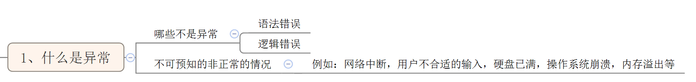
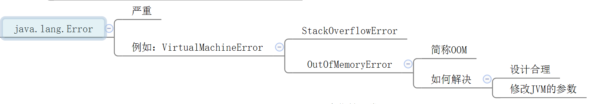
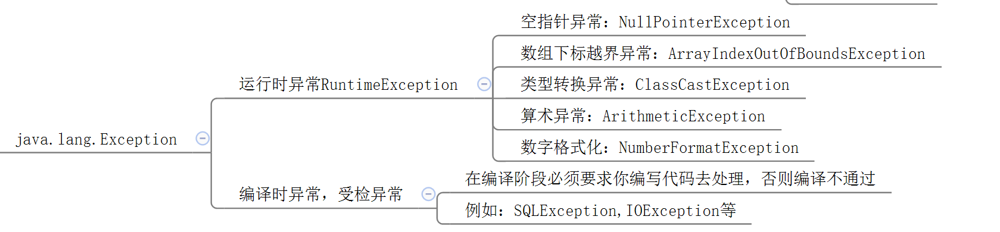

第九章 异常

# 第九章 异常

什么是异常

哪些不是异常  语法错误 逻辑错误

不可预知的非正常的情况  例如 网络中断 用户不合适的输入  硬盘已满

操作系统崩溃

内存溢出



非正常错误

## 9.1 异常的类型的体系结构

1、异常系列的超父类：java.lang.Throwable

所有异常和错误的超类 

异常的类型的体系结构 


（1）只有它或它子类的对象，才能被JVM或throw语句“抛”出

JVM　　throw　　抛出　

只有它或它子类的对象 才能被JVM或throw语句抛出

（2）也只有它或它子类的对象，才能被catch“捕获”

异常序列的超父类   java.lang.Throwable 

java.lang.Throwable

只有它或它子类的对象 才能被catch 

抛出  捕获 

它或它的子类的对象   才能被 JVM 或 throw语句抛出

也只有它或它子类的对象 才能被catch 捕获 

2、Throwable分为两大派别

（1）Error：严重的错误，需要停下来重新设计、升级解决这个问题



严重

Virtual Machine Error  StackOverFlowError

OutOfMemoryError 

如何解决 设计合理 修改JVM的参数　

（2）Exception： 一般的异常，可以通过判断、检验进行避免，或者使用try...catch进行处理

Error  严重的错误  需要停下来重新设计 升级解决这个问题

判断  检验 进行避免 使用 try  catch 进行处理 


Exception  两大类

派别　Error

3、Exception又分为两大类

（1）运行时异常：

​	它是RuntimeException或它子类的对象。

​	这种类型的异常，编译器不会提醒你，要进行throws或try...catch进行处理，但是运行时可能导致崩溃。

这种类型的异常 编译器不会提醒你 

可能导致崩溃

子类的对象

throws  try  catch进行处理

但是运行时可能导致崩溃

（2）编译时异常：

​	异常除了运行时异常以外的都是编译时异常。

​	这种类型的异常，编译器是强制要求你，throws或try...catch进行处理，否则编译不通过。

运行时异常

编译时异常  

4、列出常见的异常类型

（1）运行时异常

RuntimeException   NullPointerException 

空指针异常 类型转换异常 算术异常 

RuntimeException、NullPointerException（空指针异常），ClassCastException（类型转换异常），ArithmeticException（算术异常），NubmerFormatException（数字格式化异常），IndexOutOfBoundsException（下标越界异常）（ArrayIndexOutOfBoundsException（数组下标越界异常）、StringIndexOutOfBoundsException（字符串下标越界异常））、InputMisMatchException（输入类型不匹配异常）。。。。


n. 算术，算法   arithmetic 

（2）编译时异常

FileNotFoundException（文件找不到异常）、IOException（输入输出异常）、SQLException（数据库sql语句执行异常）。。。



## 9.2 异常的处理

try catch finally 

Java虚拟机会在发生异常的那句代码的位置，创建一个异常的对象，并且抛出，这个时候，它会检测有没有try..catch，如果有对应的catch，那么程序正常运行，如果没有合适的catch，会被往上抛出，如果一路上都没有被catch，最终会导致程序终止运行。

Java虚拟机会在发生异常的那句代码的位置  创建一个异常的对象 

抛出 

catch  对应的  正常运行 

1、在当前方法中处理：try...catch...finally

try  catch catch 

try  catch catch  finally 

try finally 

```java
//形式一：try...catch
try{
    可能发生异常的代码
}catch(异常类型  异常名e){
    处理异常的代码（一般都是打印异常的信息的语句）
}catch(异常类型  异常名e){
    处理异常的代码（一般都是打印异常的信息的语句）
}。。。


//形式二：try...finally
try{
    可能发生异常的代码
}finally{
    无论try中是否有异常，也不管是不是有return，都要执行的部分
}

//形式三：try..catch..finally
try{
    可能发生异常的代码
}catch(异常类型  异常名e){
    处理异常的代码（一般都是打印异常的信息的语句）
}catch(异常类型  异常名e){
    处理异常的代码（一般都是打印异常的信息的语句）
}。。。
finally{
    无论try中是否有异常，也不管catch是否可以捕获异常，也不管try和catch中是不是有return，都要执行的部分
}
```

无论try中是否有异常  也不管catch是否可以捕获异常

也不管try 和 catch 是不是有 return  都是执行的部分

执行特点：

（1）如果try中的代码没有异常，那么try中的代码会正常执行，catch部分就不执行，finally中会执行

try

（2）如果try中的代码有异常，那么try中发生异常的代码的后面就不执行了，找对应的匹配的catch分支执行，finally中会执行

catch分支会执行  finally中


2、finally与return混合使用时

（1）如果finally中有return，一定从finally中的return返回。

此时try和catch中的return语句，执行了一半，执行了第一个动作。所以，finally中的return语句会覆盖刚刚的返回值

finally  return  finally  


return 返回值; 语句有两个动作：（1）把返回值放到“操作数栈”中，等当前方法结束后，这个“操作数栈”中的值会返回给调用处（2）结束当前方法的执行


（2）如果finally中没有return，finally中的语句会执行，但是不影响最终的返回值

即try和catch中的return语句两步拆开来走，先把（1）把返回值放到“操作数栈”中，（2）然后走finally中的语句（3）再执行return后半个动作，结束当前方法


3、在当前方法中不处理异常，明确要抛给调用者处理，使用throws

语法格式：

```java
【修饰符】 返回值类型  方法名(【形参列表】) throws 异常列表{
    
}
```

此时调用者，就知道需要处理哪些异常。


方法的重写的要求：

（1）方法名：相同

（2）形参列表：相同

（3）返回值类型：

​	基本数据类型和void：相同

​	引用数据类型：<=

（4）修饰符：

​	权限修饰符：>=

​	其他修饰符：static，final，private不能被重写

（5）throws：<=


方法的重载：

（1）方法名：相同

（2）形参列表：必须不同

（3）返回值类型：无关

（4）修饰符：无关

（5）throws：无关


## 9.3 手动抛出异常：throw

```java
throw 异常对象;

//例如：
throw new AccountException("xxx");
```

throw抛出来的异常对象，和JVM抛出来的异常对象一样，也要用try..catch处理或者throws。

如果是运行时异常，编译器不会强制要求你处理，如果是编译时异常，那么编译器会强制要求你处理。


## 9.4  自定义异常


1、必须继承Throwable或它的子类

我们见到比较多的是继承RuntimeException和Exception.

如果你继承RuntimeException或它的子类，那么你自定义的这个异常就是运行时异常。编译器就不会提醒你处理。

去处理这个 

如果你继承Exception，那么它属于编译时异常，编译器会强制你处理。

编译异常

2、建议大家保留两个构造器

```java
//无参构造
public 自定义异常名(){
    
}

//有参构造
public 自定义异常名(String message){
    super(message);
}
```

3、自定义异常对象，必须手动抛出，用throw抛出


## 9.5 关于异常的几个方法

（1）e.printStackTrace()：打印异常对象的详细信息，包括异常类型，message，堆栈跟踪信息。这个对于调试，或者日志跟踪是非常有用的

（2）e.getMessage()：只是获取异常的message信息


关于异常信息的打印：

用System.err打印和用e.printStackTrace()都是会标记红色的突出。

用System.out打印，当成普通信息打印。

这两个打印是两个独立的线程，顺序是不能精确控制的。