# Java

2020-02-01 复习

## 1. Java概述

### 1.1 Java语言发展史（了解）

语言：人与人交流沟通的表达方式

计算机语言：人与计算机之间进行信息交流沟通的一种特殊语言

信息交流沟通

人与人交流沟通的表达方式

计算机语言 人与计算机之间进行信息交流沟通的一种特殊语言


Java语言是美国Sun公司（Stanford University Network）在1995年推出的计算机语言

计算机语言

Java之父：詹姆斯·高斯林（James Gosling）

2009年，Sun公司被甲骨文公司收购，所以我们现在访问oracle官网即可：[https://www.oracle.com](https://www.oracle.com/) 

sun

当前，我们课程使用的JDK版本：11.0


JDK15来了

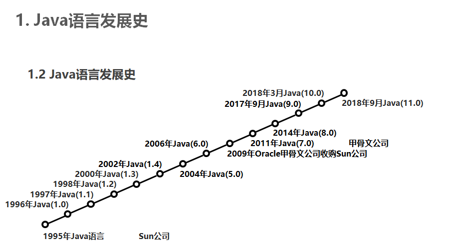

1995年Java语言

2004 Java 5.0 

2006 Java 6.0 

2011 Java 7.0

2014 Java 8.0

2017 Java 9.0 

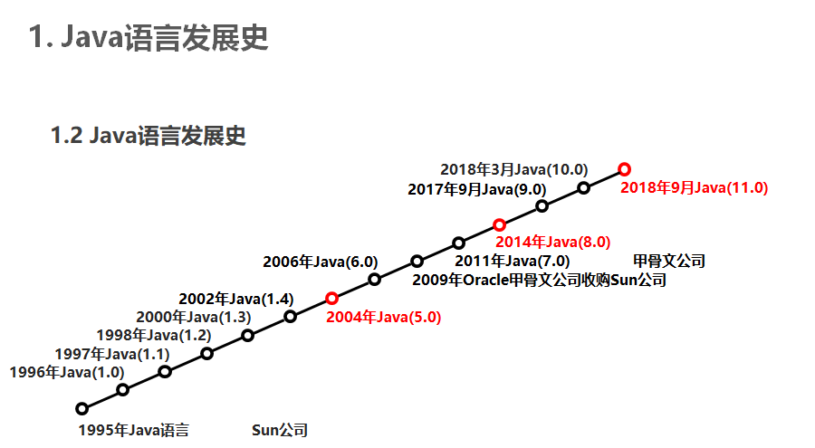

2004 JDK1.5 

2014 JDK1.8 企业用得最多 

2018 Java11.0

2020 9 Java15.0

### 1.2 Java语言跨平台原理（理解）

平台

指的是操作系统

Windows

Mac

Linux

Java语言有很多的特性，在后面学习过程中我们慢慢体验。这里我们重点先说一下Java语言跨平台性。

跨平台

Java程序可以在任意操作系统上运行

Java程序可以在任意操作系统上运行

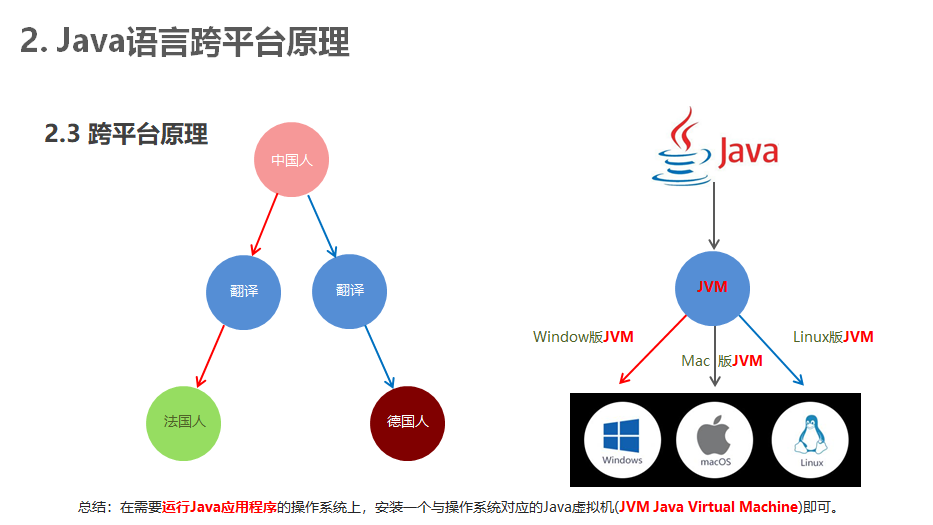


总结：在需要**运行Java**应用程序**的操作系统上，安装一个与操作系统对应的Java虚拟机(**JVM Java Virtual Machine)即可。


一个JVM  翻译

运行Java应用程序的操作系统上  安装一个与操作系统对应的Java虚拟机 JVM Java Virtual Machine即可

Java程序并非是直接运行的，Java编译器将Java源程序编译成与平台无关的字节码文件(class文件)，然后由Java虚拟机（JVM）对字节码文件解释执行。所以在不同的操作系统下，只需安装不同的Java虚拟机即可实现java程序的跨平台。

Java程序并非是直接运行的  Java编译器将Java源程序编译成与平台无关的字节码文件 class文件  Java虚拟机 JVM 对字节码文件解释执行


Java语言有很多的特性，在后面学习过程中我们慢慢体验。这里我们重点先说一下Java语言跨平台性。


### 1.3 JRE和JDK（记忆）

JVM（Java Virtual Machine），Java虚拟机

JRE（Java Runtime Environment），Java运行环境，包含了JVM和Java的核心类库（Java API）

JDK（Java Development Kit）称为Java开发工具，包含了JRE和开发工具

总结：我们只需安装JDK即可，它包含了java的运行环境和虚拟机。


JRE  (Java Runtime Environment)

是Java程序的运行时环境，包含 **JVM** 和运行时所需要的核心类库。 

我们想要**运行**一个已有的Java程序，那么只需安装 **JRE** 即可。 


Java运行环境

JVM和运行时所需要的核心类库

JRE = JVM + 核心类库

运行一个已有的Java程序 安装JRE即可 


JDK  (Java Development Kit)

JDK  = JRE + 开发人员使用的工具

javac.exe   java.exe

编译工具  运行工具

是Java程序开发工具包，**包含** **JRE** 和开发人员使用的工具。

其中的开发工具：编译工具（**javac.exe**）和运行工具（**java.exe**）。

我们想要**开发**一个全新的Java程序，那么必须安装 **JDK** 。


开发


2.java语言跨平台 依赖于虚拟机(JVM)

3.JDK(Java程序开发工具包)-->JRE(Java运行环境)-->JVM(java虚拟机 可以保证java语言的跨平台)

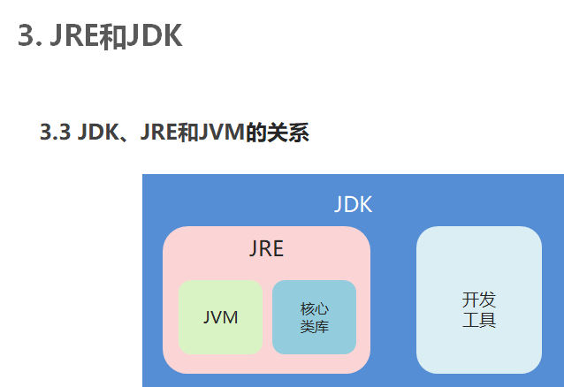

### 1.4 JDK的下载和安装（应用）

#### 1.4.1 下载

通过官方网站获取JDK

[http://www.oracle.com](http://www.oracle.com/)

**注意**：针对不同的操作系统，需要下载对应版本的JDK。

具体下载步骤请参见《JDK下载及安装说明文档》


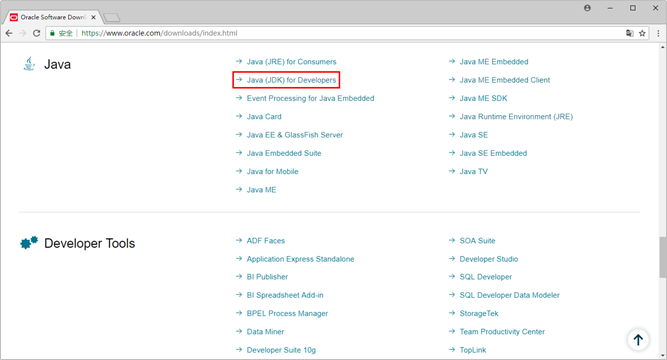


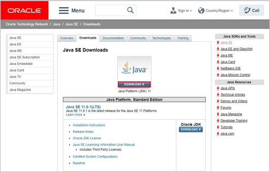


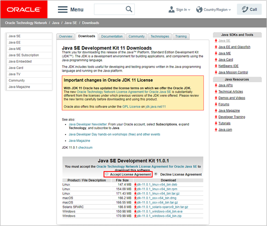


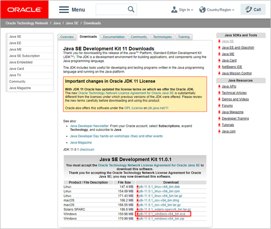


傻瓜式安装，下一步即可。

建议：安装路径中不要包含中文和空格。所有的开发工具最好安装目录统一。

#### 1.4.2 安装

JDK安装


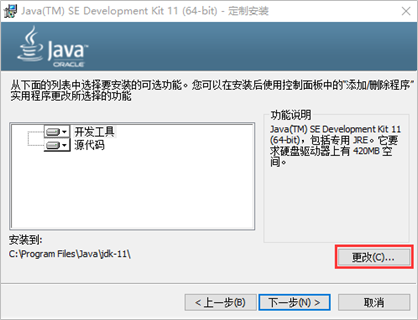


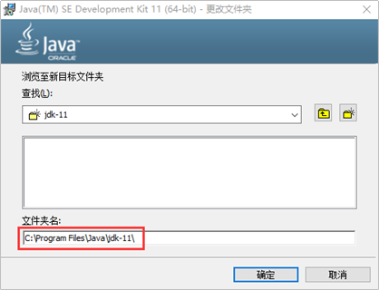


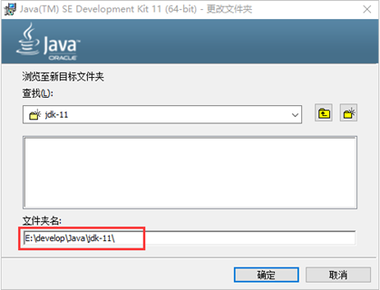


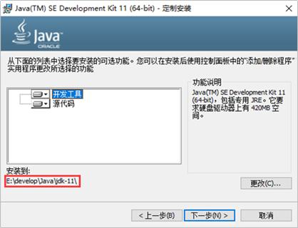


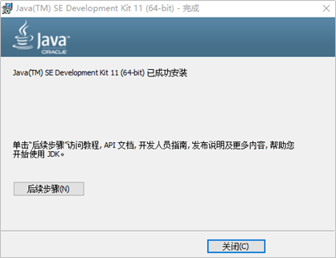


傻瓜式安装，下一步即可。但默认的安装路径是在C:\Program Files下，为方便统一管理建议修改安装路径，将与开发相关的软件都安装到一个目录下，例如：E:\develop。

**注意**：安装路径不要包含中文或者空格等特殊字符（使用纯英文目录）。

具体安装步骤请参见《JDK下载及安装说明文档》

#### 1.4.3 JDK的安装目录介绍

目录名称 

bin  存放了JDK的各种工具命令

javac和java就放在这个目录

conf  

include

imods

legal 授权文档

lib 存放了JDK各模块的授权文档

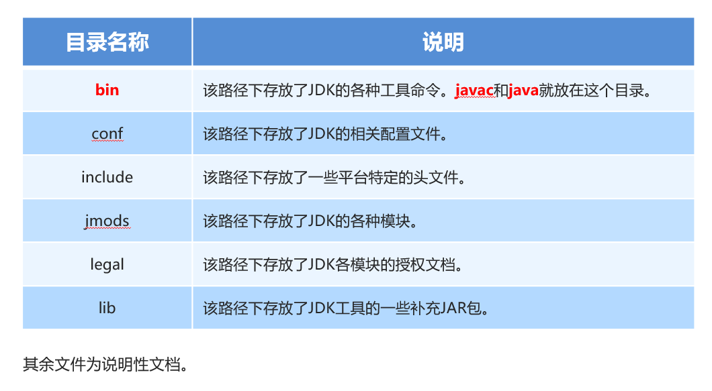

legal

lib JDK工具的一些补充JAR包

| 目录名称 | 说明                                                         |
| -------- | ------------------------------------------------------------ |
| bin      | 该路径下存放了JDK的各种工具命令。javac和java就放在这个目录。 |
| conf     | 该路径下存放了JDK的相关配置文件。                            |
| include  | 该路径下存放了一些平台特定的头文件。                         |
| jmods    | 该路径下存放了JDK的各种模块。                                |
| legal    | 该路径下存放了JDK各模块的授权文档。                          |
| lib      | 该路径下存放了JDK工具的一些补充JAR包。                       |


## 2. 第一个演示程序

### 2.1 常用DOS命令（应用）

javac xxx.java

java xxx

打开命令提示符

**打开命令提示符窗口**


①按下win+R


②输入cmd

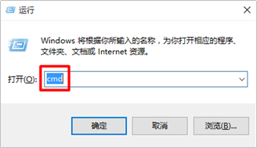

③按下回车键


**1.1** **打开命令提示符窗口**

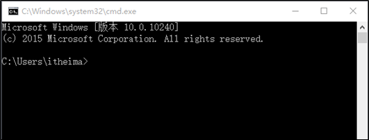

打开命令提示符窗口

也可以这样

cmd  

直接回车

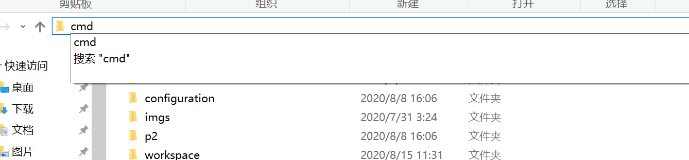


搜索


在接触集成开发环境之前，我们需要使用命令行窗口对java程序进行编译和运行，所以需要知道一些常用DOS命令。

编译和运行

接触集成开发环境 IDE   Idea eclipse 

编译  运行  

1、打开命令行窗口的方式：win + r打开运行窗口，输入cmd，回车。

2、常用命令及其作用


| 操作               | 说明                              |
| ------------------ | --------------------------------- |
| 盘符名称:          | 盘符切换。E:回车，表示切换到E盘。 |
| dir                | 查看当前路径下的内容。            |
| cd 目录            | 进入单级目录。cd itheima          |
| cd ..              | 回退到上一级目录。                |
| cd 目录1\目录2\... | 进入多级目录。cd itheima\JavaSE   |
| cd \               | 回退到盘符目录。                  |
| cls                | 清屏。                            |
| exit               | 退出命令提示符窗口。              |

d:

dir 

cd xxx

cd ..

cd xxx\xxx\...

cd \ 回答盘符目录

cls 清屏 

exit  退出命令提示符窗口 

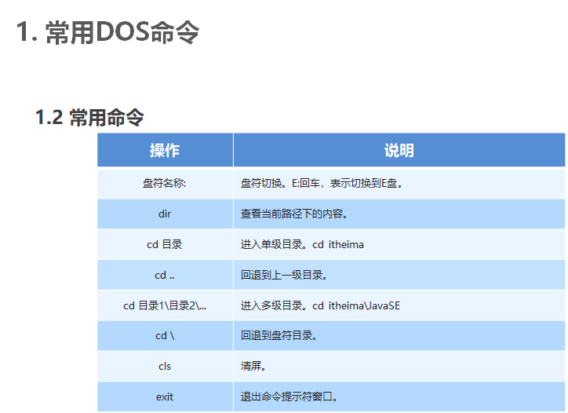


### 2.2 Path环境变量的配置（应用）

#### 2.2.1 为什么配置环境变量

开发Java程序，需要使用JDK提供的开发工具（比如javac.exe、java.exe等命令），而这些工具在JDK的安装目录的bin目录下，如果不配置环境变量，那么这些命令只可以在该目录下执行。我们不可能把所有的java文件都放到JDK的bin目录下，所以配置环境变量的作用就是可以使bin目录下的java相关命令可以在任意目录下使用。


开发Java程序  需要使用JDK提供的开发工具  

开发Java程序，需要使用JDK提供的开发工具，而这些工具在JDK的安装目录的bin目录下。

为了在开发Java程序的时候，能够方便的使用 **javac** 和 **java** 这些命令，我们需要配置 **Path** **环境变量**。


为了使得bin目录下的java相关命令可以在任意目录下使用


#### 2.2.2 配置环境变量步骤

具体配置步骤请参见《Java环境变量配置说明》文档。    

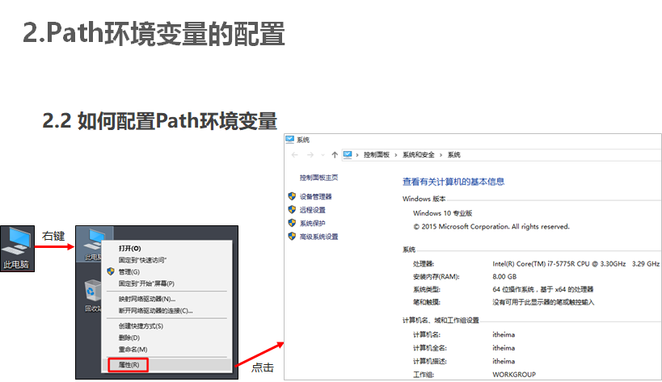


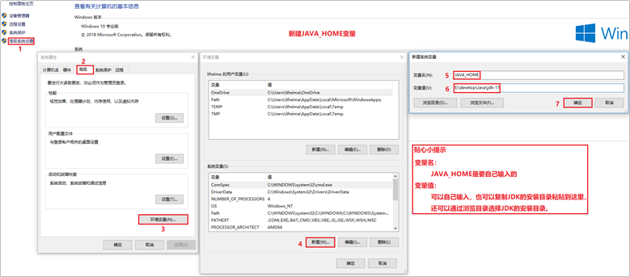


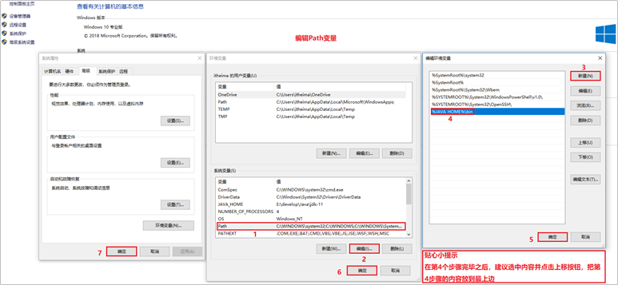


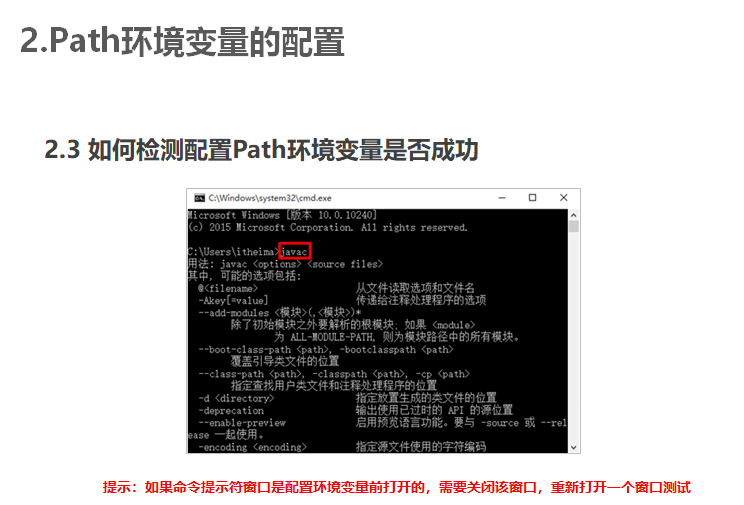

**提示：如果命令提示符窗口是配置环境变量前打开的，需要关闭该窗口，重新打开一个窗口测试**

配置环境变量的过程，需要做成图画，一步步说明，然后到环境中去演示。

这里的配置完成后，直接说，如何测试配置成功呢，看完下一页，然后再回去演示。

在命令行窗口的任意目录下，输入javac命令，都能看到出现一些内容，说明配置成功。

先使用打开的DOS窗口，发现有问题，说明问题原因：这个窗口是在我配置完成之前打开的，配置之后，需要重新打开一个窗口。然后再次测试，成功。


### 2.3 HelloWorld案例（应用）

Java程序开发运行流程

开发Java程序，需要三个步骤：编写程序，编译程序，运行程序

编写程序 编译程序 运行程序

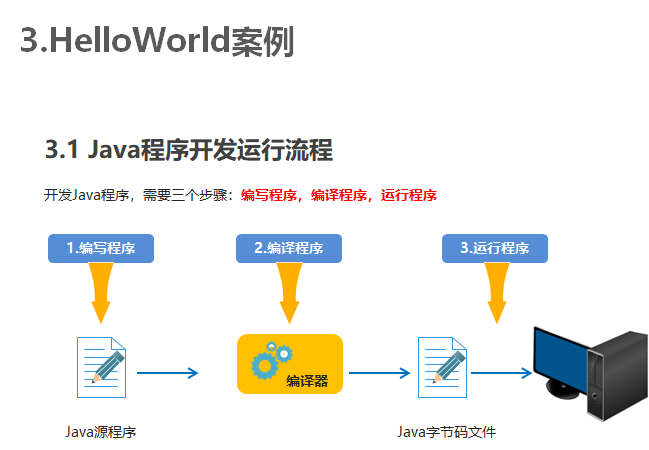


HelloWorld案例是指在计算机屏幕上输出“HelloWorld”这行文字。各种计算机语言都习惯使用该案例作为第一个演示案例。

#### 2.3.1 Java程序开发运行流程

开发Java程序，需要三个步骤：编写程序，编译程序，运行程序。

编写程序  编译程序  运行程序

HelloWorld案例的编写  

#### 2.3.2 HelloWorld案例的编写


提示：保存文件Ctrl+s

讲解完毕开发流程，讲解编写流程，讲解完编写流程，开始编写程序。编写程序完毕后，再去看编译和运行流程，然后编译和运行程序。


1、新建文本文档文件，修改名称为HelloWorld.java。

2、用记事本打开HelloWorld.java文件，输写程序内容。

~~~java
public class HelloWorld {
	public static void main(String[] args) {
		System.out.println("HelloWorld");
	}
}
~~~

#### 2.3.3 HelloWorld案例的编译和运行

打开命令提示符窗口，进入到HelloWorld.java所在的目录。输入指令编译和执行。

编译：javac 文件名.java
范例：javac HelloWorld.java

执行：java 类名
范例：java HelloWorld

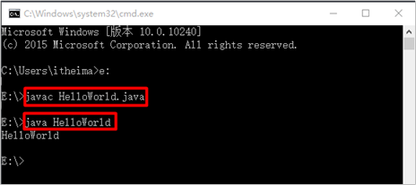


存文件，打开命令行窗口，将目录切换至java文件所在目录，编译java文件生成class文件，运行class文件。

> 编译：javac 文件名.java
>
> 范例：javac HelloWorld.java
>
> 执行：java 类名
>
> 范例：java HelloWorld

编译 执行  

### 2.4 HelloWorld案例常见问题（理解）

#### 2.4.1 BUG

在电脑系统或程序中，隐藏着的一些未被发现的缺陷或问题统称为bug（漏洞）。

未被发现的缺陷或问题统称为bug漏洞


这里我要给大家说的是，好的程序都是不断的出现问题，然后修复问题，最后才稳定的。

所以大家不用担心写程序时出现问题，但是，出现问题后，我们要有基本的解决思路和方案。

希望大家都能够从现在开始培养自己分析解决问题的能力。


分析解决问题的能力

出现问题后

修复问题  才稳定的


#### 2.4.2 BUG的解决

1、具备识别BUG的能力：多看

2、具备分析BUG的能力：多思考，多查资料

3、具备解决BUG的能力：多尝试，多总结

多看 多思考 多查资料

多尝试 多总结 


#### 2.4.3 HelloWorld案例常见问题

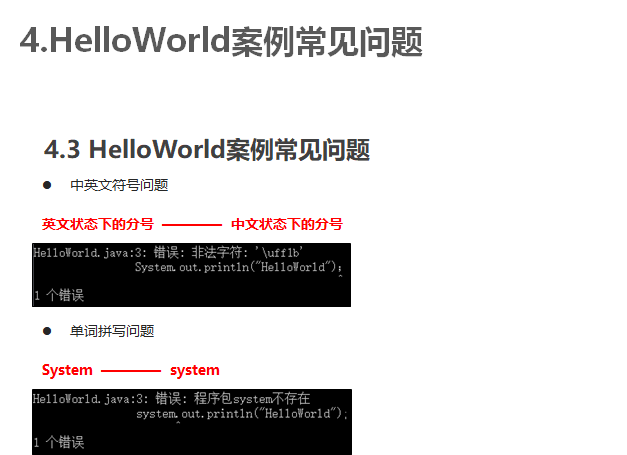


1、非法字符问题。Java中的符号都是英文格式的。

2、大小写问题。Java语言对大小写敏感（区分大小写）。

3、在系统中显示文件的扩展名，避免出现HelloWorld.java.txt文件。

4、编译命令后的java文件名需要带文件后缀.java

5、运行命令后的class文件名（类名）不带文件后缀.class

...

### 2.5 Notepad++软件的安装和使用（应用）

安装：一路下一步，除了修改安装路径。配置：配置文件扩展名和编码问题。

放一个错误的图片，说明安装软件的重要性，最后加一个代码的图，与之呼应。

第一个图，用记事本打开代码，说行号的问题。


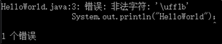

安装：傻瓜式安装。建议也安装到E:\develop目录下


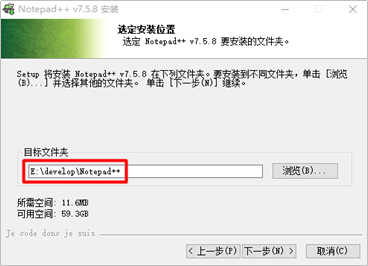

安装完毕之后，为了使用方便，做一个简单的配置：修改默认语言和编码

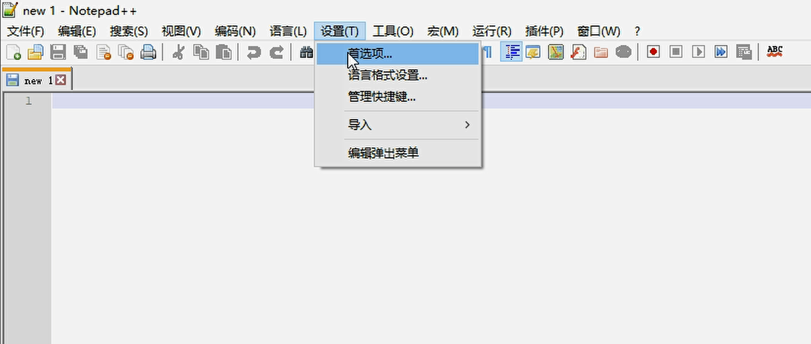


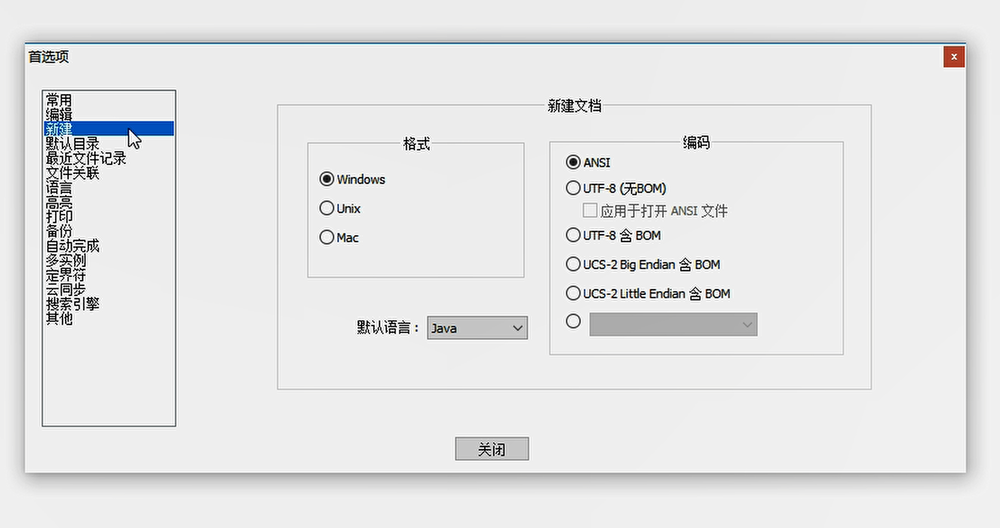


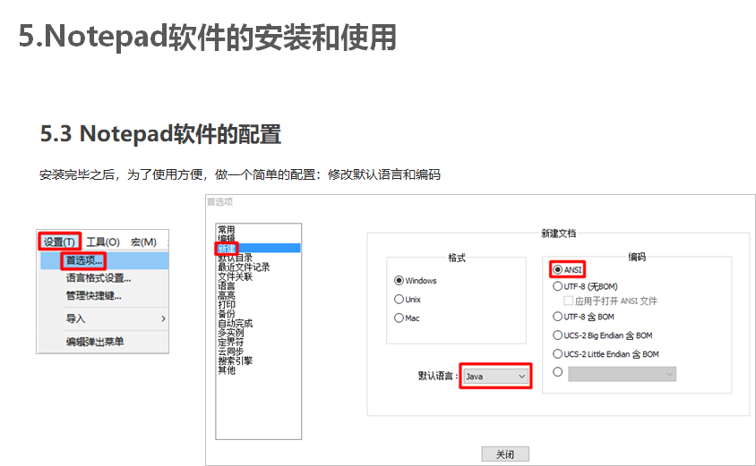


使用：通过Notepad软件编写HelloWorld案例


这一页配一个代码。在itheima目录下的JavaSE目录下的案例中新建一个文件，告知代码放到这个位置。第一个就在这里新建，然后打开，编写，编译，运行。后面开始，每一个文件都是建立好的，直接写内容即可。还有就是DOS窗口都是打开好的在这个位置。


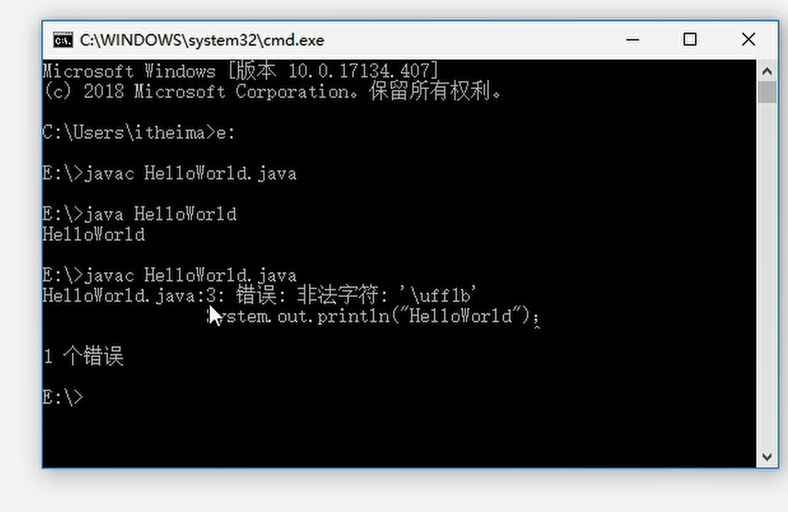


#### 2.5.1 什么要使用Notepad++软件

Notepad++功能比windows中的自带记事本功能强大，除了可以用来制作一般的纯文字说明文件，也十分适合编写计算机程序代码。Notepad++有行号，能够快速定位问题位置，还有语法高亮度显示、代码折叠等功能。而且它是免费的。

#### 2.5.2 Notepad++软件安装

安装：傻瓜式安装，一直下一步即可。建议也安装到统一的开发软件目录下，比如E:\develop。

具体安装步骤请参见《Nodepad++软件安装及配置说明》文档。

#### 2.5.3Notepad++软件配置

安装完毕之后，为了使用方便，做一个简单的配置：修改默认语言和编码。

具体配置的说明请参见《Nodepad++软件安装及配置说明》文档。


## 3. java基础语法

#### 3.1 注释（理解）

需要思考引入的话和串讲的话


没看注释信息

长毛衣  洗了变   短毛衣  


注释是对代码的解释和说明文字 可以提高程序的可读性

程序中添加必要的注释文件十分重要 

l注释是在程序**指定位置**添加的**说明性信息**

l注释不参与程序运行，仅起到**说明作用**

指定位置  说明性信息

说明作用  不参与程序运行  说明作用

注释分为三种 

单行 多行 文档注释

代码的解释和说明文字  提高程序的可读性


注释是对代码的解释和说明文字，可以提高程序的可读性，因此在程序中添加必要的注释文字十分重要。Java中的注释分为三种：

单行注释。单行注释的格式是使用//，从//开始至本行结尾的文字将作为注释文字。

~~~java
// 这是单行注释文字
~~~

多行注释。多行注释的格式是使用/* 和 */将一段较长的注释括起来。

~~~java
/*
这是多行注释文字
这是多行注释文字
这是多行注释文字
*/
注意：多行注释不能嵌套使用。
~~~

文档注释。文档注释以`/**`开始，以`*/`结束。（以后讲）


```java
// hello
/*
world
*/
/**
hello world
*/
```

分类说完之后，我们来写代码使用一下注释。写完注释之后，编译，运行，发现注释不参与运行。

再来回顾：注释是在程序指定位置添加的说明性信息，注释不参与程序运行，仅起到说明作用。

有了注释以后，我们的代码就能够让人看懂了，提高了程序的阅读性，以后我们在实际开发的时候，注释得占整体的1/3以上。

所以，我们从现在开始养成良好的编码习惯，编写代码的时候加上注释。

现在开发养成良好的编码习惯 编写代码的时候加上注释 


#### 3.2 关键字（理解）

在讲解关键字之前，有这样的一个经典对话：天王盖地虎，下一句是什么呢？1,2,3

没错，就是 宝塔镇河妖。

看完之后，我估计很多人和我一样，一头雾水，这是什么意思？

我们之所以看不懂，是因为这是土匪这个行业的行话。

也就是说这两句话在土匪行业是有特殊含义的。

说到这里，我要说的是，在不同的行业，有一些内容是被赋予了特定的含义。

在编程语言中，也有一些内容是被赋予了特定的含义，只不过，在编程语言中，

这些被赋予特定含义的内容不是汉字，而是英文单词。

那这些被赋予特定含义的单词我们叫他们什么呢？

我们来说一下，Java中的关键字。


宝塔bai镇河妖
出自《林海雪原》du
说到电影《林海雪原》zhi，几乎无人不知、无人不晓，侠客dao般的杨子荣孤身入匪巢、智剿威虎山的传奇故事，让无数人大呼过瘾。那句著名的“天王盖地虎，宝塔镇河妖”更是被几代人口口相传。然而，影片中的这些暗号黑话究竟是什么意思呢？
2006年10月30日晚9点40分的《流金岁月》——《林海雪原》46年英雄会，到场的影片主创为我们解开了答案。
改编剧本的导演大刀阔斧地删改了影片的许多内容，包括把杨子荣替换少剑波写成男主角，把少剑波和小白鸽的爱情大胆割舍，仅仅截取“智取威虎山”的段落进行拍摄——唯一没有删改的，就是原小说中的黑话暗号；
王润身，把武侠的风格融入到杨子荣的言谈举止中，最明显的表现也是和坐山雕等土匪在威虎堂里的斗智斗勇；
甚至少剑波的年轻有为、足智多谋也能在他考验杨子荣的一场戏中表现的淋漓尽致。
《林海雪原》中到底有哪些黑话暗号？究竟杨子荣和土匪们在说什么呢？
土匪：蘑菇，你哪路？什么价？（什么人？到哪里去？）
杨子荣：哈！想啥来啥，想吃奶来了妈妈，想娘家的人，孩子他舅舅来了。（找同行）
杨子荣：拜见三爷！
土匪：天王盖地虎！（你好大的胆！敢来气你的祖宗？）
杨子荣：宝塔镇河妖！（要是那样，叫我从山上摔死，掉河里淹死。）
土匪：野鸡闷头钻，哪能上天王山！（你不是正牌的。）
杨子荣：地上有的是米，喂呀，有根底！（老子是正牌的，老牌的。）
土匪：拜见过阿妈啦？（你从小拜谁为师？）
杨子荣：他房上没瓦，非否非，否非否！（不到正堂不能说。）
土匪：嘛哈嘛哈？（以前独干吗？）
杨子荣：正晌午说话，谁还没有家？（许大马棒山上。）
土匪：好叭哒！（内行，是把老手）
杨子荣：天下大耷拉！（不吹牛，闯过大队头。）
座山雕：脸红什么？
杨子荣：精神焕发！
座山雕：怎么又黄了？
杨子荣：防冷，涂的蜡！
座山雕：晒哒晒哒。（谁指点你来的？）
杨子荣：一座玲珑塔，面向青寨背靠沙！（是个道人。）

天王盖地bai虎意思介绍

这是一句口号—du—《水浒传》：天王盖地虎，宝塔镇zhi河妖

天王：指皇帝地虎：dao指地方势力头子 天王盖地虎：就是说一个小小的地方头子再厉害也得听皇帝的，表现出古代封建社会权力阶层的写照。

想到《智取威虎山》这部中国革命大戏，其实这些都是中国解放时期，东北胡子的黑话，那么天王盖地虎的下一句是什么，很自然的就是“宝塔镇河妖”


这也是天王盖地虎全部暗号里最初的、也是流传度最广的一句。是解放时期的一句黑话，在《智取威虎》里大概意思是这样的：天王盖地虎(你好大的胆，敢来惹你的祖宗!)，宝塔镇河妖(要是那样，就叫我从山上摔死，掉河里淹死)


关键字  理解  

特殊含义


关键字是指被java语言赋予了特殊含义的单词。

关键字的特点：

​	关键字的字母全部小写。

​	常用的代码编辑器对关键字都有高亮显示，比如现在我们能看到的public、class、static等。

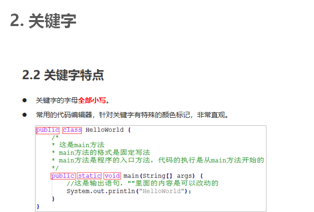


说完特点，看到代码之后，打开注释的代码开一下。开完之后回到资料总结，这几个框起来的都是关键字。

关键字我们不需要去死记硬背，看的多了，写的多了，自然而然就记住了。


看的多了 写的多了  自然而然就记住了

注释的代码开一下

开完之后回到资料总结 这几个框起来的都是关键字


#### 3.3 常量（应用）

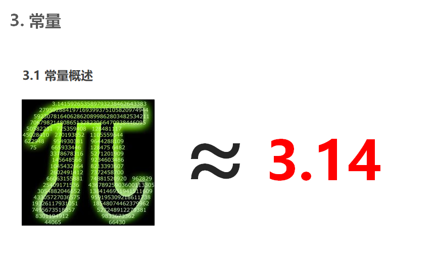

接下来，我们学习常量，在讲解常量之前，我们来看这样的一个图片，估计很多人都认出来了，这是一个符号：π。

也就是圆周率。你看它上面的数字，当然这还不是全部，这么多，我们肯定是记不住的，所以大家也不用记。

在日常生活中，我们通常都用3.14代表圆周率去进行近似计算。只要用到圆周率的地方，我们使用的都是3.14，也就是说，

这个值是固定不变的，这样的值就是我们说的常量。来我们看一下常量的定义。

固定不变的   常量

**关键字**：就是被Java语言赋予了**特定含义的单词**。


**常量**：在程序运行过程中，其值不可以发生改变的量。


特定含义的单词

关键字

常量 

常量：在程序运行过程中，其值不可以发生改变的量。

Java中的常量分类：

​	字符串常量  用双引号括起来的多个字符（可以包含0个、一个或多个），例如"a"、"abc"、"中国"等

​	整数常量  整数，例如：-10、0、88等

​	小数常量  小数，例如：-5.5、1.0、88.88等

​	字符常量  用单引号括起来的一个字符，例如：'a'、'5'、'B'、'中'等

​	布尔常量  布尔值，表示真假，只有两个值true和false

​	空常量  一个特殊的值，空值，值为null

除空常量外，其他常量均可使用输出语句直接输出。

~~~java
public class Demo {
    public static void main(String[] args) {
        System.out.println(10); // 输出一个整数
        System.out.println(5.5); // 输出一个小数
        System.out.println('a'); // 输出一个字符
        System.out.println(true); // 输出boolean值true
        System.out.println("欢迎来到黑马程序员"); // 输出字符串
    }
}
~~~


只要了定义之后，接下来我们说一说在Java中有哪些常量。 

在Java中有哪些常量吧 

讲解完毕之后，写代码测试一下。

在代码中，已经建立好文件了，改写的注释已经也写好，只需要从字符串常量开始打印就好了。不需要回来总结

讲解完毕之后  写代码测试一下


#### 3.4 数据类型（记忆、应用）

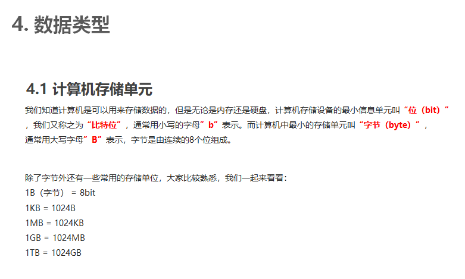

##### 3.4.1 计算机存储单元

计算机存储单元

用来存储数据的  无论是内存还是硬盘

位 bit  比特位   小写的字母  b  

计算机中最基本的存储单元  字节 

我们知道计算机是可以用来存储数据的，但是无论是内存还是硬盘，计算机存储设备的最小信息单元叫“位（bit）”，我们又称之为“比特位”，通常用小写的字母”b”表示。而计算机中最基本的存储单元叫“字节（byte）”，

通常用大写字母”B”表示，字节是由连续的8个位组成。

除了字节外还有一些常用的存储单位，其换算单位如下：

1B（字节） = 8bit

1KB = 1024B

1MB = 1024KB

1GB = 1024MB

1TB = 1024GB

1MB 1024KB

1 GB  1024MB

1 TB 1024GB

##### 3.4.2 Java中的数据类型

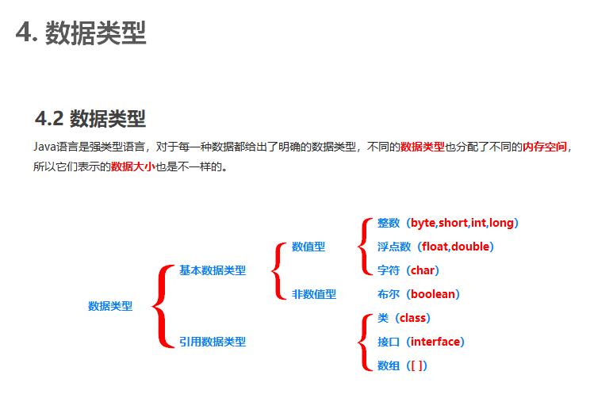

Java是一个强类型语言，Java中的数据必须明确数据类型。在Java中的数据类型包括基本数据类型和引用数据类型两种。

明确的数据类型   

基本数据类型  引用数据类型  

数值型  整数 浮点数 浮点数 字符 布尔

byte short int long 

char  boolean 

class  interface 数组 

Java中的基本数据类型：

| 数据类型 | 关键字       | 内存占用 | 取值范围                                                     |
| :------- | ------------ | -------- | :----------------------------------------------------------- |
| 整数类型 | byte         | 1        | -128~127                                                     |
|          | short        | 2        | -32768~32767                                                 |
|          | int(默认)    | 4        | -2的31次方到2的31次方-1                                      |
|          | long         | 8        | -2的63次方到2的63次方-1                                      |
| 浮点类型 | float        | 4        | 负数：-3.402823E+38到-1.401298E-45                                                             正数：   1.401298E-45到3.402823E+38 |
|          | double(默认) | 8        | 负数：-1.797693E+308到-4.9000000E-324                                              正数：4.9000000E-324   到1.797693E+308 |
| 字符类型 | char         | 2        | 0-65535                                                      |
| 布尔类型 | boolean      | 1        | true，false                                                  |

说明：

​	e+38表示是乘以10的38次方，同样，e-45表示乘以10的负45次方。

​	在java中整数默认是int类型，浮点数默认是double类型。


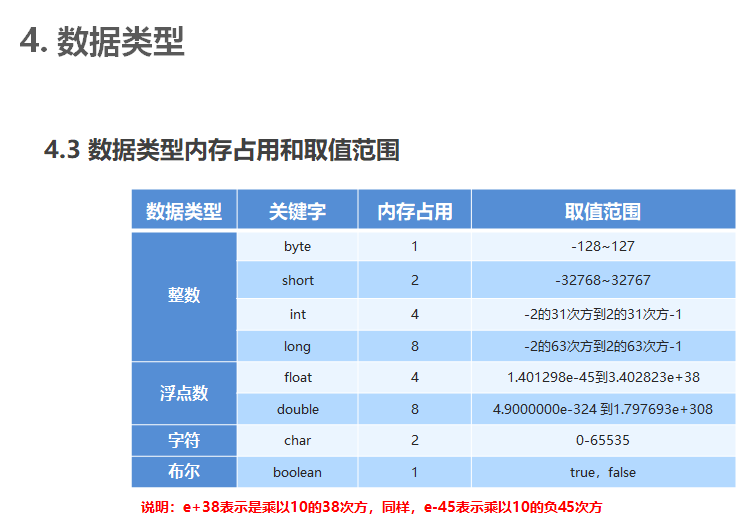

整数默认是int类型，浮点数默认是double类型。


int类型  double类型 


#### 3.5 变量（应用）

我们学习过了常量，假如我们要在控制台输出多个整数10，我们这样编写代码就可以了。图1。

但是，如果我想把所有的10全部修改为20，这个该怎么办呢？有人说太简单了，手动修改呗。图2。

这个确实可以达到效果，但是，如果数据更多呢，那么我们就不用做其他的事情了，这一件事情就够我们做很久。

数据更多  

所以，我们要思考，能不能只修改一处就可以让这多处的值同时变化呢。

能不能只修改一处就可以让这多处的值同时变化呢？

来思考  有一个位置暂时存储了10这个值 

我们这样来思考，如果我有一个位置暂时存储了10这个值，每次都取这个暂存位置的值来输出，如果将暂存位置的值修改为20，那么所有的输出不就都修改为20了吗？对，这个暂存位置在程序语言中被称为变量。通过这个描述我们知道，这个变量的值是可以发生变化的。所以，我们说，变量就是在程序运行过程中，其值可以发生改变的量。

变量就是在程序运行过程中 其值可以发生改变的量 

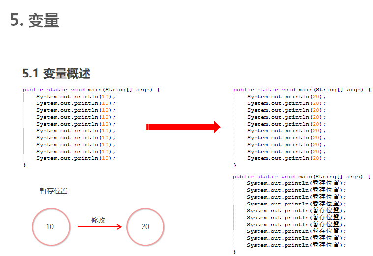


接下来我们来研究变量的组成，只有知道了变量的组成，我们才能够知道变量的定义格式。

继续回到我们的暂存位置，首先我们要说的是，我们程序中使用的目前都存储在内存中，所以，变量也是内存中的一个小块区域，也就是说，这个暂存位置它是在内存上的。

程序中使用的目前都存储在内存中  变量也是内存中的一个小块区域

也就是说  暂存位置  在内存上的   小块区域 

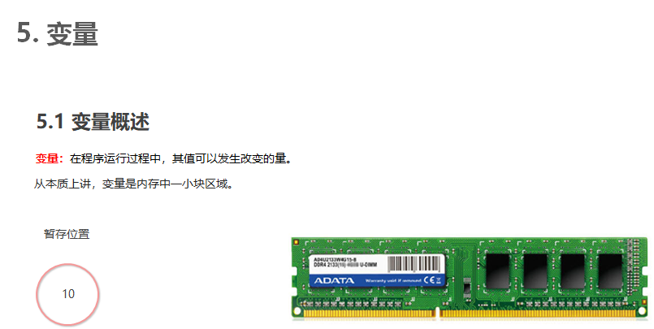

接下来，我要说的是暂存位置将来是要被我们使用的，所以，我们应该用一个名字来标记它，这个名字我们叫变量名。当然，我们如果有了这样的位置之后，我们还应该告诉这个位置，你将来存储的应该是什么类型的数据，这个叫数据类型。有了这两个之后，还不行，如果我们仅仅只是有这样的一个位置和知道该位置可以存储什么类型的数据，而它里面却没有数据，这个对我们来说是没有意义的，所以说，变量还的有一个东西，就是变量值。由此我们知道变量是由三部分组成的。数据类型，变量名，变量值。然后给出定义格式及范例。

数据类型  变量名  变量值  定义格式  范例 

最后到案例中去写代码。写完代码之后，继续说，变量定义完毕之后，如何使用呢？回到资料我们看一下。这里需要切换。

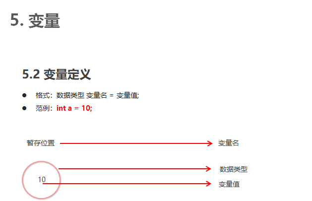

暂存位置  变量名

数据类型  变量值 

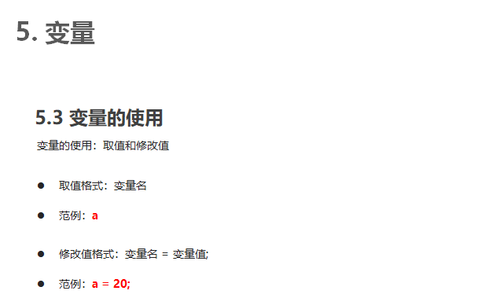

拿到a其实就是获取到a的值了，我拿这个值可以干什么呢，可以直接输出，来我们输出使用。

那么，如何修改值呢，定义好的变量，想要修改值，看格式和范例。接着演示，然后再次输出，发现数据就是发生了改变。

在讲解中结掉，不用回到资料。


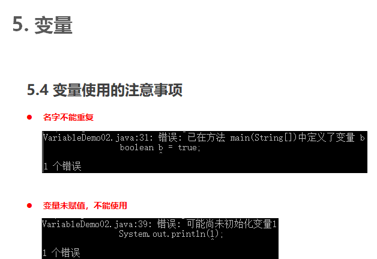


注意事项：

 L，F的问题，名字不能重复，未赋值，不能使用。

定义6个基本类型的变量，这里不包括long和float的，演示名字重复问题。

然后通过long先演示未赋值，不能使用问题。

在赋值，输出，正确，然后改大，报错，引出long类型要加L。

最后，说float类型要加F。


这里需要重新设计案例和截图。


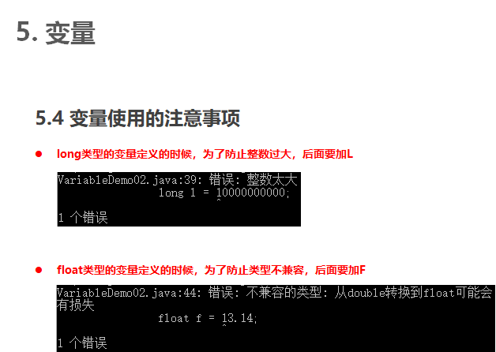


注意事项：

 L，F的问题，名字不能重复，未赋值，不能使用。

定义6个基本类型的变量，这里不包括long和float的，演示名字重复问题。

然后通过long先演示未赋值，不能使用问题。

在赋值，输出，正确，然后改大，报错，引出long类型要加L。

最后，说float类型要加F。


这里需要重新设计案例和截图。

##### 3.5.1 变量的定义

变量：在程序运行过程中，其值可以发生改变的量。

从本质上讲，变量是内存中的一小块区域，其值可以在一定范围内变化。

变量的定义格式：

```java
数据类型 变量名 = 初始化值; // 声明变量并赋值
int age = 18;
System.out.println(age);
```

或者

```java
// 先声明，后赋值（使用前赋值即可）
数据类型 变量名;
变量名 = 初始化值;
double money;
money = 55.5;
System.out.println(money);
```

还可以在同一行定义多个同一种数据类型的变量，中间使用逗号隔开。但不建议使用这种方式，降低程序的可读性。

```java
int a = 10, b = 20; // 定义int类型的变量a和b，中间使用逗号隔开
System.out.println(a);
System.out.println(b);

int c,d; // 声明int类型的变量c和d，中间使用逗号隔开
c = 30;
d = 40;
System.out.println(c);
System.out.println(d);
```

变量的使用：通过变量名访问即可。

##### 3.5.2 使用变量时的注意事项

1. 在同一对花括号中，变量名不能重复。
2. 变量在使用之前，必须初始化（赋值）。
3. 定义long类型的变量时，需要在整数的后面加L（大小写均可，建议大写）。因为整数默认是int类型，整数太大可能超出int范围。
4. 定义float类型的变量时，需要在小数的后面加F（大小写均可，建议大写）。因为浮点数的默认类型是double， double的取值范围是大于float的，类型不兼容。

#### 3.6 标识符（记忆、理解）


**标识符：**就是给类，方法，变量等起名字的**符号**。

通过代码验证。

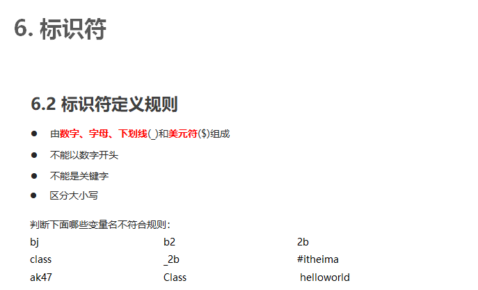

举例说几个标识符。

给大家留下10秒钟的时候，举例说几个标识符。

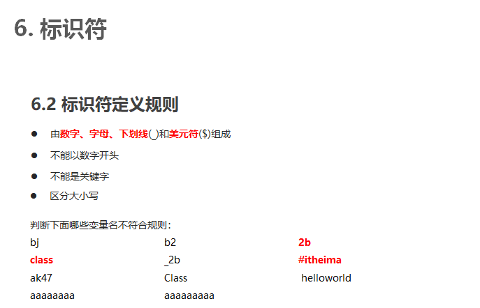

这两个变量是否是同一个变量，

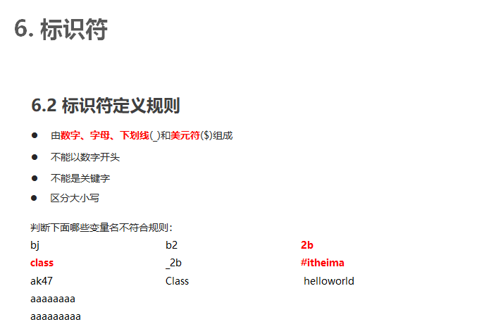

这两个变量是否是同一个变量，不好区分，我把第二个放到下一行，在看，不是，我们每次起名字的应该有一些规范，帮助我们方便识别这个那个变量。

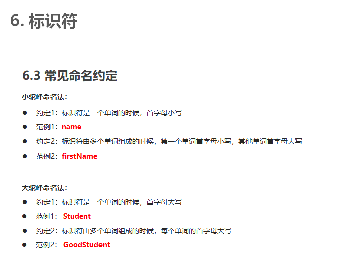

变量见过了，其实方法也见过了，那个main就是一个方法名。

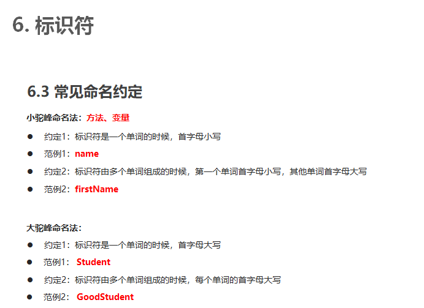

变量见过了，其实方法也见过了，那个main就是一个方法名。

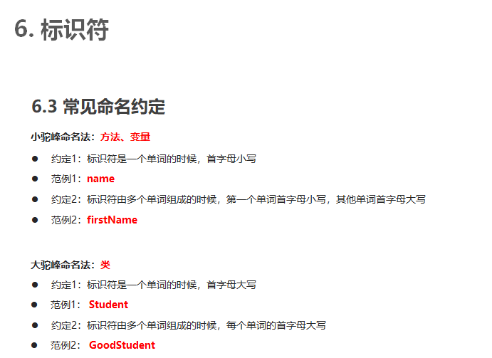

变量见过了，其实方法也见过了，那个main就是一个方法名。


标识符是用户编程时使用的名字，用于给类、方法、变量、常量等命名。

Java中标识符的组成规则：

​	由字母、数字、下划线“_”、美元符号“$”组成，第一个字符不能是数字。

​	不能使用java中的关键字作为标识符。	

​	标识符对大小写敏感（区分大小写）。

Java中标识符的命名约定：

​	小驼峰式命名：变量名、方法名

​		首字母小写，从第二个单词开始每个单词的首字母大写。

​	大驼峰式命名：类名

​		每个单词的首字母都大写。

​	另外，标识符的命名最好可以做到见名知意

​		例如：username、studentNumber等。

#### 3.7 类型转换（理解）


类型转换  

相互转换  自动 强制 

在Java程序中，不同的基本数据类型的值可能会需要进行相互转换。Java语言所提供的7种数值类型之间可以相互装换，有两种类型转换方式：自动类型转换和强制类型转换

在Java程序中，不同的基本数据类型的值可能会需要进行相互转换。Java语言所提供的7种数值类型之间可以相互装换，有两种类型转换方式：自动类型转换和强制类型转换

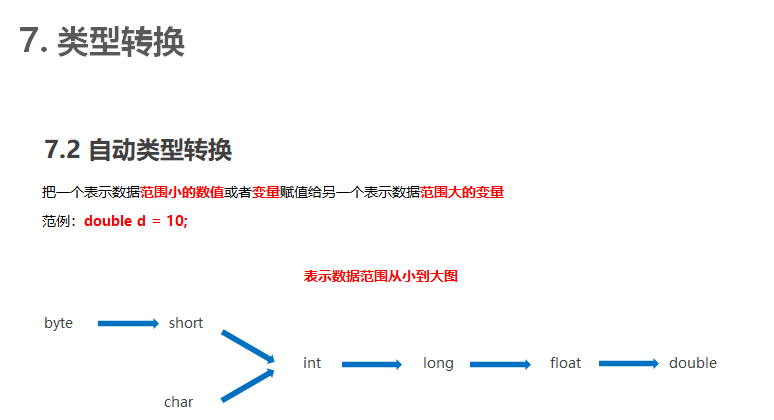

byte  short/cahr  int long float double


大给小 强制 

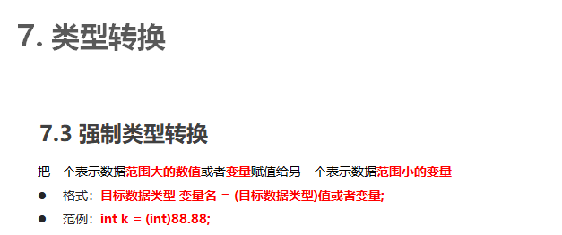

这里强调一下，范围就是把自动转换的那个图倒过来就是了。


在Java中，一些数据类型之间是可以相互转换的。分为两种情况：自动类型转换和强制类型转换。

自动类型转换：

​	把一个表示数据范围小的数值或者变量赋值给另一个表示数据范围大的变量。这种转换方式是自动的，直接书写即可。例如：

```java
double num = 10; // 将int类型的10直接赋值给double类型
System.out.println(num); // 输出10.0
```

强制类型转换：

​	把一个表示数据范围大的数值或者变量赋值给另一个表示数据范围小的变量。

​	强制类型转换格式：目标数据类型 变量名 = (目标数据类型)值或者变量;

​	例如：

```java
double num1 = 5.5;
int num2 = (int) num1; // 将double类型的num1强制转换为int类型
System.out.println(num2); // 输出5（小数位直接舍弃）
```


说明：

1. char类型的数据转换为int类型是按照码表中对应的int值进行计算的。比如在ASCII码表中，'a'对应97。

```java
int a = 'a';
System.out.println(a); // 将输出97
```

2. 整数默认是int类型，byte、short和char类型数据参与运算均会自动转换为int类型。

```java
byte b1 = 10;
byte b2 = 20;
byte b3 = b1 + b2; 
// 第三行代码会报错，b1和b2会自动转换为int类型，计算结果为int，int赋值给byte需要强制类型转换。
// 修改为:
int num = b1 + b2;
// 或者：
byte b3 = (byte) (b1 + b2);
```

1. boolean类型不能与其他基本数据类型相互转换。

