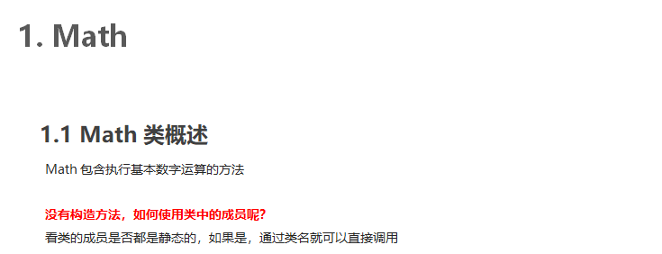

## 1.API

### 1.1API概述【理解】

- 什么是API

  ​	API (Application Programming Interface) ：应用程序编程接口

- java中的API

  ​	指的就是 JDK 中提供的各种功能的 Java类，这些类将底层的实现封装了起来，我们不需要关心这些类是如何实现的，只需要学习这些类如何使用即可，我们可以通过帮助文档来学习这些API如何使用。

API 应用程序接口 


接下来，我们来学习常用API这个模块，为了方便我们开发程序，Java给我们提供了很多的类供我们使用，

我们只需要掌握这些类的使用规则，就能够提高我们的开发效率。

我们在前面学习过的String，StringBuilder，Scanner，Random都属于常用API的知识，

在常用API这个模块中我们要继续学习Java提供给我们的一些类，首先我们来学习Math类





关于Math类的学习，我们先到帮助文档中查看，然后到代码中演示，最后回到资料进行总结


### 1.2如何使用API帮助文档【应用】

- 打开帮助文档


- 找到索引选项卡中的输入框


- 在输入框中输入Random


- 看类在哪个包下


- 看类的描述


- 看构造方法


- 看成员方法


## 2.String类

### 2.1String类概述【理解】

​	String 类代表字符串，Java 程序中的所有字符串文字（例如“abc”）都被实现为此类的实例。也就是说，Java 程序中所有的双引号字符串，都是 String 类的对象。String 类在 java.lang 包下，所以使用的时候不需要导包！

### 2.2String类的特点【理解】

- 字符串不可变，它们的值在创建后不能被更改
- 虽然 String 的值是不可变的，但是它们可以被共享
- 字符串效果上相当于字符数组( char[] )，但是底层原理是字节数组( byte[] )

### 2.3String类的构造方法【记忆】

- 常用的构造方法

  | 方法名                      | 说明                                      |
  | --------------------------- | ----------------------------------------- |
  | public   String()           | 创建一个空白字符串对象，不含有任何内容    |
  | public   String(char[] chs) | 根据字符数组的内容，来创建字符串对象      |
  | public   String(byte[] bys) | 根据字节数组的内容，来创建字符串对象      |
  | String s =   “abc”;         | 直接赋值的方式创建字符串对象，内容就是abc |

- 示例代码

  ```java
  public class StringDemo01 {
      public static void main(String[] args) {
          //public String()：创建一个空白字符串对象，不含有任何内容
          String s1 = new String();
          System.out.println("s1:" + s1);
  
          //public String(char[] chs)：根据字符数组的内容，来创建字符串对象
          char[] chs = {'a', 'b', 'c'};
          String s2 = new String(chs);
          System.out.println("s2:" + s2);
  
          //public String(byte[] bys)：根据字节数组的内容，来创建字符串对象
          byte[] bys = {97, 98, 99};
          String s3 = new String(bys);
          System.out.println("s3:" + s3);
  
          //String s = “abc”;	直接赋值的方式创建字符串对象，内容就是abc
          String s4 = "abc";
          System.out.println("s4:" + s4);
      }
  }
  ```

### 2.4创建字符串对象两种方式的区别【理解】

- 通过构造方法创建

  ​	通过 new 创建的字符串对象，每一次 new 都会申请一个内存空间，虽然内容相同，但是地址值不同

- 直接赋值方式创建

  ​	以“”方式给出的字符串，只要字符序列相同(顺序和大小写)，无论在程序代码中出现几次，JVM 都只会建立一个 String 对象，并在字符串池中维护

### 2.5字符串的比较【理解】

#### 2.5.1==号的作用

- 比较基本数据类型：比较的是具体的值
- 比较引用数据类型：比较的是对象地址值

#### 2.5.2equals方法的作用

- 方法介绍

  ```java
  public boolean equals(String s)     比较两个字符串内容是否相同、区分大小写
  ```

- 示例代码

  ```java
  public class StringDemo02 {
      public static void main(String[] args) {
          //构造方法的方式得到对象
          char[] chs = {'a', 'b', 'c'};
          String s1 = new String(chs);
          String s2 = new String(chs);
  
          //直接赋值的方式得到对象
          String s3 = "abc";
          String s4 = "abc";
  
          //比较字符串对象地址是否相同
          System.out.println(s1 == s2);
          System.out.println(s1 == s3);
          System.out.println(s3 == s4);
          System.out.println("--------");
  
          //比较字符串内容是否相同
          System.out.println(s1.equals(s2));
          System.out.println(s1.equals(s3));
          System.out.println(s3.equals(s4));
      }
  }
  ```

### 2.6用户登录案例【应用】

#### 2.6.1案例需求

​	已知用户名和密码，请用程序实现模拟用户登录。总共给三次机会，登录之后，给出相应的提示

#### 2.6.2代码实现

```java
/*
    思路：
        1:已知用户名和密码，定义两个字符串表示即可
        2:键盘录入要登录的用户名和密码，用 Scanner 实现
        3:拿键盘录入的用户名、密码和已知的用户名、密码进行比较，给出相应的提示。字符串的内容比较，用equals() 方法实现
        4:用循环实现多次机会，这里的次数明确，采用for循环实现，并在登录成功的时候，使用break结束循环
 */
public class StringTest01 {
    public static void main(String[] args) {
        //已知用户名和密码，定义两个字符串表示即可
        String username = "itheima";
        String password = "czbk";

        //用循环实现多次机会，这里的次数明确，采用for循环实现，并在登录成功的时候，使用break结束循环
        for(int i=0; i<3; i++) {

            //键盘录入要登录的用户名和密码，用 Scanner 实现
            Scanner sc = new Scanner(System.in);

            System.out.println("请输入用户名：");
            String name = sc.nextLine();

            System.out.println("请输入密码：");
            String pwd = sc.nextLine();

            //拿键盘录入的用户名、密码和已知的用户名、密码进行比较，给出相应的提示。字符串的内容比较，用equals() 方法实现
            if (name.equals(username) && pwd.equals(password)) {
                System.out.println("登录成功");
                break;
            } else {
                if(2-i == 0) {
                    System.out.println("你的账户被锁定，请与管理员联系");
                } else {
                    //2,1,0
                    //i,0,1,2
                    System.out.println("登录失败，你还有" + (2 - i) + "次机会");
                }
            }
        }
    }
}
```

### 2.7遍历字符串案例【应用】

#### 2.7.1案例需求

​	键盘录入一个字符串，使用程序实现在控制台遍历该字符串

#### 2.7.2代码实现

```java
/*
    思路：
        1:键盘录入一个字符串，用 Scanner 实现
        2:遍历字符串，首先要能够获取到字符串中的每一个字符
            public char charAt(int index)：返回指定索引处的char值，字符串的索引也是从0开始的
        3:遍历字符串，其次要能够获取到字符串的长度
            public int length()：返回此字符串的长度
            数组的长度：数组名.length
            字符串的长度：字符串对象.length()
        4:遍历字符串的通用格式
 */
public class StringTest02 {
    public static void main(String[] args) {
        //键盘录入一个字符串，用 Scanner 实现
        Scanner sc = new Scanner(System.in);

        System.out.println("请输入一个字符串：");
        String line = sc.nextLine();

        for(int i=0; i<line.length(); i++) {
            System.out.println(line.charAt(i));
        }
    }
}
```

### 2.8统计字符次数案例【应用】

#### 2.8.1案例需求

​	键盘录入一个字符串，统计该字符串中大写字母字符，小写字母字符，数字字符出现的次数(不考虑其他字符)

#### 2.8.2代码实现

```java
/*
  思路：
        1:键盘录入一个字符串，用 Scanner 实现
        2:要统计三种类型的字符个数，需定义三个统计变量，初始值都为0
        3:遍历字符串，得到每一个字符
        4:判断该字符属于哪种类型，然后对应类型的统计变量+1
            假如ch是一个字符，我要判断它属于大写字母，小写字母，还是数字，直接判断该字符是否在对应的范围即可
            大写字母：ch>='A' && ch<='Z'
            小写字母： ch>='a' && ch<='z'
            数字： ch>='0' && ch<='9'
        5:输出三种类型的字符个数
 */
public class StringTest03 {
    public static void main(String[] args) {
        //键盘录入一个字符串，用 Scanner 实现
        Scanner sc = new Scanner(System.in);

        System.out.println("请输入一个字符串：");
        String line = sc.nextLine();

        //要统计三种类型的字符个数，需定义三个统计变量，初始值都为0
        int bigCount = 0;
        int smallCount = 0;
        int numberCount = 0;

        //遍历字符串，得到每一个字符
        for(int i=0; i<line.length(); i++) {
            char ch = line.charAt(i);

            //判断该字符属于哪种类型，然后对应类型的统计变量+1
            if(ch>='A' && ch<='Z') {
                bigCount++;
            } else if(ch>='a' && ch<='z') {
                smallCount++;
            } else if(ch>='0' && ch<='9') {
                numberCount++;
            }
        }

        //输出三种类型的字符个数
        System.out.println("大写字母：" + bigCount + "个");
        System.out.println("小写字母：" + smallCount + "个");
        System.out.println("数字：" + numberCount + "个");
    }
}
```

### 2.9字符串拼接案例【应用】

#### 2.9.1案例需求

​	定义一个方法，把 int 数组中的数据按照指定的格式拼接成一个字符串返回，调用该方法，

​	并在控制台输出结果。例如，数组为 int[] arr = {1,2,3}; ，执行方法后的输出结果为：[1, 2, 3]

#### 2.9.2代码实现

```java
/*
    思路：
        1:定义一个 int 类型的数组，用静态初始化完成数组元素的初始化
        2:定义一个方法，用于把 int 数组中的数据按照指定格式拼接成一个字符串返回。
          返回值类型 String，参数列表 int[] arr
        3:在方法中遍历数组，按照要求进行拼接
        4:调用方法，用一个变量接收结果
        5:输出结果
 */
public class StringTest04 {
    public static void main(String[] args) {
        //定义一个 int 类型的数组，用静态初始化完成数组元素的初始化
        int[] arr = {1, 2, 3};

        //调用方法，用一个变量接收结果
        String s = arrayToString(arr);

        //输出结果
        System.out.println("s:" + s);
    }

    //定义一个方法，用于把 int 数组中的数据按照指定格式拼接成一个字符串返回
    /*
        两个明确：
            返回值类型：String
            参数：int[] arr
     */
    public static String arrayToString(int[] arr) {
        //在方法中遍历数组，按照要求进行拼接
        String s = "";

        s += "[";

        for(int i=0; i<arr.length; i++) {
            if(i==arr.length-1) {
                s += arr[i];
            } else {
                s += arr[i];
                s += ", ";
            }
        }

        s += "]";

        return s;
    }
}
```

### 2.10字符串反转案例【应用】

#### 2.10.1案例需求

​	定义一个方法，实现字符串反转。键盘录入一个字符串，调用该方法后，在控制台输出结果

​	例如，键盘录入 abc，输出结果 cba

#### 2.10.2代码实现

```java
/*
    思路：
        1:键盘录入一个字符串，用 Scanner 实现
        2:定义一个方法，实现字符串反转。返回值类型 String，参数 String s
        3:在方法中把字符串倒着遍历，然后把每一个得到的字符拼接成一个字符串并返回
        4:调用方法，用一个变量接收结果
        5:输出结果
 */
public class StringTest05 {
    public static void main(String[] args) {
        //键盘录入一个字符串，用 Scanner 实现
        Scanner sc = new Scanner(System.in);

        System.out.println("请输入一个字符串：");
        String line = sc.nextLine();

        //调用方法，用一个变量接收结果
        String s = reverse(line);

        //输出结果
        System.out.println("s:" + s);
    }

    //定义一个方法，实现字符串反转
    /*
        两个明确：
            返回值类型：String
            参数：String s
     */
    public static String reverse(String s) {
        //在方法中把字符串倒着遍历，然后把每一个得到的字符拼接成一个字符串并返回
        String ss = "";

        for(int i=s.length()-1; i>=0; i--) {
            ss += s.charAt(i);
        }

        return ss;
    }
}
```

### 2.11帮助文档查看String常用方法【记忆】

| 方法名                                   | 说明                                           |
| ---------------------------------------- | ---------------------------------------------- |
| public boolean   equals(Object anObject) | 比较字符串的内容，严格区分大小写(用户名和密码) |
| public char charAt(int   index)          | 返回指定索引处的 char 值                       |
| public int   length()                    | 返回此字符串的长度                             |

## 3.StringBuilder类

### 3.1StringBuilder类概述【理解】

​	StringBuilder 是一个可变的字符串类，我们可以把它看成是一个容器，这里的可变指的是 StringBuilder 对象中的内容是可变的

### 3.2StringBuilder类和String类的区别【理解】

- String类：内容是不可变的
- StringBuilder类：内容是可变的

### 3.3StringBuilder类的构造方法【记忆】

- 常用的构造方法

  | 方法名                             | 说明                                       |
  | ---------------------------------- | ------------------------------------------ |
  | public StringBuilder()             | 创建一个空白可变字符串对象，不含有任何内容 |
  | public StringBuilder(String   str) | 根据字符串的内容，来创建可变字符串对象     |

- 示例代码

```java
public class StringBuilderDemo01 {
    public static void main(String[] args) {
        //public StringBuilder()：创建一个空白可变字符串对象，不含有任何内容
        StringBuilder sb = new StringBuilder();
        System.out.println("sb:" + sb);
        System.out.println("sb.length():" + sb.length());

        //public StringBuilder(String str)：根据字符串的内容，来创建可变字符串对象
        StringBuilder sb2 = new StringBuilder("hello");
        System.out.println("sb2:" + sb2);
        System.out.println("sb2.length():" + sb2.length());
    }
}
```

### 3.4StringBuilder类添加和反转方法【记忆】

- 添加和反转方法

  | 方法名                                  | 说明                     |
  | --------------------------------------- | ------------------------ |
  | public StringBuilder   append(任意类型) | 添加数据，并返回对象本身 |
  | public StringBuilder   reverse()        | 返回相反的字符序列       |

- 示例代码

```java
public class StringBuilderDemo01 {
    public static void main(String[] args) {
        //创建对象
        StringBuilder sb = new StringBuilder();

        //public StringBuilder append(任意类型)：添加数据，并返回对象本身
//        StringBuilder sb2 = sb.append("hello");
//
//        System.out.println("sb:" + sb);
//        System.out.println("sb2:" + sb2);
//        System.out.println(sb == sb2);

//        sb.append("hello");
//        sb.append("world");
//        sb.append("java");
//        sb.append(100);

        //链式编程
        sb.append("hello").append("world").append("java").append(100);

        System.out.println("sb:" + sb);

        //public StringBuilder reverse()：返回相反的字符序列
        sb.reverse();
        System.out.println("sb:" + sb);
    }
}
```

### 3.5StringBuilder和String相互转换【应用】

- StringBuilder转换为String

  ​        public String toString()：通过 toString() 就可以实现把 StringBuilder 转换为 String

- String转换为StringBuilder

  ​        public StringBuilder(String s)：通过构造方法就可以实现把 String 转换为 StringBuilder

- 示例代码

```java
public class StringBuilderDemo02 {
    public static void main(String[] args) {
        /*
        //StringBuilder 转换为 String
        StringBuilder sb = new StringBuilder();
        sb.append("hello");

        //String s = sb; //这个是错误的做法

        //public String toString()：通过 toString() 就可以实现把 StringBuilder 转换为 String
        String s = sb.toString();
        System.out.println(s);
        */

        //String 转换为 StringBuilder
        String s = "hello";

        //StringBuilder sb = s; //这个是错误的做法

        //public StringBuilder(String s)：通过构造方法就可以实现把 String 转换为 StringBuilder
        StringBuilder sb = new StringBuilder(s);

        System.out.println(sb);
    }
}
```

### 3.6字符串拼接升级版案例【应用】

#### 3.6.1案例需求

​	定义一个方法，把 int 数组中的数据按照指定的格式拼接成一个字符串返回，调用该方法，

​	并在控制台输出结果。例如，数组为int[] arr = {1,2,3}; ，执行方法后的输出结果为：[1, 2, 3]

#### 3.6.2代码实现

```java
/*
    思路：
        1:定义一个 int 类型的数组，用静态初始化完成数组元素的初始化
        2:定义一个方法，用于把 int 数组中的数据按照指定格式拼接成一个字符串返回。
          返回值类型 String，参数列表 int[] arr
        3:在方法中用 StringBuilder 按照要求进行拼接，并把结果转成 String 返回
        4:调用方法，用一个变量接收结果
        5:输出结果
 */
public class StringBuilderTest01 {
    public static void main(String[] args) {
        //定义一个 int 类型的数组，用静态初始化完成数组元素的初始化
        int[] arr = {1, 2, 3};

        //调用方法，用一个变量接收结果
        String s = arrayToString(arr);

        //输出结果
        System.out.println("s:" + s);

    }

    //定义一个方法，用于把 int 数组中的数据按照指定格式拼接成一个字符串返回
    /*
        两个明确：
            返回值类型：String
            参数：int[] arr
     */
    public static String arrayToString(int[] arr) {
        //在方法中用 StringBuilder 按照要求进行拼接，并把结果转成 String 返回
        StringBuilder sb = new StringBuilder();

        sb.append("[");

        for(int i=0; i<arr.length; i++) {
            if(i == arr.length-1) {
                sb.append(arr[i]);
            } else {
                sb.append(arr[i]).append(", ");
            }
        }

        sb.append("]");

        String s = sb.toString();

        return  s;
    }
}
```

### 3.7字符串反转升级版案例【应用】

#### 3.7.1案例需求

​	定义一个方法，实现字符串反转。键盘录入一个字符串，调用该方法后，在控制台输出结果

​	例如，键盘录入abc，输出结果 cba

#### 3.7.2代码实现

```java
/*
    思路：
        1:键盘录入一个字符串，用 Scanner 实现
        2:定义一个方法，实现字符串反转。返回值类型 String，参数 String s
        3:在方法中用StringBuilder实现字符串的反转，并把结果转成String返回
        4:调用方法，用一个变量接收结果
        5:输出结果
 */
public class StringBuilderTest02 {
    public static void main(String[] args) {
        //键盘录入一个字符串，用 Scanner 实现
        Scanner sc = new Scanner(System.in);

        System.out.println("请输入一个字符串：");
        String line = sc.nextLine();

        //调用方法，用一个变量接收结果
        String s = myReverse(line);

        //输出结果
        System.out.println("s:" + s);
    }

    //定义一个方法，实现字符串反转。返回值类型 String，参数 String s
    /*
        两个明确：
            返回值类型：String
            参数：String s
     */
    public static String myReverse(String s) {
        //在方法中用StringBuilder实现字符串的反转，并把结果转成String返回
        //String --- StringBuilder --- reverse() --- String
//        StringBuilder sb = new StringBuilder(s);
//        sb.reverse();
//        String ss = sb.toString();
//        return ss;

       return new StringBuilder(s).reverse().toString();
    }
}
```

### 3.8帮助文档查看StringBuilder常用方法【记忆】

| 方法名                                   | 说明                                                |
| ---------------------------------------- | --------------------------------------------------- |
| public   StringBuilder append (任意类型) | 添加数据，并返回对象本身                            |
| public   StringBuilder reverse()         | 返回相反的字符序列                                  |
| public   int   length()                  | 返回长度，实际存储值                                |
| public   String toString()               | 通过toString()就可以实现把StringBuilder转换为String |