# Java集合


[TOC]


## 1.Collection集合

这个单词都错了 

Collection 集合  

集合类的特点  提供一种存储空间可变的存储模型

存储的数据容量可以随时发生改变

集合知识回顾 


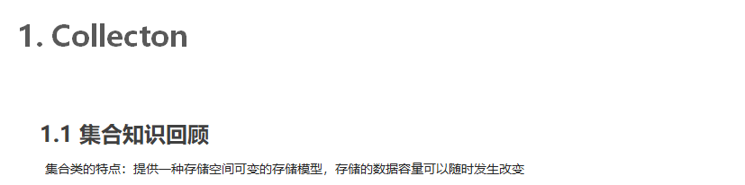

接下来的3天，我们学习集合进阶部分，首先我们来学习Collection集合。在讲解Collection之前，我们先对集合知识做一个简单的回顾。

先对集合知识做一个简单的回顾


在集合基础知识部分

集合类的特点 


在集合基础知识部分我们已经说过了集合类的特点，当时我们还说过，集合类有很多，那么，现在我们就对Java给我们提供的这多个集合做一个描述


集合类的特点：提供一种存储空间可变的存储模型，存储的数据容量可以随时发生改变

集合类有很多 


数组  、

集合  提供一种存储空间可变的存储模型 

### 1.1集合体系结构【记忆】

下面我们来说说集合的体系结构，从集合开始讲解，依次往下讲解

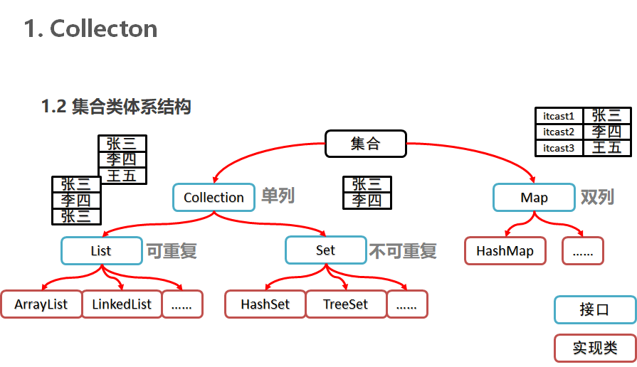

集合类体系结构

List 

Set

下面我们来说说集合的体系结构，从集合开始讲解，依次往下讲解


- 集合类的特点

  ​	提供一种存储空间可变的存储模型，存储的数据容量可以随时发生改变

- 集合类的体系图

  ​	

### 1.2Collection集合概述和基本使用【应用】

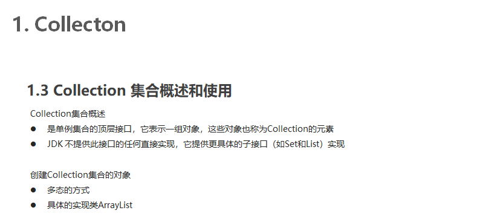

关于Collection集合，我们先到帮助文档中去查看一下。

如果我们要使用Collection集合的方法，就必须创建对象，而Collection是接口，所以，我们要使用多态的方式创建对象，这里选择我们学习过的ArrayList集合作为实现类

接下来，我们到程序中去演示一下，演示完创建，然后输出集合对象，发现没有数据，到帮助文档中找到add方法，然后使用即可。最后再次输出集合对象，好了关于Collection的基本使用我们就先说到这里

- Collection集合概述

  - 是单例集合的顶层接口，它表示一组对象，这些对象也称为Collection的元素

  - JDK 不提供此接口的任何直接实现，它提供更具体的子接口（如Set和List）实现

- Collection集合基本使用

  ```java
  public class CollectionDemo01 {
      public static void main(String[] args) {
          //创建Collection集合的对象
          Collection<String> c = new ArrayList<String>();
  
          //添加元素：boolean add(E e)
          c.add("hello");
          c.add("world");
          c.add("java");
  
          //输出集合对象
          System.out.println(c);
      }
  }
  ```

### 1.3Collection集合的常用方法【应用】


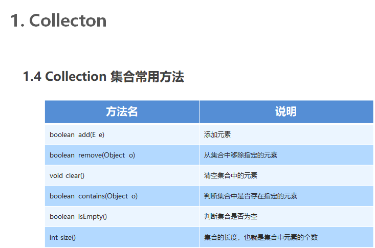

先到集合中使用，在回来总结


| 方法名                     | 说明                               |
| -------------------------- | ---------------------------------- |
| boolean add(E e)           | 添加元素                           |
| boolean remove(Object o)   | 从集合中移除指定的元素             |
| void   clear()             | 清空集合中的元素                   |
| boolean contains(Object o) | 判断集合中是否存在指定的元素       |
| boolean isEmpty()          | 判断集合是否为空                   |
| int   size()               | 集合的长度，也就是集合中元素的个数 |

### 1.4Collection集合的遍历【应用】

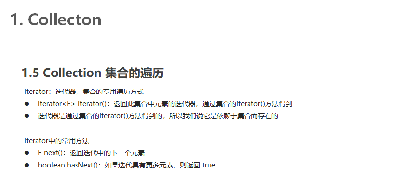

查看帮助文档，回到资料总结，然后程序中演示


- 迭代器的介绍
  - 迭代器，集合的专用遍历方式
  - Iterator<E> iterator()：返回此集合中元素的迭代器，通过集合的iterator()方法得到
  - 迭代器是通过集合的iterator()方法得到的，所以我们说它是依赖于集合而存在的
- Collection集合的遍历

```java
public class IteratorDemo {
    public static void main(String[] args) {
        //创建集合对象
        Collection<String> c = new ArrayList<>();

        //添加元素
        c.add("hello");
        c.add("world");
        c.add("java");
        c.add("javaee");

        //Iterator<E> iterator()：返回此集合中元素的迭代器，通过集合的iterator()方法得到
        Iterator<String> it = c.iterator();

        //用while循环改进元素的判断和获取
        while (it.hasNext()) {
            String s = it.next();
            System.out.println(s);
        }
    }
}
```

### 1.5集合使用步骤图解【理解】

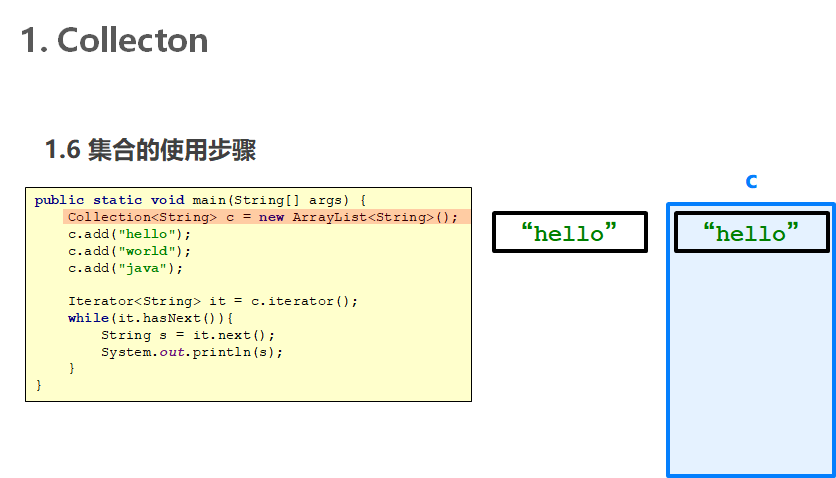


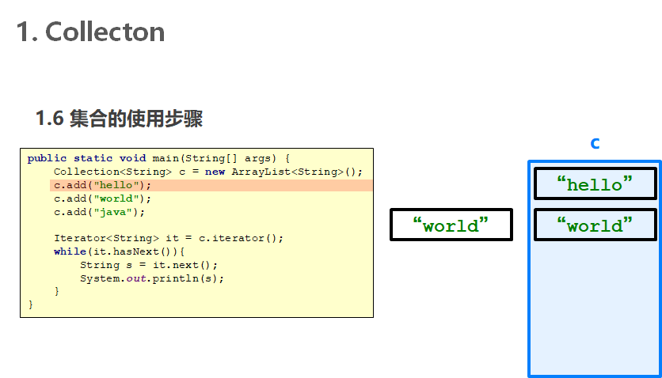


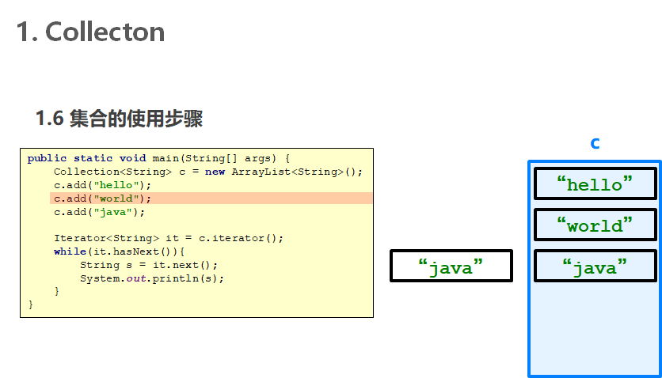


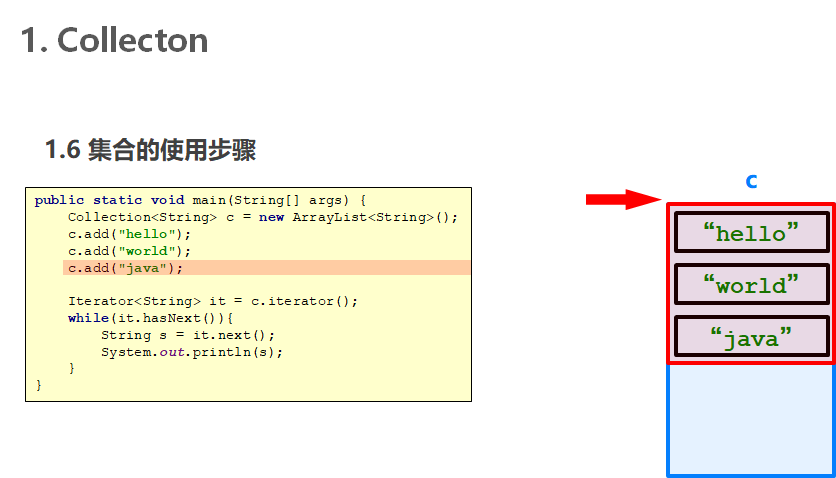


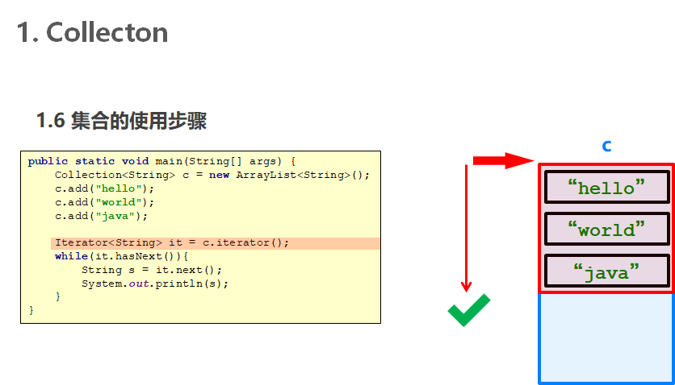


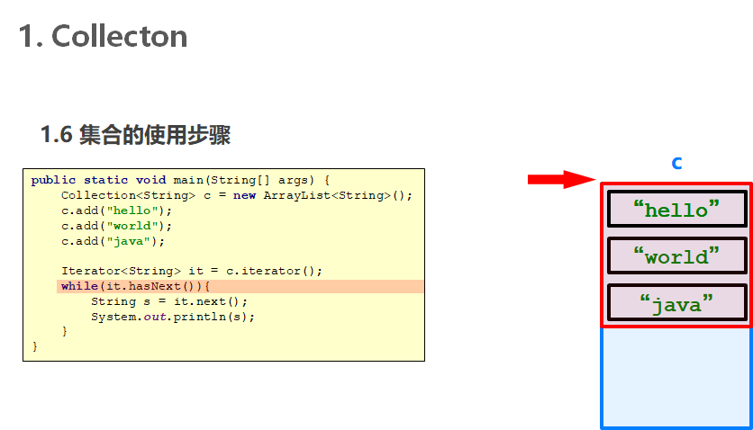


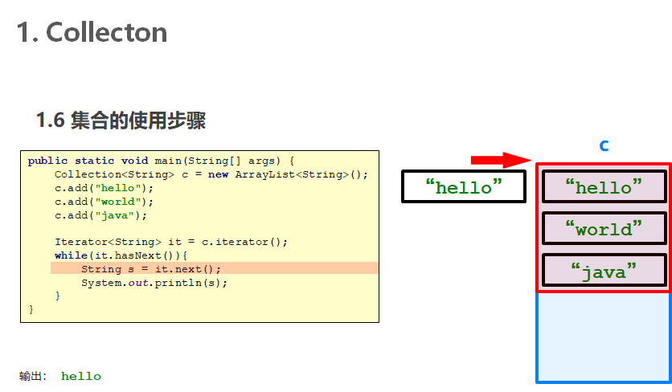


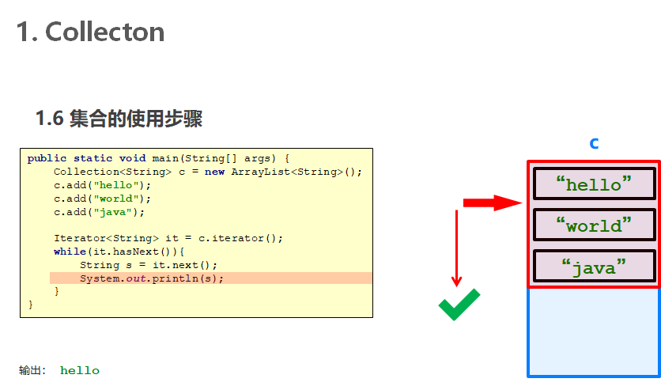


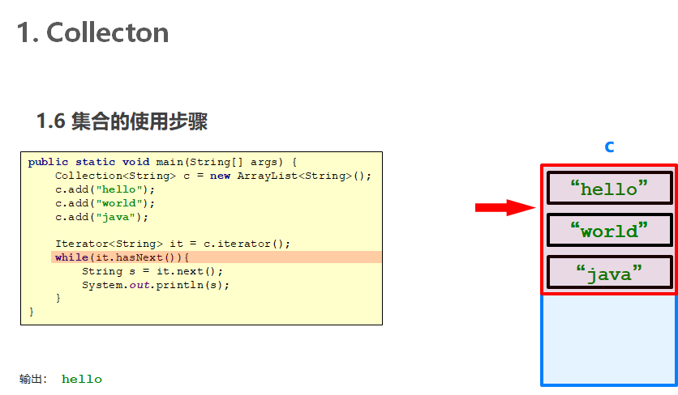


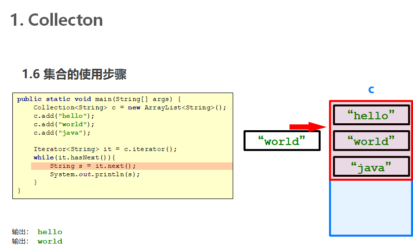


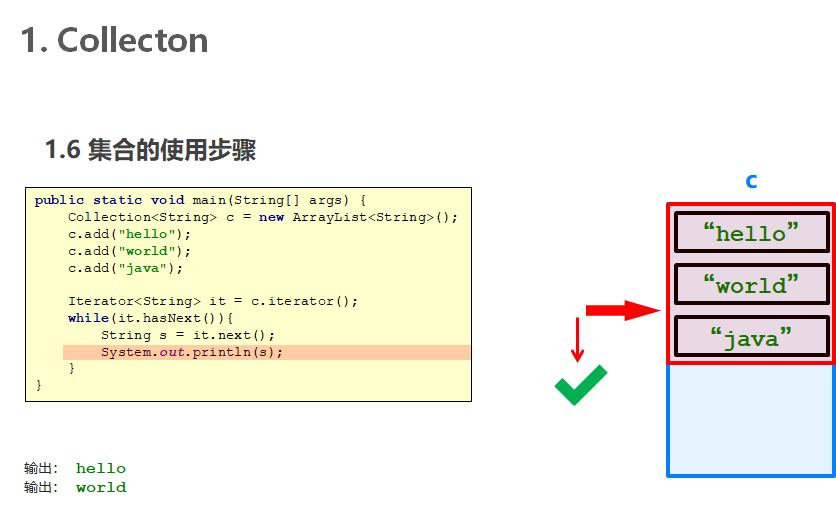


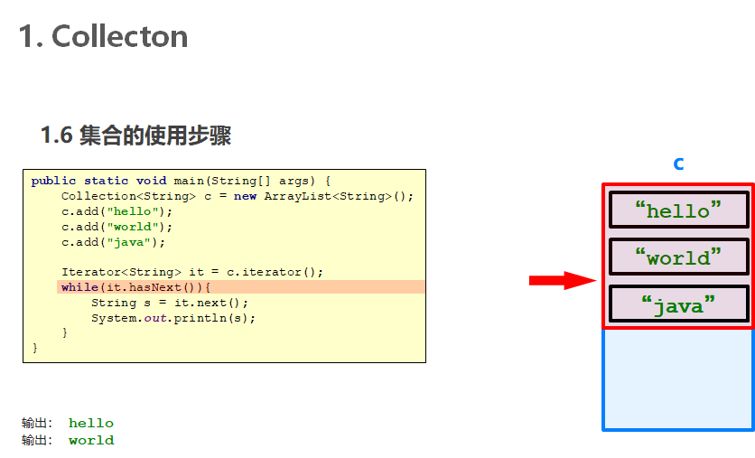


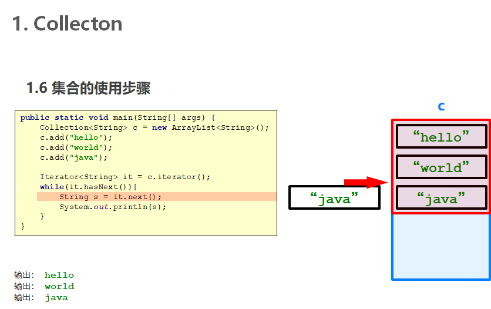


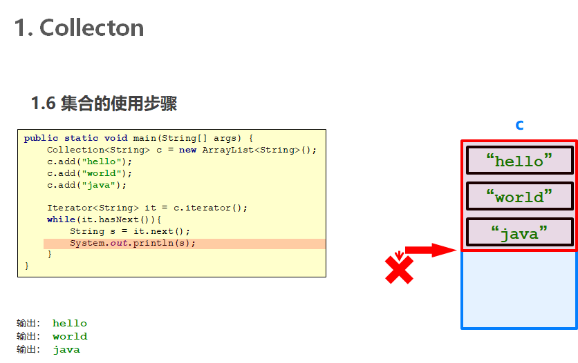


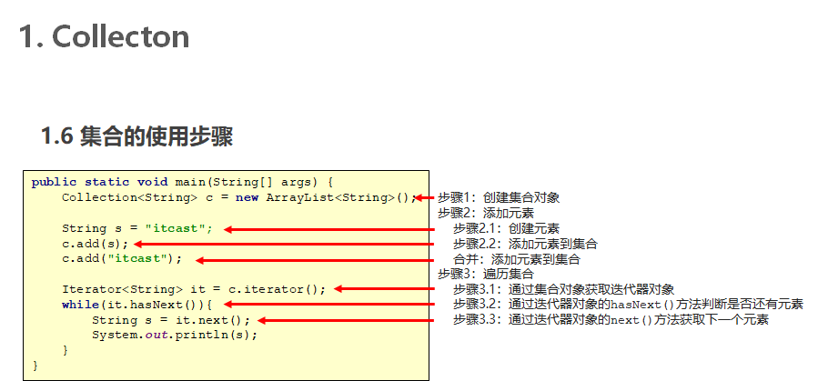


- 使用步骤


### 1.6集合的案例-Collection集合存储学生对象并遍历【应用】

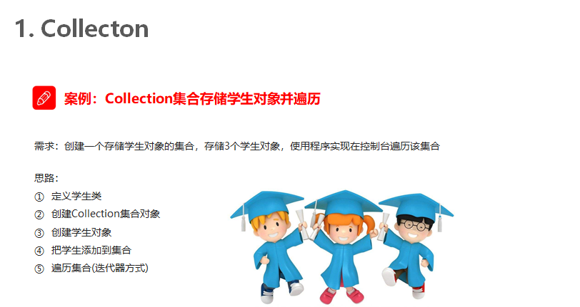


- 案例需求

  ​	创建一个存储学生对象的集合，存储3个学生对象，使用程序实现在控制台遍历该集合

- 代码实现

  - 学生类

  ```java
  public class Student {
      private String name;
      private int age;
  
      public Student() {
      }
  
      public Student(String name, int age) {
          this.name = name;
          this.age = age;
      }
  
      public String getName() {
          return name;
      }
  
      public void setName(String name) {
          this.name = name;
      }
  
      public int getAge() {
          return age;
      }
  
      public void setAge(int age) {
          this.age = age;
      }
  }
  ```

  - 测试类

  ```java
  public class CollectionDemo {
      public static void main(String[] args) {
          //创建Collection集合对象
          Collection<Student> c = new ArrayList<Student>();
  
          //创建学生对象
          Student s1 = new Student("林青霞", 30);
          Student s2 = new Student("张曼玉", 35);
          Student s3 = new Student("王祖贤", 33);
  
          //把学生添加到集合
          c.add(s1);
          c.add(s2);
          c.add(s3);
  
          //遍历集合(迭代器方式)
          Iterator<Student> it = c.iterator();
          while (it.hasNext()) {
              Student s = it.next();
              System.out.println(s.getName() + "," + s.getAge());
          }
      }
  }
  ```

## 2.List集合

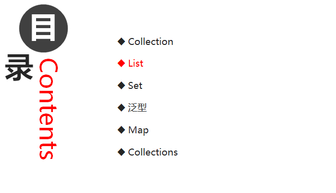


### 2.1List集合概述和特点【记忆】


查看帮助文档，回到资料总结，然后程序中演示

List：列表

Set：集合


- List集合概述
  - 有序集合(也称为序列)，用户可以精确控制列表中每个元素的插入位置。用户可以通过整数索引访问元素，并搜索列表中的元素
  - 与Set集合不同，列表通常允许重复的元素
- List集合特点
  - 有索引
  - 可以存储重复元素
  - 元素存取有序

### 2.2List集合的特有方法【应用】

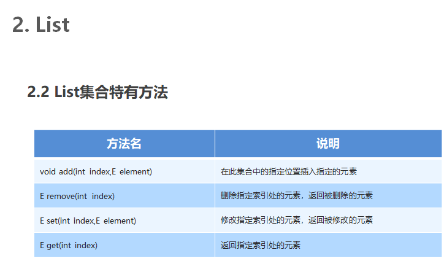


查看帮助文档，回到资料总结，然后程序中演示

List：列表

Set：集合


| 方法名                          | 描述                                   |
| ------------------------------- | -------------------------------------- |
| void add(int index,E   element) | 在此集合中的指定位置插入指定的元素     |
| E remove(int   index)           | 删除指定索引处的元素，返回被删除的元素 |
| E set(int index,E   element)    | 修改指定索引处的元素，返回被修改的元素 |
| E get(int   index)              | 返回指定索引处的元素                   |

### 2.3集合的案例-List集合存储学生对象并遍历【应用】


- 案例需求

  ​	创建一个存储学生对象的集合，存储3个学生对象，使用程序实现在控制台遍历该集合

- 代码实现

  - 学生类

    ```java
    public class Student {
        private String name;
        private int age;
    
        public Student() {
        }
    
        public Student(String name, int age) {
            this.name = name;
            this.age = age;
        }
    
        public String getName() {
            return name;
        }
    
        public void setName(String name) {
            this.name = name;
        }
    
        public int getAge() {
            return age;
        }
    
        public void setAge(int age) {
            this.age = age;
        }
    }
    ```

  - 测试类

    ```java
    public class ListDemo {
        public static void main(String[] args) {
            //创建List集合对象
            List<Student> list = new ArrayList<Student>();
    
            //创建学生对象
            Student s1 = new Student("林青霞", 30);
            Student s2 = new Student("张曼玉", 35);
            Student s3 = new Student("王祖贤", 33);
    
            //把学生添加到集合
            list.add(s1);
            list.add(s2);
            list.add(s3);
    
            //迭代器方式
            Iterator<Student> it = list.iterator();
            while (it.hasNext()) {
                Student s = it.next();
                System.out.println(s.getName() + "," + s.getAge());
            }
            
            System.out.println("--------");
    
            //for循环方式
            for(int i=0; i<list.size(); i++) {
                Student s = list.get(i);
                System.out.println(s.getName() + "," + s.getAge());
            }
    
        }
    }
    ```

### 2.4并发修改异常【应用】


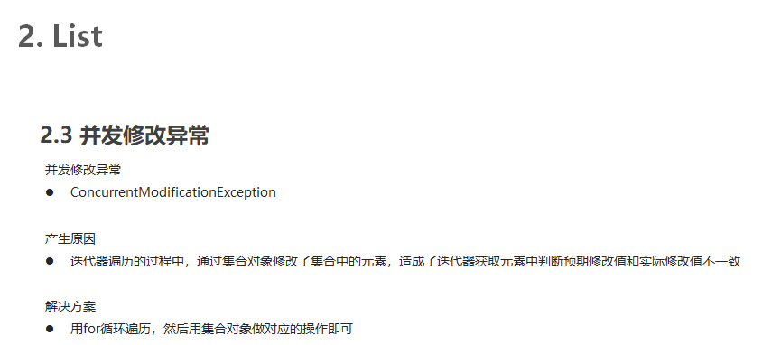


查看帮助文档，回到资料总结，然后程序中演示


- 出现的原因

  ​	迭代器遍历的过程中，通过集合对象修改了集合中的元素，造成了迭代器获取元素中判断预期修改值和实际修改值不一致，则会出现：ConcurrentModificationException

- 解决的方案

  ​	用for循环遍历，然后用集合对象做对应的操作即可

- 示例代码

  ```java
  public class ListDemo {
      public static void main(String[] args) {
          //创建集合对象
          List<String> list = new ArrayList<String>();
  
          //添加元素
          list.add("hello");
          list.add("world");
          list.add("java");
  
          //遍历集合，得到每一个元素，看有没有"world"这个元素，如果有，我就添加一个"javaee"元素，请写代码实现
  //        Iterator<String> it = list.iterator();
  //        while (it.hasNext()) {
  //            String s = it.next();
  //            if(s.equals("world")) {
  //                list.add("javaee");
  //            }
  //        }
  
          for(int i=0; i<list.size(); i++) {
              String s = list.get(i);
              if(s.equals("world")) {
                  list.add("javaee");
              }
          }
  
          //输出集合对象
          System.out.println(list);
      }
  }
  ```

### 2.5列表迭代器【应用】

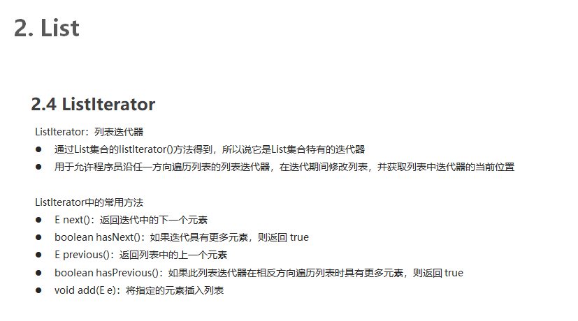


查看帮助文档，回到资料总结，然后程序中演示


- ListIterator介绍

  - 通过List集合的listIterator()方法得到，所以说它是List集合特有的迭代器
  - 用于允许程序员沿任一方向遍历的列表迭代器，在迭代期间修改列表，并获取列表中迭代器的当前位置

- 示例代码

  ```java
  public class ListIteratorDemo {
      public static void main(String[] args) {
          //创建集合对象
          List<String> list = new ArrayList<String>();
  
          //添加元素
          list.add("hello");
          list.add("world");
          list.add("java");
  
          //获取列表迭代器
          ListIterator<String> lit = list.listIterator();
          while (lit.hasNext()) {
              String s = lit.next();
              if(s.equals("world")) {
                  lit.add("javaee");
              }
          }
  
          System.out.println(list);
  
      }
  }
  ```

### 2.6增强for循环【应用】

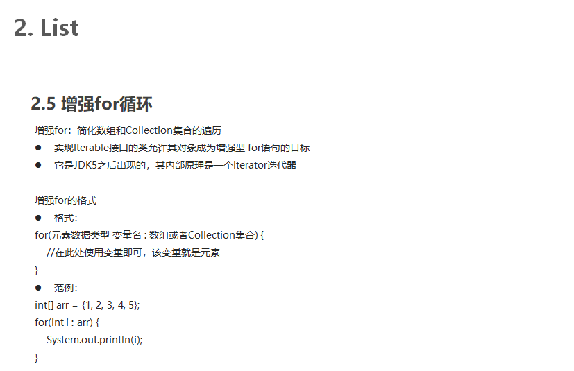


先说作用，然后到帮助文档查看Collection，继承自Iterable接口，接着看Iterable接口中的内容，得到两个结论。然后继续说格式和范例，最后到程序中去演示


- 定义格式

  ```java
  for(元素数据类型 变量名 : 数组/集合对象名) {
      循环体;
  }
  ```

- 示例代码

  ```java
  public class ForDemo {
      public static void main(String[] args) {
          int[] arr = {1,2,3,4,5};
          for(int i : arr) {
              System.out.println(i);
          }
          
          System.out.println("--------");
  
          String[] strArray = {"hello","world","java"};
          for(String s : strArray) {
              System.out.println(s);
          }
          
          System.out.println("--------");
  
          List<String> list = new ArrayList<String>();
          list.add("hello");
          list.add("world");
          list.add("java");
  
          for(String s : list) {
              System.out.println(s);
          }
          
          System.out.println("--------");
  
          //内部原理是一个Iterator迭代器
          /*
          for(String s : list) {
              if(s.equals("world")) {
                  list.add("javaee"); //ConcurrentModificationException
              }
          }
          */
      }
  }
  ```

### 2.7集合的案例-List集合存储学生对象三种方式遍历【应用】


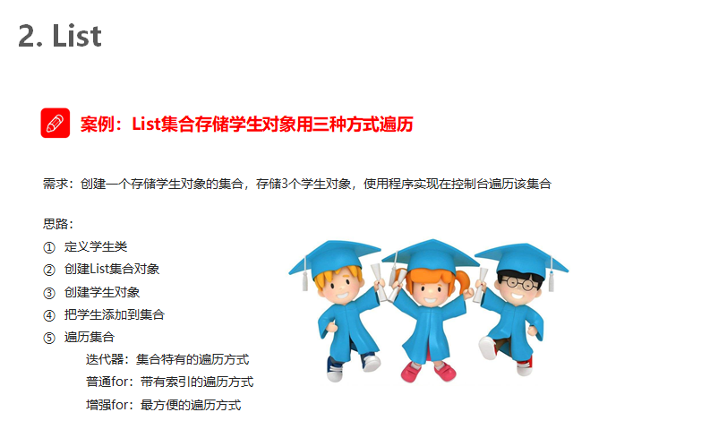


- 案例需求

  ​	创建一个存储学生对象的集合，存储3个学生对象，使用程序实现在控制台遍历该集合

- 代码实现

  - 学生类

    ```java
    public class Student {
        private String name;
        private int age;
    
        public Student() {
        }
    
        public Student(String name, int age) {
            this.name = name;
            this.age = age;
        }
    
        public String getName() {
            return name;
        }
    
        public void setName(String name) {
            this.name = name;
        }
    
        public int getAge() {
            return age;
        }
    
        public void setAge(int age) {
            this.age = age;
        }
    }
    ```

  - 测试类

    ```java
    public class ListDemo {
        public static void main(String[] args) {
            //创建List集合对象
            List<Student> list = new ArrayList<Student>();
    
            //创建学生对象
            Student s1 = new Student("林青霞", 30);
            Student s2 = new Student("张曼玉", 35);
            Student s3 = new Student("王祖贤", 33);
    
            //把学生添加到集合
            list.add(s1);
            list.add(s2);
            list.add(s3);
    
            //迭代器：集合特有的遍历方式
            Iterator<Student> it = list.iterator();
            while (it.hasNext()) {
                Student s = it.next();
                System.out.println(s.getName()+","+s.getAge());
            }
            System.out.println("--------");
    
            //普通for：带有索引的遍历方式
            for(int i=0; i<list.size(); i++) {
                Student s = list.get(i);
                System.out.println(s.getName()+","+s.getAge());
            }
            System.out.println("--------");
    
            //增强for：最方便的遍历方式
            for(Student s : list) {
                System.out.println(s.getName()+","+s.getAge());
            }
        }
    }
    ```

## 3.数据结构


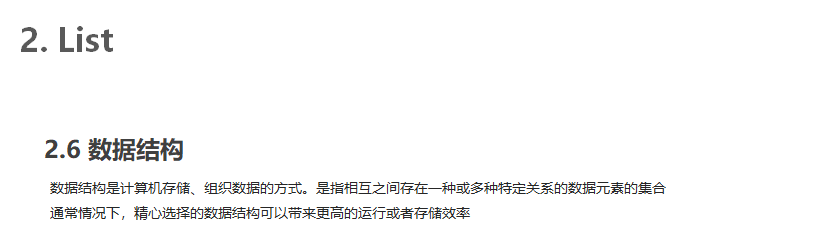


查看帮助文档，回到资料总结，然后程序中演示

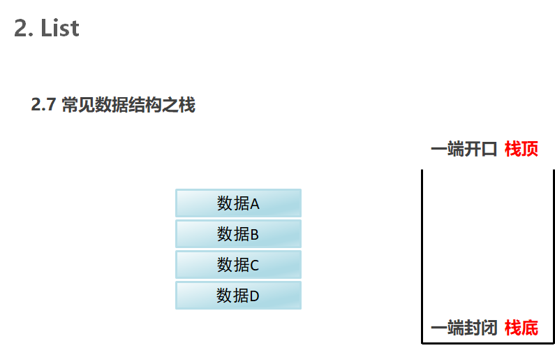


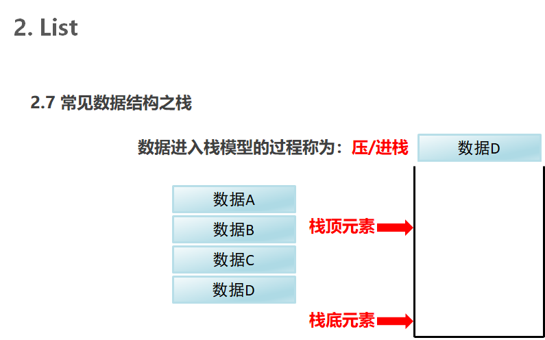


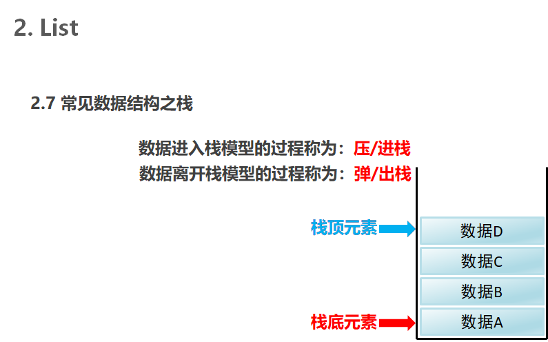


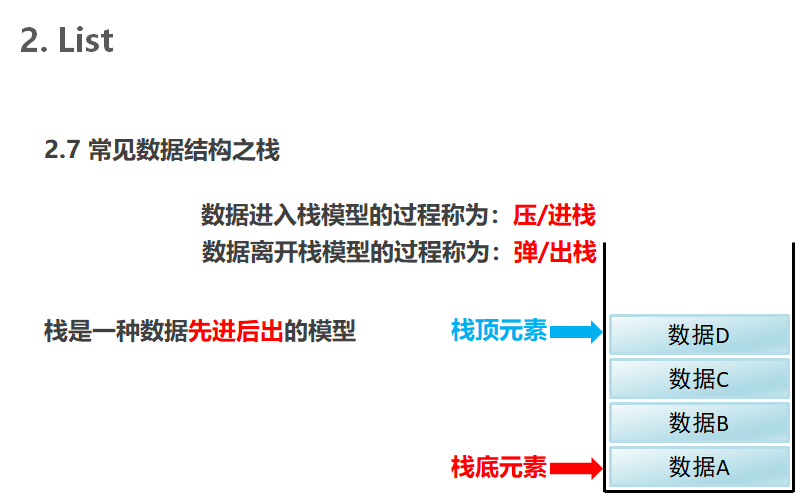


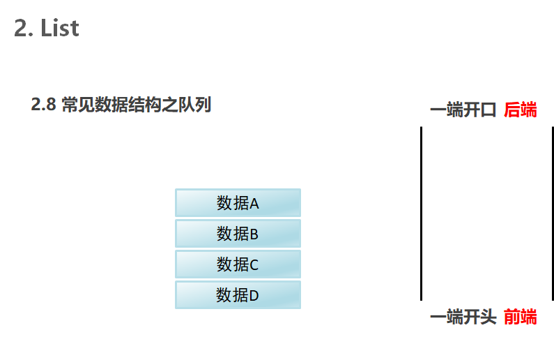


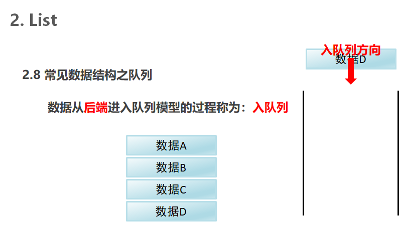


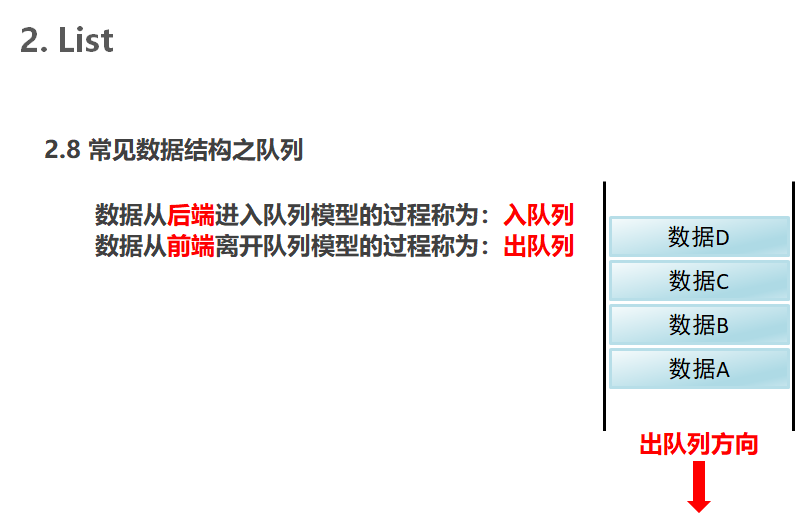


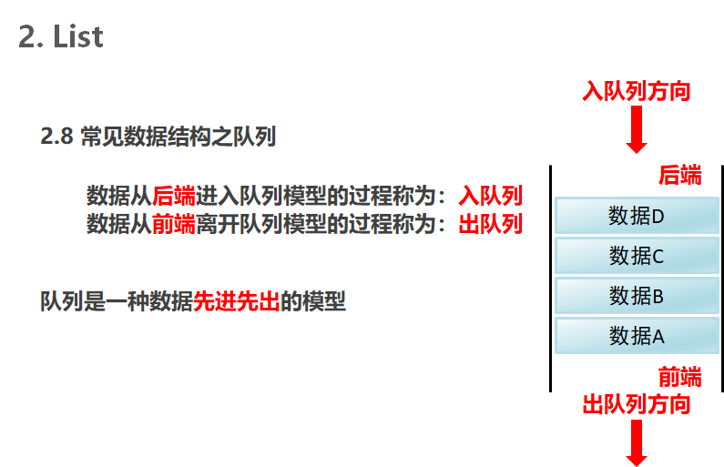


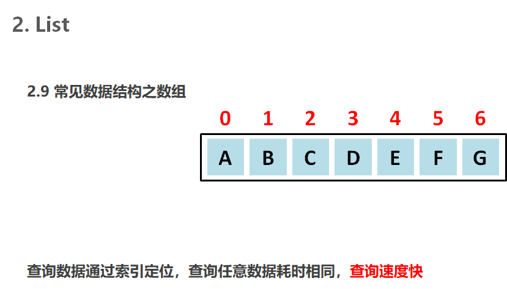


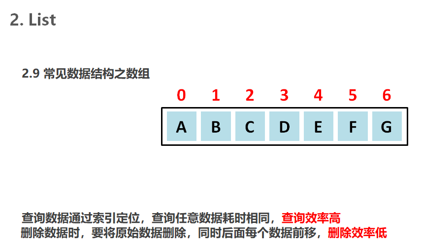


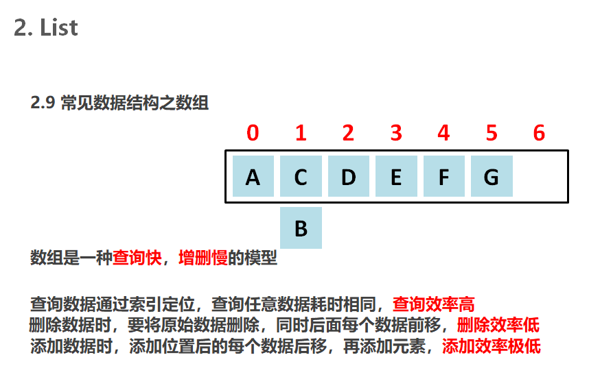


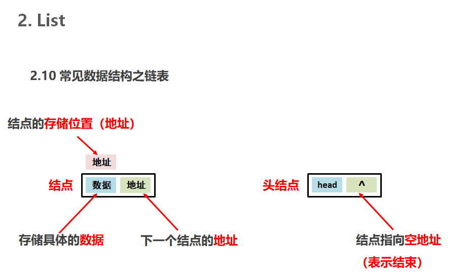


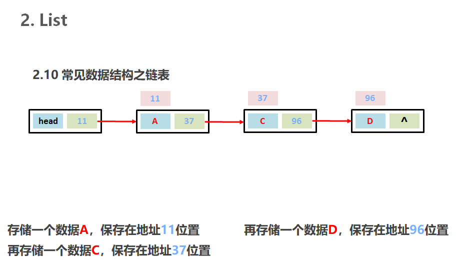


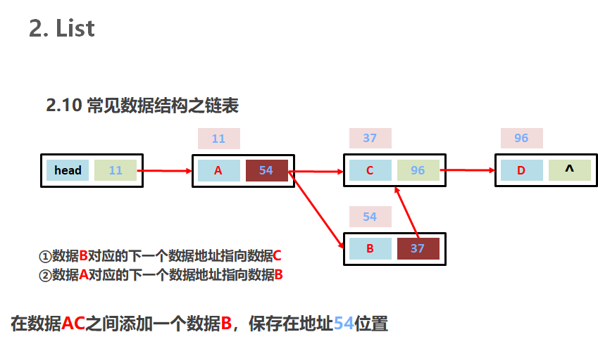


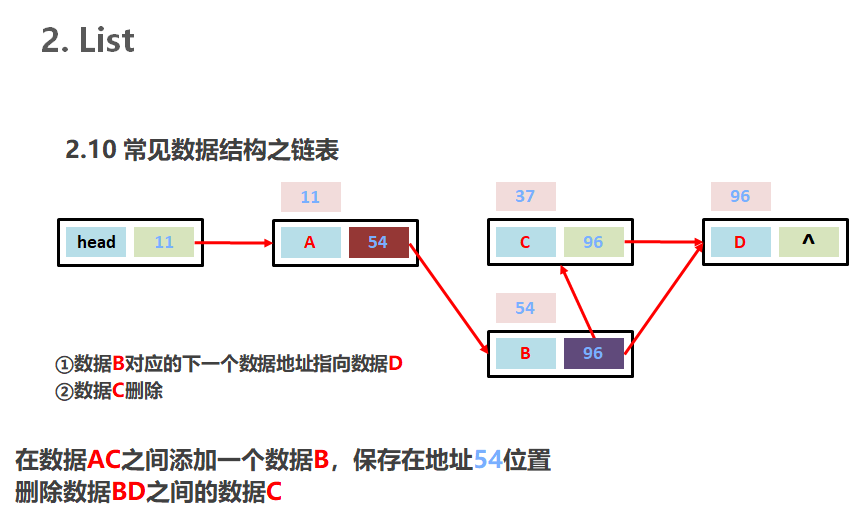


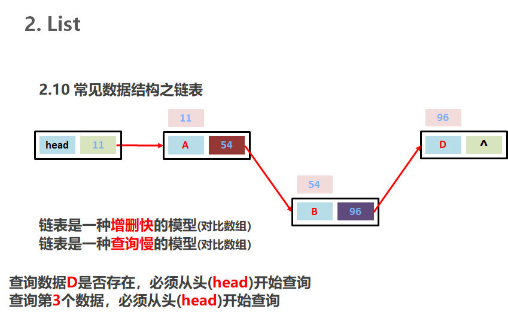


### 3.1数据结构之栈和队列【记忆】

- 栈结构

  ​	先进后出

- 队列结构

  ​	先进先出

### 3.2数据结构之数组和链表【记忆】

- 数组结构

  ​	查询快、增删慢

- 队列结构

  ​	查询慢、增删快

## 4.List集合的实现类

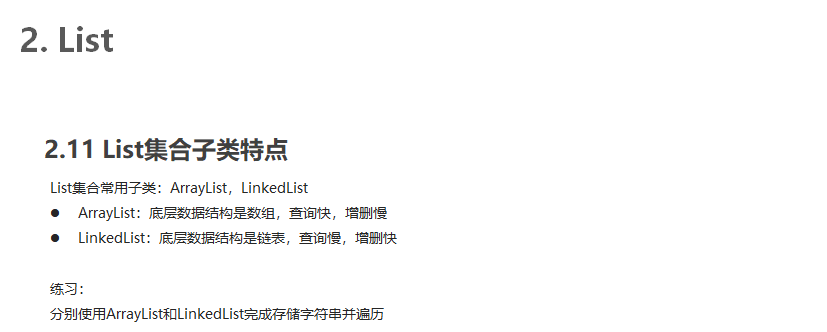


### 4.1List集合子类的特点【记忆】

- ArrayList集合

  ​	底层是数组结构实现，查询快、增删慢

- LinkedList集合

  ​	底层是链表结构实现，查询慢、增删快

### 4.2集合的案例-ArrayList集合存储学生对象三种方式遍历【应用】

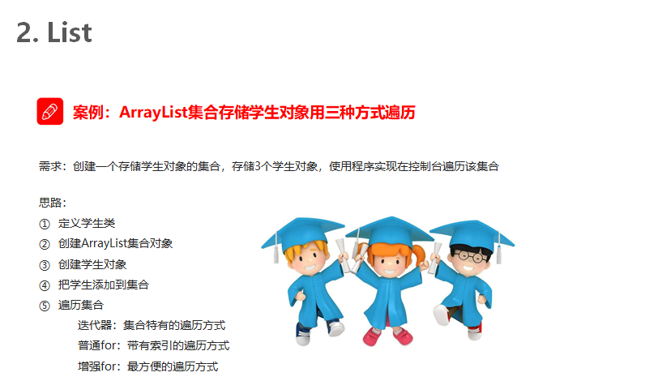


- 案例需求

  ​	创建一个存储学生对象的集合，存储3个学生对象，使用程序实现在控制台遍历该集合

- 代码实现

  - 学生类

    ```java
    public class Student {
        private String name;
        private int age;
    
        public Student() {
        }
    
        public Student(String name, int age) {
            this.name = name;
            this.age = age;
        }
    
        public String getName() {
            return name;
        }
    
        public void setName(String name) {
            this.name = name;
        }
    
        public int getAge() {
            return age;
        }
    
        public void setAge(int age) {
            this.age = age;
        }
    }
    ```

  - 测试类

    ```java
    public class ArrayListDemo {
        public static void main(String[] args) {
            //创建ArrayList集合对象
            ArrayList<Student> array = new ArrayList<Student>();
    
            //创建学生对象
            Student s1 = new Student("林青霞", 30);
            Student s2 = new Student("张曼玉", 35);
            Student s3 = new Student("王祖贤", 33);
    
            //把学生添加到集合
            array.add(s1);
            array.add(s2);
            array.add(s3);
    
            //迭代器：集合特有的遍历方式
            Iterator<Student> it = array.iterator();
            while (it.hasNext()) {
                Student s = it.next();
                System.out.println(s.getName() + "," + s.getAge());
            }
            System.out.println("--------");
    
            //普通for：带有索引的遍历方式
            for(int i=0; i<array.size(); i++) {
                Student s = array.get(i);
                System.out.println(s.getName() + "," + s.getAge());
            }
            System.out.println("--------");
    
            //增强for：最方便的遍历方式
            for(Student s : array) {
                System.out.println(s.getName() + "," + s.getAge());
            }
        }
    }
    ```

### 4.3LinkedList集合的特有功能【应用】


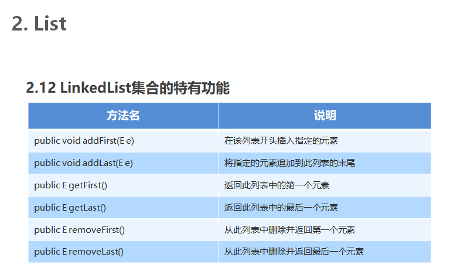

查看帮助文档，回到资料总结，然后程序中演示


- 特有方法

  | 方法名                    | 说明                             |
  | ------------------------- | -------------------------------- |
  | public void addFirst(E e) | 在该列表开头插入指定的元素       |
  | public void addLast(E e)  | 将指定的元素追加到此列表的末尾   |
  | public E getFirst()       | 返回此列表中的第一个元素         |
  | public   E getLast()      | 返回此列表中的最后一个元素       |
  | public E removeFirst()    | 从此列表中删除并返回第一个元素   |
  | public   E removeLast()   | 从此列表中删除并返回最后一个元素 |
