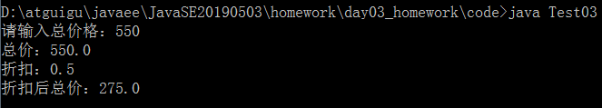

# day03_课后练习

# 编程题

## 第一题

语法点：变量，运算符，if...else

案例：从键盘输入一个整数，判断它是奇数还是偶数（这里把0归为偶数）


开发提示：

​	键盘输入需要用到Scanner类。

```java
java.util.Scanner input = new java.util.Scanner(System.in);//准备从键盘输入的扫描仪
int num = input.nextInt();//输入整数
```

​	能够被2整除的是偶数，不能被2整除的是奇数

```java
public class Test01{
	public static void main(String[] args){
		java.util.Scanner input = new java.util.Scanner(System.in);
		System.out.print("请输入一个整数：");
		int num = input.nextInt();
		if(num % 2 == 0){
			System.out.println(num + "是偶数");
		}else{
			System.out.println(num + "是奇数");
		}
	}
}

```

## 第二题

语法点：变量，运算符，if...else

案例：从键盘输入一个字符，判断它是字母还是数字，还是其他字符


开发提示：

​	键盘输入需要用到Scanner类。

```java
java.util.Scanner input = new java.util.Scanner(System.in);//准备接收从键盘输入的扫描仪
char c = input.next().charAt(0);//输入单个字符
```

​	数字范围：'0'-'9'

​	字母范围：'A'-'Z'，'a'-'z'

```java
public class Test02{
	public static void main(String[] args){
		java.util.Scanner input = new java.util.Scanner(System.in);
		System.out.print("请输入一个字符：");
		char c = input.next().charAt(0);
		if(c >= '0' && c <= '9'){
			System.out.println(c + "是数字.");
		}else if(c >= 'A' && c <= 'Z' || c >= 'a' && c <= 'z'){
			System.out.println(c + "是字母.");
		}else{
			System.out.println(c + "非数字非字母的其他字符.");
		}
	}
}
```


## 第三题

* 语法点：变量，运算符，if...else

* 按步骤编写代码，效果如图所示：

  

* 编写步骤：

  1. 定义类 Test2
  2. 定义 main方法
  3. 定义变量折扣 discount，初始化为1, 总价totalPrice的值从键盘输入
  4. 判断当`totalPrice >=500` ,discount赋值为0.5
  5. 判断当`totalPrice >=400` 且`<500`时,discount赋值为0.6
  6. 判断当`totalPrice >=300` 且`<400`时,discount赋值为0.7
  7. 判断当`totalPrice >=200` 且`<300`时,discount赋值为0.8
  8. 判断当`totalPrice >=0` 且`<200`时,discount赋值为1
  9. 判断当`totalPrice<0`时，显示输入有误
  10. 输出结果

* 开发提示：

  键盘输入需要用到Scanner类。

  ```java
  java.util.Scanner input = new java.util.Scanner(System.in);//准备接收从键盘输入的扫描仪
  double totalPrice = input.nextDouble();//输入double值
  ```

```java
public class Test03{
	public static void main(String[] args){
		java.util.Scanner input = new java.util.Scanner(System.in);
		System.out.print("请输入总价格：");
		double discount = 1;
		double totalPrice = input.nextDouble();
		if(totalPrice>=500){
			discount = 0.5;
		}else if(totalPrice>=400){
			discount = 0.6;
		}else if(totalPrice>=300){
			discount = 0.7;
		}else if(discount>=200){
			discount = 0.8;
		}else if(discount >= 0){
			discount = 1;
		}else{
			System.out.println("输入有误！");
		}
		System.out.println("总价：" + totalPrice);
		System.out.println("折扣：" + discount);
		System.out.println("折扣后总价：" + totalPrice*discount);
	}
}
```


## 第四题

语法点：变量，运算符，if...else

案例：从键盘输入生日，判断星座


* 开发提示：
  1. 各个星座的日期范围如下：


```java
public class Test04 {
	public static void main(String[] args) {
		java.util.Scanner input = new java.util.Scanner(System.in);
		System.out.print("请输入月份：");
		int month = input.nextInt();

		System.out.print("请输入日期：");
		int day = input.nextInt();

		if ((month == 1 && day >= 20) || (month == 2 && day <= 18)) {
			System.out.println("生日" + month + "月" + day + "日是水瓶座");
		} else if ((month == 2 && day >= 19) || (month == 3 && day <= 20)) {
			System.out.println("生日" + month + "月" + day + "日是双鱼座");
		}else if ((month == 3 && day >= 21) || (month == 4 && day <= 19)) {
			System.out.println("生日" + month + "月" + day + "日是白羊座");
		}else if ((month == 4 && day >= 20) || (month == 5 && day <= 20)) {
			System.out.println("生日" + month + "月" + day + "日是金牛座");
		}else if ((month == 5 && day >= 21) || (month == 6 && day <= 21)) {
			System.out.println("生日" + month + "月" + day + "日是双子座");
		}else if ((month == 6 && day >= 22) || (month == 7 && day <= 22)) {
			System.out.println("生日" + month + "月" + day + "日是巨蟹座");
		}else if ((month == 7 && day >= 23) || (month == 8 && day <= 22)) {
			System.out.println("生日" + month + "月" + day + "日是狮子座");
		}else if ((month == 8 && day >= 23) || (month == 9 && day <= 22)) {
			System.out.println("生日" + month + "月" + day + "日是处女座");
		}else if ((month == 9 && day >= 23) || (month == 10 && day <= 23)) {
			System.out.println("生日" + month + "月" + day + "日是天平座");
		}else if ((month == 10 && day >= 24) || (month == 11 && day <= 22)) {
			System.out.println("生日" + month + "月" + day + "日是天蝎座");
		}else if ((month == 11 && day >= 23) || (month == 12 && day <= 21)) {
			System.out.println("生日" + month + "月" + day + "日是射手座");
		}else if ((month == 12 && day >= 22) || (month == 1 && day <= 19)) {
			System.out.println("生日" + month + "月" + day + "日是摩羯座");
		}
	}
}
```


## 第五题

语法点：变量，运算符，switch...case

案例需求：编写一个程序，为一个给定的年份找出其对应的中国生肖。中国的生肖基于12年一个周期，每年用一个动物代表：rat（鼠）、ox（牛）、tiger（虎）、rabbit（兔）、dragon（龙）、snake（蛇）、

​      horse（马）、sheep（羊）、monkey（候）、rooster（鸡）、dog（狗）、pig（猪）。

提示：2017年：鸡   2017 % 12 == 1


```java
public class Test05 {

	public static void main(String[] args) {
		java.util.Scanner input = new java.util.Scanner(System.in);
		System.out.print("请输入年份：");
		int year = input.nextInt();
		
		switch(year%12){
		case 1:
			System.out.println("鸡");
			break;
		case 2:
			System.out.println("狗");
			break;
		case 3:
			System.out.println("猪");
			break;
		case 4:
			System.out.println("鼠");
			break;
		case 5:
			System.out.println("牛");
			break;
		case 6:
			System.out.println("虎");
			break;
		case 7:
			System.out.println("兔");
			break;
		case 8:
			System.out.println("龙");
			break;
		case 9:
			System.out.println("蛇");
			break;
		case 10:
			System.out.println("马");
			break;
		case 11:
			System.out.println("羊");
			break;
		case 0:
			System.out.println("猴");
			break;
		}
	}

}
```


## 第六题

语法点：变量，运算符，if..else

案例：


* 开发提示：

1. Math.sqrt(num)：求num的平方根

2. 定义double类型变量a,b,c，并从键盘输入它们的值

   键盘输入需要用到Scanner类。

```java
java.util.Scanner input = new java.util.Scanner(System.in);//准备接收从键盘输入的扫描仪
double totalPrice = input.nextDouble();//输入double值
```

```java
public class Test06{
	public static void main(String[] args){
		java.util.Scanner input = new java.util.Scanner(System.in);
		
		System.out.print("请输入方程的参数a：");
		double a = input.nextDouble();
		
		System.out.print("请输入方程的参数b：");
		double b = input.nextDouble();
		
		System.out.print("请输入方程的参数c：");
		double c = input.nextDouble();
		
		if(a!=0){
			double d = b*b - 4*a*c;
			if(d>0){
				double x1 = (-b + Math.sqrt(d))/(2*a);
				double x2 = (-b - Math.sqrt(d))/(2*a);
				System.out.println("两个解：x1 = " + x1 + ",x2 = " + x2);
			}else if(d==0){
				double x = -b/(2*a);
				System.out.println("一个解：x = " + x);
			}else{
				System.out.println("在实数范围内无解");
			}
		}else if(a==0 && b!=0){
			double x = -c/b;
			System.out.println("一个解：x = " + x);
		}else{
			System.out.println("不是方程");
		}
	}
}
```


## 第七题

语法点：变量，运算符，if和switch...case

案例：已知2019年1月1日是星期二，从键盘输入2019年的任意一天，请判断它是星期几


* 开发提示：

1. 先统计这一天是这一年的第几天days
2. 然后声明一个变量week，初始化为2
3. 然后week加上days-1
4. 然后求week与7的模数
5. 然后输出结果，考虑星期天的特殊判断

```java
public class Test07 {
	public static void main(String[] args){
		//1、从键盘分别输入年、月、日
		java.util.Scanner input = new java.util.Scanner(System.in);
		
		System.out.print("月：");
		int month = input.nextInt();
		
		System.out.print("日：");
		int day = input.nextInt();
		
		//判断这一天是当年的第几天==>从1月1日开始，累加到xx月xx日这一天
		//(1)[1,month-1]个月满月天数
		//(2)第month个月的day天
		//(3)单独考虑2月份是否是29天（依据是看year是否是闰年）
		
		//2、声明一个变量days，用来存储总天数
		//int days = 0;
		//累加第month个月的day天
		//days += day;
		
		//修改上面的代码，直接把days初始化为day
		int days = day;
		
		//3、累加[1,month-1]个月满月天数
		switch(month){
			case 12:
				//累加的1-11月
				days += 30;//这个30是代表11月份的满月天数
				//这里没有break，继续往下走
			case 11:
				//累加的1-10月
				days += 31;//这个31是代表10月的满月天数
				//这里没有break，继续往下走
			case 10:
				days += 30;//9月
			case 9:
				days += 31;//8月
			case 8:
				days += 31;//7月
			case 7:
				days += 30;//6月
			case 6:
				days += 31;//5月
			case 5:
				days += 30;//4月
			case 4:
				days += 31;//3月
			case 3:
				days += 28;//2月，因为2019年的2月是28天
			case 2:
				days += 31;//1月
		}
		
		//days 里面存的是这一天是这一年的第几天
		//已知2019年1月1日是星期二
		//假设我输入的就是1月1日，那么days中就是1
		int week = 1;//2018年12月31日的星期
		week += days;
		week %= 7;
		System.out.print(month+"月" + day +"日是这一年的第"+days+"天，是星期" + (week==0?"天":week)) ;
		
	}
}	   
```


# 简答题

1、switch是否能作用在byte上，是否能作用在long上，是否能作用在String上？

```
可以作用在byte上，
不能作用在long上
可以作用在String上
```

