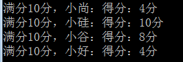

# day05课后练习

# 基础题目

## 第一题：需求实现

* 模拟大乐透号码：

  * 一组大乐透号码由10个1-99之间的数字组成
  * 打印大乐透号码信息

* 代码实现，效果如图所示：

  

* 开发提示：

  * 使用数组保存录入或随机产生的号码
  * 如果使用键盘输入，需要用到java.util.Scanner
  * 如果使用随机产生，可以使用Math.random()或java.util.Random的nextInt(bounds)

```java
public class Test01 {

	public static void main(String[] args) {
		//1、声明并创建数组
		int[] arr = new int[10];
		
		//2、为元素赋值
		java.util.Random rand = new java.util.Random();
		for (int i = 0; i < arr.length; i++) {
			arr[i] = rand.nextInt(99)+1;
		}
		
		//3、输出
		for (int i = 0; i < arr.length; i++) {
			System.out.print(arr[i]+" ");
		}
	}

}
```


## 第二题：需求实现

* 打印扑克牌.


* 代码实现，效果如图所示：

  

* 开发提示：

  * 使用两个字符串数组，分别保存花色和点数
  * 再用一个字符串数组保存最后的扑克牌
  * 遍历显示

```java
public class Test02 {
	public static void main(String[] args){
		String[] hua = {"黑桃","红桃","梅花","方片"};
		String[] dian = {"A","2","3","4","5","6","7","8","9","10","J","Q","K"};
		String[] pu = new String[hua.length*dian.length];
		for(int i=0,k=0; i<hua.length; i++){
			for(int j=0; j<dian.length; j++,k++){
				pu[k] = hua[i]+dian[j];
			}
		}
		
		for (int i = 1; i <= pu.length; i++) {
			System.out.print(pu[i-1]+" ");
			if(i%13==0){
				System.out.println();
			}
		}
	}
}
```


## 第三题：需求实现

* 模拟在一副牌中，抽取第1张，第5张，第50张扑克牌。

* 代码实现，效果如图所示：

  

  

```
public class Test03 {
	public static void main(String[] args){
		String[] hua = {"黑桃","红桃","梅花","方片"};
		String[] dian = {"A","2","3","4","5","6","7","8","9","10","J","Q","K"};
		String[] pu = new String[hua.length*dian.length];
		for(int i=0,k=0; i<hua.length; i++){
			for(int j=0; j<dian.length; j++,k++){
				pu[k] = hua[i]+dian[j];
			}
		}
		
		System.out.println(pu[1-1] + " " + pu[5-1] +" " + pu[50-1]);
	}
}

```


## 第四题：需求实现

* 统计字符

  * 字符数组：{'a','l','f','m','f','o','b','b','s','n'}
  * 统计每个字符出现的次数并打印到控制台。

* 代码实现，部分效果如图所示：

  

* 开发提示：

  * 将数字强制转换，根据ASCII码表转换为字符。
  * 可以定义长度26的数组，每个元素，对应去保存每种字符的出现次数，比如0索引保存a的次数，1索引保存b的次数，以此类推。

```java
public class Test04 {
	public static void main(String[] args){
		char[] arr = {'a','l','f','m','f','o','b','b','s','n'};
		
		int[] counts = new int[26];//counts数组的元素，目前默认值都是0
		/*
		counts[0] 存储 'a'字母出现的次数
		counts[1] 存储 'b'字母出现的次数
		counts[2] 存储 'c'字母出现的次数
		...
		*/
		//遍历arr数组，统计每一个字母出现的次数，并且把次数存储的counts数组中
		for(int i=0; i<arr.length; i++){
			//例如：arr[0]现在是'a'，那么应该counts[0]++
			//arr[1]现在是'l'，那么应该counts[11]++
			//找counts[下标]其中的下标与字母'a','b'等的关系
			//例如：'a' ==》counts[0]的[0]的关系		'a'-97=97-97=0
			//例如：'l' ==》counts[11]的[11]的关系		'l'-97=108-97=11
			counts[arr[i] - 97]++;
		}
		
		//遍历counts数组显示结果
		for(int i=0; i<counts.length; i++){
			if(counts[i]!=0){
				//System.out.println(字母 + "--" + 次数);
				System.out.println((char)(i+97) + "--" + counts[i]);
			}
		}
	}
}
```


## 第五题：需求实现

* 统计高于平均分的分数有多少个。
  * 定义数组[95, 92, 75, 56, 98, 71, 80, 58, 91, 91]。


* 代码实现，效果如图所示：

  

  步骤：

  （1）先求总分

  （2）求平均分

  （3）遍历数组，统计比平均分高的个数

```java
public class Test05 {
	public static void main(String[] args) {
		int[] arr = {95, 92, 75, 56, 98, 71, 80, 58, 91, 91};
		
		//累加总分
		int sum = 0;
		for (int i = 0; i < arr.length; i++) {
			sum += arr[i];
		}
		//求平均分
		int avg = sum/arr.length;
		
		//统计比平均分高的人数
		int count = 0;
		for (int i = 0; i < arr.length; i++) {
			if(arr[i] > avg){
				count++;
			}
		}
		System.out.println("高于平均分：" + avg + "的有" + count + "个");
	}
}
```


## 第六题：需求实现

* 判断数组中的元素值是否对称.

* 代码实现，效果如图所示：

  

* 开发提示：

  * 数组中元素首尾比较。


```java

public class Test06 {
	public static void main(String[] args){
		int[] arr = {1,2,3,4,4,3,2,1};
		
		//(1)先假设它是对称的
		boolean flag = true;
		
		//(2)遍历，查看数组的元素是否首尾对称
		//left表示左边的下标
		//right表示右边的下标
		for(int left=0,right=arr.length-1; left<right; left++,right--){
			if(arr[left] != arr[right]){
				flag = false;
				break;
			}
		}
		
		System.out.println(flag?"对称":"不对称");
	}
}

```


## 第七题：需求实现

* 比较两个数组内容是否完全一致。

* 代码实现，效果如图所示：

  

* 开发提示：

  * 长度一致，内容一致，定义为完全一致。

  

```java
public class Test07 {
	public static void main(String[] args) {
		int[] arr1 = {1,2,3,4,5,6,7};
		int[] arr2 = {1,2,3,4,5,6,7};
	
		boolean flag = true;//假设一致
		if(arr1.length!=arr2.length){
			flag = false;
		}else{
			for (int i = 0; i < arr2.length; i++) {
				if(arr1[i] != arr2[i]){
					flag = false;
					break;
				}
			}
		}
		System.out.println("是否一致：" + flag);
	}
}

```


# 扩展题目

## 第八题：需求实现

- 根据标准答案【ADBCD】，每题2分共10分，求出每名学生最终得分。

  - 四名同学答案分别为：
    - 小尚：【DCBAD】
    - 小硅：【ADBCD】
    - 小谷：【ADBCA】
    - 小好：【ABCDD】
  - 每答对一题，得2分，输出四名同学的最终得分。

- 代码实现，效果如图所示：

  

```java
public class Test08 {
	public static void main(String[] args){
		//标准答案：
		char[] answer = {'A','D','B','C','D'};
		
		//学生的答案
		char[] shang = {'D','C','B','A','D'};
		char[] gui = {'A','D','B','C','D'};
		char[] gu = {'A','D','B','C','A'};
		char[] hao = {'A','B','C','D','D'};
		
		//求出每名学生最终得分。
		int shangFen = 0;
		for(int i=0; i<shang.length; i++){
			if(shang[i] == answer[i]){
				shangFen +=2;
			}
		}
		System.out.println("小尚的分数：" + shangFen);
		
		int guiFen = 0;
		for(int i=0; i<gui.length; i++){
			if(gui[i] == answer[i]){
				guiFen +=2;
			}
		}
		System.out.println("小硅的分数：" + guiFen);
		
		int guFen = 0;
		for(int i=0; i<gu.length; i++){
			if(gu[i] == answer[i]){
				guFen +=2;
			}
		}
		System.out.println("小谷的分数：" + guFen);
		
		int haoFen = 0;
		for(int i=0; i<hao.length; i++){
			if(hao[i] == answer[i]){
				haoFen +=2;
			}
		}
		System.out.println("小好的分数：" + haoFen);
	}
}
```


## 第九题：需求实现

- 左奇右偶

  -  10个整数的数组{26,67,49,38,52,66,7,71,56,87}。
  - 元素重新排列，所有的奇数保存到数组左边，所有的偶数保存到数组右边。

- 代码实现，效果如图所示：

  

- 开发提示：

  - 左边的偶数与右边的奇数换位置：
  - 定义两个变量left和right，从左边开始查找偶数的位置，找到后用left记录，从右边开始找奇数的位置，找到后用right记录，如果left<right，那么就交换，然后在上一次的基础上继续查找，直到left与right擦肩。

```java
public class Test09 {
	public static void main(String[] args){
		int[] arr = {26,67,49,38,52,66,7,71,56,87};
		
		int left = 0,right = arr.length-1;
		while(left<right){
			//如果[left]位置是偶数，[right]位置是奇数就交换
			if(arr[left]%2==0 && arr[right]%2!=0){
				int temp = arr[left];
				arr[left] = arr[right];
				arr[right] = temp;
				
				left++;
				right--;
			}else if(arr[left]%2!=0){//如果[left]位置是奇数，右移一位，不需要交换
				left++;
			}else if(arr[right]%2==0){//如果[left]位置是偶数，左移一位，不需要交换
				right--;
			}
		}
		
		for(int i=0; i<arr.length-1; i++){
			System.out.print(arr[i] + " ");
		}
	}
}
```


## 第十题：需求实现

* 数组去重

  * 10个整数{9,10,6,6,1,9,3,5,6,4}，范围1-10，保存到数组中。
  * 去除数组中重复的内容，只保留唯一的元素。

* 按步骤编写代码，效果如图所示：

  

* 开发提示：

  - 定义一个变量count，初始化为数组的长度
  - 遍历每一个元素，如果该元素与后面的某个元素相等，那么通过移动数组，把该元素覆盖掉，并修改count--。
  - 最后创建一个新数组，长度为count，并从原数组把前count个元素复制过来

```java
public class Test10 {
	public static void main(String[] args){
		int[] arr = {9,10,6,6,1,9,3,5,6,4};//有重复的元素
		
		//（1）定义变量count，初始化为原数组的长度，
		//通过下面的操作，会修改count，最终代表新数组的长度，即不重复元素的个数
		int count = arr.length;//初始的元素个数
		
		//（2）查找是否有重复的元素，并把后面的那个重复的元素覆盖掉，然后count--
		for(int i=0; i<count; i++){
			//用arr[i]与它后面的元素一一比较，如果有相等的，说明重复了
			//所以j初始化为i+1，因为从arr[i+1]开始比较
			for(int j=i+1; j<count; j++){
				if(arr[i] == arr[j]){//说明有重复的
					//把j后面的元素往前移动
					for(int k=j; k<count-1; k++){//循环的次数，需要移动的个数
						arr[k] = arr[k+1];
					}
					count--;
				}
			}
		}
		
		//（3）创建新数组
		int[] newArr = new int[count];
		
		//（4）复制元素，把arr的前面的count个元素复制到新数组中
		for(int i=0; i<count; i++){
			newArr[i] = arr[i];
		}
		
		//（5）显示结果
		for(int i=0; i<newArr.length; i++){
			System.out.print(newArr[i]+ " ");
		}
	}
}
```

