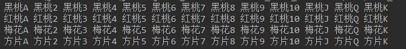

# day06课后练习

# 一维数组基础题目

## 第1题：

案例：从键盘输入本组学员的人数，和本组学员的成绩，用数组存储成绩，然后实现从高到低排序

```java
public class Test01 {
	public static void main(String[] args){
		java.util.Scanner input = new java.util.Scanner(System.in);
		
		//(1)先确定人数，即确定数组的长度
		System.out.print("请输入本组学员的人数：");
		int count = input.nextInt();
		
		//(2)创建数组
		int[] scores = new int[count];
		
		//(3)输入学员的成绩
		for(int i=0; i<scores.length; i++){
			System.out.print("请输入第" +(i+1)+"个学员的成绩：");
			scores[i] = input.nextInt();
		}
		
		//(4)排序，冒泡
		for(int i=1; i<scores.length; i++){
			//从高到低，即从大到小
			//例如：5个人
			//从左到右，j的起点是0，
			//终点是3,2,1,0
			//arr[j] 与arr[j+1]
			for(int j=0; j<scores.length-i; j++){
				if(scores[j] < scores[j+1]){
					int temp = scores[j];
					scores[j] = scores[j+1];
					scores[j+1] = temp;
				}
			}
		}
		
		//(5)显示结果
		for(int i=0; i<scores.length; i++){
			System.out.print(scores[i]+ " ");
		}
	}
}

```


## 第2题：

案例：从键盘输入本组学员的人数，和本组学员的姓名，用数组存储姓名，然后再从键盘输入一个姓名，查找它是否在之前的数组中，如果存在，就显示它的下标

```java
public class Test02 {
	public static void main(String[] args){
		java.util.Scanner input = new java.util.Scanner(System.in);
		
		//(1)先确定人数，即确定数组的长度
		System.out.print("请输入本组学员的人数：");
		int count = input.nextInt();
		
		//(2)创建数组
		String[] names = new String[count];
		
		//(3)输入学员的成绩
		for(int i=0; i<names.length; i++){
			System.out.print("请输入第" +(i+1)+"个学员的姓名：");
			names[i] = input.next();
		}
		
		//(4)输入要查找的学生姓名
		System.out.print("请输入要查找的学生姓名：");
		String name = input.next();
		
		//(5)查找
		int index = -1;
		for(int i=0; i<names.length; i++){
			if(name.equals(names[i])){
				index = i;
				break;
			}
		}
		if(index==-1){
			System.out.println(name+"不存在");
		}else{
			System.out.println(name +"在数组的下标是：" + index);
		}
	}
}
```


## 第3题：

案例：从键盘输入一个英语单词，然后查找这个单词中是否存在'a'字母

提示：把字符串转成字符数组，可以使用String类型的toCharArray()方法

```java
String str = "hello";
char[] arr = str.toCharArray();//arr数组中就是{'h','e','l','l','o'}
```

```java
public class Test03 {
	public static void main(String[] args) {
		java.util.Scanner input = new java.util.Scanner(System.in);
		
		System.out.print("请输入一个英语单词：");
		String word = input.next();
		
		char[] arr = word.toCharArray();
		int index = -1;
		for (int i = 0; i < arr.length; i++) {
			if(arr[i] == 'a'){
				index = i;
				break;
			}
		}
		if(index==-1){
			System.out.println(word+"中没有a");
		}else{
			System.out.println("a在"+word+"中的下标是：" + index);
		}
	}
}
```

## 第4题：

随机验证码。

* 随机生成十组六位字符组成的验证码。
* 验证码由大小写字母、数字字符组成。


开发提示：

* 使用字符数组保存原始字符，利用Random类生成随机索引。

```java
public class Test04 {
	public static void main(String[] args) {
		String[] arr = new String[10];
		java.util.Random rand = new java.util.Random();
		for (int i = 0; i < arr.length; i++) {
			arr[i] = "";
			for (int j = 0; j < 6; j++) {
				int num;
				while(true){
					num = rand.nextInt(123);
					//数字[48,57]  大写字母[65,90]  小写字母[97,122]
					if(num>=48 && num<=57){
						break;
					}else if(num>=65 && num<=90){
						break;
					}else if(num>=97 && num<=122){
						break;
					}
				}
				arr[i] += (char)num;
			}
		}
		
		for (int i = 0; i < arr.length; i++) {
			System.out.println("随机验证码：" + arr[i]);
		}
	}
}
```


# 二维数组基础题目

## 第5题：

* 使用二维数组打印一个 10 行杨辉三角.

  1

  1 1

  1 2 1

  1 3 3  1

  1 4 6  4  1

  1 5 10 10 5 1

   ....

* 开发提示

1. 第一行有 1 个元素, 第 n 行有 n 个元素

2. 每一行的第一个元素和最后一个元素都是 1

3. 从第三行开始, 对于非第一个元素和最后一个元素的元素. 

   ```
   yanghui[i][j] = yanghui[i-1][j-1] + yanghui[i-1][j];
   ```

   


```java
public class Test05 {
	public static void main(String[] args){
		//(1)先确定行数
		int[][] yanghui = new int[10][];
		
		//(2)再确定每一行的列数
		//第一行有 1 个元素, 第 n 行有 n 个元素
		for(int i=0; i<yanghui.length; i++){
			yanghui[i] = new int[i+1];
		}
		
		//(3)再确定元素
		for(int i=0; i<yanghui.length; i++){
			//每一行的第一个和最后一个元素都是1
			yanghui[i][0] = 1;
			yanghui[i][i] = 1;
			
			//中间的元素
			for(int j=1; j<yanghui[i].length-1; j++){
				yanghui[i][j] = yanghui[i-1][j-1] + yanghui[i-1][j];
			}
			
		}
		
		//(4)打印显示
		for(int i=0; i<yanghui.length; i++){
			for(int j=0; j<yanghui[i].length; j++){
				System.out.print(yanghui[i][j] + "\t");
			}
			System.out.println();
		}
	}
}
```


## 第6题：

   * 打印扑克牌，效果如图所示：

     

   * 开发提示：

     * 使用一个两行的二维的字符串数组，分别保存花色和点数

```java
public class Test06 {
	public static void main(String[] args){
		//1、声明一个二维数组，并确定长度
		String[][] arr = new String[2][];
		
		//2、确定第一行的列数，第一行存储花色
		arr[0] = new String[4];
		
		//3、确定第二行的列数，第二行存储点数
		arr[1] = new String[13];
		
		//4、把花色和点数放进去
		//花色
		arr[0][0] = "黑桃";
		arr[0][1] = "红桃";
		arr[0][2] = "梅花";
		arr[0][3] = "方片";
		
		//点数
		arr[1][0] = "A";
		for(int i=1; i<=9; i++){//表示第二行部分下标
			arr[1][i] = i+1+"";
		}
		arr[1][10] = "J";
		arr[1][11] = "Q";
		arr[1][12] = "K";
	
		//5、显示
		for(int i=0; i<arr[0].length; i++){//外循环循环花色
			for(int j=0; j<arr[1].length; j++){//内循环循环点数
				//arr[0][?]是花色
				//arr[1][?]是点数
				System.out.print(arr[0][i] + arr[1][j] + " ");
			}
			System.out.println();
		}
	}
}
```


## 第7题：

需求：保存全班的每个组的成绩，并对成绩做统计

1. 从键盘输入一共有几组
2. 从键盘输入每一组分别有多少人
3. 从键盘输入每一个同学的成绩
4. 统计每一组的最高分、最低分
5. 统计每一组的平均分
6. 统计全班的最高分、最低分
7. 统计全班的平均分
8. 统计全班的总人数

```java
public class Test07 {
	public static void main(String[] args){
		java.util.Scanner input = new java.util.Scanner(System.in);
		
		//(1)从键盘输入一共有几组，确定二维数组的行数
		System.out.print("请输入一共有几组：");
		int group = input.nextInt();
		
		//(2)创建二维数组，并确定行数
		int[][] arr = new int[group][];
		
		//(3)从键盘输入每一组分别有多少人，确定每一行的列数
		for(int i=0; i<arr.length; i++){
			System.out.print("请输入第" + (i+1) + "组有几个人:");
			arr[i] = new int[input.nextInt()];
			
			//(4)从键盘输入每一个同学的成绩
			for(int j = 0; j<arr[i].length; j++){
				System.out.print("请输入第" + (j+1) + "个组员的成绩：");
				arr[i][j] = input.nextInt();
			}
		}
		
		//(4)显示成绩表
		System.out.println("每组成绩如下：");
		for(int i=0; i<arr.length; i++){
			for(int j=0; j<arr[i].length; j++){
				System.out.print(arr[i][j] + "\t");
			}
			System.out.println();
		}
		
		/*
		4. 统计每一组的最高分、最低分
		5. 统计每一组的平均分
		6. 统计全班的最高分、最低分
		7. 统计全班的平均分
		8. 统计全班的总人数
		*/
		int[] groupMax = new int[group];//有几组就有几个元素
		int[] groupMin = new int[group];
		double[] groupAvg = new double[group];
		int max = -1;//全班的最高分
		int min = 101;//全班的最低分，假设成绩的范围是[0,100]
		double sum = 0;
		int count = 0 ;
		
		//把每一组的最高分，最低分，都初始化为特殊值
		for(int i=0; i<group; i++){
			groupMax[i] = -1;
			groupMin[i] = 101;
		}
		
		//统计
		for(int i=0; i<arr.length; i++){
			double groupSum = 0;//每一组累加总分，都是从0开始
			for(int j=0; j<arr[i].length; j++){
				if(arr[i][j] > groupMax[i]){//找每组的最高分
					groupMax[i] = arr[i][j];
				}
				if(arr[i][j] < groupMin[i]){//找每组的最低分
					groupMin[i] = arr[i][j];
				}
				if(arr[i][j] > max){//找全班的最高分
					max = arr[i][j];
				}
				if(arr[i][j] < min){//找全班的最低分
					min = arr[i][j];
				}
				groupSum += arr[i][j];//累加每一组的总分
				sum += arr[i][j];//累加全部的总分
				count++;//累加总人数
			}
			
			//每一组的平均分 = 每一组的总分/每一组的人数
			groupAvg[i] = groupSum / arr[i].length;
		}
		
		//全部的平均分 = 全部的总分 / 总人数
		double avg = sum / count;
		
		System.out.println("全班的最高分：" + max);
		System.out.println("全班的最低分：" + min);
		System.out.println("全班的平均分：" + avg);
		System.out.println("全班的总人数：" + count);
		for(int i=0; i<arr.length; i++){
			System.out.println("第" + (i+1) + "组的最高分：" + groupMax[i]);
			System.out.println("第" + (i+1) + "组的最低分：" + groupMin[i]);
			System.out.println("第" + (i+1) + "组的平均分：" + groupAvg[i]);
		}
	}
}
```

