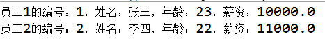

# day07_课后练习

# 属性基础练习

## 第1题

案例：

​	声明员工类Employee，包含属性：编号、姓名、年龄、薪资，创建2个员工对象，并为属性赋值，并打印两个员工的信息。



```java
public class Employee {
	int id;
	String name;
	int age;
	double salary;
}
```

```java
public class Test01 {
	public static void main(String[] args) {
		Employee emp1 = new Employee();
		emp1.id = 1;
		emp1.name = "张三";
		emp1.age = 23;
		emp1.salary = 10000;
		
		Employee emp2 = new Employee();
		emp2.id = 2;
		emp2.name = "李四";
		emp2.age = 22;
		emp2.salary = 11000;
		
		System.out.println("员工1的编号：" + emp1.id +"，姓名：" + emp1.name + "，年龄：" + emp1.age + "，薪资：" + emp1.salary);
		System.out.println("员工2的编号：" + emp2.id +"，姓名：" + emp2.name + "，年龄：" + emp2.age + "，薪资：" + emp2.salary);
	}
}
```


## 第2题

案例：

​	声明一个日期类MyDate，包含属性：年、月、日，创建3个日期对象，一个是你的出生日期，一个是来尚硅谷的日期，一个是毕业的日期，并打印显示

```java
public class MyDate {
	int year;
	int month;
	int day;
}

```

```java
public class Test02 {
	public static void main(String[] args) {
		MyDate bir = new MyDate();
		bir.year = 1995;
		bir.month = 5;
		bir.day = 5;
		System.out.println("生日：" + bir.year + "年" + bir.month + "月" + bir.day + "日");
		
		MyDate come = new MyDate();
		come.year = 2019;
		come.month = 5;
		come.day = 12;
		System.out.println("来尚硅谷：" + come.year + "年" + come.month + "月" + come.day + "日");
		
		MyDate go = new MyDate();
		go.year = 2019;
		go.month = 10;
		go.day = 25;
		System.out.println("毕业：" + go.year + "年" + go.month + "月" + go.day + "日");
	}
}
```


## 第3题

案例：

​	声明公民类Citizen，包含属性：姓名，生日，身份证号，其中姓名是String类型，生日是MyDate类型，身份证号也是String类型。创建你们家庭成员的几个对象，并打印信息。

```java
public class Test03 {
	public static void main(String[] args){
		//1、创建爸爸的对象
		Citizen baba = new Citizen();
		baba.name = "小头爸爸";
		baba.cardId = "1111111";
		//左边的birthday是一个引用数据类型的变量，右边就需要赋值一个对象
		baba.birthday = new MyDate();
		//baba.birthday是对象名
		baba.birthday.year = 1967;
		baba.birthday.month = 5;
		baba.birthday.day = 2;
		
		//2、创建妈妈的对象
		Citizen mama = new Citizen();
		mama.name = "围裙妈妈";
		mama.cardId = "222222";
		
		MyDate bir = new MyDate();
		bir.year = 1970;
		bir.month = 6;
		bir.day = 1;
		
		mama.birthday = bir;
		
		//3、创建自己的对象
		Citizen self = new Citizen();
		self.name = "大头儿子";
		self.cardId = "3333333";
		
		MyDate date = new MyDate();
		date.year = 1995;
		date.month = 6;
		date.day = 12;
		
		self.birthday = date;
		
		System.out.println("爸爸的姓名：" + baba.name + "，身份证号：" + baba.cardId + "，生日：" + baba.birthday.year+"年" + baba.birthday.month + "月" + baba.birthday.day+"日");
		System.out.println("妈妈的姓名：" + mama.name + "，身份证号：" + mama.cardId + "，生日：" + mama.birthday.year+"年" + mama.birthday.month + "月" + mama.birthday.day+"日");
		System.out.println("我的姓名：" + self.name + "，身份证号：" + self.cardId + "，生日：" + self.birthday.year+"年" + self.birthday.month + "月" + mama.birthday.day+"日");
	}
}
```


# 方法基础练习

## 第4题：

案例：

​	声明一个日期类MyDate，包含属性：年、月、日，并在MyDate类中声明几个方法：

1、boolean isLeapYear()：判断当前日期的是闰年吗？

2、void set(int y, int m, int d)：修改年，月，日为新日期

3、void puls(int years, int months, int days)：加上years年，months月，days天后的日期

```java
public class MyDate {
	int year;
	int month;
	int day;
	
	boolean isLeapYear(){
		return year%4==0 && year%100!=0 || year%400==0;
	}
	
	void set(int y, int m, int d){
		year = y;
		month = m;
		day = d;
	}
	
	void puls(int years, int months,int days){
		day += days;
		month += months;
		year += years;
		while(month>12){
			month-=12;
			year++;
		}
		while(true){
			if(month==1 || month==3 || month==5 || month==7 || month==8 || month==10){
				if(day>31){
					day -= 31;
					month++;
				}else{
					break;
				}
			}else if(month==4 || month==6 || month==9 || month==11){
				if(day>30){
					day -= 30;
					month++;
				}else{
					break;
				}
			}else if(month==2){
				if(year%4==0 && year%100!=0 || year%400==0){
					if(day>29){
						day -= 29;
						month++;
					}else{
						break;
					}
				}else{
					if(day>28){
						day-=28;
						month++;
					}else{
						break;
					}
				}
			}else if(month == 12){
				if(day>31){
					day-=31;
					month=1;
					year++;
				}else{
					break;
				}
			}
		}
	}
}

```


```java
public class Test04 {
	public static void main(String[] args) {
		MyDate my = new MyDate();
		my.set(2019, 5, 13);
		
		System.out.println(my.year + "年" + my.month + "月" + my.day + "日");
		System.out.println("是闰年吗？" + my.isLeapYear());
		
		my.puls(1, 70, 70);
		System.out.println("再加1年70个月70天之后的日期是：");
		System.out.println(my.year + "年" + my.month + "月" + my.day + "日");
	}
}
```


## 第5题：

案例：

​	声明一个三角形类Triangle，包含属性：a,b,c，表示三条边，并在Triangle类中声明几个方法：

1、boolean  isRightTriangle()：判断是否是一个直角三角形

2、boolean isIsoscelesTriangle()：判断是否是一个等腰三角形

3、boolean isEquilateralTriangle()：判断是否是一个等边三角形

4、double getArea()：根据三条边，用海伦公式求面积

5、double getLength()：求周长

```java
public class Triangle {
	double a;
	double b;
	double c;

	// 判断是否是一个直角三角形
	boolean isRightTriangle() {
		// 判断值合法
		if (a > 0 && b > 0 && c > 0) {
			// 判断是否是三角形
			if (a + b > c && a + c > b && b + c > a) {
				if (a * a + b * b == c * c || b * b + c * c == a * a || a * a + c * c == b * b) {
					return true;
				}
			}
		}
		return false;
	}

	boolean isIsoscelesTriangle() {
		// 判断值合法
		if (a > 0 && b > 0 && c > 0) {
			// 判断是否是三角形
			if (a + b > c && a + c > b && b + c > a) {
				// 判断是否是等腰三角形
				if (a == b || b == c || a == c) {
					return true;
				}
			}
		}
		return false;
	}

	boolean isEquilateralTriangle() {
		// 判断值合法
		if (a > 0 && b > 0 && c > 0) {
			// 判断是否是三角形
			if (a + b > c && a + c > b && b + c > a) {
				// 判断是否是等边三角形
				if (a == b && b == c) {
					return true;
				}
			}
		}
		return false;
	}

	double getArea() {
		// 判断值合法
		if (a > 0 && b > 0 && c > 0) {
			// 判断是否是三角形
			if (a + b > c && a + c > b && b + c > a) {
				double p = (a + b + c) / 2;
				return Math.sqrt(p * (p - a) * (p - b) * (p - c));
			}
		}
		return 0;
	}

	double getLength() {
		// 判断值合法
		if (a > 0 && b > 0 && c > 0) {
			// 判断是否是三角形
			if (a + b > c && a + c > b && b + c > a) {
				return a + b + c;
			}
		}
		return 0;
	}
}

```

```java
public class Test05 {
	public static void main(String[] args) {
		Triangle t = new Triangle();
		t.a = 3;
		t.b = 4;
		t.c = 5;
		
		System.out.println("是否是直接三角形：" + t.isRightTriangle());
		System.out.println("是否是等腰三角形：" + t.isIsoscelesTriangle());
		System.out.println("是否是等边三角形：" + t.isEquilateralTriangle());
		System.out.println("三角形的面积：" + t.getArea());
		System.out.println("三角形的周长：" + t.getLength());
	}
}
```


## 第6题：

案例：

​	声明一个数学计算工具类MathTools，包含如下方法：

1、int add(int a, int b)：求a+b

2、int subtract(int a,int b)：求a-b

3、int mutiply(int a, int b)：求a*b

4、int divide(int a, int b)：求a/b

5、int remainder(int a, int b)：求a%b

6、int max(int a, int b)：求a和b中的最大值

7、int min(int a, int b)：求a和b中的最小值

8、boolean equals(int a, int b)：判断a和b是否相等

9、boolean isEven(int a)：判断a是否是偶数

10、boolean isPrimeNumer(int a)：判断a是否是素数

11、int round(double d)：返回d的四舍五入后的整数值

```java
public class MathTools {
	int add(int a, int b) {
		return a + b;
	}

	int subtract(int a, int b) {
		return a - b;
	}

	int mutiply(int a, int b) {
		return a * b;
	}

	int divide(int a, int b) {
		return a / b;
	}

	int remainder(int a, int b) {
		return a % b;
	}

	int max(int a, int b) {
		return a > b ? a : b;
	}

	int min(int a, int b) {
		return a < b ? a : b;
	}

	boolean equals(int a, int b) {
		return a == b;
	}

	boolean isEven(int a) {
		return a % 2 == 0;
	}
	
	boolean isPrimeNumber(int a){
		for (int i = 2; i < a; i++) {
			if(a%i == 0){
				return false;
			}
		}
		return true;
	}
	
	int round(double d){
		return (int)(d + 0.5);
	}
}

```

```java

public class Test06 {
	public static void main(String[] args) {
		MathTools tools = new MathTools();
		
		int a = 5;
		int b = 3;
		System.out.println(a + "+" + b  + "=" + tools.add(a,b));
		System.out.println(a + "-" + b  + "=" + tools.subtract(a,b));
		System.out.println(a + "*" + b  + "=" + tools.mutiply(a,b));
		System.out.println(a + "/" + b  + "=" + tools.divide(a,b));
		System.out.println(a + "%" + b  + "=" + tools.remainder(a,b));
		System.out.println(a + "," + b + "的最大值：" + tools.max(a, b));
		System.out.println(a + "," + b + "的最小值：" + tools.min(a, b));
		System.out.println(a + "==" + b + "？" + tools.equals(a,b));
		System.out.println(a + "是偶数？" + tools.isEven(a));
		System.out.println(a + "是素数？" + tools.isPrimeNumber(a));
		System.out.println("5.4四舍五入的结果：" + tools.round(5.4));
		System.out.println("5.6四舍五入的结果：" + tools.round(5.6));
	}
}
```


## 第7题：

案例：

​	声明一个数组管理工具类MyArrays，包含如下方法：

1、void sort(int[] arr)：可以为任意一维整型数组arr实现从小到大排序

2、int indexOf(int[] arr, int value)：可以在任意一维整型数组arr中查找value值的下标，如果不存在返回-1

3、int[] copy(int[] arr, int len)：可以实现从任意一维数组arr中复制一个新数组返回，新数组的长度为len，从arr[0]开始复制

4、void print(int[] arr)：可以打印数组的元素，效果：[1,2,3,4,5]

```java
public class MyArrays {
	void sort(int[] arr) {
		for (int i = 1; i < arr.length; i++) {
			for (int j = 0; j < arr.length - i; j++) {
				if (arr[j] > arr[j + 1]) {
					int temp = arr[j];
					arr[j] = arr[j + 1];
					arr[j + 1] = temp;
				}
			}
		}
	}

	int indexOf(int[] arr, int value) {
		for (int i = 0; i < arr.length; i++) {
			if (value == arr[i]) {
				return i;
			}
		}
		return -1;
	}

	int[] copy(int[] arr, int len) {
		// (1)创建新数组
		int[] newArr = new int[len];

		// (2)复制元素
		// [i]既不能超过旧数组下标范围，也不能超过新数组下标范围
		for (int i = 0; i < newArr.length && i < arr.length; i++) {
			newArr[i] = arr[i];
		}
		// (3)返回新数组
		return newArr;
	}
	
	void print(int[] arr){
		System.out.print("[");
		for (int i = 0; i < arr.length; i++) {
			if(i==0){
				System.out.print(arr[i]);
			}else{
				System.out.print("," + arr[i]);
			}
		}
		System.out.println("]");
	}
}

```

```java
public class Test07 {
	public static void main(String[] args) {
		MyArrays tools = new MyArrays();
		
		int[] all = {4,5,2,6,1};
		System.out.println("排序前：");
		tools.print(all);
		
		tools.sort(all);
		System.out.println("排序后：");
		tools.print(all);
		
		
		int index = tools.indexOf(all, 4);
		System.out.println("4在数组的下标是：" + index);
		
		System.out.println("新数组：");
		int[] copyArr = tools.copy(all, 10);
		tools.print(copyArr);
	}
}
```


## 第8题：

案例：

​	声明一个常识工具类CommonsTools，包含如下方法：

1、String getWeekName(int week)：根据星期值，返回对应的英语单词

2、String getMonthName(int month)：根据月份值，返回对应的英语单词

3、int getTotalDaysOfMonth(int year, int month)：返回某年某月的总天数

4、int getTotalDaysOfYear(int year)：获取某年的总天数

5、boolean isLeapYear(int year)：判断某年是否是闰年

```java
public class CommonsTools {
	String getWeekName(int week){
		switch(week){
		case 1:
			return "Monday";
		case 2:
			return "Tuesday";
		case 3:
			return "Wednesday";
		case 4:
			return "Thursday";
		case 5:
			return "Friday";
		case 6:
			return "Saturday";
		case 7:
			return "Sunday";
		}
		return "";
	}
	
	String getMonthName(int month){
		String[] all = {"January","February","March","April","May","June","July","August","September","October","November","December"};
		if(month >= 1 && month <= 12){
			return all[month-1];
		}
		return "";
	}
	
	int getTotalDaysOfMonth(int year, int month){
		int[] days = {31,28,31,30,31,30,31,31,30,31,30,31};
		if(isLeapYear(year)){
			days[1]++;//闰年2月29天
		}
		if(month >= 1 && month <= 12){
			return days[month-1];
		}
		return 0;
	}
	
	int getTotalDaysOfYear(int year){
		if(isLeapYear(year)){
			return 366;
		}
		return 365;
	}
	
	boolean isLeapYear(int year){
		return year%4==0 && year%100!=0 || year%400==0;
	}
}

```

```java
public class Test08 {
	public static void main(String[] args) {
		CommonsTools tools = new CommonsTools();
		System.out.println("3月：" + tools.getMonthName(3));
		System.out.println("周三：" + tools.getWeekName(3));
		System.out.println("2019-2的总天数：" + tools.getTotalDaysOfMonth(2019, 2));
		System.out.println("2019年是否是闰年？" + tools.isLeapYear(2019) );
		System.out.println("2019年的总天数：" + tools.getTotalDaysOfYear(2019));
	}
}
```

