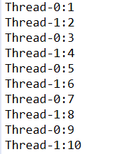

# day17_课后练习

## 第1题

案例：在子线程中输出1-100之间的偶数，主线程输出1-100之间的奇数。

效果如下：


```java
package com.atguigu.test01;

public class Test01 {
	public static void main(String[] args) {
		new Thread("子线程"){
			public void run(){
				for (int i = 0; i <= 100; i+=2) {
					System.out.println(getName() + "-->" + i);
				}
			}
		}.start();
		
		for (int i = 1; i <= 100; i+=2) {
			System.out.println("main主线程 -->" + i);
		}
	}
}

```


## 第2题

案例：创建和启动2个子线程，一个打印1-10之间奇数，一个打印1-10之间偶数，

（1）要求每个线程要么不打印，要么就连续打印5个数，每个数打印间隔500毫秒

（2）但两个线程不要求交替打印。

效果如下：


```java
package com.atguigu.test02;

public class Test02 {
	public static void main(String[] args) {
		new PrintEven().start();
		new PrintOdd().start();
	}
}
class PrintEven extends Thread{
	private int num = 1;
	public void run(){
		while(true){
			synchronized (Thread.class) {
				for (int i = 1; i <= 5; i++) {
					num+=2;
					System.out.println("偶数线程，第" + i + "个：" + num);
					try {
						Thread.sleep(500);
					} catch (InterruptedException e) {
						e.printStackTrace();
					}
				}
			}
			
		}
	}
}
class PrintOdd extends Thread{
	private int num = 2;
	public void run(){
		while(true){
			synchronized (Thread.class) {
				for (int i = 1; i <= 5; i++) {
					num+=2;
					System.out.println("奇数线程，第" + i + "个：" + num);
					try {
						Thread.sleep(500);
					} catch (InterruptedException e) {
						e.printStackTrace();
					}
				}
			}
		}
	}
}
```


## 第3题

案例：创建和启动2个子线程，一个打印奇数，一个打印偶数，

（1）要求实现交替打印。

（2）每个数打印间隔1秒

效果如下：



```java
package com.atguigu.test03;

public class Test03 {
	public static void main(String[] args) {
		new PrintNumber().start();
		new PrintNumber().start();
	}
}
class PrintNumber extends Thread{
	private static int num;
	public void run(){
		while(true){
			synchronized (PrintNumber.class) {
				try {
					PrintNumber.class.notify();
					Thread.sleep(1000);
					System.out.println(getName() + ":" + ++num); 
					PrintNumber.class.wait();
				} catch (InterruptedException e) {
					e.printStackTrace();
				}
			}
		}
	}
}
```


## 第4题

案例：

​	1、创建一个银行账户类，

​	（1）属性：账号，余额，

​	（2）get/set，

​	（3）toString()：返回：账户：xxx，余额：xxx

​	2、创建一个丈夫类

​		负责往里存钱，每次存款[0,10000)以内不等

​	3、创建一个妻子类

​		负责取钱，每次取款[0,10000)以内不等，如果余额不足，要等丈夫存够了才能取


```java
package com.atguigu.test04;

public class Test04 {
	public static void main(String[] args) {
		Account a = new Account("1122",0);
		
		new Wife(a).start();
		new Husband(a).start();
	}
}
class Account{
	private String id;
	private double balance;
	public Account(String id, double balance) {
		super();
		this.id = id;
		this.balance = balance;
	}
	public String getId() {
		return id;
	}
	public void setId(String id) {
		this.id = id;
	}
	public double getBalance() {
		return balance;
	}
	public void setBalance(double balance) {
		this.balance = balance;
	}
	@Override
	public String toString() {
		return "账户：" + id + ",余额：" + balance ;
	}
}
class Wife extends Thread{
	private Account account;
	
	public Wife(Account account) {
		super();
		this.account = account;
	}

	public void run(){
		while(true){
			synchronized (Thread.class) {
				double money = Math.random() * 10000;
				while(money > account.getBalance()){
					System.out.println("本次妻子想取钱：" + money +"，但是余额不足，等待...");
					try {
						Thread.class.wait();
					} catch (InterruptedException e) {
						e.printStackTrace();
					}
				}
				System.out.println("妻子开始取钱，目前账户状态：" + account);
				System.out.println("本次妻子取钱：" + money);
				account.setBalance(account.getBalance() - money);
				System.out.println("妻子取钱结束，目前账户状态：" + account);
				System.out.println();
				try {
					Thread.sleep(1000);
				} catch (InterruptedException e) {
					e.printStackTrace();
				}
			}
			
		}
	}
}
class Husband extends Thread{
	private Account account;
	
	public Husband(Account account) {
		super();
		this.account = account;
	}

	public void run(){
		while(true){
			synchronized (Thread.class) {
				double money = Math.random() * 10000;
				System.out.println("丈夫开始存钱，目前账户状态：" + account);
				System.out.println("本次丈夫存钱：" + money);
				account.setBalance(account.getBalance() + money);
				System.out.println("丈夫开始结束，目前账户状态：" + account);
				System.out.println();
				try {
					Thread.sleep(1000);
				} catch (InterruptedException e) {
					e.printStackTrace();
				}
				Thread.class.notify();
			}
			
		}
	}
}
```


## 第5题

案例：请按要求编写多线程应用程序，模拟多个人通过一个山洞：

​	1、这个山洞每次只能通过一个人，每个人通过山洞的时间为5秒；

​	2、随机生成10个人，同时准备过此山洞

​	3、定义一个变量用于记录通过隧道的人数

​	4、显示每次通过山洞人的姓名，和通过顺序；

**操作步骤描述**

​	1.定义一个隧道类，实现Runnable接口：

​		1.1 定义一个变量，用来记录通过隧道的人数；

​		1.2 重写Runnable的run方法；

​		1.3 定义一个同步方法，模拟每个人通过隧道需要5秒钟：

​			1.3.1 打印“xx开始通过隧道...”

​			1.3.2 子线程睡眠5秒钟，模拟每个人通过隧道需要5秒钟；

​			1.3.3 改变通过的人次；

​			1.3.4 打印线程名称及其通过隧道的顺序，模拟人通过隧道及其顺序；

​		1.4 调用通过隧道的方法；

​	2.定义一个测试类：

​		2.1 在main方法中创建一个隧道类对象；

​		2.2 在main方法中，循环创建10个子线程对象，通过构造方法把隧道对象

​		    和线程名（作为人的姓名）传递进去，并开启子线程；


```java
package com.atguigu.test05;

public class Tunnel implements Runnable {
	// 1.1 定义一个变量，用来记录通过隧道的人数
	private int crossNum = 0;

	/*
	 * 1.2 重写Runnable的run方法
	 */
	@Override
	public void run() {
		// 1.4 调用通过隧道的方法
		cross();
	}

	/*
	 * 1.3 定义一个同步方法，模拟每个人通过隧道需要5秒钟
	 */
	public synchronized void cross() {
		//1.3.1 打印 xx开始通过隧道...
		System.out.println(Thread.currentThread().getName() + "开始通过隧道...");
		// 1.3.2 子线程睡眠5秒钟，模拟每个人通过隧道需要5秒钟
		try {
			Thread.sleep(5000);
		} catch (InterruptedException e) {
			e.printStackTrace();
		}
		// 1.3.3 改变通过的人次
		crossNum++;
		// 1.3.4 打印线程名称及其通过隧道的顺序，模拟人通过隧道及其顺序
		System.out.println(Thread.currentThread().getName() + "已经通过隧道，TA是第" + crossNum + "通过的！");
	}
}

```

```java
package com.atguigu.test05;

public class Test05 {
	public static void main(String[] args) {
		// 2.1 在main方法中创建一个隧道类对象
		Tunnel tul = new Tunnel();

		// 2.2 在main方法中，循环创建10个子线程对象，通过构造方法把隧道对象和// 线程名（作为人的姓名）传递进去，并开启子线程
		for (int i = 1; i <= 10; i++) {
			Thread t = new Thread(tul, "p" + i);
			t.start();
		}
	}
}

```

