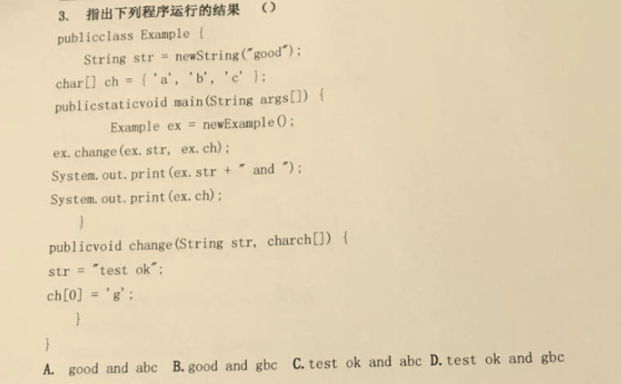

# day18_课后练习

# 编程题

## 第1题

* 反转键盘录入的字符串。
* 代码实现，效果如图所示：


## 第2题

* 键盘录入QQ号码，验证格式的正确性。
  * 必须是5—12位数字。
  * 0不能开头。

* 代码实现，效果如图所示：

  

## 第3题

* 字符串查找。
  * 键盘录入一个大字符串，再录入一个小字符串。
  * 统计小字符串在大字符串中出现的次数。

* 代码实现，效果如图所示：

  

## 第4题

* 替换某字符串中的某字符串。

  * 键盘录入一个srcStr字符串，再录入一个delStr字符串。
  * 删除该字srcStr符串中的所有delStr字符串。

* 代码实现，部分效果如图所示：

  

## 第5题

* 生成一个随机100内小数，转换为保留两位小数的字符串，不考虑四舍五入的问题。

* 代码实现，效果如图所示：

  

## 第6题

* 筛选字符串。

  * 定义数组，存入多个字符串。
  * 删除长度大于5的字符串，打印删除后的数组。

* 代码实现，效果如图所示：

  

## 第7题

* 判断回文字符串。如果一个字符串，从前向后读和从后向前读，都是一个字符串，称为回文串，比如mom，dad，noon。

* 代码实现，效果如图所示：

  

## 第8题

* 校验密码是否合法。

  * 必须至少9个字符。
  * 必须至少2个大写字符。
  * 必须只有小写字母和数字。

* 代码实现，效果如图所示：

  

## 第9题

* 模拟用户登录。
  * 定义用户类，属性为用户名和密码。
  * 使用数组存储多个用户对象。
  * 录入用户和密码，对比用户信息，匹配成功登录成功，否则登录失败。
  * 登录失败时，当用户名错误，提示没有该用户。
  * 登录失败时，当密码错误时，提示密码有误。
* 代码实现，效果如图所示：


## 第10题

* 定义Handleable接口，具备一个处理字符串数字的抽象方法方法String handleString(String num);
  * 处理方式1：取整数部分。
  * 处理方式2：保留指定位小数，四舍五入。
* 代码实现，效果如图所示：


开发提示：

* 匿名内部类的方式，调用所有抽象方法。

## 第11题


案例：有一个字符串String abc = “342567891”，请写程序将字符串abc进行升序，可以使用JDK API中的现有的功能方法。

## 第12题

案例：

​	已知一个字符串String str = "1、 hello 2. world 3. java 4.String 5. haha 6、HELLO";

​	要求统计出现次数最多的字母及其出现的次数。不区分大小写。


## 第13题

案例：已知字符串String str = "1.hello2.world3.java4.string";要求拆分出每一个单词，并遍历显示


# 代码阅读题

## 第14题

```java
	public static void main(String[] args) {
		String str = new String("world");
		char[] ch = new char[]{'h','e','l','l','o'};
		change(str,ch);
		System.out.println(str);
		System.out.println(String.valueOf(ch));
	}
	public static void change(String str, char[] arr){
		str = "change";
		arr[0] = 'a';
		arr[1] = 'b';
		arr[2] = 'c';
		arr[3] = 'd';
		arr[4] = 'e';
	}
```

## 第15题

```java
	public static void main(String[] args) {
		Integer i1 = 128;
		Integer i2 = 128;
		int i3 = 128;
		int i4 = 128;
		System.out.println(i1 == i2);
		System.out.println(i3 == i4);
		System.out.println(i1 == i3);
	}
```

## 第16题

```java
	public static void main(String[] args) {
		double a = 2.0;
		double b = 2.0;
		Double c = 2.0;
		Double d = 2.0;
		System.out.println(a == b);
		System.out.println(c == d);
		System.out.println(a == d);
	}
```

## 第17题

```java
public class Test {
	int a;
	int b;
    String str;
	public void f(){
		a = 0;
		b = 0;
        str = "hello";
		int[] c = {0};
		g(b,c);
		System.out.println(a + " " + b + " " + c[0] + "," + str);
	}
	public void g(int b, int[] c,String s){
		a = 1;
		b = 1;
		c[0] = 1;
        s = "world";
	}
	public static void main(String[] args) {
		Test t = new Test();
		t.f();
	}
}
```

## 第18题


## 第19题



## 第20题


## 第21题


## 第22题


# 扩展题

## 第23题

案例：

​	获取两个字符串中最大相同子串。比如：

   	str1 = "abcwerthelloyuiodef“;str2 = "cvhellobnm"的最大相同子串是"hello"

