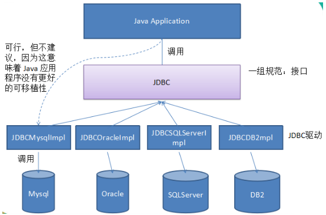

# 第一章  JDBC概述

## 1.1 JDBC概述

JDBC：Java Database Connectivity，它是代表一组独立于任何数据库管理系统（DBMS）的API，声明在java.sql与javax.sql包中，是SUN(现在Oracle)提供的一组接口规范。由各个数据库厂商来提供实现类，这些实现类的集合构成了数据库驱动jar。

JDBC JavaDatabase Connectivity  数据库连接 



## 1.2 JDBC使用步骤

使用步骤：

1、注册驱动

三部曲：

（1）将DBMS数据库管理软件的驱动jar拷贝到项目的libs目录中

例如：mysql-connector-java-5.1.36-bin.jar

（2）把驱动jar添加到项目的build path中

（3）将驱动类加载到内存中

Class.forName("com.mysql.jdbc.Driver");

2、获取Connection连接对象

Connection conn = DriverManager.getConnection(url,username,password);

mysql的url：jdbc:mysql://localhost:3306/数据库名?参数名=参数值

3、执行sql并处理结果

（1）编写sql

（2）创建Statement或PreparedStatement对象

（3）执行sql

增删改：调用executeUpate方法

查询：调用executeQuery方法

（4）处理结果

增删改：返回的是整数值

查询：返回ResultSet结果，需要使用next()和getXxx()结合进行遍历

4、释放连接等


相关的API：

1、DriverManager：驱动管理类

2、Connection：代表数据库连接

3、Statement和PreparedStatement：用来执行sql

​	执行增、删、改：int executeUpate()

​	执行查询：ResultSet executeQuery()

4、如何遍历ResultSet ？

​	（1）boolean next()：判断是否还有下一行

​	（2）getString(字段名或序号),getInt(字段名或序号),getObject(字段名或序号)

示例代码1：增、删、改

```java
public class TestJDBC {
	public static void main(String[] args) throws ClassNotFoundException, SQLException {
		//1、注册驱动
		//(1)方式一：Class.forName("驱动类的全名称")
		Class.forName("com.mysql.jdbc.Driver");
//		(2)创建驱动类的对象
//		new com.mysql.jdbc.Driver();//硬编码
		//(3)通过DriverManager注册驱动
//		DriverManager.registerDriver(new com.mysql.jdbc.Driver());//硬编码
		
		//2、获取连接，连接数据库
        //TCP/IP协议编程，需要服务器的IP地址和端口号
		//mysql的url格式：jdbc协议:子协议://主机名:端口号/要连接的数据库名
		String url = "jdbc:mysql://localhost:3306/test";//其中test是数据库名
		String user = "root";
		String password = "123456";
		Connection conn = DriverManager.getConnection(url, user, password);
	
		//3、执行sql
		//添加一个部门到数据库的t_department表中
		//(1)编写sql
		String sql = "insert into t_department values(null,'计算部2','计算钞票2')";
		/*
		 * 回忆：	TCP/IP程序时
		 * Socket代表连接
		 * socket.getOutputStream()来发送数据，
		 * socket.getInputStream()来接收数据
		 * 
		 * 可以把Connection比喻成Socket
		 *    把Statement比喻成OutputStream
		 */
		//(2)获取Statement对象
		Statement st = conn.createStatement();
		//(3)执行sql
		int len = st.executeUpdate(sql);
		//(4)处理结果
		System.out.println(len>0?"成功":"失败");
		
		//4、关闭
		st.close();
		conn.close();
	}
}
```

示例代码2：查询

```java
public class TestSelect {
	public static void main(String[] args) throws Exception{
		// 1、注册驱动
		Class.forName("com.mysql.jdbc.Driver");

		// 2、连接数据库
		Connection conn = DriverManager.getConnection("jdbc:mysql://localhost:3306/test", "root", "123456");

		// 3、执行sql
		String sql = "SELECT * FROM t_department";
		Statement st = conn.createStatement();
		
		ResultSet rs = st.executeQuery(sql);//ResultSet看成InputStream
		while(rs.next()){//next()表示是否还有下一行
			Object did = rs.getObject(1);//获取第n列的值
			Object dname = rs.getObject(2);
			Object desc = rs.getObject(3);
			/*
			int did = rs.getInt("did");//也可以根据列名称，并且可以按照数据类型获取
			String dname = rs.getString("dname");
			String desc = rs.getString("description");
			 */
			
			System.out.println(did +"\t" + dname + "\t"+ desc);
		}

		// 4、关闭
		rs.close();
		st.close();
		conn.close();
	}
}
```

# 第二章  使用PreparedStatement处理CRUD

## 2.1 通过PreparedStatement来解决Statement的问题

Statement的问题：通过PreparedStatement来代替

（1）sql拼接

```java
		String sql = "insert into t_employee(ename,tel,gender,salary) values('" + ename + "','" + tel + "','" + gender + "'," + salary +")";
		Statement st = conn.createStatement();
		int len = st.executeUpdate(sql);
```

（2）sql注入

```java
		String sql = "SELECT * FROM t_employee where ename='" + ename + "'";
		//如果我此时从键盘输入ename值的时候，输入：张三' or '1'= '1
		//结果会把所有数据都查询出来
		Statement st = conn.createStatement();
		ResultSet rs = st.executeQuery(sql);
```

（3）处理blob等类型的数据

```java
String sql = "insert into user(username,photo) values('chailinyan', 图片字节流)";
//此时photo是blob类型的数据时，无法在sql中直接拼接
```

PreparedStatement解决问题：

（1）避免sql拼接

```java
		String sql = "insert into t_employee(ename,tel,gender,salary) values(?,?,?,?)";
		PreparedStatement pst = conn.prepareStatement(sql);//这里要传带？的sql，然后mysql端就会对这个sql进行预编译
		
		//设置？的具体值
		/*pst.setString(1, ename);
		pst.setString(2, tel);
		pst.setString(3, gender);
		pst.setDouble(4, salary);*/
		
		pst.setObject(1, ename);
		pst.setObject(2, tel);
		pst.setObject(3, gender);
		pst.setObject(4, salary);
		
		int len = pst.executeUpdate();//此处不能传sql
		System.out.println(len);
```

（2）不会有sql注入

```java
		String sql = "SELECT * FROM t_employee where ename=?";
		//即使输入'张三' or '1'= '1'也没问题
		PreparedStatement pst = conn.prepareStatement(sql);
		
		//中间加入设置？的值
		pst.setObject(1, ename);
		
		ResultSet rs = pst.executeQuery();
```

（3）处理blob类型的数据

```java
		String sql = "insert into user(username,photo) values(?,?)";
		PreparedStatement pst = conn.prepareStatement(sql);
		
		//设置？的值
		pst.setObject(1, "chailinyan");
		FileInputStream fis = new FileInputStream("D:/QMDownload/img/美女/15.jpg");
		pst.setBlob(2, fis);
		
		int len = pst.executeUpdate();
		System.out.println(len>0?"成功":"失败");
```

 * 注意两个问题：

   ①my.ini关于上传的字节流文件有大小限制，可以在my.ini中配置变量

   ​	max_allowed_packet=16M

   ②每一种blob有各自大小限制：

   tinyblob:255字节、blob:65k、mediumblob:16M、longblob:4G

## 2.2 获取自增长键值

```java
/*
 * 我们通过JDBC往数据库的表格中添加一条记录，其中有一个字段是自增的，那么在JDBC这边怎么在添加之后直接获取到这个自增的值
 * PreparedStatement是Statement的子接口。
 * Statement接口中有一些常量值：
 * （1）Statement.RETURN_GENERATED_KEYS
 * 
 * 要先添加后获取到自增的key值：
 * （1）PreparedStatement pst = conn.prepareStatement(sql,Statement.RETURN_GENERATED_KEYS);
 * （2）添加sql执行完成后,通过PreparedStatement的对象调用getGeneratedKeys()方法来获取自增长键值，遍历结果集
 * 		ResultSet rs = pst.getGeneratedKeys();
 */
public class TestAutoIncrement {
	public static void main(String[] args) throws Exception{
		//1、注册驱动
		Class.forName("com.mysql.jdbc.Driver");
		
		//2、获取连接
		Connection conn = DriverManager.getConnection("jdbc:mysql://localhost:3306/test", "root", "123456");
		
		//3、执行sql
		String sql = "insert into t_department values(null,?,?)";
		/*
		 * 这里在创建PreparedStatement对象时，传入第二个参数的作用，就是告知服务器端
		 * 当执行完sql后，把自增的key值返回来。
		 */
		PreparedStatement pst = conn.prepareStatement(sql,Statement.RETURN_GENERATED_KEYS);
		
		//设置？的值
		pst.setObject(1, "测试部");
		pst.setObject(2, "测试项目数据");
		
		//执行sql
		int len = pst.executeUpdate();//返回影响的记录数
		if(len>0){
			//从pst中获取到服务器端返回的键值
			ResultSet rs = pst.getGeneratedKeys();
			//因为这里的key值可能多个，因为insert语句可以同时添加多行，所以用ResultSet封装
			//这里因为只添加一条，所以用if判断
			if(rs.next()){
				Object key = rs.getObject(1);
				System.out.println("自增的key值did =" + key);
			}
		}
			
		//4、关闭
		pst.close();
		conn.close();
	}
}
```

## 2.3 批处理

```java
/*
 * 批处理：
 * 	批量处理sql
 * 
 * 例如：
 * （1）订单明细表的多条记录的添加
 * （2）批量添加模拟数据
 * ...
 * 
 * 不用批处理，和用批处理有什么不同？
 * 批处理的效率很多
 * 
 * 如何进行批处理操作？
 * （1）在url中要加一个参数
 *     rewriteBatchedStatements=true
 *     那么我们的url就变成了  jdbc:mysql://localhost:3306/test?rewriteBatchedStatements=true
 *     这里的?，表示?后面是客户端给服务器端传的参数，多个参数直接使用&分割
 * （2）调用方法不同
 * pst.addBatch();
 * int[] all = pst.executeBatch();
 * 
 * 注意：如果批量添加时，insert使用values,不要使用value
 */
public class TestBatch {
	
	public static void main(String[] args) throws Exception{
		long start = System.currentTimeMillis();
		//例如：在部门表t_department中添加1000条模拟数据
		//1、注册驱动
		Class.forName("com.mysql.jdbc.Driver");
		
		//2、获取连接
		Connection conn = DriverManager.getConnection("jdbc:mysql://localhost:3306/test?rewriteBatchedStatements=true", "root", "123456");
		
		//3、执行sql
		String sql = "insert into t_department values(null,?,?)";
		PreparedStatement pst = conn.prepareStatement(sql);
		
		//设置？的值
		for (int i = 1; i <=1000; i++) {
			pst.setObject(1, "模拟部门"+i);
			pst.setObject(2, "模拟部门的简介"+i);
			
			pst.addBatch();//添加到批处理一组操作中，攒一块处理
/*			if(i % 500 == 0){//有时候也攒一部分，执行一部分
				//2.执行
				pst.executeBatch();
				//3.清空
				pst.clearBatch();
			}*/
		}
		pst.executeBatch();
		
		//4、关闭
		pst.close();
		conn.close();
		
		long end = System.currentTimeMillis();
		System.out.println("耗时：" + (end - start));//耗时：821
	}
}
```

## 2.4 事务

```java
/*
 * mysql默认每一个连接是自动提交事务的。
 * 那么当我们在JDBC这段，如果有多条语句想要组成一个事务一起执行的话，那么在JDBC这边怎么设置手动提交事务呢？
 * (1)在执行之前，设置手动提交事务
 * Connection的对象.setAutoCommit(false)
 * (2)成功：
 * Connection的对象.commit();
 * 失败：
 * Connection的对象.rollback();
 * 
 * 补充说明：
 * 为了大家养成要的习惯，在关闭Connection的对象之前，把连接对象设置回自动提交
 * (3)Connection的对象.setAutoCommit(true)
 * 
 * 因为我们现在的连接是建立新的连接，那么如果没有还原为自动提交，没有影响。
 * 但是我们后面实际开发中，每次获取的连接，不一定是新的连接，而是从连接池中获取的旧的连接，而且你关闭也不是真关闭，
 * 而是还给连接池，供别人接着用。以防别人拿到后，以为是自动提交的，而没有commit，最终数据没有成功。
 */
public class TestTransaction {
	public static void main(String[] args) throws Exception{
		/*
		 * 一般涉及到事务处理的话，那么业务逻辑都会比较复杂。
		 * 例如：购物车结算时：
		 * （1）在订单表中添加一条记录
		 * （2）在订单明细表中添加多条订单明细的记录（表示该订单买了什么东西）
		 * （3）修改商品表的销量和库存量
		 * ...
		 * 那么我们今天为了大家关注事务的操作，而不会因为复杂的业务逻辑的影响导致我们的理解，那么我们这里故意
		 * 用两条修改语句来模拟组成一个简单的事务。
		 * update t_department set description = 'xx' where did = 2;
		 * update t_department set description = 'yy' where did = 3;
		 * 
		 * 我希望这两天语句要么一起成功，要么一起回滚
		 * 为了制造失败，我故意把第二条语句写错
		 * update t_department set description = 'yy' （少了where） did = 3;
		 */
		
		//1、注册驱动
		Class.forName("com.mysql.jdbc.Driver");
		
		//2、获取连接
		Connection conn = DriverManager.getConnection("jdbc:mysql://localhost:3306/test", "root", "123456");
		
		//设置手动提交事务
		conn.setAutoCommit(false);
		
		//3、执行sql
		String sql1 = "update t_department set description = 'xx' where did = 2";
		String sql2 = "update t_department set description = 'yy' did = 3";//这是错的
		
		//使用prepareStatement的sql也可以不带?
		PreparedStatement pst = null;
		try {
			pst = conn.prepareStatement(sql1);
			int len = pst.executeUpdate();
			System.out.println("第一条：" + (len>0?"成功":"失败"));
			
			pst = conn.prepareStatement(sql2);
			len = pst.executeUpdate();
			System.out.println("第二条：" + (len>0?"成功":"失败"));
			
			//都成功了，就提交事务
			System.out.println("提交");
			conn.commit();
		} catch (Exception e) {
			System.out.println("回滚");
			//失败要回滚
			conn.rollback();
		}
		
		//4、关闭
		pst.close();
		conn.setAutoCommit(true);//还原为自动提交
		conn.close();
	}
}
```

# 第三章  数据库连接池

1、什么是数据库连池
连接对象的缓冲区。负责申请，分配管理，释放连接的操作。

2、为什么要使用数据库连接池

不使用数据库连接池，每次都通过DriverManager获取新连接，用完直接抛弃断开，连接的利用率太低，太浪费。
对于数据库服务器来说，压力太大了。我们数据库服务器和Java程序对连接数也无法控制，很容易导致数据库服务器崩溃。

我们就希望能管理连接。
我们可以建立一个连接池，这个池中可以容纳一定数量的连接对象，一开始，我们可以先替用户先创建好一些连接对象，
等用户要拿连接对象时，就直接从池中拿，不用新建了，这样也可以节省时间。然后用户用完后，放回去，别人可以接着用。
可以提高连接的使用率。当池中的现有的连接都用完了，那么连接池可以向服务器申请新的连接放到池中。
直到池中的连接达到“最大连接数”，就不能在申请新的连接了，如果没有拿到连接的用户只能等待。

3、市面上有很多现成的数据库连接池技术：

* JDBC 的数据库连接池使用 javax.sql.DataSource 来表示，DataSource 只是一个接口（通常被称为数据源），该接口通常由服务器(Weblogic, WebSphere, Tomcat)提供实现，也有一些开源组织提供实现：
  * **DBCP** 是Apache提供的数据库连接池，**速度相对c3p0较快**，但因自身存在BUG，Hibernate3已不再提供支持
  * **C3P0** 是一个开源组织提供的一个数据库连接池，**速度相对较慢，稳定性还可以**
  * **Proxool** 是sourceforge下的一个开源项目数据库连接池，有监控连接池状态的功能，**稳定性较c3p0差一点**
  * **BoneCP** 是一个开源组织提供的数据库连接池，速度快
  * **Druid** 是阿里提供的数据库连接池，据说是集DBCP 、C3P0 、Proxool 优点于一身的数据库连接池

4、阿里的德鲁伊连接池技术

（1）加入jar包

例如：druid-1.1.10.jar

（2）代码步骤

第一步：建立一个数据库连接池

第二步：设置连接池的参数

第三步：获取连接

```java
public class TestPool {
	public static void main(String[] args) throws SQLException {
		//1、创建数据源（数据库连接池）对象
		DruidDataSource ds =new DruidDataSource();
		
		//2、设置参数
		//(1)设置基本参数
		ds.setDriverClassName("com.mysql.jdbc.Driver");
		ds.setUrl("jdbc:mysql://localhost:3306/test");
		ds.setUsername("root");
		ds.setPassword("123456");
		
		//(2)设置连接数等参数
		ds.setInitialSize(5);//一开始提前申请好5个连接，不够了，重写申请
		ds.setMaxActive(10);//最多不超过10个，如果10都用完了，还没还回来，就会出现等待
		ds.setMaxWait(1000);//用户最多等1000毫秒，如果1000毫秒还没有人还回来，就异常了
		
		//3、获取连接
		for (int i = 1; i <=15; i++) {
			Connection conn = ds.getConnection();
			System.out.println("第"+i+"个：" + conn);
			
			//如果这里没有关闭，就相当于没有还
//			conn.close();#这里关闭，是还回池中
		}
	}
}
```

| **配置**                      | **缺省** | **说明**                                                     |
| ----------------------------- | -------- | ------------------------------------------------------------ |
| name                          |          | 配置这个属性的意义在于，如果存在多个数据源，监控的时候可以通过名字来区分开来。 如果没有配置，将会生成一个名字，格式是：”DataSource-” + System.identityHashCode(this) |
| jdbcUrl                       |          | 连接数据库的url，不同数据库不一样。例如：mysql : jdbc:mysql://10.20.153.104:3306/druid2 oracle : jdbc:oracle:thin:@10.20.149.85:1521:ocnauto |
| username                      |          | 连接数据库的用户名                                           |
| password                      |          | 连接数据库的密码。如果你不希望密码直接写在配置文件中，可以使用ConfigFilter。详细看这里：<https://github.com/alibaba/druid/wiki/%E4%BD%BF%E7%94%A8ConfigFilter> |
| driverClassName               |          | 根据url自动识别 这一项可配可不配，如果不配置druid会根据url自动识别dbType，然后选择相应的driverClassName(建议配置下) |
| initialSize                   | 0        | 初始化时建立物理连接的个数。初始化发生在显示调用init方法，或者第一次getConnection时 |
| maxActive                     | 8        | 最大连接池数量                                               |
| maxIdle                       | 8        | 已经不再使用，配置了也没效果                                 |
| minIdle                       |          | 最小连接池数量                                               |
| maxWait                       |          | 获取连接时最大等待时间，单位毫秒。配置了maxWait之后，缺省启用公平锁，并发效率会有所下降，如果需要可以通过配置useUnfairLock属性为true使用非公平锁。 |
| poolPreparedStatements        | false    | 是否缓存preparedStatement，也就是PSCache。PSCache对支持游标的数据库性能提升巨大，比如说oracle。在mysql下建议关闭。 |
| maxOpenPreparedStatements     | -1       | 要启用PSCache，必须配置大于0，当大于0时，poolPreparedStatements自动触发修改为true。在Druid中，不会存在Oracle下PSCache占用内存过多的问题，可以把这个数值配置大一些，比如说100 |
| validationQuery               |          | 用来检测连接是否有效的sql，要求是一个查询语句。如果validationQuery为null，testOnBorrow、testOnReturn、testWhileIdle都不会其作用。 |
| testOnBorrow                  | true     | 申请连接时执行validationQuery检测连接是否有效，做了这个配置会降低性能。 |
| testOnReturn                  | false    | 归还连接时执行validationQuery检测连接是否有效，做了这个配置会降低性能 |
| testWhileIdle                 | false    | 建议配置为true，不影响性能，并且保证安全性。申请连接的时候检测，如果空闲时间大于timeBetweenEvictionRunsMillis，执行validationQuery检测连接是否有效。 |
| timeBetweenEvictionRunsMillis |          | 有两个含义： 1)Destroy线程会检测连接的间隔时间2)testWhileIdle的判断依据，详细看testWhileIdle属性的说明 |
| numTestsPerEvictionRun        |          | 不再使用，一个DruidDataSource只支持一个EvictionRun           |
| minEvictableIdleTimeMillis    |          |                                                              |
| connectionInitSqls            |          | 物理连接初始化的时候执行的sql                                |
| exceptionSorter               |          | 根据dbType自动识别 当数据库抛出一些不可恢复的异常时，抛弃连接 |
| filters                       |          | 属性类型是字符串，通过别名的方式配置扩展插件，常用的插件有： 监控统计用的filter:stat日志用的filter:log4j防御sql注入的filter:wall |
| proxyFilters                  |          | 类型是List，如果同时配置了filters和proxyFilters，是组合关系，并非替换关系 |

# 第四章  封装JDBCTools

配置文件：src/jdbc.properties

```properties
#key=value
driverClassName=com.mysql.jdbc.Driver
url=jdbc:mysql://localhost:3306/test
username=root
password=123456
initialSize=5
maxActive=10
maxWait=1000
```

JDBCTools工具类：

```java
package com.atguigu.util;

import java.sql.Connection;
import java.sql.SQLException;
import java.util.Properties;

import javax.sql.DataSource;

import com.alibaba.druid.pool.DruidDataSourceFactory;

/*
 * 获取连接或释放连接的工具类
 */
public class JDBCTools {
	// 1、数据源,即连接池
	private static DataSource dataSource;
	
	// 2、ThreadLocal对象
	private static ThreadLocal<Connection> threadLocal;

	static {
		try {
			//1、读取druip.properties文件
			Properties pro = new Properties();
			pro.load(JDBCTools.class.getClassLoader().getResourceAsStream("druid.properties"));
			
			//2、连接连接池
			dataSource = DruidDataSourceFactory.createDataSource(pro);

			//3、创建线程池
			threadLocal = new ThreadLocal<>();
		} catch (Exception e) {
			e.printStackTrace();
		}
	}

	/**
	 * 获取连接的方法
	 * 
	 * @return
	 * @throws SQLException
	 */
	public static Connection getConnection() {
		// 从当前线程中获取连接
		Connection connection = threadLocal.get();
		if (connection == null) {
			// 从连接池中获取一个连接
			try {
				connection = dataSource.getConnection();
				// 将连接与当前线程绑定
				threadLocal.set(connection);
			} catch (SQLException e) {
				e.printStackTrace();
			}
		}
		return connection;
	}

	/**
	 * 释放连接的方法
	 * 
	 * @param connection
	 */
	public static void releaseConnection() {
		// 获取当前线程中的连接
		Connection connection = threadLocal.get();
		if (connection != null) {
			try {
				connection.close();
				// 将已经关闭的连接从当前线程中移除
				threadLocal.remove();
			} catch (SQLException e) {
				e.printStackTrace();
			}
		}
	}
}
```

其中ThreadLocal的介绍如下：

JDK 1.2的版本中就提供java.lang.ThreadLocal，为解决多线程程序的并发问题提供了一种新的思路。使用这个工具类可以很简洁地编写出优美的多线程程序。通常用来在在多线程中管理共享数据库连接、Session等

ThreadLocal用于保存某个线程共享变量，原因是在Java中，每一个线程对象中都有一个ThreadLocalMap<ThreadLocal, Object>，其key就是一个ThreadLocal，而Object即为该线程的共享变量。而这个map是通过ThreadLocal的set和get方法操作的。对于同一个static ThreadLocal，不同线程只能从中get，set，remove自己的变量，而不会影响其他线程的变量。

1、ThreadLocal.get: 获取ThreadLocal中当前线程共享变量的值。

2、ThreadLocal.set: 设置ThreadLocal中当前线程共享变量的值。

3、ThreadLocal.remove: 移除ThreadLocal中当前线程共享变量的值。

# 第五章  封装BasicDAOImpl

```java
package com.atguigu.test08.dao;

import java.lang.reflect.Field;
import java.sql.Connection;
import java.sql.PreparedStatement;
import java.sql.ResultSet;
import java.sql.ResultSetMetaData;
import java.sql.SQLException;
import java.util.ArrayList;

import com.atguigu.test06.threadlocal.JDBCTools2;

/*
 * 提供增、删、改、查所有表的通用方法
 */
public class BasicDAO1 {
	/*
	 * 通用的增、删、改的方法
	 */
	protected int update(String sql,Object... args) throws SQLException{
		//1、获取连接对象
		Connection conn = JDBCTools2.getConnection();
		//2、编写sql，用形参传入的方式代替
		
		//3、获取Statement或PreparedStatement对象
		PreparedStatement pst = conn.prepareStatement(sql);
		
		//设置？的值
		//因为不知道sql中是否有?，以及？设置为什么值，通过形参来传入
		//Object... args可变形参，可以传入0~n个值
		//如果没有传入，说明没有？需要设置
		//如果传入了n个值，那么说明sql中有n个？需要设置
		if(args!=null  && args.length>0){
			for (int i = 0; i < args.length; i++) {
				//数组的下标从0开始，pst的？的序号是从1开始，所以这里用i+1
				pst.setObject(i+1, args[i]);
			}
		}
		
		//4、执行sql
		int len = pst.executeUpdate();
		//5、关闭		
		pst.close();
		JDBCTools2.free();
		
		return len;
	}
	
	/*
	 * 通用查询多个Javabean对象的方法
	 */
	protected <T> ArrayList<T> getList(Class<T> clazz,String sql,Object... args) throws Exception{
		//1、获取连接
		Connection conn = JDBCTools2.getConnection();
		
		//2、编写sql，由形参传入
		
		//3、获取PreparedStatement对象
		PreparedStatement pst = conn.prepareStatement(sql);
		
		//4、设置？，由形参传入
		if(args!=null  && args.length>0){
			for (int i = 0; i < args.length; i++) {
				//数组的下标从0开始，pst的？的序号是从1开始，所以这里用i+1
				pst.setObject(i+1, args[i]);
			}
		}
		
		//5、执行sql
		ResultSet rs = pst.executeQuery();
		/*
		 * 如何把ResultSet结果集中的数据变成一个一个的Javabean对象，放到ArrayList对象，并且返回
		 */
		ArrayList<T> list = new ArrayList<>();
		/*
		 * 要从ResultSet结果集中获取一共有几行，决定要创建几个对象
		 * 要从ResultSet结果集中获取一共有几列，决定要为几个属性赋值
		 * ResultSet结果集对象中，有一个方法ResultSetMetaData getMetaData()获取结果集的元数据
		 * 元数据就是描述结果集中的数据的数据，例如：列数，列名称等
		 */
		ResultSetMetaData metaData = rs.getMetaData();
		int count = metaData.getColumnCount();//获取列数
		
		while(rs.next()){//循环一次代表一行，就要创建一个Javabean对象
			//(1)创建一个Javabean对象
			T t  = clazz.newInstance();//这个方法有要求，要求Javabean这个类要有无参构造
			
			//(2)设置对象的属性值
			/*
			 * 反射操作属性的步骤：
			 * ①获取Class对象，现在有了
			 * ②获取属性对象Field
			 * 		Field f = clazz.getDeclaredField("属性名");
			 * ③创建Javabean对象，已经创建
			 * ④设置属性的可访问性  setAccessible(true)
			 * ⑤设置属性的值
			 */
			for (int i = 0; i < count; i++) {//一共要为count个属性赋值
//				Field f = clazz.getDeclaredField("属性名");
				String fieldName = metaData.getColumnLabel(i+1);//获取第几列的字段名
				Field f = clazz.getDeclaredField(fieldName);
				
				f.setAccessible(true);
				
				f.set(t, rs.getObject(i+1));//rs.getObject(i+1)获取第几列的值
			}
			
			//(3)把Javabean对象放到list中
			list.add(t);
		}
		
		//6、关闭
		rs.close();
		pst.close();
		JDBCTools2.free();
		
		return list;
	}

	protected <T> T getBean(Class<T> clazz,String sql,Object... args) throws Exception{
		return getList(clazz,sql,args).get(0);
	}
}
```

使用BasicDAOImpl实现Employee的增删改查


示例代码：EmployeeDAO.java

```java
public interface EmployeeDAO {
	void addEmployee(Employee emp);
	void updateEmployee(Employee emp);
	void deleteByEid(int eid);
	Employee getByEid(int eid);
	ArrayList<Employee> getAll();
}
```

示例代码：EmployeeDAOImpl.java

```java
package com.atguigu.test08.dao;

import java.sql.SQLException;
import java.util.ArrayList;

import com.atguigu.bean.Employee;

public class EmployeeDAOImpl extends BasicDAO1 implements EmployeeDAO {

	@Override
	public void addEmployee(Employee emp) {
		//`ename`,`tel`,`gender`,`salary`,`commission_pct`,`birthday`,
		//`hiredate`,`job_id`,`email`,`mid`,`address`,`native_place`,`did`
		String sql = "insert into t_employee values(null,?,?,?,?,?,?,?,?,?,?,?,?,?)";
		
		try {
			update(sql, emp.getEname(),emp.getTel(),emp.getGender(),emp.getSalary(),emp.getCommissionPct(),
					emp.getBirthday(),emp.getHiredate(),emp.getJobId(),emp.getEmail(),emp.getMid(),emp.getAddress(),
					emp.getNativePlace(),emp.getDid());
		} catch (SQLException e) {
			throw new RuntimeException(e);
		}
	}

	@Override
	public void updateEmployee(Employee emp) {
		String sql = "update t_employee set `ename`=?,`tel`=?,`gender`=?,`salary`=?,`commission_pct`=?,`birthday`=?,`hiredate`=?,`job_id`=?,`email`=?,`mid`=?,`address`=?,`native_place`=?,`did`=? where eid=?";
		try {
			update(sql, emp.getEname(),emp.getTel(),emp.getGender(),emp.getSalary(),emp.getCommissionPct(),
					emp.getBirthday(),emp.getHiredate(),emp.getJobId(),emp.getEmail(),emp.getMid(),emp.getAddress(),
					emp.getNativePlace(),emp.getDid(),emp.getEid());
		} catch (SQLException e) {
			throw new RuntimeException(e);
		}
	}

	@Override
	public void deleteByEid(int eid) {
		String sql = "delete from t_employee where eid=?";
		try {
			update(sql, eid);
		} catch (SQLException e) {
			throw new RuntimeException(e);
		}
	}

	@Override
	public Employee getByEid(int eid) {
		//这里sql中通过取别名的方式，来指定对应的Javabean的属性名
		String sql = "select `eid`,`ename`,`tel`,`gender`,`salary`,`commission_pct` commissionPct ,`birthday`,`hiredate`,`job_id` jobId,`email`,`mid`,`address`,`native_place` nativePlace,`did` from t_employee where eid=?";
		Employee emp = null;
		try {
			emp = getBean(Employee.class, sql, eid);
		} catch (Exception e) {
			throw new RuntimeException(e);
		}	
		return emp;
	}

	@Override
	public ArrayList<Employee> getAll() {
		//这里sql中通过取别名的方式，来指定对应的Javabean的属性名
		String sql = "select `eid`,`ename`,`tel`,`gender`,`salary`,`commission_pct` commissionPct ,`birthday`,`hiredate`,`job_id` jobId,`email`,`mid`,`address`,`native_place` nativePlace,`did` from t_employee";
		ArrayList<Employee>  list = new ArrayList<Employee>();
		try {
			list = getList(Employee.class, sql);
		} catch (Exception e) {
			throw new RuntimeException(e);
		}
		return list;
	}
}
```

# 第六章 Apache的DBUtils

commons-dbutils 是 Apache 组织提供的一个开源 JDBC工具类库，它是对JDBC的简单封装，学习成本极低，并且使用dbutils能极大简化jdbc编码的工作量，同时也不会影响程序的性能。

其中QueryRunner类封装了SQL的执行，是线程安全的。

（1）可以实现增、删、改、查、批处理、

（2）考虑了事务处理需要共用Connection。

（3）该类最主要的就是简单化了SQL查询，它与ResultSetHandler组合在一起使用可以完成大部分的数据库操作，能够大大减少编码量。

**（1）更新**

public int update(Connection conn, String sql, Object... params) throws SQLException:用来执行一个更新（插入、更新或删除）操作。

......

**（2）插入**

public <T> T insert(Connection conn,String sql,ResultSetHandler<T> rsh, Object... params) throws SQLException：只支持INSERT语句，其中 rsh - The handler used to create the result object from the ResultSet of auto-generated keys.  返回值: An object generated by the handler.即自动生成的键值

....

**（3）批处理**

public int[] batch(Connection conn,String sql,Object[][] params)throws SQLException： INSERT, UPDATE, or DELETE语句

public <T> T insertBatch(Connection conn,String sql,ResultSetHandler<T> rsh,Object[][] params)throws SQLException：只支持INSERT语句

.....

**（4）使用QueryRunner类实现查询**

public Object query(Connection conn, String sql, ResultSetHandler rsh,Object... params) throws SQLException：执行一个查询操作，在这个查询中，对象数组中的每个元素值被用来作为查询语句的置换参数。该方法会自行处理 PreparedStatement 和 ResultSet 的创建和关闭。

....

ResultSetHandler接口用于处理 java.sql.ResultSet，将数据按要求转换为另一种形式。ResultSetHandler 接口提供了一个单独的方法：Object handle (java.sql.ResultSet  rs)该方法的返回值将作为QueryRunner类的query()方法的返回值。

该接口有如下实现类可以使用：

* BeanHandler：将结果集中的第一行数据封装到一个对应的JavaBean实例中。
* BeanListHandler：将结果集中的每一行数据都封装到一个对应的JavaBean实例中，存放到List里。
* ScalarHandler：查询单个值对象
* MapHandler：将结果集中的第一行数据封装到一个Map里，key是列名，value就是对应的值。
* MapListHandler：将结果集中的每一行数据都封装到一个Map里，然后再存放到List
* ColumnListHandler：将结果集中某一列的数据存放到List中。
* KeyedHandler(name)：将结果集中的每一行数据都封装到一个Map里，再把这些map再存到一个map里，其key为指定的key。
* ArrayHandler：把结果集中的第一行数据转成对象数组。
* ArrayListHandler：把结果集中的每一行数据都转成一个数组，再存放到List中。

示例代码：BasicDAOImpl.java

```java
package com.atguigu.test09.dbutil;

import java.sql.Connection;
import java.sql.SQLException;
import java.util.List;
import java.util.Map;

import org.apache.commons.dbutils.QueryRunner;
import org.apache.commons.dbutils.handlers.BeanHandler;
import org.apache.commons.dbutils.handlers.BeanListHandler;
import org.apache.commons.dbutils.handlers.MapListHandler;
import org.apache.commons.dbutils.handlers.ScalarHandler;

import com.atguigu.test06.threadlocal.JDBCTools2;

public class BasicDAO2 {
	private QueryRunner qr = new QueryRunner();
	
	protected int update(String sql,Object... args) throws SQLException{
		Connection conn = JDBCTools2.getConnection();
		
		int len = qr.update(conn, sql, args);
		
		//QueryRunner可以帮你关闭连接
		return len;
	}
	
	protected <T> List<T> getList(Class<T> clazz,String sql,Object... args) throws Exception{
		Connection conn = JDBCTools2.getConnection();
		
		/*
		 * ResultSetHandler接口,用于处理 java.sql.ResultSet，将数据按要求转换为另一种形式。
		 * (1)BeanListHandler等形式
		 */
		List<T> list = qr.query(conn, sql, new BeanListHandler<>(clazz), args);
		
		return list;
	}
	
	protected <T> T getBean(Class<T> clazz,String sql,Object... args) throws Exception{
		Connection conn = JDBCTools2.getConnection();
		/*
		 * ResultSetHandler接口,用于处理 java.sql.ResultSet，将数据按要求转换为另一种形式。
		 * (2)BeanHandler等形式
		 */
		T t = qr.query(conn, sql, new BeanHandler<>(clazz), args);
		
		return t;
	}
	
	/*
	 * 通用的查询单个值的方法
	 * 例如：员工总数，最高工资，平均工资等
	 */
	protected Object getObject(String sql,Object... args) throws Exception{
		Connection conn = JDBCTools2.getConnection();
		
		/*
		 * ResultSetHandler接口,用于处理 java.sql.ResultSet，将数据按要求转换为另一种形式。
		 * (3)ScalarHandler：查询单个值对象等形式
		 */
		Object obj = qr.query(conn, sql, new ScalarHandler<>(), args);
		
		return obj;
	}
	
	/*
	 * 通用的查询多行多列的方法
	 * 例如：每个部门的平均工资
	 */
	protected List<Map<String, Object>> getMapList(String sql,Object... args) throws Exception{
		Connection conn = JDBCTools2.getConnection();
		/*
		 * ResultSetHandler接口,用于处理 java.sql.ResultSet，将数据按要求转换为另一种形式。
		 * (4)MapListHandler：将结果集中的每一行数据都封装到一个Map里，然后再存放到List
		 */
		List<Map<String, Object>> list = qr.query(conn, sql, new MapListHandler(), args);
		
		return list;
	}
	
}
```

示例代码：

```java
public interface EmployeeDAO2 {
	void addEmployee(Employee emp);
	void updateEmployee(Employee emp);
	void deleteByEid(int eid);
	Employee getByEid(int eid);
	List<Employee> getAll();
	long empCount();//查询员工总数
	double avgSalary();//查询全公司的平均工资
	
	//key是部门编号，Double是平均工资
	Map<Integer,Double> avgSalaryPerDepartment();
}
```

示例代码：

```java
package com.atguigu.test09.dbutil;

import java.sql.SQLException;
import java.util.ArrayList;
import java.util.HashMap;
import java.util.List;
import java.util.Map;

import com.atguigu.bean.Employee;

public class EmployeeDAOImpl2 extends BasicDAO2 implements EmployeeDAO2 {

	@Override
	public void addEmployee(Employee emp) {
		//`ename`,`tel`,`gender`,`salary`,`commission_pct`,`birthday`,
		//`hiredate`,`job_id`,`email`,`mid`,`address`,`native_place`,`did`
		String sql = "insert into t_employee values(null,?,?,?,?,?,?,?,?,?,?,?,?,?)";
		
		try {
			update(sql, emp.getEname(),emp.getTel(),emp.getGender(),emp.getSalary(),emp.getCommissionPct(),
					emp.getBirthday(),emp.getHiredate(),emp.getJobId(),emp.getEmail(),emp.getMid(),emp.getAddress(),
					emp.getNativePlace(),emp.getDid());
		} catch (SQLException e) {
			throw new RuntimeException(e);
		}
	}

	@Override
	public void updateEmployee(Employee emp) {
		String sql = "update t_employee set `ename`=?,`tel`=?,`gender`=?,`salary`=?,`commission_pct`=?,`birthday`=?,`hiredate`=?,`job_id`=?,`email`=?,`mid`=?,`address`=?,`native_place`=?,`did`=? where eid=?";
		try {
			update(sql, emp.getEname(),emp.getTel(),emp.getGender(),emp.getSalary(),emp.getCommissionPct(),
					emp.getBirthday(),emp.getHiredate(),emp.getJobId(),emp.getEmail(),emp.getMid(),emp.getAddress(),
					emp.getNativePlace(),emp.getDid(),emp.getEid());
		} catch (SQLException e) {
			throw new RuntimeException(e);
		}
	}

	@Override
	public void deleteByEid(int eid) {
		String sql = "delete from t_employee where eid=?";
		try {
			update(sql, eid);
		} catch (SQLException e) {
			throw new RuntimeException(e);
		}
	}

	@Override
	public Employee getByEid(int eid) {
		//这里sql中通过取别名的方式，来指定对应的Javabean的属性名
		String sql = "select `eid`,`ename`,`tel`,`gender`,`salary`,`commission_pct` commissionPct ,`birthday`,`hiredate`,`job_id` jobId,`email`,`mid`,`address`,`native_place` nativePlace,`did` from t_employee where eid=?";
		Employee emp = null;
		try {
			emp = getBean(Employee.class, sql, eid);
		} catch (Exception e) {
			throw new RuntimeException(e);
		}	
		return emp;
	}

	@Override
	public List<Employee> getAll() {
		//这里sql中通过取别名的方式，来指定对应的Javabean的属性名
		String sql = "select `eid`,`ename`,`tel`,`gender`,`salary`,`commission_pct` commissionPct ,`birthday`,`hiredate`,`job_id` jobId,`email`,`mid`,`address`,`native_place` nativePlace,`did` from t_employee";
		List<Employee>  list = new ArrayList<Employee>();
		try {
			list = getList(Employee.class, sql);
		} catch (Exception e) {
			throw new RuntimeException(e);
		}
		return list;
	}

	@Override
	public long empCount() {
		String sql = "select count(1) from t_employee";
		Long count = 0L;
		try {
			Object obj = getObject(sql);
			count = (Long) obj;
		} catch (Exception e) {
			throw new RuntimeException(e);
		}
		return count;
	}

	@Override
	public double avgSalary() {
		String sql = "select avg(salary) from t_employee";
		Double avg = 0.0;
		try {
			avg = (Double) getObject(sql);
		} catch (Exception e) {
			throw new RuntimeException(e);
		}
		return avg;
	}

	@Override
	public Map<Integer, Double> avgSalaryPerDepartment() {
		String sql = "select did,avg(salary) from t_employee group by did";
		
		Map<Integer, Double> map = new HashMap<>();
		try {
			List<Map<String, Object>> mapList = getMapList(sql);
			/*
			 * String：字段的名称，例如：did,avg(salary)
			 * Object：字段的值，例如1，19819.408666666666
			 *  {did=1, avg(salary)=19819.408666666666}
				{did=2, avg(salary)=11708.5}
				{did=3, avg(salary)=70223.0}
				{did=4, avg(salary)=12332.0}
				{did=5, avg(salary)=11065.5}
			 */
			
			for (Map<String, Object> map2 : mapList) {
				map.put((Integer)map2.get("did"),(Double)map2.get("avg(salary)"));
			}
		} catch (Exception e) {
			throw new RuntimeException(e);
		}
		
		return map;
	}

}
```

示例代码：

```java
package com.atguigu.test09.dbutil;

import java.util.List;
import java.util.Map;

import org.junit.Test;

import com.atguigu.bean.Employee;

public class TestEmployeeDAOImp2 {
	@Test
	public void test1(){
		EmployeeDAOImpl2 ed2 = new EmployeeDAOImpl2();
		List<Employee> all = ed2.getAll();
		for (Employee employee : all) {
			System.out.println(employee);
		}
	}
	
	@Test
	public void test2(){
		EmployeeDAOImpl2 ed2 = new EmployeeDAOImpl2();
		long count = ed2.empCount();
		System.out.println(count);
	}
	
	@Test
	public void test3(){
		EmployeeDAOImpl2 ed2 = new EmployeeDAOImpl2();
		double avgSalary = ed2.avgSalary();
		System.out.println(avgSalary);
	}
	
	@Test
	public void test4(){
		EmployeeDAOImpl2 ed2 = new EmployeeDAOImpl2();
		Map<Integer, Double> map = ed2.avgSalaryPerDepartment();
		map.forEach((k,v) -> System.out.println(k+"->"+v));
	}
}
```


