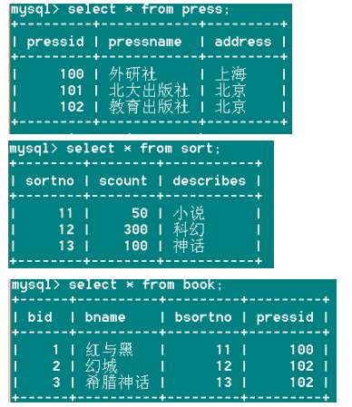
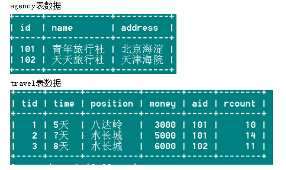

# day03_mysql_课后练习

# mysql练习题

## 第1题

案例：

1、创建一个数据库：day03_test01_school

2、创建如下表格

表1  Department表的定义

| **字段名** | **字段描述** | **数据类型** | **主键** | **外键** | **非空** | **唯一** |
| ---------- | ------------ | ------------ | -------- | -------- | -------- | -------- |
| DepNo      | 部门号       | int(10)      | 是       | 否       | 是       | 是       |
| DepName    | 部门名称     | varchar(20)  | 否       | 否       | 是       | 否       |
| DepNote    | 部门备注     | Varchar(50)  | 否       | 否       | 否       | 否       |

表2  Teacher表的定义

| **字段名** | **字段描述** | **数据类型** | **主键** | **外键** | **非空** | **唯一** |
| ---------- | ------------ | ------------ | -------- | -------- | -------- | -------- |
| Number     | 教工号       | int          | 是       | 否       | 是       | 是       |
| Name       | 姓名         | varchar(30)  | 否       | 否       | 是       | 否       |
| Sex        | 性别         | varchar(4)   | 否       | 否       | 否       | 否       |
| Birth      | 出生日期     | date         | 否       | 否       | 否       | 否       |
| DepNo      | 部门号       | int          | 否       | 是       | 否       | 否       |
| Salary     | 工资         | float        | 否       | 否       | 否       | 否       |
| Address    | 家庭住址     | varchar(100) | 否       | 否       | 否       | 否       |

3、添加记录

| **DepNo** | **DepName** | **DepNote**        |
| --------- | ----------- | ------------------ |
| 601       | 软件技术系  | 软件技术等专业     |
| 602       | 网络技术系  | 多媒体技术等专业   |
| 603       | 艺术设计系  | 广告艺术设计等专业 |
| 604       | 管理工程系  | 连锁经营管理等专业 |

| **Number** | **Name** | **Sex** | **Birth**  | **DepNo** | **Salary** | **Address**  |
| ---------- | -------- | ------- | ---------- | --------- | ---------- | ------------ |
| 2001       | Tom      | 女      | 1970-01-10 | 602       | 4500       | 四川省绵阳市 |
| 2002       | Lucy     | 男      | 1983-12-18 | 601       | 2500       | 北京市昌平区 |
| 2003       | Mike     | 男      | 1990-06-01 | 604       | 1500       | 重庆市渝中区 |
| 2004       | James    | 女      | 1980-10-20 | 602       | 3500       | 四川省成都市 |
| 2005       | Jack     | 男      | 1975-05-30 | 603       | 1200       | 重庆市南岸区 |

4、用SELECT语句查询Teacher表的所有记录。

5、找出所有其家庭地址中含有“北京”的教师的教工号及部门名称，要求显示结果中各列标题用中文别名表示。

6、获得Teacher表中工资最高的教工号和姓名。

7、找出所有收入在2500～4000之间的教工号。

8、查找在网络技术系工作的教师的姓名、性别和工资。

```mysql
#创建一个数据库：day03_test01_school
CREATE DATABASE day03_test01_school;

#使用数据库
USE day03_test01_school;

#创建表格
-- 部门信息表Department
CREATE TABLE Department(
	DepNo INT(10) PRIMARY KEY,
	DepName VARCHAR(20) NOT NULL,
	DepNote VARCHAR(50)
);
-- 创建数据表Teacher
CREATE TABLE Teacher(
	Number INT PRIMARY KEY,
	`Name` VARCHAR(30) UNIQUE,
	Sex VARCHAR(4),
	Birth DATE,
	DepNo INT,
	Salary FLOAT,
	Address VARCHAR(100),
	FOREIGN KEY (DepNo) REFERENCES Department(DepNo)
);
-- 将表4的内容插入Department表中
INSERT INTO Department VALUES (601,'软件技术系','软件技术等专业');
INSERT INTO Department VALUES (602,'网络技术系','多媒体技术等专业');
INSERT INTO Department VALUES (603,'艺术设计系','广告艺术设计等专业');
INSERT INTO Department VALUES (604,'管理工程系','连锁经营管理等专业');
-- 将表3的内容插入Teacher表中。
INSERT INTO Teacher VALUES(2001,'Tom','女','1970-01-10',602,4500,'四川省绵阳市');
INSERT INTO Teacher VALUES(2002,'Lucy','男','1983-12-18',601,2500,'北京市昌平区');
INSERT INTO Teacher VALUES(2003,'Mike','男','1990-06-01',604,1500,'重庆市渝中区');
INSERT INTO Teacher VALUES(2004,'James','女','1980-10-20',602,3500,'四川省成都市');
INSERT INTO Teacher VALUES(2005,'Jack','男','1975-05-30',603,1200,'重庆市南岸区');

#用SELECT语句查询Teacher表的所有记录。
SELECT * FROM teacher;

#找出所有其家庭地址中含有“北京”的教师的教工号及部门名称，要求显示结果中各列标题用中文表示。
SELECT number AS 教工号,Teacher.depno AS 部门名称
FROM Teacher INNER JOIN Department
ON Teacher.DepNo = Department.DepNo
WHERE address LIKE '%北京%';

#获得Teacher表中工资最高的教工号和姓名。
SELECT number,`name` FROM teacher WHERE salary = (SELECT MAX(salary) FROM teacher);
SELECT number,`name` FROM teacher ORDER BY salary DESC LIMIT 0,1;

#找出所有收入在2500～4000之间的教工号。
SELECT number FROM teacher WHERE salary BETWEEN 2500 AND 4000;

#查找在网络技术系工作的教师的姓名、性别和工资。
SELECT `name`,sex,salary FROM teacher 
WHERE depno=(SELECT depno FROM department WHERE depname='网络技术系');

SELECT `name`,sex,salary 
FROM teacher INNER JOIN department
ON teacher.depno = department.depno
WHERE depname ='网络技术系';
```


## 第2题

案例：

1、建立数据库day03_test02_student

2、建立以下三张表，并插入记录

Table:Classes

| **专业**   | **班级** | **姓名** | **姓别** | **座位** |
| ---------- | -------- | -------- | -------- | -------- |
| 计算机网络 | 1班      | 张三     | 男       | 8        |
| 软件工程   | 2班      | 李四     | 男       | 12       |
| 计算机维护 | 1班      | 王五     | 男       | 9        |
| 计算机网络 | 2班      | LILY     | 女       | 15       |
| 软件工程   | 1班      | 小强     | 男       | 20       |
| 计算机维护 | 1班      | CoCo     | 女       | 18       |

 Table:Score

| **姓名** | **英语** | **数学** | **语文** |
| -------- | -------- | -------- | -------- |
| 张三     | 65       | 75       | 98       |
| 李四     | 87       | 45       | 86       |
| 王五     | 98       | 85       | 65       |
| LILY     | 75       | 86       | 87       |
| 小强     | 85       | 60       | 58       |
| CoCo     | 96       | 87       | 70       |

  Table: Records

| **姓名** | **记录** |
| -------- | -------- |
| 小强     | 迟到     |
| 小强     | 事假     |
| 李四     | 旷课     |
| 李四     | 旷课     |
| 李四     | 迟到     |
| CoCo     | 病假     |
| LILY     | 事假     |

要求3：写出将张三的语文成绩修改为88的SQL语句。

要求4：搜索出计算机维护1班各门课程的平均成绩。

要求5：搜索科目有不及格的人的名单。

要求6：查询记录2次以上的学生的姓名和各科成绩。

```mysql
#建立数据库day03_test02_student
CREATE DATABASE day03_test02_student;

#使用数据库
USE day03_test02_student;

#创建表格并添加记录
CREATE TABLE Classes(
	Pro_name VARCHAR(20) NOT NULL,
	Grade VARCHAR(10) NOT NULL,
	`name` VARCHAR(10) NOT NULL,
	sex VARCHAR(4) NOT NULL,
	seat INT(10) NOT NULL UNIQUE
);
CREATE TABLE Score(
	`name` VARCHAR(10) NOT NULL,
	En_score INT(10) NOT NULL,
	Ma_score INT(10) NOT NULL,
	Ch_score INT(10) NOT NULL
);
CREATE TABLE Records(
	`name` VARCHAR(10) NOT NULL,
	record VARCHAR(10)
);

-- 向classes中添加数据
INSERT INTO classes VALUES('计算机网络','1班','张三','男',8);
INSERT INTO classes VALUES('软件工程','2班','李四','男',12);
INSERT INTO classes VALUES('计算机维护','1班','王五','男',9);
INSERT INTO classes VALUES('计算机网络','2班','LILY','女',15);
INSERT INTO classes VALUES('软件工程','1班','小强','男',20);
INSERT INTO classes VALUES('计算机维护','1班','CoCo','女',18);

-- 向score中添加数据
INSERT INTO Score VALUES('张三',65,75,98);
INSERT INTO Score VALUES('李四',87,45,86);
INSERT INTO Score VALUES('王五',98,85,65);
INSERT INTO Score VALUES('LILY',75,86,87);
INSERT INTO Score VALUES('小强',85,60,58);
INSERT INTO Score VALUES('CoCo',96,87,70);

-- 向records中添加数据
INSERT INTO records VALUES('小强','迟到');
INSERT INTO records VALUES('小强','事假');
INSERT INTO records VALUES('李四','旷课');
INSERT INTO records VALUES('李四','旷课');
INSERT INTO records VALUES('李四','迟到');
INSERT INTO records VALUES('CoCo','病假');
INSERT INTO records VALUES('LILY','事假');

#要求3：写出将张三的语文成绩修改为88的SQL语句。
UPDATE score SET ch_score=88 WHERE `name`='张三';

#要求4：搜索出计算机维护1班各门课程的平均成绩。
SELECT AVG(en_score),AVG(ma_score),AVG(ch_score) FROM score 
WHERE `name` IN (SELECT `name` FROM classes WHERE Pro_name='计算机维护' AND grade='1班');

#要求5：搜索科目有不及格的人的名单。
SELECT `name` FROM score WHERE en_score<60 OR ma_score<60 OR ch_score<60;

#要求6：查询记录2次以上的学生的姓名和各科成绩。
SELECT * 
FROM score INNER JOIN 
(SELECT `name`,COUNT(*) FROM Records GROUP BY `name` HAVING COUNT(*)>2) temp
ON score.name = temp.name;
```


## 第3题

案例：

1、建立数据库：day03_test03_xuankedb

2、建立如下三张表：

学生表Student由学号(Sno)、姓名(Sname)、性别(Ssex)、年龄(Sage)、所在系(Sdept)五个字段，Sno 为关键字。

课程表Course由课程号(Cno)、课程名(Cname)、选修课号(Cpno)、学分(Ccredit)四个字段，Cno为关键字。 

成绩表SG由学号(Sno)、课程号(Cno)、成绩(Grade)三个字段，(SNO, CNO)为关键字。

3、向Student表增加“入学时间(Scome)”列，其数据类型为日期型。

4、查询选修了3号课程的学生的学号及其成绩，查询结果按分数的降序排列。

5、查询学习1号课程的学生最高分数、平均成绩。

6、查询与“李洋”在同一个系学习的学生。

7、将计算机系全体学生的成绩置零。

8、删除学生表中学号为05019的学生记录。

9、删除计算机系所有学生的成绩记录。

```mysql
-- 创建一个数据库：day03_test03_xuankedb
CREATE DATABASE day03_test03_xuankedb;

-- 使用数据库
USE day03_test03_xuankedb;

-- 创建学生表
CREATE TABLE student(
	sno INT(10) PRIMARY KEY,
	sname VARCHAR(10),
	ssex VARCHAR(10),
	sage INT(10),
	sdept VARCHAR(40)
);

-- 创建课程表
CREATE TABLE course(
	cno INT(10) PRIMARY KEY,
	cname VARCHAR(20),
	cpno VARCHAR(40),
	ccredit INT(20)
);

-- 创建成绩表
CREATE TABLE sg(
	sno INT(10),
	cno INT(10),
	grade INT(3),
	PRIMARY KEY(sno,cno),
	CONSTRAINT stu_s_sno_fk FOREIGN KEY (sno) REFERENCES student(sno),
	CONSTRAINT cou_s_sno_fk FOREIGN KEY (cno) REFERENCES course(cno)
);

#3.向Student表增加“入学时间(Scome)”列，其数据类型为日期型。
ALTER TABLE student ADD COLUMN scome DATE;

#4.查询选修了3号课程的学生的学号及其成绩，查询结果按分数的降序排列。
SELECT sno,grade FROM sg WHERE cno=3 ORDER BY grade DESC;

#5.查询学习1号课程的学生最高分数、平均成绩。
SELECT MAX(grade),AVG(grade) FROM sg WHERE cno=1;

#6.查询与“李洋”在同一个系学习的学生。
SELECT * FROM student WHERE sdept=(SELECT sdept FROM student WHERE sname='李洋');

#7.将计算机系全体学生的成绩置零。
UPDATE sg SET grade=0 WHERE sno IN (SELECT sno FROM student WHERE sdept='计算机系')

#8.删除学生表中学号为05019的学生记录。
DELETE FROM student WHERE sno=05019;

#9.删除计算机系所有学生的成绩记录。
DELETE FROM sg WHERE sno IN (SELECT sno FROM student WHERE sdept='计算机系');
```


## 第4题

案例：

1、建立数据库：day03_test04_library

2、建立如下三个表：
表一：press 出版社 
属性：编号pressid(int)、名称pressname(varchar)、地址address(varchar)

表二：sort 种类 
属性：编号sortno(int)、数量scount(int) 

表二：book图书
属性：编号bid(int)、名称 bname(varchar)、种类bsortno(int)、出版社编号pressid(int)

3、给sort表中添加一列属性：描述describes(varchar)

4、向三个表中各插入几条数据



5、查询出版社id为100的书的全部信息

6、查询出版社为外研社的书的全部信息

7、查询图书数量（scount）大于100的种类

8、查询图书种类最多的出版社信息

```mysql
-- 建立数据库：day03_test04_library
CREATE DATABASE day03_test04_library;

-- 使用数据库
USE day03_test04_library;

-- 创建出版社表
CREATE TABLE press(
	pressid INT(10) PRIMARY KEY,
	pressname VARCHAR(30),
	address VARCHAR(50)
);

-- 创建一个种类表
CREATE TABLE sort(
	sortno INT(10) PRIMARY KEY,
	scount INT(10)
);

-- 创建图书表
CREATE TABLE book(
	bid INT(10) PRIMARY KEY,
	bname VARCHAR(40),
	bsortno INT(10),
	pressid INT(10),
	CONSTRAINT p_b_pid_fk FOREIGN KEY (pressid) REFERENCES press(pressid),
	CONSTRAINT s_b_sno_fk FOREIGN KEY (bsortno) REFERENCES sort(sortno)
);

-- 添加一列属性
ALTER TABLE sort ADD COLUMN describes VARCHAR(30);

-- 添加数据
INSERT INTO press VALUES(100,'外研社','上海');
INSERT INTO press VALUES(101,'北大出版社','北京');
INSERT INTO press VALUES(102,'教育出版社','北京');

-- 添加数据
INSERT INTO sort(sortno,scount,describes)VALUES(11,50,'小说');
INSERT INTO sort(sortno,scount,describes)VALUES(12,300,'科幻');
INSERT INTO sort(sortno,scount,describes)VALUES(13,100,'神话');

-- 添加数据
INSERT INTO book VALUES(1,'红与黑',11,100);
INSERT INTO book VALUES(2,'幻城',12,102);
INSERT INTO book VALUES(3,'希腊神话',13,102);
INSERT INTO book VALUES(4,'一千零一夜',13,102);

#5.查询出版社id为100的书的全部信息
SELECT * FROM book WHERE pressid=100;

#6.查询出版社为外研社的书的全部信息
SELECT * FROM book WHERE pressid=(SELECT pressid FROM press WHERE pressname='外研社');

#7.查询图书数量（scount）大于100的种类
SELECT * FROM sort WHERE scount>100;

#8.查询图书种类最多的出版社信息
SELECT * FROM press WHERE pressid=(
	SELECT temp.pressid FROM 
 (SELECT pressid,MAX(t.c) FROM (SELECT pressid,COUNT(*) AS c FROM book GROUP BY pressid ORDER BY c DESC ) AS t) AS temp);


SELECT * FROM press WHERE pressid=(
SELECT pressid
FROM (SELECT pressid,bsortno FROM book GROUP BY pressid,bsortno) temp
GROUP BY pressid
ORDER BY COUNT(*) DESC
LIMIT 0,1)
```


## 第5题

案例：

1、建立数据库：day03_test05_tour

2、建立如下两个表：

agency旅行社表： 

| 列名（英文名） | 列名（中文名） | 数据类型 | 允许空值 | 说明 |
| -------------- | -------------- | -------- | -------- | ---- |
| Id             | 旅行社编号     | int      | no       | 主键 |
| Name           | 旅行社名       | varchar  | no       |      |
| Address        | 旅行社地址     | varchar  | no       |      |
| Areaid         | 所属区域Id     | Int      | yes      |      |

 travel旅行线路表：

| 列名（英文名） | 列名（中文名） | 数据类型 | 允许空值 | 说明 |
| -------------- | -------------- | -------- | -------- | ---- |
| Tid            | 旅行线路编号   | int      | no       | 主键 |
| Time           | 所需时间       | varchar  | no       |      |
| Position       | 目的地         | varchar  | no       |      |
| Money          | 花费           | Float    | yes      |      |
| Aid            | 所属旅行社id   | Int      | no       | 外键 |
| Count          | 报名人数       | Int      | yes      |      |

3、添加记录



 4、查出旅行线路最多的旅社

5、查出最热门的旅行线路(也就是查询出报名人数最多的线路)

6、查询花费少于5000的旅行线路

7、找到一次旅行花费最昂贵的旅行社名

8、查出青年旅社所有的旅行线路都玩一遍需要多少时间。

```mysql
#建立数据库：day03_test05_tour
CREATE DATABASE day03_test05_tour;

#使用数据库
USE day03_test05_tour;

CREATE TABLE agency(
	id INT PRIMARY KEY NOT NULL,
	NAME VARCHAR(20) NOT NULL,
	address VARCHAR(100) NOT NULL,
	areaid INT 
);

CREATE TABLE trval(
	tid INT PRIMARY KEY NOT NULL,
	TIME VARCHAR(50) NOT NULL,
	POSITION VARCHAR(100) NOT NULL,
	money FLOAT,
	aid INT NOT NULL,
	rcount INT,
	CONSTRAINT bk_aid FOREIGN KEY trval(aid) REFERENCES agency(id)
);

INSERT INTO agency(id,NAME,address) VALUES (101,'青年旅行社','北京海淀');
INSERT INTO agency(id,NAME,address) VALUES (102,'天天旅行社','天津海院');

INSERT INTO trval(tid,TIME,POSITION,money,aid,rcount) VALUES (1,'5天','八达岭',3000,101,10);
INSERT INTO trval(tid,TIME,POSITION,money,aid,rcount) VALUES (2,'7天','水长城',5000,101,14);
INSERT INTO trval(tid,TIME,POSITION,money,aid,rcount) VALUES (3,'8天','水长城',6000,102,11);

SELECT * FROM agency;
SELECT * FROM trval;

#4.查出旅行线路最多的旅社
SELECT * 
FROM agency INNER JOIN 
(SELECT t.aid,MAX(t.c) FROM (SELECT aid,COUNT(*) AS c FROM trval GROUP BY aid)  AS t)temp
ON agency.id = temp.aid

#5.查出最热门的旅行线路(也就是查询出报名人数最多的线路)
SELECT * FROM trval WHERE rcount=(SELECT MAX(rcount) FROM trval);

#6.查询花费少于5000的旅行线路
SELECT * FROM trval WHERE money<5000;


#7.找到一次旅行花费最昂贵的旅行社名
SELECT NAME FROM agency WHERE id =
(SELECT aid FROM trval WHERE money =(SELECT MAX(money) FROM trval ));

#8.查出青年旅社所有的旅行线路都玩一遍需要多少时间。
SELECT SUM(TIME) FROM trval WHERE aid=(SELECT id FROM agency WHERE NAME='青年旅行社');
```


