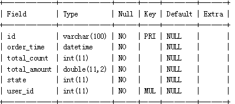

# day04_JDBC_课后练习

# 第1题

案例：

1、创建数据库day04_test01_bookstore

2、创建如下表格

（1）图书表books

（2）用户表users

（3）订单表orders

（4）订单明细表order_items

3、使用JDBC实现往用户表中添加几个用户，注意密码存储使用mysql的password()函数进行加密

4、使用JDBC实现往图书表中添加几本图书

5、从键盘输入用户名和密码，模拟登录，使用JDBC实现验证用户名和密码是否正确，如果正确，显示登录成功，否则显示用户名或密码错误

6、使用JDBC实现查询所有图书信息

7、使用JDBC实现查询销量最大的图书信息

8、使用JDBC实现修改库存量小于10本的图书的库存量为100

9、使用sql语句往订单表和订单明细表添加如下记录

10、使用JDBC实现删除订单“15275760194821”的相关信息，注意涉及到两张表

