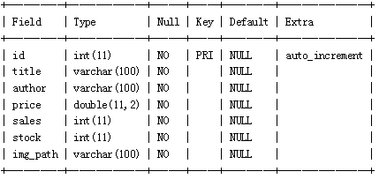
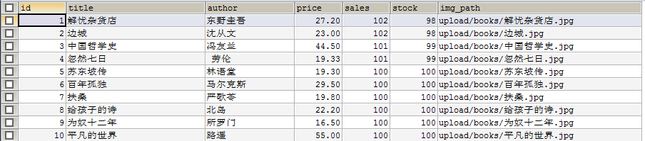

# day04_JDBC_课后练习

案例：

## 1、创建数据库

创建数据库：day04_test01_bookstore

## 2、创建如下表格

（1）图书表books



（2）用户表users


（3）订单表orders


（4）订单明细表order_items


## 3、添加模拟数据

使用sql语句在命令行或SQLyog中添加一些模拟数据

表books：



表users：


表orders：


表order_items：


## 4、搭建开发环境，准备各个工具组件

### （1）使用druid（德鲁伊）数据库连接池

引入jar： druid-1.1.10.jar 和 mysql-connector-java-5.1.36-bin.jar

编写配置文件druid.properties（根据你自己的实际情况，作适当修改）

```properties
url=jdbc:mysql://localhost:3306/day04_test01_bookstore
username=root
password=1234
driverClassName=com.mysql.jdbc.Driver
initialSize=10
maxActive=50
minIdle=10
maxWait=1000
```

### （2）使用尚硅谷的JDBCTools工具类（直接拿过去用，不用自己写）

```java
package com.atguigu.utils;

import java.sql.Connection;
import java.sql.SQLException;
import java.util.Properties;

import javax.sql.DataSource;

import com.alibaba.druid.pool.DruidDataSourceFactory;

/*
 * 获取连接或释放连接的工具类
 */
public class JDBCTools {
	// 1、创建数据源,即连接池
	private static DataSource dataSource;
	
	// 2、创建ThreadLocal对象
	private static ThreadLocal<Connection> threadLocal;

	static {
		try {
			//1、读取druip.properties文件
			Properties pro = new Properties();
			pro.load(JDBCTools.class.getClassLoader().getResourceAsStream("druid.properties"));
			
			//2、连接连接池
			dataSource = DruidDataSourceFactory.createDataSource(pro);

			//3、创建线程池
			threadLocal = new ThreadLocal<>();
		} catch (Exception e) {
			e.printStackTrace();
		}
	}

	/**
	 * 获取连接的方法
	 * 
	 * @return
	 * @throws SQLException
	 */
	public static Connection getConnection() {
		// 从线程中获取连接
		Connection connection = threadLocal.get();
		if (connection == null) {
			// 从连接池中获取一个连接
			try {
				connection = dataSource.getConnection();
				// 将连接与当前线程绑定
				threadLocal.set(connection);
			} catch (SQLException e) {
				e.printStackTrace();
			}
		}
		return connection;
	}

	/**
	 * 释放连接的方法
	 * 
	 * @param connection
	 */
	public static void releaseConnection() {
		// 获取当前线程中的连接
		Connection connection = threadLocal.get();
		if (connection != null) {
			try {
				connection.close();
				// 将已经关闭的连接从当前线程中移除
				threadLocal.remove();
			} catch (SQLException e) {
				e.printStackTrace();
			}
		}
	}
}
```

### （3）使用尚硅谷的BasicDAO（直接拿过去用，不用自己写）

```java
package com.atguigu.dao.impl;

import java.lang.reflect.ParameterizedType;
import java.lang.reflect.Type;
import java.sql.Connection;
import java.sql.SQLException;
import java.util.List;

import org.apache.commons.dbutils.QueryRunner;
import org.apache.commons.dbutils.handlers.BeanHandler;
import org.apache.commons.dbutils.handlers.BeanListHandler;
import org.apache.commons.dbutils.handlers.ScalarHandler;

import com.atguigu.utils.JDBCTools;

/**
 * 定义一个用来被继承的对数据库进行基本操作的Dao
 */
public abstract class BasicDAO<T> {
	private QueryRunner queryRunner = new QueryRunner();
	// 定义一个变量来接收泛型的类型
	private Class<T> type;

	// 获取T的Class对象，获取泛型的类型，泛型是在被子类继承时才确定
	public BasicDAO() {
		// 获取子类的类型
		Class clazz = this.getClass();
		// 获取父类的类型
		// getGenericSuperclass()用来获取当前类的父类的类型
		// ParameterizedType表示的是带泛型的类型
		ParameterizedType parameterizedType = (ParameterizedType) clazz.getGenericSuperclass();
		// 获取具体的泛型类型 getActualTypeArguments获取具体的泛型的类型
		// 这个方法会返回一个Type的数组
		Type[] types = parameterizedType.getActualTypeArguments();
		// 获取具体的泛型的类型·
		this.type = (Class<T>) types[0];
	}

	/**
	 * 通用的增删改操作
	 * 
	 * @param sql
	 * @param params
	 * @return
	 */
	public int update(String sql, Object... params) {
		// 获取连接
		Connection connection = JDBCTools.getConnection();
		int count = 0;
		try {
			count = queryRunner.update(connection, sql, params);
		} catch (SQLException e) {
			//将编译时异常转换为运行时异常向上抛
			throw new RuntimeException(e);
		}
		return count;
	}

	/**
	 * 获取一个对象
	 * 
	 * @param sql
	 * @param params
	 * @return
	 */
	public T getBean(String sql, Object... params) {
		// 获取连接
		Connection connection = JDBCTools.getConnection();
		T t = null;
		try {
			t = queryRunner.query(connection, sql, new BeanHandler<T>(type), params);
		} catch (SQLException e) {
			//将编译时异常转换为运行时异常向上抛
			throw new RuntimeException(e);
		}
		return t;
	}

	/**
	 * 获取所有对象
	 * 
	 * @param sql
	 * @param params
	 * @return
	 */
	public List<T> getBeanList(String sql, Object... params) {
		// 获取连接
		Connection connection = JDBCTools.getConnection();
		List<T> list = null;
		try {
			list = queryRunner.query(connection, sql, new BeanListHandler<T>(type), params);
		} catch (SQLException e) {
			//将编译时异常转换为运行时异常向上抛
			throw new RuntimeException(e);
		} 
		return list;
	}

	/**
	 * 获取一个单一值的方法，专门用来执行像select count(*)... 这样的sql语句
	 * 
	 * @param sql
	 * @param params
	 * @return
	 */
	public Object getSingleValue(String sql, Object... params) {
		// 获取连接
		Connection connection = JDBCTools.getConnection();
		Object count = null;
		try {
			count = queryRunner.query(connection, sql, new ScalarHandler(), params);
		} catch (SQLException e) {
			//将编译时异常转换为运行时异常向上抛
			throw new RuntimeException(e);
		}
		return count;
	}
	/**
	 * 进行批处理的方法
	 * 关于二维数组Object[][] params
	 * 		二维数组的第一维是sql语句要执行的次数
	 * 		二维数组的第二维就是每条sql语句中要填充的占位符
	 * 
	 * @param sql
	 * @param params
	 */
	public void batchUpdate(String sql , Object[][] params){
		//获取连接
		Connection connection = JDBCTools.getConnection();
		try {
			int[] batch = queryRunner.batch(connection ,sql, params);
		} catch (SQLException e) {
			//将编译时异常转换为运行时异常向上抛
			throw new RuntimeException(e);
		}
	}
}
```

### （4）使用Apache的commons-dbutils组件的QueryRunner等

引入jar：commons-dbutils-1.6.jar

### （5）使用尚硅谷的Page分页小工具类（直接拿过去用，不用自己写）

```java
package com.atguigu.utils;

import java.util.List;

public class Page<T> {
	private List<T> list; // 每页查询出来的数据存放的集合
	public static final int PAGE_SIZE = 4; // 每页显示的记录数
	private int pageNo; // 当前页，通过用户传入
	private int totalRecord; //总记录数，通过查询数据库得到
	private String path; //设置请求的地址

	public String getPath() {
		return path;
	}

	public void setPath(String path) {
		this.path = path;
	}
	
	public List<T> getList() {
		return list;
	}

	public void setList(List<T> list) {
		this.list = list;
	}

	public int getPageNo() {
		if (pageNo < 1) {
			// 如果当前页码小于1，直接返回1
			return 1;
		}else if(getTotalPageNo() == 0){
			return 1;
		} else if (pageNo > getTotalPageNo()) {
			// 如果当前页码大于总页数，返回总页数
			return getTotalPageNo();
		} else {
			return pageNo;
		}
	}

	public void setPageNo(int pageNo) {
		this.pageNo = pageNo;
	}

	// 总页数是由总记录数和每页显示的条数计算得到
	public int getTotalPageNo() {
		if (totalRecord % PAGE_SIZE == 0) {
			return totalRecord / PAGE_SIZE;
		} else {
			return totalRecord / PAGE_SIZE + 1;
		}
	}

	public int getTotalRecord() {
		return totalRecord;
	}

	public void setTotalRecord(int totalRecord) {
		this.totalRecord = totalRecord;
	}

	public static int getPageSize() {
		return PAGE_SIZE;
	}

	// 判断是否有上一页
	public boolean hasPrev() {
		return getPageNo() > 1;
	}

	// 获取上一页
	public int getPrev() {
		return hasPrev() ? getPageNo() - 1 : 1;
	}

	// 判断是否有下一页
	public boolean hasNext() {
		return getPageNo() < getTotalPageNo();
	}

	// 获取下一页
	public int getNext() {
		return hasNext() ? getPageNo() + 1 : getTotalPageNo();
	}
}
```

## 5、自己编写表格对应的实体类

（1）User类

（2）Book类

（3）Order类

（4）OrderItem类

## 6、自己实现如下接口

接口直接拿过去，自己编写DAO接口的实现类

### （1）UserDAO

```java
package com.atguigu.dao;

import com.atguigu.bean.User;

public interface UserDAO {
	/**
	 * 根据用户名和密码获取数据库中的记录
	 * @param user User 该用户对象中保存了登录时填写的用户名和密码
	 * @return User：如果用户名和密码正确返回User对象的完整信息，如果用户名或密码不正确，则返回null
	 */
	public User getUser(User user);

	/**
	 * 根据用户名获取数据库中的记录
	 * @param username String 该用户对象中保存了注册时新添加的用户名
	 * @return true：用户名已存在， false：用户名不存在，说明该可用
	 */
	public boolean checkUserName(String username);

	/**
	 * 将新用户保存到数据库
	 * @param user User 该用户对象中保存了注册时新添加的用户所有信息
	 */
	public void saveUser(User user);
}
```

### （2）BookDAO

```java
package com.atguigu.dao;

import java.util.List;

import com.atguigu.bean.Book;
import com.atguigu.utils.Page;

public interface BookDAO {

	/**
	 * 添加图书的方法
	 * @param book Book 一本新添加的图书对象
	 */
	public void addBook(Book book);

	/**
	 * 根据图书的id删除图书的方法
	 * @param bookId String 图书编号，这里用String类型是因为从Web客户端传过来的数据都是String类型的
	 */
	public void deleteBookById(String bookId);

	/**
	 * 根据图书的id获取图书信息
	 * @param bookId String 图书编号，这里用String类型是因为从Web客户端传过来的数据都是String类型的
	 * @return
	 */
	public Book getBookById(String bookId);

	/**
	 * 更新图书信息的方法
	 * @param book Book 该对象中包含了一本图书的完整信息，其中部分属性可能是新修改的，部分属性是保留原来的
	 */
	public void updateBook(Book book);
	
	/**
	 * 获取所有图书的方法
	 * 
	 * @return List<Book> 所有图书
	 */
	public List<Book> getBooks();

	/**
	 * 获取带分页的所有图书信息
	 * @param page Page<Book> 传入是一个带页码（即你要查询第几页），但不包含Book对象的page对象
	 * @return 返回的page对象是包含所有属性的page对象
	 */
	public Page<Book> getPageBooks(Page<Book> page);

	/**
	 * 根据价格范围获取带分页的图书信息
	 * 
	 * @param page Page<Book> 传入是一个带页码（即你要查询第几页），但不包含Book对象的page对象
	 * @param minPrice double 价格区间范围的左边界
	 * @param maxPrice double 价格区间范围的右边界
	 * @return Page<Book> 返回的page对象是包含所有属性的page对象
	 */
	public Page<Book> getPageBooksByPrice(Page<Book> page, double minPrice, double maxPrice);

	/**
	 * 批量更新图书的库存和销量
	 * @param params Object[][] 其中行数是代表修改几本数，每一个行包含三个数据，bookid，库存量，销量
	 */
	public void batchUpdateSalesAndStock(Object[][] params);
}

```

### （3）OrderDAO

```java
package com.atguigu.dao;

import java.util.List;

import com.atguigu.bean.Order;

public interface OrderDAO {
	/**
	 * 保存订单的方法
	 * @param order Order 包含新订单的信息
	 */
	public void saveOrder(Order order);

	/**
	 * 获取我的订单的方法
	 * @param userId int 用户编号
	 * @return List<Order> 当前用户的所有订单
	 */
	public List<Order> getMyOrders(int userId);
}

```

### （4）OrderItemDAO

```java
package com.atguigu.dao;

import java.util.List;

import com.atguigu.bean.OrderItem;

public interface OrderItemDAO {
	/**
	 * 根据订单号获取对应的订单项
	 * 
	 * @param orderId String 订单编号
	 * @return List<OrderItem> 该订单的订单明细
	 */
	public List<OrderItem> getOrderItemsByOrderId(String orderId);

	/**
	 * 批量插入订单项的方法
	 * @param params Object[][] 行数就是有几项订单项，每一行就是一条订单明细记录
	 */
	public void batchInsertOrderItems(Object[][] params);
}

```

## 7、使用如下测试类进行测试

### （1）UserDAOTest.java

```java
package com.atguig.test;

import java.util.Scanner;

import org.junit.Test;

import com.atguigu.bean.User;
import com.atguigu.dao.UserDAO;
import com.atguigu.dao.impl.UserDAOImpl;

public class UserDAOTest {
	private UserDAO ud = new UserDAOImpl();
	
	/*
	 * 登录测试
	 */
	@Test
	public void test01(){
		Scanner input = new Scanner(System.in);
		
		System.out.println("----登录----");
		System.out.print("用户名：");
		String username = input.nextLine();
		
		System.out.print("密码：");
		String password = input.nextLine();
		
		User user = new User(username,password);
		user = ud.getUser(user);
		if(user == null){
			System.out.println("登录失败，用户名或密码错误");
		}else{
			System.out.println("登录成功：" + user);
		}
		
		input.close();
	}
	
	/*
	 * 注册测试
	 */
	@Test
	public void test02(){
		Scanner input = new Scanner(System.in);
		
		System.out.println("----注册----");
		String username;
		while(true){
			System.out.print("用户名：");
			username = input.nextLine();
			
			if(ud.checkUserName(username)==false){
				break;
			}else{
				System.out.println("用户名已存在，请重写输入");
			}
		}
		
		System.out.print("密码：");
		String password = input.nextLine();
		
		System.out.print("邮箱：");
		String email = input.nextLine();
		
		try {
			User user = new User(username,password,email);
			ud.saveUser(user);
			System.out.println("注册成功");
		} catch (Exception e) {
			System.out.println("注册失败，原因：" + e.getMessage());
		}
		
		input.close();
	}
}
```

### （2）BookDAOTest.java

```java
package com.atguig.test;

import java.util.List;
import java.util.Scanner;

import org.junit.Test;

import com.atguigu.bean.Book;
import com.atguigu.dao.BookDAO;
import com.atguigu.dao.impl.BookDAOImpl;
import com.atguigu.utils.Page;

public class BookDAOTest {
	private BookDAO bd = new BookDAOImpl();
	
	/*
	 * 测试添加图书
	 */
	@Test
	public void test01(){
		Scanner input = new Scanner(System.in);
		
		System.out.print("请输入书名：");
		String title = input.nextLine();
		
		System.out.print("请输入作者：");
		String author = input.nextLine();
		
		System.out.print("请输入价格：");
		double price = input.nextDouble();
		
		System.out.print("请输入库存量：");
		int stock = input.nextInt();
		input.nextLine();
		
		System.out.print("请输入图片路径(例如：upload/books/从入门到精通.jpg：");
		String imgPath = input.nextLine();
		
		try {
			Book book = new Book(title, author, price, 0, stock, imgPath);
			bd.addBook(book);
			System.out.println("添加成功");
		} catch (Exception e) {
			System.out.println("添加失败，原因：" + e.getMessage());
		}
		
		input.close();
	}
	
	/*
	 * 测试修改图书
	 */
	@Test
	public void test02(){
		List<Book> books = bd.getBooks();
		for (Book book : books) {
			System.out.println(book);
		}
		
		Scanner input = new Scanner(System.in);
		System.out.print("请选择你要修改的图书的编号：");
		String bookId = input.nextLine();
		
		Book book = bd.getBookById(bookId);
		System.out.println("直接回车表示该项不修改");
		System.out.print("请输入书名("+book.getTitle()+")：");
		String title = input.nextLine();
		if (title.length() != 0){
			book.setTitle(title);
		}
		
		System.out.print("请输入作者("+book.getAuthor()+")：");
		String author = input.nextLine();
		if (author.length() != 0){
			book.setAuthor(author);
		}
		
		System.out.print("请输入价格("+book.getPrice()+")：");
		String strPrice = input.nextLine();
		if(strPrice.length() != 0){
			book.setPrice(Double.parseDouble(strPrice));
		}
		
		System.out.print("请输入库存量("+book.getStock()+")：");
		String stockStr = input.nextLine();
		if(stockStr.length() != 0){
			book.setStock(Integer.parseInt(stockStr));
		}
		
		System.out.print("请输入图片路径("+book.getImgPath()+")：");
		String imgPath = input.nextLine();
		if(imgPath.length() != 0){
			book.setImgPath(imgPath);
		}
		
		try {
			bd.updateBook(book);
			System.out.println("修改成功");
		} catch (Exception e) {
			System.out.println("修改失败，原因：" + e.getMessage());
		}
		input.close();
	}
	
	/*
	 * 测试删除图书
	 */
	@Test
	public void test03(){
		List<Book> books = bd.getBooks();
		for (Book book : books) {
			System.out.println(book);
		}
		
		Scanner input = new Scanner(System.in);
		System.out.print("请选择你要修改的图书的编号：");
		String bookId = input.nextLine();
		
		try {
			bd.deleteBookById(bookId);
			System.out.println("删除成功");
		} catch (Exception e) {
			System.out.println("删除失败，原因：" + e.getMessage());
		}
		input.close();
	}
	
	/*
	 * 测试图书查询，分页
	 */
	@Test
	public void test04(){
		Scanner input = new Scanner(System.in);
		
		Page<Book> page = new Page<>();
		page.setPageNo(1);
		
		boolean flag = true;
		while(flag){
			Page<Book> pageBooks = bd.getPageBooks(page);
			List<Book> list = pageBooks.getList();
			System.out.println("一共：" + page.getTotalPageNo() + "页，当前是第" + page.getPageNo() + "页");
			for (Book book : list) {
				System.out.println(book);
			}
			
			System.out.print("请选择页码：");
			int pageNo = input.nextInt();
			page = new Page<>();
			page.setPageNo(pageNo);
		}
		
		input.close();
	}
	
	/*
	 * 测试图书查询，分页，并加价格筛选
	 */
	@Test
	public void test05(){
		Scanner input = new Scanner(System.in);
		
		System.out.println("请输入价格范围：");
		System.out.print("最低价格：");
		double minPrice = input.nextDouble();
		
		System.out.print("最高价格：");
		double maxPrice = input.nextDouble();
		
		Page<Book> page = new Page<>();
		page.setPageNo(1);
		boolean flag = true;
		while(flag){
			Page<Book> pageBooks = bd.getPageBooksByPrice(page, minPrice, maxPrice);
			if(page.getTotalPageNo() == 0){
				System.out.println("该范围没有数据");
				break;
			}
			List<Book> list = pageBooks.getList();
			System.out.println("一共：" + page.getTotalPageNo() + "页，当前是第" + page.getPageNo() + "页");
			for (Book book : list) {
				System.out.println(book);
			}
			
			System.out.print("请选择页码：");
			int pageNo = input.nextInt();
			page = new Page<>();
			page.setPageNo(pageNo);
		}
		
		input.close();
	}
}

```

### （3）OrderDAOTest.java

```java
package com.atguig.test;

import java.util.ArrayList;
import java.util.Date;
import java.util.List;
import java.util.Scanner;

import org.junit.AfterClass;
import org.junit.Before;
import org.junit.Test;

import com.atguigu.bean.Book;
import com.atguigu.bean.Order;
import com.atguigu.bean.User;
import com.atguigu.dao.BookDAO;
import com.atguigu.dao.OrderDAO;
import com.atguigu.dao.OrderItemDAO;
import com.atguigu.dao.UserDAO;
import com.atguigu.dao.impl.BookDAOImpl;
import com.atguigu.dao.impl.OrderDAOImpl;
import com.atguigu.dao.impl.OrderItemDAOImpl;
import com.atguigu.dao.impl.UserDAOImpl;

public class OrderDAOTest {
	private UserDAO ud = new UserDAOImpl();
	private OrderDAO od = new OrderDAOImpl();
	private OrderItemDAO oid = new OrderItemDAOImpl();
	private BookDAO bd = new BookDAOImpl();
	private User login;
	private static Scanner input = new Scanner(System.in);
	
	/*
	 * 测试登录
	 */
	@Before
	public void test01(){
		System.out.println("----登录----");
		System.out.print("用户名：");
		String username = input.nextLine();
		
		System.out.print("密码：");
		String password = input.nextLine();
		
		User user = new User(username,password);
		login = ud.getUser(user);
		if(login == null){
			System.out.println("登录失败，用户名或密码错误");
		}else{
			System.out.println("登录成功：" + login);
		}
	}
	
	/*
	 * 测试查看某个用户查看自己的订单信息
	 */
	@Test
	public void test02(){
		if(login == null){
			System.out.println("请先登录");
			return;
		}
		
		List<Order> myOrders = od.getMyOrders(login.getId());
		for (Order order : myOrders) {
			System.out.println(order);
		}
	}
	
	/*
	 * 模拟购物和结算
	 */
	@Test
	public void test03(){
		if(login == null){
			System.out.println("请先登录");
			return;
		}
		
		List<Book> books = bd.getBooks();
		for (Book book : books) {
			System.out.println(book);
		}
		
		//因为没有更丰富的图形化界面支持，如果同一个本书买了两本，即输入两次相同id,当做两件商品来算
		System.out.print("请输入你要购买的图书的编号，用空格分割：");
		String str = input.nextLine();
		String[] ids = str.split(" ");
		
		//模拟购物车
		ArrayList<Book> list = new ArrayList<>();
		double totalAmount = 0;
		for (String bookId : ids) {
			Book book = bd.getBookById(bookId);
			list.add(book);
			totalAmount += book.getPrice(); 
		}
		
		//1、保存一个订单
		long time = System.currentTimeMillis();//获取当前系统时间距离1970-1-1 0:0:0 0毫秒的毫秒数
		String orderId = time + "" + login.getId();
		
		Order order = new Order(orderId, new Date(), list.size(), totalAmount, 0, login.getId());
		od.saveOrder(order);
		
		//2、保存所有的订单明细
		//3、更新该订单中的图书的销量和库存量
		//count,amount,title,author,price,img_path,order_id
		//sales = ? , stock = ? where id = ?";
		Object[][] arr1 = new Object[list.size()][7];
		Object[][] arr2 = new Object[list.size()][3];
		for (int i = 0; i < list.size(); i++) {
			Book book = list.get(i);
			arr1[i][0] = 1;
			arr1[i][1] = book.getPrice()*1;
			arr1[i][2] = book.getTitle();
			arr1[i][3] = book.getAuthor();
			arr1[i][4] = book.getPrice();
			arr1[i][5] = book.getImgPath();
			arr1[i][6] = order.getId();
			
			arr2[i][0] = book.getSales() + 1;
			arr2[i][1] = book.getStock() - 1;
			arr2[i][2] = book.getId();
		}
		
		//批量添加订单明细
		oid.batchInsertOrderItems(arr1);
		
		//批量更新图书的销量和库存量
		bd.batchUpdateSalesAndStock(arr2);
	}
	
	@AfterClass
	public static void test04(){
		input.close();
	}
}

```

