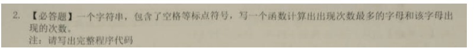

# day20_课后练习

## 第1题



开发提示：可以使用Map，key是字母，value是该字母的次数

效果演示：例如：String str = "Your future depends on your dreams, so go to sleep.";


## 第2题

案例：添加你喜欢的歌手以及你喜欢他唱过的歌曲

例如：


## 第3题

案例：

​	添加如下省份与城市信息到map中，并遍历显示

```java
浙江省
	绍兴市
	温州市
	湖州市
	嘉兴市
	台州市
	金华市
	舟山市
	衢州市
	丽水市
	杭州市
	宁波市
海南省
	海口市
	三亚市
北京市
	北京市
```

开发提示：

​	其中key为省份名，value为该省份所有的市辖区

## 第4题

案例：模拟斗地主洗牌和发牌并对牌进行排序的代码实现

运行效果如下：


开发提示：

​	（1）用String[] nums = { "3", "4", "5", "6", "7", "8", "9", "10", "J", "Q", "K", "A", "2" };存储数字

​			String[] colors = { "方片", "梅花", "红桃", "黑桃" };存储花色

​	（2）单独处理大王、小王

​	（3）将54张牌的索引[1,54]数字依次存储到一个ArrayList中

​	（4）用nums和colors数组的组合，将54张牌存储的一个Map中，key是索引，范围是1-54，value是牌面，例如：(1,黑桃3),...(54,小王)

​	（5）对ArrayList进行洗牌打乱顺序

​	（6）依次取list中的索引，发给四位牌友，四位牌友的牌可以用TreeSet存储，这样可以按照索引大小排序，索引大小就是牌的大小

​	（7）遍历结果，TreeSet中存储的是牌的索引，显示的时候从Map中取出牌显示

## 第5题

案例：

（1）从键盘输入一个年份，输出该年的世界杯冠军是哪支球队。如果该年没有举办世界杯，则输出：没有举办世界杯。 

（2）从键盘输入一支球队的名字，输出该球队夺冠的年份列表。 例如，读入“巴西”，应当输出 1958 1962 1970 1994 2002 读入“荷兰”，应当输出 没有获得过世界杯

运行效果如下：


附：历届世界杯冠军

| 届数       | 举办年份 | 举办地点 | 冠军   |
| ---------- | -------- | -------- | ------ |
| 第一届     | 1930年   | 乌拉圭   | 乌拉圭 |
| 第二届     | 1934年   | 意大利   | 意大利 |
| 第三届     | 1938年   | 法国     | 意大利 |
| 第四届     | 1950年   | 巴西     | 乌拉圭 |
| 第五届     | 1954年   | 瑞士     | 西德   |
| 第六届     | 1958年   | 瑞典     | 巴西   |
| 第七届     | 1962年   | 智利     | 巴西   |
| 第八届     | 1966年   | 英格兰   | 英格兰 |
| 第九届     | 1970年   | 墨西哥   | 巴西   |
| 第十届     | 1974年   | 前西德   | 西德   |
| 第十一届   | 1978年   | 阿根廷   | 阿根廷 |
| 第十二届   | 1982年   | 西班牙   | 意大利 |
| 第十三届   | 1986年   | 墨西哥   | 阿根廷 |
| 第十四届   | 1990年   | 意大利   | 西德   |
| 第十五届   | 1994年   | 美国     | 巴西   |
| 第十六届   | 1998年   | 法国     | 法国   |
| 第十七届   | 2002年   | 韩日     | 巴西   |
| 第十八届   | 2006年   | 德国     | 意大利 |
| 第十九届   | 2010年   | 南非     | 西班牙 |
| 第二十届   | 2014年   | 巴西     | 德国   |
| 第二十一届 | 2018年   | 俄罗斯   | 法国   |

## 第6题

案例：模拟菜单的二级联动效果

现有全国各省市信息字符串如下：

```java
		String str = "'北京': ['北京'];"
				+"'上海': ['上海'];"
				+"'天津': ['天津'];"
				+"'重庆': ['重庆'];"
				+"'河北省': ['石家庄', '张家口', '承德', '秦皇岛', '唐山', '廊坊', '保定', '沧州', '衡水', '邢台', '邯郸'];"
				+"'山西省': ['太原', '大同', '朔州', '阳泉', '长治', '晋城', '忻州', '吕梁', '晋中', '临汾', '运城'];"
				+"'辽宁省': ['沈阳', '朝阳', '阜新', '铁岭', '抚顺', '本溪', '辽阳', '鞍山', '丹东', '大连', '营口', '盘锦', '锦州', '葫芦岛'];"
				+"'吉林省': ['长春', '白城', '松原', '吉林', '四平', '辽源', '通化', '白山', '延边'];"
				+"'黑龙江省': ['哈尔滨', '齐齐哈尔', '黑河', '大庆', '伊春', '鹤岗', '佳木斯', '双鸭山', '七台河', '鸡西', '牡丹江', '绥化', '大兴安'];"
				+"'江苏省': ['南京', '徐州', '连云港', '宿迁', '淮阴', '盐城', '扬州', '泰州', '南通', '镇江', '常州', '无锡', '苏州'];"
				+"'浙江省': ['杭州', '湖州', '嘉兴', '舟山', '宁波', '绍兴', '金华', '台州', '温州', '丽水','衢州'];"
				+"'安徽省': ['合肥', '宿州', '淮北', '阜阳', '蚌埠', '淮南', '滁州', '马鞍山', '芜湖', '铜陵', '安庆', '黄山', '六安', '巢湖', '池州', '宣城'];"
				+"'福建省': ['福州', '南平', '三明', '莆田', '泉州', '厦门', '漳州', '龙岩', '宁德'];"
				+"'江西省': ['南昌', '九江', '景德镇', '鹰潭', '新余', '萍乡', '赣州', '上饶', '抚州', '宜春', '吉安'];"
				+"'山东省': ['济南', '聊城', '德州', '东营', '淄博', '潍坊', '烟台', '威海', '青岛', '日照', '临沂', '枣庄', '济宁', '泰安', '莱芜', '滨州', '菏泽'];"
				+"'河南省': ['郑州', '三门峡', '洛阳', '焦作', '新乡', '鹤壁', '安阳', '濮阳', '开封', '商丘', '许昌', '漯河', '平顶山', '南阳', '信阳', '周口', '驻马店'];"
				+"'湖北省': ['武汉', '十堰', '襄攀', '荆门', '孝感', '黄冈', '鄂州', '黄石', '咸宁', '荆州', '宜昌', '恩施', '襄樊'];"
				+"'湖南省': ['长沙', '张家界', '常德', '益阳', '岳阳', '株洲', '湘潭', '衡阳', '郴州', '永州', '邵阳', '怀化', '娄底', '湘西'];"
				+"'广东省': ['广州', '清远', '韶关', '河源', '梅州', '潮州', '汕头', '揭阳', '汕尾', '惠州', '东莞', '深圳', '珠海', '江门', '佛山', '肇庆', '云浮', '阳江', '茂名', '湛江'];"
				+"'海南省': ['海口', '三亚'];"
				+"'四川省': ['成都', '广元', '绵阳', '德阳', '南充', '广安', '遂宁', '内江', '乐山', '自贡', '泸州', '宜宾', '攀枝花', '巴中', '达川', '资阳', '眉山', '雅安', '阿坝', '甘孜', '凉山'];"
				+"'贵州省': ['贵阳', '六盘水', '遵义', '毕节', '铜仁', '安顺', '黔东南', '黔南', '黔西南'];"
				+"'云南省': ['昆明', '曲靖', '玉溪', '丽江', '昭通', '思茅', '临沧', '保山', '德宏', '怒江', '迪庆', '大理', '楚雄', '红河', '文山', '西双版纳'];"
				+"'陕西省': ['西安', '延安', '铜川', '渭南', '咸阳', '宝鸡', '汉中', '榆林', '商洛', '安康'];"
				+"'甘肃省': ['兰州', '嘉峪关', '金昌', '白银', '天水', '酒泉', '张掖', '武威', '庆阳', '平凉', '定西', '陇南', '临夏', '甘南'];"
				+"'青海省': ['西宁', '海东', '西宁', '海北', '海南', '黄南', '果洛', '玉树', '海西'];"
				+"'内蒙古': ['呼和浩特', '包头', '乌海', '赤峰', '呼伦贝尔盟', '兴安盟', '哲里木盟', '锡林郭勒盟', '乌兰察布盟', '鄂尔多斯', '巴彦淖尔盟', '阿拉善盟'];"
				+"'广西': ['南宁', '桂林', '柳州', '梧州', '贵港', '玉林', '钦州', '北海', '防城港', '南宁', '百色', '河池', '柳州', '贺州'];"
				+"'西藏': ['拉萨', '那曲', '昌都', '林芝', '山南', '日喀则', '阿里'];"
				+"'宁夏': ['银川', '石嘴山', '吴忠', '固原'];"
				+"'新疆': ['乌鲁木齐', '克拉玛依', '喀什', '阿克苏', '和田', '吐鲁番', '哈密', '博尔塔拉', '昌吉', '巴音郭楞', '伊犁', '塔城', '阿勒泰'];"
				+"'香港': ['香港'];"
				+"'澳门': ['澳门'];"
				+"'台湾': ['台北', '台南', '其他']";
```

效果如下：

```
请选择：
1:北京
2:上海
3:天津
4:重庆
5:河北省
6:山西省
7:辽宁省
8:吉林省
9:黑龙江省
10:江苏省
11:浙江省
12:安徽省
13:福建省
14:江西省
15:山东省
16:河南省
17:湖北省
18:湖南省
19:广东省
20:海南省
21:四川省
22:贵州省
23:云南省
24:陕西省
25:甘肃省
26:青海省
27:内蒙古
28:广西
29:西藏
30:宁夏
31:新疆
32:香港
33:澳门
34:台湾
省份：11
该省份共有辖区：[杭州, 湖州, 嘉兴, 舟山, 宁波, 绍兴, 金华, 台州, 温州, 丽水, 衢州]
```

开发提示：

（1）把字符串str字符串先按照;进行拆分，得到34个省（包括23个省，5个自治区，4个直辖市，2个特别行政区，下面的题目描述中，把它们都成为省份）

（2）然后把每个省的字符串，按照:进行拆分，那么:左边的是省份名称，:右边的是该省的各市辖区

（3）把34个省存储到一个HashMap集合中，其中编号是key，省份名是value

（4）把所有省份的城市存储到一个LinkedHashMap集合中，其中省份名是key，该省份的所有城市用一个ArrayList的集合装起来，然后作为value。

（5）注意，字符串处理过程中，注意：[、]、,、'等标点符号的处理

例如：

```java
去掉单引号'
replace("'", "")

去掉[,],',空格
replaceAll("\\[|\\]|\\'| ", "")
```

