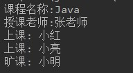
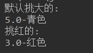
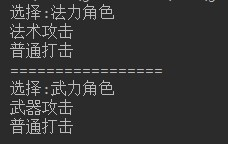

# 基础题目

## 第一题：需求实现

* 定义HandleAble接口，具备一个处理字符串数字的抽象方法方法HandleString（String num）。

  * 处理方式1：取整数部分。
  * 处理方式2：保留指定位小数，四舍五入。

* 代码实现，效果如图所示：

  

* 开发提示：

  * 匿名内部类的方式，调用所有抽象方法。

* 参考答案：

  ```java

	  public class Test1 {
	
	      public static void main(String[] args) {
	
	          String str = "23.23456789";
	          System.out.println("原数字字符串:" + str);
	
	          HandleAble s1 = new HandleAble() {
	              @Override
	              public String handleString(String str) {
	                  return str.substring(0, str.indexOf("."));
	              }
	          };
	          String string = s1.handleString(str);
	
	          System.out.println("取整后:" + string);
	
	          int num = 4;
	    
	          HandleAble s2 = new HandleAble() {
	              @Override
	              public String handleString(String str) {
	    
	                  int i = str.indexOf(".") + num + 1;
	                  char c = str.charAt(i);
	                  //System.out.println(c);
	    
	                  if (c <= '4') {
	                      return str.substring(0, i).toString();
	                  } else {
	                      char c1 = (char) (str.charAt(str.indexOf(".") + num) + 1);
	                      return str.substring(0, i - 1) + c1;
	    
	                  }
	              }
	          };
	          String sss = s2.handleString(str);
	          System.out.println("保留" + num + "位小数后:" + sss);
	    
	      }
	  }
	  interface HandleAble {
	      public abstract String handleString(String str);
	  }

  ```

## 第二题：需求实现

* 模拟上课出勤情况。

- 定义学生类：

  - 属性：姓名，出勤。
  - 提供基本的构造方法和get方法，set方法。

- 定义讲师类：

  - 属性：姓名。
  - 提供基本的构造方法和get方法，set方法
  - 成员方法：点名方法，设置每一位的学生出勤情况。假设，小明今日未出勤。

- 定义课程类：

  - 属性：课程名称，讲师，学生集合。
  - 提供基本的构造方法和get方法，set方法
  - 成员方法：show方法，打印课程信息，老师姓名，学生是否上课情况。

- 代码实现，效果如图所示：

  

- 参考答案：

  ```java
	
	  public class Test2 {
	      public static void main(String[] args) {
	          // 创建Student 对象
	          Student s = new Student("小红");
	          Student s2 = new Student("小亮");
	          Student s3 = new Student("小明");
	
	          //  创建 ArrayList
	          ArrayList<Student> sList = new ArrayList<>();
	          sList.add(s);
	          sList.add(s2);
	          sList.add(s3);
	
	          Teacher t = new Teacher("张老师");
	
	          Course course = new Course("Java", t, sList);
	
	          t.dianMing(sList);
	
	          course.show();
	      }
	  }
	
	  class Course {
	
	      private String name;
	
	      private Teacher t;
	
	      private ArrayList<Student> sList;
	
	      public Course() {
	      }
	
	      public Course(String name, Teacher t, ArrayList<Student> sList) {
	          this.name = name;
	          this.t = t;
	          this.sList = sList;
	      }
	
	      public void show() {
	          System.out.println("课程名称:" + name);
	          System.out.println("授课老师:" + t.getName());
	
	          for (int i = 0; i < sList.size(); i++) {
	              Student student = sList.get(i);
	              String name = student.getName();
	
	              if (student.isCome()) {
	                  System.out.println("上课: " + name);
	              } else {
	                  System.out.println("旷课: " + name);
	              }
	          }
	      }
	  }
	
	  class Teacher {
	
	      private String name;
	
	      public Teacher(String name) {
	          this.name = name;
	      }
	
	      public void dianMing(ArrayList<Student> slist) {
	          for (int i = 0; i < slist.size(); i++) {
	              Student student = slist.get(i);
	              if (!student.getName().equals("小明")) {
	
	                  student.setCome(true);
	              }
	          }
	
	      }
	
	      public String getName() {
	          return name;
	      }
	  }
	
	  class Student {
	
	      private String name;
	
	      private boolean come;
	
	      public Student(String name) {
	          this.name = name;
	
	      }
	
	      public String getName() {
	          return name;
	      }
	
	      public void setName(String name) {
	          this.name = name;
	      }
	
	      public boolean isCome() {
	          return come;
	      }
	
	      public void setCome(boolean come) {
	          this.come = come;
	      }
	  }
  ```


## 第三题：需求实现

* 模拟接待员接待用户，根据用户id，给用户分组。

- 定义接口Filter：
  - 提供抽象方法filterUser（User u）
- 定义用户类：
  - 属性：用户类型，用户id
  - 提供基本的构造方法和get方法，set方法
- 定义接待员类：
  - 属性：接口Filter
  - 提供基本的构造方法和get方法，set方法
  - 成员方法：接待用户方法，设置用户类型。
- 测试类：
  - 初始化50个User对象，id为1-50。
  - 创建三个接待员对象。
    - 第一个接待员，设置接待规则，将10-19号用户类型设置为v1。
    - 第二个接待员，设置接待规则，将20-29号用户类型设置为v2。
  - 遍历用户集合，给用户分区。


- 代码实现，效果如图所示：

  

- 参考答案：

```java
		
		public class Test3 {
		    public static void main(String[] args) {
		
		        ArrayList<User> ulist = new ArrayList<>();
		        for (int i = 1; i <= 50; i++) {
		            ulist.add(new User(i));
		        }
		
		        System.out.println("未分组:");
		        System.out.println(ulist);
		
		        Reception r1 = new Reception();
		        Reception r2 = new Reception();
		        Reception r3 = new Reception();
		        r1.setF(new Filter() {
		            @Override
		            public void filterUser(User u) {
		                if (u.getId() >= 10 && u.getId() < 20)
		                    u.setType("v1");
		            }
		        });
		
		        r2.setF(new Filter() {
		            @Override
		            public void filterUser(User u) {
		                if (u.getId() >= 20 && u.getId() < 30)
		                    u.setType("v2");
		            }
		        });
		
		        for (int i = 0; i < ulist.size(); i++) {
		            User user = ulist.get(i);
		            r1.recept(user);
		            r2.recept(user);
		            r3.recept(user);
		        }
		        System.out.println("已分组:");
		        for (int i = 0; i < ulist.size(); i++) {
		            User user = ulist.get(i);
		            if (i % 9 == 0) {
		                System.out.println();
		            }
		            System.out.print(user + " ");
		        }
		
		    }
		}
		
		class Reception {
		
		    Filter f;
		
		    public Filter getF() {
		        return f;
		    }
		
		    public void setF(Filter f) {
		        this.f = f;
		    }
		
		    public void recept(User u) {
		        if (u.getType() != null)
		            return;
		        if (f != null) {
		            f.filterUser(u);
		            return;
		        } else {
		            u.setType("A");
		        }
		    }
		}
		
		class User {
		
		    private String type;
		
		    private int id;
		
		    public User(int id) {
		        this.id = id;
		    }
		
		    public int getId() {
		        return id;
		    }
		
		    public String getType() {
		        return type;
		    }
		
		    public void setType(String type) {
		        this.type = type;
		    }
		
		    @Override
		    public String toString() {
		        return id + "-" + type;
		    }
		}
		
		interface Filter {
		
		    public abstract void filterUser(User u);
		
		}
```


## 第四题：需求实现

- 模拟工人挑苹果。

- 定义苹果类：

  - 属性：大小，颜色。
  - 提供基本的构造方法和get方法，set方法

- 定义接口CompareAble：

  - 定义默认方法compare，挑选较大苹果。

- 定义接口实现类Compare。

- 定义工人类：

  - 成员方法：挑选苹果Apple pickApple（CompareAble，Apple a1，Apple a2）。

- 测试类：

  - 创建Worker对象。
  - 创建两个Apple对象，一个Apple（5，"青色"）,一个Apple（3，"红色"）
  - 默认挑选大的苹果，打印苹果信息。
  - 指定颜色挑选，通过匿名内部类实现。

- 代码实现，效果如图所示：

  

- 参考答案：


  ```java
		
		public class Test4 {
		    public static void main(String[] args) {
		
		        Worker worker = new Worker();
		
		        Apple apple1 = new Apple(5, "青色");
		        Apple apple2 = new Apple(3, "红色");
		
		        System.out.println("默认挑大的:");
		        Apple apple = worker.pickApple(new Com(), apple1, apple2);
		        System.out.println(apple);
		
		        System.out.println("挑红的:");
		        Apple apple3 = worker.pickApple(new Com() {
		            @Override
		            public Apple compare(Apple a1, Apple a2) {
		                return "红色".equals(a1.getColor()) ? a1 : a2;
		            }
		        }, apple1, apple2);
		        System.out.println(apple3);
		
		    }
		
		}
		
		class Worker {
		
		    public Apple pickApple(CompareAble c, Apple a1, Apple a2) {
		
		        Apple compare = c.compare(a1, a2);
		        return compare;
		
		    }
		
		}
		
		class Apple {
		    double size;
		    String color;
		
		    public Apple(double size, String color) {
		        this.size = size;
		        this.color = color;
		    }
		
		    public String getColor() {
		        return color;
		    }
		
		    public void setColor(String color) {
		        this.color = color;
		    }
		
		    public double getSize() {
		        return size;
		    }
		
		    public void setSize(double size) {
		        this.size = size;
		    }
		
		    @Override
		    public String toString() {
		        return size + "-" + color;
		    }
		}
		
		interface CompareAble {
		    public default Apple compare(Apple a1, Apple a2) {
		        return a1.getSize() > a2.getSize() ? a1 : a2;
		    }
		}
		
		class Com implements CompareAble {
		
		}

  ```

## 第五题：需求实现

- 模拟玩家选择角色。

- 定义接口FightAble：

  - 抽象方法：specialFight。
  - 默认方法：commonFight,方法中打印"普通打击"。

- 定义战士类：

  - 实现FightAble接口,重写方法中打印"武器攻击"。

- 定义法师类：

  - 实现FightAble接口,重写方法中打印"法术攻击"。

- 定义玩家类Player：

  - 成员方法：FightAble select(String str)，根据指令选择角色。
    - 法力角色，选择法师。
    - 武力角色，选择战士。

- 代码实现，效果如图所示：

  

- 参考答案：

```java
		
		public class Test5 {
		    public static void main(String[] args) {
		
		        Player player = new Player();
		        String select  = "法力角色";
		        System.out.println("选择:"+ select);
		        FightAble f = player.select(select);
		        f.specialFight();
		        f.commonFight();
		
		        System.out.println("=================");
		        select = "武力角色";
		        System.out.println("选择:"+ select);
		        FightAble f2 = player.select(select);
		        f2.specialFight();
		        f2.commonFight();
		  
		    }
		}
		
		class Player {
		    public FightAble select(String str) {
		
		        if ("法力角色".equals(str)) {
		            return new FaShi();
		        } else if ("武力角色".equals(str)) {
		            return new ZhanShi();
		        }
		  
		        return null;
		    }
		
		}
		
		class FaShi implements FightAble {
		    @Override
		    public void specialFight() {
		
		        System.out.println("法术攻击");
		    }
		}
		
		class ZhanShi implements FightAble {
		    @Override
		    public void specialFight() {
		        System.out.println("武器攻击");
		    }
		}
		
		interface FightAble {
		    public abstract void specialFight();
		
		    public default void commonFight() {
		        System.out.println("普通打击");
		    }
		}
```

