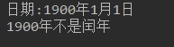
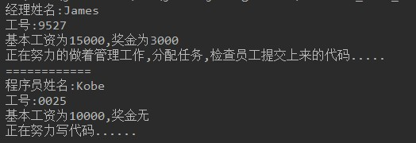

# 基础题目

## 第一题：概念辨析

1. 一个类与它的对象之间是什么关系？

   ```java
   类是对象的模板，对象是类的实体
   ```

2. 如何定义一个类，由哪些部分组成，各个部分的作用是什么？

   ```java
   三部分:
   	成员变量:描述事物的状态信息
   	构造方法:创建事物对象
   	成员方法:描述事物能做什么
   ```

3. 如何创建一个对象，如何使用该对象？

   ```java
   // 创建对象格式: 
   	数据类型 变量名 = new 数据类型();
   // 对象使用方式:
   	变量名.成员变量
   	变量名.成员方法
   ```

4. 局部变量和成员变量的区别？

   ```java
   在类中的位置不同 
   	成员变量：类中，方法外 
   	局部变量：方法中或者方法声明上(形式参数)
   作用范围不一样 
   	成员变量：类中 
   	局部变量：方法中
   初始化值的不同 
   	成员变量：有默认值 
   	局部变量：没有默认值。
   在内存中的位置不同 
   	成员变量：堆内存 
   	局部变量：栈内存
   生命周期不同 
   	成员变量：随着对象的创建而存在，随着对象的消失而消失 
   	局部变量：随着方法的调用而存在，随着方法的调用完毕而消失
   ```

5. 构造方法和成员方法的区别？

   ```java
   作用不同:
   	构造方法:创建对象
   	成员方法:执行某具体功能
   命名不同:
   	构造方法:类名一致
   	成员方法:自定义
   返回值类型不同:
   	构造方法:无返回值类型
   	成员方法:void或者确定的数据类型
   调用不同:
   	构造方法:new 关键字调用
   	成员方法:对象.成员方法名调用
   ```

## 第二题：语法练习

* 定义一个圆形Circle类。
  * 属性：
    * r：半径
  * 构造方法：
    * 无参构造方法
    * 满参构造方法
  * 成员方法：
    * get/set方法
    * showArea方法：打印圆形面积
    * showPerimeter方法：打印圆形周长
* 定义测试类，创建Circle对象，并测试。


* 代码实现，效果如图所示：

  

* 开发提示： 

  > 面向周长公式：2 * 3.14*  半径
  >
  > 圆形面积公式：3.14* 半径^2

* 参考答案：

  * Circle类：

  ```java

		  public class Circle {
		      int r;
		
		      public Circle() {
		      }
		
		      public Circle(int r) {
		          this.r = r;
		      }
		
		      public int getR() {
		          return r;
		      }
		
		      public void setR(int r) {
		          this.r = r;
		      }
		
		      public void showArea(){
		          System.out.println("半径为:"+ r +",面积为:"+ ( 3.14 * r * r));
		      }
		
		      public void showPerimeter(){
		          System.out.println("半径为:"+ r +",面积为:"+ ( 2 * 3.14 * r));
		      }
		  }
  ```

  * 测试类：

  ```java

	  public class Test2 {
	      public static void main(String[] args) {
	          Circle circle = new Circle(8);
	          circle.showArea();
	          circle.showPerimeter();
	      }
	  }
  ```

## 第三题：语法练习

* 定义一个日期MyDate类。
  - 属性：
    - year：年
    - month：月
    - day：日
  - 构造方法：
    - 满参构造方法
  - 成员方法：
    - get/set方法
    - showDate方法：打印日期。
    - isBi方法：判断当前日期是否是闰年
* 定义测试类，创建MyDate对象，并测试。


- 代码实现，效果如图所示：

  

- 开发提示： 

  - 闰年：
    - 普通年（不能被100整除的年份）能被4整除的为闰年。（如2004年就是闰年,1999年不是闰年）；
    - 世纪年（能被100整除的年份）能被400整除的是闰年。(如2000年是闰年，1900年不是闰年)；

- 参考答案：

  - MyDate类：

  ```java

	  public class MyDate {
	      int year;
	      int month;
	      int day;
	
	      public MyDate(int year, int month, int day) {
	          this.year = year;
	          this.month = month;
	          this.day = day;
	      }
	
	      public int getYear() {
	          return year;
	      }
	
	      public void setYear(int year) {
	          this.year = year;
	      }
	
	      public int getMonth() {
	          return month;
	      }
	
	      public void setMonth(int month) {
	          this.month = month;
	      }
	
	      public int getDay() {
	          return day;
	      }
	
	      public void setDay(int day) {
	          this.day = day;
	      }
	
	      public void showDate() {
	          System.out.println("日期:" +
	                  year +
	                  "年" + month +
	                  "月" + day +
	                  "日");
	      }
	
	      public void isBi() {
	
	          if (year % 4 == 0 && year % 100 != 0 || year % 400 == 0) {
	              System.out.println(year + "年是闰年");
	          } else {
	              System.out.println(year + "年不是闰年");
	          }
	      }
	  }
  ```


  - 测试类：

  ```java

	public class Test3 {
	    public static void main(String[] args) {
	        MyDate date = new MyDate(1900, 1, 1);
	        date.showDate();
	        date.isBi();
	    }
	}
  ```

## 第四题：语法练习

- 定义一个扑克Card类。
  - 属性：
    - 花色
    - 点数
  - 构造方法：
    - 满参构造方法
  - 成员方法：
    - showCard方法：打印牌面信息
- 定义测试类，创建Card对象，调用showCard方法。


- 代码实现，效果如图所示：

  

- 参考答案：

  - Card类：

  ```java

	  public class Card {
	      private String ds; // 点数
	      private String hs; // 花色
	
	      public Card(String ds, String hs) {
	          this.ds = ds;
	          this.hs = hs;
	      }
	
	      public void showCard() {
	          System.out.println( ds +    hs  );
	      }
	  }
  ```

  - 测试类：

  ```java

	  public class Test5 {
	      public static void main(String[] args) {
	          Card card = new Card("黑桃", "A");
	          card.showCard();
	      }
	  }
  ```

## 第五题：语法练习

* 定义两个类，经理类Manager，程序员类Coder
* Coder类：
  - 属性：姓名，工号，薪资
  - 构造方法：无参构造方法，满参构造方法
  - 成员方法：
    - get/set方法
    - intro方法：打印姓名，工号信息
    - showSalary方法：打印薪资信息
    - work方法：打印工作信息
* Manager类：
  - 属性：姓名，工号，薪资
    - 经理的薪资有两部分组成：基本工资+奖金
  - 构造方法：无参构造方法，满参构造方法
  - 成员方法：
    - get/set方法
    - intro方法：打印姓名，工号信息
    - showSalary方法：打印薪资信息
    - work方法：打印工作信息
* 定义测试类，创建Manager对象，创建Coder对象，并测试。

- 代码实现，效果如图所示：

  


- 参考答案：

  - Coder类：

  ```java

	  package test4;
	
	  public class Coder {
	      private String name;
	      private String id;
	      private int salary; // 基本工资
	
	      public Coder() {
	
	      }
	
	      public Coder(String name, String id, int salary) {
	          this.name = name;
	          this.id = id;
	          this.salary = salary;
	      }
	
	      public String getName() {
	          return name;
	      }
	
	      public void setName(String name) {
	          this.name = name;
	      }
	
	      public String getId() {
	          return id;
	      }
	
	      public void setId(String id) {
	          this.id = id;
	      }
	
	      public int getSalary() {
	          return salary;
	      }
	
	      public void setSalary(int salary) {
	          this.salary = salary;
	      }
	
	      public void showSalary() {
	          System.out.println("基本工资为" + salary + ",奖金无");
	      }
	
	      public void intro() {
	          System.out.println("程序员姓名:" + name);
	          System.out.println("工号:" + id);
	      }
	
	      public void work() {
	          System.out.println("正在努力写代码......");
	      }
	  }

  ```

  - Manager类：

  ```java

	  public class Manager {
	      private String name;
	      private String id;
	      private int[] salary; // 基本工资 + 奖金
	
	      public Manager() {
	      }
	
	      public Manager(String name, String id, int[] salary) {
	          this.name = name;
	          this.id = id;
	          this.salary = salary;
	      }
	
	      public String getName() {
	          return name;
	      }
	
	      public void setName(String name) {
	          this.name = name;
	      }
	
	      public String getId() {
	          return id;
	      }
	
	      public void setId(String id) {
	          this.id = id;
	      }
	
	      public int[] getSalary() {
	          return salary;
	      }
	
	      public void setSalary(int[] salary) {
	          this.salary = salary;
	      }
	
	      public void showSalary() {
	          System.out.println("基本工资为" + salary[0] + ",奖金为" + salary[1]);
	      }
	
	      public void intro() {
	          System.out.println("经理姓名:" + name);
	          System.out.println("工号:" + id);
	      }
	
	      public void work() {
	          System.out.println("正在努力的做着管理工作,分配任务,检查员工提交上来的代码.....");
	      }
	  }
  ```

  - 测试类：

  ```java

	  public class Test5 {
	      public static void main(String[] args) {
	          int[] salary  = {15000, 3000};
	          Manager m = new Manager("James", "9527",salary );
	          m.intro();
	          m.showSalary();
	          m.work();
	
	          System.out.println("============");
	          Coder c = new Coder();
	          c.setName("Kobe");
	          c.setId("0025");
	          c.setSalary(10000);
	          c.intro();
	          c.showSalary();
	          c.work();
	
	      }
	  }
  ```

## 第六题：语法练习

* 老师类Teacher

  * 属性：姓名name，年龄age，讲课内容content
  * 成员方法：吃饭eat方法，讲课teach方法

* 学生类Student

  * 属性：姓名name，年龄age，学习内容content
     行为：吃饭eat方法，	学习study方法

* 代码实现，效果如图所示：

  


- 参考答案：

  - Teacher类：

  ```java
	
	  package test6;
	  /*
	   */
	  public class Teacher {
	  	private String name;
	  	private int age;
	  	private String content;
	  	/**
	  	 * 讲课方法
	  	 */
	  	public void jiangke() {
	  		System.out.println("年龄为"+age+"的"+name+"正在亢奋的讲着"+content+"的知识........");
	  	}
	
	  	public void eat() {
	  		System.out.println("年龄为"+age+"的"+name+"正在吃饭....");
	  	}
	
	  	public String getName() {
	  		return name;
	  	}
	  	public void setName(String name) {
	  		this.name = name;
	  	}
	  	public int getAge() {
	  		return age;
	  	}
	  	public void setAge(int age) {
	  		this.age = age;
	  	}
	
	  	public String getContent() {
	  		return content;
	  	}
	
	  	public void setContent(String content) {
	  		this.content = content;
	  	}
	
	  	public Teacher() {
	  	}
	
	  	public Teacher(String name, int age, String content) {
	  		this.name = name;
	  		this.age = age;
	  		this.content = content;
	  	}
	
	  }

  ```

  - 学生类：

  ```java

	  public class Student {
	  	private String name;
	  	private int age;
	  	private String content;
	  	public void study() {
	  		System.out.println("年龄为"+age+"的"+name+"正在专心致志的听着"+content+"的知识........");
	  	}
	  	public void eat() {
	  		System.out.println("年龄为"+age+"的"+name+"正在吃饭....");
	  	}
	
	  	public Student(String name, int age, String content) {
	  		this.name = name;
	  		this.age = age;
	  		this.content = content;
	  	}
	  	public Student() {
	  	}
	  	public String getName() {
	  		return name;
	  	}
	  	public void setName(String name) {
	  		this.name = name;
	  	}
	  	public int getAge() {
	  		return age;
	  	}
	  	public void setAge(int age) {
	  		this.age = age;
	  	}
	  	public String getContent() {
	  		return content;
	  	}
	  	public void setContent(String content) {
	  		this.content = content;
	  	}
	  }
  ```

  - 测试类：

  ```java

	  public class Test6 {
	  	public static void main(String[] args) {
	  		Teacher t = new Teacher();
	  		t.setName("周老师");
	  		t.setAge(30);
	  		t.setContent("java面向对象");
	  		t.eat();
	  		t.jiangke();
	  		Student stu = new Student("韩同学",18,"java面向对象");
	  		stu.eat();
	  		stu.study();
	  	}
	  }
  ```

