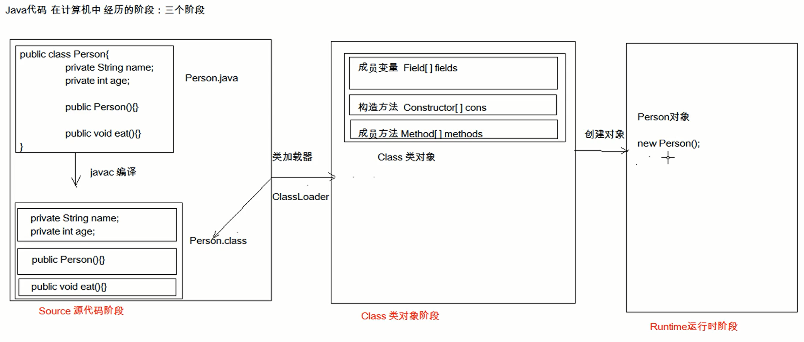
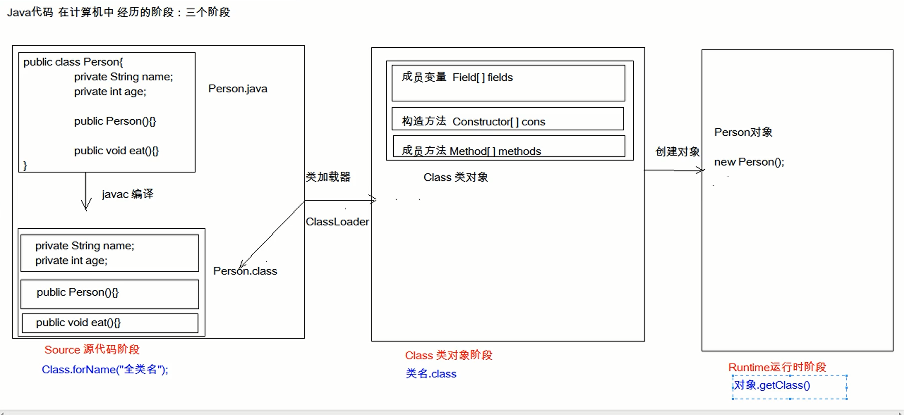

# 今日内容
	1. Junit单元测试
	2. 反射
	3. 注解


Junit 单元测试

反射

注释

## Junit单元测试：

测试分类

1、黑盒测试

2、白盒测试


不需要写代码 给输入值  看程序是否能够输出期望的值

白盒测试 需要写代码  关注程序具体的执行流程

Junit


* 测试分类：
	1. 黑盒测试：不需要写代码，给输入值，看程序是否能够输出期望的值。
	2. 白盒测试：需要写代码的。关注程序具体的执行流程。

* Junit使用：白盒测试
	* 步骤：
		1. 定义一个测试类(测试用例)
			* 建议：
				* 测试类名：被测试的类名Test		CalculatorTest
				* 包名：xxx.xxx.xx.test		cn.itcast.test

		2. 定义测试方法：可以独立运行
			* 建议：
				* 方法名：test测试的方法名		testAdd()  
				* 返回值：void
				* 参数列表：空参

		3. 给方法加@Test
		4. 导入junit依赖环境

	* 判定结果：
		* 红色：失败
		* 绿色：成功
		* 一般我们会使用断言操作来处理结果
			* Assert.assertEquals(期望的结果,运算的结果);

	* 补充：
		* @Before:
			* 修饰的方法会在测试方法之前被自动执行
		* @After:
			* 修饰的方法会在测试方法执行之后自动被执行


Calcuator.java

```java
/**
 * 计算器类
 */
public class Calculator {


    /**
     * 加法
     *
     * @param a
     * @param b
     * @return
     */
    public int add(int a, int b) {
        //int i = 3/0;
        return a - b;
    }

    /**
     * 减法
     *
     * @param a
     * @param b
     * @return
     */
    public int sub(int a, int b) {
        return a - b;
    }

}

```

CalculatorTest.java

```java
public class CalculatorTest {
    /**
     * 初始化方法：
     *  用于资源申请，所有测试方法在执行之前都会先执行该方法
     */
    @Before
    public void init(){
        System.out.println("init...");
    }

    /**
     * 释放资源方法：
     *  在所有测试方法执行完后，都会自动执行该方法
     */
    @After
    public void close(){
        System.out.println("close...");
    }


    /**
     * 测试add方法
     */
    @Test
    public void testAdd(){
       // System.out.println("我被执行了");
        //1.创建计算器对象
        System.out.println("testAdd...");
        Calculator c  = new Calculator();
        //2.调用add方法
        int result = c.add(1, 2);
        //System.out.println(result);

        //3.断言  我断言这个结果是3
        Assert.assertEquals(3,result);

    }

    @Test
    public void testSub(){
        //1.创建计算器对象
        Calculator c  = new Calculator();
        int result = c.sub(1, 2);
        System.out.println("testSub....");
        Assert.assertEquals(-1,result);
    }
}

```


Cannot start compilation: the output path is not specified for module "day01_基础加强".
Specify the output path in the Project Structure dialog.

Project Structure out 文件  


	* 测试分类：
		1. 黑盒测试：不需要写代码，给输入值，看程序是否能够输出期望的值。
		2. 白盒测试：需要写代码的。关注程序具体的执行流程。
	
	* Junit使用：白盒测试
		* 步骤：
			1. 定义一个测试类(测试用例)
				* 建议：
					* 测试类名：被测试的类名Test		CalculatorTest
					* 包名：xxx.xxx.xx.test		cn.itcast.test
	
			2. 定义测试方法：可以独立运行
				* 建议：
					* 方法名：test测试的方法名		testAdd()  
					* 返回值：void
					* 参数列表：空参
	
			3. 给方法加@Test
			4. 导入junit依赖环境
	
		* 判定结果：
			* 红色：失败
			* 绿色：成功
			* 一般我们会使用断言操作来处理结果
				* Assert.assertEquals(期望的结果,运算的结果);
	
		* 补充：
			* @Before:
				* 修饰的方法会在测试方法之前被自动执行
			* @After:
				* 修饰的方法会在测试方法执行之后自动被执行

## 反射：框架设计的灵魂

反射 框架设计的灵魂 

   框架  半成品软件 可以在框架的基础上进行软件开发 简化编码

* 框架：半成品软件。可以在框架的基础上进行软件开发，简化编码
* 反射：将类的各个组成部分封装为其他对象，这就是反射机制
	* 好处：
		1. 可以在程序运行过程中，操作这些对象。
		2. 可以解耦，提高程序的可扩展性。

将类的各个部分封装为其他的对象  

类的各个部分  .class  构造 方法 字段

封装为其他的对象 



源代码阶段  source  Class类对象阶段 Runtime 运行时阶段


Class类对象阶段


定义了一个对象 你是怎么显示那么多的方法 

IDEA运行　


可以在程序运行过程中 操作这些对象 

可以解耦 提高程序的可扩展性 

API的操作


获取操作这对象

获取Class对象的方式

Java阶段 经历三个阶段


* 获取Class对象的方式：
	1. Class.forName("全类名")：将字节码文件加载进内存，返回Class对象
		* 多用于配置文件，将类名定义在配置文件中。读取文件，加载类
	2. 类名.class：通过类名的属性class获取
		* 多用于参数的传递
	3. 对象.getClass()：getClass()方法在Object类中定义着。
		* 多用于对象的获取字节码的方式

	* 结论：
		同一个字节码文件(*.class)在一次程序运行过程中，只会被加载一次，不论通过哪一种方式获取的Class对象都是同一个。

源代码阶段  Class.forName


Object getClass



x


* Class对象功能：
	* 获取功能：
		1. 获取成员变量们
			* Field[] getFields() ：获取所有public修饰的成员变量
			* Field getField(String name)   获取指定名称的 public修饰的成员变量

			* Field[] getDeclaredFields()  获取所有的成员变量，不考虑修饰符
			* Field getDeclaredField(String name)  
		2. 获取构造方法们
			* Constructor<?>[] getConstructors()  
			* Constructor<T> getConstructor(类<?>... parameterTypes)  

			* Constructor<T> getDeclaredConstructor(类<?>... parameterTypes)  
			* Constructor<?>[] getDeclaredConstructors()  
		3. 获取成员方法们：
			* Method[] getMethods()  
			* Method getMethod(String name, 类<?>... parameterTypes)  

			* Method[] getDeclaredMethods()  
			* Method getDeclaredMethod(String name, 类<?>... parameterTypes)  

		4. 获取全类名	
			* String getName()  


* Field：成员变量    * 操作：        1. 设置值            * void set(Object obj, Object value)          2. 获取值            * get(Object obj)         3. 忽略访问权限修饰符的安全检查            * setAccessible(true):暴力反射


* Constructor:构造方法
	* 创建对象：
		* T newInstance(Object... initargs)  
* 如果使用空参数构造方法创建对象，操作可以简化：Class对象的newInstance**方法**


* Method：方法对象
	* 执行方法：
		* Object invoke(Object obj, Object... args)  

	* 获取方法名称：
		* String getName:获取方法名


* 案例：
	* 需求：写一个"框架"，不能改变该类的任何代码的前提下，可以帮我们创建任意类的对象，并且执行其中任意方法
		* 实现：
			1. 配置文件
			2. 反射
		* 步骤：
			1. 将需要创建的对象的全类名和需要执行的方法定义在配置文件中
			2. 在程序中加载读取配置文件
			3. 使用反射技术来加载类文件进内存
			4. 创建对象
			5. 执行方法


	* 框架：半成品软件。可以在框架的基础上进行软件开发，简化编码
	* 反射：将类的各个组成部分封装为其他对象，这就是反射机制
		* 好处：
			1. 可以在程序运行过程中，操作这些对象。
			2. 可以解耦，提高程序的可扩展性。


	* 获取Class对象的方式：
		1. Class.forName("全类名")：将字节码文件加载进内存，返回Class对象
			* 多用于配置文件，将类名定义在配置文件中。读取文件，加载类
		2. 类名.class：通过类名的属性class获取
			* 多用于参数的传递
		3. 对象.getClass()：getClass()方法在Object类中定义着。
			* 多用于对象的获取字节码的方式
	
		* 结论：
			同一个字节码文件(*.class)在一次程序运行过程中，只会被加载一次，不论通过哪一种方式获取的Class对象都是同一个。


	* Class对象功能：
		* 获取功能：
			1. 获取成员变量们
				* Field[] getFields() ：获取所有public修饰的成员变量
				* Field getField(String name)   获取指定名称的 public修饰的成员变量
	
				* Field[] getDeclaredFields()  获取所有的成员变量，不考虑修饰符
				* Field getDeclaredField(String name)  
			2. 获取构造方法们
				* Constructor<?>[] getConstructors()  
				* Constructor<T> getConstructor(类<?>... parameterTypes)  
	
				* Constructor<T> getDeclaredConstructor(类<?>... parameterTypes)  
				* Constructor<?>[] getDeclaredConstructors()  
			3. 获取成员方法们：
				* Method[] getMethods()  
				* Method getMethod(String name, 类<?>... parameterTypes)  
	
				* Method[] getDeclaredMethods()  
				* Method getDeclaredMethod(String name, 类<?>... parameterTypes)  
	
			4. 获取全类名	
				* String getName()  


	* Field：成员变量
		* 操作：
			1. 设置值
				* void set(Object obj, Object value)  
			2. 获取值
				* get(Object obj) 
	
			3. 忽略访问权限修饰符的安全检查
				* setAccessible(true):暴力反射


	* Constructor:构造方法
		* 创建对象：
			* T newInstance(Object... initargs)  
	
			* 如果使用空参数构造方法创建对象，操作可以简化：Class对象的newInstance方法


	* Method：方法对象
		* 执行方法：
			* Object invoke(Object obj, Object... args)  
	
		* 获取方法名称：
			* String getName:获取方法名


	* 案例：
		* 需求：写一个"框架"，不能改变该类的任何代码的前提下，可以帮我们创建任意类的对象，并且执行其中任意方法
			* 实现：
				1. 配置文件
				2. 反射
			* 步骤：
				1. 将需要创建的对象的全类名和需要执行的方法定义在配置文件中
				2. 在程序中加载读取配置文件
				3. 使用反射技术来加载类文件进内存
				4. 创建对象
				5. 执行方法


## 注解：
	* 概念：说明程序的。给计算机看的
	* 注释：用文字描述程序的。给程序员看的
	
	* 定义：注解（Annotation），也叫元数据。一种代码级别的说明。它是JDK1.5及以后版本引入的一个特性，与类、接口、枚举是在同一个层次。它可以声明在包、类、字段、方法、局部变量、方法参数等的前面，用来对这些元素进行说明，注释。
	* 概念描述：
		* JDK1.5之后的新特性
		* 说明程序的
		* 使用注解：@注解名称


​	
	* 作用分类：
		①编写文档：通过代码里标识的注解生成文档【生成文档doc文档】
		②代码分析：通过代码里标识的注解对代码进行分析【使用反射】
		③编译检查：通过代码里标识的注解让编译器能够实现基本的编译检查【Override】


	* JDK中预定义的一些注解
		* @Override	：检测被该注解标注的方法是否是继承自父类(接口)的
		* @Deprecated：该注解标注的内容，表示已过时
		* @SuppressWarnings：压制警告
			* 一般传递参数all  @SuppressWarnings("all")
	
	* 自定义注解
		* 格式：
			元注解
			public @interface 注解名称{
				属性列表;
			}
	
		* 本质：注解本质上就是一个接口，该接口默认继承Annotation接口
			* public interface MyAnno extends java.lang.annotation.Annotation {}
	
		* 属性：接口中的抽象方法
			* 要求：
				1. 属性的返回值类型有下列取值
					* 基本数据类型
					* String
					* 枚举
					* 注解
					* 以上类型的数组
	
				2. 定义了属性，在使用时需要给属性赋值
					1. 如果定义属性时，使用default关键字给属性默认初始化值，则使用注解时，可以不进行属性的赋值。
					2. 如果只有一个属性需要赋值，并且属性的名称是value，则value可以省略，直接定义值即可。
					3. 数组赋值时，值使用{}包裹。如果数组中只有一个值，则{}可以省略
		
		* 元注解：用于描述注解的注解
			* @Target：描述注解能够作用的位置
				* ElementType取值：
					* TYPE：可以作用于类上
					* METHOD：可以作用于方法上
					* FIELD：可以作用于成员变量上
			* @Retention：描述注解被保留的阶段
				* @Retention(RetentionPolicy.RUNTIME)：当前被描述的注解，会保留到class字节码文件中，并被JVM读取到
			* @Documented：描述注解是否被抽取到api文档中
			* @Inherited：描述注解是否被子类继承


	* 在程序使用(解析)注解：获取注解中定义的属性值
		1. 获取注解定义的位置的对象  （Class，Method,Field）
		2. 获取指定的注解
			* getAnnotation(Class)
			//其实就是在内存中生成了一个该注解接口的子类实现对象
	
		            public class ProImpl implements Pro{
		                public String className(){
		                    return "cn.itcast.annotation.Demo1";
		                }
		                public String methodName(){
		                    return "show";
		                }
		            }
		3. 调用注解中的抽象方法获取配置的属性值


	* 案例：简单的测试框架
	* 小结：
		1. 以后大多数时候，我们会使用注解，而不是自定义注解
		2. 注解给谁用？
			1. 编译器
			2. 给解析程序用
		3. 注解不是程序的一部分，可以理解为注解就是一个标签