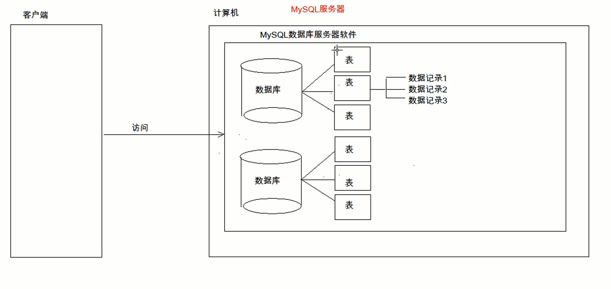

# MySQL基础

1. 数据库的基本概念


2. MySQL数据库软件
   1. 安装
   2. 卸载
   3. 配置
3. SQL

# 1、数据库的基本概念

1. 数据库的英文单词： DataBase 简称 ： DB
2. 什么数据库？
	* 用于存储和管理数据的仓库。

3. 数据库的特点：
	1. 持久化存储数据的。其实数据库就是一个文件系统
	2. 方便存储和管理数据
	3. 使用了统一的方式操作数据库 -- SQL

# 2、MySQL数据库软件

1. 安装
2. 卸载
	
3. 配置
	* MySQL服务启动
		1. 手动。Win10 - > 此电脑 ->管理->服务和应用程序->服务->MySQL
		2. cmd--> services.msc 打开服务的窗口 ->MySQL
		3. 使用管理员打开cmd
			* net start mysql : 启动mysql的服务
			* net stop mysql:关闭mysql服务
			* 没管理员权限不足 发生系统错误5 拒绝访问
			* net start mysql net stop mysql
		
	* MySQL登录
		1. mysql -uroot -p密码 mysql -u root -p123456
		
		2. mysql -hip -uroot -p连接目标的密码 mysql -h127.0.0.1 -uroot -p123456
	
		3. mysql --host=ip --user=root --password=连接目标的密码 mysql --host=127.0.0.1 --user=root --password=123456
		
		   
		
	* MySQL退出
		1. exit
		2. quit
	
	* MySQL目录结构
		
		我的安装路径
		
		1. MySQL安装目录：basedir="D:\databases\mysql-5.7.28"
			* 配置文件 my.ini
		2. MySQL数据目录：datadir="D:\databases\mysql-5.7.28\data"
		3. 
		4. 数据库、表、数据
		  * 几个概念
		  	* 数据库：文件夹
		  	* 表：文件
		  	* 数据：数据


# 3、SQL

1.什么是SQL？
	Structured Query Language：结构化查询语言
	其实就是定义了操作所有关系型数据库的规则。SQL是一种规则样的，每一种数据库操作的方式存在不一样的地方，称为“方言”。

标准   规范 	

关系型数据库Relational DBMS  

2.SQL通用语法

 	1. SQL 语句可以单行或多行书写，以分号结尾。;
 	2. 可使用空格和缩进来增强语句的可读性。
 	3. MySQL 数据库的 SQL 语句不区分大小写，关键字建议使用大写。关键字建议使用大写
 	4. 3 种注释
     * 单行注释: -- 注释内容 或 # 注释内容(mysql 特有) 
     * `-- 注释内容`    MySQL（特有）`# 注释内容`  `#注释内容`
     * 多行注释: /* 注释 */
     * `/* 我是多行注释呢*/`

3.SQL分类
1) DDL(Data Definition Language)数据定义语言
	用来定义数据库对象：数据库，表，列等。关键字：create, drop,alter 等

DDL 数据定义语言  定义数据库对象  数据库、表、列等

create、drop、alter ...   

2) DML(Data Manipulation Language)数据操作语言
	用来对数据库中表的数据进行增删改。关键字：insert, delete, update 等 

DML数据操作语言  Manipulation操纵

对数据库中的表进行增删改 insert delete update ...

3) DQL(Data Query Language)数据查询语言
	用来查询数据库中表的记录(数据)。关键字：select, where 等

数据查询语言 用来查询数据库中表的记录  select,where...

4) DCL(Data Control Language)数据控制语言(了解)
	用来定义数据库的访问权限和安全级别，及创建用户。关键字：GRANT， REVOKE 等

DCL 数据控制语言  用来定义数据库的访问权限和安全级别及插件用户  grant、revoke...

DDL数据定义语言 DML数据操纵语言 DQL 数据查询语言DCL数据控制语言

## DDL:操作数据库、表

1. 操作数据库：CRUD  增删改查 Create Read（Retrieve查询） Update Delete
	1. C(Create):创建
		* 创建数据库：
			* create database 数据库名称;
			* `create database test;`
		* 创建数据库，判断不存在，再创建：
			* create database if not exists 数据库名称;
			* `create database if not exists test;`
* 创建数据库，并指定字符集
			* create database 数据库名称 character set 字符集名;
		* `create database test character set gbk;`
			
		* 练习： 创建db4数据库，判断是否存在，并制定字符集为gbk
			* create database if not exists db4 character set gbk;
	2. R(Retrieve)：查询
		* 查询所有数据库的名称:
			
			* show databases;
		* 查询某个数据库的字符集:查询某个数据库的创建语句
			
			* show create database 数据库名称;
			
			* `show create database mysql;`
			
			* ```mysql
			  mysql> show create database mysql;
			  +----------+------------------------------------------------------------------+
			  | Database | Create Database                                                  |
			  +----------+------------------------------------------------------------------+
			  | mysql    | CREATE DATABASE `mysql` /*!40100 DEFAULT CHARACTER SET latin1 */ |
			  +----------+------------------------------------------------------------------+
			  1 row in set (0.00 sec)
			  
			  mysql>
			  ```
			
			* 
	3. U(Update):修改
		* 修改数据库的字符集
			* alter database 数据库名称 character set 字符集名称;  character 
	4. D(Delete):删除
		* 删除数据库
			* drop database 数据库名称;
		* 判断数据库存在，存在再删除
			* drop database if exists 数据库名称;
			* `drop database if exists text;`
	5. 使用数据库
		* 查询当前正在使用的数据库名称
			
			* select database();
		* 使用数据库
			
			* use 数据库名称;
			
			* ```mysql
			  mysql> select database();
			  +------------+
			  | database() |
			  +------------+
			  | NULL       |
			  +------------+
			  1 row in set (0.00 sec)
			  
			  mysql> use test;
			  Database changed
			  mysql> select database();
			  +------------+
			  | database() |
			  +------------+
			  | test       |
			  +------------+
			  1 row in set (0.00 sec)
			  
			  mysql>
			  ```
			
			  
	
2. 操作表
  1. C(Create):创建  
  	1. 语法：
  		create table 表名(
  			列名1 数据类型1,
  			列名2 数据类型2,
  			....
  			列名n 数据类型n
  		);  
  		
  		```mysql
  		create table mall_user{
  			id int(11),
  			username varchar(50)，
  			password varchar(50)
  		}
  		```
  		
  		

  		* 注意：最后一列，不需要加逗号（,）
  		* 数据库类型：
  			1. int：整数类型
  				
  				* age int,
  				
  			2. double:小数类型
  				
  				* score double(5,2)
  				
  		3. date:日期，只包含年月日，yyyy-MM-dd
  			
  			   日期 年月日
  			
  			4. datetime:日期，包含年月日时分秒	 yyyy-MM-dd HH:mm:ss   日期 年月日时分秒 
  			
  			5. timestamp:时戳类型	包含年月日时分秒	 yyyy-MM-dd HH:mm:ss	
  			
  			  * 如果将来不给这个字段赋值，或赋值为null，则默认使用当前的系统时间，来自动赋值   默认使用当前的系统时间 
  			
  			6. varchar：字符串
  			  * name varchar(20):姓名最大20个字符
  			  * zhangsan 8个字符  张三 2个字符
  			
  			7. TEXT  文本  


* 创建表
			create table student(
				id int,
				name varchar(32),
				age int ,
				score double(4,1),
				birthday date,
				insert_time timestamp
			);   
	
	double(4,1) 取一位小数 timestamp时间戳 默认当前时间  
		* 复制表：	
			* create table 表名 like 被复制的表名;	 
			* 复制表  
			* create table 表名 like 被复制的表名;
			*  
	
	2. R(Retrieve)：查询
		* 查询某个数据库中所有的表名称
			
			* show tables;
			
			* ```mysql
			  mysql> show tables;
			  +----------------+
			  | Tables_in_test |
			  +----------------+
			  | t_stu          |
			  +----------------+
			  1 row in set (0.00 sec)
			  
			  mysql>
			  ```
			
			  
		* 查询表结构
			
			* desc 表名;
			
			* ```mysql
			  mysql> desc t_stu;
			  +--------+--------------+------+-----+---------+-------+
			  | Field  | Type         | Null | Key | Default | Extra |
			  +--------+--------------+------+-----+---------+-------+
			  | sid    | int(11)      | YES  |     | NULL    |       |
			  | sname  | varchar(100) | YES  |     | NULL    |       |
			  | gender | char(1)      | YES  |     | NULL    |       |
			  +--------+--------------+------+-----+---------+-------+
			  3 rows in set (0.01 sec)
			  
			  mysql>
			  ```
			
			  
	3. U(Update):修改
		1. 修改表名
			alter table 表名 rename to 新的表名;
			
		2. 修改表的字符集
		  alter table 表名 character set 字符集名称;
		
		3. 添加一列
		  alter table 表名 add 列名 数据类型;
		
		  `alter table stu add username varchar(20);`
		
		4. 修改列名称 类型
		  alter table 表名 change 列名 新列别 新数据类型;
		
		  `alter table student change username name varchar(20);  `  
		
		  alter table 表名 modify 列名 新数据类型;
		
		  `alter table student modify name varchar(50);`
		
		5. 删除列
		  alter table 表名 drop 列名;
		
		  改表名 
		
		  `alter table 表名  rename to 新表名;`
		
		  `alter table student rename to stu; `
		
		  
	4. D(Delete):删除
		* drop table 表名;
		
		* drop table  if exists 表名 ;   exists 
		
		  `drop table if exists test;`

## DML：增删改表中数据


1. 添加数据：
	* 语法：
		* insert into 表名(列名1,列名2,...列名n) values(值1,值2,...值n);
	* 注意：
		1. 列名和值要一一对应。
		2. 如果表名后，不定义列名，则默认给所有列添加值
			insert into 表名 values(值1,值2,...值n);
		3. 除了数字类型，其他类型需要使用引号(单双都可以)引起来
2. 删除数据：
	* 语法：
		
		* delete from 表名 [where 条件]
	* 注意：
		1. 如果不加条件，则删除表中所有记录。
		2. 如果要删除所有记录
			1. delete from 表名; -- 不推荐使用。有多少条记录就会执行多少次删除操作
			
			2. TRUNCATE TABLE 表名; -- 推荐使用，效率更高 先删除表，然后再创建一张一样的表。
			
			3. truncate table 表名； 推荐使用 效率更高 先删除表 
			
			   再创建一张一样的表 
3. 修改数据：
	* 语法：
		
* update 表名 set 列名1 = 值1, 列名2 = 值2,... [where 条件]; 
		
		  update 表名 set ... 条件
		
	* 注意：
		
		1. 如果不加任何条件，则会将表中所有记录全部修改。
		
		   ​	update student set name='菜鸡'; 
		
		    修改加上条件就好了

## DQL：查询表中的记录

DQL：查询语句

排序查询

聚合函数

分组查询

分页查询


约束

多表之间的关系

范式

数据库的备份与还原

1 排序查询

语法 order by 子句 

例如 order by 排序字段1 排序方式 排序字段2 排序方式2

排序方式 ASC 升序 默认的 小到大

DESC 降序的  大到小

* select * from 表名;

1. 语法：
	select
		字段列表
	from
		表名列表
	where
		条件列表
	group by
		分组字段
	having
		分组之后的条件
	order by
		排序
	limit
		分页限定

select  字段列表 from 表名列表 where 条件列表 group by 分组字段 having 分组之后的条件 order by 排序 limit 分页限定


2. 基础查询
	1. 多个字段的查询
		select 字段名1，字段名2... from 表名；
		* 注意：
			* 如果查询所有字段，则可以使用*来替代字段列表。
	2. 去除重复：
		* distinct
		* distinct去除重复 
	3. 计算列
		* 一般可以使用四则运算计算一些列的值。（一般只会进行数值型的计算）
		* ifnull(表达式1,表达式2)：null参与的运算，计算结果都为null
			* 表达式1：哪个字段需要判断是否为null
			* 如果该字段为null后的替换值。
	4. 起别名：
		* as：as也可以省略

3 条件查询 where 子句 后根条件

```
3. 条件查询
	1. where子句后跟条件
	2. 运算符
		* > 、< 、<= 、>= 、= 、<>
		* BETWEEN...AND  
		* IN( 集合) 
		* LIKE：模糊查询
			* 占位符：
				* _:单个任意字符
				* %：多个任意字符
		* IS NULL  
		* and  或 &&
		* or  或 || 
		* not  或 !
		
			-- 查询年龄大于20岁

			SELECT * FROM student WHERE age > 20;
			
			SELECT * FROM student WHERE age >= 20;
			
			-- 查询年龄等于20岁
			SELECT * FROM student WHERE age = 20;
			
			-- 查询年龄不等于20岁
			SELECT * FROM student WHERE age != 20;
			SELECT * FROM student WHERE age <> 20;
			
			-- 查询年龄大于等于20 小于等于30
			
			SELECT * FROM student WHERE age >= 20 &&  age <=30;
			SELECT * FROM student WHERE age >= 20 AND  age <=30;
			SELECT * FROM student WHERE age BETWEEN 20 AND 30;
			
			-- 查询年龄22岁，18岁，25岁的信息
			SELECT * FROM student WHERE age = 22 OR age = 18 OR age = 25
			SELECT * FROM student WHERE age IN (22,18,25);
			
			-- 查询英语成绩为null
			SELECT * FROM student WHERE english = NULL; -- 不对的。null值不能使用 = （!=） 判断
			
			SELECT * FROM student WHERE english IS NULL;
			
			-- 查询英语成绩不为null
			SELECT * FROM student WHERE english  IS NOT NULL;
```


```
	-- 查询姓马的有哪些？ like
			SELECT * FROM student WHERE NAME LIKE '马%';
			-- 查询姓名第二个字是化的人
			
			SELECT * FROM student WHERE NAME LIKE "_化%";
			
			-- 查询姓名是3个字的人
			SELECT * FROM student WHERE NAME LIKE '___';
```


```
		-- 查询姓名中包含德的人
			SELECT * FROM student WHERE NAME LIKE '%德%';
```

