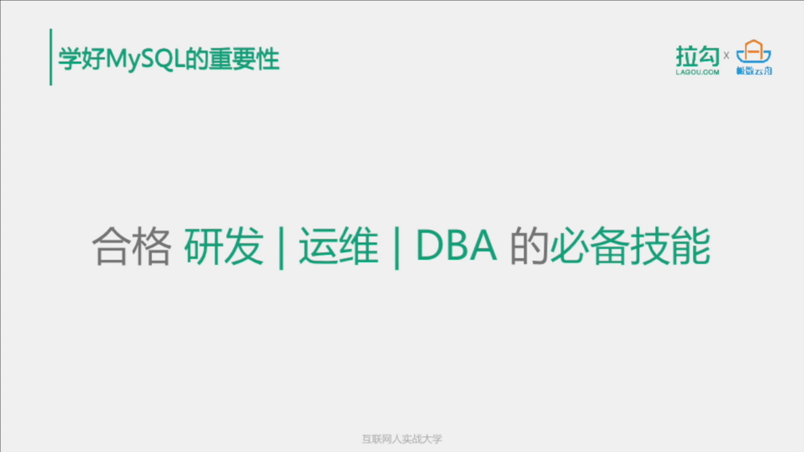
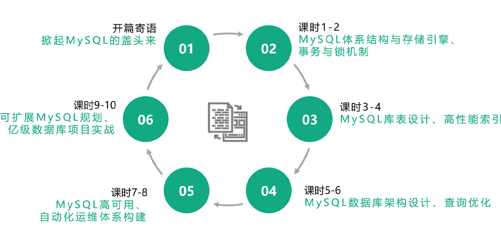
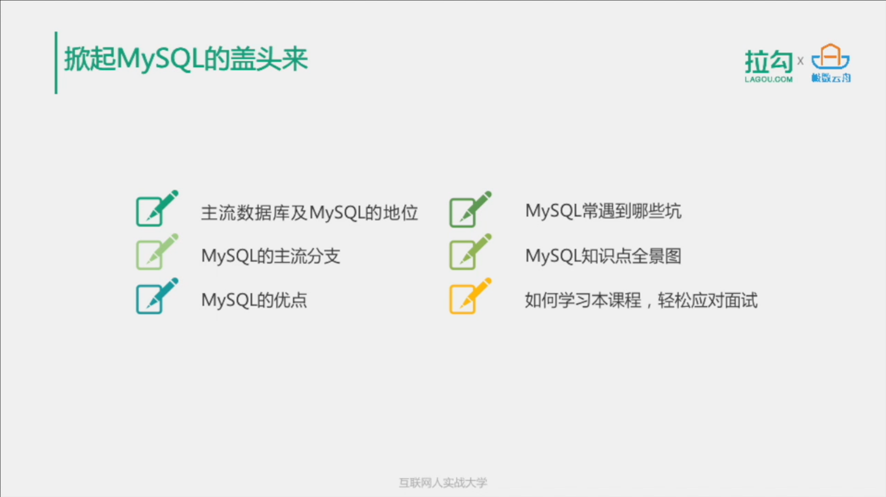
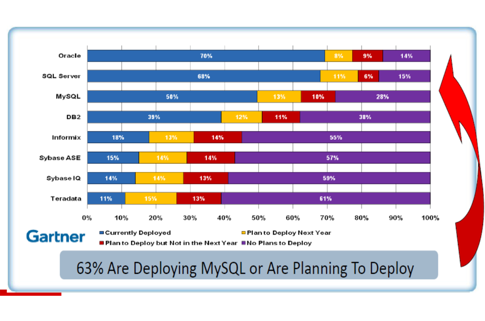
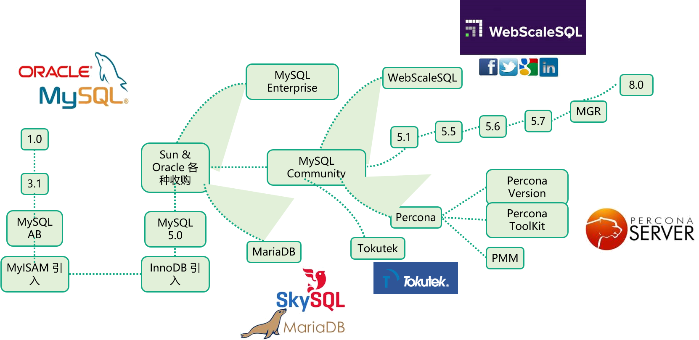
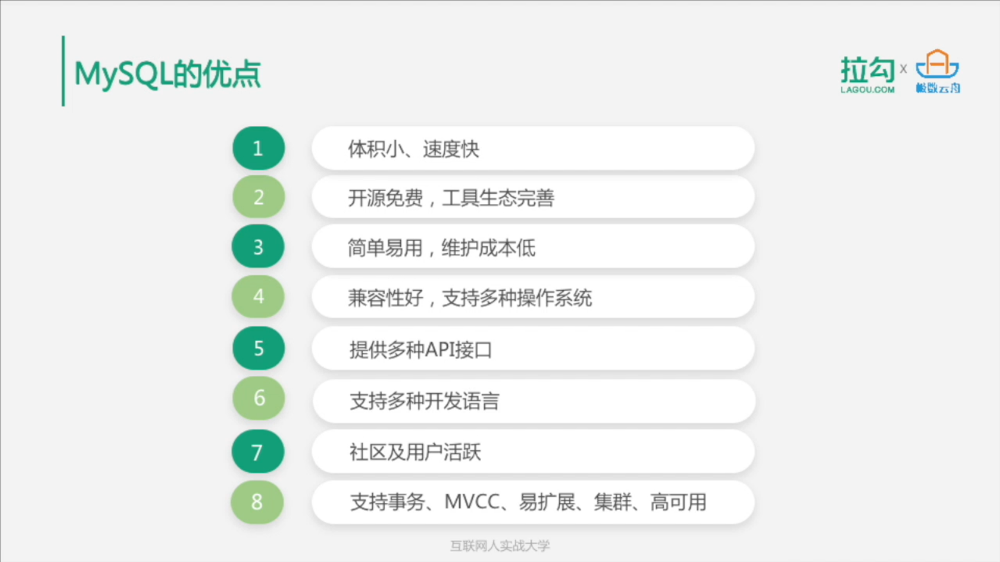
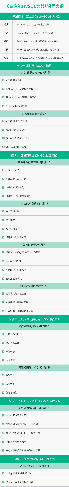

**开篇寄语：建立完整的MySQL知识体系**

# 开篇寄语：建立完整的MySQL知识体系

2019/09/10 周彦伟

 

你好，欢迎来到由拉勾和极数云舟联合出品的「高性能 MySQL 实战」课程，我是讲师周彦伟。

 极数云舟是一家开源数据库服务商，拥有MySQL、Redis、HBase等技术，致力为用户提供数据库维护及行业解决方案，旗下拥有Arkmon监控平台、Arkive自动化归档平台等产品。

我是谁  我有多厉害  

我从事软件开发 运维近10年

我是12岁的时候接触了编程

2010年 一个新的时代 编程的世界 

自我介绍下，我从事数据库开发和运维工作近 15 年，先后曾担任人人网数据库主管和去哪儿网数据库总监，在数据库的架构设计、性能调优、大规模数据库集群运维等方面积累了丰富的实战经验。

 

数据库   数据库的架构设计  性能调优 大规模数据库集群 运维等方面积累了丰富的实战经验  

我目前创立了一家数据库公司——极数云舟，致力于企业级云原生数据库 ArkDB 的产品研发和相关企业级数据库解决方案的架构和实施。同时，我个人是 Oracle ACE Director，还担任中国计算机行业协会开源数据库专业委员会会长。曾出版过原创 MySQL 技术书籍《MySQL运维内参》，这本书是 MySQL 运维实战与源码分析的完美结合，被业界称为 MySQL 面试宝典，还有一本《MySQL 8 Cookbook》中文版，这是第一本 MySQL8 的中文书籍。

 MySQL技术书籍 MySQL运维内参

运维实战与源码分析的完美结合 

这门课是由我和我的搭档许子文联合出品，许子文是业内为数不多的数据库专业人才，现任极数云舟项目总监，先后就职于达梦数据库、去哪儿网。在去哪儿网时，负责整个去哪儿网的支付和金融体系数据库架构设计、运维管理和性能优化。

 

数据库架构设计  运维管理 和性能性化 

###### **为什么要学好 MySQL**

 

###### **MySQL 已成为各大厂通用的数据库** 

 

互联网技术在近 10 多年发生了翻天覆地的变化，最早是以 IOE 架构为代表，即：IBM 的服务器、Oracle 数据库、EMC 存储设备。IOE 几乎是全世界大公司的“黄金搭档”。国内的银行、电信、证券这些不差钱的行业很喜欢 IOE。这些传统大企业的业务规模变化稳定，IOE 足够支撑日常业务需求，公司本身又有足够的 IT 预算。

 

业务规模  变化稳定

日常业务需求     足够的IT预算  

直到互联网公司崛起，互联网公司的业务增长已经不再是传统公司的线性模式，而是指数级爆发式的增长。

jue  崛起   指数爆发式的增长  

互联网公司

为了应对这种业务增长速度，服务海量的用户，最早像谷歌、Amazon、Facebook、阿里等等国内外的互联网巨头纷纷选择用 X86 通用服务器、开源数据库 MySQL，以及分布式存储代替 IOE 架构，经过 10 多年的发展，这股风潮已经逐渐从互联网企业蔓延到传统企业。

​    X86通用服务器  开源数据库MySQL   分布式存储 

​       

**学好 MySQL，做一个合格的互联网开发、运维、DBA**

 

由于互联网业务常常伴随着海量用户、高并发请求，对 MySQL 的性能、可用性都提出了很高的要求。所以如何利用 MySQL 来支撑互联网的海量数据和高并发请求已经是一个合格的互联网开发、运维、DBA 的必备技能。

 海量用户 高并发请求  Mysql性能 可用性 

利用MySQL来支撑互联网的海量数据和高并发请求已经是一个合格的互联网开发 运维 DAB的必备技能 

我想通过这门课，让你掌握 MySQL 的底层运行机制，教你如何发挥 MySQL 的最佳性能、让你掌握 MySQL 在互联网应用领域的最佳实践，学会如何处理亿级业务数据和高并发请求。

 

**如何高效学习 MySQL**   

 

为了能够使大家真正高效学好 MySQL，我们对整门课程做了精心的规划。下面来看一下这门课的整体设计。

​    

   

本课除了开篇之外，分为五大部分。

- 第一部分主要介绍 MySQL 的体系架构与存储引擎，也会介绍一些事务与锁的机制。从整体到细节地帮助你比较深入地去了解 MySQL 的内部机制和原理，这也是在面试过程中面试官比较喜欢问的。
- 在第二部分里，我们会用两个课时来介绍 MySQL 库表设计和索引设计的一些思路。
- 第三部分，我们会介绍 MySQL 的架构设计和查询优化，这也是在工作中最常碰到的。
- 在第四部分，我们会来介绍 MySQL 的高可用架构方案和一些要点，同时，也会讲解一下 MySQL 自动化运维体系构建的一些思路和知识点。
- 最后一部分，我们会通过一个亿级数据库的项目，用实战的方式来讲解怎么去规划或设计一个可扩展的 MySQL 架构。

###### **掀起 MySQL 的盖头来**

######

###### **主流数据库**

######

MySQL 是数据库的一种，你要学习 MySQL、掌握 MySQL，首先要了解下主流数据库。如下图所示，根据数据库的类型或者功能或者数据库的发展方向，可以把数据库大致分成两类。即关系型数据库和非关系性数据库，或者叫 SQL 和 NoSQL，当然了关系型数据库又可以分为传统的关系型数据库和 NewSQL。图中列举了平时你所能听到的几乎所有的数据库类型，可以看到一个巨大的数据库图谱。

 MySQL是数据库的一种 

SQL  NoSQL  

关系型数据库 NewSQL  

Traditional

  

######     

###### **MySQL 的重要地位**

 

而 MySQL 在整个数据库图谱中占有非常重要的地位。据全球著名分析公司 Gartner 提供的数据，已有超过 63% 的用户已经部署或者将要部署 MySQL。

​    

   部署  将要部署 

目前国内大部分互联网公司都选择 MySQL 数据库来支撑自己的业务，例如，你所熟知的腾讯、阿里、百度、头条、美团、滴滴、快手、携程、去哪儿网等等公司都有大规模的 MySQL 集群。

 

大规模的MySQL集群

###### **MySQL 的主流分支**

 

如下图，来看一下 MySQL 的主流分支。MySQL 从最初的 1.0、3.1 到后来的 5.0，发生了各种各样的变化。被 Oracle 收购后，MySQL 的版本其实主要有几个分支，除了需要付费的 MySQL 企业版本，还有很多 MySQL 社区版本。

​     

   

当然，第一条分支肯定是已经更新到 8.0 的 MySQL 官方版本。还有一条分支非常流行的开源分支版本叫 Percona Server，它是 MySQL 的技术支持公司 Percona 推出的，也是在实际工作中经常碰到的。Percona Server 在 MySQL 官方版本的基础上做了一些补丁和优化，同时推出了一些工具。另外一个非常不错的版本叫 MariaDB，它是 MySQL 的公司被 Oracle 收购后，MySQL 的创始人 Monty 先生，按原来的思路重新写的一套新数据库，同时也把 InnoDB 引擎作为主要存储引擎，也算 MySQL 的分支。

 

###### **MySQL 的优点**

 

前面提到，大多数技术人都是 MySQL 用户，主要是因为 MySQL 具有 8 大优点。

- 第一个是体积小、速度快，可以在不占用太多资源的情况下提供数据库服务；
- 第二个是开源免费，工具生态完善，用起来没有经济门槛；
- 然后是，简单易用，维护成本低，用起来没有技术门槛；
- 兼容性好，支持多种操作系统，用起来没有平台门槛；
- 提供多种 API 接口；
- 支持多种开发语言，用起来没有编程语言门槛；
- 社区及用户活跃，用起来没有技术支持门槛；
- 最重要的，就是 MySQL 的数据库属性，它支持事务、MVCC、4 种隔离级别等，同时易扩展、集群、高可用等也可以满足一般需求。

体积小  速度快  不占用太多资源的情况下提供数据库服务

开源免费 工具生态完善    经济门槛

简单易用 维护成本低  技术门槛

兼容性好  支持多种操作系统 用起来没有平台门槛

提供多种API接口

支持多种开发语言  编程语言门槛

社区 用户活跃 技术支持门槛

MySQL数据库属性  支持事物 MVCC  4种隔离级别  易扩展 集群 高可用

满足一般需求 

###### **MySQL 常见的坑**  

 

如果你从事研发及 MySQL 编程或者运维支持的工作，那么你一定碰到过下图这些坑。

 flush-Logs导致hang住无法写入数据

忘记密码 cache-full

延迟

2013

1064

死锁

主键冲突

掉电    

删库跑路

脑裂

字符集错误

慢查询1032

1053

Query-Cache

metadata-lock

没备份

断网

ulimit-u导致创建链接失败 

表数据碎片

ulimit-u导致创建链接失败

大小写敏感

表数据碎片 

   

比方说最著名的删库跑路。在运维数据库的过程中，你如果不小心把库删掉了，进行什么操作才能实现最大的弥补，不至于做出跑路这种无奈之举，当然，跑路只是开玩笑而已。还有在碰到断电或者是主键冲突的时候，你该怎么办？数据库延迟了，你该怎么办？忘记了数据库密码，你该怎么办？还有MySQL大小写敏感得用什么样的策略，另外，表空间有碎片，你该怎么解决，或者说怎么去巡检，怎么查看表空间和表数据的碎片？等等，还有很多，这里就不详细展开了。

 删库跑路 运维数据库的过程中   不小心把库删掉了  进行什么操作才能实现最大的弥补

断点 主键冲突  数据库延迟

忘记了数据库密码   MySQL大小写敏感得用什么样得策略

表空间有碎片

该怎么解决   说怎么去巡检   怎么查看表空间和表数据的碎片  

还有很多

在后续的课程中，我会慢慢地教你把这些问题都解决掉，让你在今后的工作中碰到问题时，不至于束手无策。其实，大部分面试官都喜欢通过问自己过去踩过的坑，来考察被面试者解决问题的能力，所以学好本课程还可以让你在求职面试中，给人眼前一亮的感觉。

问自己过去踩过的坑 来考察被面试者解决问题的能力

求职面试中   给人眼前一亮的感觉

 

###### **MySQL 知识点全景图**

​       

另外，为了帮助大家理清学习思路，我整理了一个比较全面的 MySQL 知识点全景图如下，包括系统、网络、硬件、到性能优化、高可用、架构设计等等方面，这些知识点会贯穿整个课程。

理清学习思路  整理了一个比较全面的MySQL知识点全景图 

系统 网络  硬件  性能优化  高可用  架构设计   贯穿整个课程

​     

系统 网络 硬件 原理 部署

优化  InnoDB 复制 备份/还原 监控  

高可用  架构设计 容量规划 技术生态  编程

   

优化包括数据库针对系统的优化   

本身参数的优化

SQL的优化

业务的优化

InnoDB 技术焦点和特性 

学习和了解  

数据库的复制 MySQL Replication 

面试官考察 复制的原理 复制的类型 各种复制之间的差异 

顶层 数据库的容量规划这么多 数据库的生态体系该怎么掌握  怎么学习 

比如，优化包括数据库针对系统的优化，针对数据库本身参数的优化，针对SQL的优化，针对业务的优化等等。还有一个比较关键的点——InnoDB，因为一般使用 MySQL 都会使用 InnoDB 作为存储引擎，所以 InnoDB 有很多技术焦点和特性，需要你去学习和了解。另外就是数据库的复制、MySQL Replication，这也是经常会被面试官所考察的，包括复制的原理、复制的类型、各种复制之间的差异等等。还有就是从顶层来看，数据库的容量规划这么多，数据库的生态体系该怎么掌握，或者是怎么学习？等等，就不一一列举了。

 

**好书推荐**       

 

有句诗说的好“纸上得来终觉浅，绝知此事要躬行”。想要真正学好本门课，需要听课、看书、实践三手抓。

 听课 看书 实践

MySQL官方手册

英文版 

MySQL运维内参

MySQL 8 Cookbook

王婆卖瓜  自卖自夸 

在讲课的过程中，我会推荐一些讲解技术要点的书籍，这里先列举一些。非常推荐的是《MySQL官方手册》，我希望你能至少通读一遍，最好是英文版，因为它原汁原味，讲解得也更加清晰。另外，我也推荐《MySQL运维内参》，里面详细介绍了MySQL运维中的很多痛点，同时也是分析了MySQL内核的一些知识。第三本是《MySQL 8 Cookbook》，这本书内容比较浅显，但对你掌握MySQL8的技术要点一定有所帮助。还有下面这几本书也建议你仔细看一遍。

​     

   

MySQL官方手册

MySQL运维内参

MySQL技术内幕 InnoDB存储引擎

高性能MySQL

数据库索引设计与优化

MySQL内核InnoDB存储引擎

深入理解MySQL核心技术

Effective MySQL  Replication Techniques in Depth

除此以外，想要把学到的知识转变为真正掌握的技能，最重要是上手实践。

技能  上手实践 

下节课开始，我将带你把工作或面试中遇到的MySQL重难点各各击破，为了对正式学习作准备，给你留一个作业：按照本课时面试要点部分的提示，画一个“MySQL 知识体系图谱”思维导图。

MySQL知识体系图谱 

# 写留言

在外包公司工作了三年，想换到互联网公司挺难的，面试的时候讲到数据库调优这块完全没碰过，只会增删改查，希望通过拉勾这门课程快速掌握MySQL的要领。

换到互联网公司

数据库调优

之前有看过周老师的《MySQL运维内参》非常受用。所以看见拉勾有课程就毫不犹豫的学习了。老师从点及面，串起了整个知识网络，还有一些工作中的实例，并不是只是一些底层原理和工具介绍，希望可以多出一些系列课。

非常受用 

点  面  网络   

终于学完了整个课程。想着也要写一下自己的感受和成长。受益颇深，从最初的只会增删改查到现在可以说已经初具功力。学完之后我还专门挑了join那个章节做了ppt为团队小伙伴做了分享，得到了小伙伴的一致好评，说比dba的分享都靠谱，听完实在是太开心了。后续我还会再刷第二遍，第二遍就会结合实践深挖，我相信收获会更大，再次感谢老师！

老师讲的清晰透彻，值得推荐
编辑回复： 感谢童靴的支持~

虽然本人是个java开发，但是mysql技术栈也不能落后，本课程提供了一个较好的mysql进阶方向，课程内容也很好，由浅入深且实用。后面的小伙伴们不要犹豫，可以入手了！！

这个专栏把mysql讲的很全面，作为java开发也一期不落的看完了。专栏里面的内容好多没有消化，打算二刷

老师讲的都是实用性很强的内容，我之前做过Oracle、SQLServer和SAP HANA数据库的DBA，现在想转行MySQL DBA，我觉得这门课真的太值得了，必须10分给老师！

通过学习感觉已经大概对mysql有个整体的认识了，进一步的深化还需要自己一步步的实践，再看其他的讲解mysql的书也没有那么那么的晦涩难懂了，感谢老师，希望进一步出mysql更为好的课程。

学习了课程后，从一知半解的懵懂状态到知识体系逐渐成型，比如表设计和索引设计一直是我的盲点，非常期待后面的分库分表和实战讲解，相信玩转mysql指日可待!

工作2年多，都在写边缘的业务，数据量和请求量都不大，有一次做了一个QPS比较大的接口，直接把DB拖死了。以前学校学的数据库和真实公司里用法完全不同，看到这门课果断下单了，看了几节课后收获很大，期待快点更新完~

工作几年，对数据库只是浅显的认识和操作，希望买了这门课，能够弥补自己在这方面的不足，完全有信心。
官方客服回复： 谢谢您的支持，学习愉快！

获益良多，对MySQL的底层运作机制有了比较深的认知，周老师果然是MySQL行家。课程里的最佳实践的部分，能够应用到真实的工作场景，非常实用!