**第04讲：高性能索引该如何设计?（上）**

第04讲：高性能索引该如何设计?（上）

2019/09/09 周彦伟

 

欢迎来到第 4 课时“高性能索引”，这一课时的内容包含索引设计和工作原理、索引类型、索引使用技巧、如何创建高性能索引、索引创建规范等 5 个方面。

# 索引设计和工作原理

先来看看索引设计和工作原理。想创建高性能索引，首先要了解什么是索引。维基百科对其定义：数据库索引是一种数据结构，它以额外的写入和存储空间为代价来提高数据库表上数据检索操作的速度。通俗来说，索引类似于书的目录，根据其中记录的页码可以快速找到所需的内容。

MySQL 官方对索引（Index）的定义是存储引擎用于快速查找记录的一种数据结构。

- 索引是物理数据页，数据库页大小（Page Size）决定了一个页可以存储多少个索引行，以及需要多少页来存储指定大小的索引。
- 索引可以加快检索速度，但同时也降低索引列插入、删除、更新的速度，索引维护需要代价。

索引涉及的理论知识有二分查找法、哈希表及 B+Tree。

## 二分查找法

二分查找法也叫作折半查找法，它是在有序数组中查找指定数据的搜索算法。如下图所示是维基百科对二分查找法的定义。它的优点是等值查询、范围查询性能优秀，缺点是更新数据、新增数据、删除数据维护成本高。

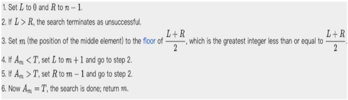

 

举个例子，有序数组 [1-71] 有 17 个值, 即在有序数组 [A0-A16]  中希望找到 Target(7)所在的位置，首选确定下标 L 为 0，下标 R 为 16，下标 m 为 floor [( L+R)/2]，即向下取整数。

\1. 第一次查询

下标 L=0，R=16，m= floor[(0+16)/2]=8，获得 A8 的值为 14，因为 A8(14) >Target(7) 则设置 R=m-1=7，如下图所示。

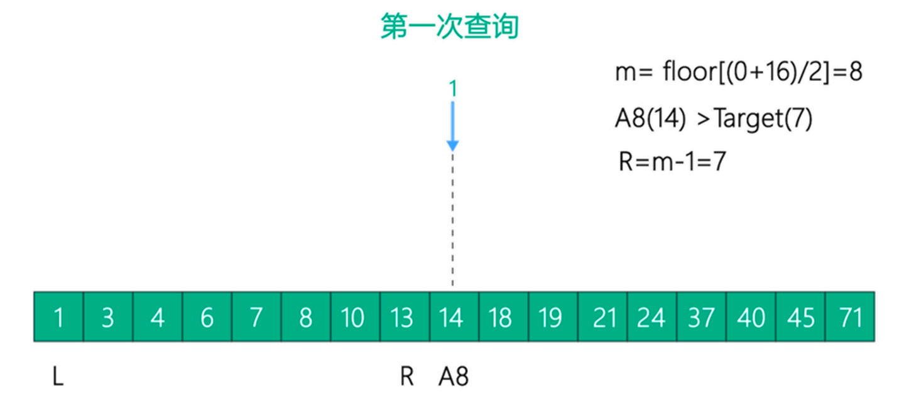

\2. 第二次查询 

下标 L=0，R=7，m=floor[(0+7)/2]=3，获得 A3 的值为 6，A3(6) < Target(7) 则设置下标 L=m+1=4，如下图所示。

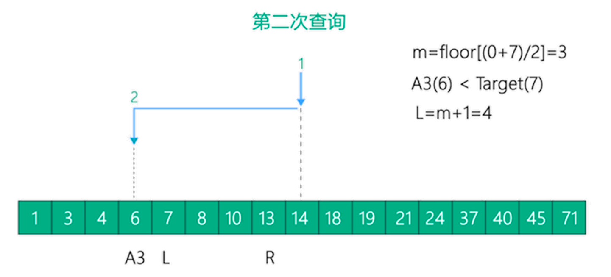

\3. 第三次查询

下标 L=4，R=7，m=floor[(4+7)/2]=5，获得 A5 的值为 8，A5(8) > Target(7) 则设置下标 R=m-1=4，如下图所示。

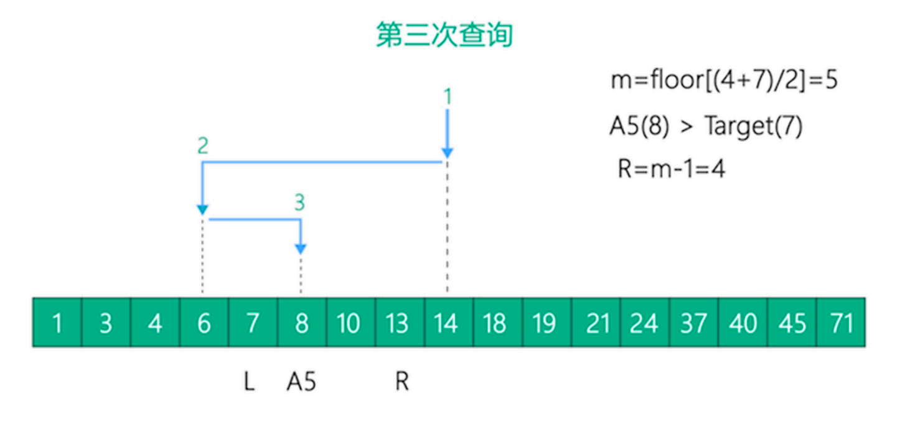

\4. 第四次查询

下标 L=4，R=4，m=floor[(4+4)/2]=4，获得 A4 的值为 7，A4(7) = Target(7)，查询结束，如下图所示。

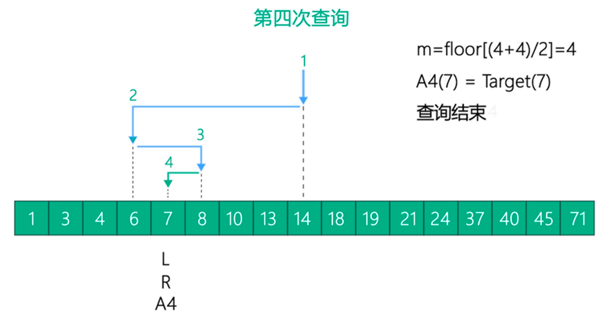 

此次查询经过 4 次二分查找后找到目标数据 7，如果在查询过程中出现下标 L>R 的情况，则表示目标元素不在有序数组内，结束查询。

 

二分查找是索引实现的理论基础，对接下来的索引学习很有帮助。

# 索引原理

大家都知道数据库查询是数据库的核心功能，而索引又是作为加速查询的重要技术手段。对于索引数据结构的选择其本质是贴合当前数据读写的硬件环境选择一个优秀的数据结构进行数据存储及遍历，在数据库中大部分索引都是通过 B+Tree 来实现的。当然也涉及其他数据结构，在 MySQL 中除了 B+Tree 索引外我们还需要关注下 Hash 索引。

接下来我们对 Hash 索引、B+Tree 索引逐一展开学习。因为后续大部分内容都是讲 B 树的，为了让 B 树的内容更连贯，这里先讲 Hash 索引。

### Hash 索引

哈希表是数据库中哈希索引的基础，是根据键值 <key,value> 存储数据的结构。简单说，哈希表是使用哈希函数将索引列计算到桶或槽的数组，实际存储是根据哈希函数将 key 换算成确定的存储位置，并将 value 存放到该数组位置上。访问时，只需要输入待查找的 key，即可通过哈希函数计算得出确定的存储位置并读取数据。

 

如下图所示，姓名作为 key，通过哈希函数对姓名字段数据进行计算，得到哈希码并存放到桶或槽的数组中，同时存放指向真实数据行的指针作为 value，形成哈希表。

接下来我们从哈希索引如何实现、Hash 碰撞处理、MySQL 如何使用 Hash，三个方面学习哈希索引。

 

首先讲解哈希索引是如何实现的？数据库中哈希索引是基于哈希表实现的，对于哈希索引列的数据通过 Hash 算法计算，得到对应索引列的哈希码形成哈希表，由哈希码及哈希码指向的真实数据行的指针组成了哈希索引。哈希索引的应用场景是只在对哈希索引列的等值查询才有效。

 

如下图所示，根据表中的 name 字段构建 Hash 索引，通过 Hash 算法对每一行 name 字段的数据进行计算，得出 Hash 码。由 Hash 码及 Hash 码指向真实数据行的指针组成了哈希索引。

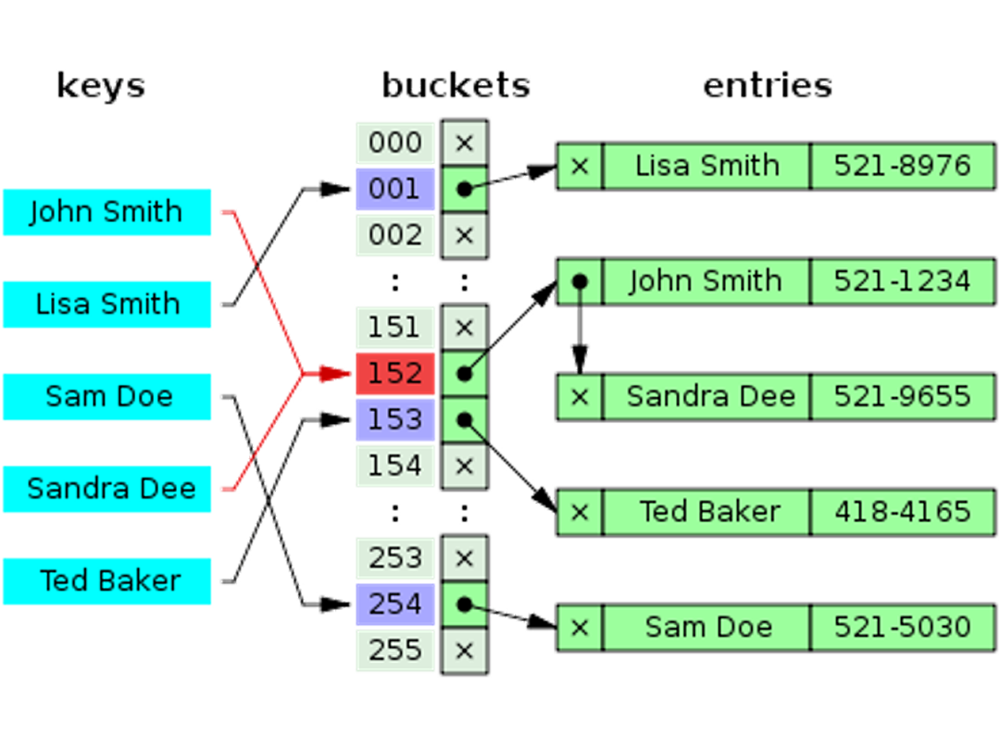

因为哈希索引只存储哈希值和行指针，不存储实际字段值，所以其结构紧凑，查询速度也非常快，在无哈希冲突的场景下访问哈希索引一次即可命中。但是哈希索引只适用于等值查询，包括 =、IN()、<=> （安全等于， select null <=> null 和 select null=null 是不一样的结果) ，不支持范围查询。

 

另外，哈希索引的性能跟哈希冲突数量成反比，哈希冲突越多其维护代价越大性能越低。 

 

接下来我们看看 Hash 碰撞如何处理？Hash 碰撞是指不同索引列值计算出相同的哈希码，如上图所示， 表中 name 字段为 John Smith 和 Sandra Dee 两个不同值根据 Hash 算法计算出来的哈希码都是 152，这就表示出现了 Hash 碰撞。 对于 Hash 碰撞通用的处理方法是使用链表，将 Hash 冲突碰撞的元素形成一个链表，发生冲突时在链表上进行二次遍历找到数据。 

- Hash 碰撞跟选择的 Hash 算法有关系，为了减少 Hash 碰撞的概率，优先选择避免 Hash 冲突的 Hash 算法，例如，使用 Percona Server 的函数 FNV64() ，其哈希值为 64 位，出现 Hash 冲突的概率要比 CRC32 小很多。
- 其次是考虑性能，优先选择数字类型的 Hash 算法，因为字符串类型的 Hash 算法不仅浪费空间而且不方便进行比较。 

常见的 CRC32、SHA1 和 MD5 Hash 函数生成的返回值如下图所示。

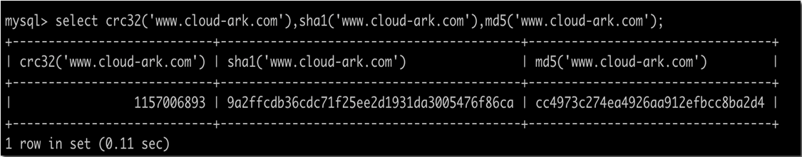

综合建议 Hash 算法使用优先级为：FNV64 > CRC32 （大数据量下 Hash 冲突概率较大）> MD5 > SHA1。 

 

最后再看看，MySQL 中如何使用 Hash 索引？在 MySQL 中主要是分为 Memory 存储引擎原生支持的 Hash 索引 、InnoDB 自适应哈希索引及 NDB 集群的哈希索引3类。

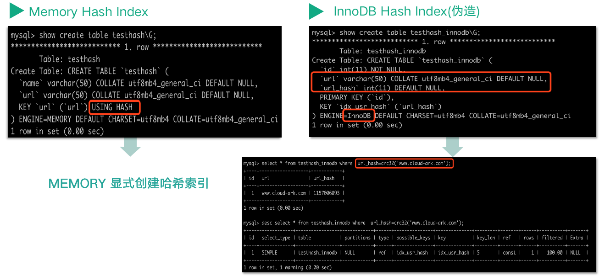

   

Memory 存储引擎原生支持的 Hash 索引，如上图所示，Memory 存储引擎创建表时即可原生显式创建并使用 Hash 索引。

 

相比 InnoDB，虽然不能原生显示创建 Hash 索引，但是可以伪造哈希索引来加速定值查询的性能。例如为超长文本（如网站 URL）进行 Hash 计算后的字段 url_hash 创建 B+Tree 索引，获得 Hash 索引的功能。

 

关于哈希索引，InnoDB 提供了 InnoDB 自适应哈希索引的强大功能，接下来重点描述 InnoDB 自适应哈希索引。

 

InnoDB 自适应哈希索引是为了提升查询效率，InnoDB 存储引擎会监控表上各个索引页的查询，当 InnoDB 注意到某些索引值访问非常频繁时，会在内存中基于 B+Tree 索引再创建一个哈希索引，使得内存中的 B+Tree 索引具备哈希索引的功能，即能够快速定值访问频繁访问的索引页。

 

创建如下图所示源码。

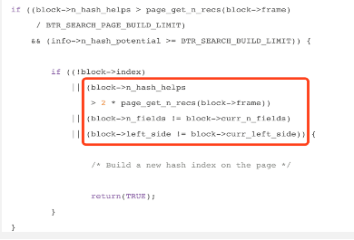

当满足下面三个条件时，InnoDB 为整个 block 构建 AHI 记录项：

- 分析使用自适应哈希索引（AHI）可以成功查询的次数是否超过 block 上记录数的1/16；
- btr_search_info::n_hash_potential大于或等于BTR_SEARCH_BUILD_LIMIT (100)，表示为 SQL 查询能够连续 100 次成功使用 AHI；
- 尚未为当前 block 构造索引或者当前 block 上已经构建了 AHI 索引且 block->n_hash_helps 大于 page 上记录数的两倍或者当前 block上 推荐的前缀索引列发生了变化 。

为什么要为 B+Tree 索引页二次创建自适应哈希索引呢？这是因为 B+Tree 索引的查询效率取决于 B+Tree 的高度，在数据库系统中通常 B+Tree 的高度为 3～4 层，所以访问数据需要做 3～4 次的查询。而 Hash 索引访问通常一次查找就能定位数据（无 Hash 碰撞的情况），其等值查询场景 Hash 索引的查询效率要优于 B+Tree。

 

自适应哈希索引的建立使得 InnoDB 存储引擎能自动根据索引页访问的频率和模式自动地为某些热点页建立哈希索引来加速访问。另外 InnoDB 自适应哈希索引的功能，用户只能选择开启或关闭功能，无法进行人工干涉。

功能开启后可以通过 Show Engine Innodb Status 看到当前自适应哈希索引的使用情况：

Hash table size 276707， node heap has 0 buffer(s)

0.00 Hash searches/s， 0.00 non-Hash searches/s

可以看到 Hash table 的大小，使用情况及每秒使用 AHI 和非 AHI 搜索的情况。

 

至此，Hash 索引已经介绍完了，自适应哈希索引是在内存中基于 B+Tree 索引构建的，接下来我们重点分析 B+Tree 索引。

### B+Tree 索引

在数据库中大部分索引都是通过 B+Tree 来实现的。 对于 B+Tree 具体的定义可以参考《数据结构》等相关书籍。 在 MySQL 数据库中讨论索引时，如果没有明确指定类型，则默认是指使用 B+Tree 数据结构进行存储，其说法等价于 B+Tree、B-Tree、BTREE（看到创建索引语句为 BTREE 也不要惊讶，等同于 B+Tree）。

 

如下图所示为一个简单的、标准的 B+tree，每个节点有 K 个键值和 K+1 个指针。

对于 MySQL 存储引擎而言，其实际使用的 B+Tree 索引是为了满足数据读写性能，以及适配磁盘访问模式优化后的数据结构，每一个叶子节点都包含指向下一个叶子节点的指针。

 

在 MySQL 中，索引是在存储引擎层而非服务器层实现的，所以不同存储引擎层支持的索引类型可以不同。例如，虽然 MyISAM 和 InnoDB 的索引都是使用 B+Tree 实现的，但是其实际数据存储结构有不少差异。下图中 B+Tree 示例一共2层，图中每个页面都已经被随机编号（编号可以认定为页面号），其中页面号为 20 的页面是 B+Tree 的根页面（根页面通常是存放在内存中的），根页面存储了 <key+pageno>，pageno 是指向具体叶子节点的页面号。其他页面都是叶子节点，存放了具体的数据 <key+data>。    

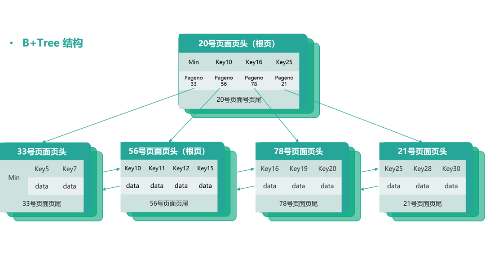

B+Tree 索引能够快速访问数据，就是因为存储引擎可以不再需要通过全表扫描来获取数据，而是从索引的根结点（通常在内存中）开始进行二分查找，根节点的槽中都存放了指向子节点的指针，存储引擎根据这些指针能够快速遍历数据。例如，通过页面号为 20 的根节点可以快速得知 Key<10 的数据在 pageno 33 的页面，key在 [10,16) 范围的数据在 pageno 56 的页面。

 

叶子节点存放的 <key+data> ，对于真正要存放哪些数据还得取决于该 B+Tree 是聚簇索引（Clustered Index）还是辅助索引（Secondary Index）。

### 聚簇索引和辅助索引

接下来我们看看 MySQL 聚簇索引和辅助索引。

 

聚簇索引是一种数据存储方式，它表示表中的数据按照主键顺序存储，是索引组织表。InnoDB 的聚簇索引就是按照主键顺序构建 B+Tree，B+Tree 的叶子节点就是行记录，数据行和主键值紧凑地存储在一起。 这也意味着 InnoDB 的主键索引就是数据表本身，它按主键顺序存放了整张表的数据。

 

而 InnoDB 辅助索引（也叫作二级索引）只是根据索引列构建 B+Tree，但在 B+Tree 的每一行都存了主键信息，加速回表操作。 

 

聚簇索引占用的空间就是整个表数据量的大小，而二级索引会比聚簇索引小很多， 通常创建辅助索引就是为了提升查询效率。

 

InnoDB 只能创建一个聚簇索引（假想下如果能支持多个聚簇索引，那就意味着一张表按不同排序规则冗余存储多份全表数据了），但可以创建多个辅助索引。

  

相比索引组织表，还有一种堆表类型，堆表是根据数据写入的顺序直接存储在磁盘上的。对于堆表而言，其主键和辅助索引唯一的区别就是键值是否唯一，两者都是根据索引列排序构建 B+Tree 的，在每个叶子节点加上指向堆表的行指针（row data pointer） 。堆表在各类数据库中也被广泛使用，MyISAM 存储引擎的表就是堆表。

 **索引类型**

**
**

了解完原理，接下来看看索引类型。在前面重点强调过：MySQL 中索引是在存储引擎层而非服务器层实现的，所以不同存储引擎层支持的索引类型可以不同。在 MySQL 中不同存储引擎间支持的常见索引类型有：哈希索引（Memory/InnoDB adaptive Hash index/NDB）、 B+Tree 索引（MyISAM/InnoDB）、全文索引（MyISAM/InnoDB）、空间索引（MyISAM R-Tree）、分形树索引（TokuDB Fractal Tree Index），如下表所示。

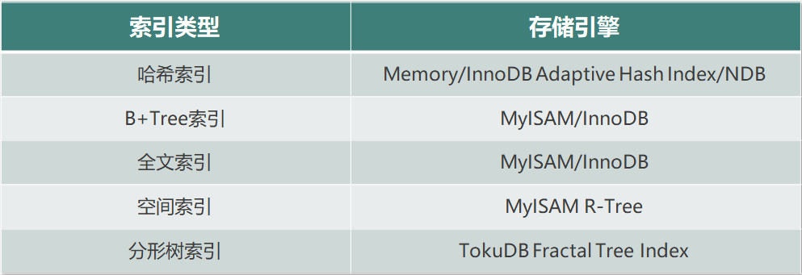 

本课程后续的索引优化及最佳实践主要是基于 InnoDB 进行讲解的。所以主要来看看 MySQL InnoDB 存储引擎支持的常见索引类型。

 

在 MySQL InnoDB 中索引通常可以分为两大类：主键索引（即聚簇索引）和辅助索引（非聚簇索引） 。

对于没有指定主键的表，InnoDB 会自己选择合适字段为主键，其选择顺序如下：

1. 显式主键；
2. 第一个唯一索引（要求唯一索引所有列都非 NULL）；
3. 内置的 6 字节 ROWID。

建议使⽤ UNSIGNED 自增列显示创建主键，大家也可以考虑为什么这样建议？

根据索引列个数和功能描述不同索引也可以分为：联合索引和覆盖索引。

- 联合索引是指在多个字段联合组建索引的。
- 当通过索引即可查询到所有记录，不需要回表到聚簇索引时，这类索引也叫作覆盖索引。
- 主键查询是天然的覆盖索引，联合索引可以是覆盖索引。

那么如何看 SQL 语句是否使用到覆盖索引了呢？

 

通常在查看执行计划时， Extra 列为 Using index 则表示优化器使用了覆盖索引。

我们通常建议优先考虑使用覆盖索引，这是因为如果 SQL 需要查询辅助索引中不包含的数据列时，就需要先通过辅助索引查找到主键值，然后再回表通过主键查询到其他数据列（即回表查询），需要查询两次。而覆盖索引能从索引中直接获取查询需要的所有数据，从⽽避免回表进行二次查找，节省IO，效率较⾼。

 

例如，SELECT email，uid FROM user_email WHERE uid=xx，如果 uid 不是主键，那可以将索引添加为 index(uid，email)，以获得查询性能提升。

因为索引部分内容较多，所以我们分为上下两节进行讲解。