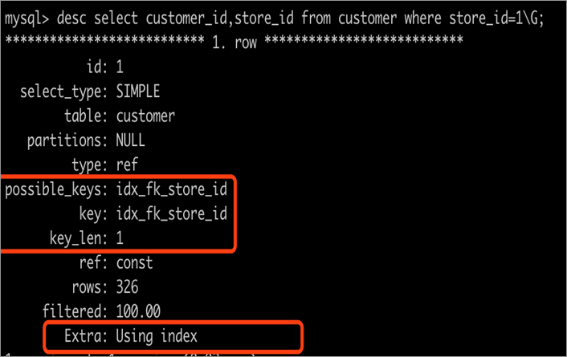
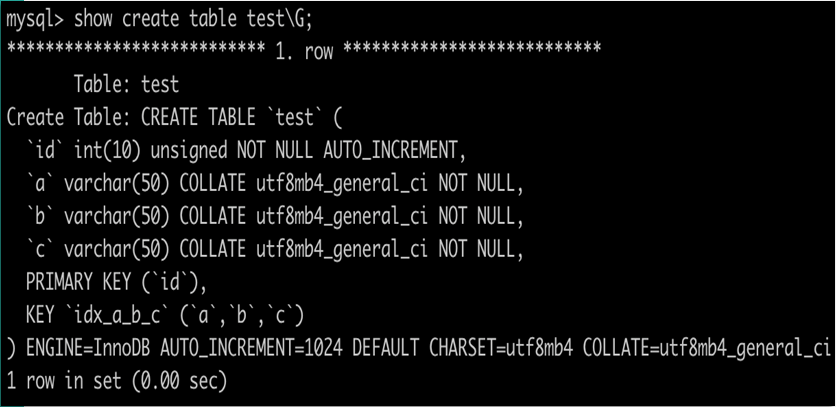
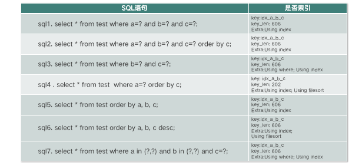

**第04讲：高性能索引该如何设计?（下）**

第04讲：高性能索引该如何设计?（下）

2019/09/09 周彦伟

 

# 索引使用技巧

接下来聊一聊索引使用技巧的基础知识，这些知识可以帮助你建立高效索引，主要有谓词、过滤因子、基数（Cardinality）、选择率和回表。

 

先来看谓词。谓词本身就是条件表达式，通俗讲就是过滤字段。如下图中这句SQL语句，可以拆解为下面所示：

   

- 简单谓词：city和 last_updata。
- 组合谓词：city and last_updata。

知道谓词后就可以计算谓词的过滤因子了，过滤因子直接描述了谓词的选择性，表示满足谓词条件的记录行数所占比例，过滤因子越小意味着能过滤越多数据，你需要在这类谓词字段上创建索引。

 

过滤因子的计算算法，就是满足谓词条件的记录行数除以表总行数。

- 简单谓词的过滤因子 = 谓词结果集的数量 / 表总行数
- 组合谓词的过滤因子 = 谓词 1 的过滤因子 × 谓词 2 的过滤因子 

接着是基数（Cardinality），基数是某个键值去重后的行数， 索引列不重复记录数量的预估值，MySQL 优化器会依赖于它。选择率是 count(distinct city) / count(*)，选择率越接近 1 则越适合创建索引，例如主键和唯一键的选择率都是 1。回表是指无法通过索引扫描访问所有数据，需要回到主表进行数据扫描并返回。

 

基础知识熟悉后，我们通过实际的 SQL 语句来采集信息，借助这些基础信息可以创建高效索引。用一个例子来看下，如何快速根据 SQL 语句计算谓词、过滤因子、基数和选择率。

1. 根据 SQL 语句可以快速得到谓词信息：简单谓词 city 和 last_update，组合谓词 city and last_update。
2. 计算每个谓词信息的过滤因子，过滤因子越小表示选择性越强，字段越适合创建索引。例如：

- city 的过滤因子 = 谓词 city 结果集的数量 / 表总行数 = select count(*) from city where city = ‘BeiJing’ / select count(*) from city =20% ；
- last_update 的过滤因子 = 谓词 last_update 结果集的数量 / 表总行数 = select count(*) from city where last_update = ‘2019-08-01’/ select count(*) from city = 10%；
- 组合谓词 = city 过滤因子 * last_update 过滤因子 = 20% × 10% = 2%，组合谓词的过滤因子为 2%，即只有表总行数的 2% 匹配过滤条件，可以考虑创建组合索引 (city，last_update)。

除谓词信息、过滤因子外，字段基数和选择率信息可以帮助你了解字段数据的分布情况。MySQL InnoDB 的统计信息参考基数 Cardinality 的信息。

### Cardinality

Cardinality 能快速告知字段的选择性，高选择性字段有利于创建索引。优化器在选择执行计划时会依赖该信息，通常这类信息也叫作统计信息，数据库中对于统计信息的采集是在存储引擎层进行的。

 

执行 show index from table_name 会看到 Cardinality，同时也会触发 MySQL 数据库对 Cardinaltiy 值的统计。除此之外，还有三种更新策略。

- 触发统计：Cardinality 统计信息更新发生在 INSERT 和 UPDATE 时，InnoDB 存储引擎内部更新的 Cardinality 信息的策略为：

表中超过1/16的数据发生变化；

stat_modified_counter > 2000 000 000 （20亿）。

- 采样统计（sample）：为了减少统计信息更新造成的资源消耗，数据库对Cardinality 通过采样来完成统计信息更新，每次随机获取 innodb_stats_persistent_sample_pages 页的数量进行 Cardinality 统计。
- 手动统计：alter table table_name engine=innodb 或 analyze table table_name，当发现优化器选择错误的执行计划或没有走理想的索引时，执行 SQL 语句来手动统计信息有时是一种有效的方法。

由于采样统计的信息是随机获取8个（8是由innodb_stats_transient_sample_pages参数指定）页面数进行分析，这就意味着下一次随机的 8 个页面可能是其他页面，其采集页面的 Carinality 也不同。因此当表数据无变化时也会出现 Cardinality 发生变化的情况，如下图所示。

关于统计信息的采集涉及如下主要参数。

- information_schema_stats_expiry:86400，Cardinality 存放过期时间，设置为 0 表示实时获取统计信息，严重影响性能，建议设置默认值并通过手动刷新统计信息；
- innodb_stats_auto_recalc:ON，是否自动更新统计信息，默认即可；
- innodb_stats_include_delete_marked :OFF，计算持久化统计信息时 InnoDB 是否包含 Delete-marked 记录，默认即可；
- innodb_stats_method:nulls_equal，用来判断如何对待索引中出现的 NULL 值记录，默认为 nulls_equal，表示将 NULL 值记录视为相等的记录；
- innodb_stats_on_metadata， 默认值 OFF，执行 SQL 语句 ANALYZE TABLE、SHOW TABLE STATUS、SHOQ INDEX，以及访问 INFORMATION_SCHEMA 架构下表 tables和statistics 时，是否重新计算索引的 Cardinality 值；
- innodb_stats_persistent:ON，表示通过 ANALYZE TABLE 计算得到的 Cardinality值存放到磁盘上；
- innodb_stats_persistent_sample_pages:20，表示 ANALYZE TABLE 更新Cardinality 值时采样页的数量；
- innodb_stats_transient_sample_pages:8，表示每次统计 Cardinality 时采样页的数量，默认为 8。

### 索引使用细节

至此，了解了这些基本信息后，我们开始学习索引使用过程中需要重点关注的细节。

 

首先是创建索引后如何确认 SQL 语句是否走索引了呢？创建索引后通过查看执行 SQL 语句的执行计划即可知道 SQL 语句是否走索引。执行计划重点关注跟索引相关的关键项，有 type、possible_keys、key、key_len、ref、Extra 等。

 

其中，possible_keys 表示查询可能使用的索引，key表示真正实际使用的索引，key_len 表示使用索引字段的长度。

 

另外执行计划中 Extra 选项也值得关注，例如 Extra 显示 use index 时就表示该索引是覆盖索引，通常性能排序的结果是 usd index > use where > use filsort，如下图所示。

当索引选择组合索引时，通过计算 key_len 来了解有效索引长度对索引优化也是非常重要的，接下来重点讲解 key_len 计算规则。

 

key_len 表示得到结果集所使用的选择索引的长度[字节数]，不包括 order by，也就是说如果 order by 也使用了索引则 key_len 不计算在内。

 

key_len 计算规则从两个方面考虑，一方面是索引字段的数据类型，另一方面是表、字段所使用的字符集。

\1. 索引字段的数据类型，根据索引字段的定义可以分为变长和定长两种数据类型：

- 索引字段为定长数据类型，比如 char、int、datetime，需要有是否为空的标记，这个标记需要占用 1 个字节；
- 对于变长数据类型，比如 Varchar，除了是否为空的标记外，还需要有长度信息，需要占用 2 个字节；（备注：当字段定义为非空的时候，是否为空的标记将不占用字节）。

\2. 表所使用的字符集，不同的字符集计算的 key_len 不一样，例如，GBK 编码的是一个占用 2 个字节大小的字符，UTF8 编码的是一个占用 3 个字节大小的字符。

举例说明：在四类字段上创建索引后的 key_len 如何计算呢？

- Varchr(10) 变长字段且允许 NULL:10*(Character Set：utf8=3，gbk=2，latin1=1)+1（标记是否为 NULL 需要 1 个字节）+ 2（变长字段存储长度信息需要 2 个字节）。
- Varchr(10) 变长字段且不允许 NULL:10*(Character Set：utf8=3，gbk=2，latin1=1)+2（变长字段存储长度信息需要2个字节），非空不再需要占用字节来标记是否为空。
- Char(10) 固定字段且允许 NULL:10*(Character Set：utf8=3，gbk=2，latin1=1)+1（标记是否为 NULL 需要 1 个字节）。 
- Char(10) 固定字段且不允许 NULL:10*(Character Set：utf8=3，gbk=2，latin1=1)，非空不再需要占用字节来标记是否为空。

### 最左前缀匹配原则

通过 key_len 计算也帮助我们了解索引的最左前缀匹配原则。

 

最左前缀匹配原则是指在使用 B+Tree 联合索引进行数据检索时，MySQL 优化器会读取谓词（过滤条件）并按照联合索引字段创建顺序一直向右匹配直到遇到范围查询或非等值查询后停止匹配，此字段之后的索引列不会被使用，这时计算 key_len 可以分析出联合索引实际使用了哪些索引列。

# 设计性能索引

有了这些基础知识，接下来我们根据实际 SQL 语句来判断索引的性能好坏，学习设计性能索引，如下图所示。

创建一个 test 表。 在 a、b、c 上创建索引，执行表中的 SQL 语句，快速定位语句孰好孰坏。

 

首先分析 key_len， 因为 a、b、c 不允许 NULL 的 varchar(50)，那么，每个字段的 key_len 为 50×4+2=202，整个联合索引的 key_len 为 202×3=606。

- SQL1 可以使用覆盖索引，性能好；
- SQL2 可以使用覆盖索引同时可以避免排序，性能好；
- SQL3 可以使用覆盖索引，但是需要根据 where 字句进行过滤；
- SQL4 可以使用部分索引 a，但无法避免排序，性能差；
- SQL5 完全使用覆盖索引，同时可以避免排序，性能好；
- SQL6 可以使用覆盖索引，但无法避免排序，这是因为 MySQL InnoDB 创建索引时默认asc升序，索引无法自动倒序排序；
- SQL7 可以使用覆盖索引，但是需要根据 where 子句进行过滤（非定值查询）。

在实际设计高性能索引时，可以结合前面讲解的内容按照如下步骤进行分析。

\1. 定位由于索引不合适或缺少索引而导致的慢查询。

通常在业务建库建表时就需要提交业务运行相关的 SQL 给 DBA 审核，也可以借助Arkcontrol Arkit 来自动化审核。比如，慢查询日志分析，抓出运行慢的 SQL 进行分析，也可以借助第三方工具例如 Arkcontrol 慢查询分析系统进行慢查询采集和分析。在分析慢查询时进行参数最差输入，同时，对 SQL 语句的谓词进行过滤因子、基数、选择率和 SQL 查询回表情况的分析。

\2. 设计索引。

设计索引的目标是让查询语句运行得足够快，同时让表、索引维护也足够快，例如，使用业务不相关自增字段为主键，减缓页分裂、页合并等索引维护成本，加速性能。也可以使用第三方工具进行索引设计，例如 Arkcontrol SQL 优化助手，会给出设计索引的建议。

\3. 创建索引策略。

优先为搜索列、排序列、分组列创建索引，必要时加入查询列创建覆盖索引；计算字段列基数和选择率，选择率越接近于 1 越适合创建索引；索引选用较小的数据类型（整型优于字符型），字符串可以考虑前缀索引；不要建立过多索引，优先基于现有索引调整顺序；参与比较的字段类型保持匹配并创建索引。

\4. 调优索引。

分析执行计划；更新统计信息（Analyze Table）；Hint优化，方便调优（FORCE INDEX、USE INDEX、IGNORE INDEX、STRAIGHT_JOIN）；检查连接字段数据类型、字符集；避免使用类型转换；关注 optimizer_switch，重点关注索引优化特性 MRR（Multi-Range Read）和 ICP（Index Condition Pushdown）。

- MRR 优化是为了减少磁盘随机访问，将随机 IO 转化为顺序 IO 的数据访问，其方式是将查询得到辅助索引的键值放到内存中进行排序，通常是按照主键或 RowID 进行排序，当需要回表时直接根据主键或 RowID 排序顺序访问实际的数据文件，加速 SQL 查询。
- ICP 优化同样也是对索引查询的优化特性，MySQL 根据索引查询到数据后会优先应用 where 条件进行数据过滤，即无法使用索引过滤的 where 子句，其过滤由之前 Server 层的数据过滤下推到了存储引擎层，可以减少上层对记录的检索，提高数据库的整体性能。

至此，通过这些实践步骤结合索引的基础知识、使用技巧，就可以帮助我们进行高性能索引的设计了。

# 创建索引规范

最后讲解索引创建规范。各个公司都应形成开发规范，MySQL 创建索引规范如下。

- 命名规范， 各个公司内部统一。
- 考虑到索引维护的成本，单张表的索引数量不超过 5 个，单个索引中的字段数不超过 5 个。
- 表必需有主键，推荐使⽤ UNSIGNED 自增列作为主键。表不设置主键时 InnoDB 会默认设置隐藏的主键列，不便于表定位数据同时也会增大 MySQL 运维成本（例如主从复制效率严重受损、pt 工具无法使用或正确使用）。
- 唯一键由 3 个以下字段组成，并且在字段都是整形时，可使用唯一键作为主键。其他情况下，建议使用自增列或发号器作主键。 
- 禁止冗余索引、禁止重复索引，索引维护需要成本，新增索引时优先考虑基于现有索引进行 rebuild，例如 (a,b,c)和 (a,b)，后者为冗余索引可以考虑删除。重复索引也是如此，例如索引(a)和索引(a,主键ID) 两者重复，增加运维成本并占用磁盘空间，按需删除冗余索引。
- 联表查询时，JOIN 列的数据类型必须相同，并且要建⽴索引。 
- 不在低基数列上建⽴索引，例如“性别”。 在低基数列上创建的索引查询相比全表扫描不一定有性能优势，特别是当存在回表成本时。
- 选择区分度（选择率）大的列建立索引。组合索引中，区分度（选择率）大的字段放在最前面。 
- 对过长的 Varchar 段建立索引。建议优先考虑前缀索引，或添加 CRC32 或 MD5 伪列并建⽴索引。 
- 合理创建联合索引，(a,b,c) 相当于 (a) 、(a,b) 、(a,b,c)。 
- 合理使用覆盖索引减少IO，避免排序。

以上就是索引部分的内容，一起来回顾，我们学习了索引设计和工作原理、索引类型、 索引使用技巧、如何创建高性能索引和索引创建规范 ，需要重点掌握的是索引使用技巧和如何创建高性能索引，当然索引创建规范也很重要。