**第05讲：如何提高查询性能？**

第05讲：如何提高查询性能？

2019/09/09 周彦伟

 

本课时将分享 MySQL 数据库的查询优化器、查询缓存的原理和实际使用，慢查询和 SQL 优化的方法，互联网公司常用的 SQL 编写规范，以及在实际情况中如何优化数据库访问等内容，知识脑图如下所示。

 

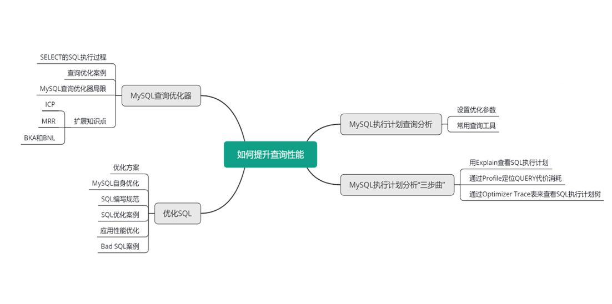

MySQL 查询优化器

## SELECT 执行过程

那么如何提高 MySQL 的查询性能呢？首先你需要了解查询优化器处理 SQL 的全过程。以 SELECT 的 SQL 的执行过程为例，如下图所示。

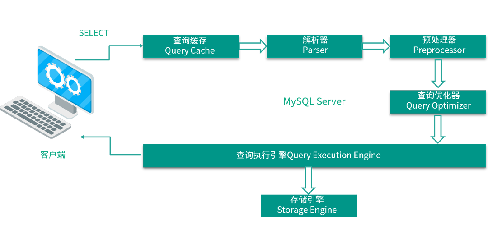  

1. 客户端发送一条 SELECT 查询给服务器；
2. 服务器先检查查询缓存，如果命中缓存，则立刻返回存储在缓存中的结果。否则进入下一阶段；
3. 服务器进行 SQL 解析、预处理、再由查询优化器生成对应的执行计划；
4. MySQL 根据优化器生成的执行计划，调用存储引擎的 API 来执行查询；
5. 将结果返回给客户端，同时也会放入查询缓存中。

因为篇幅原因，查询优化器中各个功能模块的具体介绍这里不再赘述。

## 查询优化案例

刚刚讲了 MySQL 查询优化器 SELECT 的 SQL 的执行过程。那么 MySQL 查询优化器就那么完美吗？我们知道 MySQL 采用基于开销的优化器，以确定处理查询的最佳方式，也就是说执行查询之前，都会先选择一条自以为最优的方案。在很多情况下，MySQL 能够计算最佳的可能查询计划，但在某些情况下，MySQL 没有关于数据的足够信息，或者是提供太多的相关数据信息，它所采用的可能并非就是事实上的最优方案。这里举了两个例子来说明。

 

首先来看第一个案例，为什么 Range 执行效率差呢？我们先来看看 Range 类查询的执行计划流程。

1. 根据查询条件计算所有的 possible keys。

2. 计算全表扫描代价（cost_all）。

3. 计算最小的索引范围访问代价（这一步很关键，直接决定了 Range 的查询效率），它有三步：

4. 1. 对于每一个 possible keys（可选索引），调用 records_in_ranges 函数计算范围中的rows；
   2. 根据 rows，计算二级索引访问代价；
   3. 获取 cost 最小的二级索引访问代价（cost_range）。

5. 选择执行最小化访问代价的执行计划。如果 cost_all <= cost_range，则全表扫描，否则索引范围扫描。

对于这个例子，Range 使用了 records_in_range 函数估算每个值范围的 rows，结果依赖于possible_keys；possible_keys 越多，随机 IO 代价越大，Range 查询效率越差。所以，索引不是越多越好，相反，我们应该尽量减少 possible_keys，减少 records_in_range 从而减少 IO 的消耗。这里给大家推荐两个工具，用 pt-index-usage 工具来删除冗余索引，用 pt-duplicate-key-checker 工具来删除重复索引。

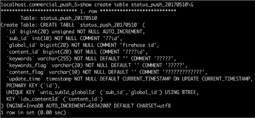

再来看看这个例子，这样的一个表结构（优化后的），优化前有一个索引 idx_global_id。图中的这条 SQL 语句的 where 条件包括一个 sub_id 的等值查询和一个 global_id 的范围查询。执行一次需要 2.37 秒。从下一页的执行计划中，我们可以看到虽然查询优化器使用了唯一索引 uniq_subid_globalid，但是由于 idx_global_id 的干扰，实际只使用了前面的 4 个长度就 access，剩余 8 个长度都被 filter 了。

​    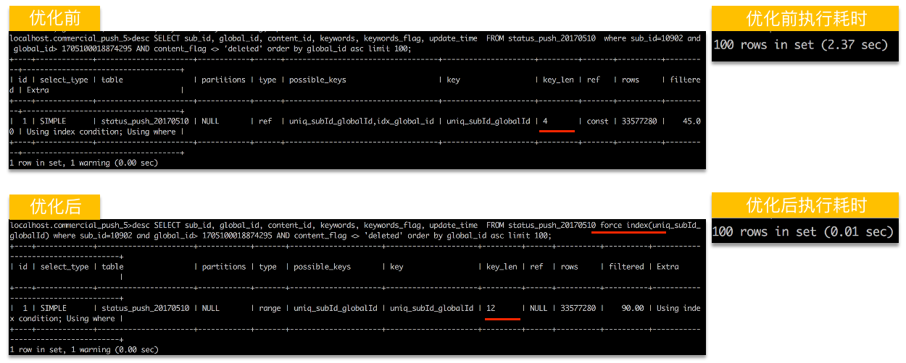   

从优化后的执行计划中可以看到，使用了 force index 来强制使用唯一索引。正如上文列举的，相似的命令还有 ignore index 忽略索引，straght_join 强制优化器按特定的顺序使用数据表，high_priority 或 low_priority 两个命令来控制 SQL 的执行优先权。

## 扩展知识点

在 MySQL DBA 的求职面试中可能经常会被问到：什么是 ICP？什么是 MRR？什么是BKA？这里作为扩展知识点给大家介绍下。

\1. ICP

ICP 是 Index Condition Pushdown 的简称，是 MySQL 使用索引从表中检索行数据的一种优化方式。目的是减少从基表中全记录读取操作的数量，从而降低 IO 操作。

 

在没有开启 ICP 之前，存储引擎会通过遍历索引查找基表中的行，然后返回给 MySQL Server 层，再去为这些数据行进行 where 后的条件过滤。开启 ICP 之后，如果部分 where 条件能使用索引中的字段，MySQL Server 会把这部分下推到存储引擎层，存储引擎通过索引过滤，把满足的行从表中读取出来。ICP 能减少引擎层访问基表的次数和 MySQL Server 访问存储引擎的次数。对于 InnoDB 表来说，ICP 只适用于辅助索引。

\2. MRR

MRR 是 Multi-Range Read 的简称，是 MySQL 优化器将随机 IO转化为顺序 IO 以降低查询过程中 IO 开销的一种手段。

 

MRR 的适用场景是辅助索引，如 INDEX(key1)，查询 key1 在 n 到 m 范围内的数据。使用限制就是 MRR，MRR 适用于 range、ref、eq_ref 的查询。

\3. BKA 和 BNL

BKA 是 Batched Key Access 的简称，是 MySQL 优化器提高表 join 性能的一种手段，它是一种算法。而 BNL 是 Block Nested Loop 的简称，它是默认的处理表 join 的方式和算法。

 

那么二者有什么区别呢？

• BNL 比 BKA 出现的早，BKA 直到 MySQL 5.6 版本才出现，而 BNL 至少在 MySQL 5.1 版本中就存在了；

• BNL 主要用于被 join 的表上无索引时；

• BKA 只在被 join 表上有索引时可以使用，那么就在行提交给被 join 的表之前，对这些行按照索引字段进行排序，因此减少了随机 IO，排序才是两者最大的区别，但如果被 join 的表没有索引呢？那么就只能使用 BNL 了。

 

使用 BKA 需要注意一些问题，比如：

- BKA 的适用场景支持 inner join、outer join、semi-join operations、including nested outer joins 等；
- BKA 有两个使用限制，一个是使用 BKA 特性，必须启用 MRR 特性；二是 BKA 主要适用于 join 的表上有索引可使用的情况，否则只能使用 BNL。

# MySQL 执行计划分析“三步曲”

从前面的讲解中，我们知道 MySQL 的查询优化器有时候也会“犯糊涂”，当有慢查询或者执行 SQL 遇到瓶颈时，我们分析这类问题时可以参考 MySQL 执行计划分析“三步曲”。

 

\1. 查看 SQL 执行计划：

- explain SQL；
- desc 表名；
- show create table 表名。

\2. 通过 Profile 定位 QUERY 代价消耗：

- set profiling=1；
- 执行 SQL；
- show profiles; 获取 Query_ID。
- show profile for query Query_ID; 查看详细的 profile 信息。

\3. 通过 Optimizer Trace 表查看 SQL 执行计划树：

- set session optimizer_trace='enabled=on'；
- 执行 SQL；
- 查询 information_schema.optimizer_trace 表，获取 SQL 查询计划树；
- set session optimizer_trace=‘enabled=off'；开启此项影响性能，记得用后关闭。

# MySQL 执行计划查询分析

工欲善其事，必先利其器。那么对于 MySQL 的慢查询，有哪些相关参数和分析工具呢？

 

首先，MySQL 可以通过设置一些参数，将运行时间长或者非索引查找的 SQL 记录到慢查询文件中。可以分析慢查询文件中的 SQL，有针对性的进行优化。

- 参数 slow_query_log，表示是否开启慢查询日志，ON 或者 1 表示开启，OFF 或者 0 表示关闭。

- 参数 long_query_time，设置慢查询的阈值，MySQL 5.7 版本支持微秒级。

- 参数 slow_query_log_file，慢查询文件的存放路径。

- 参数 log_queries_not_using_indexes，表示是否将非索引查找的 SQL 也记录到慢查询文件中。

- 参数 log_throttle_queries_not_using_indexes，表示每分钟记录到慢查询文件中未使用索引的 SQL 语句上限，0 表示没限制。

- 参数 max_execution_time，用来控制 SELECT 语句的最大执行时间，单位毫秒，超过此值MySQL 自动 kill 掉该查询。

  

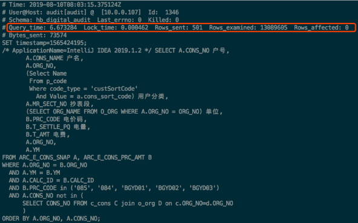

如上图所示是一个慢查询的例子，通过这个例子你可以看到慢查询文件中记录了哪些信息。包括了慢 SQL 产生的时间，SQL 源自的 IP 和对应的数据库用户名，以及访问的数据库名称；查询的总耗时，被 lock 的时间，结果集行数，扫描的行数，以及字节数等。当然还有具体的 SQL 语句。

 

分析慢查询常用的工具有：

- explain；
- Mysqldumpslow，官方慢查询分析工具；
- pt-query-digest，Percona 公司开源的慢查询分析工具；
- vc-mysql-sniffer，第三方的慢查询抓取工具；
- pt-kill，Percona 公司开源的慢查询 kill 工具，常用于生产环境的过载保护。

这里重点介绍 pt-query-digest ，它是用于分析 MySQL 慢查询的一个常用工具，先对查询语句的条件进行参数化，然后对参数化以后的查询进行分组统计，统计出各查询的执行时间、次数、占比等，同时把分析结果输出到文件中。也可以结合 Anemometer 工具将慢查询平台化展示。

 

此外，社区还开源了许多优秀的慢查询优化工具或系统，如：Inception、SQLAdvisor 和 Soar 等，商业付费版的有极数云舟开发的 Arkit。

# 如何优化 SQL

下面来看看 SQL 设计和优化需要考虑的几个方面。

\1. 全表扫描还是索引扫描。对于小表来说，二者 IO 调用次数和返回时间相差不大；但对于大表，如果全表扫描，那么查询返回的时间就会很长，就需要使用索引扫描加快查询速度。但并不是要求 DBA 根据每一种查询条件组合都要创建索引，索引过多也会降低写入和修改的速度，而且如果导致表数据和索引数据比例失调，也不利于后期的正常维护。

\2. 如何创建索引，在哪些列上建立索引适合业务需求？一般情况下，你可以在选择度高的列上创建索引，也可以在 status 列上创建索引。创建索引时，要注意避免冗余索引，除非一些特殊情况外。如 index(a,b,c) 和 index(a)，其中 a 的单列索引就是冗余索引。

\3. 创建索引以后，尽量不要过频修改。业务可以根据现有的索引情况合理使用索引，而不是每次都去修改索引。能在索引中完成的查找，就不要回表查询。比如 SELECT 某个具体字段，就有助于实现覆盖索引从而降低 IO 次数，达到优化 SQL 的目的。

\4. 多表关联的 SQL，在关联列上要有索引且字段类型一致，这样 MySQL 在进行嵌套循环连接查找时可以使用索引，且不会因为字段类型不匹配而发生隐式转换进而导致无法使用索引的情况发生。在现实情况中，开发经常会出现 SQL 中关联列字段类型不一致或者传入的参数类型与字段类型不匹配的情况，这样就会导致无法使用索引，在优化 SQL 时需要重点排查这种情况。另外索引列上使用函数也不会涉及索引。

多表关联时，尽量让结果集小的表作为驱动表，注意是结果集小的表，不是小表。

\5. 在日常中你会发现全模糊匹配的查询，由于 MySQL 的索引是 B+ 树结构，所以当查询条件为全模糊时，例如‘%**%’，索引无法使用，这时需要通过添加其他选择度高的列或者条件作为一种补充，从而加快查询速度。

当然也可以通过强制 SQL 进行全索引扫描，但这种方式不好，尽量不要在 SQL 中添加hints。对于这种全模糊匹配的场景，可以放到 ES 或者 solr 中解决。尽量不要使用子查询，对子查询产生的临时表再扫描时将无索引可查询，只能进行全表扫描，并且 MySQL 对于出现在 from 中的表无所谓顺序，对于 where 中也无所谓顺序，这也是可以优化 SQL 的地方。

\6. 另外 order by/group by 的 SQL 涉及排序，尽量在索引中包含排序字段，并让排序字段的排序顺序与索引列中的顺序相同，这样可以避免排序或减少排序次数。

\7. 除此之外，复杂查询还是简单查询？貌似总会面临这样的疑问和选择。不要总想着用一个SQL 解决所有事情，可以分步骤来进行，MySQL 也十分擅长处理短而简单的 SQL，总体耗时会更短，而且也不会产生臃肿的 SQL，让人难以理解和优化。

# MySQL 自身优化 SQL

另外 MySQL 自身也对 SQL 自动进行了优化处理。MySQL 能够处理的优化类型有下面这些。

1. 重新定义表的关联顺序。多表关联查询时，MySQL 日益强大的优化器会自动选择驱动表，以及表的连接顺序，基于 cost 规则极大减少 SQL 执行的时间。
2. 使用等价变化规则。MySQL 可以合并或减少一些比较，还可以移除一些恒成立或恒不成立的判断。
3. 优化 count()、min() 和 max()。索引和列是否可为空通常可以帮助 MySQL 优化这类表达式，如查找最小值只需找到索引树最左边的第一条记录即可。

 

对于大多数互联网公司，数据库团队都会有一些数据库规范，其中常用的 SQL 编写规范如下所示。

- SELECT 只获取必要的字段，禁止使用 SELECT *。这样能减少网络带宽消耗，有效利用覆盖索引，表结构变更对程序基本无影响。
- 用 IN 代替 OR。SQL 语句中 IN 包含的值不宜过多，应少于 1000 个。过多会使随机 IO 增大，影响性能。
- 禁止使用 order by rand()。order by rand() 会为表增加几个伪列，然后用 rand() 函数为每一行数据计算 rand() 值，最后基于该行排序，这通常都会生成磁盘上的临时表，因此效率非常低。建议先使用 rand() 函数获得随机的主键值，然后通过主键获取数据。
- SQL 中避免出现 now()、rand()、sysdate()、current_user() 等不确定结果的函数。在语句级复制场景下，引起主从数据不一致；不确定值的函数，产生的 SQL 语句无法使用 QUERY CACHE。

这里只重点讲解其中的几条，其他自身优化和规范你可以课后查看课时文档。

# SQL 优化案例

上文讲了一些 SQL 的标准规范，下面分享一些 SQL 的优化案例，当然例子只起了一个抛砖引玉的作用，当你在面试或以后的正式工作中需要对 SQL 进行优化时，需要具体问题具体分析，掌握基本的分析手段才是学习的重点。

## 根据 Extra 列优化

在这里列举一个根据 Extra 列的输出内容进行优化的案例，如下图所示。优化方法就是创建索引，避免排序和临时表的开销。

## 根据 ROWS 列优化

在这里列举一个根据 ROWS 列的输出内容来进行优化的案例，如下图，看看优化前的 SQL 执行计划中 ROWS 是 181899 行，耗时 0.51 秒。咋一看来，还挺满意的，但是放在具体的业务场景中，尤其是业务并发量大，但机器性能一般的情况下，业务高峰期是一个巨大的坑，随着业务并发量的增长，性能呈现急剧恶化，这种情况依然需要优化。

​    

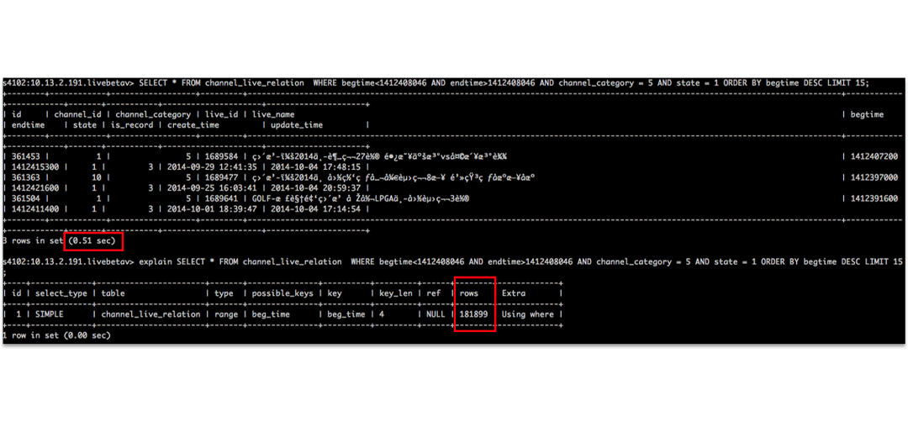   

在这个例子中，是通过添加 endtime 索引来达到优化效果的，优化后，执行计划中的ROWS 变成了 134 行，基本上是“秒回”。优化后效果见下图。这个案例中使用的优化思路是结合业务模式和数据分布来优化具体的 SQL 语句；这里重点分析 ROWS 列的输出，对各查询条件扫描行数进行对比，找出最优的索引策略。 

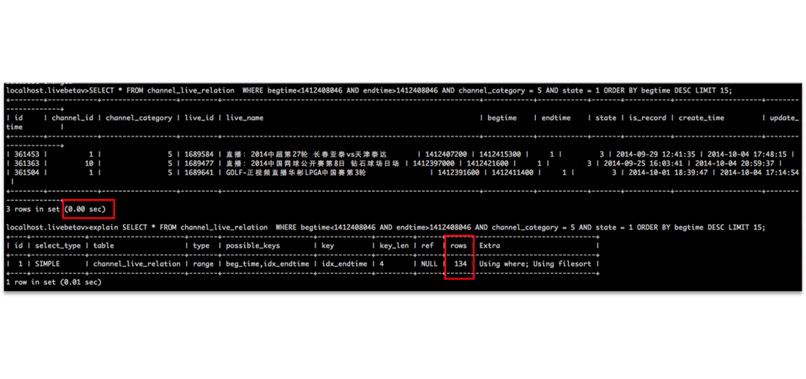   

## group by 和 order by 的优化

在前面“如何优化 SQL”部分中，描述了对 group by 和 order by 的优化，这里举个例子，说明一下二者的区别，帮助大家更好的理解，以及方便进行优化。

 

从下面的图中，可以看出：分组 GROUP BY 实质为排序和去重（distinct）的组合，通常它会结合一些聚合函数如  sum、count、avg、max、min 等来使用，根据一个或多个列对结果集进行分组，查看执行计划中的 Extra 列的输出内容，可以看到有 Using temporary; Using filesort。而 SQL 中有 ORDER BY 对结果集进行排序时，查看执行计划中的 Extra 列的输出内容，也可以看到有 Using temporary; Using filesort。分组和排序都涉及排序，故尽量在索引中包含排序字段，并让排序字段的排序顺序与索引列中的顺序相同，这样可以避免排序或减少排序次数。比如 where a=? order by b,c，就可以创建一个索引 (a,b,c)。如果执行计划中出现 using filesort，这时就要重点关注索引字段和顺序了。     

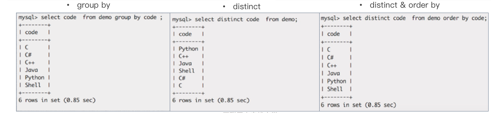 

**Limit 分页优化**

 

对于分页问题，这是一个面试中经常会被问到的问题，看 SQL 语句是“SELECT * FROM TABLE ORDER BY col2 limit 80000,20;“的例子，如下图所示。Limit 有 start、offset 两个值，分页 SQL 的耗时随着 start 的增大而增加。原始分页查询的耗时是 2.87 秒，然后用子查询和表连接两种方式进行 SQL 改写后，查询的耗时都只有 0.5 秒左右。优化思路就是：让 SQL 尽量走索引避免排序，减少不必要的物理 IO；同时，每页展示数据确定起始范围，取符合条件取 N 条记录即可；由于传递的是主键（具有唯一特性），可以快速定位，获取数据。

## count 优化

这也是一个被面试中经常会问到的问题，对于下面的四条 SELECT 语句：

select count(*) from table … ;

select count(1) from table … ;

select count(primary key) from table … ;

select count(index key) from table …;

哪一条的执行效率最高呢？这个问题需要具体问题具体分析，不能一概而论。这里举 SELECT count(1) 这条 SQL 为例。    

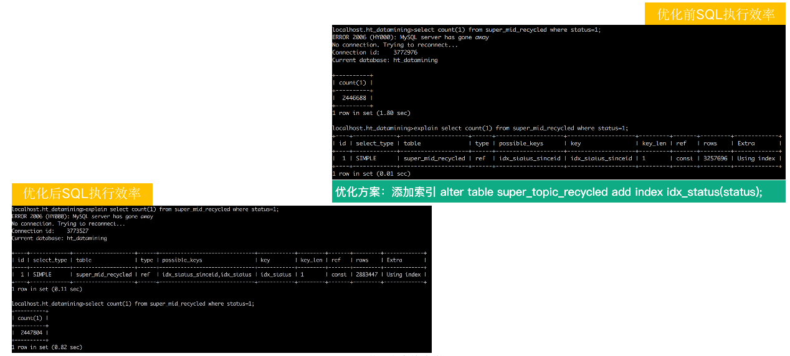   

优化前和优化后，执行效率相差2倍。就添加了一个索引。优化思路是选择索引 key_len 最短的二级索引效率高，不要使用全表扫描（PK 聚族索引会全表扫描），因为索引 key_len 越短，读取页面越少，进而 IO_COST 越小。

# Bad SQL 案例

  下面我们来看一些 Bad SQL 的案例，如图中所示。

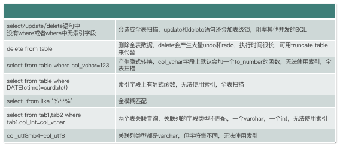

- select/update/delete 语句中没有 where 或者 where 中无索引字段，这样的 SQL 都没有使用索引，会造成全表扫描，update 和 delete 语句还会加表级锁，阻塞其他并发的 SQL。
- select from table where col_vchar=123，这个 SQL 产生了隐式转换，col_vchar 字段是一个 varchar 类型，但传入的值却是数字类型，这样 col_vchar 字段上会默认加一个 to_number 的函数，无法使用索引，全表扫描，你需要重点注意一下这样看着简单但很容易被忽略的 SQL 。
- col_utf8mb4=col_utf8，大家要注意这种情况，尽量两个表的关联列类型都是 varchar，但字符集不相同，同样无法使用索引，你在日常优化 SQL 和设计表结构时一定要注意，尽量采用 utf8mb4 为默认字符集，如果两个表字符集不同，则需要提前变更一下。

 

  接下来，在实际业务中优化数据库访问要做到以下几点。

1.DBA 要参与重⼤项⽬的数据库⽅案选型和设计，以及审核数据库表结构和 SQL 语句。

2.DBA 设计批量导入/导出数据的方案并监控过程和影响。

3.大量的更新/删除操作控制频度，例如每秒操作 2000 行以下。

4.对于后台管理或者其他统计类的只读场景，可以做读写分离，利用从库分担写库的读压力。

5.使⽤ prepared statement 和绑定变量，可以提升性能并避免 SQL 注入。

6.程序应有捕获 SQL 异常的处理机制，必要时通过rollback显式回滚。

7.尽量少使用 distinct、order by、group by、union 等 SQL，排序需求可以放到前端。

8.大事务或者长查询的需求根据业务特点拆分。

9.杜绝程序中在处理事务时夹杂 RPC，会造成资源长时间不释放。有很多锁超时、并发数上涨都是由于事务中有 RPC 造成的。

10.关注软件本身的优化同时，也需要关注硬件的性能指标和优化，以及硬件的发展方向。MySQL 属于 IO 密集型的应用，对存储硬件的 IO 性能要求比较高，在高并发的场景中，建议使用 PCI-e。

# 扩展：应用层性能优化

除了对 MySQL 优化外，有很多时候，MySQL优化已经到了极致，这时候就需要考察面试求职者的知识广度和工作经验了，需要站在更高的角度来进行“上层建筑”的规划和设计，比如要知道常用的缓存技术 Memcached、Redis、Codis、Pika、Aerospike 等，还需要知道常用的消息队列 Kafka、RabbitMQ、Redis Stream 数据结构等，还需要了解常用的全文索引工具 Elasticsearch、Solr、sphinx 等，大数据系统 HBase、Spark、Druid 等等。

极数云舟也有相关的系列解决方案，如图所示的实时异构同步系统 Arkgate，就可以把源端 MySQL 里的数据同步到其他异构目的端数据库中，通过巧借中间件，优化业务架构，从而提升服务的整体性能。如图中右侧所示，将 MySQL 数据库中的数据同步到 Redis 中进行缓存，但是由于缓存本身存在 miss 命中的情况，所以在一些高并发的业务系统中，都会在应用侧建立一层薄薄的缓存，用于缓存短时间内的最新业务量。

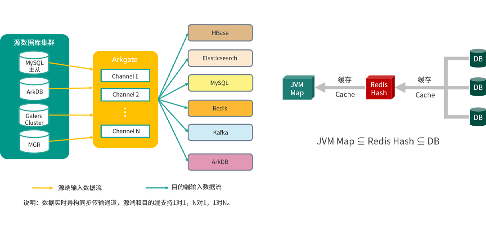

**总结回顾****
**

**
**

下面，我们来回顾一下今天学习到的知识。

​    

   

首先了解了 SQL 在查询优化器中的执行过程，然后学习了怎么查询 SQL 的执行计划和内容，还有慢查询相关的知识。还学习了如何优化 SQL，这里包括 MySQL 自身做的优化；Bad SQL 的一些案例和常见的问题等。

 

通过本次课程，你需要对 SQL 优化有总体的认识，优化是一种包罗数据库和操作系统知识的技能，需要不断的积累经验和实践，实践出真知。

 

建议你课后去尝试一下 pt-query-digest 工具的使用，以及对自己企业内的慢查询SQL进行尝试优化，在实践中学习和提高，一定要多总结，多记笔记，好记性不如烂笔头。

 

重点总结一下：SQL 的执行过程->查询优化器的工作原理->SQL 执行计划的解读->MySQL 慢查询日志和分析->SQL 常用的优化手段->SQL 编写规范->深入实际业务对数据库访问进行优化。

 

 以上就是课时 5 的内容，下一课时，将分享“如何实现企业级高性能数据库架构，突破单库性能瓶颈“。

 

开篇寄语：建立完整的MySQL知识体系

05:34

 高性能MySQL实战

 