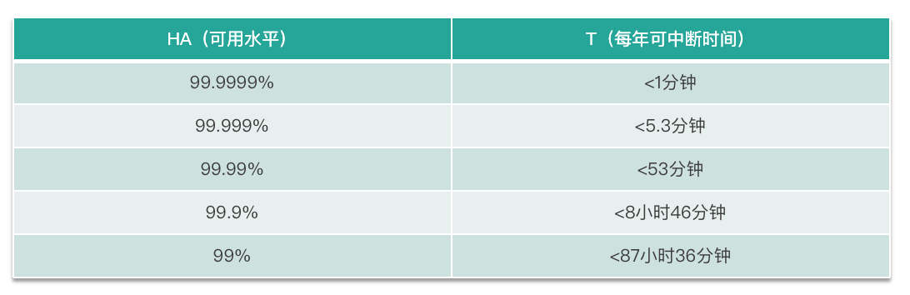
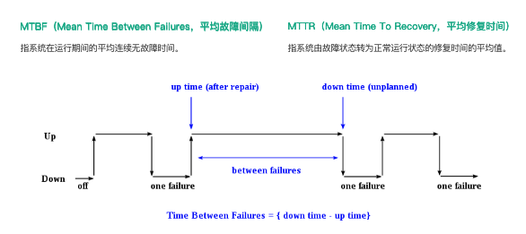
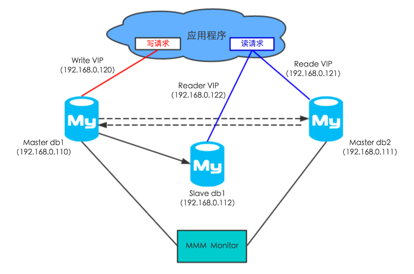
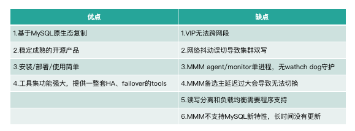
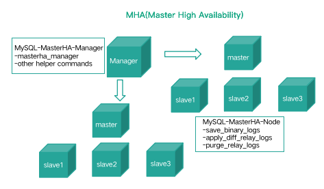
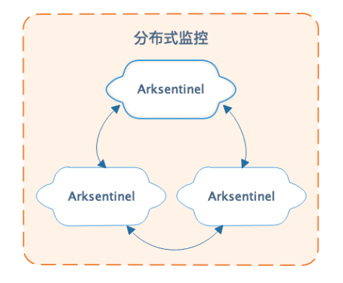
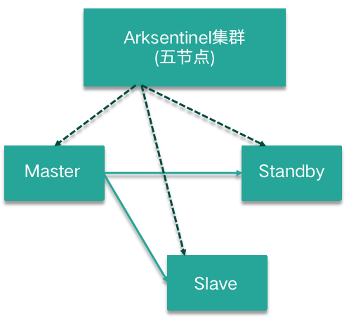
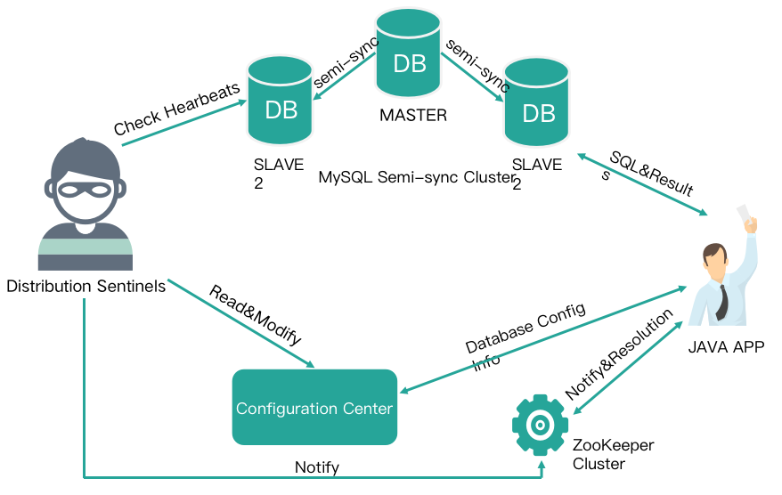
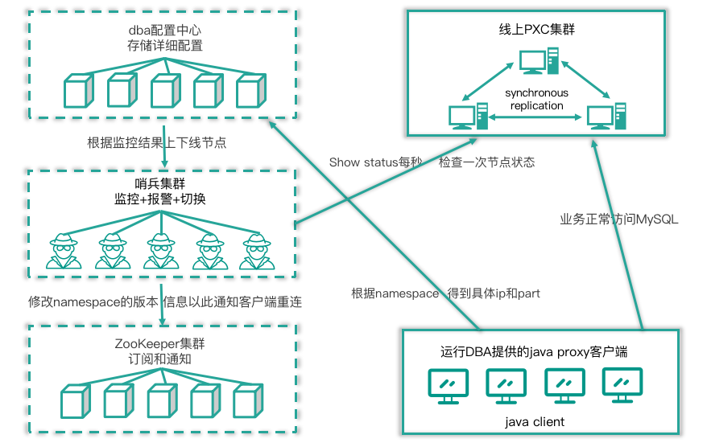
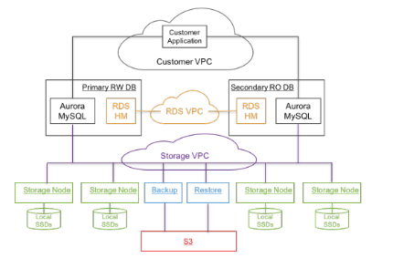

**第07讲：如何做到MySQL的高可用？**

本课时的主题是“MySQL 高可用”，主要内容包含：

- 什么是高可用性

- - MySQL 如何提升 MTBF
  - MySQL 如何降低 MTTR

- 避免单点失效

- - 基础软硬件避免单点
  - MySQL 高可用架构选型

- 故障转移和故障恢复等内容

  

**高可用性**

高可用性，维基百科的定义是指系统无中断地执行其功能的能力，代表系统的可用性程度。是进行系统设计时的准则之一。涉及两个指标，一个指标是 MTBF，表示平均故障间隔时间，MTBF 越高说明出现故障的次数越少；另一个指标是 MTTR，表示平均恢复时间，MTTR 越小说明故障恢复时间越短，系统受影响时长越短。

 

可用性有一个计算公式，是 MTBF/(MTBF+MTTR)， 其值越高，代表可用性越高。

​        

高可用性的指标，主要有可用性（也就是平时所说的几个 9）、平均故障间隔 MTBF、平均恢复时间 MTTR 三个部分。

## 可用性

根据 HA 计算的值，业务常用的描述方法是“系统的可用性达到几个 9“。这“几个 9“就表示可用水平，正如下图所示，9 越多意味着可用性越高。常说的“5 个 9“意味着系统每年故障时间小于 5.3 分钟，其计算方式也很简单：系统 1 年内服务中断维护了 5 分钟，HA = 1 年/(1 年+5 分钟) = 99.999% 。

​        

其中的 1 年就是 MTBF，表示平均故障间隔；5 分钟就是 MTTR，平均修复时间。

## MTBF 和 MTTR

MTBF（全称是Mean Time Between Failures，即平均故障间隔），是指系统在运行期间的平均连续无故障时间，提升 MTBF 就意味着减少故障出现的次数，加大系统正常运行的服务时长。其计算公式如下图所示，是最近一次故障时间 down time  − 上一次故障修复时的时间 uptime。

​        

MTTR（全称是Mean Time To Recovery，也就是平均修复时间），是指系统由故障状态转为正常运行状态所需修复时间的平均值。降低 MTTR 就意味着加速故障恢复的速度，例如故障在秒级恢复。

## 如何提升 MTBF

对于 MySQL 而言，MySQL 使用过程中如何提升 MTBF 以减少故障发生的次数或概率呢？通常我们有如下建议。

- 规范上线操作流程

开发环境、测试环境及生产环境要严格区分开，禁止混合部署，禁止未经测试的功能或任意变更直接上线生产。

- 严格审核线上变更操作

数据库线上变更操作需要指定审核及执行流程。建议流程是开发（DEV）提交变更申请，开发 Leader 或质量管控（QA）负责审核变更，由运维人员或 DBA 进行二次变更审核及执行操作。数据库变更执行需要全自动化，而且在操作前必须备份，当出现问题时能够快速回滚。 同时应收集线上变更的所有信息，方便审计。

- 合理参数优化

数据库相关参数必须严格测试，明确知晓参数的利弊情况。

- 定期巡检并修复问题

建议开发巡检平台对数据库服务器和数据库进行深度巡检，例如服务器磁盘空间是否富余、阵列卡是否需要充放电、数据库 int 类型的自增主键是否写满是否需要扩容、数据库表碎片率是否超过 50%、表是否有主键等。巡检项应该每天或每周生成巡检报告，DBA 或运维人员根据巡检报告进行问题修复。

- 慢查询优化分析

线上慢查询需要每日抓取分析，并发送优化建议给相关业务方，促进慢查询优化。

- 加强监控告警

完善操作系统的监控指标、数据库的监控指标，有助于快速定位故障原因，加速故障恢复。例如，操作系统监控指标不限于 CPU、TCP 连接、load 负载、swap、内存、用户（登录数量）、磁盘 IO、磁盘空间、网络流量，数据库服务器监控指标不限于BufferPool、Handler、Locks、Network、Processlist、QPS、Replication、Rows count、Threads 、Semisync 、Galera Cluster/MGR。具体的采集方法会在下一节主题为“搭建稳固的MySQL运维体系“的课时中讲解。

- 危险命令转义执行

例如 \rm -rf ： 危险命令在线上服务器进行转义，例如直接执行 rm -rf 命令列入黑名单（这有助于审计），使用 \rm -rf 操作，当然，命令执行前请三思。

- 系统过载保护

线上数据库服务器可以部署过载保护工具，例如和业务确认线上查询容忍的最大运行时长，超时后记录查询 SQL 信息并使用 PT-KILL 工具自动进行 query  kill，事后进行针对性慢查询优化。

- 高可用架构的正确选型

选择合适的高可用架构，少踩坑少故障。例如少使用基于Keepalive + VIP + 多主的架构或 MMM 架构，使用改良后的 MHA 或自研数据库高可用守护系统。当然极数云舟的ArkDB是从源码级优化了MySQL的架构，目的也是提供更好的高可用架构。

- 严守开发及运维规范

严格遵守数据库开发及运维规范。

- 完善工具集

无论开发环境、测试环境、线上环境都应该统一部署常见的工具集，方便定位协助问题。有些客户的线上环境，iotop、iftop、vmstat 这类常用工具集都没有，碰到问题只能现场离线安装。

- 引进数据库专家服务

引进数据库专家服务是一个不错的选择，可以快速提升运维团队的技术实力、故障处理能力及架构选型能力。例如对于快速成长型的创业公司，引进数据库顾问服务可以为线上数据库提供保驾护航的能力。

## 如何降低 MTTR

对于 MySQL 而言，MySQL 使用过程中如何降低 MTTR 以快速恢复故障呢？通常有如下建议。

1. 拒绝单点

整个系统建议冗余来避免系统由于单点而失效，任何组件或系统禁止单点。

1. 故障演练

模拟线上数据库故障，例如删库删表如何不跑路、数据库 crash 如何处理、服务器宕机如何恢复等，通过故障演练为系统恢复制定流程。通过故障演练同样可以培养应变能力强、技术功底扎实的团队，平时准备详细的演练文档和操作流程，这对于处理紧急故障事半功倍。

1. 高可用守护系统：

2. 1. 根据实际业务场景定制开发高可用守护系统，例如网络分区、网络抖动场景如何保证高可用等；
   2. 对于技术而言，好的架构是根据实际场景演进而来的。

3. 自动化运维管理平台

开发数据库自动化运维管理平台，通过平台自动化恢复集群，加速故障恢复。当然，我们需要了解其原理，不能过度依赖工具，避免成为只会使用工具的 DBA。

# 如何避免单点失效

从两个方面了解 MySQL 如何避免单点失效，一方面是基础软硬件避免单点失效；另一方面是 MySQL 高可用架构选型及演进。

## 基础软硬件避免单点失效 

从基础软硬件避免单点失效，往往是大部分 DBA 忽略的细节。

 

在构建 MySQL 高可用时，复制是基础，无论是异步复制、半同步复制、同步复制、物理复制，DBA 都知道基于复制部署高可用集群，在线上禁止使用单点 MySQL。那么 MySQL 高可用集群节点所处服务器该如何进行规划呢？

 

\1. 数据库集群节点不在同一机柜，不在同一交换机，不共用同一电源。

这是为了避免机柜掉电、交换机故障、电源老化导致的数据库集群全局故障 。好的数据库集群，其存储节点都是可以跨机架位感知的，它能够识别机架位并自动将数据零散存储在不同机架位上。当然更好的高可用实现方式，是数据库集群跨机房部署，集群节点部署在不同的机房。这也是构建同城两中心、异地三中心、灾备中心来保证高可用的方法之一。

 

\2. 避免光缆被挖，注意机房布线 。

在全局系统规划时需要考虑是否是单一网络提供商、单个公有云、单个供电传送网，这些如果没有备用则存在单点的致命隐患，当出现故障时，因为没有备用只能祈祷快速恢复。最近公有云频繁出现大规模故障，企业可以考虑在多个公有云之间构建高可用系统，例如 MySQL 跨云同步及跨云双活。

## MMM

基础软硬件规避单点失效后，我们就应该从 MySQL 高可用架构方向着手深入解析，去拒绝存在单点判断或故障的高可用架构方案。

 

企业初期使用较多的高可用架构，一类是基于 Keepalived + VIP + MySQL 主从/双主，一类是封装好的 MMM 集群，两者本质是一样的，MMM 相比前者多了一套工具集来帮助运维。

 

从下图中可以看到，数据库集群节点各绑定了一个 VIP，VIP 赋有读节点、写节点的逻辑概念，应用程序使用读写 VIP 来配置读写数据源，当写节点 Master db1 出现故障时，由 MMM Monitor 或 Keepalived 触发切换脚本，将 VIP 漂移到可用的 Master db2 上。当出现网络抖动或网络分区时，MMM Monitor 会误判，严重时来回切换写 VIP 导致集群双写，当数据复制延迟时，应用程序会出现数据错乱或数据冲突的故障。

​        

 

很明显，MMM Monitor 是单点判断的，存在单点故障的问题。这里总结下优缺点，如下图所示。虽然这类集群的缺点很致命，它无法解决网络抖动导致的数据冲突和错乱问题；但它好在部署简单。

​        

## MHA

接着来看业内常用的 MHA 架构，MHA 为了保证 Master 的高可用，通常会部署一个 Standby 角色的 Master。在 MySQL 故障切换过程中，MHA 能做到在 0~30 秒内自动完成数据库的故障切换操作，并且在进行故障切换的过程中，MHA 能最大程度的保证数据的一致性，以达到真正意义上的高可用。

 

如下图，整个 MHA 架构分为 MHA Manager 节点和 MHA Node 节点，其中 MHA Manager 节点是单点部署，MHA Node 节点是部署在每个需要监控的 MySQL 集群节点上的。MHA Manager 会定时探测集群中的 Master 节点，当 Master 出现故障时，它可以自动将最新数据的 Standby Master 或 Slave 提升为新的 Master，然后将其他的 Slave 重新指向新的 Master。

​        

MHA 相比 MMM 架构而言，能支持延迟数据补偿（最大保证）、支持半同步和 GTID 新特性，同时工具集更为强大，能做健康检查、集群节点挂载等运维工作。但是 MHA 存在单点判断、数据丢失的问题，这些问题也促成各个公司基于 MHA 进行二次开发和功能完善。

 

如下图，一主两从的 MHA 集群，正常情况下集群运行良好。但仍需要考虑一种故障场景，当 Manager 出现 Crash 时碰巧 Master 出现故障，这时候集群就无法正常的发起切换，Standby Master 也无法接管集群正常对外提供的服务，应用服务受损。

​        

这种故障更极端的情况是，Manager 和 Master 在一个机架位或一个交互机下，当机架位出现故障时需要人工切换集群。而当交互机出现网络隔离时，Manager 和 Master 形成内部网（即网络分区），那此时 Standby、Slave、应用程序是无法正常访问 Master 节点的。这里也体现出 Manager 单点判断的不合理性，合理的判断机制应该是多点判断，例如使用分布式集群节点发起投票进行决策（可以参考 Redis Sentienl 的处理机制）。

 

MHA Manager 和 MMM Monitor 一样，都没有 watch dog 守护进程，存在单点故障的问题。

 

再来看下脑裂和数据丢失的场景，如下图。

​        

首先是集群脑裂，当一部分应用程序 Client 和 Master 形成内部网络，而 Manager、Slave、Standby 及其他 Client 端组成内部网络时。首先集群的复制状态中断，两边数据不一致。其次 Manager 会认为 Master 已经 Crash，会发起故障切换，例如将 Standby Master 提升为新主库，将 Slave 自动 change master 挂载到 Standby Master 节点下形成新的数据库集群。这时候集群一分为二，出现集群脑裂的故障。

 

其次是数据丢失，同样当出现 Master 和 Standby（最新的 Slave）节点所处的服务器Crash 或组成内部网时，Manager 只能提升为 Slave（数据非最新，存在延迟），并为新 Master 提供服务，这就导致数据丢失。虽然 MHA 可以使用半同步复制来保证数据安全，但是半同步复制在网络抖动时同样是会存在退化为异步复制的风险。

 

MHA 作者承诺最大程度上保证数据的一致性，但故障切换过程中存在数据丢失的风险。

## MHA+Arksentinel

由于 MySQL 高可用架构方案单点判断的弊端，受到 Redis sentinel 的启发，极数云舟提出了基于分布式监控哨兵集群的 MySQL 高可用守护系统，我们对分布式监控哨兵集群就行了全新研发，目的是分布式监控哨兵集群对数据库集群进行故障检测和自动切换，跨机房的高可用切换，延迟数据自动补齐，秒级完成故障检测和切换等功能。

 

Arksentinel 是一个分布式监控哨兵集群，如下图所示，可以监控整个数据库集群的运行状况，实现系统监控、故障发现、故障自切换等功能。

​        

Arksentinel 通常在不同机房、不同机柜、不同交换机下部署 3~5 节点，每个节点对数据库集群节点进行监控，当集群的数据库节点发生宕机或不可达时，Arksentinel 使用类 Paxos/Raft 算法发起故障投票，确定 Master 出现故障时自动发起切换，将可用的最新从库提升为主库，完成故障转移的功能。

​        

其核心特性如下。

1. 系统监控：Arksentinel 实时检测数据库集群节点存活及是否正常运行。
2. 监控通知：当监控的数据库集群节点出现问题时，能够及时通过自身的 API 通知业务。
3. 解决网络分区抖动问题：Arksentinel 通常部署在不同机房、不同机柜、不同交换机下，当数据库集群发生故障时会发起故障投票，其大多数协议用来解决网络分区抖动的问题。
4. 自身高可用：Arksentinel 通常部署多个节点，节点之间互相高可用。
5. 自动故障转移：如果数据库集群 Master 节点发生故障，Arksentinel 会自动发起 failover，将最新的一个可用 Slave 节点提升为 Master，并且可以通过通知功能告知数据库集群实时 Master 的服务地址。
6. 自定义切换逻辑：可以支持 MySQL 全系列架构，例如主从、MGR、PXC。

 

将 MHA Manager 替换为 Arksentinel 后改良版的 MHA，解决单点判断、网络分区抖动的问题。其故障处理的大致切换步骤如下。

- Master 节点 Crash 的集群切换步骤。

- - step1 Arksentinel 多点判断及确认 Master 是否存活。
  - step2 尝试设置旧 Master read_only 为 on，防止集群多点写入。
  - step3 选取最全数据同步的节点为新 Master，通过比对差异数据进行数据补齐（binglog server），保证数据不丢失。
  - step4 初始化新 Master，例如：

- stop slave;

- reset slave all;

- set global read_only=off;(super_read_only)

- - step5 重新构建复制关系。

     

- Slave 节点 Crash 的集群切换步骤。

- - step 1 有备用节点，尝试使用距离最近、角色相同的节点替换（距离的概念是为了跨机房、跨中心准备的切换优先级权重）。
  - step2 重新构建复制关系。

 

对于数据库集群架构的调整，应用程序是如何第一时间知道实时的读写节点呢？通常有两种方案：

1. 业务应用程序（Java）加载 Jar 包，当存取实时读写节点信息的配置表有变动时，通知 Client 重建连接；
2. 使用透明的数据库中间层屏蔽后端集群的切换，应用程序统一访问数据库中间件，中间件维护后端集群实时读写节点的上下线信息。

## QMHA

下图是去哪儿网基于分布式监控哨兵构建的 QMHA 高可用集群，它是加强版的 MHA 集群。

​        

 

其完整的流程如下。

1. 应用程序加载 DBA 提供的 Jar 包，配置读写数据源为全局 namespace。 每个 namespace对应一个后端 MySQL 集群。
2. 应用程序通过 namepace 配置中心获取对应集群的读写节点信息后进行数据库集群读写访问。
3. 分布式哨兵集群实时监控线上的 MySQL 集群，当线上 MySQL 集群发生切换时，分布式哨兵会更新配置中心的配置（例如原 Master 下线，新 Master下线)，同时通知 ZK 集群信息发生变更。
4. ZK 获取信息变更时会通知 Java 客户端，应用程序会重新获取 namesapce 的信息，按照最新的读写节点信息重建连接池后进行数据库访问。

QMHA 集群能够满足数据一致性的需求，支持跨机房部署，但不支持多点写入。通过分布式哨兵选举投票来减少误切换，发起切换时会比对 GTID 来进行主从数据的快速比对，然后进行数据补齐。同时使用 Semi Sync 半同步复制提高数据安全性。

## PXC/MGR

对于 MySQL，PXC 集群和 MGR 集群同样可以使用分布式监控哨兵进行集群高可用性守护，如下图。

​        

 

其流程描述如下。

1. 应用程序加载 DBA 提供的 Jar 包，即运行 DBA 提供的 java proxy 客户端。 同时通过全局namespace 查询配置中心获取集群最新读写节点的 IP 和 Port 后，业务正常读写访问MySQL 集群。
2. 分布式哨兵实时监控线上 MySQL 集群，当集群出现故障发生切换后，分布式哨兵会更新配置中心的配置（例如原 Master 下线，新 Master 下线），同时修改 namesapce 的版本信息来通知 ZK 集群信息发生变更。
3. ZK 获取到信息变更时会通知 Java 客户端，应用程序会重新获取 namesapce 的信息，按照最新的读写节点信息重建连接池后进行数据库访问。

 

相比传统主从复制，PXC 集群和 MGR 集群支持多点写入，更完美得满足了高可用切换的需求，集群自身保证数据强一致性，不需要额外进行数据补齐操作。多点写入意味着切换时间更短，集群切换后恢复更快。

 

这两种高可用方案的唯一缺点在于需要应用程序引入 Jar 包，面对非 Java 应用程序需要定制开发。Jar 包对于应用程序而言有侵入性，如何引入一个对应用程序透明的高可用架构集群呢？

 

好的方法是引入一款高度兼容 MySQL 语法和原生协议的数据库中间件，中间件只负责透明读写分离和负载均衡，它对应用程序屏蔽后端复杂的高可用集群架构，无论后端是 MS / MGR / PXC / MM 架构，对应用程序而言都像访问单机 MySQL 一样。中间层对外提供统一的访问入口，它可以告诉应用程序实时的读写节点信息，当集群节点发生故障切换时，由分布式哨兵去更新中间件的后端集群实时的配置信息，按照最新的读写节点信息重建连接池后进行数据库访问即可。

## 高可用守护系统

至此，MySQL 高可用架构的优化迭代，呼应了之前所说的好的架构是根据实际场景演进而来的。 当数据库中间层和分布式哨兵监控集群碰上 MySQL 全体系版本及数据库架构时，统一的数据库高可用架构即 MySQL 高可用守护系统就出现了，如下图。

​        

它能够满足企业内部各类不同业务场景，提供不同的集群架构，确保高可用服务。使用统一管理方案实现对整个数据库集群的实时监控、实时评估集群的健康情况、发现故障节点，实时告警并及时降低服务等级或下线故障服务节点。可有效解决网络分区或网络抖动等常见网络异常。

 

它可以支持 MySQL 全体系版本和所有的数据库架构（常用的 MS/MGR/PXC/MMM/ArkDB）等。通过数据库中间件提供透明读写分离及负载均衡，分布式哨兵集群对故障节点进行切换处理后告知数据库中间件后端集群最新的节点上下线信息，中间件支持动态 reload 后端集群配置及支持连接池的特性，能够对前端应用程序的连接进行平滑的迁移。

 

其核心优势有：

1. 非侵入：方案独立部署，不侵入现有业务和数据库系统；
2. 兼容性：适配 MySQL 等多种数据架构，如 MS/MGR/PXC/MM/ArkDB，以及 100% 支持 MySQL语法及兼容 MySQL 原生协议；
3. 读写分离：中间件 Arkproxy 支持负载均衡、透明读写分离等功能，对外提供统一透明的访问方式；
4. 实时性：分布式哨兵集群，多点判断，保障数据库服务和实时准确切换；
5. 可配置：高可用处理逻辑可个性化定制，监控告警自定义；
6. 结果跟踪：防止误切换或不切换，能够解决网络分区或网络抖动等常见网络异常。

## 共享存储

还有一种能够有效避免单点失效的架构就是采用共享存储，如下图。

​        

对于 MySQL 而言，实现共享存储的分布式数据库有 Amazon Aurora、极数云舟 ArkDB 和阿里云 PolarDB，借助 MySQL 插件式引擎的架构，将数据存储节点（Engine 层）构建在一个分布式存储系统之上，上游 MySQL Server 节点共享同一份数据。最快的理解方式是使用原生 MySQL Server，实现一个分布式的存储引擎，例如将 InnoDB 存储引擎层构建在分布式存储系统之上。由于上游使用的是原生 MySQL Server，可以 100% 兼容原生 MySQL，对于应用程序而言无需进行代码修改即可无缝迁移。这类架构是分布式存储数据库，并没有分布式事务处理，使用的还是 MySQL Server 原生事务。通过分布式存储拥有的数据多副本、快照备份及恢复等功能特性保证数据存储节点的高可用性。

 

下图是 Amazon Aurora 的实现架构图，它使用了专门的 S3 存储及 RDS 组件，为了方便讲解，我们以 ArkDB 的架构为例讲解这类共享存储的 MySQL 高可用集群的实现方式。

 

​        

首先是接入层，采用数据库中间件为业务端提供统一的对外访问入口，其 100% 兼容 MySQL 语法和原生协议的特性，对于应用程序而言，访问数据库中间件跟访问原生 MySQL 的方式是一样的。接入层的主要职责是负责用户权限认证、接收并转发 SQL 访问请求，提供透明读写分离、负载均衡、连接数限制统计及连接池支持等。

 

​        

 

其次是计算层，对应 MySQL Server 层，简单理解计算层就是原生的 MySQL Server，不一样的是 Aurora 等公有云服务当前支持的最高版本是 MySQL 5.7，ArkDB 支持的版本是 MySQL 8.0；计算层为数据库接入层，负责响应客户端链接和权限验证，接收并处理 SQL 请求，包含连接管理、权限验证、分析器、优化器和执行器等。MySQL Server 为无状态节点，自身不存储数据，可以快速无限水平扩展，同时通过操作 MySQL Server 节点，实现整个数据库机器的高可用切换。在 MySQL Server 层处理 SQL 请求的时候，需要适当的内存和 CPU 资源，对存储则无要求。

​        

最后是存储层，对于 MySQL Engine 层，以 ArkDB 为准，存储层 ArkDB Engine 负责数据存储和读取，底层采用分布式存储。每个数据存储单位默认存储 3 个副本，副本间的数据保持强一致性和容灾。ArkDB Engine 负责存储数据并实现数据共享。上层 Server 节点访问 ArkDB Engine 同一份数据。ArkDB Engine 支持根据业务访问策略对数据存储分级，用户可以根据预算、性能指标、容量请求、访问场景按需使用不同的存储硬件，同时针对闪存卡进行软硬件结合优化。

​        

无论是 Amazon Aurora，还是极数云舟 ArkDB 和阿里云 PolarDB。其架构都是基于 MySQL 实现的，这决定了它们非常简单易用，对于开发人员和 DBA 而言可以复用 MySQL 的知识和技术栈，能快速运维。其核心特性有以下几点。

- 透明读写分离

三者都是一主多从架构，主节点负责处理读写请求，从节点负责处理只读请求，通过 LVS 或中间层提供透明读写分离、高可用和自适应负载均衡的能力，业务通过访问接入层地址，SQL 请求会被自动分发到集群各个节点，最大化提升集群处理能力。

- 计算存储分离

计算与存储分离，计算节点无状态化（不存储真实数据），数据访问分散到不同的数据节点实现数据库的并发读写，从传统数据库的磁盘 IO 转化为网络 IO。

- 分布式存储

数据多副本、能够跨机房存储及机架位感知，具有自动管理、副本数据自动修复、无单点故障等特性。

- 弹性伸缩

利用分布式存储系统的优势，可以动态增删计算节点和存储节点以实现弹性扩缩容功能，底层的数据分布式存储彻底解决了单机存储需要分库分表的问题。

- 物理复制

基于物理 Redo Log 实现的数据同步，不会出现主从数据延迟。其 Redo Log 是存放在共享的分布式存储引擎中，主实例获取各个从实例的应用 LSN，以控制主库脏页的刷盘与检查点推进，从实例读取主实例最新的 LSN 来决定是否需要应用新的 Redo 日志。

- 无锁备份和快照恢复

利用分布式存储系统的快照技术可以实现无锁备份和快照恢复。

- 完整性事务支持

使用原生事务，100% 支持 MySQL 数据库事务 ACID，支持 MVCC 多版本并发控制。

  

 

至此，我们从基础软硬件避免单点故障和 MySQL 高可用架构选型及演进两个方面，6 个小节深入讲解了如何避免单点失效，知识结构如下图。

​        

# 故障转移和故障恢复

接下来我们学习故障转移和故障恢复，以及 MySQL 运维在这方面的一些关注点。

## 故障转移

故障转移在维基百科的定义是指当运行的服务或应用意外终止时，快速启用冗余或备用的服务器、系统、硬件或者网络接替它们工作，通常是自动化的过程。那么对于 MySQL 而言，故障转移常见的技术有：

1. 虚拟 IP 或 DNS 服务，对应我们之前学习的 Keepalived +VIP/DNS 和 MMM 架构；
2. 提升备库为主库，对应我们之前学习的 MHA、QMHA、PXC 及高可用守护系统；
3. 中间件层负载均衡，对应我们之前学习的 LVS 或 Arkproxy 中间层。

## 故障恢复

故障恢复的定义很简单，指应用不可用或受损的状态结束，可正常对外提供服务。故障转移和故障恢复望文知义，非常简单。我们主要是学习故障转移过程中运维的关注点。

 

  \1. 虚拟 IP 或 DNS 服务

在虚拟 IP 运维过程中，有时会出现一个 VIP 绑定在多台服务器同时提供连接的问题。这时需要刷新 ARP，这也是为什么要避免使用 Keepalived+VIP 和 MMM 架构的原因之一，因为它处理不了这类问题而导致集群多点写入。

 

通常当 VIP 迁移到一台新机器上，mac 地址发生了变化，需要马上使同网段机器和交换机更新 ARP 缓存，当一些 HA 系统或 MySQL MMM 等发生故障需要紧急手动绑定 IP 时，需要刷新 ARP 缓存。

 

这个是使用虚拟 IP 进行故障转移时要关注的运维知识点。

 

  \2. 提升备库为主库

使用 Replication 时，当备考提升为主库时的关注点主要有下面几点。

- 尝试将原 Master 设置 read_only 为 on，避免集群多点写入。

- 当出现数据延迟时，再提升 Slave 为新 Master 之前需要进行数据补齐，否则会丢失数据。

- - 可以借助 binlog server 保留 Master 的 Binlog；
  - 可以借助 Semi Sync 半同步复制最大限度保证数据的安全性
  - 可以借助 GTID 快速比对差异数据，相比 file、postion 的复制方式能加快数据补齐的速度。

- 使用同步集群，Galera Cluster 和 MGR 集群多点写入及数据强一致性的特性，架构层次即可以天然解决前两个问题点。

# 拓展：MySQL 高可用集群

最后，可以拓展思考一下，我们理想中的 MySQL 高可用集群是什么样子的呢？我列举了一下需求点，如下图所示，供大家学习参考。

​       

# 总结回顾

下面来回顾一下本节课的知识，首先我们从什么是高可用、MySQL 如何提升 MTBF、MySQL 如何降低 MTTR、避免单点失效、基础软硬件避免单点失效、MySQL 高可用架构选型及演进、故障转移和故障恢复、拓展：MySQL 管理的革命等方面进行了学习。其中对于 MySQL 高可用架构选型及演进进行了重点的深入的介绍。

​        

通过学习本课时内容，你需要对构建 MySQL 高可用有总体的认识，需要知道去思考哪些细节点。MySQL 高可用架构需要不断的积累经验并实践，实践才能出真知，好的架构是根据实际场景演进而来的。

 

下一课时，将分享如何搭建稳固的 MySQL 运维体系。

 

 

开篇寄语：建立完整的MySQL知识体系

07:23

 高性能MySQL实战

 