**第08讲：搭建稳固的MySQL运维体系**

 

本课时主要包含 MySQL 监控要点、MySQL SQL 审核执行、MySQL 备份恢复等内容。

# 

###### MySQL 监控要点

首先我们来学习 MySQL 监控要点，主要涉及服务器和 MySQL 两个方向的监控告警。

 

在这两个监控告警方向需要重点关注监控策略、监控趋势图及报警方式。

- 监控策略指的是每个监控项的告警阈值，例如 threads_running > 30 触发报警。
- 监控趋势图指的是对每个时间点，项目所采集数据的图形展现，基于历史数据的比对能够快速发现异常的监控项。
- 报警方式则按需配置，Email、电话或企业微信等均可。

## 

###### 服务器监控要点

服务器监控要点主要在于监控硬件健康情况，例如通过 logwathch 日志监控系统及时发现是否存在硬件问题。

其他基础指标还有网络、CPU、内存、磁盘空间、系统负载及文件 fd 数量等。

​    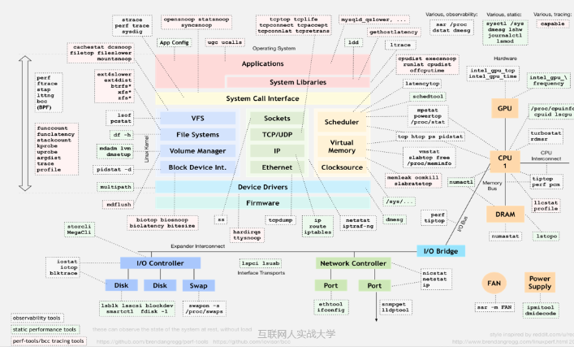    

如上图所示，对于每个监控要点都要求有对应的 Linux 工具或系统文件进行查看，你需要熟练使用图上的这些 Linux 性能调优的数据采集来源和封装工具集。

 

在采集服务器监控信息时，可以通过系统文件进行历史数据采集。例如核心的服务器指标，示例如下所示。

- 采集服务器的登录用户数，使用 who | wc -l 进行数据采集入库。
- 监控 CPU 使用情况，通过系统文件 /proc/stat 计算获取监控项：user、idle、iowait、sys，获取监控项后进行数据采集入库。
- 监控 load 信息，通过系统文件 /proc/loadavg 计算获取 load1、load5、load15。
- 监控 IO 使用情况，通过系统文件 /proc/diskstats 计算获取 ioutil、iops、write_mb、read_mb。
- 监控磁盘空间信息，通过 df–m 获取信息，其中 Avail：可用空间，Used：已使用空间，Size：总空间。
- 监控内存使用情况，通过系统文件 /proc/meminfo 计算获取 used 、free、buffer、cache、total。
- 监控虚拟内存信息，通过 free –m|grep swap 即可采集。
- 监控 TCP 信息，通过系统文件 /proc/net/tcp 计算获取 close、connected、listen、syn。
- 监控 Net 信息，通过系统文件 /proc/net/dev 计算获取，recv 接收数据速度，send 发送数据速度。

## 

###### MySQL 监控要点

同样，对于数据库而言，我们需要知道 MySQL 采集的监控项和数据来源。MySQL 大部分的监控取值来源于 MySQL 运行状态值。如：

- 根据状态值 Querys 计算 QPS，取值方式为 show global status like '%Queries%'；
- 根据采集数据库状态值 com_select、com_delete、com_insert、com_update、com_update_multi、com_insert_select 来监控数据库每秒操作次数；
- 根据 IBP 读写来计算 IBP 的缓存命中率、连接数和慢查询数的使用情况。

对于主从复制集群而言，从库需要监控集群复制运行状态、延迟时间及从库是否只读等信息。

对于事务信息和死锁信息，通过采集和处理 show engine innodb status 来分析。

 

MySQL 常见的数据库连接数监控、QPS、TPS、锁、IBP 等监控指标，如下所示。

​    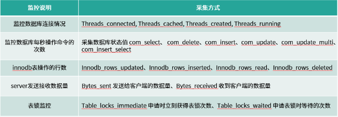    

​    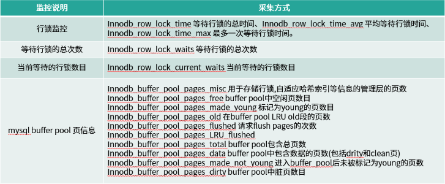    

redo log、 replication、semi-Replication 和 PXC 的监控项，如下所示。

​    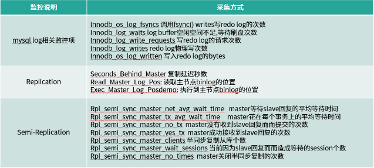    

​    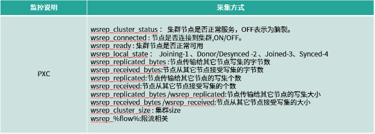    

### 常用监控系统

知道如何采集监控指标数据后，就可以编写采集脚本或程序进行数据采集了，数据采集后推送给监控系统进行数据展示。常见的监控系统有 Nagios、Cacti、Zabbix、PMM 及自研监控告警系统。

 

其中 Nagios、Cacti 监控系统对于 MySQL 而言，功能较弱。例如 Nagios 不支持趋势图只关心状态是否正常，Cacti 报警通知机制较弱。

 

使用比较广泛的 Zabbix 监控系统对 MySQL 的监控模版较少，需要定制监控模版。

 

PMM 是 Percona 推出的 MySQL 监控系统，相比其他系统更聚焦于对数据库的监控告警。它是一款开源的用于管理和监控 MySQL 和 MongoDB 性能的开源监控平台，通过 PMM 客户端收集 DB 监控数据并使用第三方软件 Grafana 画图展示出来。

### 自研监控告警系统

如果你需要自主研发监控告警系统，可以考虑采用推送和拉取结合的架构模式，如下图所示。

​    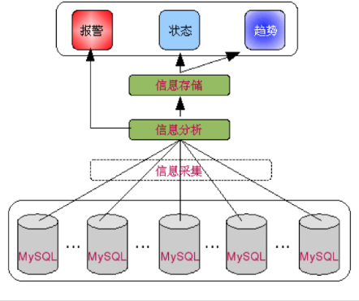    

推送模式在每个需要采集的服务器上部署 Agent 采集程序，Agent 采集程序定期将采集的监控数据推送给配置中心或元数据存储库进行持久化。

 

拉取模式由中控机向远程服务器发送采集监控信息的命令，将采集信息拉取到配置中心或元数据存储库进行持久化。

 

最后通过 Grafana 进行监控数据展示。

 

至此，我们从服务器和 MySQL 两方面学习了 MySQL 监控要点，掌握了一些必要的采集指标和采集方法，我们可以将这些指标完善到现有的线上监控系统中。

## 

###### 人肉审批流程

接下来我们来学习 MySQL SQL 审核的相关内容。首先为什么需要 MySQL SQL 审核呢？大家有没有碰到删库跑路的故障呢？

 

传统的人肉 SQL 审核通常是这样的，借助于邮件，当 DEV/QA 需要对线上数据库执行数据变更时写邮件向 DBA 发起变更，DBA 收到变更邮件后，基于个人的工作经验和"火眼金睛"对变更脚本的 SQL 进行人肉审核。通常需要审核如下内容。

1. SQL 语句是否有语法错误。

   肉眼无法保证准确性，通常需要在测试环境跑一跑。如果 DBA 偷懒或托大，线上直接跑那就相当于基于线上环境当测试环境来审核错误了。

2. SQL 语句是否有语义错误。

   这就需要和线上表结构进行对比，需要查看 SQL 语句中用的对象（库、表、列、索引名等）是否正确。

3. SQL 语句是否符合开发规范和运维规则。

   这个阶段是最重要的，也是最耗时的，DBA 定义的开发规范越多，工作量越大。

4. 循环审核，邮件反复。

   当审核发现问题后需要查看往返邮件及循环审核流程，执行审核效率低，流程复杂处理慢。

5. 执行前环境检查。

   审核通过后，DBA 需要仔细确认需要执行变更的数据源，这一步千万不能出错，对于分库分表的多实例一不小心就可能导致数据错乱。

6. 执行前备份。

   SQL 审核前，需要手动备份。

7. 执行中出错。

   重新检查哪里出错，如果是脚本中某些代码存在语法/语义错误，那还需要修改执行脚本，简直是效率杀手。

8. 执行后检查。

   DBA 需要人工检查，DEV/QA 需要人工检查，两者需要确认成功后才能保证整个 SQL 变更成功。

## 

###### 自动化审批流程

传统 SQL 审核执行流程走下来，如果碰到几次不顺利则需要来回沟通，整个审核执行效率就更低了，情绪化操作更加无法保证 SQL 审核执行的正确性、安全性。而出现问题后追踪耗时，事后审核困难。

 

面对 SQL 审核执行的这些问题，极数云舟发布了 Inception 的企业版本 Arkit ，功能更强大更丰富，并完美地解决了上述问题。

 

它是针对 MySQL 的 SQL 自动化审核和执行工具，保证 SQL 审核 100% 兼容 MySQL 语法，同时实现自动执行审核成功的语句。在执行 SQL 过程中，平台生成被影响数据库的回滚语句，用来实现数据库的闪回功能。对于审核和执行的结果，平台以结果集的方式展现出来。集成在线改表工具，实现操作数据库的自动化运维，极大提升 DBA 的工作效率，标准化 SQL 审核，降低线上执行 SQL 出错的概率，并实现数据库操作的回滚，并对操作数据库的行为提供统计和审计功能。

 

通过平台完成 SQL 语句的审核与执行，审核规则与流程的制定，以及备份回滚的在线操作。通过可视化界面实现 SQL 语句提交、详情展示、审核操作、自动执行，以及执行出现问题后自动修复等操作。SQL 语句执行后，自动生成相应的回滚语句，并且备份到数据中心。可以通过平台一键回滚操作，保障数据安全。

## 

###### SQL 审核需求

MySQL SQL 审核具体可以审核哪些内容呢？主要分为两部分：

1. 开发规范审核，实现对开发规范进行审核规则参数化，可以通过平台在线调整审核规则，做到灵活可控，满足多种业务场景。
2. 动静态审核 SQL 代码，实现对测试环境、开发环境、线上环境的动静态 SQL 代码的抽取、审核、优化及执行。

### 

###### 开发规范审核

对于开发规范及 DBA 自定义规则可以进行参数化，例如如下规则的审核均可以作为 SQL 审核的审核参数来要求提交的 SQL 语句。同时对于开发而言，可以作为 DEV 的语法检查器，它可以快速告诉 DEV 提交的 SQL 语句哪里出现语法、语义错误，而无需查阅官方文档。

 

**开发规范**

- 命名规范，例如库名、表名、字段名、主键名的命名规则的自动审核；
- 基础规范，例如存储引擎、字符集、是否为NULL、是否添加注释等规则的自动审核；
- 字段设计，例如尽可能不使用 TEXT、BLOB，使用 INT UNSIGNED 存储 IPV4 等；
- 索引规范，例如索引个数控制、是否有主键、是否存在重复索引、冗余索引等；
- SQL 规范，例如是否审核 SELECT *，是否审核大事务、是否审核隐式转换等。

**
**

**自定义规则**

- 规则对象涉及表、索引、INSERT/UPDATE/DELETE/SELECT 语句。

可以作为 SQL 审核参数的审核检查项，示例如下，主要涉及公共审核检查项及表属性审核检查项，如下所示。

- 检查 BLOB 列是否设置了默认值，如果是则报警告，无参数可设置。
- 检查列类型是不是 DATETIME，并且其默认值为 NOW()，如果是则报错，类型为错误，不可配置。
- 检查列设置是不是 NOT NULL 属性，或者为主键列，但其默认值被设置为 NULL，如果是则报错，类型为错误，不可配置。
- 检查自增列是否设置了默认值，如果是则报错，类型为错误，不可配置。
- 检查时间类型默认值的合法性，如果与对应的字段类型不匹配，则报错，类型为错误，不可配置。
- 检查列数据类型是不是 SET，或者是 ENUM，或是 BIT，类型为警告，可配置。
- 检查列有没有注释，类型为警告，可配置。
- 检查 CHAR 类型的字段所定义的长度，如果超过设置，则建议转换为 VARCHAR，类型为警告，可配置。
- 检查列的类型是不是 BLOB， 类型为警告，可配置。
- 检查列是否设置 NOT NULL 属性，类型为警告，可配置。
- 检查 BLOB 类型的列是否设置了 NOT NULL 属性，如果设置了则报错，类型为警告，不可配置。
- 检查自增列是不是无符号类型，类型为警告，可配置。如果长度小于 4，则同时建议转换为 INT 或是 BIGINT，类型为警告，可配置。
- 检查自增列的个数，只能有 一个，类型为错误，不可配置。

如下是 SELECT/INSERT/DELETE/UPDATE 审核检查项。

- 插入指定的列表中，同一个列不能出现多次，类型为错误。
- 必须指定插入列表，也就是要对哪几个列指定插入值， 如 insert into t(id,age,name) values(...)，类型为警告，可配置。
- 插入列列表与值列表个数相同，二者的个数需要相同，如果没有指定列列表（因为可配置），则值列表长度要与表列数相同。类型为错误，不可配置。
- 检查 NOT NULL 的列，插入的值是不是 NULL，类型为错误，不可配置。
- 检查查询插入时，查询的列个数，与指定列的列表元素个数是否相同，类型为错误，不可配置。
- 检查查询插入语句中的 SELECT 子句，有没有 WHERE 条件，类型为警告，可配置。
- 检查更新删除语句中的 SELECT 子句有没有 LIMIT 子句，类型为警告，可配置。 
- 检查查询插入语句中的 SELECT 子句，是不是 SELECT *，类型为警告，可配置。
- 检查列数据类型是不是 SET， 或者是 ENUM，或是 BIT， 类型为警告，可配置。
- 检查列有没有注释，类型为警告，可配置。
- 检查查询插入语句中的 SELECT 子句，有没有 LIMIT 子句，类型为警告，可配置。
- 检查查询插入语句中的 SELECT 子句中的 ORDER BY 子句，排列类是否为 RAND()， 类型为警告，可配置。
- 检查更新删除语句中的 SELECT 子句有没有 WHERE 条件，类型为警告，可配置。
- 检查更新删除语句中的 SELECT 子句中的 ORDER BY 子句，排列类是否为 RAND()，类型为警告，可配置。

上述审核检查项都只是示例，实际支持的审核检查项个数更多，同时可以实现对审核检查项进行评分，来评估提交的待审核 SQL 语句。

​    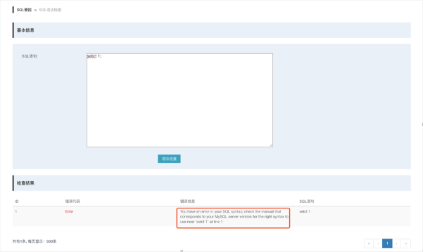    

上图是语法检查的结果，只需要提交 SQL 语句即可快速判断 SQL 语句是否存在语法、语义错误。

​    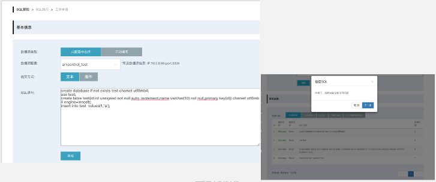    

当提交的 SQL 语句存在错误或警告时会提示你具体哪一行需要修改，这个阶段可以嵌入开发规则和自定义规范来规范提交的 SQL 语句。

​    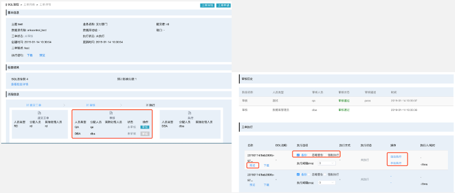    

当提交的 SQL 语句没有语法、语义错误并完全满足审核规则时，可以选择 SQL 语句执行流程。通常是由 DEV 发起 SQL 审核，QA/DEV Leader 进行第一次 SQL 审核，DBA 进行第二次 SQL 审核及执行。

 

执行过程中默认选择"备份"选项，当 SQL 语句执行失败时可以快速生成回滚语句进行数据修复。同时对于 DDL 语句，支持主流的 PT-OSC 和 GH-OST 工具。

 

SQL 审核执行的关键节点均可以对接适配通知系统，例如发送邮件、钉钉、微信等。

### 

###### 代码审核

以上是对于静态 SQL 脚本或 SQL 语句进行开发规范审核和执行的流程。除此之外，还可以满足线上系统对代码审核-动静态 SQL 代码的审核执行的要求。主要分为三大类：

1. 静态 SQL，能够自动扫描静态代码文件（例如 mybatis xml 配置文件）提取其中的 SQL 代码，按照预定义的审核规则，检查 SQL 代码编写规范性，避免不规范的 SQL 代码流入生产环境、成为慢 SQL，影响线上系统性能。
2. 动态 SQL，在应用程序自动化测试阶段，实时抓取测试功能执行的动态 SQL 代码，例如审核 Java 开发的应用程序运行时执行的 SQL 代码。
3. 版本 SQL，应用程序发布或发版时，能够自动扫描待发布的 SQL 脚本文件，提取其中的变更 SQL 语句，按照预定义的审核规则，检查 SQL 变更规范性，以及是否存在高危变更操作，避免版本发布导致产生故障。

​    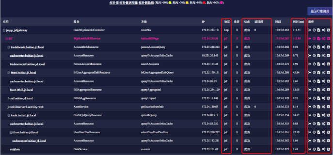    

如上图所示，代码审核的截图能够显示具体应用调用的模块名、服务名、方法、来源 IP、协议、类型、状态、返回值、执行时间、执行耗时和运维操作等信息。

 

当某个功能出现问题时，能够清晰打印 SQL 语句和执行的功能模块，示例如下图所示。

​    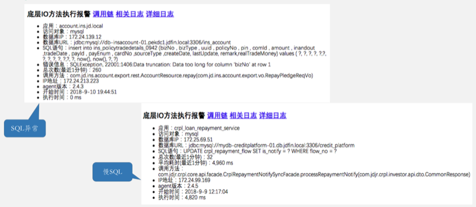    

这些 MySQL SQL 审核内容，几乎能够覆盖大部分对 MySQL SQL 审核执行的需求。使用自动化审核执行系统，能够提升 SQL 审核执行的效率和正确性、保证线上系统的安全可靠。

# 

###### MySQL 备份恢复

## 

###### 常见问题

接下来我们学习 MySQL 备份恢复的知识点。对于 MySQL 备份恢复而言，常见问题或弊端如下。

1. 本地存储备份，磁盘空间 double，不仅造成资源浪费，而且放大了备份对线上业务的影响，关键是存在安全隐患，服务器 crash 若无法恢复，则数据库实例和备份集均无法使用。 
2. 备份手段很多，每个 DBA 有自己的喜好。如果没有集中化管理，而是多样化进行备份，维护困难。
3. 备份文件校验，备份文件不做校验通常是最大问题也是最容易忽视的问题，以为备份完成就成功了，恢复时发现出现备份文件无法恢复的问题。
4. 集群备份节点选择问题。备份或多或少对线上业务有影响，DBA 建议备份部署在 slave 或 statistic 节点上，那么当集群发生主从切换，如果备份节点没有动态进行切换，导致在写库上进行备份，使线上业务受备份影响。
5. 流量和压缩。备份传输引发网卡流量限速和压缩对线上业务造成影响。

## 

###### 关注点

对于备份恢复策略，可以集中统一使用物理备份和逻辑备份相结合的方式，如下图所示。

​    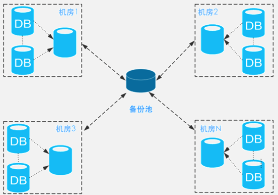    

通常建议使用 Percona Xtrabackup 物理全备和 mysqldump 逻辑备份组合使用。

 

同时考虑到备份压力，对线上备份的集群分三六九等，例如每周一备、每月一备、每天一备。

 

备份统一使用流备份进行远程备份，同时提前 apply log 进行备份文件校验。

 

恢复策略可以支持通过备份集新建示例、通过备份集挂载线上集群 Slave、指定时间点恢复和 FlashBack。

 

备份策略支持多通道，方便扩展。当集群数增长时，通过扩容备份通道即可保证集群的备份效率。例如每个机房独享一个或 N 个备份通道，各个机房间的备份通道相互独立且互不影响。

 

对于备份集如何存储也是一个可优化点，我们建议是本地无备份、备份通道机存储最近 N 次备份、历史备份集压缩存储到备份池。备份池使用 MFS 是一个不错的选择，MFS 是一种容错的分布式文件系统，将数据切分成多个数据副本存储在不同的计算机节点里，备份文件的高可用性得到极大的保证。

​    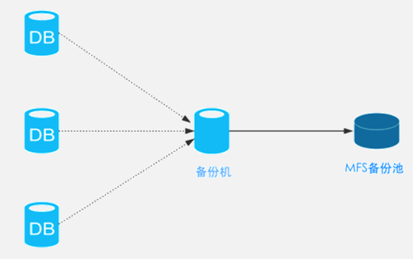    

备份文件的校验是 DBA 特别关注的一个点，不希望存在备份文件无法恢复的场景。因此在备份过程中备份文件提前通过 apply log 进行了恢复，即达到了备份文件校验的同时又加快后期备份恢复的速度。

​    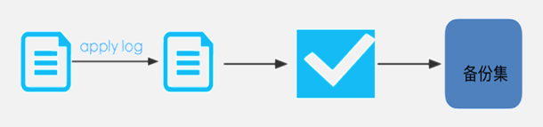    

基于这些备份恢复关注点进行 MySQL 自动化备份恢复系统开发，通过系统配置集群备份恢复变得简单。

​    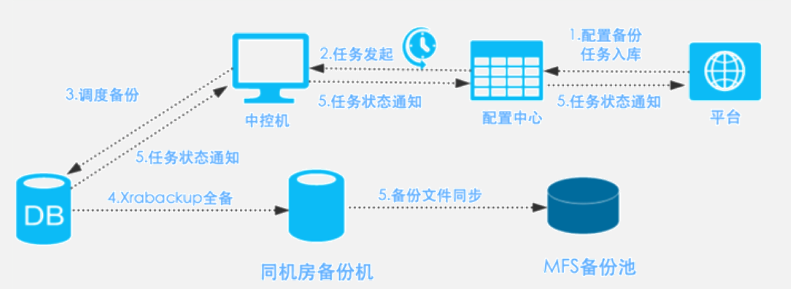    

当集群新上线或变更时， DBA 在管理平台进行备份任务部署前，需要一个指标检查：是否部署专用备份网卡。任务配置后台入库后，集群服务器上部署的 Agent 访问配置中心获取任务信息并根据规则发起备份任务，实例调度备份以流的方式向同机房备份机传输，任务结束后逐一向上层返回任务状态信息，最终在 Web 平台进行界面信息展示。

 

同时备份文件会在同机房备份机进行压缩，以 RSYNC 的方式同步到 MFS 备份池。至此，一次备份任务完成。DBA 只需要部署备份任务、查看任务状态即可，不再需要过多的人工介入备份任务中。

​        

Arkcontrol 的备份恢复中心就是一个 MySQL 自动化备份恢复系统。它不仅解决了常见问题还进行了定制化优化，核心功能如下。

1. 备份策略：根据业务类型，制定备份策略，如备份等级、备份周期、备份类型、备份工具、备份集存储策略可控、备份数据存储周期可控以提供资源利用率。
2. 智能备份：备份易扩展、可部署多通道，当集群发生切换时智能选择从库作为备份节点，支持带宽限制和压缩控制。
3. 集中管理：将备份操作转化为任务，通过备份管理平台，实现一体化管理，可以快速梳理整体备份情况。
4. 统一调度：通过备份平台，实现任务智能分发机制。根据备份服务压力，实现智能动态调度备份任务，加快备份速度，提供利用率。
5. 数据安全：数据是公司核心资产，不管是线上，还是备份的数据，都需要考虑安全。在备份平台中，通过内部嵌入完善的加密算法，将备份数据集实现加密后，再存储。
6. 备份集校验：备份数据用于灾难恢复，保证备份的数据可用性。
7. 备份存储：可利用分布式存储平台，完成备份数据的存储，通过多副本保证备份数据的安全。备份机和备份池资源利用率展示、备份集存储周期。
8. 备份平台化：实现备份管理平台化，完成备份任务制定、备份结果管理、统一调度等操作。
9. 状态展示：备份/恢复配置信息、备份/恢复状态展示、备份/恢复日志展示。
10. 数据恢复：实现 MySQL 的数据恢复功能，支持单实例恢复、Slave 角色恢复、指定时间点恢复及 FlashBack，确保数据无丢失。
11. 接入其他数据源：接入其他开源数据库，例如 Redis 等。实现开源数据库备份平台一体化。
12. 提供对外服务：通过接口提供对外相关服务，实现多种业务平台联动，满足不同业务需求。

# 

###### MySQL自动化管理平台

最后我们基于本课时学习的内容进行拓展，我们想要的 MySQL 自动化管理平台是什么样子的呢？

 

首先我们梳理下对数据库使用方的需求。

​    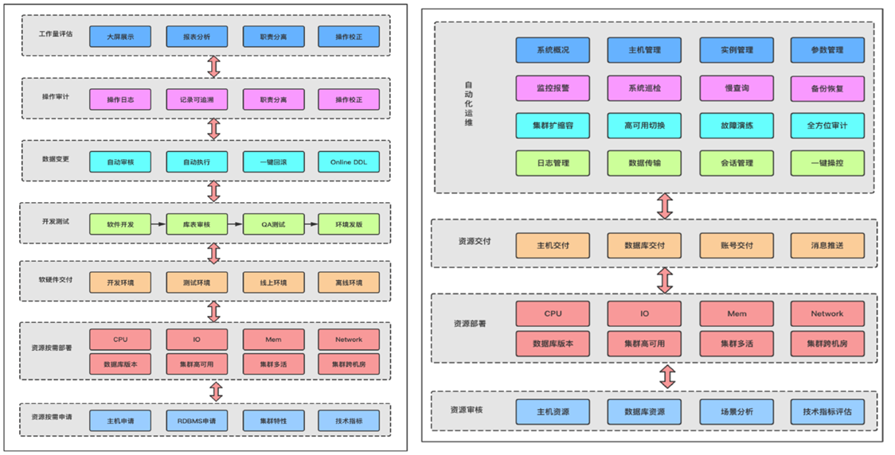   

 对于开发人员和测试人员而言，MySQL 自动化管理平台能提供全链路、全生命周期的统一管理和资源交付。如左图所示，从最开始按需从资源池申请资源、资源部署到软硬件交付，开发测试到应用发版上线，线上系统数据变更的自动审核执行、操作审计和报表展示，所有 MySQL 实例的申请分配、部署交付、维护托管、数据变更都能在平台完成，对用户而言实现集团统一管控，可追踪、可升级，满足用户快速交付，高可用、高性能的使用需求。

 

对于运维人员和 DBA，支持运维人员和 DBA 快速变更，通过平台统一操作，提升效率和减少人工误操作。如右图所示，通过各类在线管理工具，帮助提高系统安全防范能力、快速故障恢复能力、应对突发访问流量能力，保障系统运行稳定，为相关使用、维护人员提高统一高效的管理工具和平台。

 

根据已经讲解的 MySQL 监控告警、MySQL SQL 审核、MySQL 备份恢复三个核心功能的内容，对平台进行功能补充。主要涉及。

1. 六大中心

2. 1. 录入中心：实现服务器主机录入，在录入主机上部署 Agent 或采集程序。
   2. 工单中心：对数据库实例申请、数据库权限申请、数据库部署、数据库回收等。
   3. 部署中心：实现对 MySQL 及 MySQL 体系分支数据库架构的自动化部署（MySQL、MariaDB、Percona、ArkDB 等）。
   4. 配置中心：实现平台相关的采集参数、基本信息、报警通知等配置。
   5. 用户中心：实现用户注册、群组管理、权限管理和用户管理等。
   6. 高可用中心：实现数据库实例、集群及核心组件的高可用守护，监控组件存活及故障切换，保证系统的可用性、可靠性及安全性。

3. 三大管理

4. 1. 主机管理：管理录入的主机资源，包括物理机、虚拟机、云主机。能够展示采集主机的信息，例如硬件配置情况、实例部署信息等，同时提供主机巡检功能。
   2. 实例管理：实例纬度展示单个数据库实例的信息，可以按集群名称、实例角色、实例所属组、架构类型等进行搜索。
   3. 集群管理：集群纬度展示数据库集群的信息，可以按集群名称、架构类型、集群所属组、运行状态等进行搜索。

5. MySQL 健康巡检：展示超过阈值的集群/实例的巡检项，可生成巡检报告。

6. MySQL 慢查询：数据库实例/集群的实时慢查询分布情况及趋势图，可以查询执行计划及优化建议。

7. MySQL 运维工具集：常用的运维工具，例如过载保护 pt-kill、抓包工具 tcpdump、死锁打印等。

8. MySQL 数据归档/数据订阅：实现 MySQL 数据源到 MySQL、Redis、Kafka、Hadoop、ES等异构数据源的数据同步。

综上所述，如下是MySQL自动化管理平台Arkcontrol的示例图和描述，供大家学习参考。

​    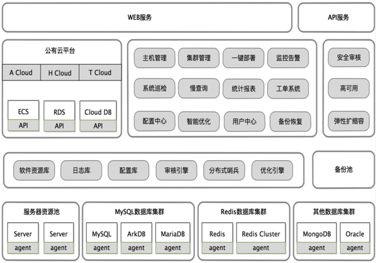    

 

Arkcontrol 用于破解企业内部复杂数据库管理的效率瓶颈和安全问题，助力企业私有云构建，提供集群化、自动化、服务化、智能化的技术能力，帮助企业快速建立“高可靠、高性能、高效率、易使用”的数据库全维度管理体系。

 

功能描述

- 全兼容：全面支持所有 MySQL 体系数据库和架构，以及 Redis、Redis Cluster、MongoDB、Oracle 等常用数据库；
- 高性能：单平台可管理数据库实例数 10W+，集群数数千套，支持秒级集群部署；
- 高效率：备份集群恢复率 100% 、巡检准确度 99.999%；
- 高可用：内置高可用解决方案，一键部署安装；
- 高安全：内置 MySQL 审核系统，自动化审核数据库规范和风险动作；
- 规范化：支持数据工单申请和审批，定制化业务流程，规范运维工作流程，避免人为风险；同时具备报表、计费等功能，方便企业内部运营管理与成本核算；
- 自动化：内置巡检和监控系统，实现主机和数据监控巡检，支持数据库慢查询分析，并可自动进行问题处置。

下面回顾本课时学习的知识，首先我们从 MySQL 监控要点的服务器监控要点和 MySQL 监控要点学习如何完善 MySQL 监控。从 MySQL 审核执行的 SQL 审核和代码审核学习如何构建 MySQL 审核执行系统。对 MySQL 备份恢复及拓展：MySQL 自动化管理平台等方面进行了学习。

 

通过本次课程的学习，你需要对如何搭建稳固的 MySQL 运维体系有总体的认识，需要知道去思考哪些细节点。搭建稳固的 MySQL 运维体系需要不断进行理论与实践相结合。