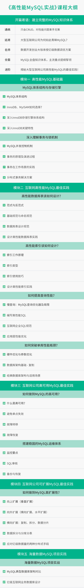

# 高性能MySQL实战

高性能MySQL实战
快速掌握MySQL要领，支撑互联网高并发请求

高性能MySQL实战
快速掌握MySQL要领，支撑互联网高并发请求

# 课程目录

开篇词
开篇寄语：建立完整的MySQL知识体系
模块一：高性能MySQL基础篇
第01讲：MySQL体系结构与存储引擎
第02讲：深入理解事务与锁机制（上）
第02讲：深入理解事务与锁机制（下）
模块二：互联网高性能MySQL最佳实践
第03讲：高性能数据库表该如何设计？
第04讲：高性能索引该如何设计?（上）
第04讲：高性能索引该如何设计?（下）
第05讲：如何提高查询性能？
第06讲：如何突破单库性能瓶颈？
模块三：互联网公司高可用MySQL最佳实践
第07讲：如何做到MySQL的高可用？
第08讲：搭建稳固的MySQL运维体系
模块四：互联网公司可扩展MySQL最佳实践
第09讲：如何做到MySQL高扩展性？
模块五：海量数据MySQL项目实战
第10讲：海量数据MySQL项目实战

# 课程背景

目前国内大部分互联网公司都选择MySQL数据库来支撑自己的业务，且由于互联网常常伴随着海量用户、高并发请求，因此对MySQL的性能、可用性、扩展性都提出了很高的要求。灵活使用MySQL支撑互联网的海量数据和高并发请求已经是互联网开发、运维、DBA的必备技能，也是衡量能力水平和薪资水平的重要标准。

如何快速掌握MySQL数据库的要领，来支撑海量数据和高并发请求呢？我们找到了周彦伟老师，他在数据库开发和运维领域深耕近15年，不仅具备社交、旅游电商互联网公司的数据库管理经验，还自主创业研发出云原生数据库产品ArkDB，为学而思、央视网等多家企业提供提供企业级数据库解决方案。

这门课涵盖MySQL的底层运行机制、如何发挥MySQL的最佳性能、MySQL在互联网应用领域的最佳实践。从架构设计优化、MySQL的高可用、高性能和可扩展性等方面展开详解，最后附上海量数据MySQL实战项目讲解，深入浅出帮你快速建立MySQL全盘要点，带你掌握处理海量业务数据和高并发请求的核心方法。

课程讲师

周彦伟

极数云舟 CEO

从事数据库开发和运维工作近15年，曾担任人人网数据库主管和去哪儿网数据库总监，在数据库的架构设计、性能调优、大规模数据库集群运维等方面积累了丰富的实战经验。
2017年创立极数云舟，现任CEO，致力于企业级云原生数据库ArkDB的产品研发和相关企业级数据库解决方案的架构和实施。
他著有技术畅销书《MySQL运维内参》，另有译著《MySQL 8 Cookbook》中文版。
同时，他还担任Oracle ACE Director，及中国计算机行业协会开源数据库专业委员会会长。

许子文

极数云舟 项目总监

现任极数云舟项目总监，先后就职于达梦数据库、去哪儿网。
在去哪儿网时，负责整个去哪儿网的支付和金融体系数据库架构设计、运维管理和性能优化

学习收获

1、掌握MySQL的底层运行机制

2、掌握如何发挥MySQL的最佳性能

3、掌握如何处理海量业务数据和高并发请求

4、增加在工作和面试中的竞争力

课程大纲

订阅须知

\1. 本专栏已更新完毕，共10讲；

\2. 购买后在拉勾 App-课程，可永久观看课程；

\3. 视频课程为虚拟商品，一旦售出不可申请退款，购买前请慎重考虑；

\4. 本课程版权归拉勾所有，严禁翻录，违者必究；

\5. 如有问题可咨询客服同学，[召唤客服>>>](https://jinshuju.net/f/ngEPnR)

合作机构

极数云舟是中国领先的数据库产品和解决方案提供商。创始团队由多名数据库领域顶尖技术专家组成，深耕数据库运维管理与内核源码研究。产品服务包括企业级云原生数据库ArkDB、数据库云管平台Arkcontrol、数据库中间件Arkproxy、分布式高可用监控系统Arksentinel和实时异构同步系统Arkgate等。曾服务过学而思、央视网等核心客户。

精选留言
**升
right-icon
23
一致性：事务完成之后，事务所做的修改进行持久化保存，不会丢失。

原子性：事务的所有操作，要么全部完成，要么全部不完成，不会结束在某个中间环节。

持久性：事务开始之前和事务结束之后，数据库的完整性限制未被破坏。

隔离性：当多个事务并发访问数据库中的同一数据时，所表现出来的相互关系。

一致性和持久性写反了吧？

编辑回复： 谢谢你的反馈，已调整
**龙
right-icon
16
在外包公司工作了三年，想换到互联网公司挺难的，面试的时候讲到数据库调优这块完全没碰过，只会增删改查，希望通过拉勾这门课程快速掌握MySQL的要领。
leo
right-icon
12
之前有看过周老师的《MySQL运维内参》非常受用。所以看见拉勾有课程就毫不犹豫的学习了。老师从点及面，串起了整个知识网络，还有一些工作中的实例，并不是只是一些底层原理和工具介绍，希望可以多出一些系列课。
**龙
right-icon
4
redo太大了，如果磁盘io很差，可能会导致io进程hang
**荣
right-icon
4
终于学完了整个课程。想着也要写一下自己的感受和成长。受益颇深，从最初的只会增删改查到现在可以说已经初具功力。学完之后我还专门挑了join那个章节做了ppt为团队小伙伴做了分享，得到了小伙伴的一致好评，说比dba的分享都靠谱，听完实在是太开心了。后续我还会再刷第二遍，第二遍就会结合实践深挖，我相信收获会更大，再次感谢老师！
*法
right-icon
2
老师讲的清晰透彻，值得推荐
编辑回复： 感谢童靴的支持~
*伟
right-icon
2
虽然本人是个java开发，但是mysql技术栈也不能落后，本课程提供了一个较好的mysql进阶方向，课程内容也很好，由浅入深且实用。后面的小伙伴们不要犹豫，可以入手了！！
**心
right-icon
1
字符集都为 UTF8mb4，中文存储占三个字节，而数据或字母，则只占一个字节。

utf8mb4是不是占四个字节啊
讲师回复： 没太理解，可以举个例子看看
**友
right-icon
1
这个专栏把mysql讲的很全面，作为java开发也一期不落的看完了。专栏里面的内容好多没有消化，打算二刷
**轩
right-icon
1
老师讲的都是实用性很强的内容，我之前做过Oracle、SQLServer和SAP HANA数据库的DBA，现在想转行MySQL DBA，我觉得这门课真的太值得了，必须10分给老师！
**标
right-icon
1
通过学习感觉已经大概对mysql有个整体的认识了，进一步的深化还需要自己一步步的实践，再看其他的讲解mysql的书也没有那么那么的晦涩难懂了，感谢老师，希望进一步出mysql更为好的课程。
**昌
right-icon
1
学习了课程后，从一知半解的懵懂状态到知识体系逐渐成型，比如表设计和索引设计一直是我的盲点，非常期待后面的分库分表和实战讲解，相信玩转mysql指日可待!
**兴
right-icon
1
工作2年多，都在写边缘的业务，数据量和请求量都不大，有一次做了一个QPS比较大的接口，直接把DB拖死了。以前学校学的数据库和真实公司里用法完全不同，看到这门课果断下单了，看了几节课后收获很大，期待快点更新完~
**琼
right-icon
学习学习
**慧
right-icon
数据库字符集有好多,一般的有什么区别,是分场景还是什么?
**明
right-icon
我都是用一个字段逗号隔开的去查一列数据，并没有使用正则表达式哦，这个反范式是，不正常吗？mysql 中有很多这样的函数啊？
编辑回复： 小编已记录并反馈给讲师，也建议小伙伴加入咱们的学习群，和大家一起讨论。
*健
right-icon
redo太大，万一挂了，恢复就很慢。redo log只有两个check point点
**贝
right-icon
工作几年，对数据库只是浅显的认识和操作，希望买了这门课，能够弥补自己在这方面的不足，完全有信心。
官方客服回复： 谢谢您的支持，学习愉快！
**飞
right-icon
获益良多，对MySQL的底层运作机制有了比较深的认知，周老师果然是MySQL行家。课程里的最佳实践的部分，能够应用到真实的工作场景，非常实用!