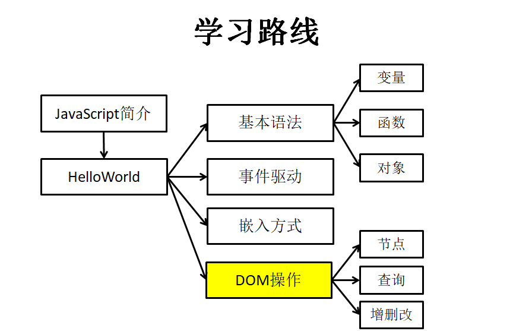
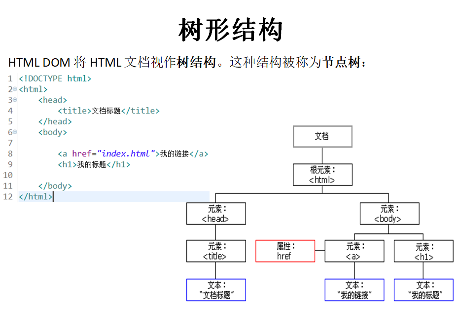

JavaScript



Javascript简介 

N年前
拨号上网，网速很慢，数据提交到服务器端验证，体验很差
于是，就有人在想：能不能让这些数据在浏览器端验证呢？
1995年
由Netscape公司在网景导航者浏览器上首次设计而成。Netscape在最初将其脚本语言命名为LiveScript 。

后来因为Netscape与Sun合作，网景公司管理层希望它外观看起来像Java，因此取名为JavaScript。
JavaScript是一门客户端脚本语言，主要运行在浏览器中，浏览器中负责运行JavaScript脚本代码的程序叫JavaScript引擎。
五彩缤纷的现在
时至今日JavaScript已经不仅仅局限于表单验证，网页上很多炫丽动感的特效都有她的功劳


HelloWorld

```javascript
<!-- JavaScript代码写在Script标签中 -->
<script type="text/javascript">
window.onload = function(){
//获取#btnId对应的元素节点
var btn = document.getElementById("btnId");
//为#btnId绑定单击响应函数
btn.onclick = function(){
//弹出警告框，显示字符串Hello
	   alert("Hello");
}
}
</script>
</head>
<body>
<button id="btnId">SayHello</button>
</body>

```


JavaScript基本语法

在JavaScript中使用变量

* 声明
* 使用

在JavaScript中使用函数

* 声明
* 调用

|                  | **函数** |
| ---------------- | -------- |
| 声明             | 不会执行 |
| 绑定到指定控件上 | 不会执行 |
| 触发事件         | 执行     |

JavaScript嵌入方式

借助HTML标签的事件属性
结构与行为耦合，不推荐
head标签内
无法获取body中的节点
body标签后面
不符合习惯
使用window.onload
完美解决

DOM操作

文档对象模型Document Object Model
DOM定义了访问和处理 HTML 文档的标准方法。是W3C国际组织制定的统一标准，在很多计算机语言中都有不同实现


HTML DOM标准

根据 W3C 的 HTML DOM 标准，HTML 文档中的所有内容都是节点：
整个文档是一个文档节点
每个 HTML 元素是元素节点
HTML 元素内的文本是文本节点
每个 HTML 属性是属性节点
注释是注释节点

DOM节点

节点：Node——构成HTML文档最基本的单元。
节点分为四类
文档节点(Document)：整个HTML文档的相关信息封装后得到的对象。
元素节点(Element)：构成HTML文档最基本的元素，对应HTML文档中的HTML标签
文本节点(Text)：HTML标签中的文本内容
属性节点(Attribute)：元素的属性


属性节点  文本节点 元素节点

树形结构



DOM查询：元素篇


在整个文档范围内查询元素节点
根据id值查询【返回一个具体节点】:  
      document.getElementById(“id值”)
根据标签名查询【返回节点数组】: 
      document.getElementsByTagName(“标签名”)
根据name属性值查询【返回节点数组】: 
      document.getElementsByName(“name值”)
在具体元素节点范围内查找子节点
查找全部子节点【返回节点数组】:
      element.childNodes

查找第一个子节点【返回节点对象】: 
      element.firstChild
查找最后一个子节点【返回节点对象】:
      element.lastChild
查找指定标签名的子节点【返回节点数组】: 
      element.getElementsByTagName(“标签名”)
查找指定元素节点的父节点: 
            element.parentNode
查找指定元素节点的兄弟节点
查找前一个兄弟节点:
      node.previousSibling
查找后一个兄弟节点:
      node.nextSibling


DOM查询：属性篇

读取属性值
元素对象.属性名
修改属性值
元素对象.属性名 = 新的属性值


DOM查询：文本篇

获取文本值三步曲
获取文本节点父节点
获取父节点的第一个子节点
    parentEle.firstChild
获取文本节点的节点值
    parentEle.firstChild.nodeValue

innerHTML

返回对象的起始位置到终止位置的全部内容,包括Html标签。
读取元素内部HTML代码
元素对象.innerHTML
修改元素内部HTML代码
元素对象.innerHTML=HTML代码