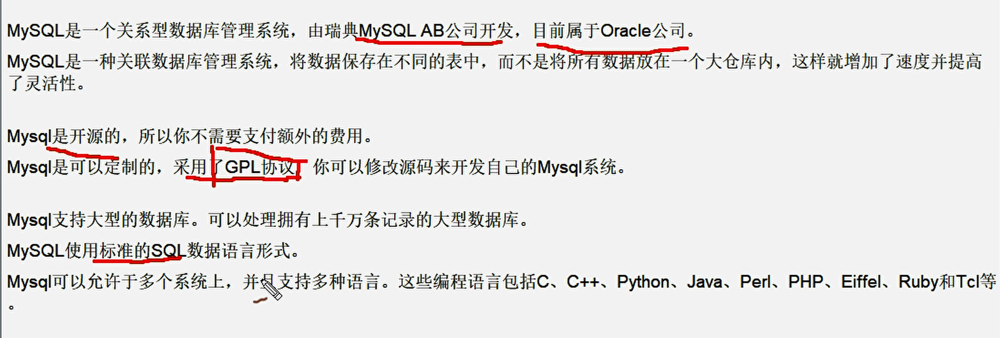

# MySQL简介

 

MySQL是一个关系型数据库管理系统，由瑞典MySQL AB公司开发，目前属于Oracle公司。 
MySQL是一种关联数据库管理系统，将数据保存在不同的表中，而不是将所有数据放在一个大仓库内，这样就增加了速度并提高了灵活性。

Mysql是开源的，所以你不需要支付额外的费用。
Mysql是可以定制的，采用了GPL协议，你可以修改源码来开发自己的Mysql系统。 

Mysql支持大型的数据库。可以处理拥有上千万条记录的大型数据库。
MySQL使用标准的SQL数据语言形式。
Mysql可以允许于多个系统上，并且支持多种语言。这些编程语言包括C、C++、Python、Java、Perl、PHP、Eiffel、Ruby和Tcl等。
MySQL支持大型数据库，支持5000万条记录的数据仓库，32位系统表文件最大可支持4GB，64位系统支持最大的表文件为8TB。

 

Apache 协议  松一点

标准SQL

# Mysql高手是怎样炼成的

数据库内部结构和原理

数据库建模优化

数据库索引建立

SQL语句优化

SQL编程(自定义函数、存储过程、触发器、定时任务)

mysql服务器的安装配置

数据库的性能监控分析与系统优化

各种参数常量设定

主从复制

分布式架构搭建、垂直切割和水平切割

分布式架构搭建、垂直切割和水平切割

数据迁移

容灾备份和恢复

shell或python等脚本语言开发

对开源数据库进行二次开发