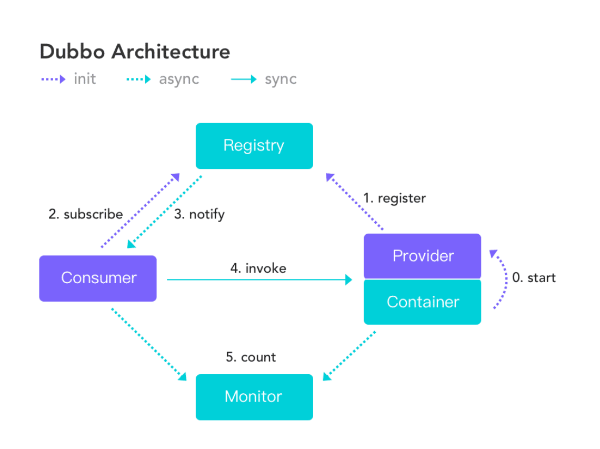

# 服务注册中心Zookeeper

[TOC]

## Zookeeper介绍

服务注册中心Zookeeper




Dubbo架构图，可以看到 Provider 的地址以及配置信息是通过注册中心传递给 Consumer 的,Registry（服务注册中心）在其中起着至关重要的作用。生产环境中， **基本都是用 ZooKeeper 作为注册中心** 。

Zookeeper介绍 

Zookeeper 是 Apache Hadoop 的子项目，是一个树型的目录服务，支持变更推送，适合作为 Dubbo 服务的注册中心，工业强度较高，可用于生产环境，并推荐使用 。

## 安装Zookeeper

安装Zookeeper

下载地址：http://archive.apache.org/dist/zookeeper/

http://archive.apache.org/dist/zookeeper/zookeeper-3.6.1/


下载这个apache-zookeeper-3.6.1-bin.tar.gz 别下错了，

带有bin名称的包才是我们想要的，可以直接使用的，里面有编译后的二进制的包，而普通的tar.gz的包里面是源码的包无法直接使用。

要安装JDK的

```shell
[root@liuawen local]# java -version
java version "1.8.0_121"
Java(TM) SE Runtime Environment (build 1.8.0_121-b13)
Java HotSpot(TM) 64-Bit Server VM (build 25.121-b13, mixed mode)
[root@liuawen local]# 

```

把zookeeper的压缩包apache-zookeeper-3.6.1-bin.tar.gz上传到Linux 系统上

解压zookeeper安装包，使用tar命令：

```shell
tar -zxvf apache-zookeeper-3.6.1-bin.tar.gz
```


```shell
[root@liuawen local]# ls
aegis               apache-zookeeper-3.6.1-bin         bin   etc    git      java  lib    libexec   man    openssl  sbin   src
apache-maven-3.6.3  apache-zookeeper-3.6.1-bin.tar.gz  curl  games  include  jdk   lib64  libiconv  maven  python3  share  zend
[root@liuawen local]# 

```

进入zookeeper文件查看内容

```shell
[root@liuawen local]# ls
aegis               apache-zookeeper-3.6.1-bin         bin   etc    git      java  lib    libexec   man    openssl  sbin   src
apache-maven-3.6.3  apache-zookeeper-3.6.1-bin.tar.gz  curl  games  include  jdk   lib64  libiconv  maven  python3  share  zend
[root@liuawen local]# cd apache-zookeeper-3.6.1-bin
[root@liuawen apache-zookeeper-3.6.1-bin]# pwd
/usr/local/apache-zookeeper-3.6.1-bin
[root@liuawen apache-zookeeper-3.6.1-bin]# ls
bin  conf  data  docs  lib  LICENSE.txt  logs  NOTICE.txt  README.md  README_packaging.md
[root@liuawen apache-zookeeper-3.6.1-bin]# ll
total 48
drwxr-xr-x 2 www  www   4096 Apr 21 22:59 bin
drwxr-xr-x 2 www  www   4096 Aug  1 12:52 conf
drwxr-xr-x 3 root root  4096 Aug  1 12:57 data
drwxr-xr-x 5 www  www   4096 Apr 21 23:00 docs
drwxr-xr-x 2 root root  4096 Aug  1 12:48 lib
-rw-r--r-- 1 www  www  11358 Apr 21 22:59 LICENSE.txt
drwxr-xr-x 2 root root  4096 Aug  1 12:52 logs
-rw-r--r-- 1 www  www    432 Apr 21 22:59 NOTICE.txt
-rw-r--r-- 1 www  www   1963 Apr 21 22:59 README.md
-rw-r--r-- 1 www  www   3166 Apr 21 22:59 README_packaging.md
[root@liuawen apache-zookeeper-3.6.1-bin]# 
```

在zookeeper的解压路径下创建一个新的文件夹 data。存储一些数据

```shell
[root@liuawen apache-zookeeper-3.6.1-bin]# pwd
/usr/local/apache-zookeeper-3.6.1-bin
[root@liuawen apache-zookeeper-3.6.1-bin]# mkdir data
[root@liuawen apache-zookeeper-3.6.1-bin]# ls
bin  conf  data  docs  lib  LICENSE.txt  logs  NOTICE.txt  README.md  README_packaging.md
[root@liuawen apache-zookeeper-3.6.1-bin]# 
```

修改配置文件

进入conf文件夹 将 zoo_sample.cfg 复制一份并命名为 zoo.cfg 

打开zoo.cfg文件,  修改data属性 修改zoo.cfg dataDir

可以通过修改clientPort后面的值，修改zookeeper启动端口，默认为2181。

```shell
[root@liuawen apache-zookeeper-3.6.1-bin]# cd conf/
[root@liuawen conf]# ls
configuration.xsl  log4j.properties  zoo_sample.cfg
[root@liuawen conf]# cp zoo_sample.cfg zoo.cfg
[root@liuawen conf]# vim zoo.cfg 
```


esc :wq 退出来了 

配置修改完  

去启动zookeeper

## 启动、停止Zookeeper

启动zookeeper
在zookeeper目录下的bin目录，使用以下命令启动zookeeper

进入Zookeeper的bin目录，启动服务命令
 ./zkServer.sh start

停止服务命令
./zkServer.sh stop

查看服务状态：
./zkServer.sh status

```shell
[root@liuawen bin]# ls
README.txt    zkCli.cmd  zkEnv.cmd  zkServer.cmd            zkServer.sh            zkSnapShotToolkit.sh  zkTxnLogToolkit.sh
zkCleanup.sh  zkCli.sh   zkEnv.sh   zkServer-initialize.sh  zkSnapShotToolkit.cmd  zkTxnLogToolkit.cmd
[root@liuawen bin]# ./zkServer.sh start
ZooKeeper JMX enabled by default
Using config: /usr/local/apache-zookeeper-3.6.1-bin/bin/../conf/zoo.cfg
Starting zookeeper ... STARTED
[root@liuawen bin]# ./zkServer.sh status
ZooKeeper JMX enabled by default
Using config: /usr/local/apache-zookeeper-3.6.1-bin/bin/../conf/zoo.cfg
Client port found: 2181. Client address: localhost.
Mode: standalone
[root@liuawen bin]# ./zkServer.sh stop
ZooKeeper JMX enabled by default
Using config: /usr/local/apache-zookeeper-3.6.1-bin/bin/../conf/zoo.cfg
Stopping zookeeper ... STOPPED
[root@liuawen bin]# ./zkServer.sh start
ZooKeeper JMX enabled by default
Using config: /usr/local/apache-zookeeper-3.6.1-bin/bin/../conf/zoo.cfg
Starting zookeeper ... STARTED
[root@liuawen bin]# 
```

zkServer.sh zkServer.cmd  

```shell
[root@liuawen bin]# ll
total 64
-rwxr-xr-x 1 www www  232 Apr 21 22:59 README.txt
-rwxr-xr-x 1 www www 2066 Apr 21 22:59 zkCleanup.sh
-rwxr-xr-x 1 www www 1158 Apr 21 22:59 zkCli.cmd
-rwxr-xr-x 1 www www 1620 Apr 21 22:59 zkCli.sh
-rwxr-xr-x 1 www www 1843 Apr 21 22:59 zkEnv.cmd
-rwxr-xr-x 1 www www 3690 Apr 21 22:59 zkEnv.sh
-rwxr-xr-x 1 www www 1286 Apr 21 22:59 zkServer.cmd
-rwxr-xr-x 1 www www 4559 Apr 21 22:59 zkServer-initialize.sh
-rwxr-xr-x 1 www www 9515 Apr 21 22:59 zkServer.sh
-rwxr-xr-x 1 www www  988 Apr 21 22:59 zkSnapShotToolkit.cmd
-rwxr-xr-x 1 www www 1377 Apr 21 22:59 zkSnapShotToolkit.sh
-rwxr-xr-x 1 www www  996 Apr 21 22:59 zkTxnLogToolkit.cmd
-rwxr-xr-x 1 www www 1385 Apr 21 22:59 zkTxnLogToolkit.sh
[root@liuawen bin]# 

```


除此之外，我们也可以通过查看zookeeper的进程来判断其是否启动成功！

ps -ef | grep zookeeper


```shell
[root@liuawen local]# ls
aegis               apache-zookeeper-3.6.1-bin         bin   etc    git      java  lib    libexec   man    openssl  sbin   src
apache-maven-3.6.3  apache-zookeeper-3.6.1-bin.tar.gz  curl  games  include  jdk   lib64  libiconv  maven  python3  share  zend
[root@liuawen local]# cd apache-zookeeper-3.6.1-bin
[root@liuawen apache-zookeeper-3.6.1-bin]# ls
bin  conf  docs  lib  LICENSE.txt  NOTICE.txt  README.md  README_packaging.md
[root@liuawen apache-zookeeper-3.6.1-bin]# cd conf
[root@liuawen conf]# ls
configuration.xsl  log4j.properties  zoo_sample.cfg
[root@liuawen conf]# cp zoo_sample.cfg zoo.cfg
[root@liuawen conf]# vim zoo.cfg 
[root@liuawen conf]# cd ..
[root@liuawen apache-zookeeper-3.6.1-bin]# pwd
/usr/local/apache-zookeeper-3.6.1-bin
[root@liuawen apache-zookeeper-3.6.1-bin]# mkdir data
[root@liuawen apache-zookeeper-3.6.1-bin]# cd bin/
[root@liuawen bin]# ls
README.txt    zkCli.cmd  zkEnv.cmd  zkServer.cmd            zkServer.sh            zkSnapShotToolkit.sh  zkTxnLogToolkit.sh
zkCleanup.sh  zkCli.sh   zkEnv.sh   zkServer-initialize.sh  zkSnapShotToolkit.cmd  zkTxnLogToolkit.cmd
[root@liuawen bin]# ./zkServer.sh start
ZooKeeper JMX enabled by default
Using config: /usr/local/apache-zookeeper-3.6.1-bin/bin/../conf/zoo.cfg
Starting zookeeper ... STARTED
[root@liuawen bin]# ./zkServer.sh status
ZooKeeper JMX enabled by default
Using config: /usr/local/apache-zookeeper-3.6.1-bin/bin/../conf/zoo.cfg
Client port found: 2181. Client address: localhost.
Mode: standalone
[root@liuawen bin]# ./zkServer.sh stop
ZooKeeper JMX enabled by default
Using config: /usr/local/apache-zookeeper-3.6.1-bin/bin/../conf/zoo.cfg
Stopping zookeeper ... STOPPED
[root@liuawen bin]# ./zkServer.sh start
ZooKeeper JMX enabled by default
Using config: /usr/local/apache-zookeeper-3.6.1-bin/bin/../conf/zoo.cfg
Starting zookeeper ... STARTED
[root@liuawen bin]# 
```

