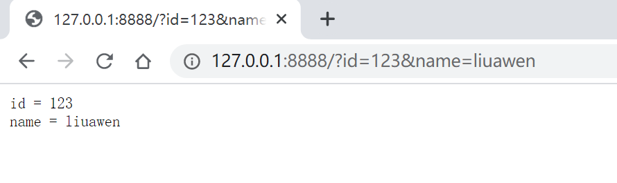
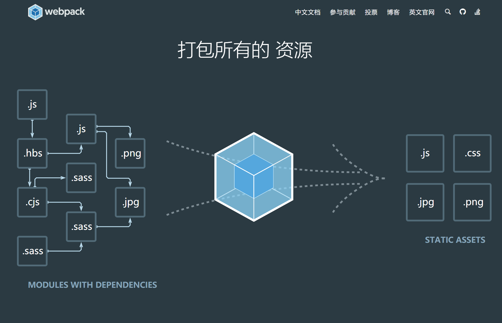
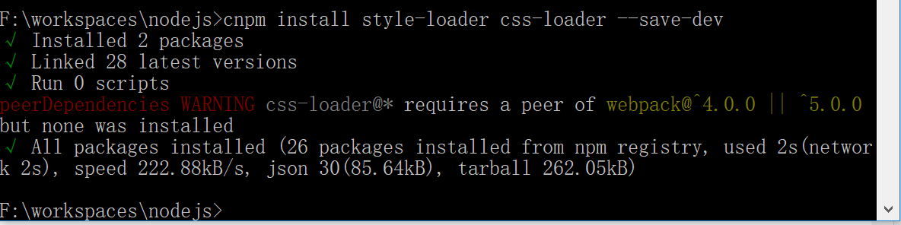

## 1. Nodejs概述

**目标**：Node.js用途；安装Node.js

### 什么是Node.js

简单的说 Node.js 就是运行在服务端的 JavaScript。
Node.js 是一个基于Chrome JavaScript 运行时建立的一个平台。
Node.js是一个事件驱动I/O服务端JavaScript环境，基于Google的V8引擎，V8引擎执行Javascript的速度非常快，性能非常好。

### Node.js安装

下载对应系统的Node.js版本

[https://nodejs.org/en/download/](https://nodejs.org/en/download/)

推荐下载LTS版本

完成以后，在控制台输入：

查看Node版本信息

```
C:\Users\x1c>node -v
v11.9.0

C:\Users\x1c>

```

### 快速入门

如何在控制台输出，创建文本文件demo1.js，代码内容

demo1.js

```javascript
var a=1;
var b=2;
console.log(a+b);
```

在命令提示符下输入命令

```cmd
node demo1.js
```

结果

```cmd
(c) 2018 Microsoft Corporation。保留所有权利。

F:\Learning-Java\PopularFrameworks_Code\Node&ES6\liuawen-nodejs>node demo1.js
3

F:\Learning-Java\PopularFrameworks_Code\Node&ES6\liuawen-nodejs>

```

使用函数

创建文本demo2.js

```javascript
var c=add(100, 200);
console.log(c);
function add(a,b) {
    return a+b;
}
```

命令提示符输入命令

```cmd
node demo2.js
```

运行后看到输出结果为300

```
F:\Learning-Java\PopularFrameworks_Code\Node&ES6\liuawen-nodejs>node demo2.js
300
```


**小结**：

Node.js是一个可以在js中接收和处理web请求的应用平台。

简单的说Node.js就是运行在服务端的JavaScript


## 2. Nodejs模块化编程

**目标**：编写模块文件使用require引入模块后使用node.js执行

每个文件就是一个模块，有自己的作用域。在一个文件里面定义的变量、函数、类，都是私有的，对其他文件不可见。

> 创建文本文件 demo3_1.js

```javascript
exports.add = function (a, b) {
    return a + b;
}
exports.sub = function (a, b) {
    return a - b;
}
```


每个模块内部，module变量代表当前模块。这个变量是一个对象，它的exports属性（即module.exports）是对外的接口。加载某个模块，其实是加载该模块的module.exports属性。

创建文本文件demo3_2.js

```javascript
//引入模块demo3_1
var demo = require("./demo3_1")
console.log(demo.add(400, 600));
console.log(demo.sub(400, 600));
```

在命令提示符下输入命令

```cmd
node demo3_2.js
```

结果为

```cmd
F:\Learning-Java\PopularFrameworks_Code\Node&ES6\liuawen-nodejs>node demo3_2.js
1000
-200

F:\Learning-Java\PopularFrameworks_Code\Node&ES6\liuawen-nodejs>

```


**小结**：

可以使用exports将js方法导出，并使用require引入对应的js模块，然后再引入之后可以使用对应的方法。

js 文件 导出 引入 

## 3. 创建Nodejs Web服务器

**目标**：引入http模块监听8888端口实现输出字符

创建文本文件demo4.js

```javascript
// 引入node.js内置http模块
// var http = require("http")

//http是内置模块
var http = require('http');
http.createServer(function (request, response) {
// 发送 HTTP 头部
// HTTP 状态值: 200 : OK
// 内容类型: text/plain
    response.writeHead(200, {'Content-Type': 'text/plain'});
// 发送响应数据 "Hello World"
    response.end('Hello World\n');
}).listen(8888);
// 终端打印如下信息
console.log('Server running at http://127.0.0.1:8888/');

```


http为node内置的web模块

在命令提示符下输入命令

```bash
node demo4.js
```


```bash
F:\Learning-Java\PopularFrameworks_Code\Node&ES6\liuawen-nodejs>node demo4.js
Server running at http://127.0.0.1:8888/

```


服务启动后，我们打开浏览器，输入网址

http://127.0.0.1:8888/


即可看到网页输出结果Hello World

在命令行中按 `Ctrl+c `终止运行。

```bash
F:\Learning-Java\PopularFrameworks_Code\Node&ES6\liuawen-nodejs>node demo4.js
Server running at http://127.0.0.1:8888/
^C
F:\Learning-Java\PopularFrameworks_Code\Node&ES6\liuawen-nodejs>

```


**小结**：

可以利用node.js创建web服务器：

```js
//引入node.js内置http模块
var http = require("http");

//创建并监听web服务器
http.createServer(function (request, response) {

    //发送http头部
    //参数1：响应状态码，200表示成功
    //参数2：响应头部信息，Content-Type内容类型：纯文本
    response.writeHead(200, {"Content-Type": "text/plain"});

    //发送响应数据
    response.end("Hello World \n");
}).listen(8888);
console.log("服务器运行在 http://127.0.0.1:8888 ");
```


理解服务端渲染

创建demo5.js ，将上边的例子写成循环的形式

```javascript
var http = require('http');
http.createServer(function (request, response) {
// 发送 HTTP 头部
// HTTP 状态值: 200 : OK
// 内容类型: text/plain
response.writeHead(200, {'Content-Type': 'text/plain'});
// 发送响应数据 "Hello World"
for(var i=0;i<10;i++){
response.write('Hello World\n');
}
response.end('');
}).listen(8888);
// 终端打印如下信息
console.log('Server running at http://127.0.0.1:8888/');
```

在命令提示符下输入命令启动服务

```bash
node demo5.js
```

浏览器地址栏输入http://127.0.0.1:8888即可看到查询结果。

```bash
Hello World
Hello World
Hello World
Hello World
Hello World
Hello World
Hello World
Hello World
Hello World
Hello World
```


右键“查看源代码”发现，并没有我们写的for循环语句，而是直接的10条Hello World ，这就说明这个循环是在服务端完成的，而非浏览器（客户端）来完成。这与JSP很是相似。


## 4. 处理Nodejs Web请求参数

**目标**：引入http和url模块创建web容器并使用url解析请求路径中参数且输出


**分析**：

需求：http://127.0.0.1:8888?id=123&name=liuawen 获取到请求路径中参数及值并输出

实现步骤：

1. 创建web服务器；
2. 引入url模块；
3. 利用url解析请求地址中的参数和值并输出
4. 启动测试；

创建demo6.js

```javascript
//引入http模块
var http = require("http");
var url = require("url");
//创建服务，监听8888端口
http.createServer(function (request, response) {
    //发送http头部
    //http响应状态200
    //http响应内容类型为text/plain
    response.writeHead(200, {"Content-Type": "text/plain"});

    //解析参数
    //参数1：请求地址；
    //参数2：true时query解析参数为一个对象，默认false
    var params = url.parse(request.url, true).query;
    //将所有请求参数输出
    for (var key in params) {
        response.write(key + " = " + params[key]);
        response.write("\n");
    }
    response.end("");
}).listen(8888);
console.log("Server running at http://127.0.0.1:8888 ")

```


在命令提示符下输入命令

```bash
node demo6.js
```

在浏览器访问 http://127.0.0.1:8888?id=123&name=liuawen 测试结果：




```bash
F:\Learning-Java\PopularFrameworks_Code\Node&ES6\liuawen-nodejs>node demo6.js
Server running at http://127.0.0.1:8888
^C
F:\Learning-Java\PopularFrameworks_Code\Node&ES6\liuawen-nodejs>

```


**小结**：

在node.js中可以引入url内置模块对请求地址进行处理：

```js
//引入node.js内置http模块
var http = require("http");
var url = require("url");

//创建并监听web服务器
http.createServer(function (request, response) {

    //发送http头部
    //参数1：响应状态码，200表示成功
    //参数2：响应头部信息，Content-Type内容类型：纯文本
    response.writeHead(200, {"Content-Type": "text/plain"});

    //解析请求地址
    //参数1：请求地址
    //参数2：true的话使用query解析参数到一个对象，默认false
    var params = url.parse(request.url, true).query;
    for(var key in params){
        response.write( key + " = " + params[key]);
        response.write("\n");
    }

    //发送响应数据
    response.end("");
}).listen(8888);
console.log("服务器运行在 http://127.0.0.1:8888 ");
```


## 5. 包资源管理器NPM


### 什么是NPM

npm全称Node Package Manager，是node包管理和分发工具。可以理解为Maven跟Maven差不多的功能管理依赖。

通过npm 可以很方便地下载js库，管理前端工程。

现在的node.js已经集成了npm工具，在命令提示符输入 npm -v 可查看当前npm版本

```bash
C:\Users\x1c>npm -v
6.5.0

C:\Users\x1c>node -v
v11.9.0

C:\Users\x1c>
```

### NPM命令

初始化工程

init命令是工程初始化命令。

建立一个空文件夹或者直接在工程中，在命令提示符进入该文件夹 

执行命令初始化

```bash
npm init
```


按照提示输入相关信息，如果是用默认值则直接回车即可。
name: 项目名称
version: 项目版本号
description: 项目描述
keywords: {Array}关键词，便于用户搜索到我们的项目
最后会生成package.json 文件，这个是包的配置文件，相当于maven的pom.xml
之后也可以根据需要进行修改。


package.json

```json
{
  "name": "nodejs",
  "version": "1.0.0",
  "description": "",
  "main": "index.js",
  "scripts": {
    "test": "echo \"Error: no test specified\" && exit 1"
  },
  "author": "",
  "license": "ISC"
}

```

### 本地安 装

install命令用于安装某个模块，可以通过require引入到项目中使用。如我们想安装express模块（node的web框架），输出命令如下：

```bash
npm install express
```

管理员身份打开


出现警告信息，可以忽略，请放心，你已经成功执行了该命令。
在该目录下已经出现了一个node_modules文件夹 和package-lock.json
node_modules文件夹用于存放下载的js库（相当于maven的本地仓库）
package-lock.json是当 node_modules 或 package.json 发生变化时自动生成的文件。这个文件主要功能是确定当前安装的包的依赖，以便后续重新安装的时候生成相同的依赖，而忽略项目开发过程中有些依赖已经发生的更新（可
能存在切换了不同的镜像源后，同一个大版本号下可能出现兼容问题，package-lock可以保证即使换了源，下载的文件和原来的可以保持一致）。
我们再打开package.json文件，发现刚才下载的express已经添加到依赖列表中了。


关于版本号定义：

```
指定版本：比如1.2.2，遵循“大版本.次要版本.小版本”的格式规定，安装时只安装指定版本。
波浪号（tilde）+指定版本：比如~1.2.2，表示安装1.2.x的最新版本（不低于1.2.2），但是不安装1.3.x，也就是说安装时不改变大版本号和次要版本号。

插入号（caret）+指定版本：比如ˆ1.2.2，表示安装1.x.x的最新版本（不低于1.2.2），但是不安装2.x.x，也就是说安装时不改变大版本号。需要注意的是，如果大版本号为0，则插入号的行为与波浪号相同，这是因为此时处于开发阶段，即使是次要版本号变动，也可能带来程序的不兼容。

latest：安装最新版本。
```

### 全局安装

刚才使用的是本地安装，会将js库安装在当前目录，而使用全局安装会将库安装到我的全局目录下。全局安装之后可以在 命令行 使用该安装的模块对应的内容或命令。
如果不知道自己的全局目录在哪里，执行命令查看全局目录路径

```bash
npm root -g
```

默认全局目录在
C:\Users\Administrator\AppData\Roaming\npm\node_modules

我是配置了的 在这里

```
F:\workspaces\nodejs>npm root -g
D:\Environments\nodejs\node_global\node_modules

F:\workspaces\nodejs>
```


比如全局安装jquery， 输入以下命令

```bash
# 安装之后在全局目录下会存在对应的jquery目录，其里面的dist则包含有对应的jquery.js文件
npm install jquery -g
```


npm是一个node.js的管理和分发工具，可以根据配置package.json下载js库。

- 本地安装：将下载的模块安装到当前目录（项目）；
- 全局安装：将下载的模块安装到全局的目录（ `npm root -g` ）


### 批量下载

从网上下载某些代码，发现只有package.json，没有node_modules文件夹，这时需要通过命令重新下载这些js库.
进入目录（package.json所在的目录）输入命令

```bash
npm install
```

此时，npm会自动下载package.json中依赖的js库。

package.json

pom.xml

### 切换NPM镜像

有时我们使用npm下载资源会很慢，所以可以切换下载的镜像源（如：淘宝镜像）；或者安装一个cnmp(指定淘宝镜
像)来加快下载速度。

1、如果使用切换镜像源的方式，可以使用一个工具：nrm
首先安装nrm，这里-g 代表全局安装

```bash
# 管理员身份 打开cmd执行如下命令
npm install nrm -g
```

然后通过nrm ls 命令查看npm的仓库列表,带*的就是当前选中的镜像仓库：


通过nrm use taobao 来指定要使用的镜像源：

```bash
nrm use taobao
```


2、如果使用cnpm的方式，则先安装cnpm，输入如下命令

```bash
# 如果不使用nrm 切换，可以在安装cnpm的时候指定镜像仓库
npm install -g cnpm --registry=https://registry.npm.taobao.org
```

安装后，我们可以使用以下命令来查看cnpm的版本

```bash
cnpm -v
```

使用cnpm

```
cnpm install 需要下载的js库；一般只有在下载模块的时候才使用cnpm，其它情况还是一样使用npm;
```

### 运行工程说明

如果我们想运行某个工程，则使用run命令
如果package.json中定义的脚本中有：
dev是开发阶段测试运行
build是构建编译工程
lint 是运行js代码检测
运行时命令格式：

```bash
npm run dev或者build或者lint
```

### 编译工程说明

编译后的代码会放在dist文件夹中，进入命令提示符输入命令

```bash
npm run build
```

生成后会发现只有个静态页面，和一个static文件夹
这种工程我们称之为单页Web应用（single page web application，SPA），就是只有一张Web页面的应用，是加载单个HTML 页面并在用户与应用程序交互时动态更新该页面的Web应用程序。
这里其实是调用了webpack来实现打包的，关于webpack下面的章节将进行介绍。

包资源管理器NPM

**目标**：说出npm的作用；区别本地安装和全局安装

**小结**：

npm是一个node.js的管理和分发工具，可以根据配置package.json下载js库。

- 本地安装：将下载的模块安装到当前目录（项目）；
- 全局安装：将下载的模块安装到全局的目录（ `npm root -g` ）

切换NPM镜像

**目标**：安装nrm组件将npm的镜像切换为淘宝镜像

**小结**：

- 使用nrm 切换镜像源

```sh
npm install nrm -g

nrm use taobao
```


- 使用cnpm下载

```sh
npm install -g cnpm --registry=https://registry.npm.taobao.org

cnpm install **
```


## 6. 切换NPM镜像

**目标**：安装nrm组件将npm的镜像切换为淘宝镜像

**小结**：

- 使用nrm 切换镜像源

```sh
npm install nrm -g

nrm use taobao
```


- 使用cnpm下载

```sh
npm install -g cnpm --registry=https://registry.npm.taobao.org

cnpm install **
```


## 7. webpack概述

### 什么是Webpack

Webpack 是一个前端资源加载/打包工具。它将根据模块的依赖关系进行静态分析，然后将这些模块按照指定的规则生成对应的静态资源。webpackjs

[https://www.webpackjs.com/](https://www.webpackjs.com/)



从图中我们可以看出，Webpack 可以将多种静态资源 js、css等转换成一个静态文件，减少了页面的请求。 接下来简单为大家介绍 Webpack 的安装与使用。

### Webpack安装

全局安装

```
npm install webpack -g
npm install webpack-cli -g
```


如果安装失败；则将全局目录下的webpack的相关文件夹删除再执行上述命令

安装后查看版本号

```
webpack -v 
```


```
F:\workspaces\nodejs>npm install webpack -g
npm WARN deprecated chokidar@2.1.8: Chokidar 2 will break on node v14+. Upgrade to chokidar 3 with 15x less dependencies.
D:\Environments\nodejs\node_global\webpack -> D:\Environments\nodejs\node_global\node_modules\webpack\bin\webpack.js
npm WARN optional SKIPPING OPTIONAL DEPENDENCY: fsevents@1.2.13 (node_modules\webpack\node_modules\watchpack-chokidar2\node_modules\fsevents):
npm WARN notsup SKIPPING OPTIONAL DEPENDENCY: Unsupported platform for fsevents@1.2.13: wanted {"os":"darwin","arch":"any"} (current: {"os":"win32","arch":"x64"})
npm WARN optional SKIPPING OPTIONAL DEPENDENCY: fsevents@2.1.3 (node_modules\webpack\node_modules\fsevents):
npm WARN notsup SKIPPING OPTIONAL DEPENDENCY: Unsupported platform for fsevents@2.1.3: wanted {"os":"darwin","arch":"any"} (current: {"os":"win32","arch":"x64"})

+ webpack@4.43.0
added 343 packages from 200 contributors in 33.402s

F:\workspaces\nodejs>npm install webpack-cli -g
D:\Environments\nodejs\node_global\webpack-cli -> D:\Environments\nodejs\node_global\node_modules\webpack-cli\bin\cli.js
npm WARN webpack-cli@3.3.12 requires a peer of webpack@4.x.x but none is installed. You must install peer dependencies yourself.

+ webpack-cli@3.3.12
added 185 packages from 127 contributors in 14.116s

F:\workspaces\nodejs>webpack -v
4.43.0

F:\workspaces\nodejs>
```

### 快速入门

#### JS打包

（1）创建src文件夹，创建bar.js

```javascript
exports.info = function (str) {
    document.write(str);
}
```


（2）src下创建logic.js

```javascript
exports.add = function (a, b) {
    return a + b;
}
```


（3）src下创建main.js

```javascript
var bar = require("./bar")
var login = require("./login")
bar.info("100+200=" + login.add(100, 200));
bar.info("webpack")
```


（4）创建配置文件webpack.config.js ，该文件与src处于同级目录

```javascript
var path = require("path");
//exports 就是 module.exports，
// 但是这里直接是赋值，所以不能直接使用exports，否则exports就不是module.exports了
module.exports = {
//入口文件
    entry: "./src/main.js",
    output: {
//__dirname 是node的一个全局变量，获得当前文件所在目录的完整目录名
        path: path.resolve(__dirname, "./dist"),
        filename: "bundle.js"
    }
}
```


以上代码的意思是：读取当前目录下src文件夹中的main.js（入口文件）内容，把对应的js文件打包，打包后的文件放入当前目录的dist文件夹下，打包后的js文件名为bundle.js

（5）执行编译命令

```
webpack
```

执行后查看bundle.js 会发现里面包含了上面两个js文件的内容


浏览器上访问index.html文件，会发现有内容输出。


#### CSS打包

（1）安装style-loader和 css-loader
Webpack 本身只能处理 JavaScript 模块，如果要处理其他类型的文件，就需要使用 loader 进行转换。

Loader 可以理解为是模块和资源的转换器，它本身是一个函数，接受源文件作为参数，返回转换的结果。这样，我们就可以通过 require 来加载任何类型的模块或文件，比如 CoffeeScript、 JSX、 LESS 或图片。首先我们需要安装相关Loader插件，css-loader 是将 css 装载到 javascript；style-loader 是让 javascript 认识css

```sh
cnpm install style-loader css-loader --save-dev
```



> -save 的意思是将模块安装到项目目录下，并在package文件的dependencies节点写入依赖。运行npm install --production或者注明NODE_ENV变量值为production时，会自动下载模块到node_modules目录中。
> -save-dev 的意思是将模块安装到项目目录下，并在package文件的devDependencies节点写入依赖。运行npm install --production或者注明NODE_ENV变量值为production时，不会自动下载模块到node_modules目录中。


```sh
cnpm install less less-loader --save-dev
```


（2）修改webpack.config.js

```javascript
var path = require("path");
//exports 就是 module.exports，
// 但是这里直接是赋值，所以不能直接使用exports，否则exports就不是module.exports了
module.exports = {
//入口文件
    entry: "./src/main.js",
    output: {
//__dirname 是node的一个全局变量，获得当前文件所在目录的完整目录名
        path: path.resolve(__dirname, "./dist"),
        filename: "bundle.js"
    },
    module: {
        rules: [
            {
                test: /\.css$/,
                use: ["style-loader", "css-loader"]
            }
        ]
    }
}
```


（3）在src文件夹创建css文件夹,css文件夹下创建css1.css

```css
body{
    background-color:bisque;
}
```


（4）修改main.js ，引入css1.css

```
require('./css/css1.css');
```


（5）重新运行webpack

```sh
webpack
```


（6）运行index.html看看背景是不是变


编写代码

**src/index.js**

```js
import bar from './bar';

bar();
```

**src/bar.js**

```js
export default function bar() {
  //
}
```

使用 webpack 打包

**[Without config](https://youtu.be/3Nv9muOkb6k?t=21293)** or provide custom **webpack.config.js**

```js
const path = require('path');

module.exports = {
  entry: './src/index.js',
  output: {
      path: path.resolve(__dirname, 'dist'),
    filename: 'bundle.js'
  }
};
```

**page.html**

```html
<!doctype html>
<html>
  <head>
    ...
  </head>
  <body>
    ...
    <script src="dist/bundle.js"></script>
  </body>
</html>
```

然后在命令行运行 `webpack` 就会创建 `bundle.js`。

 让一切变得简单


**目标**：webpack的作用是什么并安装webpack

**小结**：

webpack作用：可以将多个静态资源js、css等打包成一个js文件。

安装命令如下：

```sh
npm install webpack -g
npm install webpack-cli -g
```


## 8. webpack打包js

**目标**：创建2个js文件，使用webpack命令打包js文件到 `dist/bundle.js` 文件中并测试。

**分析**：

实现步骤：

1. 创建2个js文件；
2. 创建入口文件main.js；
3. 创建webpack的配置文件；
4. 运行webpack命令；
5. 创建index.html页面进行测试

**小结**：

webpack打包js的配置文件：

```js
var path = require("path");

module.exports = {
    //入口文件
    entry: "./src/main.js",
    output: {
        //路径
        path: path.resolve(__dirname, "./dist"),
        filename: "bundle.js"
    }
}
```

> webpack可以将多个js文件打包成一个js

## 9. webpack打包css

**目标**：安装style-loader css-loader组件，创建并使用css文件，使用webpack命令打包js文件到 `dist/bundle.js` 文件中并测试。

**分析**：

实现步骤：

1. 安装转换css的组件；
2. 修改配置文件；
3. 创建css文件；
4. 修改入口文件，加载css文件；
5. 打包并测试

**小结**：

webpack打包css文件需要安装转换的组件，并修改配置文件：

```js
var path = require("path");

module.exports = {
    //入口文件
    entry: "./src/main.js",
    output: {
        //路径
        path: path.resolve(__dirname, "./dist"),
        filename: "bundle.js"
    },
    module: {
        rules: [
            {
                test: /\.css$/,
                use: ["style-loader", "css-loader"]
            }
        ]
    }
}
```


## 10. ES6概述&创建测试工程


**目标**：了解es6应用场景；创建测试工程

**小结**：

ECMAScript是前端js的语法规范；可以应用在各种js环境中。如：浏览器或者node.js环境。

它有很多版本：es1/2/3/5/6，很多新特性，可以在js环境中使用这些新特性。

## 11. let和const命令及模板字符串


**目标**：使用let和const定义变量说出区别；模板字符串的好处以及对象初始化简写

**小结**：

- let所声明的变量只能在let命令所在的代码块中使用
- const声明的变量是常量，也就是值不可以改变
- 模板字符串：可以不用通过反斜杠拼接多行字符，直接使用`
- 对象初始化简化：可以在返回的对象时，不用指定属性名。

## 12. 解构表达式

**目标**：将数组、对象中的值或属性使用解构表达式设置到对应变量

**小结**：

解构表达式：可以对数组、对象的元素或者属性按顺序、名称的方式进行赋值到对应变量中。

## 13. 函数优化

**目标**：箭头函数的好处；对象的函数属性简写，箭头函数与解构表达式的应用

**小结**：

箭头函数：可以不用编写基础函数的解构（如：function），直接使用 `=>` 

```js
        var print = function (obj) {
            console.log(obj);
        };
        print("print");
        //箭头函数
        var print2 = obj => console.log(obj);
        print2("print2");

        var sum = function (a, b) {
            return a+b;
        };
        console.log(sum(1,2));

        //箭头函数
        var sum2 = (a,b) => a+b;
        console.log(sum2(1,2));

        var sum3 = (a,b) => {
            console.log(a+b);
            return a+b;
        };
        console.log(sum3(1,2));

        let person = {
            "name": "heima",
            learn1: function (course="java") {
                console.log(this.name + " 在学习 " + course);
            },
            //箭头函数；不能使用this
            learn2: (course) => console.log(person.name + " 在学习 " + course),
            //简写
            learn3(course){
                console.log(this.name + " 在学习 " + course);
            }
        };
        person.learn1("java");
        person.learn2("js");
        person.learn3("css");

        const person = {
            name:"heima",
            age:13,
            language:["java","js","css"]
        };
         function hello(person) {
             console.log("hello " + person.name);
         }
         hello(person);

         //箭头函数、解构表达式
        var hello2 = ({name}) => console.log("hello2 " + name);
        hello2(person);

```


## 14. map方法使用

**目标**：数组中map方法的应用场景

**小结**：

map方法可以将原数组中的所有元素通过一个函数进行处理并放入到一个新数组中并返回该新数组。

## 15. reduce方法使用

**目标**：数组中reduce方法的应用场景

**小结**：

reduce方法会从左到右依次把数组中的元素用函数处理（reduce方法的第一个参数），会返回一个执行结果。

> let arr = [1, 2, 3]
>
> arr.reduce((a,b)=>a+b)
>
> 第1次：(1,2) => 1+2
>
> 第2次：(3, 3) => 3+3  --------》 6

## 16. promise应用示例

**目标**：promise的应用场景及示例

**小结**：

promise是一个对象，保存着预期事件执行的结果；可以应用在异步操作时候，指定异步操作的成功与失败的结果。

```js
        const promise = new Promise(function (resolve, reject) {
            setTimeout(()=>{
                let num = Math.random();
                if(num < 0.5){
                    resolve("操作成功！num=" + num);
                } else {
                    reject("操作失败！num=" + num);
                }
            },300);
        });

        promise.then(function (msg) {
            console.log(msg);
        }).catch(function (msg) {
            console.log(msg);
        });

```


## 17. 对象的扩展方法使用

**目标**：Object对象中的keys/values/assign的作用

**小结**：

Object的方法：

- keys：获取对象的属性名
- values：获取对象的属性值
- entries：获取对象的属性和属性值
- assign：可以将对象进行拷贝

## 18. 数组的扩展方法使用

**目标**：数组中的find/findIndex/includes的作用

**小结**：

数组的扩展方法：

- find：根据函数条件查找数组中符合条件的元素
- findIndex：与find类似，返回的不是元素而是元素对应的索引号
- includes：判断指定的元素是否存在

## 19. 安装babel

**目标**：安装babel及了解babel的作用

**小结**：

babel是一个javaScript语法编译器，可以将es6的语法进行转换并执行。

需要安装babel：

```sh
cnpm install babel-preset-es2015 --save-dev 
cnpm install babel-cli -g
```

编写.babelrc文件，指定es的版本

可以通过命令去执行对应的js文件：babel-node

## 20. export和import联合应用

**目标**：export和import的联合应用场景；使用export导出模板文件，import引入模板文件

**小结**：

可以通过export导出模块，通过import导入模块并使用其内容。

导出有两种方式：命名导出和默认导出。

因为浏览器默认不支持export和import命令，所以需要安装babel对export和import进行解析和执行。

