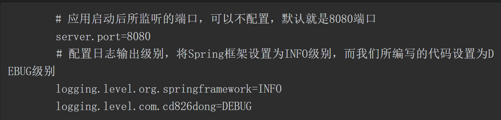
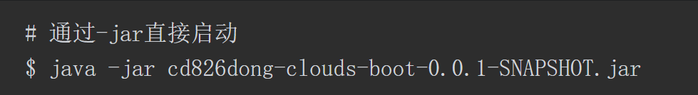

# Spring与SpringBoot

在开发时我们常用的启动器有以下几个：·spring-boot-starter-web, Web应用开发。·spring-boot-starter-logging，日志处理；·spring-boot-starter-jpa，数据存储管理；·spring-boot-starter-security，安全管理；·spring-boot-starter-actuator，应用监控；·spring-boot-srarter-data-redis, Redis数据库集成；·spring-boot-starter-amqp，消息中间件集成。

spring-boot-starter 启动器简化项目的依赖 

在接下来的几节中我们将进行如下操作：（1）使用Spring Boot快速构建一个最基础的应用框架，并且使用Maven脚本来管理和构建。（2）在该应用框架基础上构建一个三层应用架构的电子商城应用示例。这个示例又可以分为以下几个步骤来完成：① 通过分析电子商城需求设计出我们的业务实体对象。② 基于Spring Data JPA完成数据的存储处理，并创建数据库初始化脚本。③ 完成业务逻辑的设计与开发。④ 采用REST完成对外API的开发，这样可以通过多种方式访问到应用功能。（3）完成整个应用并打包运行示例项目。

使用

基于SpringBoot框架一步步快速构建出各个微服务应用

#  快速启动SpringBoot

## 编写pom.xml文件

## 编写应用引导类

调用SpringApplication启动一个SpringBoot应用

SpringApplication.run(Application.class,args) 

@SpringBootApplication注解告诉Spring容器：使用该类作为所有Bean源，通过该起始点构建应用的上下文。@SpringBootApplication注解继承自@EnableAutoConfiguration和@ComponentScan，通过该注解使得项目在启动时Spring就会对该类所属目录下的所有子包进行扫描并根据Spring Boot的自动配置机制进行配置。

@ComponentScan("`cn.liuawen.**,cn.liuawen.**`")

扫描多个包  逗号  , 

Application类的main()方法调用了SpringApplication.run()，该方法会在项目启动时构建一个Spring容器，并返回一个ApplicationContext对象，也就是项目应用的上下文。对于ApplicationContext重要性，使用过Spring开发的读者都应该明白，但在这里因为不需要该对象做后续任何处理，所以没有列出来。因此，在后续使用Spring Boot进行微服务应用开发时，一定要记得在引导类中添加@SpringBootApplication注解。对于引导类的类名，可以不是Application，读者可以根据项目实际需要进行改动。还有一点需要说明的是，对于引导类来说其是整个应用启动的初始点，因此，如果在应用启动时需要进行某些初始化处理，那么最好都在该类中完成。

构建一个Spring容器 返回一个ApplicationContext对象

项目应用的上下文 

## 编写配置文件

一个或多个配置文件

application

properties yml

resources

## 运行项目

更多的时候是打包成一个部署单元。在打包时就会使用之前我们在Maven脚本中所配置的spring-boot-maven-plugin插件，然后通过mvn clean package命令将项目打包成一个Fat Jar，在生产环境下可以直接使用下面的命令启动运行：

应用成功启动

那么什么是Fat Jar呢？从字面意义上可以理解为胖Jar，也就是通过Maven打包所生成的这种Jar不仅仅包含本项目中源码所编译生成的Java类文件，还会包含项目所依赖的第三方库及有关项目启动的相关信息。比如，如果我们通过解压缩工具查看上面示例项目打包所生成的cd826dong-clouds-boot-0.0.1-SNAPSHOT.jar文件，可以看到在文件中会包含以下3个内容。·项目代码：项目中所有源码经编译后会统一存放在BOOT-INF/classes目录下。·项目依赖包：存放在BOOT-INF/lib目录下。·应用启动相关文件：在org/springframework/boot/loader目录下则包含了Spring Boot启动时所需要的类。

还有一点需要说明的是，在本示例项目中我们只构建了一个简单的Java类，并通过该类中的main()函数启动运行，并没有在打包之后将文件部署到任何Web容器中进行运行。那么示例项目为何就可以作为一个Web应用启动了呢？Spring Boot又到底施展了什么“魔法”呢？如果仔细查看项目所依赖的包就会发现spring-boot-starter-web默认依赖了spring-boot-starter-tomcat，通过该依赖，Spring Boot在启动应用时就会启动一个内嵌的Tomcat容器，并在该容器中运行项目。如果不想使用Tomcat作为启动容器，而是使用Jetty，那么可以在pom.xml文件中排除对Tomcat的依赖，并增加spring-boot-starter-jetty即可。

# 使用Spring Boot构建示例项目

## 经典三层应用架构

