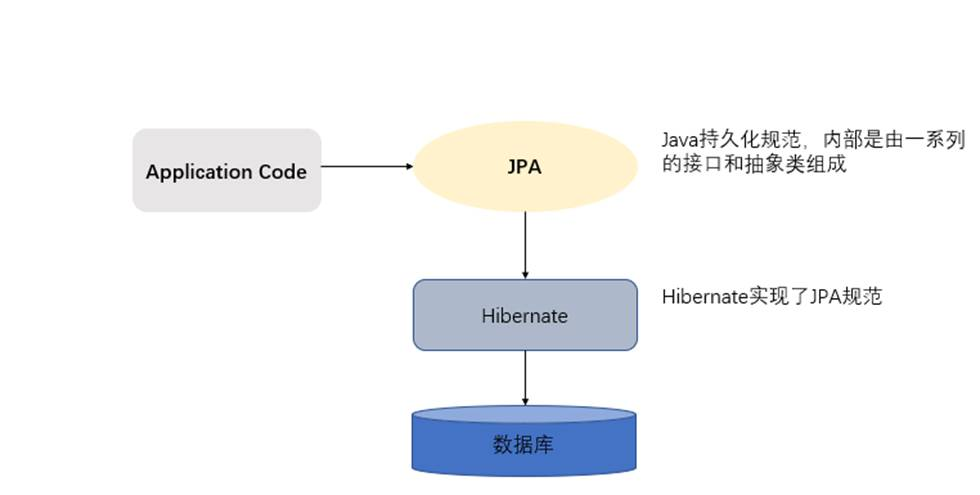
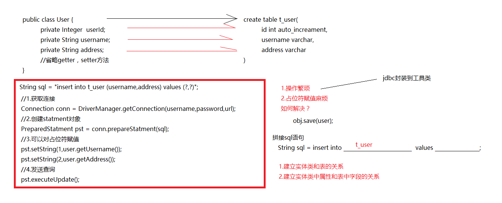

# ORM思想和Hibernate以及jpa的概述

[TOC]


# 1、ORM概述

ORM（Object-Relational Mapping） 表示对象关系映射。

在面向对象的软件开发中，通过ORM，就可以把对象映射到关系型数据库中。

只要有一套程序能够做到建立对象与数据库的关联，操作对象就可以直接操作数据库数据，就可以说这套程序实现了ORM对象关系映射。

简单的说：ORM就是建立实体类和数据库表之间的关系，从而达到操作实体类就相当于操作数据库表的目的。


ORM表示对象关系映射（Object-Relational Mapping）   

对象映射到关系型数据库中

操作对象就可以直接操作数据库数据   

ORM就是建立实体类和数据库表之间的关系 从而达到操作实体类就相当于操作数据库表的目的。

## 1.1  为什么使用ORM

当实现一个应用程序时（不使用O/R Mapping），我们可能会写特别多数据访问层的代码，从数据库保存数据、修改数据、删除数据，而这些代码都是重复的。而使用ORM则会大大减少重复性代码。对象关系映射（Object Relational Mapping，简称ORM），主要实现程序对象到关系数据库数据的映射。


数据访问层的代码    代码重复的    使用ORM大大减少重复性代码  

ORM  实现程序对象到关系数据库数据的映射。

## 1.2  常见ORM框架

常见的orm框架：Mybatis（ibatis）、Hibernate、Jpa。

Mybatis简介

在[MyBatis官网](http://www.mybatis.org/mybatis-3/index.html)（官网地址：http://www.mybatis.org/mybatis-3/index.html）上是这样介绍MyBatis的：MyBatis是一款优秀的持久层框架，它支持定制化自定义SQL、存储过程以及高级映射。MyBatis避免了几乎所有的JDBC代码和手动设置参数以及获取结果集。MyBatis可以使用简单的XML或注解来配置和映射原生信息，将接口和Java的POJOs（Plain Old Java Objects，普通的Java对象）映射成数据库中的记录。

MyBatis的优点是：
可以手写SQL，比较灵活。MyBatis上手更加容易，没有什么学习成本，SQL优化更加方便。

hibernate概述

Hibernate是一个开放源代码的对象关系映射框架，它对JDBC进行了非常轻量级的对象封装，它将POJO与数据库表建立映射关系，是一个全自动的orm框架，hibernate可以自动生成SQL语句，自动执行，使得Java程序员可以随心所欲的使用对象编程思维来操纵数据库。

 JPA概述

JPA的全称是Java Persistence API， 即Java 持久化API，是SUN公司推出的一套基于ORM的规范，内部是由一系列的接口和抽象类构成。JPA是一种面向对象的查询语言，定义了独特的JPQL（Java Persistence Query Language），是一种针对实体的查询语言，无论是查询还是修改，全部操作的都是对象实体，而非数据库的表。

JPA通过JDK 5.0注解描述对象－关系表的映射关系，并将运行期的实体对象持久化到数据库中。


orm思想
	主要目的：操作实体类就相当于操作数据库表
	建立两个映射关系：
		实体类和表的映射关系
		实体类中属性和表中字段的映射关系

实体类和表的映射关系

实体类中属性和表中字段的映射关系


不再重点关注：sql语句
实现了ORM思想的框架：mybatis，hibernate, Jpa。

# 2、hibernate与JPA的概述

## 2.1  hibernate概述

Hibernate是一个开放源代码的对象关系映射（ORM）框架，它对JDBC进行了非常轻量级的对象封装，它将POJO与数据库表建立映射关系，是一个全自动的orm框架，hibernate可以自动生成SQL语句，自动执行，使得Java程序员可以随心所欲的使用对象编程思维来操纵数据库。


Hibernate   开放源代码  ORM  框架 

对JDBC  轻量级的对象封装

POJO与数据库表建立映射关系

是一个全自动的ORM框架

自动生成SQL语句 自动执行 

使用对象编程思维来操纵数据库

## 2.2  JPA概述

JPA的全称是Java Persistence API， 即Java 持久化API，是SUN公司推出的一套基于ORM的规范，内部是由一系列的接口和抽象类构成。JPA通过JDK 5.0注解描述对象－关系表的映射关系，并将运行期的实体对象持久化到数据库中。


JPA Java Persistence API  Java持久化API    

SUN推出一套基于ORM的规范 

一系列的接口和抽象类构成

JPA通过JDK5.0注解描述对象-关系表的映射关系 并将运行期间的实体对象持久化到数据库

## 2.3  JPA的优势

**1.** **标准化**

  JPA 是 JCP 组织发布的 Java EE 标准之一，因此任何声称符合 JPA 标准的框架都遵循同样的架构，提供相同的访问API，这保证了基于JPA开发的企业应用能够经过少量的修改就能够在不同的JPA框架下运行。

 

标准化    

符合JPA标准的框架遵循同样的架构 

提供相同的访问API 

基于JPA开放的企业应用经过少量的修改就能够在不同的JPA框架下运行 


**2.** **容器级特性的支持**

  JPA框架中支持大数据集、事务、并发等容器级事务，这使得 JPA 超越了简单持久化框架的局限，在企业应用发挥更大的作用。


 容器级特性的支持


JPA框架中支持　大数据集　事务　并发等容器级事务

**3.** **简单方便**

  JPA的主要目标之一就是提供更加简单的编程模型：在JPA框架下创建实体和创建Java 类一样简单，没有任何的约束和限制，只需要使用 javax.persistence.Entity进行注释，JPA的框架和接口也都非常简单，没有太多特别的规则和设计模式的要求，开发者可以很容易的掌握。JPA基于非侵入式原则设计，因此可以很容易的和其它框架或者容器集成

 

简单方便

在JPA框架下创建实体和创建Java类一样简单　　

非侵入式原则设计　　很容易集成

**4.** **查询能力**

  JPA的查询语言是面向对象而非面向数据库的，它以面向对象的自然语法构造查询语句，可以看成是Hibernate HQL的等价物。JPA定义了独特的JPQL（Java Persistence Query Language），JPQL是EJB QL的一种扩展，它是针对实体的一种查询语言，操作对象是实体，而不是关系数据库的表，而且能够支持批量更新和修改、JOIN、GROUP BY、HAVING 等通常只有 SQL 才能够提供的高级查询特性，甚至还能够支持子查询。

 

JPA的查询语言是面向对象的非面向数据库的

独特的JPQL  操作对象的是实体 而不是关系型数据库的表

**5.** **高级特性**

  JPA 中能够支持面向对象的高级特性，如类之间的继承、多态和类之间的复杂关系，这样的支持能够让开发者最大限度的使用面向对象的模型设计企业应用，而不需要自行处理这些特性在关系数据库的持久化。


面向对象的模型设计企业应用


## 2.4  JPA与hibernate的关系

JPA规范本质上就是一种ORM规范，注意不是ORM框架——因为JPA并未提供ORM实现，它只是制订了一些规范，提供了一些编程的API接口，但具体实现则由服务厂商来提供实现。  

JPA Java持久化规范 内部是由一系列的接口和抽象类组成

Hibernate实现了JPA规范



JPA和Hibernate的关系就像JDBC和JDBC驱动的关系，JPA是规范，Hibernate除了作为ORM框架之外，它也是一种JPA实现。JPA怎么取代Hibernate呢？JDBC规范可以驱动底层数据库吗？答案是否定的，也就是说，如果使用JPA规范进行数据库操作，底层需要hibernate作为其实现类完成数据持久化工作。

 是需要具体实现来完成的　　数据持久化工作


 hibernate框架介绍
	Hibernate是一个开放源代码的对象关系映射框架，
		它对JDBC进行了非常轻量级的对象封装，
		它将POJO与数据库表建立映射关系，是一个全自动的orm框架


 JPA规范
	jpa规范，实现jpa规范，内部是由接口和抽象类组成


 


```
第四 jpa的基本操作
	案例：是客户的相关操作（增删改查）
		客户：就是一家公司
	客户表：
	
	jpa操作的操作步骤
		1.加载配置文件创建实体管理器工厂
			Persisitence：静态方法（根据持久化单元名称创建实体管理器工厂）
				createEntityMnagerFactory（持久化单元名称）
			作用：创建实体管理器工厂
			
		2.根据实体管理器工厂，创建实体管理器
			EntityManagerFactory ：获取EntityManager对象
			方法：createEntityManager
			* 内部维护的很多的内容
				内部维护了数据库信息，
				维护了缓存信息
				维护了所有的实体管理器对象
				再创建EntityManagerFactory的过程中会根据配置创建数据库表
			* EntityManagerFactory的创建过程比较浪费资源
			特点：线程安全的对象
				多个线程访问同一个EntityManagerFactory不会有线程安全问题
			* 如何解决EntityManagerFactory的创建过程浪费资源（耗时）的问题？
			思路：创建一个公共的EntityManagerFactory的对象
			* 静态代码块的形式创建EntityManagerFactory
			
		3.创建事务对象，开启事务
			EntityManager对象：实体类管理器
				beginTransaction : 创建事务对象
				presist ： 保存
				merge  ： 更新
				remove ： 删除
				find/getRefrence ： 根据id查询
				
			Transaction 对象 ： 事务
				begin：开启事务
				commit：提交事务
				rollback：回滚
		4.增删改查操作
		5.提交事务
		6.释放资源
	
	i.搭建环境的过程
		1.创建maven工程导入坐标
		2.需要配置jpa的核心配置文件
			*位置：配置到类路径下的一个叫做 META-INF 的文件夹下
			*命名：persistence.xml
		3.编写客户的实体类
		4.配置实体类和表，类中属性和表中字段的映射关系
		5.保存客户到数据库中
	ii.完成基本CRUD案例
		persist ： 保存
		merge ： 更新
		remove ： 删除
		find/getRefrence ： 根据id查询
		
	iii.jpql查询
		sql：查询的是表和表中的字段
		jpql：查询的是实体类和类中的属性
		* jpql和sql语句的语法相似
		
		1.查询全部
		2.分页查询
		3.统计查询
		4.条件查询
		5.排序
		
		
```

