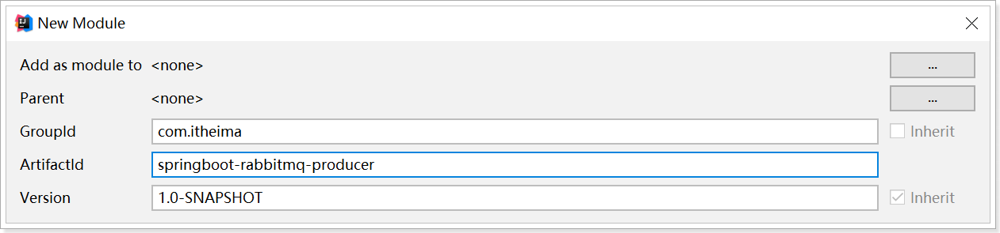
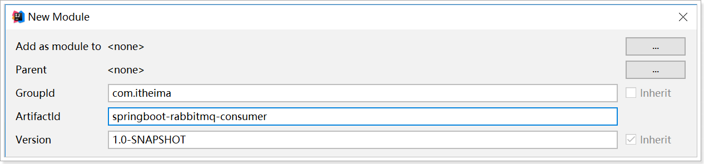

# Spring Boot整合RabbitMQ

[TOC]


## 简介

在Spring项目中，可以使用Spring-Rabbit去操作RabbitMQ
https://github.com/spring-projects/spring-amqp

尤其是在spring boot项目中只需要引入对应的amqp启动器依赖即可，方便的使用RabbitTemplate发送消息，使用注解接收消息。


*一般在开发过程中*：

**生产者工程：**

1. application.yml文件配置RabbitMQ相关信息；
2. 在生产者工程中编写配置类，用于创建交换机和队列，并进行绑定

3. 注入RabbitTemplate对象，通过RabbitTemplate对象发送消息到交换机

**生产端**

\1. 创建生产者SpringBoot工程

 \2. 引入start，依赖坐标

```xml
<dependency>
	<groupId>org.springframework.boot</groupId>
 	<artifactId>spring-boot-starter-amqp</artifactId>
</dependency>
```

 \3. 编写yml配置，基本信息配置

 \4. 定义交换机，队列以及绑定关系的配置类

 \5. 注入RabbitTemplate，调用方法，完成消息发送

**消费者工程：**

1. application.yml文件配置RabbitMQ相关信息

2. 创建消息处理类，用于接收队列中的消息并进行处理

**消费端**

 \1. 创建消费者SpringBoot工程

 \2. 引入start，依赖坐标

```xml
<dependency>
          <groupId>org.springframework.boot</groupId>
          <artifactId>spring-boot-starter-amqp</artifactId></dependency>

```

\3. 编写yml配置，基本信息配置

 \4. 定义监听类，使用@RabbitListener注解完成队列监听。

**小结**

SpringBoot提供了快速整合RabbitMQ的方式
基本信息再yml中配置，队列交互机以及绑定关系在配置类中使用Bean的方式配置
生产端直接注入RabbitTemplate完成消息发送
消费端直接使用@RabbitListener完成消息接收

## 搭建生产者工程

###  创建工程

创建生产者工程springboot-rabbitmq-producer




###  添加依赖

修改pom.xml文件内容为如下：

```xml
<?xml version="1.0" encoding="UTF-8"?>
<project xmlns="http://maven.apache.org/POM/4.0.0"
         xmlns:xsi="http://www.w3.org/2001/XMLSchema-instance"
         xsi:schemaLocation="http://maven.apache.org/POM/4.0.0 http://maven.apache.org/xsd/maven-4.0.0.xsd">
    <modelVersion>4.0.0</modelVersion>
    <parent>
        <groupId>org.springframework.boot</groupId>
        <artifactId>spring-boot-starter-parent</artifactId>
        <version>2.1.4.RELEASE</version>
    </parent>
    <groupId>com.itheima</groupId>
    <artifactId>springboot-rabbitmq-producer</artifactId>
    <version>1.0-SNAPSHOT</version>

    <dependencies>
        <dependency>
            <groupId>org.springframework.boot</groupId>
            <artifactId>spring-boot-starter-amqp</artifactId>
        </dependency>
        <dependency>
            <groupId>org.springframework.boot</groupId>
            <artifactId>spring-boot-starter-test</artifactId>
        </dependency>
    </dependencies>
</project>
```


###  启动类

```java
package com.itheima.rabbitmq;

import org.springframework.boot.SpringApplication;
import org.springframework.boot.autoconfigure.SpringBootApplication;

@SpringBootApplication
public class ProducerApplication {
    public static void main(String[] args) {
        SpringApplication.run(ProducerApplication.class);
    }
}

```


###  配置RabbitMQ

#### 1）配置文件

创建application.yml，内容如下：

```yml
spring:
  rabbitmq:
    host: localhost
    port: 5672
    virtual-host: /itcast
    username: heima
    password: heima
```


#### 2）绑定交换机和队列

创建RabbitMQ队列与交换机绑定的配置类com.itheima.rabbitmq.config.RabbitMQConfig

```java
package com.itheima.rabbitmq.config;

import org.springframework.amqp.core.*;
import org.springframework.beans.factory.annotation.Qualifier;
import org.springframework.context.annotation.Bean;
import org.springframework.context.annotation.Configuration;

@Configuration
public class RabbitMQConfig {
    //交换机名称
    public static final String ITEM_TOPIC_EXCHANGE = "item_topic_exchange";
    //队列名称
    public static final String ITEM_QUEUE = "item_queue";

    //声明交换机
    @Bean("itemTopicExchange")
    public Exchange topicExchange(){
        return ExchangeBuilder.topicExchange(ITEM_TOPIC_EXCHANGE).durable(true).build();
    }

    //声明队列
    @Bean("itemQueue")
    public Queue itemQueue(){
        return QueueBuilder.durable(ITEM_QUEUE).build();
    }

    //绑定队列和交换机
    @Bean
    public Binding itemQueueExchange(@Qualifier("itemQueue") Queue queue,
                                     @Qualifier("itemTopicExchange") Exchange exchange){
        return BindingBuilder.bind(queue).to(exchange).with("item.#").noargs();
    }

}
```


##  搭建消费者工程

### 创建工程

创建消费者工程springboot-rabbitmq-consumer




### 添加依赖

修改pom.xml文件内容为如下：

```xml
<?xml version="1.0" encoding="UTF-8"?>
<project xmlns="http://maven.apache.org/POM/4.0.0"
         xmlns:xsi="http://www.w3.org/2001/XMLSchema-instance"
         xsi:schemaLocation="http://maven.apache.org/POM/4.0.0 http://maven.apache.org/xsd/maven-4.0.0.xsd">
    <modelVersion>4.0.0</modelVersion>
    <parent>
        <groupId>org.springframework.boot</groupId>
        <artifactId>spring-boot-starter-parent</artifactId>
        <version>2.1.4.RELEASE</version>
    </parent>
    <groupId>com.itheima</groupId>
    <artifactId>springboot-rabbitmq-consumer</artifactId>
    <version>1.0-SNAPSHOT</version>

    <dependencies>
        <dependency>
            <groupId>org.springframework.boot</groupId>
            <artifactId>spring-boot-starter-amqp</artifactId>
        </dependency>
    </dependencies>

</project>
```


### 启动类

```java
package com.itheima.rabbitmq;

import org.springframework.boot.SpringApplication;
import org.springframework.boot.autoconfigure.SpringBootApplication;

@SpringBootApplication
public class ConsumerApplication {
    public static void main(String[] args) {
        SpringApplication.run(ConsumerApplication.class);
    }
}
```


### 配置RabbitMQ

创建application.yml，内容如下：

```yml
spring:
  rabbitmq:
    host: localhost
    port: 5672
    virtual-host: /itcast
    username: heima
    password: heima
```


###  消息监听处理类

编写消息监听器com.itheima.rabbitmq.listener.MyListener

```java
package com.itheima.rabbitmq.listener;

import org.springframework.amqp.rabbit.annotation.RabbitListener;
import org.springframework.stereotype.Component;

@Component
public class MyListener {

    /**
     * 监听某个队列的消息
     * @param message 接收到的消息
     */
    @RabbitListener(queues = "item_queue")
    public void myListener1(String message){
        System.out.println("消费者接收到的消息为：" + message);
    }
}

```


##  测试

在生产者工程springboot-rabbitmq-producer中创建测试类，发送消息：

```java
package com.itheima.rabbitmq;

import com.itheima.rabbitmq.config.RabbitMQConfig;
import org.junit.Test;
import org.junit.runner.RunWith;
import org.springframework.amqp.rabbit.core.RabbitTemplate;
import org.springframework.beans.factory.annotation.Autowired;
import org.springframework.boot.test.context.SpringBootTest;
import org.springframework.test.context.junit4.SpringRunner;

@RunWith(SpringRunner.class)
@SpringBootTest
public class RabbitMQTest {

    @Autowired
    private RabbitTemplate rabbitTemplate;

    @Test
    public void test(){
        rabbitTemplate.convertAndSend(RabbitMQConfig.ITEM_TOPIC_EXCHANGE, "item.insert", "商品新增，routing key 为item.insert");
        rabbitTemplate.convertAndSend(RabbitMQConfig.ITEM_TOPIC_EXCHANGE, "item.update", "商品修改，routing key 为item.update");
        rabbitTemplate.convertAndSend(RabbitMQConfig.ITEM_TOPIC_EXCHANGE, "item.delete", "商品删除，routing key 为item.delete");
    }
}
```


先运行上述测试程序（交换机和队列才能先被声明和绑定），然后启动消费者；在消费者工程springboot-rabbitmq-consumer中控制台查看是否接收到对应消息。


另外；也可以在RabbitMQ的管理控制台中查看到交换机与队列的绑定：

