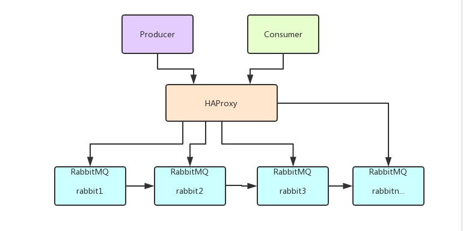

# 3.RabbitMQ集群搭建

摘要：实际生产应用中都会采用消息队列的集群方案，如果选择RabbitMQ那么有必要了解下它的集群方案原理

一般来说，如果只是为了学习RabbitMQ或者验证业务工程的正确性那么在本地环境或者测试环境上使用其单实例部署就可以了，但是出于MQ中间件本身的可靠性、并发性、吞吐量和消息堆积能力等问题的考虑，在生产环境上一般都会考虑使用RabbitMQ的集群方案。

### 3.1 集群方案的原理

RabbitMQ这款消息队列中间件产品本身是基于Erlang编写，Erlang语言天生具备分布式特性（通过同步Erlang集群各节点的magic cookie来实现）。因此，RabbitMQ天然支持Clustering。这使得RabbitMQ本身不需要像ActiveMQ、Kafka那样通过ZooKeeper分别来实现HA方案和保存集群的元数据。集群是保证可靠性的一种方式，同时可以通过水平扩展以达到增加消息吞吐量能力的目的。




### 3.2 单机多实例部署

由于某些因素的限制，有时候你不得不在一台机器上去搭建一个rabbitmq集群，这个有点类似zookeeper的单机版。真实生成环境还是要配成多机集群的。有关怎么配置多机集群的可以参考其他的资料，这里主要论述如何在单机中配置多个rabbitmq实例。

主要参考官方文档：https://www.rabbitmq.com/clustering.html

首先确保RabbitMQ运行没有问题

```shell
[root@super ~]# rabbitmqctl status
Status of node rabbit@super ...
[{pid,10232},
 {running_applications,
     [{rabbitmq_management,"RabbitMQ Management Console","3.6.5"},
      {rabbitmq_web_dispatch,"RabbitMQ Web Dispatcher","3.6.5"},
      {webmachine,"webmachine","1.10.3"},
      {mochiweb,"MochiMedia Web Server","2.13.1"},
      {rabbitmq_management_agent,"RabbitMQ Management Agent","3.6.5"},
      {rabbit,"RabbitMQ","3.6.5"},
      {os_mon,"CPO  CXC 138 46","2.4"},
      {syntax_tools,"Syntax tools","1.7"},
      {inets,"INETS  CXC 138 49","6.2"},
      {amqp_client,"RabbitMQ AMQP Client","3.6.5"},
      {rabbit_common,[],"3.6.5"},
      {ssl,"Erlang/OTP SSL application","7.3"},
      {public_key,"Public key infrastructure","1.1.1"},
      {asn1,"The Erlang ASN1 compiler version 4.0.2","4.0.2"},
      {ranch,"Socket acceptor pool for TCP protocols.","1.2.1"},
      {mnesia,"MNESIA  CXC 138 12","4.13.3"},
      {compiler,"ERTS  CXC 138 10","6.0.3"},
      {crypto,"CRYPTO","3.6.3"},
      {xmerl,"XML parser","1.3.10"},
      {sasl,"SASL  CXC 138 11","2.7"},
      {stdlib,"ERTS  CXC 138 10","2.8"},
      {kernel,"ERTS  CXC 138 10","4.2"}]},
 {os,{unix,linux}},
 {erlang_version,
     "Erlang/OTP 18 [erts-7.3] [source] [64-bit] [async-threads:64] [hipe] [kernel-poll:true]\n"},
 {memory,
     [{total,56066752},
      {connection_readers,0},
      {connection_writers,0},
      {connection_channels,0},
      {connection_other,2680},
      {queue_procs,268248},
      {queue_slave_procs,0},
      {plugins,1131936},
      {other_proc,18144280},
      {mnesia,125304},
      {mgmt_db,921312},
      {msg_index,69440},
      {other_ets,1413664},
      {binary,755736},
      {code,27824046},
      {atom,1000601},
      {other_system,4409505}]},
 {alarms,[]},
 {listeners,[{clustering,25672,"::"},{amqp,5672,"::"}]},
 {vm_memory_high_watermark,0.4},
 {vm_memory_limit,411294105},
 {disk_free_limit,50000000},
 {disk_free,13270233088},
 {file_descriptors,
     [{total_limit,924},{total_used,6},{sockets_limit,829},{sockets_used,0}]},
 {processes,[{limit,1048576},{used,262}]},
 {run_queue,0},
 {uptime,43651},
 {kernel,{net_ticktime,60}}]
```

停止rabbitmq服务

```shell
[root@super sbin]# service rabbitmq-server stop
Stopping rabbitmq-server: rabbitmq-server.

```


启动第一个节点：

```shell
[root@super sbin]# RABBITMQ_NODE_PORT=5673 RABBITMQ_NODENAME=rabbit1 rabbitmq-server start

              RabbitMQ 3.6.5. Copyright (C) 2007-2016 Pivotal Software, Inc.
  ##  ##      Licensed under the MPL.  See http://www.rabbitmq.com/
  ##  ##
  ##########  Logs: /var/log/rabbitmq/rabbit1.log
  ######  ##        /var/log/rabbitmq/rabbit1-sasl.log
  ##########
              Starting broker...
 completed with 6 plugins.
```

启动第二个节点：

> web管理插件端口占用,所以还要指定其web插件占用的端口号。

```shell
[root@super ~]# RABBITMQ_NODE_PORT=5674 RABBITMQ_SERVER_START_ARGS="-rabbitmq_management listener [{port,15674}]" RABBITMQ_NODENAME=rabbit2 rabbitmq-server start

              RabbitMQ 3.6.5. Copyright (C) 2007-2016 Pivotal Software, Inc.
  ##  ##      Licensed under the MPL.  See http://www.rabbitmq.com/
  ##  ##
  ##########  Logs: /var/log/rabbitmq/rabbit2.log
  ######  ##        /var/log/rabbitmq/rabbit2-sasl.log
  ##########
              Starting broker...
 completed with 6 plugins.

```

结束命令：

```shell
rabbitmqctl -n rabbit1 stop
rabbitmqctl -n rabbit2 stop
```


rabbit1操作作为主节点：

```shell
[root@super ~]# rabbitmqctl -n rabbit1 stop_app  
Stopping node rabbit1@super ...
[root@super ~]# rabbitmqctl -n rabbit1 reset	 
Resetting node rabbit1@super ...
[root@super ~]# rabbitmqctl -n rabbit1 start_app
Starting node rabbit1@super ...
[root@super ~]# 
```

rabbit2操作为从节点：

```shell
[root@super ~]# rabbitmqctl -n rabbit2 stop_app
Stopping node rabbit2@super ...
[root@super ~]# rabbitmqctl -n rabbit2 reset
Resetting node rabbit2@super ...
[root@super ~]# rabbitmqctl -n rabbit2 join_cluster rabbit1@'super' ###''内是主机名换成自己的
Clustering node rabbit2@super with rabbit1@super ...
[root@super ~]# rabbitmqctl -n rabbit2 start_app
Starting node rabbit2@super ...

```

查看集群状态：

```
[root@super ~]# rabbitmqctl cluster_status -n rabbit1
Cluster status of node rabbit1@super ...
[{nodes,[{disc,[rabbit1@super,rabbit2@super]}]},
 {running_nodes,[rabbit2@super,rabbit1@super]},
 {cluster_name,<<"rabbit1@super">>},
 {partitions,[]},
 {alarms,[{rabbit2@super,[]},{rabbit1@super,[]}]}]
```

web监控：


### 3.3 集群管理

**rabbitmqctl join_cluster {cluster_node} [–ram]**
将节点加入指定集群中。在这个命令执行前需要停止RabbitMQ应用并重置节点。

**rabbitmqctl cluster_status**
显示集群的状态。

**rabbitmqctl change_cluster_node_type {disc|ram}**
修改集群节点的类型。在这个命令执行前需要停止RabbitMQ应用。

**rabbitmqctl forget_cluster_node [–offline]**
将节点从集群中删除，允许离线执行。

**rabbitmqctl update_cluster_nodes {clusternode}**

在集群中的节点应用启动前咨询clusternode节点的最新信息，并更新相应的集群信息。这个和join_cluster不同，它不加入集群。考虑这样一种情况，节点A和节点B都在集群中，当节点A离线了，节点C又和节点B组成了一个集群，然后节点B又离开了集群，当A醒来的时候，它会尝试联系节点B，但是这样会失败，因为节点B已经不在集群中了。

**rabbitmqctl cancel_sync_queue [-p vhost] {queue}**
取消队列queue同步镜像的操作。

**rabbitmqctl set_cluster_name {name}**
设置集群名称。集群名称在客户端连接时会通报给客户端。Federation和Shovel插件也会有用到集群名称的地方。集群名称默认是集群中第一个节点的名称，通过这个命令可以重新设置。

### 3.4 RabbitMQ镜像集群配置

> 上面已经完成RabbitMQ默认集群模式，但并不保证队列的高可用性，尽管交换机、绑定这些可以复制到集群里的任何一个节点，但是队列内容不会复制。虽然该模式解决一项目组节点压力，但队列节点宕机直接导致该队列无法应用，只能等待重启，所以要想在队列节点宕机或故障也能正常应用，就要复制队列内容到集群里的每个节点，必须要创建镜像队列。
>
> 镜像队列是基于普通的集群模式的，然后再添加一些策略，所以你还是得先配置普通集群，然后才能设置镜像队列，我们就以上面的集群接着做。

**设置的镜像队列可以通过开启的网页的管理端Admin->Policies，也可以通过命令。**

> rabbitmqctl set_policy my_ha "^" '{"ha-mode":"all"}'


> - Name:策略名称
> - Pattern：匹配的规则，如果是匹配所有的队列，是^.
> - Definition:使用ha-mode模式中的all，也就是同步所有匹配的队列。问号链接帮助文档。

### 3.5 负载均衡-HAProxy

HAProxy提供高可用性、负载均衡以及基于TCP和HTTP应用的代理，支持虚拟主机，它是免费、快速并且可靠的一种解决方案,包括Twitter，Reddit，StackOverflow，GitHub在内的多家知名互联网公司在使用。HAProxy实现了一种事件驱动、单一进程模型，此模型支持非常大的并发连接数。

##### 3.5.1  安装HAProxy

```shell
//下载依赖包
yum install gcc vim wget
//上传haproxy源码包
//解压
tar -zxvf haproxy-1.6.5.tar.gz -C /usr/local
//进入目录、进行编译、安装
cd /usr/local/haproxy-1.6.5
make TARGET=linux31 PREFIX=/usr/local/haproxy
make install PREFIX=/usr/local/haproxy
mkdir /etc/haproxy
//赋权
groupadd -r -g 149 haproxy
useradd -g haproxy -r -s /sbin/nologin -u 149 haproxy
//创建haproxy配置文件
mkdir /etc/haproxy
vim /etc/haproxy/haproxy.cfg
```


##### 3.5.2 配置HAProxy

配置文件路径：/etc/haproxy/haproxy.cfg

```shell
#logging options
global
	log 127.0.0.1 local0 info
	maxconn 5120
	chroot /usr/local/haproxy
	uid 99
	gid 99
	daemon
	quiet
	nbproc 20
	pidfile /var/run/haproxy.pid

defaults
	log global
	
	mode tcp

	option tcplog
	option dontlognull
	retries 3
	option redispatch
	maxconn 2000
	contimeout 5s
   
     clitimeout 60s

     srvtimeout 15s	
#front-end IP for consumers and producters

listen rabbitmq_cluster
	bind 0.0.0.0:5672
	
	mode tcp
	#balance url_param userid
	#balance url_param session_id check_post 64
	#balance hdr(User-Agent)
	#balance hdr(host)
	#balance hdr(Host) use_domain_only
	#balance rdp-cookie
	#balance leastconn
	#balance source //ip
	
	balance roundrobin
	
        server node1 127.0.0.1:5673 check inter 5000 rise 2 fall 2
        server node2 127.0.0.1:5674 check inter 5000 rise 2 fall 2

listen stats
	bind 172.16.98.133:8100
	mode http
	option httplog
	stats enable
	stats uri /rabbitmq-stats
	stats refresh 5s
```

启动HAproxy负载

```shell
/usr/local/haproxy/sbin/haproxy -f /etc/haproxy/haproxy.cfg
//查看haproxy进程状态
ps -ef | grep haproxy

访问如下地址对mq节点进行监控
http://172.16.98.133:8100/rabbitmq-stats
```

代码中访问mq集群地址，则变为访问haproxy地址:5672